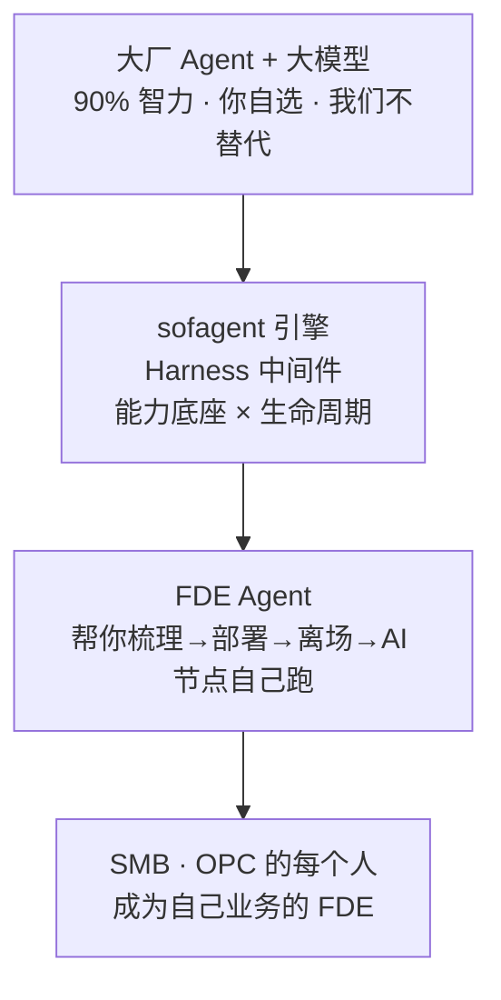
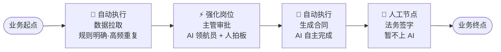

# FDE 完全指南 · 从理念到落地

> v1.2.6 · 孔放勋 · 面向想系统掌握 FDE 方法论的人。读完你能独立做一次 FDE 诊断，并能判断客户的 AI 成熟度。
> 本文档是学习手册（人读）。给 AI Agent 的操作指令见 `SKILL/SKILL.md` 与 `SKILL/skills/01-05`。
>
> **本文档的定位：FDE 诊断方法论。** 它讲清楚一件事——怎么把企业的 workflow 梳理好、判定 AI 节点、交付可运行的交付物。**诊断是起点，不是终点**：诊断交付的 ontology + workflow.yml + skills/ 会通过激活链（v1.2.5+，ACTIVATE→ORCHESTRATE→EXECUTE→SUSTAIN）自动注册为企业 SubAgent、编排成可运行工作流。本文档专注"把诊断做对"，激活链部分见 [5.11 交付之后](#511-交付之后激活链从交付物到自动运转v125-规划中)（完整设计见仓库内 docs/guides/fde-activation-chain.md，FDE 独立部署时不随包分发）。

---

## 第一章：为什么要 FDE

### 1.1 AI 进企业的真问题

企业 AI 落地失败的首要原因不是技术选错，是**顺序搞反了**——上来就选模型、搭平台、买 Agent，结果发现没人用。

一个帮几百家企业跑通 AI 落地的创始人发现：真正的瓶颈从来不是「AI 不够好」，而是**企业还没搞清楚自己的业务流程，就想让 AI 来接管**。80 人销售团队仅加早会 5 分钟提问环节（未采购任何 AI 工具），四周见效——联系率从 27% 升到 81%。

「管理动作先行」——先让人跑通流程，再用 AI 加速。FDE 方法论正是照着这个逻辑设计的：第一步梳理工作流，本身就是管理动作。

### 1.2 FDE 是什么

FDE 全称 Forward Deployed Engineer（前线部署工程师），源自 Palantir 的交付纪律——工程师驻场客户，把通用产品变成客户能用的方案。

sofagent 把它从岗位 title 升级为能力模型，再升级为**常驻 FDE Agent**：

- 人（FDE）帮客户部署完离场，FDE Agent 留在客户那里继续干活
- 梳理好的工作流在跑、合规自检在跑、周度巡检在跑
- 客户得到的不是一个工具，是一个 7×24 在线的 FDE Agent

**最终目标不是培养更多 FDE，而是让 SMB 与 OPC 的每个人，都具备 FDE 的能力：掌握完整上下文、打破岗位边界、对结果负责。**

### 1.3 FDE 解决的核心矛盾

AI 能力强但不可控 vs 企业需要可控可审计。FDE 用四件事化解：

| 矛盾 | FDE 的做法 |
|------|-----------|
| 不知道 AI 该干什么 | 逐岗位梳理工作流，识别 AI 节点 |
| 不知道 AI 干得对不对 | 审计引擎（git diff 硬证据）每次变更自动审计 |
| 不知道经验怎么留 | think.md 反思库，每次任务沉淀教训 |
| 不知道边界在哪 | knowledge-domain 访问边界 + 数据主权审计 |

### 1.4 案例：一纸一会两周

某 80 人销售团队，客户联系率只有 27%。

| 步骤 | 怎么做 |
|------|--------|
| **一纸** | 写下当前最痛的一个业务场景：「客户联系率只有 27%」 |
| **一会** | 第二天早会执行一个最小动作：「每人汇报 5 个客户跟进情况」 |
| **两周** | 不看 AI、不买工具，只看数据变化 → 4 周后联系率 27% → 81% |

启示：先让流程本身变好，AI 是加速器不是发动机。

### 1.5 三个常见误解

| ❌ 误解 | ✅ 正确认知 |
|--------|-----------|
| 这是个 Git 审计安全工具 | 审计引擎只是 FDE Agent「一底座·三引擎」中的一环，单独拿出来没有意义 |
| 这是要跟大厂 Agent 竞争 | 我们不造 Agent，骑在大厂 Agent + 模型之上做问责底座 |
| 这是卖软件的 | 这是开源（MIT）的 FDE Agent——目标是让每个人都能成为 FDE |

### 1.6 心智模型



**sofagent 是「能力底座 × 生命周期」双层架构**——这是理解整份指南的关键：

| 层 | 是什么 | 回答什么问题 | 本文档覆盖 |
|:--:|--------|-------------|-----------|
| **层 1 · 能力底座** | 一底座·三引擎（约束底座 + 审计/回溯/进化引擎） | "怎么保证每次执行都做对" | 贯穿（审计引擎是 FDE 的问责底座） |
| **层 2 · 生命周期** | 诊断 → 激活 → 编排 → 执行 → 进化 | "企业 AI 从诊断到自运转怎么走" | 本文档 = 第一环（诊断）；激活链见 [5.11](#511-交付之后激活链从交付物到自动运转v125-规划中) |

> **引擎为生命周期提供能力，生命周期让引擎有活干**——审计引擎在执行阶段每步把关，进化引擎在闭环阶段吃 think.md 回写。能力底座是"怎么保证做对"，生命周期是"让什么跑起来"。FDE 方法论（四阶段十二步，本指南第一章到第六章展开）就是生命周期第一环（诊断）的完整展开。

### 1.7 什么时候该上 FDE

FDE 有巨大前期成本，只在三种情况成立：

1. **深度实施需求 + 毛利足以吸收成本**——常规产品自助就能跑通的场景，不必上 FDE
2. **强监管行业**（金融 / 医疗 / 国防 / 政务）——合规要求必须现场定制
3. **需要探路的全新垂直**——产品还没覆盖的行业，FDE 去打样

**客户分层打法**：

| 维度 | SMB / 小客户 | 中型客户 | 大型 / 央国企 |
|------|------------|---------|-------------|
| 团队配置 | 1 名 FDE + agent 舰队 | pod：FDE + PM + 数据工程师 | 全队 + RACI + 指导委员会 |
| 切入方式 | 低价起步 + 自助试用 | 业务驱动 + 多线程 | 高层关系 + 灯塔 POC |
| 第一个项目 | 单一高频关键场景 × 一个用例 | 一个部门 × 有清晰 KPI 的流程 | 灯塔 POC（有限范围 + 内部标杆） |

> 📌 中型客户（专精特新小巨人）是 FDE 甜点区——有大企业的复杂度，但没有大企业的预算浪费。

**客户就绪三前提**（缺一不可，否则部署必败）：

| 前提 | 检查点 | 没满足怎么办 |
|------|--------|------------|
| 流程已标准化 | 合同怎么审、风险怎么分级、指标怎么权重——先定义清楚 | 先帮客户做流程梳理，不急着上 Agent |
| 数据已打通 | ERP / MES / 财务 / 银行网银不能是孤岛 | 评估数据打通成本，或缩小覆盖范围 |
| 权限边界已划定 | 高敏感场景明确自动化范围 + 人工确认节点 | 风险分级配置时一起定 |

> 🎯 切入顺序：非车间场景（法务 / 采购 / 财务）先跑通——这类「隐形生产线」规则明确、重复频繁、风险敏感，是 Agent 最容易出效果的入口。车间/产线场景后做。

### 1.8 企业 AI 成熟度三级台阶

判断客户成熟度，决定 FDE 帮到多深：

| 级别 | 特征 | 典型风险 | FDE 怎么帮 |
|:--:|------|------|------|
| 第一级·替换 | 把 AI 当便宜员工 1:1 替换，仅以降本为目标 | 责任悬空。Klarna 裁 700 人用 AI 替代，一年后服务质量崩盘被迫召回 | 最小安装：审计引擎 + 约束底座，确保每个 AI 操作可追溯、有负责人 |
| 第二级·增强 | 全员配 AI 工具，但流程和组织没变（德勤 2026：84% 企业停在这一级） | AI 只提高手速，没改变流程。文案快了审核更累 | 标准安装：审计 + 编排 + Skill + AI 知识库，建立完整责任链路 |
| 第三级·重构 | 围绕「活儿怎么流转」重画岗位、审批、绩效。人机混编组队 | — | 深度 FDE：三层实体稳定后，AI 知识库自动积累最佳实践，Skill 自进化 |

> 84% 的企业停在第二级。目标是让企业跨到第三级：不只装 AI，还装上责任机制。

---

## 第二章：五要素深挖

### 2.1 先找主战场

AI 不是司令员只是援军。先集中资源打一场能计算结果的小仗，问三个问题定位突破口：

1. 哪个环节卡住了企业？
2. 在不增加人手的前提下，AI 能承担 30% 还是 80%？
3. 打赢之后（可量化结果）再复制到下一个流程？

跑通一个流程比铺开十个半成品更有说服力。

### 2.2 五要素

对每个节点，把五个要素全部填满：

| 要素 | 追问 |
|------|------|
| **输入** | 这个节点接收什么信息/数据？谁给的？ |
| **输出** | 这个节点产出什么？交给谁？ |
| **负责人** | 谁在做这件事？什么岗位/职级？ |
| **耗时** | 每次花多长时间？每天/每周做几次？ |
| **最卡的地方** | 最大的难点/最烦人的地方是什么？ |

### 2.3 追问话术

- 「这个岗位每天第一件事做什么？」
- 「做完上一步，下一步是什么？」
- 「这一步输入是什么？谁给你的？输出是什么？交给谁？」
- 「这一步花多长时间？最烦人的地方是什么？」

五要素全部填满 → 换下一个岗位。所有关键岗位全部填满 → 进入第三章构建本体结构。

### 2.4 案例：两个节点的五要素

**客服节点**：

| 要素 | 内容 |
|------|------|
| 输入 | 用户工单 + 历史对话记录（客服系统自动生成） |
| 输出 | 工单处理结果 + 回执 → 推回用户 |
| 负责人 | 客服专员（3 人轮班） |
| 耗时 | 每单约 15 分钟，每天 40 单 |
| 最卡的地方 | 跨系统查订单状态、重复回答常见问题 |

**报表节点**：

| 要素 | 内容 |
|------|------|
| 输入 | 各业务系统原始数据（手工导出） |
| 输出 | 周报 PDF → 发给部门主管 |
| 负责人 | 数据分析师 |
| 耗时 | 每次 2 小时，每周 1 次 |
| 最卡的地方 | 跨系统手工搬运数据、格式反复调整 |

### 2.5 产出

「完整工作流节点图」——每个节点有完整五要素，按岗位分组。这是后面一切判断的原料。

---

## 第三章：本体结构构建

### 3.1 什么是本体结构

类比城市规划中的「用地性质图」——每块地是住宅/商业/工业，决定了这块地能干什么、归谁管。

**本体结构 = 企业知识的「用地性质图」**——每个知识节点是什么类型、归哪个业务域、能看什么不能看什么。

> 📌 本体 ≠ 知识图谱数据库：本体的核心是**业务刻画**——完整呈现业务领域的客观事实与关联关系（如「客户下单 → 订单含哪些产品 → 产品由哪些零部件构成 → 零部件从哪些供应商采购」）。知识图谱只是它的一种技术实现。

### 3.2 适配性判断

多数中小企业**不必**建全量本体结构——本体结构搭建 + 配套 Agent 开发的投入高，中小企业流程相对简单，投入产出比严重失衡。

动手前先判两件事：

1. 是否需要**业务域级 Agent Runtime**（深度提效、规避人为干预损耗）？
2. 是否作为**一号位工程**推进？

若两者皆否，用**轻量 Agent + 企业 Skill**（个人增强节点 / harness 层）即可满足需求，无需本体结构建设。

### 3.3 业务四问（入场必填）

在补节点字段之前，先用四问把「企业到底在做什么业务」钉死：

1. **关键业务对象有哪些？** —— 客户 / 商品 / 订单 / 供应商……列清实体类型
2. **每个对象的归属负责人是谁？** —— 谁对这个结果负责
3. **权威数据来源系统是哪个？** —— ERP / CRM / 自研 / Excel，避免 Agent 从非权威源编造
4. **动作风险等级？** —— 每个业务动作定级：低（查询/只读）/ 中高（写操作/审批/对外发）

### 3.4 Object Type 候选筛选

> 💡 来源：Palantir Ontology Object Type 实操方法论（2026-08）

业务四问列出的名词不是全部都能当 Object Type——**数据库表 ≠ 业务对象**。供应商表只有字段，但「供应商」这个业务对象要大得多：采购看供货、财务看付款、法务看合同、质量看批次。Object Type 表达的是**业务身份**，不是表结构翻译。

**五条筛选标准**（缺两三条就要谨慎）：

| # | 标准 | 判问 |
|---|------|------|
| 1 | 业务可命名 | 业务人员叫得出这个名字吗？ |
| 2 | 系统可查询 | 系统里能稳定查到它吗？ |
| 3 | AI 可推理 | AI 能围绕它做推理吗？ |
| 4 | 动作可落地 | 后面的业务动作能落在它身上吗？ |
| 5 | 责任可绑定 | 权限和责任能绑定到它身上吗？ |

**动作记录 vs 业务对象**——有些名词（purchase / request / approval）听起来像对象，其实只是动作留下的记录。用五个问题区分：

- 有没有**生命周期**？有没有**独立状态**？有没有 **owner**？
- 有没有被**多人查询和复盘**？有没有可能被**再次审批、撤回、会签或驳回**？
- 答不上来 → 先放动作日志，不建 Object Type。

**排除项**（数据工程产物不能抢 Object Type 位置）：`supplier_table` / `tmp` / `order_merge` / `monthly` / `risk_report`——业务人员不会围绕它负责，AI 也不该围绕它做决策。可以做支撑数据源，不做 Object Type。

**候选表八列**（每圈出一个候选对象，必须填出至少一个真实实例）：

| 候选名称 | 业务定义 | 真实实例 | 来源系统 | 关键状态 | 关联动作 | owner | 暂缓原因 |
|----------|---------|---------|---------|---------|---------|-------|---------|

> **设计顺序铁律**：先定对象身份，再定 property（属性）——属性口径才有地方落。

### 3.5 怎么从五要素推导出本体

五要素 → entity（实体）→ concept（概念）→ relations（关系）。

**推演示例**：从「合同审核」节点出发

- §4 五要素：输入 = 合同草稿（法务系统）；输出 = 审核结论（推回业务）；负责人 = 法务专员；耗时 = 每次 1 小时；最卡 = 条款逐条核对
- 推导出：「合同」entity（业务对象）→「审核通过」action（动作）→「belongs_to 法务域」relation（归属）
- 补上边界：「knowledge-domain include = 合同库、审批流；exclude = 人事档案」

### 3.6 entity / concept / relations 怎么建

**entity 页模板**（业务实体）：

```markdown
---
type: entity
name: 合同
domain: 法务
relations:
  belongs_to: [订单, 客户]
  has_many: [审批记录]
knowledge-domain:
  include: [合同库, 审批流]
  exclude: [人事档案]
created_at: 2026-08-01
updated_at: 2026-08-01
---
# 合同
## 定义
...
```

**concept 页模板**（业务概念）：

```markdown
---
type: concept
name: 审批流
domain: 法务
relations:
  depends_on: [合同]
created_at: 2026-08-01
updated_at: 2026-08-01
---
# 审批流
## 定义
...
```

**relations 的三种类型**：

| 类型 | 含义 | 示例 |
|------|------|------|
| `belongs_to` | 输入从哪个节点来 | 合同 belongs_to 订单 |
| `has_many` | 产出交给哪些节点 | 合同 has_many 审批记录 |
| `depends_on` | 依赖哪个概念/实体 | 审批流 depends_on 合同 |

### 3.7 业务动作访谈表（现场交付物）

把业务方口中的「愿望」拆成可执行的动作链——监测 → 找物料 → 算订单 → 生成建议 → 审批 → 写回。每个动作是本体结构的一个 action 节点，链的衔接关系是 relations。

| 栏 | 问题 |
|:--|:--|
| 谁触发 | 什么角色/事件发起这个动作 |
| 触发条件 | 什么信号/阈值/时间到了才动 |
| 读哪些系统 | ERP/CRM/Excel，权威源是哪个 |
| 影响哪些业务对象 | 写哪些 objects（客户/订单/库存） |
| 输出什么 | 建议单/审批流/报表 |
| 写回哪里 | 回写业务系统（写比读高风险一个量级） |
| 出错谁负责 | 责任到人 |
| 怎么审批 | 人机分工：哪步必须人确认 |
| 怎么复盘 | 结果好不好谁说了算 |

> 这张表是节点 frontmatter 的事实来源——访谈填完，frontmatter 的输入/产出/风险等级几乎是照抄。第一个动作可能要聊半天（翻遍上下游系统），第十个动作半小时：动作链骨架已搭好。

### 3.8 案例：供应链动作链

一家制造企业，业务方说「希望 AI 帮我管采购」。

拆成动作链：**监测库存 → 找物料 → 算订单 → 生成建议 → 审批 → 写回 ERP**。

- 每个动作 = 一个 action 节点
- 「生成建议」的输入 = 库存监测结果 + 供应商报价（belongs_to）
- 「审批」的 output = 采购单（has_many 写回 ERP）
- 「写回 ERP」风险等级 = 中高（写操作），必须人工确认

本体结构建完，企业从「采购靠人拍脑袋」变成「采购有据可依、责任到人」。

---

## 第四章：节点判定与量化

### 4.1 三问判定

对每个节点问三个问题：

1. 输入能从系统自动取到吗？
2. 处理规则能写清楚吗？
3. 输出能自动推到人手里吗？

| 三问 | 🔄 自动执行 | ⚡ 强化岗位 | 👤 暂不动 |
|------|:---:|:---:|:---:|
| 输入能自动取到？ | ✅ | ✅/❌ | ❌ |
| 处理规则能写清？ | ✅ | ✅ | ❌ |
| 输出能自动推送？ | ✅ | ❌（需人确认） | ❌ |

三个全「是」→ 🔄 自动执行（AI 自主，如数据拉取、报表生成）；两个「是」→ ⚡ 强化岗位（AI 做领航员辅助人，如设计稿审核、合同检查）；否则 → 👤 暂时不动（不量化）。

### 4.1.1 梳理完成的 workflow 全景图

**这是 FDE 诊断的最终产出**——全部节点判定完，一条业务链路由三种节点交替组成（🔄 自动执行 / ⚡ 强化岗位 / 👤 人工节点）：



| 节点类型 | 三问判定 | 谁在执行 | 例子 |
|---------|:---:|---------|------|
| 🔄 **自动执行** | 三个「是」 | AI 自主跑完，Goal 达成自动收工 | 数据拉取、报表生成、格式转换 |
| ⚡ **强化岗位** | 两个「是」 | AI 跑 Loop，人在关键环节介入（审批/检查/兜底） | 设计稿审核、合同条款检查、风险定级 |
| 👤 **人工节点** | 否则 | 人完成，当前不适合上 AI | 法务签字、对外沟通、最终拍板 |

> **Human-in-the-loop 不是"loop 里塞了人"，是 workflow 里 loop 节点和 human 节点的协同编排**——一条 workflow = 不同类型节点串联的路径。判定完这张图，就是激活链（v1.2.5+）的输入：🔄/⚡ 节点注册为企业 SubAgent，⚡ 节点的"人确认"变成 HITL 中断点。

### 4.2 判定案例

| 节点 | 输入自动取？ | 规则可写清？ | 输出自动推？ | 判定 |
|------|:---:|:---:|:---:|:---:|
| 数据拉取 | ✅ | ✅ | ✅ | 🔄 |
| 报表生成 | ✅ | ✅ | ✅ | 🔄 |
| 设计稿审核 | ✅ | ✅ | ❌ 需人确认 | ⚡ |
| 合同条款检查 | ✅ | ✅ | ❌ 需法务终审 | ⚡ |
| 客户关系维护 | ❌ 靠人脉 | ❌ 靠人情 | ❌ | 👤 |

### 4.3 量化：年节省多少？

- 🔄 **按替人成本算**：`年节省 = 日耗时 × 时薪 × 年工作日（250）`
- ⚡ **按升级成本算**：招一个能驾驭 AI 的人的年薪 / 培训周期

每个 🔄/⚡ 节点填四个字段：**当前成本 / AI 后成本 / 年节省 / 回本周期**。

### 4.4 量化案例（5 个）

| 节点 | 口径 | 计算 | 年节省 |
|------|------|------|--------|
| 数据录入 | 🔄 替人成本 | 20 分钟 × 每天 8 次 × 时薪 50 × 250 | ≈ 3.3 万 |
| 报表生成 | 🔄 替人成本 | 2 小时 × 每周 1 次 × 时薪 80 × 52 | ≈ 0.8 万 |
| 设计稿审核 | ⚡ 升级成本 | 招聘溢价 + 培训周期 | 视岗位而定 |
| 合同检查 | ⚡ 升级成本 | AI 预检省法务 60% 时间 | 视法务薪资而定 |
| 客服工单 | 🔄 替人成本 | 5 分钟 × 每天 40 单 × 时薪 40 × 250 | ≈ 3.3 万 |

### 4.5 常见坑

| 坑 | 表现 | 正确做法 |
|----|------|---------|
| 高估自动化 | 输入还要人手工整理就判 🔄 | 输入不能自动取到 → 至少降一档 |
| 漏掉人工确认 | 输出涉及钱/权益/合规但判 🔄 | 六类场景（钱/权益/合规/人事/医疗/法律）必须 human-in-the-loop |
| 时薪拍脑袋 | 用平均工资代替岗位真实薪资 | 拿真实职级薪资 |
| 年工作日拍脑袋 | 一律 365 | 用 250，高频节点按实际频次算 |

---

## 第五章：三层交付

### 5.1 交付什么：三层实体

每个 🔄/⚡ 节点都要有三层实实在在的实体：

| 层 | 文件 | 给谁读 | 创建时机 |
|----|------|--------|---------|
| 📄 文档层 | `nodes/[节点名].md` | 人读 + 编排引擎读 | §7 |
| 🧠 Skill 层 | `skills/[节点名]/SKILL.md` | AI 读（节点的大脑） | §7-§8 |
| 🔴 运行层 | 设备上的 session | 活的（SubAgent / AI 领航员） | §8 |

### 5.2 先跑通，后沉淀 Skill（黄金顺序）

**先做产物，后做 Scale。** 在生成任何 Skill 文件之前，先走完一步：用 Agent 完成一次真实任务，并交付高质量产物。

- 以最高频、最痛的那个节点为起点
- 用 Agent 把真实任务从头到尾跑通一次——不是模拟，是真数据、真流程
- 确认产出达到交付标准后，再回过头来，把这次跑通过的过程抽象成 Skill 模板

**禁止一上来直接写 Skill 文档。** 凭空设计的 Skill 模板来自脑补而非实跑——看起来可能对，但在真实任务中失败的概率极高。

对应三层实体的生成顺序：

```
先：运行层（Agent 跑通真实任务，产生产物）
↓  确认跑通
中：Skill 层（把跑通过程抽象为 SKILL.md）
↓  提炼完成
后：文档层（为 Skill 补充人读文档）
```

### 5.3 部署流程（人怎么看懂）

部署的本质是「把方案变成在跑的节点」。交付给企业的部署文档应该让人看懂三件事：

1. **装了什么**——约束底座（规则注入 Agent 上下文）+ 审计引擎（每次变更自动审计）+ 编排引擎（拆任务/编排/执行）
2. **节点怎么跑**——每个 🔄/⚡ 节点的输入源、输出目标、检查点配置
3. **出事怎么办**——失败恢复路径、降级方案、谁负责

**部署检查清单**：

- [ ] 每个 AI 节点三层实体齐全，有明确主人
- [ ] 检查点已配置（默认抽检 10%，不合格 → 标记 → 反馈主人）
- [ ] 教会一个人：每个节点指定企业方主人
- [ ] 交付手册落地到企业自有平台（让企业方随时翻得到）
- [ ] 对抗性测试已跑过（prompt 注入模拟 / 权限越界 / 异常输入）

### 5.4 节点类型决策

| 节点类型 | 适用场景 | 编排方式 |
|---------|---------|------|
| 自动运行节点 | 企业无人值守设备（AI 全自动执行） | 通道 + 编排内部 API |
| 个人增强节点 | 个人开发者用 WorkBuddy/Codex 等 | 编排 CLI 入口 |

两种模式的核心约束体系完全一致——都是宪法层 + 规范层 + 反思层 + 知识库。区别只在编排触达方式。

### 5.4.1 U 盘部署：给"不懂电脑"的员工（v1.1.8+）

**三种部署场景，一种方式**——U 盘覆盖全部交付需求：

| 场景 | 用户 | 方式 |
|------|------|------|
| 装电脑 | 技术人员 | 正常安装流程，部署到电脑上就能用 |
| U 盘 | 普通员工 | sofagent + 联邦密钥 + knowledge 全在盘上，插上即用 |
| 无头设备 | 服务器/工控机 | U 盘插上别拔，Agent 一直在联邦里跑 |

**企业叙事**：「买 U 盘 → 下载 sofagent → 写盘 → 发给员工」——FDE 梳理好 workflow 节点后，一条命令烧录完整运行时到 U 盘：

```bash
sofagent-daemon create-usb-key \
  --role "财务审计节点" \
  --target /Volumes/SOFAGENT \
  --platform macos   # 或 linux / win
```

**U 盘里有什么**：Node.js 便携版 + sofagent 引擎（审计/编排/约束/回溯）+ knowledge/ 加密落盘（AES-256-GCM，明文只在内存）+ 三平台启动脚本（start.command/.sh/.bat）+ HMAC-SHA256 防篡改签名。

**插上即用**：双击启动脚本 → 全量验签（fail-closed：签名不匹配拒绝启动）→ 内存解密 knowledge（明文不落盘）→ daemon 启动（cron + 文件监听 + 联邦在线）→ 本机零残留（所有路径指向 U 盘，退出清空内存密钥）。

> 💡 **跟你的 Agent 说"帮我烧一个 XX 节点的 U 盘"**——Agent 会通过 FDE Skill 触发 `create-usb-key`。
>
> ⚠️ **安全模型**：U 盘即信任根——AES key 存 U 盘 federation.json，防的是"U 盘丢失后 knowledge/ 被非授权读取"；物理持有 U 盘 = 信任。拔掉零残留。

### 5.5 交付之后：怎么判断真的跑起来了

- **节点跑通**：每个 🔄/⚡ 节点的实际产出与预期一致
- **两周无报错**：系统连续运行两周无关键报错，且连续两天无人问操作问题

> 客户满意度 ≠ 退出条件——客户满意可能只是因为 FDE 一直在无底线兜底。独立运行才是验收标准。

### 5.6 经验怎么沉淀

think.md 是经验反思库，记录每次任务的教训：

```
## [日期] 任务名
### 做了什么
### 验证了什么
### 踩了什么坑
```

AI 节点跑起来后，自动生成这些文件：

| 文件 | 是什么 |
|------|--------|
| think.md | 反思日志——每次任务后的经验沉淀 |
| task/logs/ | 任务记录——每次编排决策、执行过程 |
| eval.md | Skill 评分——哪些 Skill 好用、哪些要优化 |
| orchestrator/ | 编排决策——拆任务的过程记录 |

### 5.7 数据主权审计为什么重要

一句话讲清边界：**企业数据不经允许不外传。**

- 每条知识带 sensitivity 分级（public / internal / restricted），restricted 不外发
- 数据主权审计追踪每次数据流向——谁读的、谁写的、写到哪里
- 离场前确认数据边界清晰：数据流向报告 + 敏感项脱敏

### 5.8 交接清单（离场前逐条确认）

交付手册 4 章：

| 章节 | 来源 | 内容 |
|------|------|------|
| 企业画像 | 模板填写 | 企业基本信息 + 技术环境 + 持续回写区 |
| 部署方案 | 模板填写 | 工作流全景图 + 节点分类 + 价值清单 + 节点→方案对照表 |
| 运行规范 | 安装包自带 | 加载到 AI 节点的约束层。直接复用 |
| 上手文档 | 安装包自带 | 企业方人员第一次用怎么操作。直接复用 |

离场前还确认：私有化评估体系（eval.md 有初始基线 ≥5 条评分、Skill 迭代历史可见、知识库演变可追溯）。

### 5.9 离场：五大能力

离场前确认企业方具备五大能力：

1. **能解释系统**——指标含义、场景边界、为什么这样配
2. **能处理常见问题**——告警响应、权限变更、配置调整、知识库更新
3. **能执行回滚降级**——故障时切回手动流程，不慌
4. **能独立风险判断**——审批规则、风险边界、什么情况升级到外部支持
5. **有后续改进机制**——下一阶段优化清单已有，不是「装完就结束」

> 🚀 人走，FDE Agent 不走。离场那一刻，它从部署模式自动切到持续优化模式：周度巡检知识库健康度、月度汇总审计趋势、季度回顾 Skill 退化。客户看到的不是「FDE 走了系统就没人管」，而是「FDE 一直在，只是换了个工作节奏」。

> 📋 **离场前必做：回写交付报告**。FDE 工程师离场前，按 `templates/delivery-report.md` 模板回写一份交付报告——把本次交付中踩的坑、调试难点、可复用模式结构化沉淀。这份报告**不交给客户**，而是回流到 sofagent 知识库，作为飞轮闭环的数据入口（详见 PHILOSOPHY §五「飞轮闭环」）。没有它，经验就散落在对话和脑子里，随时间流失。

> 📖 **外部参考：FDE 量化验收指标（Perspective AI，2026）**
>
> Perspective AI《2026 FDE Founder's Playbook》（getperspective.ai，1500 名 FDE / 154 家公司普查）给出四指标记分卡：
>
> | 指标 | 参考阈值 | 含义 |
> |------|---------|------|
> | Deal velocity | 试点→生产 ≤90 天 | 部署速度 |
> | NRR | ≥130% | 客户续约价值增长 |
> | 产品化率 | ≥1.0 功能/engagement | 每次部署沉淀的可复用功能 |
> | 复用率 | 12 个月 ≥70% 代码在主仓 | 从定制退化为产品的反向指标 |
>
> ⚠️ **口径声明**：以上是传统 FDE（软件交付）的验收阈值，**非 sofagent 当前验收标准**。sofagent 自有量化体系以**测试覆盖率（1320 测试）+ 审计规则通过率（21 条）+ 验收场景（111 场景）**为准。此处仅作行业参考，帮助 FDE 评估自身交付成熟度。

### 5.10 案例：一次完整交付

某电商公司（80 人）请 FDE 帮做客服 + 报表两个节点：

- **进场**（半天）：摸清公司 = 电商，客服 3 人 + 数据分析师 1 人；平台 = 钉钉 + 自研 ERP；建企业画像
- **深挖**（1 天）：客服节点五要素填满（见 2.4），报表节点五要素填满；补 domain/relations/knowledge-domain
- **量化**（半天）：客服工单判 🔄（年省 3.3 万），报表生成判 🔄（年省 0.8 万），客户关系维护判 👤
- **交付**（2 天）：客服节点先跑通真实工单 → 抽象成 Skill → 补文档；报表节点同理；部署清单 + 交付手册 4 章落盘
- **离场**（2 周）：节点跑通、两周无报错、客服主管能独立操作 → 企业确认离场

结果：客服工单处理从每单 15 分钟降到 3 分钟，报表从每周 2 小时降到 20 分钟。

### 5.11 交付之后：激活链——从交付物到自动运转（v1.2.5+ 规划中）

> **FDE 交付的断裂带**：上面交付了三层实体（文档层 + Skill 层 + 运行层），但交付物本质是静态文件——`nodes/*.md`、`workflows/*.yml`、`skills/*/SKILL.md`、`objects.yml`。企业 IT 拿到后需要手动搭编排、手动配审批节点、手动接审计 hook。这道"从交付到运转"的大断裂带，正是激活链要解决的。

**激活链 = 把 FDE 交付物"点燃"的自动化流程**：

```
FDE 交付物（静态文件）         →  ACTIVATE（v1.2.5）: 读交付物 → 注册企业 SubAgent
ontology/ + workflows/ +        →  ORCHESTRATE（v1.2.6-7）: 多 Agent → StateGraph 编排
skills/ + nodes/               →  EXECUTE（v1.2.8-9）: DAG 执行 + HITL 审批 + 审计
                               →  SUSTAIN（v1.3.0）: 执行 → 审计 → 反思 → 进化循环
```

| 阶段 | 版本 | 做什么 | 对 FDE 的意义 |
|------|------|--------|-------------|
| ACTIVATE | v1.2.5 | `activate.ts` 读交付物 → 注册企业 SubAgent + MCP `activate_workflow` tool | FDE 交付的文件不再需要企业 IT 手动搭环境 |
| ORCHESTRATE | v1.2.6-v1.2.7 | workflow-parser 扩展 + `composeEnterpriseWorkflow()` + StateGraph 构建 | FDE 梳理的多节点工作流自动串联 |
| EXECUTE | v1.2.8-v1.2.9 | dag-runner node-executor + HITL interrupt + 审计集成 + 异常兜底 | 工作流跑起来时自动带审批和审计 |
| SUSTAIN | v1.3.0 | 全链路验证 + `wrapToolCall` 联动 | 跑完一轮自动反思 + 进化，喂下一轮 |

> **简单说**：现在 FDE 离场后留下的是"图纸 + 说明书"，激活链完成后留下的是"按图纸自动造好且自己跑着的工厂"。现有 `registry.ts` 的动态注册机制（v1.0.8 起支持从 `.sofagent/subagents/*.yml` 加载自定义 Agent）早就铺好了轨道——激活链是往轨道上放车厢。详见仓库内 docs/guides/fde-activation-chain.md（FDE 独立部署时不随包分发）。

> **workflow.yml 标准格式（v1.2.6+）**：FDE 交付的 `workflow.yml` 使用**嵌套格式**——`workflow:` 根节点下包含 `name`、`description`、`nodes`。激活链同时兼容旧版平铺格式（无 `workflow:` 包裹层），但新交付物应使用嵌套标准：
>
> ```yaml
> workflow:
>   name: 客户接单流程
>   description: 从客户接单到发货的全流程
>   nodes:
>     - id: customer-intake
>       name: 客户接单
>       agent: enterprise
>       type: "🔄"
>       task: 接收客户订单并录入系统
>       actions: [read, write]
>     - id: order-review
>       name: 订单审核
>       agent: enterprise
>       type: "⚡"
>       task: 审核订单金额和客户信用
>       depends_on: [customer-intake]
>       actions: [read]
> ```

---

## 第六章：理论底座（为什么信这套）

> ⚠️ 本节是研读印证的**精简摘要**，不是全文搬运。全文归 PHILOSOPHY.md / THANKS.md。

**FDE 五问 CheckList（F1）**——交付前的边界自查：① 事实来源（这条规则谁说了算）② 最终写入（谁负责写回业务系统）③ 人工确认（涉及钱/权益/合规/人事/医疗/法律吗）④ 失败接管（旧流程能否切回）⑤ 客户维护（客户能否独立理解/配置/监控）。

**四模式渐进交付（F2）**——按客户成熟度选交付深度：只读 → 人工确认 → 受控自动 → 全自动（仅低风险·高确定性·可回滚）。从「只读」起步，逐级验证再升档。

**知识组织 Stage 0-4 成熟度（F4）**——判断客户知识库起点：S0 纯 Prompt → S1 YAML 文件 → S2 统一文件库 → S3 数据库+Web → S4 图库+自动进化。大部分团队终身停在 S1/S2，不是越高越好。

**渐进交付的行业共识**——不是 sofagent 独有：Palantir 的 Ontology 也是"先建最小可用模型，随客户使用逐层加深"；钉钉一粟的"数字员工"同样要求 SOP + Skill + 权限 + MCP 四件套齐备才可独立运行。FDE 的三问判定、五要素深挖，本质是把这套共识转译成可对话的提问框架。

**外部对标**：

- a16z《你刚雇了一百万个糟糕员工》——面向存量传统企业的 AI 转型服务市场 = Neofirm 的 10 倍；Palantir 卖转型非卖工具；Jevons 悖论：每落地 1 个 AI 用例暴露 10 个新需求
- 钉钉 CTO 一粟 FDE 交付四件套——可上线数字员工 = SOP + Skill + 权限模型 + MCP，四件套齐 = 可独立运行
- 国标 GB/T 48000.3-2026 本体建模——「实体类型」「责任到人」「不可追溯即不可信任」对齐

> **一句话总结**：FDE 不是拍脑袋发明的方法论——它把 Palantir 的交付纪律、行业对数字员工的操作性定义、国标的本体建模要求，转译成一套企业能用大白话聊完的诊断流程。信它，是因为每一条都有出处可查。

→ 深挖：仓库内 docs/PHILOSOPHY.md · docs/THANKS.md（FDE 独立部署时不随包分发）

---

## 附录

### 术语表

| 术语 | 含义 |
|------|------|
| FDE | Forward Deployed Engineer（前线部署工程师），四阶段诊断方法论 |
| 本体结构 | 企业知识的结构化模型，含实体/概念/关系（ontology 本体结构） |
| entity | 业务实体（如「客户」「订单」「员工」） |
| concept | 业务概念（如「审批流」「权限矩阵」） |
| relations | 实体/概念间的关系：belongs_to / has_many / depends_on |
| domain | 业务域归属，节点产出服务哪个部门 |
| knowledge-domain | 知识访问边界：include（能读）/ exclude（不能读） |
| 🔄 自动执行 | AI 自主完成的岗位类型（三问全「是」） |
| ⚡ 强化岗位 | AI 辅助人完成的岗位类型（两问「是」） |
| 👤 暂不动 | 暂不量化/不上 AI 的节点 |
| 五要素 | 输入/输出/负责人/耗时/最卡的地方 |
| 三问判定 | 输入自动取？规则可写清？输出自动推？ |
| 企业画像 | 贯穿全流程的活文档，记录企业基本信息与持续回写区 |
| 三层实体 | 文档层 + Skill 层 + 运行层，每个 AI 节点的完整交付 |
| 交付手册 | 4 章文档：企业画像 + 部署方案 + 运行规范 + 上手文档 |
| think.md | 经验反思库，记录每次任务的教训 |
| 数据主权 | 企业数据不经允许不外传，sensitivity 分级管控 |
| 检查点 | 输出端抽检机制，默认抽检 10% |
| 对抗性测试 | 针对 prompt 注入/权限越界/异常输入的测试 |
| sustain 模式 | 离场后的持续优化模式：周度巡检 + 月度汇总 + 季度回顾 |

### FAQ

**Q: FDE 需要多久才能完成一次诊断？**
A: 取决于企业规模。20 人以下约半天，100 人约 2-3 天，500+ 人需要分期。

**Q: 没有 AI Agent 平台能用 FDE 吗？**
A: 能。FDE 方法论本身不依赖工具，你可以用 Excel + 人脑完成。但有了 sofagent 的 AI Agent + MCP 工具，效率提升 5-10 倍。

**Q: FDE 做完之后怎么维护？**
A: 三件事——定期巡检（健康检查）、经验回溯（think.md）、本体结构演化（新 entity/concept 追加）。

**Q: 中小企业一定要建本体结构吗？**
A: 不一定。多数中小企业流程相对简单，全链路本体结构建设投入产出比严重失衡。先判断是否需要业务域级 Agent Runtime / 是否一号位工程，两者皆否就用轻量 Agent + 企业 Skill。

**Q: 量化数字算错了怎么办？**
A: 量化基于 §4 五要素的真实耗时与真实薪资。数字必须让用户确认；如果实际运行后发现偏差，回写画像并重算——画像是活文档，数字跟着企业一起长。

### 隐性代价

| 代价 | 说明 |
|------|------|
| 理解债 | 企业员工需要理解 sofagent 的约束模型——为什么 Agent 不能直接改代码、为什么要过审计。学习曲线 1-2 周 |
| 认知让渡 | FDE 把 workflow 设计权部分让渡给 sofagent 框架——企业需在框架约束内运作 |

> 以上为客观陈述，帮助 FDE 做出知情决策。价值在于用约束换取可追溯性——代价是短期摩擦，收益是长期可控。
