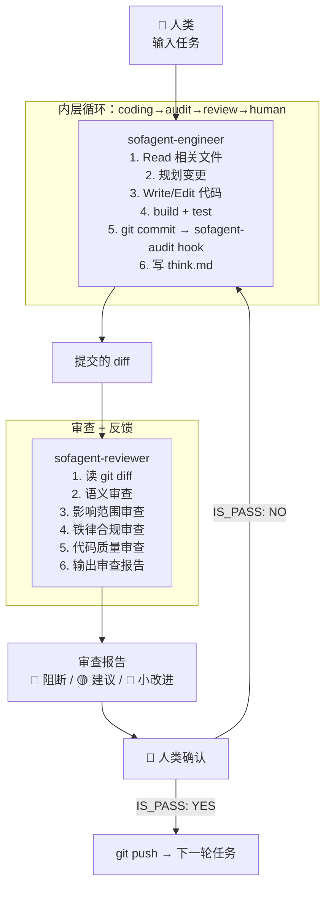
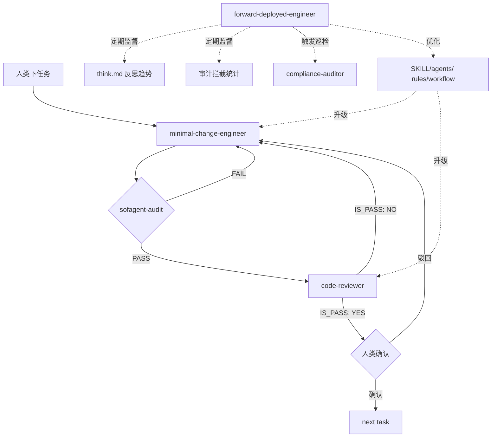
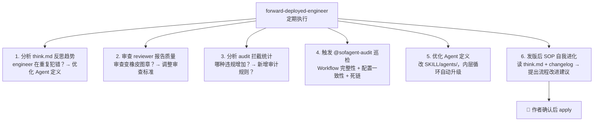

# 自迭代循环设计

> sofagent 怎么用自己的工具开发自己。
>
> v1.2.0 · 2026-07-24（UTC）· 孔放勋

> ## ⚠️ v1.2.0 后期转向（2026-07-25）
>
> **本文档为 v1.2.0 前期的历史快照，正文已过时，不作现行文档使用。**
>
> v1.2.0 后期，FORGE 已从"自迭代工具包"转向**质量循环定义层**（`FORGE/SKILL/<loop>/` + DeepAgents 驱动）。当前唯一循环是 **fresh-eyes-loop**（A/B 双盲 12 视角审查），协议见 **[`FORGE/SKILL/fresh-eyes-loop/loop.md`](SKILL/fresh-eyes-loop/loop.md)**。
>
> 主要变化：
> - `FORGE/SKILL.md`、`FORGE/loop-install.sh`、`FORGE/loop-workflow.sh`、`FORGE/releaser/` 已删除
> - 发版 SOP → `docs/changelog/releasing.md`、`bump-version.sh` → `tools/bump-version.sh`
> - 新增 `FORGE/LEDGER.md`（跨 run 永久索引）、`FORGE/SKILL/fresh-eyes-loop/`
> - 详细记录见 `docs/changelog/v1.2/v1.2.0.md` §「后期转向」
>
> **⚠️ 正文中的文件路径（如 `docs/verification/`、`FORGE/loop.md`）、维度数字（如 "10 维度"）、Agent 角色名均为 v1.2.0 前期状态，已与现行实现不一致。如需现行信息，请以 [`loop.md`](SKILL/fresh-eyes-loop/loop.md) 和 [`docs/changelog/releasing.md`](../docs/changelog/releasing.md) 为准。**
>
> *以下为旧 FORGE 自迭代设计正文，原样保留作为历史参考。*


> 📖 FORGE 自迭代的设计哲学见 [PHILOSOPHY §七](../docs/PHILOSOPHY.md#七怎么进化-forge-自迭代)。Agent 定义见 [`SKILL/agents/`](../SKILL/agents/)——遵循 [Agency Agents](https://github.com/jnMetaCode/agency-agents-zh) 格式标准。编排层通过 [DeepAgentsJS](https://github.com/langchain-ai/deepagentsjs) `createDeepAgent()` 接入 LangGraph StateGraph。

## 整体流程

```
人类下任务 → sofagent-engineer（软件工程师）写代码 → git commit
    → sofagent-audit (commit-msg hook) 硬证据审计
    → sofagent-reviewer 代码审查
    → 审查报告交给人类确认
    → 通过 → git push → 下一轮
    → 不通过 → sofagent-engineer 修复 → 回到审计
```

4 层防线：

| # | 防线 | 谁做 | 看什么 | 可绕过？ |
|---|------|------|------|:--:|
| 1 | 构建验证 | sofagent-engineer | build + test 必须通过才提交 | 不可——规则写死在 Agent 定义里 |
| 2 | 硬证据审计 | sofagent-audit (TS CLI) | git diff → A1-A11、A14-A19 模式匹配 | 不可——commit-msg hook |
| 3 | 代码审查 | sofagent-reviewer (LLM) | 代码变更 → 语义/影响/质量 | 可配置——改 `SKILL/agents/sofagent-reviewer/SKILL.md` |
| 4 | 人类确认 | 你 | 审查报告 → 直觉判断 | 最终决定权 |

## 一个迭代周期



## 为什么 sofagent-engineer 不审查自己的代码

银行转账——录入和复核是两个人。sofagent-engineer 看自己写的代码不是审查，是自我说服过程。sofagent-reviewer 的独立 session 保证了它只能看到最终 diff，没有开发过程的上下文污染。

这是 sofagent 架构中的"评判者与执行者分离"原则——和 `loop-evaluate.md` 的设计一脉相承。

## 为什么人类确认还在循环里

Agent 出问题人负责。FORGE 不是替代人类，是升级人类的角色——从逐行读 diff 变成看审查报告做判断。sofagent-engineer 和 sofagent-reviewer 把"我该担心什么"提炼出来了，人类只需要确认"这个担心对不对"。

三道护栏（fde.md 规则覆盖 / 编排可回滚 / 审计独立）中，人类确认是第一道光。

## DeepAgentsJS + LangGraph 编排层

sofagent-engineer 和 sofagent-reviewer 通过 [DeepAgentsJS](https://github.com/langchain-ai/deepagentsjs) 的 `createDeepAgent()` API 和 LangGraph `StateGraph` 串流程（v1.1.3 起代码化）：



**核心实现要点**（完整实现见 [v1.1.3 changelog](../docs/changelog/v1.1/v1.1.3.md)）：

- **内层循环 StateGraph**：`coding → audit → review → human`，条件路由 `audit.fail→coding` / `review.reject→coding` / `human.confirm→next`
- **外层循环定时触发**：FDE 每周分析 think.md 趋势，每月触发 compliance-auditor 全量巡检
- **发版后自进化**：FDE 自动更新 fresh-eyes-review / regression-checklist / acceptance-test.sh（纯增量），releasing.md 需人类确认后 apply
- **releaser Skill**（v1.1.5+）：把 `docs/changelog/releasing.md` 十二阶段发版 SOP 注入 Agent 上下文——Agent 按全流程自动执行发版（三个 human check 节点显式介入：阶段一 changelog 确认 / 阶段五审查报告确认 / 发版前最终确认）。`sofagent-fde` Skill 已内置 releaser 子能力，在 WorkBuddy 中 `@sofagent-fde 走发版流程` 即可触发。详见 [releasing.md](../docs/changelog/releasing.md)
- **Agent 定义来源**：`SKILL/agents/*/SKILL.md` → `createDeepAgent({ systemPrompt: loadPrompt(...) })`

---

## 当前限制

- **不是无人值守**：人类确认还在循环里（`LOOP_AUTO=1` 可走自动判定，但生产场景仍建议人工把关）
- **OpenClaw 全功能集成顺延**：Sub-agent 当前通过 DeepAgents `createDeepAgent()` + 工具注入启动（v1.1.4+）；OpenClaw `session.spawn` 路径的完整集成（重启自动续跑 + HITL 事件推送回传）需新增跨进程事件通道，顺延后续版本
- **LOOP_AUTO 的边界**：自动模式靠解析 reviewer 的 `IS_PASS` 判定，无法解析时保守驳回——复杂语义争议仍需人工裁决

### Loop 成熟度自检

每次 FORGE 迭代完成后，用这四个问题评估当前循环的成熟度：

| # | 问题 | 当前状态 | 目标 |
|:--:|------|------|------|
| 1 | **如何停止？** | 人类确认后停止 | FORGE 内建通过/不通过判定，无需人类"叫停" |
| 2 | **谁判通过？** | 人类看审查报告判定 | 审查员 Agent 独立给出 IS_PASS，人类仅复核异常 |
| 3 | **失败如何反馈？** | 审查不通过 → 返回工程师修复 | 失败原因 + 修复建议自动注入 engineer 的下次任务上下文 |
| 4 | **何时交还人类？** | 每次迭代都交还 | 仅 IS_PASS: NO 或高置信度判定失败时交还；PASS 自动推进 |

> 当前阶段（human-in-the-loop）四个问题都在人类这一侧。v1.2.x LangGraph 编排后会逐步将判定权从人类移向系统，但四个问题的存在本身不变——它们定义 FORGE 是不是真的"在跑"。

## FORGE 与发版流程的对应

sofagent 的版本发布遵循 [`docs/changelog/releasing.md`](../docs/changelog/releasing.md) 的十二阶段 SOP。FORGE 将其中可由 Agent 自动化的步骤映射到对应的 Agent：

| releasing.md 阶段 | 当前（人类做） | FORGE 映射 |
|---|---|---|
| 阶段一：审查 → 开发日志 | 发布后审查（`FORGE/SKILL/fresh-eyes-loop/specs/fresh-eyes-review.md`） | review-agent + 全新 session |
| 阶段二：开发 | 修复 P0/P1/P2 | minimal-change-engineer（7 步开发流程） |
| 阶段三：自测 | `npm run build` + `npm test` + `acceptance-test.sh` | minimal-change-engineer 自检 |
| 阶段四：代码审核 | 独立审核者逐项核对 | review-agent（全新 session） |
| 阶段五：审查体系合并更新（含瘦身检查） | 更新 fresh-eyes-review.md + regression-checklist.md | FDE（前三份验证文件直接做，releasing.md 提议→确认） |
| 阶段六：回归检查 + OpenClaw 验收 | 全量回归检查（regression-checklist.md）+ OpenClaw 验收测试 | FDE 触发 compliance-auditor + review-agent 执行验收 |
| 阶段七：审查体系最终确认 | 审查 prompt 与回归清单一致性最终核对 | review-agent（全新 session） |
| 阶段八：文档收尾 | bump-version + CHANGELOG/ROADMAP 更新 + 内容新鲜度检查 | FDE |
| 阶段九：工具脚本健康检查 | check/bump 排除规则 + 三脚本对照 + 过时清理 | FDE |
| 阶段十：确认关口 | 作者确认改动清单 | 人类确认（不可自动化） |
| 阶段十一：发布 | npm publish + git tag + Skill 分发 | 人类操作（不可自动化） |
| 阶段十二：发布后 | 发布后审查 → 发现问题 → 自动回流阶段一；SOP 自我进化——沉淀教训 + 更新过期数字 + 纳入新工具 | review-agent（全新 session）+ FDE 提议 → 作者确认 |

### FORGE 中的验证文档

以下 5 份验证文档已集成到 FORGE 中，由对应 Agent 在特定阶段调用：

| 文档 | 在 FORGE 中的角色 | 谁执行 |
|------|------|------|
| `FORGE/SKILL/fresh-eyes-loop/specs/fresh-eyes-review.md` | 发版前/后发布后审查（10 维度 × 6 方面） | review-agent（全新 session） |
| `FORGE/SKILL/fresh-eyes-loop/specs/regression-checklist.md` | 发版前全局回归检查（26 项） | FDE 触发 compliance-auditor |
| `FORGE/SKILL/fresh-eyes-loop/specs/acceptance-test.sh` | 发版前 CLI 端到端验收（128 个场景，原 openclaw-acceptance-test.md 已合并入此） | minimal-change-engineer 自检 |
| `docs/changelog/releasing.md` | FORGE 的整体流程参照——哪个阶段谁做什么 | FDE（流程监督者） |

### DeepAgentsJS + LangGraph 实现细节

v1.1.3 起 StateGraph 已代码化（`engine/orchestrator/src/loop/`）。Agent 定义在 `SKILL/agents/`，流程定义在 LangGraph 节点+边。完整实现原理（四节点状态机 / Checkpoint / 降级链）见 [ARCHITECTURE §编排引擎](../docs/ARCHITECTURE.md#编排引擎)。

### 平台无关触发（已设计，待代码化）

FORGE 设计为**平台无关**——不依赖特定 Agent 平台。运行原理：

```
你的 Agent（WorkBuddy / Codex / Claude Code / Hermes / Cursor）
  │
  │  "@openclaw 启动 FORGE：修复 issue #123"
  ▼
OpenClaw（sofagent 底座，随 sofagent 安装）
  │
  │  按 FORGE/loop.md 的 StateGraph 自动调度：
  ├→ session.spawn sofagent-engineer
  ├→ run sofagent-audit (commit-msg hook)
  ├→ session.spawn sofagent-reviewer
  └→ 审查报告返回给用户 Agent
```

**用户不需要知道 sub-agent 的存在。** 他们只看到自己的 Agent 完成了任务并附带了审查结果。背后的 FORGE 流程对用户透明。

## 外层循环：持续监督与优化

内层循环跑的是每一次任务。但需要一个外层循环来监督这个流程本身是否健康。



### 行业框架印证：外层 Loop 的节奏与护栏

把 31 篇研读里与「外层监督」直接相关的四个框架，作为外层 Loop 的现成注脚：

- **Onyx 四阶段闭环（L1）**：可见性 → 仿真 → 执行 → 学习，是外层 Loop 的现成叙事节奏（沙箱仿真 → 人工审核 → 写回 → 沉淀）。sofagent 的 sustain 巡检 + 价值证明报告正对应这一闭环。
- **人类审批双模式（L2）**：高风险 = 人工确认，常规 = 受信自动执行。具象化外层 human 节点的运行时策略——不是「所有动作都等人」，而是按风险分级放行。
- **AIP Evals 双阶段评估（X3）**：离线预部署复盘（上线前拿历史 case 验 Agent 定义）+ 在线指标监控（决策准确率 / 被驳回的越权请求数）。可注入 compliance 巡检与 Agent 定义优化——这正是外层循环 T1-T5 的评估输入。
- **封闭 vs 开放循环（X12）**：内层 Loop 偏**封闭**（Bug 修复 / 重构 / 测试，可量化判停），外层 Loop 偏**开放**（探索 / 创新，启发式评估）。两类循环的护栏设计不同——封闭循环靠确定性断言，开放循环靠人类判断 + 趋势观察。
- **去人化口径（L3）**：行业一派主张「去掉人」（L4 Hill-Climbing 去人化）。sofagent 反其道——human-in-the-loop 不是能力缺陷，而是**可靠优先于自主**的差异化优势：人在 loop 中可尽量简单（高风险才确认，常规受信自动），但**必须存在**。与「约束层永远在线 + 审计硬证据」同源——可靠不靠更聪明的模型，靠「人在关键处 + 机器在每处」。

> 📖 来源：31 篇行业笔记跨批研读（2026-07-20）

### 外层循环的触发节奏

| 频率 | 做什么 | 谁做 |
|------|------|------|
| 每次任务后 | 读 think.md 反思记录 | forward-deployed-engineer（被动） |
| 每周 | 分析拦截统计趋势 + think.md 模式 | forward-deployed-engineer（主动） |
| 每月 | 全面 Workflow 巡检 | compliance-auditor |
| 发版前 | 跨仓库一致性审计 + 知识库健康度 | compliance-auditor |
| 发版后 | 四份验证文件自进化（fresh-eyes / regression / acceptance / releasing） | FDE（前三份直接做，releasing.md 提议→作者确认） |
| 发现模式时 | 优化 Agent 定义文件 | forward-deployed-engineer |
| 每周 | **生成审计守护周报 → 推送到客户 IM** | **进化引擎（自动）** |
| 每月 | **生成知识库增长月报 → 推送到客户 IM** | **进化引擎（自动）** |
| 每季度 | **生成无 FDE 对照报告 + 本体健康度 → 推送到客户 IM** | **进化引擎 + MCP** |

### 外层循环的产物

- **优化后的 Agent 定义**：`SKILL/agents/*/SKILL.md` 的 rules 和 workflow 更新
- **审计规则调整**：`.sofagent/config.yml` 的新增或修改
- **合规审计报告**：compliance-auditor 产出的周期性报告
- **优化记录**：think.md 中记录"本次优化了什么、为什么、预期效果"
- **感知报告**：审计守护周报 / 知识增长月报 / 无 FDE 对照季报——自动推送客户 IM，维持 FDE 持续存在感

### 四个验证文件的自进化

每次发版后，外层循环自动推进以下四份文件的进化：

| 文件 | 当前位置 | 每次发版后做什么 | 谁做 |
|------|------|------|------|
| `fresh-eyes-review.md` | `docs/verification/` | ① 审视上轮审查发现的盲区 → 新增维度/任务 ② 过时的角色/问题 → 删除或更新 ③ 本轮新发现的"反复出现的同类问题" → 抽象为新的通用维度 | FDE |
| `regression-checklist.md` | `docs/verification/` | ① 本轮修复的 P0/P1 → 抽象为新的检查项（从 177 开始编号）② 审查体系更新建议中"建议追加到回归检查"的条目 → 正式写入 | FDE |
| `acceptance-test.sh` | `tools/` | ① 新增的审计规则 → 新增对应测试场景 ② 新功能（如 SkillOpt）→ 新增验收场景 ③ 上一版本被绕过的边缘 case → 新增为测试场景 | FDE |
| `releasing.md` | `docs/verification/` | ① 本版本发布过程中遇到的流程漏洞 → 沉淀到「历史教训」区 ② 检查 SOP 中的数字是否过期（维度数、检查项数、doctor 项数等）③ 新增的工具/脚本是否已纳入对应阶段 ④ 把更新后的 releasing.md 同步到 FORGE.md 的映射表 | FDE 提议 → 作者确认 |

**这不是可选操作——是 FORGE 外层循环的核心职责。** 如果发版后这四份文件没有更新，外层循环就是失败的。这四份文件是 FORGE 的"经验存储器"——每次发版的经验必须变成下次审查更锋利的武器。

前三份是**纯增量**操作（追加检查项/维度/场景），FDE 直接做。第四份 `releasing.md` 包含**修改**操作（更新数字、改步骤）——FDE 生成更新建议（diff 格式），作者确认后 apply。这和内层循环的"code-reviewer 生成审查报告 → 人类确认"是同构的。

### 文件位置的说明

三份审查文件已从维护者本地（`~/Workbuddy/`）移入 `docs/verification/`，成为项目的一部分，供所有贡献者使用。`FORGE/SKILL/fresh-eyes-loop/specs/acceptance-test.sh` 已在仓库中。`docs/changelog/releasing.md` 是发版 SOP，位置不变。

### 为什么外层循环是必须的

内层循环是"每任务"级别的自动化。但 Agent 的行为会漂移、审查会变松、审计规则会过时。没有外层循环，FORGE 只是一个"自动化的代码工厂"——快，但不知道自己越来越差。

外层循环让 FORGE 具备**自我改进能力**：不只是跑得快，而且是越跑越好。

### 行业印证：Loop Engineering 趋势验证自迭代循环（2026-07）

- **Loop Engineering 是行业范式级趋势**：研报将「Loop（延期决策）」列为与 Prompt / Context / Graph 并列的 AI 编程范式跃迁阶段。sofagent 的 FORGE 自迭代（内层 Dream Cycle + 外层持续监督）正落在这一阶段，且已有「外层循环的必要性与护栏」体系（见上方「行业框架印证」），与行业判断互为印证。
- **Goal 模式 ↔ 审计引擎**：研报定义 Goal 模式 =「继续工作直到这个结果成立」，含持久状态 / 自动续跑 / 证据校验（测试·日志·文件）/ 预算上限 / 生命周期控制。这正对应 sofagent 审计引擎（git diff 硬证据 + 21 条规则判停）+ verification 三件套（fresh-eyes / regression / acceptance）——把「合格与完成」写进确定性规则，让 Loop 有判停依据。

> 📖 来源：温故知新 2026-07-21（行业研报《从提示工程到图系统》）

## 下一步

- v1.1.3 StateGraph 已代码化（四节点状态机 + checkpoint），v1.1.4 起工具注入路径稳定
- 当前限制见上方"当前限制"段——核心是 OpenClaw `session.spawn` 全功能集成（重启自动续跑 + HITL 事件推送）顺延后续版本
- 持续方向：外层循环的自动化程度提升（Loop 成熟度自检表第 2-4 列"目标"列）
