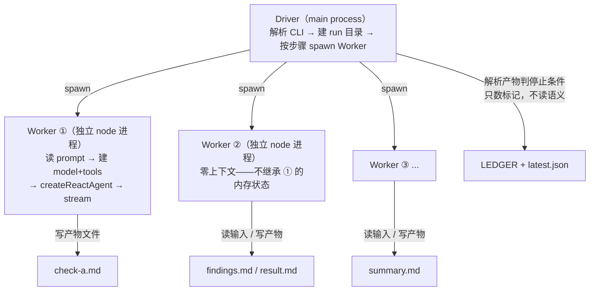
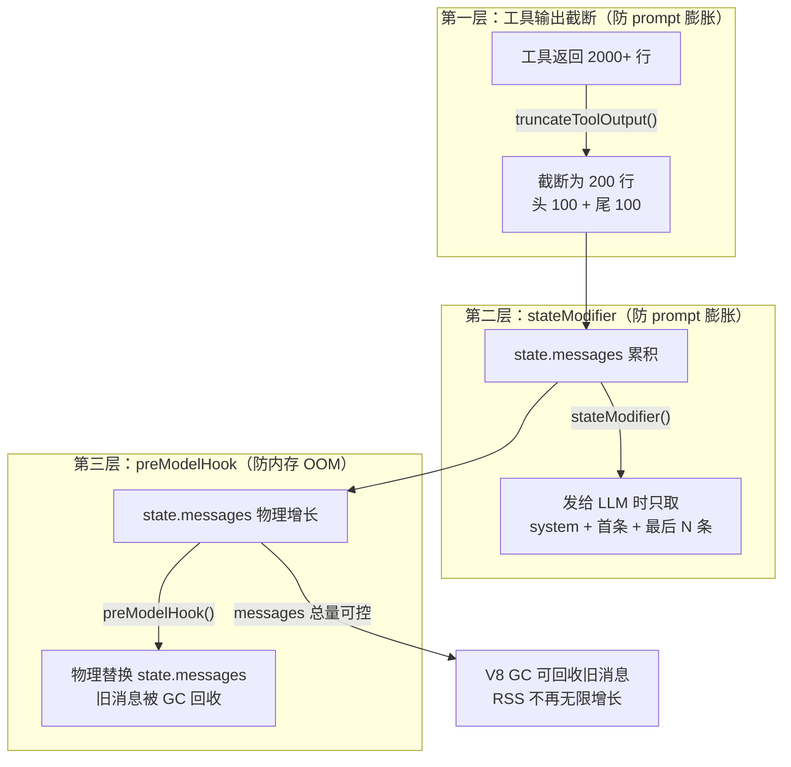
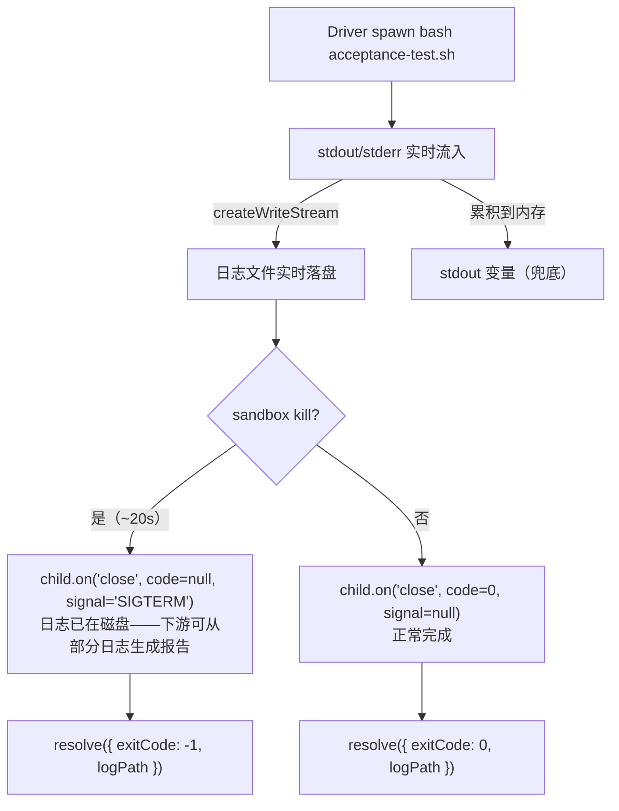

# FORGE Sub-Agent 开发参照标准

> **开发 FORGE Loop（fresh-eyes / release-gate）过程中沉淀的完整方法论。**
>
> 这不是"踩坑参考"，是**开发参照**——下次开发新的 loop 或 sub-agent 时，必须逐条对照本文档执行。每条标准都来自真实 debug 会话（附 commit hash + 根因 + 代码片段），不是理论推演。
>
> v1.2.4 · 2026-08-02（UTC）· 孔放勋

## 目录

- [本文档定位](#本文档定位)
- [一、架构设计原则](#一架构设计原则)
- [二、模型配置规范](#二模型配置规范)
- [三、性能优化基线](#三性能优化基线v125)
- [四、Driver 编排规范](#四driver-编排规范)
- [五、stream 迁移规范](#五stream-迁移规范p0-级铁律)
- [六、Prompt 设计规范](#六prompt-设计规范)
- [七、工具开发规范](#七工具开发规范)
- [八、可观测性规范](#八可观测性规范)
- [九、Sub-Agent 开发完整检查清单](#九sub-agent-开发完整检查清单)
- [十、附录](#十附录)

---

## 本文档定位

| 属性 | 说明 |
|------|------|
| **适用对象** | FORGE 新 loop 开发者、sub-agent 架构设计、driver 编排层开发 |
| **权威性** | 参照标准——开发前必读，设计决策必须与本文档一致或给出明确理由偏离 |
| **维护方式** | 每次踩到新坑或做出架构决策后，更新对应章节 + commit hash |
| **不替代** | LangGraph / deepagents 官方文档——本文档讲"我们怎么用"，不讲"它是什么" |

> **与其他文档的关系**：架构全景看 [ARCHITECTURE.md](../docs/ARCHITECTURE.md)，产品哲学看 [PHILOSOPHY.md](../docs/PHILOSOPHY.md)，FORGE 双层循环架构看 [FORGE/README.md](README.md)。本文档聚焦**开发层面**——具体怎么写代码、怎么配模型、怎么编排 driver。

---

## 一、架构设计原则

### 框架选型：createReactAgent，禁用 createDeepAgent

所有 FORGE loop 的 sub-agent 必须使用 `@langchain/langgraph/prebuilt` 的 `createReactAgent`，禁止使用 `deepagents` 的 `createDeepAgent`。

原因很简单——`createDeepAgent` 硬编码注入了 `FilesystemMiddleware`，你没法通过参数禁用它：

```js
// deepagents 源码（dist/langsmith-DjCMSywL.js:5879-5895）
const middleware = [
  todoMiddleware,
  fsMiddleware,           // ← 硬编码注入，无法禁用
  subagentMiddleware,     // ← REQUIRED，也不能排除
  ...customMiddleware,    // ← 你的 middleware:[] 只追加到这里
];
// REQUIRED_MIDDLEWARE_NAMES = Set(["FilesystemMiddleware","SubAgentMiddleware"])
```

FilesystemMiddleware 的 `wrapToolCall` 在**并行工具调用**时触发 `undefined.length` 崩溃。DeepSeek 偶然不触发并行调用所以能跑，GLM-5.2 / Qwen 在 superstep 5 触发即崩（commit 9a9c5dc）。

**正确做法**——用 createReactAgent，同一套 React 模式但不带 FilesystemMiddleware，我们有自己的 `sf_read` / `sf_write` / `run_bash`：

```js
const { createReactAgent } = await import('@langchain/langgraph/prebuilt');
const agent = createReactAgent({ llm: model, tools, stateModifier });
```

> **教训**：`middleware:[]` 看起来像"禁用 middleware"，实际是"追加空数组"。required 的东西就是 required，读源码确认 API 语义，别靠猜。

### Driver-Worker 编排模式

FORGE 的进程模型是 **Driver + N 个独立 Worker 子进程**——Driver 是纯编排层，不做任何语义判断；Worker 在独立子进程中执行单个步骤，零上下文继承。



三个设计原则支撑这个架构：

1. **Worker 零上下文**：每个 Worker 是全新 node 进程，不继承前序 Worker 的内存状态。步骤间通过**文件**传递数据（check-a.md → findings.md → result.md）。这避免了 LangGraph state 跨进程序列化的复杂性。
2. **Driver 不审查**：Driver 只做 spawn + 判停止条件（数 P0/P1 标记）。不读审查内容做语义判断——这是 Agent 的职责。
3. **文件即接口**：Worker 的输入/输出都是文件路径，Driver 注入到 user message 中。多产物用 `===FILE: filename===` 分隔符切片。

> **为什么不用 in-process**：曾经考虑过在同一个 LangGraph 图里跑所有步骤（in-process），但跨步骤的状态管理太复杂——每个 Worker 需要全新 agent session（清空上下文），在同一个图里做这个需要复杂的 state 重置逻辑。spawn 子进程是最简单可靠的方案——进程退出即天然清空一切。

### 步骤定义模式

每个 loop 的步骤在 `STEPS` 常量中集中定义，包含 role / prompt / outputs / inputs / maxTokens（可选覆盖）：

```js
const STEPS = {
  'a-check':       { role: 'A', prompt: 'a-check.md',       outputs: ['check-a.md'],             inputs: [] },
  'a-consolidate': { role: 'A', prompt: 'a-consolidate.md', outputs: ['findings.md','result.md'],inputs: ['check-a.md','check-b.md'], maxTokens: 32000 },
  // ...
};
```

**命名约定**：
- Prompt 文件：`<role>-<action>.md`（如 `a-check.md`、`b-fix.md`）
- 产物文件：`<action>-<role>.md`（如 `check-a.md`、`summary.md`）

> **坑源**（历史）：曾出现 prompt 名 `b-check.md` 与产物名 `check-b.md` 不一致导致调试困难。统一为上述约定后消除。

### 目录架构：每个 loop 自包含

每个 loop 的 prompts / specs / runs 独立存放，不共享目录：

```
FORGE/SKILL/
├── fresh-eyes-loop/
│   ├── prompts/           ← prompt 模板
│   ├── specs/             ← 规格文档
│   └── runs/              ← 运行产物（gitignore）
├── release-gate-loop/
│   ├── prompts/
│   └── runs/
└── ...（未来新 loop）
```

`.gitignore` 通配：`FORGE/SKILL/*/runs/`（覆盖所有 loop）。

> **教训**（commit 8cd7b23）：曾把 `runs/` 从 4 层深挪到 2 层深觉得"好找"。纠正回原位——"找文件方便"是工具层问题（加 `--last-run` 参数），不能为此破坏架构边界。

---

## 二、模型配置规范

### 模型配置

每个角色在 `MODEL_CONFIGS` 中定义完整的模型配置——这不是可选项，driver 启动时校验所有字段齐全：

```js
const MODEL_CONFIGS = {
  A: {
    baseURL,           // OpenAI 兼容端点
    model,             // 模型名
    maxTokens,         // 默认输出 token 上限
    apiKeyEnv,         // 环境变量名（API Key）
    specEnv,           // 环境变量名（模型规格）
    agentSkillPath,    // SKILL.md 路径（systemPrompt 来源）
    toolsKey,          // dist/tools.js 中的工具集名
    billing,           // 'subscription' | 'pay-as-you-go'
  },
};
```

**当前配置**（2026-08-01 定稿）：

| 角色 | 模型 | 计费 | 用途 |
|------|------|------|------|
| A（审查者） | qwen3.8-max-preview | Token Plan 订阅制 | 审查 / 合并 / 验证 |
| B（工程师） | qwen3.8-max-preview | Token Plan 订阅制 | 审查 / 修复 |
| V（验证者） | qwen3.8-max-preview | Token Plan 订阅制 | release-gate 全流程 |

> **从异构到单模型的演进**：早期版本（v1.2.3 之前）A/B 用不同厂商模型做"异构双盲"（减少同模型盲区）。v1.2.4 起改为 Qwen3.8-max-preview 单模型——该模型 thinking 能力足够强，fresh-eyes 纪律的核心保障是**零上下文每步**（结构隔离），而非模型差异。`MODEL_CONFIGS` 仍保留多模型配置能力，未来可随时切回异构模式。

### Thinking-only 模型特殊处理

Qwen3.8-max-preview 是 thinking-only 模型——始终思考、无法关闭。这带来三个关键约束：

1. **不传 thinking/reasoningEffort 参数**：MODEL_CONFIGS 不定义这两个字段，下方条件注入分支天然不触发。不需要也不应该传——Qwen 没有 reasoningEffort（那是 DeepSeek 专属）。
2. **maxTokens 包含 thinking tokens**：thinking-only 模型的 maxTokens 里包含思考 token，留给实际输出的更少。因此合并步骤需要单独调高 maxTokens（见下文「步骤级 maxTokens 覆盖」）。
3. **退化逻辑保留无害**：createModel 的 thinking 退化分支（ChatOpenAI 不接受 thinking 参数时去掉重试）对 Qwen 天然不触发（cfg.thinking 未定义），保留做历史参考。

### 步骤级 maxTokens 覆盖

合并/汇总类步骤的输出量远大于普通步骤，必须在 STEPS 定义中单独配置更高的 maxTokens——这条教训价值一个完整版本的质量降级（commit 63b130d）。

全局 `maxTokens: 16000` 对 a-consolidate（合并 A/B 两份完整 12 视角报告）不够。thinking-only 模型 16000 里还包含 thinking tokens → 精确顶到上限被截断 → 无法生成合法 result.md → 整轮降级摘要模式 → b-fix 收到"无 finding" → 跳过修复。审出的问题一个都没修。

```js
const STEPS = {
  'a-consolidate': { ..., maxTokens: 32000 },  // 合并步骤单独调高
};

// createModel 支持步骤级覆盖
async function createModel(role, maxTokensOverride) {
  const effectiveMaxTokens = maxTokensOverride ?? cfg.maxTokens;
  if (effectiveMaxTokens) ctorArgs.maxTokens = effectiveMaxTokens;
}

// runWorker 传入 stepDef.maxTokens
const model = await createModel(role, stepDef.maxTokens);
```

**规则**：
- 普通步骤（审查/修复/验证）：用角色默认 maxTokens（16000）
- 合并/汇总步骤（a-consolidate / consolidate）：maxTokens = 32000
- 未来新增合并步骤时，默认配 32000，实测不够再调

### 计费模式与成本追踪

usage.jsonl 记录每次 invoke 的 token 消耗，但成本估算区分计费模式：

- `subscription`（订阅制）：cost_cny = null，不硬凑按量成本。订阅制按周期固定付费，与 token 消耗无关。
- `pay-as-you-go`（按量）：按 MODEL_PRICING 表估算，标注 `price_confidence: 'estimated'`。

> **重要**：driver 算出的 cost_cny 仅供成本感知（"这轮大概花了多少"），真实账单请到各厂商 API 后台查看。缓存命中率、账号促销、套餐折扣都会影响最终费用。

---

## 三、性能优化基线（v1.2.5+）

### 上下文管理：三层裁剪（截断 + stateModifier + preModelHook）

所有 sub-agent 必须实现**三层上下文管理**，防止"上下文雪球"导致 prompt 膨胀和 OOM。

这个问题有多严重？看实测数据。两个层面都有数据：

**prompt 膨胀**（usage.jsonl）：未做裁剪时，fresh-eyes-loop 单轮审查 7-8 分钟。b-check 第一步 prompt_tokens 就 102k，到 b-fix round-4 出现单次 **296k tokens** 的怪物调用。

**内存 OOM**（exit 137）：release-gate-loop 在 WorkBuddy 沙箱中从 run-01 到 run-09 全部 OOM。单独跑步骤 2（regression），17 次工具调用后即崩——state.messages 数组在工具调用循环中无限增长，所有消息内容（Qwen3.8 的 thinking tokens + 工具输出）驻留在 V8 old space 中无法回收。

```
第 1 次调用：  prompt=15k  → LLM 处理 15k
第 50 次调用： prompt=50k  → LLM 处理 50k
第 100 次调用：prompt=90k  → LLM 处理 90k（每次推理时间翻倍）
```

三层裁剪协同工作——各自解决不同层面的问题：



> **关键区分**：stateModifier 只影响"LLM 看到多少历史"（prompt 层面），**不影响 LangGraph 内部的 state.messages 数组**——旧消息仍在内存里。preModelHook 在每次模型调用前**物理替换** state.messages——旧消息真正被丢弃，V8 可 GC。只有 preModelHook 能解决 OOM，stateModifier 解决不了。

**第一层：工具输出截断** `truncateToolOutput()`

```js
const TOOL_OUTPUT_MAX_LINES = 200;

function truncateToolOutput(text, maxLines = TOOL_OUTPUT_MAX_LINES) {
  const str = String(text);
  const lines = str.split('\n');
  if (lines.length <= maxLines) return str;
  const half = maxLines / 2;
  return [
    ...lines.slice(0, half),
    `\n... [${lines.length - maxLines} lines truncated by FORGE driver — head ${half} + tail ${half}] ...\n`,
    ...lines.slice(-half),
  ].join('\n');
}
```

在 loadTools 的 tool wrapper 里调用——工具返回超过 200 行只保留头尾各 100 行。

**第二层：上下文窗口裁剪** `stateModifier`

```js
const MAX_CONTEXT_MESSAGES = 16; // 最后 8 轮工具交互（调用+结果各 1 条）
const systemMsg = new SystemMessage(systemPrompt);

const agent = createReactAgent({
  llm: model,
  tools,
  stateModifier: (state) => {
    const messages = state.messages ?? [];
    if (messages.length <= MAX_CONTEXT_MESSAGES + 1) {
      return [systemMsg, ...messages];
    }
    // 保留第一条（原始任务 prompt）+ 最后 N 条（近期工具交互）
    const first = messages[0];
    const recent = messages.slice(-MAX_CONTEXT_MESSAGES);
    return [systemMsg, first, ...recent];
  },
});
```

> **🔴 关键坑：`prompt` 和 `stateModifier` 互斥**。LangGraph 源码 `_getPrompt()` 强校验——同时传两个会直接报错。如果之前用 `prompt: systemPrompt`，迁移到 `stateModifier` 时必须把 systemPrompt 移到 stateModifier 内部以 `SystemMessage` 形式注入。

**第三层：preModelHook 物理裁剪（防 OOM）**

stateModifier 做了 prompt 裁剪，但 state.messages 数组本身还在——每次工具调用追加 2 条消息（AI tool_call + ToolMessage），全部消息内容驻留在 V8 old space。沙箱环境内存受限时，跑到 17 次工具调用就 exit 137。

preModelHook 在每次模型调用前**物理替换** state.messages——旧消息被丢弃，V8 可 GC（commit 95583e2）：

```js
const STATE_MESSAGES_HARD_LIMIT = 20; // 物理层面：state 里保留多少条

const agent = createReactAgent({
  llm: model,
  tools,
  stateModifier: (state) => { /* 第二层：裁剪发给 LLM 的 prompt */ },
  // 第三层：物理替换 state.messages——旧消息可被 GC
  preModelHook: (state) => {
    const messages = state.messages ?? [];
    if (messages.length <= STATE_MESSAGES_HARD_LIMIT) return state;
    const first = messages[0];        // 保留第一条（初始任务）
    const recent = messages.slice(-STATE_MESSAGES_HARD_LIMIT);
    return { ...state, messages: [first, ...recent] };
  },
});
```

**参数值对照**：

| 参数 | 作用 | 推荐值 |
|------|------|--------|
| `MAX_CONTEXT_MESSAGES`（stateModifier） | 发给 LLM 的消息条数 | 16（最后 8 轮工具交互） |
| `STATE_MESSAGES_HARD_LIMIT`（preModelHook） | state 内物理保留的消息条数 | 20（比 stateModifier 大 4 条，留缓冲） |
| `TOOL_OUTPUT_MAX_LINES`（truncateToolOutput） | 单条工具输出行数 | 200（头尾各 100） |

**实测效果**（release-gate-loop regression 步骤）：

| 配置 | 工具调用次数到 OOM | 结果 |
|------|:--:|------|
| 优化前（无 preModelHook） | 17 | ❌ OOM |
| preModelHook hard_limit=30 | 69 | ❌ OOM |
| preModelHook hard_limit=20 | 132 | ❌ OOM |
| hard_limit=20 + heap=768MB | 198 | ❌ OOM（但 11.6× 提升） |
| 全链路（acceptance+coverage+consolidate+verdict） | 2+81+6+2 | ✅ 全 PASS |

> **效果总结**：三层裁剪 + heap 限制让 prompt tokens 峰值从 296k → 稳定 ~30k，内存承受力 17→198 次工具调用（11.6×）。但 regression 步骤因 agent prompt 设计需要 50-130 次调用仍不够——这是 prompt 层面的遗留问题（见第三章「Agent 行为约束」）。

### Agent 行为约束：SKILL.md 效率铁律

每个 sub-agent 的 SKILL.md（systemPrompt 来源）必须包含"效率铁律"段落，明确工具调用次数目标。

为什么需要这个？看实测数据（sub-progress.jsonl）：未约束时，A（Reviewer）一轮调了 **910 次**工具（332 次 sf_read + 563 次 run_bash），B（Engineer）更夸张 **1555 次**（850 次 bash）。同一文件读 3-4 遍、同一命令反复跑确认——这是 LLM 的通病，不约束就无限探索。

**Reviewer 效率铁律**（目标 50 步以内）：
- 禁止重复读同一文件——读过的结论直接用
- 禁止连续跑同一命令——结果不对换方案
- 批量读取——一步提多个 read_file 调用
- 先看目录再看细节——不要盲扫
- 结论优先——发现问题立即记录，不要无限扩展

**Engineer 效率铁律**（目标 30 步以内）：
- Read → Edit → Test 三步循环，每个修复点走一遍够
- 精准定位——result.md 给的路径和行号就是围栏
- 禁止重复读——已读文件结论直接用
- 验证一次——测试通过就进入下一个

> **遗留问题**（release-gate-loop regression 步骤）：prompt 预期 ~53 次工具调用（46 维度 × 1 call + 7 次开销），但 Qwen3.8 agent 实际跑了 130-198 次——不遵循「每维度 1 次 run_bash」策略，大量 sf_read 重复读文件。三层上下文裁剪把 OOM 阈值提到了 198 次，但 regression 的实际需求量可能更高。这是 agent 行为问题（prompt 层面），不是内存优化能解决的。后续方向：① prompt 中更强调批量执行策略 + 示例 ② regression 的 recursionLimit 从 400 降到 100 强制高效 ③ 或拆分 regression 步骤为 2-3 个子步骤。

> **核心认知**：LLM 的工具调用行为是可塑的——prompt 里明确说"目标 50 步以内，禁止重复读"，它就会克制。不说就默认无限探索。

### 流式输出：stream 替代 invoke

所有 sub-agent 使用 `agent.stream(streamMode: 'updates')` 替代 `agent.invoke()`，实现实时工具调用进度打印。

原因很直接——`invoke()` 阻塞等待完整结果，审查类步骤跑 5-8 分钟用户只能盯着空白。stream 模式实时打印每次工具调用（`→ [step#role] tool #N: name`），体感提升 ×2-3。

> **🔴 stream 迁移铁律见第五章**——格式差异是 P0 级陷阱，必须严格按检查清单执行。

---

## 四、Driver 编排规范

### recursionLimit 按步骤区分

禁止统一 recursionLimit。按步骤类型区分，经验值如下：

| 步骤类型 | recursionLimit | 理由 |
|---------|---------------|------|
| 审查类（a-check/b-check） | 150-200 | 需要大量读文件+搜索，12 视角 |
| 文本处理类（a-consolidate） | 50-100 | 主要做合并/格式化 |
| 修复类（b-fix） | 100-150 | 每个修复点 Read→Edit→Test 三步 |
| 验证类（a-verify） | 50-150 | 简单验证给低，复杂验证给高 |
| regression（release-gate） | 250-400 | 46 维度 × 批量执行 |

> **坑源**（commit 3248395）：统一 recursionLimit=150 导致 a-consolidate OOM（exit 137）。消息在内存里累积，Node.js 内存爆炸。

**换算公式**：每次工具调用 = 2 步（model call + tool node）。25 步 ≈ 12 轮工具调用 → 只够简单问答。超过 200 → OOM 风险。

### 失败路径容错

每个步骤必须 try/catch + 降级兜底。一个 Worker 崩溃不能拖死整条链。

```js
try {
  await spawnWorker('a-consolidate', roundDir, target, roundNum);
} catch (consolidateErr) {
  console.warn(`⚠️ a-consolidate 失败: ${consolidateErr.message}`);
  console.warn(`   降级：直接拼接 check-a + check-b 作为 findings.md`);
  writeFallbackFindings(roundDir);  // 拼接两份 check 报告的 P0/P1 摘要
}
```

降级三原则：
1. 降级产物质量肯定不如正常流程，但"有"比"没有"强
2. 降级时只提取 P0/P1 摘要，不传完整正文（避免下游上下文溢出）
3. driver 的 catch 块也要写可见性事件（失败路径覆盖）

**Driver 致命错误处理**（commit 4a4a143）——worker 失败时 driver 如果抛 uncaught exception，status.json 会停在 `round-1-running`，Dashboard 看到"永远在跑"。模块级 globalVisibility 引用让 catch 块也能写终态事件：

```js
let globalVisibility = null;  // 模块级引用

main().catch(err => {
  console.error(`💥 致命错误: ${err.message}`);
  if (globalVisibility) {
    globalVisibility.emit(EVENTS.ERROR, { message: err.message, ... });
    globalVisibility.emit(EVENTS.LOOP_END, { actualRounds: 0, stopReason: 'fatal-error', ... });
  }
  process.exit(1);
});
```

### 分片执行模式

当单个步骤的输入 finding 数量较大（>10 条）时，必须分片执行——每批启动独立 Worker（全新 agent session，零历史消息）。

> **适用范围**：仅 **fresh-eyes-loop** 的 b-fix 步骤。release-gate-loop 不产出 finding，不做分片。新 loop 如果有"多 finding 修复"步骤，参照本节实现。

```js
function computeBatchSize(findingCount) {
  if (findingCount <= 20) return 5;
  if (findingCount <= 35) return 3;
  return 2;
}
```

设计原理：
- 每批 Worker 只收到本批的 findings（写入 `result-batch-N.md`）
- 避免单 session 消息累积导致 recursionLimit 超限或 OOM
- 单批失败不中断——继续下一批，最后合并所有 batch 的 summary

**防回归检查**：切出 0 条 finding 但 result.md 中 P0+P1 计数 > 0 时报警（finding 标题格式不符的信号）。

### 停止条件判定

这是 Driver 唯一做语义判断的地方——读 findings.md 数 P0/P1/P2 标记，读 result.md 数 FAIL。

```js
function parseStopCondition(roundDir) {
  // 数 findings.md 里的 P0/P1/P2 标记
  const p0Matches = text.match(/\bP0\b/g);
  // ...
  // 读 result.md verify 列，数 FAIL
  const hasFail = /\bFAIL\b/i.test(text);
  const isClean = (p0 === 0 && p1 === 0 && p2 === 0 && !hasFail);
  return { p0, p1, p2, hasFail, isClean };
}
```

收敛策略：
- 基础：连续 2 轮干净（`cleanStreak >= 2`）
- 加权收敛（commit #13）：severity 历史足够长时（≥3 轮），用近窗加权平均 + 趋势判断提前收敛

### 外部脚本 spawn 生存规范

Driver 调用外部 shell 脚本（如 `acceptance-test.sh`）时，必须遵循三条铁律：**流式写日志、处理 signal、禁用 head 管道**。

这个问题是在 release-gate-loop 调 acceptance-test.sh 时暴露的（commit 35cfb22）：sandbox 环境在 ~20s kill 了整个进程树，而原实现等 `close` 事件后才 `writeFileSync`——进程被 kill 时已捕获的 stdout 全丢，driver 拿到空日志，下游 worker 无法生成报告。



#### 禁用 `| head -N` 管道（shell 脚本侧）

`acceptance-test.sh` 开头是 `set -euo pipefail`（L9）。脚本中任何 `cmd | head -N` 在 head 读够 N 行关闭管道后，cmd 进程收到 SIGPIPE。在 `pipefail` 模式下管道退出码 = 最后一个失败的命令的码 → `set -e` 可能直接退出整个脚本。

```bash
#!/usr/bin/env bash
set -euo pipefail   # ← pipefail 开启

# ❌ 危险：head -10 关闭管道 → node 收 SIGPIPE → pipefail 判非 0 → set -e 退出脚本
$CLI --init 2>&1 | head -10

# ✅ 正确：静默运行，验证靠文件检查
$CLI --init > /dev/null 2>&1 || true
[ -f "$TMP_REPO/.sofagent/config.yml" ] && pass || fail "config.yml 未生成"
```

**标准写法**：

| 场景 | ❌ 危险 | ✅ 安全 |
|------|---------|---------|
| 只关心副作用（文件创建/退出码） | `cmd \| head -N` | `cmd > /dev/null 2>&1 \|\| true` |
| 需要截取部分输出做断言 | `cmd \| head -N` | `OUT=$(cmd 2>&1 \|\| true); echo "$OUT" \| head -N` |
| 需要检查输出包含某关键词 | `cmd \| head -N \| grep` | `cmd > /tmp/log 2>&1 \|\| true; grep -q "keyword" /tmp/log` |

> **实测细节**：Node.js 默认捕获 SIGPIPE 不 crash（写 stdout 时收到 EPIPE 抛异常但被 catch），所以当前没有实际触发 `set -e` 退出。但这是环境依赖的脆弱平衡——换一个运行时（Python / Ruby / Go）或换一个 Node 版本就可能爆炸。**标准不是"现在能不能跑"，是"设计上有没有炸弹"。**

#### 流式写入日志（Driver 侧）

spawn 外部脚本时，stdout/stderr 必须**实时写入文件**，不能等 `close` 事件后一次性写入。

```js
import { createWriteStream } from 'fs';

const child = spawn('bash', [scriptPath], {
  cwd: REPO_ROOT,
  stdio: ['ignore', 'pipe', 'pipe'],
});

// ✅ 流式写入：收到数据即写文件
const writeStream = createWriteStream(logPath, { flags: 'w' });

child.stdout.on('data', (d) => {
  stdout += d;
  writeStream.write(d);  // ← 实时落盘
});
child.stderr.on('data', (d) => {
  stderr += d;
  writeStream.write(d);
});

child.on('close', (code, signal) => {
  writeStream.end(stderr ? `\n--- STDERR ---\n${stderr}` : '');
  // ...
});

// ❌ 危险：等 close 后才写——被 kill 时全丢
// child.on('close', (code) => {
//   writeFileSync(logPath, stdout + stderr);  // ← kill 时 stdout 只在内存
// });
```

原因：sandbox 环境（WorkBuddy Agent 工具、CI runner、容器编排）可能在任意时刻 kill 整个进程树。Driver 的 20 分钟内部超时毫无意义——父进程（sandbox）在 ~20s 就 kill 了。流式写入保证即使被 kill，已捕获的日志也在磁盘上，下游 worker 可以从部分日志生成报告。

#### child.on('close') 的 signal 参数

`close` 回调签名是 `(code, signal)`——正常退出时 `signal = null`，被 kill 时 `code = null, signal = 'SIGTERM' / 'SIGKILL'`。必须处理两种情况。

```js
child.on('close', (code, signal) => {
  if (signal) {
    // 被外部 kill（sandbox / 手动 / OOM killer）
    console.warn(`acceptance-test.sh 被信号终止: ${signal}，已捕获 ${stdout.length} bytes`);
  } else {
    // 正常退出
    console.log(`acceptance-test.sh 完成，exit code = ${code}`);
  }
  resolveP({ exitCode: code ?? -1, logPath, stdout: fullLog });
});
```

> **坑源**：原实现只读 `code`，被 kill 时 `code = null` 传入 `exitCode: null` → 下游 `if (exitCode !== 0)` 判断 `null !== 0` 为 true → 误判为"测试失败"而非"进程被杀"。区分这两种情况对诊断至关重要。

#### progress 日志（长时间脚本必备）

spawn 运行时间超过 30s 的外部脚本时，必须每 30s 输出一次进度日志。

```js
let lastProgressLog = Date.now();

child.stdout.on('data', (d) => {
  stdout += d;
  writeStream.write(d);
  if (Date.now() - lastProgressLog > 30_000) {
    const elapsed = ((Date.now() - startTime) / 1000).toFixed(0);
    const lastLine = stdout.trim().split('\n').pop()?.slice(0, 80) || '(empty)';
    console.log(`[driver] 运行中... ${elapsed}s, ${stdout.length} bytes, 末行: ${lastLine}`);
    lastProgressLog = Date.now();
  }
});
```

作用：当脚本卡住或被 kill 时，progress 日志的最后一行直接告诉你卡在哪个场景/步骤——不用翻日志文件。

#### 超时设置原则

| 超时来源 | 典型值 | 作用 |
|---------|--------|------|
| Driver 内部超时 | 脚本预估时长的 3-5 倍 | 兜底防死循环 |
| Sandbox 环境 kill | ~20s - 300s（不可控） | 父进程的耐心 |
| 脚本实际运行 | 线性增长 | 取决于场景数 |

Driver 内部超时设为脚本预估时长的 3-5 倍（acceptance-test.sh 约 2-3 分钟，超时设 15 分钟）。不要设太长（20 分钟）——如果脚本真卡住，等 20 分钟才发现毫无意义。同时接受一个现实：**sandbox kill 不可防，只能靠流式日志让杀伤力最小化**。

#### SOFAGENT_SKIP_HOOK 环境变量旁路

`sofagent-audit --init` 在入口处设置 `process.env.SOFAGENT_SKIP_HOOK = '1'`，commit-msg hook 模板检测到此变量时直接 `exit 0`。

防护场景：
1. `--init` 内部的 git 命令（如 `git rev-parse`）不会触发刚安装的 hook
2. 测试脚本中 `--install-hook` → `--init` → `git commit` 的连续操作不会产生意外递归
3. CI/CD 环境中 init 流程被 git 操作包裹时不受 hook 干扰

```ts
// init.ts
export function runInit(): void {
  process.env.SOFAGENT_SKIP_HOOK = '1';  // 防递归
  // ...
}
```

```bash
# commit-msg hook 模板（config-template.ts HOOK_TEMPLATE）
if [ -n "$SOFAGENT_SKIP_HOOK" ]; then
  exit 0
fi
```

> **注意**：此旁路仅用于 init 内部流程。用户正常 `git commit` 时不会设置此变量，hook 照常运行。如果需要临时跳过 hook，用户应使用 `git commit --no-verify`。

#### Driver --skip-acceptance 参数

release-gate-driver 支持 `--skip-acceptance` 参数，跳过 acceptance-test.sh 预跑，直接复用手动预跑的日志。

使用场景：sandbox 环境 kill 窗口 < acceptance-test.sh 执行时间（~2-3 分钟）时，手动预跑日志后用此参数让 driver 跳过预跑。

```bash
# 手动预跑（在非 sandbox 环境中）
bash FORGE/playbook/acceptance-test.sh > run-00/acceptance-raw.log 2>&1

# driver 用 --skip-acceptance 复用日志
node FORGE/src/release-gate-driver.mjs --target v1.2.5 --skip-acceptance
```

> **与 run-00 复用模式的区别**：run-00 模式需要手动把 `acceptance-raw.log` 放到 runDir 中，driver 自动检测到文件存在则跳过。`--skip-acceptance` 是显式声明——即使日志不存在也跳过（写入占位日志让 worker 知道是 skip 模式）。

#### Driver --step 单步执行模式

release-gate-driver 支持 `--step <stepName>` 参数，指定后只执行该步骤然后 `exit(0)`，每步一个独立 Node 进程，内存归零。

**三种执行模式的关系**：

| 模式 | 触发方式 | 进程模型 | 适用场景 |
|------|---------|---------|---------|
| 全量模式（默认） | `--target vX.Y.Z` | driver 内部 spawn 5 个 worker 子进程 | 正常发版，有足够内存空间 |
| 单步模式 | `--step acceptance --target vX.Y.Z` | 外层编排脚本逐步调用，每次一个全新进程 | WorkBuddy 沙箱 OOM、CI 内存受限 |
| worker 模式 | `--worker --step <name> --run-dir <dir>` | 被 driver spawn 的子进程入口 | 内部机制，不手动使用 |

**为什么需要单步模式**：全量模式虽然每步已经 fork 子进程，但 driver 主进程自身也在累积内存（5 步的编排状态 + 可见性事件）。在 WorkBuddy 沙箱等受限环境中，driver 主进程 + worker 子进程的内存叠加可能触发 OOM。单步模式让外层 bash 脚本逐步调用——每步是全新进程，执行完即退，内存彻底归零。

```bash
# 单步执行示例：外层 bash 脚本逐步编排
RUN_DIR="FORGE/SKILL/release-gate-loop/runs/$(date +%Y%m%d-%H%M%S)"
mkdir -p "$RUN_DIR"

node FORGE/src/release-gate-driver.mjs --step acceptance  --target v1.2.5 --run-dir "$RUN_DIR"
node FORGE/src/release-gate-driver.mjs --step regression  --target v1.2.5 --run-dir "$RUN_DIR"
node FORGE/src/release-gate-driver.mjs --step coverage     --target v1.2.5 --run-dir "$RUN_DIR"
node FORGE/src/release-gate-driver.mjs --step consolidate  --target v1.2.5 --run-dir "$RUN_DIR"
node FORGE/src/release-gate-driver.mjs --step verdict       --target v1.2.5 --run-dir "$RUN_DIR"
```

每步完成后 stdout 打印 `[driver] STEP_DONE: <stepName> EXIT_CODE=0`，外层脚本据此判断是否继续下一步。

> **设计要点**：单步模式与全量模式共享相同的 `runWorker()` 和 `ensureAcceptancePreRun()` 逻辑——不是两套代码，是同一套执行引擎的不同入口。`--run-dir` 让多步共享同一个产物目录，确保步骤间文件传递正确。

#### V8 heap 限制：--max-old-space-size（反直觉优化）

Node.js 默认 V8 old space 限制约 2GB。反直觉的发现是：在沙箱环境中**主动限制到 768MB 效果更好**（commit 95583e2）。

```bash
# ❌ 默认 2GB——V8 延迟 GC，old space 膨胀到 macOS jetsam 阈值后被 kill
node driver.mjs --step regression --target v1.2.5

# ✅ 768MB——V8 更频繁 GC，实际 RSS 更低
node --max-old-space-size=768 driver.mjs --step regression --target v1.2.5
```

**为什么**：较大的 heap 让 V8 延迟 GC——old space 持续增长直到触及 macOS jetsam 内存阈值（约 1-2GB），然后整个进程被 kill。较小的 heap（768MB）迫使 V8 更频繁地 GC，实际 RSS（常驻内存）反而更低——每次 GC 把旧消息（已被 preModelHook 标记为可回收的）清掉。

**适用场景**：沙箱 / CI / 容器等内存受限环境。非受限环境（本地开发、服务器）用默认值即可。

> **三层防御**：preModelHook（让旧消息可 GC）+ `--max-old-space-size=768`（迫使 V8 更频繁 GC）+ `--step` 单步模式（每步退出彻底归零）——三者协同把 OOM 阈值从 17 次提升到 198 次工具调用。缺任何一层都会提前崩。

---

## 五、stream 迁移规范（P0 级铁律）

### API 返回格式差异

从 `invoke()` 迁移到 `stream()` 时，最隐蔽的陷阱是返回格式的结构性差异——不处理这个，上游工具调用打印一切正常，下游产物却变成 `[object Object]`。

```
invoke()  返回 → { messages: [...] }              ← 扁平，下游直接用
stream()   返回 → { agent: { messages: [...] } }   ← 外面包了一层节点名
```

正确适配：累积所有 chunk 的 delta.messages 到扁平数组，返回 `{ messages: allMessages }` 模拟 invoke 返回格式：

```js
const invokeAgent = async () => {
  const stream = await agent.stream(
    { messages: [{ role: 'user', content: userMessage }] },
    { recursionLimit, streamMode: 'updates' }
  );

  const allMessages = [];
  let toolCallCount = 0;
  for await (const chunk of stream) {
    // chunk 是 { nodeName: stateDelta }——解包每个节点的 delta
    for (const [, delta] of Object.entries(chunk)) {
      const msgs = delta?.messages;
      if (!Array.isArray(msgs)) continue;
      for (const msg of msgs) {
        allMessages.push(msg);
        if (msg?._getType?.() === 'ai' && msg.tool_calls?.length > 0) {
          for (const tc of msg.tool_calls) {
            toolCallCount++;
            console.log(`  → [${step}#${role}] tool #${toolCallCount}: ${tc.name}`);
          }
        }
      }
    }
  }
  return { messages: allMessages };  // 与 invoke() 返回格式兼容
};
```

### stream 迁移检查清单

做 invoke → stream 改造时，必须逐条确认：

- [ ] **chunk 结构确认**：stream(streamMode:'updates') 返回 `{ [nodeName]: delta }` 不是扁平 `{ messages: [] }`。打 `console.log(chunk)` 确认。
- [ ] **下游消费函数验证**：extractAgentText / extractUsage / 所有读 `result.messages` 的函数，拿到的数据形状对吗？
- [ ] **格式适配层**：累积 delta.messages 到扁平数组，返回 `{ messages: allMessages }` 兼容 invoke 格式。
- [ ] **端到端验证**：不只看上游日志（工具调用打印✅），必须检查下游产物文件内容 + usage.jsonl 有正常数据。

> **核心反思**（commit da1039a → a0571a4）：写流式迁移时只测了"工具调用能实时打印"（上游），没测"最终结果能不能被下游正确消费"（下游）。这是典型的"只看了自己那段，没看整条链"。**语法检查和审计都不做 API 返回值结构验证——这个 bug 只有在 agent 实际跑完一轮后写产物时才暴露。**

---

## 六、Prompt 设计规范

### macOS BSD 工具约束（必加）

所有 sub-agent 的 systemPrompt 末尾必须追加 macOS BSD 工具约束段。

原因（commit 3248395）：LLM 训练数据以 Linux 为主，默认用 GNU 语法。macOS 是 BSD 工具，行为不同。不约束就浪费 recursionLimit 步数在重试错误命令上。

```js
const shellConstraints = [
  '',
  '## 🔴 铁律：macOS BSD 工具约束（违反必崩）',
  '',
  '你在 macOS 上运行，shell 是 BSD 版本，**不是 GNU/Linux**。以下命令在此环境会报错：',
  '- `grep -P` → 不存在，用 `grep -E`',
  '- `sed --version` / `sed -V` → 不存在，`sed -i` 必须带后缀 `sed -i ""`',
  '- `openssl --version` / `openssl -V` → 用 `openssl version`（无横杠）',
  '- `cat -A` → 用 `cat -v` 或 `od -c`',
  '- `stat --format` → 用 `stat -f`',
  '- `readlink -f` → 用 `python3 -c "import os; print(os.path.realpath(\'...\'))`"',
  '- `<(...)` process substitution → 不支持',
  '',
  '**铁律：命令报错时立即换方案或跳过，禁止用相同语法重试。**',
].join('\n');
```

> **验证效果**：加上约束后，a-consolidate 从"40步不收敛"变成"完美产出 49 行 findings.md"。

### systemPrompt 注入方式

systemPrompt 从 SKILL.md 构建（剥离 frontmatter + 提取身份标签），通过 stateModifier 注入。

**禁止**直接用 `prompt: systemPrompt` 参数（与 stateModifier 互斥，见第三章「上下文管理」）。

```js
function buildSystemPrompt(skillPath) {
  const raw = readFileSync(skillPath, 'utf-8');
  const parts = raw.split('---');
  const fm = parts[1];
  const body = parts.slice(2).join('---').trim();
  // 提取 frontmatter 的 name / description / triggers 作为身份标签
  const header = `[Agent: ${val('name')}]\n[描述: ${val('description')}]`;
  return header + '\n\n' + body + shellConstraints;
}
```

### 纯只读约束（release-gate 特有）

release-gate-loop 的 V 角色 systemPrompt 额外追加纯只读铁律：

```js
const readOnlyRule = [
  '',
  '## 🔴 铁律：纯只读（release-gate-loop 核心约束）',
  '',
  '你**不得创建或修改任何代码或文档文件**。你的任务是验证 + 生成报告，不是修复。',
  '**禁止操作：**',
  '- 禁止使用 write_file / edit_file 等写工具',
  '- 禁止 git commit / git push',
  '- 禁止 npm publish / npm install',
].join('\n');
```

---

## 七、工具开发规范

### 工具格式转换

dist/tools.js 中的工具是手写 ExecutableTool 格式（`{name, description, schema, func}`），但 LangGraph ToolNode 期望 `@langchain/core/tools` 的 `tool()` 函数创建的 DynamicStructuredTool。loadTools() 必须加转换层。

```js
const { tool } = require('@langchain/core/tools');
const { z } = require('zod');

return rawTools.map((rawTool) => {
  if (rawTool.lc_namespace) return rawTool;  // 已转换过

  // JSON Schema → zod 简化转换
  const properties = rawTool.schema?.properties || {};
  const zodShape = {};
  for (const [key, prop] of Object.entries(properties)) {
    let zodField;
    if (prop.type === 'string') zodField = z.string();
    else if (prop.type === 'number' || prop.type === 'integer') zodField = z.number();
    else if (prop.type === 'boolean') zodField = z.boolean();
    else zodField = z.string();
    if (prop.description) zodField = zodField.describe(prop.description);
    if (!requiredFields.includes(key)) zodField = zodField.optional();
    zodShape[key] = zodField;
  }

  return tool(
    async (input) => { /* 工具执行 + 截断 + 埋点 */ },
    { name: rawTool.name, description: rawTool.description, schema: z.object(zodShape) }
  );
});
```

### 工具命名

自定义工具加前缀（如 `sf_`），避免与 LangGraph 生态保留名冲突。

> **坑源**：`ls` / `read_file` / `write_file` / `edit_file` / `glob` / `grep` 是 deepagents 保留名。用 createReactAgent 后不再是硬性问题，但仍建议加前缀避免未来冲突。

### 工具输出截断埋点

工具 wrapper 内同时做三件事：
1. 执行原始 func
2. 截断输出（truncateToolOutput）
3. 进度埋点（progressMw.wrapToolCall）——观测层，失败不影响工具执行

```js
const wrappedTool = tool(
  async (input) => {
    const execFn = async () => truncateToolOutput(await rawTool.func(input));
    if (progressMw) {
      return await progressMw.wrapToolCall({ tool: rawTool.name, args: input }, execFn);
    }
    return await execFn();
  },
  { name: rawTool.name, description: rawTool.description, schema: z.object(zodShape) }
);
```

---

## 八、可观测性规范

### 两层可观测

| 层级 | 数据源 | 内容 | 文件 |
|------|--------|------|------|
| L1 | visibility | 循环级事件（RUN_START / ROUND_START / ROUND_END / STEP_DONE / ERROR / LOOP_END） | progress.jsonl + status.json |
| L2 | progressMw | 工具调用级事件（start / end + duration）+ 模型推理心跳（llm-chunk） | sub-progress-<role>.jsonl |

观测层创建/写入失败绝不阻断主流程。与 L1 visibility 容错策略一致。

### latest.json 指针

Driver 每轮结束 + 轮内每 30s 刷新 latest.json，Dashboard 据此实时展示进度。

```js
function updateLatestPointer(runDir, opts) {
  // 原子写入：先写 .latest.json.tmp，再 rename 到 latest.json
  writeFileSync(tmpPath, JSON.stringify(payload, null, 2) + '\n', 'utf-8');
  renameSync(tmpPath, latestPath);
}
```

### macOS 后台节流防护

darwin 平台下用 `caffeinate -dimsu -w <pid>` 绑定自身 pid，防止系统空闲休眠与 App Nap 冻结定时器（v1.2.4 P0）。

> **坑源**（run-03 Round 5）：macOS App Nap / timer throttling 挂起后台 node 进程，driver 零感知冻结 2h44m。

```js
if (process.platform === 'darwin' && !args.dryRun) {
  const caf = spawn('caffeinate', ['-dimsu', '-w', String(process.pid)], { stdio: 'ignore' });
  caf.unref(); // driver 退出即自动解除
}
```

---

## 九、Sub-Agent 开发完整检查清单

> 开发新 loop 或 sub-agent 前，逐条对照。每条都对应上方正文的详细说明。

### 🔰 架构与框架

- [ ] **用 `createReactAgent`，禁用 `createDeepAgent`**（第一章「框架选型」）
- [ ] **Driver-Worker 分离**：Driver 纯编排不审查，Worker 零上下文独立进程（第一章「Driver-Worker 编排模式」）
- [ ] **步骤在 STEPS 常量中定义**，含 role / prompt / outputs / inputs / maxTokens（第一章「步骤定义模式」）
- [ ] **runs 目录放在 loop 自己目录下**（自包含），`.gitignore` 加 `FORGE/SKILL/*/runs/`（第一章「目录架构」）
- [ ] **LEDGER.md 追加一行记录**（git 跟踪）

### 🤖 模型配置

- [ ] **MODEL_CONFIGS 定义完整字段**（baseURL / model / maxTokens / apiKeyEnv / agentSkillPath / toolsKey / billing）（第二章「模型配置」）
- [ ] **Thinking-only 模型不传 thinking/reasoningEffort**（第二章「Thinking-only 模型特殊处理」）
- [ ] **合并/汇总步骤 maxTokens = 32000**（普通步骤用角色默认 16000）（第二章「步骤级 maxTokens 覆盖」）
- [ ] **计费模式标注**（subscription / pay-as-you-go），subscription 的 cost_cny = null（第二章「计费模式与成本追踪」）

### ⚡ 性能优化（v1.2.5+）

- [ ] **工具输出截断**：loadTools 的 tool wrapper 里加 `truncateToolOutput(text, 200)`（第三章「上下文管理」）
- [ ] **上下文窗口裁剪**：用 `stateModifier` 替代 `prompt`（互斥！），保留 system + 首条 + 最后 16 条（第三章「上下文管理」）
- [ ] **stateModifier 内注入 SystemMessage**：`prompt` 和 `stateModifier` 不能同时传（第三章「上下文管理」）
- [ ] **preModelHook 物理裁剪**：stateModifier 只裁剪 prompt，preModelHook 才物理替换 state.messages 防 OOM（第三章「上下文管理」）
- [ ] **SKILL.md 加效率铁律**：reviewer 目标 ≤50 步，engineer 目标 ≤30 步（第三章「Agent 行为约束」）
- [ ] **stream 替代 invoke**：实时打印工具调用进度（第三章「流式输出」+ 第五章）

### 🔧 Driver 编排

- [ ] **recursionLimit 按步骤区分**（审查类 150-200，处理类 50-100，修复类 100-150）（第四章「recursionLimit 按步骤区分」）
- [ ] **每个步骤 try/catch + 降级兜底**（第四章「失败路径容错」）
- [ ] **driver catch 块写 ERROR + LOOP_END 事件**（模块级 globalVisibility 引用）（第四章「失败路径容错」）
- [ ] **finding >10 条时分片执行**（computeBatchSize 动态分批）（第四章「分片执行模式」）
- [ ] **停止条件只数标记不做语义判断**（第四章「停止条件判定」）
- [ ] **spawn 外部脚本时流式写入日志**（createWriteStream，不等 close）（第四章「流式写入日志」）
- [ ] **child.on('close') 处理 signal 参数**（被 kill 时 code=null）（第四章「child.on('close') 的 signal 参数」）
- [ ] **shell 脚本中禁用 `| head -N`**（pipefail + SIGPIPE 定时炸弹）（第四章「禁用 | head -N 管道」）
- [ ] **长脚本每 30s 输出 progress 日志**（第四章「progress 日志」）
- [ ] **init 内部设 SOFAGENT_SKIP_HOOK=1**（防 hook 递归）（第四章「SOFAGENT_SKIP_HOOK 环境变量旁路」）
- [ ] **driver 支持 --skip-acceptance**（sandbox kill 窗口短时复用预跑日志）（第四章「Driver --skip-acceptance 参数」）
- [ ] **driver 支持 --step 单步模式**（沙箱 OOM 时外层编排逐步调用，内存归零）（第四章「Driver --step 单步执行模式」）
- [ ] **沙箱环境加 --max-old-space-size=768**（迫使 V8 更频繁 GC，实际 RSS 更低）（第四章「V8 heap 限制」）

### 🔴 stream 迁移（如做 invoke→stream 改造时必查）

- [ ] **chunk 格式确认**：stream 返回 `{ [nodeName]: delta }` 不是扁平 `{ messages: [] }`（第五章「API 返回格式差异」）
- [ ] **下游消费函数验证**：extractAgentText / extractUsage 拿到的数据形状对吗？（第五章「stream 迁移检查清单」）
- [ ] **格式适配层**：累积 delta.messages 到扁平数组，返回 `{ messages: allMessages }`（第五章「API 返回格式差异」）
- [ ] **端到端验证**：检查下游产物文件内容 + usage.jsonl 有正常数据（第五章「stream 迁移检查清单」）

### 📝 Prompt 设计

- [ ] **systemPrompt 末尾加 macOS BSD 工具约束段**（第六章「macOS BSD 工具约束」）
- [ ] **systemPrompt 通过 stateModifier 注入**（不用 prompt 参数）（第六章「systemPrompt 注入方式」）
- [ ] **纯只读场景加只读铁律**（release-gate 特有）（第六章「纯只读约束」）

### 🔧 工具开发

- [ ] **ExecutableTool → DynamicStructuredTool 转换**（loadTools 加 tool() 包装 + zod schema）（第七章「工具格式转换」）
- [ ] **工具名加前缀**（sf_read / sf_write 等）（第七章「工具命名」）
- [ ] **工具 wrapper 内做截断 + 埋点**（第七章「工具输出截断埋点」）

### 📊 可观测性

- [ ] **L1 visibility + L2 progressMw 双层可观测**（第八章「两层可观测」）
- [ ] **latest.json 指针每轮 + 轮内 30s 刷新**（原子写入：先 tmp 再 rename）（第八章「latest.json 指针」）
- [ ] **darwin 平台绑 caffeinate 防后台节流**（第八章「macOS 后台节流防护」）

---

## 十、附录

### 修复时间线

| 时间 | commit | 问题 | 级别 | 对应章节 |
|------|--------|------|------|---------|
| 07-25 | 4a4a143 | 失败路径可见性缺口 | P1 | 四·失败路径容错 |
| 07-25 | e4ba836 | middleware:[] 假修复 | P0（假修复） | 一·框架选型 |
| 07-26 | 9a9c5dc | createDeepAgent → createReactAgent | P0 | 一·框架选型 |
| 07-26 | 3248395 | recursionLimit 按步骤 + macOS 约束 + 降级 | P1 | 四·recursionLimit / 六·BSD 约束 |
| 07-26 | 8cd7b23 | runs 目录迁回原位（架构纠偏） | P2 | 一·目录架构 |
| 08-01 | 63b130d | 步骤级 maxTokens 覆盖（consolidate 32000） | P1 | 二·步骤级 maxTokens |
| 08-01 | da1039a | 四项 ReAct 性能优化（截断+裁剪+铁律+stream） | P1 | 三·上下文管理 / 效率铁律 / 流式输出 |
| 08-01 | a0571a4 | stream 迁移 finalState 数据丢失 | P0 | 五·stream 迁移 |
| 08-01 | 35cfb22 | 外部脚本 spawn 生存（流式日志+signal+head 管道） | P1 | 四·外部脚本 spawn 生存 |
| 08-01 | ae6f1c0 | spawn 生存规范文档化（7 个子节沉淀） | P2 | 四·外部脚本 spawn 生存 |
| 08-01 | 0d3c36e | SOFAGENT_SKIP_HOOK 防递归 + driver --skip-acceptance | P2 | 四·SKIP_HOOK / --skip-acceptance |
| 08-01 | c1fab22 | 检查清单+附录同步 + SKILL.md --skip-acceptance 用法 | P2 | 四·--skip-acceptance |
| 08-01 | 3530200 | 单步模式 + bash 编排脚本（跨步骤 OOM） | P0 | 四·Driver --step |
| 08-01 | 95583e2 | preModelHook 物理裁剪 + --max-old-space-size=768 | P0 | 三·上下文管理 / 四·V8 heap |

### 历史坑位索引

以下坑位已整合进上方标准章节，保留索引便于溯源：

| 坑号 | 原标题 | 整合位置 |
|------|--------|---------|
| 1 | createDeepAgent 硬编码 FilesystemMiddleware | 一·框架选型 |
| 2 | 工具格式必须用 tool() 创建 | 七·工具格式转换 |
| 3 | 工具名 BUILTIN 冲突 | 七·工具命名 |
| 4 | 统一 recursionLimit 导致 OOM | 四·recursionLimit 按步骤区分 |
| 5 | GLM/DeepSeek 反复用 GNU 语法 | 六·BSD 工具约束 |
| 6 | a-consolidate 失败 = 整个循环崩溃 | 四·失败路径容错 |
| 7 | worker catch 块没写可见性事件 | 四·失败路径容错 |
| 8 | runs 目录放错位置 | 一·目录架构 |
| 9 | 异构模型工具调用行为差异（历史：GLM/DeepSeek） | 二·模型配置（历史背景）+ 一·框架选型（FilesystemMiddleware 触发差异） |
| 10 | prompt 文件名和产物名不一致 | 一·步骤定义模式 |
| 11 | 12 视角太重需要分层 | 四·recursionLimit + 三·效率铁律 |
| 12 | 上下文雪球——工具输出不裁剪 | 三·上下文管理 |
| 13 | Agent 过度探索——910 次工具调用 | 三·Agent 行为约束 |
| 14 | invoke → stream 迁移的 P0 数据丢失 | 五·stream 迁移 |
| 15 | a-consolidate maxTokens 被截断 | 二·步骤级 maxTokens |
| 16 | 外部脚本 spawn 生存——流式日志+signal+head 管道 | 四·外部脚本 spawn 生存 |
| 17 | init → hook 递归防护（SOFAGENT_SKIP_HOOK）+ sandbox 复用（--skip-acceptance） | 四·SKIP_HOOK / --skip-acceptance |
| 18 | 沙箱 OOM 三层解决方案——stateModifier 不够，preModelHook 物理裁剪 + heap 限制 + 单步模式 | 三·上下文管理（preModelHook）+ 四·V8 heap + 四·--step |

### 关键设计决策速查

| 决策 | 选择 | 理由 |
|------|------|------|
| Agent 框架 | createReactAgent | createDeepAgent 硬编码 FilesystemMiddleware 不可禁用 |
| 进程模型 | spawn 子进程（非 in-process） | 零上下文继承，步骤间通过文件传递数据 |
| 沙箱执行 | --step 单步模式 + 外层编排 | 每步全新进程退出，避免 driver 主进程内存累积触发 OOM |
| 沙箱内存 | --max-old-space-size=768 | 迫使 V8 更频繁 GC，实际 RSS 更低（反直觉但有效） |
| 上下文注入 | stateModifier（非 prompt） | 互斥约束 + 可同时做上下文裁剪 |
| 上下文物理裁剪 | preModelHook（非仅 stateModifier） | stateModifier 只裁 prompt，preModelHook 才物理替换 state.messages 防 OOM |
| 执行模式 | stream（非 invoke） | 实时进度打印，体感提升 ×2-3 |
| 输出截断 | 200 行（头尾各 100） | 平衡信息保留与上下文膨胀 |
| prompt 窗口 | 最后 16 条消息（stateModifier） | 最后 8 轮工具交互，发给 LLM |
| 物理消息窗口 | 最后 20 条消息（preModelHook） | state.messages 保留上限，旧消息可被 GC |
| 合并步骤 maxTokens | 32000 | thinking-only 模型 16000 含 thinking tokens 不够 |
| 分片 batch | 动态（≤20→5, ≤35→3, >35→2） | finding 越多每批越小，防撞 recursionLimit |
