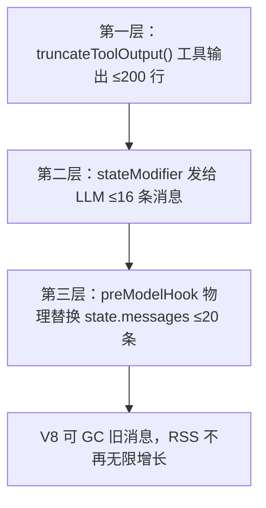

# 三、性能优化基线（v1.2.5+）

> [← 返回索引](./index.md)

### 上下文管理：三层裁剪（截断 + stateModifier + preModelHook）

未做裁剪时：prompt 峰值 **296k tokens**（b-fix round-4），内存 OOM 17 次工具调用即崩。三层裁剪协同：



> **关键区分**：stateModifier 只影响"LLM 看到多少历史"（prompt 层），**不影响 state.messages 数组**。preModelHook 才物理替换 state.messages——只有它能解决 OOM。

**第一层：工具输出截断**

```js
const TOOL_OUTPUT_MAX_LINES = 200;
function truncateToolOutput(text, maxLines = TOOL_OUTPUT_MAX_LINES) {
  const lines = String(text).split('\n');
  if (lines.length <= maxLines) return String(text);
  const half = maxLines / 2;
  return [...lines.slice(0, half), `\n... [${lines.length - maxLines} lines truncated] ...\n`, ...lines.slice(-half)].join('\n');
}
```

**第二层：上下文窗口裁剪** `stateModifier`

```js
const MAX_CONTEXT_MESSAGES = 16;
stateModifier: (state) => {
  const messages = state.messages ?? [];
  if (messages.length <= MAX_CONTEXT_MESSAGES + 1) return [systemMsg, ...messages];
  return [systemMsg, messages[0], ...messages.slice(-MAX_CONTEXT_MESSAGES)];
}
```

> **🔴 `prompt` 和 `stateModifier` 互斥**——LangGraph `_getPrompt()` 强校验，同时传会报错。

**第三层：preModelHook 物理裁剪（防 OOM）**

```js
const STATE_MESSAGES_HARD_LIMIT = 20;
preModelHook: (state) => {
  const messages = state.messages ?? [];
  if (messages.length <= STATE_MESSAGES_HARD_LIMIT) return state;
  return { ...state, messages: [messages[0], ...messages.slice(-STATE_MESSAGES_HARD_LIMIT)] };
}
```

| 参数 | 作用 | 推荐值 |
|------|------|--------|
| `MAX_CONTEXT_MESSAGES`（stateModifier） | 发给 LLM 的消息条数 | 16 |
| `STATE_MESSAGES_HARD_LIMIT`（preModelHook） | state 内物理保留条数 | 20 |
| `TOOL_OUTPUT_MAX_LINES`（truncateToolOutput） | 单条工具输出行数 | 200 |

**实测效果**：prompt 峰值 296k→~30k，OOM 阈值 17→198 次工具调用（11.6×）。

### Agent 行为约束：SKILL.md 效率铁律

未约束时 A 调 **910 次**工具，B 调 **1555 次**——同一文件读 3-4 遍、同一命令反复跑。prompt 里明确说"目标 50 步以内"就能克制。

**Reviewer**（≤50 步）：禁止重复读同一文件、禁止连续跑同一命令、批量读取、结论优先
**Engineer**（≤30 步）：Read→Edit→Test 三步循环、精准定位、验证一次就进下一个

> **遗留问题**（release-gate regression）：prompt 预期 ~53 次调用，Qwen 实际跑 130-198 次——不遵循「每维度 1 次 run_bash」策略。三层裁剪把 OOM 阈值提到 198 次，但仍不够。后续方向：① prompt 更强调批量执行 + 示例 ② recursionLimit 从 400 降到 100 强制高效 ③ 拆分 regression 步骤。

### 流式输出：stream 替代 invoke

`agent.stream(streamMode: 'updates')` 实时打印工具调用进度。`invoke()` 阻塞 5-8 分钟用户盯空白，stream 体感提升 ×2-3。

> **🔴 stream 迁移铁律见 [stream-prompt-tools.md](stream-prompt-tools.md)**——格式差异是 P0 级陷阱。
