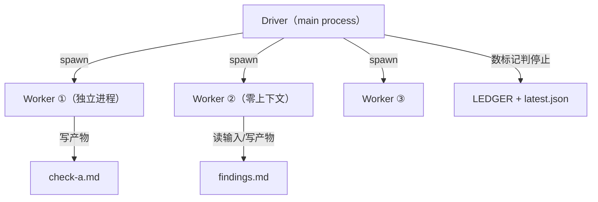

# 一、架构设计原则

> [← 返回索引](./index.md)

### 框架选型：执行后端三层（DSH CLI 桥接 → LangGraph createReactAgent → 禁用 createDeepAgent）

**现状（执行层已全面转 DSH）**：worker 走 **DSH CLI 桥接**（`dsh --profile headless "<task>"` 子进程，见 dsh-backend.ts）——用户拍板「必须走 DeepSeek Harness」。`createReactAgent` 降级为 **LangGraph fallback 路径**（DSH 包未安装/守卫拦截时），`createDeepAgent` 仍禁止。

```
worker 执行链：
createExecutionBackend({ preferred: 'dsh' })
  → DSH CLI 桥接（dsh --profile headless）   ← 默认，worker 无 sofagent 自定义工具面
  → fallback：LangGraph createReactAgent      ← DSH 不可用时
```

**🔴 DSH 桥接的核心限制（与本节教训直接相关）**：CLI 桥接**无法注入 sofagent 自定义工具**（task.tools 在子进程边界失效，dsh-backend.ts WARN「不生效」）。后果与对策：
- worker 手里只有 DSH 自带 bash/fs 工具链——**审查类任务需要的文件读取证据必须由 driver 预执行注入 prompt**（见 [四·DSH 证据注入](./driver.md#dsh-cli-桥接worker-无工具面--precheck-证据必须由-driver-注入-prompt实录)）
- 预算熔断退化为外层超时（headless 无工具循环，天然无工具预算概念）

**历史教训（LangGraph 时代，fallback 路径仍适用）**：

`createReactAgent` 是 LangGraph 时代 sub-agent 的标准，`createDeepAgent` 禁止使用。

**原因**：`createDeepAgent` 硬编码注入了 `FilesystemMiddleware`（required，无法禁用），其 `wrapToolCall` 在并行工具调用时触发 `undefined.length` 崩溃。DeepSeek 偶然不触发并行调用所以能跑，GLM-5.2 / Qwen 在 superstep 5 即崩。

```js
// ❌ createDeepAgent——FilesystemMiddleware 硬编码，并行工具调用必崩
const agent = createDeepAgent({ llm, tools, middleware: [] }); // middleware:[] 是追加空数组，不是禁用

// ✅ createReactAgent——同一套 React 模式，不带 FilesystemMiddleware
const agent = createReactAgent({ llm: model, tools, stateModifier });
```

> **教训**：`middleware:[]` 看起来像"禁用 middleware"，实际是"追加空数组"（曾因此做出假修复）。required 的东西就是 required，读源码确认 API 语义，别靠猜。

### Driver-Worker 编排模式

Driver 是纯编排层（不审查），Worker 在独立子进程中执行单个步骤（零上下文继承）。



三个设计原则：
1. **Worker 零上下文**：全新 node 进程，步骤间通过文件传递数据（check-a.md → findings.md → result.md）
2. **Driver 不审查**：只做 spawn + 判停止条件（数 P0/P1 标记）
3. **文件即接口**：Worker 的输入/输出都是文件路径，多产物用 `===FILE: filename===` 分隔

> **为什么不用 in-process**：跨步骤需要全新 agent session（清空上下文），spawn 子进程是最简单的方案——进程退出即天然清空。

### 步骤定义模式

```js
const STEPS = {
  'a-check':       { role: 'A', prompt: 'a-check.md',       outputs: ['check-a.md'],             inputs: [] },
  'a-consolidate': { role: 'A', prompt: 'a-consolidate.md', outputs: ['findings.md','result.md'],inputs: ['check-a.md','check-b.md'], maxTokens: 32000 },
};
```

**命名约定**：Prompt `<role>-<action>.md`，产物 `<action>-<role>.md`。

### 目录架构：每个 loop 自包含

```
FORGE/SKILL/
├── fresh-eyes-loop/    ← prompts/ + specs/ + runs/(gitignore)
├── release-gate-loop/  ← prompts/ + runs/
└── ...（未来新 loop）
```

`.gitignore` 通配：`FORGE/SKILL/*/runs/`。

> **坑源**：曾把 `runs/` 从 4 层深挪到 2 层深——"找文件方便"是工具层问题，不能破坏架构边界。
