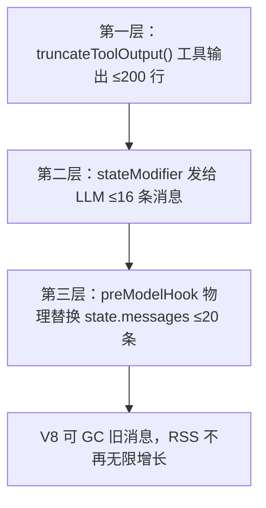

# 三、性能优化基线（v1.2.5+）

> [← 返回索引](./index.md)

### 上下文管理：三层裁剪（截断 + stateModifier + preModelHook）

> **🔴 v1.4.0 适用范围标注**：本节是 **LangGraph fallback 路径**（createReactAgent）的优化——worker 走 DSH CLI 桥接时**无 state.messages 概念**（子进程独立，DSH 自带上下文管理），三层裁剪不适用。保留本节供 fallback 场景 / 未来 Cordis 内嵌（库内集成）参考。

未做裁剪时：prompt 峰值 **296k tokens**（b-fix round-4），内存 OOM 17 次工具调用即崩。三层裁剪协同：



> **关键区分**：stateModifier 只影响"LLM 看到多少历史"（prompt 层），**不影响 state.messages 数组**。preModelHook 才物理替换 state.messages——只有它能解决 OOM。

**第一层：工具输出截断**

```js
const TOOL_OUTPUT_MAX_LINES = 200;
function truncateToolOutput(text, maxLines = TOOL_OUTPUT_MAX_LINES) {
  const lines = String(text).split('\n');
  if (lines.length <= maxLines) return String(text);
  const half = maxLines / 2;
  return [...lines.slice(0, half), `\n... [${lines.length - maxLines} lines truncated] ...\n`, ...lines.slice(-half)].join('\n');
}
```

**第二层：上下文窗口裁剪** `stateModifier`

```js
const MAX_CONTEXT_MESSAGES = 16;
stateModifier: (state) => {
  const messages = state.messages ?? [];
  if (messages.length <= MAX_CONTEXT_MESSAGES + 1) return [systemMsg, ...messages];
  return [systemMsg, messages[0], ...messages.slice(-MAX_CONTEXT_MESSAGES)];
}
```

> **🔴 `prompt` 和 `stateModifier` 互斥**——LangGraph `_getPrompt()` 强校验，同时传会报错。

**第三层：preModelHook 物理裁剪（防 OOM）**

```js
const STATE_MESSAGES_HARD_LIMIT = 20;
preModelHook: (state) => {
  const messages = state.messages ?? [];
  if (messages.length <= STATE_MESSAGES_HARD_LIMIT) return state;
  return { ...state, messages: [messages[0], ...messages.slice(-STATE_MESSAGES_HARD_LIMIT)] };
}
```

| 参数 | 作用 | 推荐值 |
|------|------|--------|
| `MAX_CONTEXT_MESSAGES`（stateModifier） | 发给 LLM 的消息条数 | 16 |
| `STATE_MESSAGES_HARD_LIMIT`（preModelHook） | state 内物理保留条数 | 20 |
| `TOOL_OUTPUT_MAX_LINES`（truncateToolOutput） | 单条工具输出行数 | 200 |

**实测效果**：prompt 峰值 296k→~30k，OOM 阈值 17→198 次工具调用（11.6×）。

### Agent 行为约束：SKILL.md 效率铁律

未约束时 A 调 **910 次**工具，B 调 **1555 次**——同一文件读 3-4 遍、同一命令反复跑。prompt 里明确说"目标 50 步以内"就能克制。

**Reviewer**（≤50 步）：禁止重复读同一文件、禁止连续跑同一命令、批量读取、结论优先
**Engineer**（≤30 步）：Read→Edit→Test 三步循环、精准定位、验证一次就进下一个

> **遗留问题**（release-gate regression）：prompt 预期 ~53 次调用，Qwen 实际跑 130-198 次——不遵循「每维度 1 次 run_bash」策略。三层裁剪把 OOM 阈值提到 198 次，但仍不够。后续方向：① prompt 更强调批量执行 + 示例 ② recursionLimit 从 400 降到 100 强制高效 ③ 拆分 regression 步骤。

### 🔴 并发 worker 总内存计算（v1.2.9 run-08~09）

> **来源**（run-08/09，2026-08-08）：8GB 机器上 6 并发 worker（各 `--max-old-space-size=2048`）= 12GB → 系统级 OOM SIGKILL，driver 静默死亡（无 stderr）。

**根因**：`spawnWorker` 给每个 worker 子进程设 `--max-old-space-size=2048`（2GB）。并发 N 个 worker 时总内存 = N × 2GB + driver 自身。在 8GB 物理内存的机器上：

| 并发数 | worker 总内存 | + driver | 合计 | 8GB 机器 |
|--------|-------------|----------|------|---------|
| 6 | 12 GB | ~1 GB | ~13 GB | ❌ OOM |
| 3 | 6 GB | ~1 GB | ~7 GB | ⚠️ 临界 |
| 1 | 2 GB | ~1 GB | ~3 GB | ✅ 安全 |

**计算公式**：`安全并发数 = floor((物理内存 - driver预留 - 系统预留) / worker_heap_limit)`

**8GB 机器**（macOS 系统占 ~2GB，driver 预留 1GB）：
```
安全并发 = floor((8 - 2 - 1) / 2) = floor(2.5) = 2 → 保险取 1
```

**16GB+ 机器**：默认 MAX_CONCURRENCY=6 安全。

**调整方式**：
```bash
# 8GB 机器强制降并发
FORGE_MAX_CONCURRENCY=1 node FORGE/src/fresh-eyes-driver.mjs --target v1.2.9
```

**铁律**：在内存受限环境启动 driver 前，先算并发上限。公式：`并发 ≤ floor((RAM - 3GB) / worker_heap_limit)`。

### worker heap 降半 + 默认并发 4→2（2026-08-16 run-07 优化）

> **来源**（run-07，2026-08-16）：并发 1 下整轮 ~60-75 分钟，瓶颈实测不在工具（run_bash 全部 0.0s 级）而在 LLM 生成——24 worker 串行 + 每 worker 多轮 ReAct 流式生成。提速靠并发，而并发的天花板被 worker heap 挡住。

**洞察**：run-09 定的 2048MB heap 是「零窗口模式 a-check+b-check 并行 + generateReportWithoutTools 裸 LLM 调用」场景的保守值。但 run-07 实测 worker 主负载是 grep/read 型轻内存操作，1024MB 足够——**上限≠占用，降上限不改变实际用量，只改变 OOM 保险丝的位置**。

**改动**（fresh-eyes-driver.mjs，2026-08-16）：
| 项 | 旧 | 新 | 理由 |
|----|----|----|------|
| worker `--max-old-space-size` | 2048 | **1024** | 实测负载轻；降半后并发 2 总 heap ≤2GB |
| `MAX_CONCURRENCY` 默认 | 4 | **2** | 8GB 新均衡点：2×1GB + driver 1GB + 系统 2GB ≈ 5GB，余量 3GB |

**新的并发公式参数**（heap=1GB）：8GB 机器安全并发 = floor((8-3)/1) = 5 → **保守取 2**（留 GLM API 并发余量）；16GB+ 机器可 `FORGE_MAX_CONCURRENCY=4`。

**回退条件**：若再遇 worker OOM（stderr 含 heap out of memory / SIGKILL 静默死亡），heap 回调 2048 并回退并发 1——说明轻负载假设在该场景不成立。

**不影响在跑的 run**：driver 主进程启动时代码已加载进内存，改磁盘 .mjs 对运行中进程零影响（本条改动在 run-07 运行中完成并验证）。

### 流式输出：stream 替代 invoke

`agent.stream(streamMode: 'updates')` 实时打印工具调用进度。`invoke()` 阻塞 5-8 分钟用户盯空白，stream 体感提升 ×2-3。

> **🔴 stream 迁移铁律见 [stream-prompt-tools.md](stream-prompt-tools.md)**——格式差异是 P0 级陷阱。
