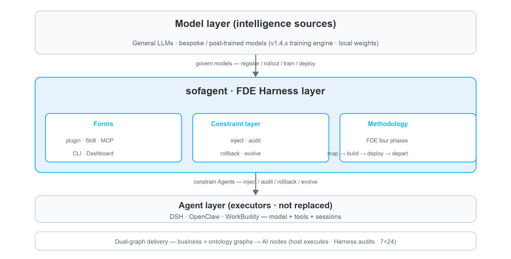
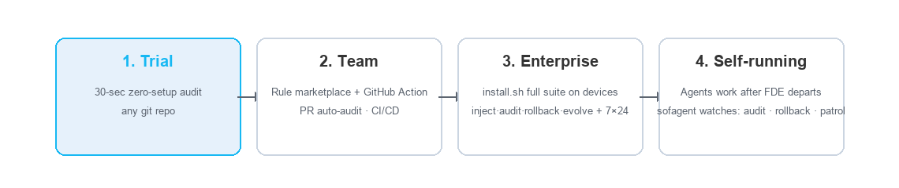

<p align="center">
  
</p>

<p align="center">
  <a href="https://github.com/KongFangXun/sofagent/actions/workflows/verify.yml"></a>
  <a href="./LICENSE"></a>
  <!-- ⚠️ bump version: manually sync this badge version (Version-vX.Y.Z) -->
  <a href="./CHANGELOG.md"></a>
</p>

---

## What is this

**An open-source FDE Harness layer.** The AI-deployment engineer for one-person companies and SMBs — never sleeps, never leaves, and carries its own auditor. It sits **between mature Agents (executors: DSH / OpenClaw / WorkBuddy) and the model layer (intelligence sources: general LLMs + bespoke/small post-trained models)**, governing both sides. Shipped as **FDE plugins + Skill + MCP + CLI + Dashboard**: on entry, map the business flow clearly, build the ontology graph, deploy the AI nodes in place; on departure, audit every change and keep optimizing.

sofagent does not build its own Agent — execution is delegated to mature hosts (model + tools + sessions). What it delivers is the **FDE Harness layer**: methodology + constraint layer + audit — constraining executors (Agents) and governing intelligence sources (models), turning any existing Agent into one that "does enterprise AI deployment like an FDE" and keeping every model (general or bespoke) under control (register / rollout / train / deploy fully audited).

> 🏞️ Big tech hands you "water" (foundation models) and "riverbeds" (Agent platforms) — but the water is raw, and you don't dare drink it straight. sofagent is the engineering that makes the river usable for a whole city: dams keep the water from flooding, treatment plants turn raw water into drinking water, and pipe networks deliver it to every faucet. Models supply 90% of the intelligence; sofagent supplies the 10% of reliable execution.

## Core Features

- 🧭 **Map the business flow on entry** — five-element deep-dive + three-question triage, capturing every role's process steps and pricing out what each AI node is worth
- 🤖 **Deploy AI nodes** — three-layer deliverables (documents + Skills + runtime), installed into your existing AI tools; from "you do the work" to "you delegate the work"
- 🏠 **Stay resident after departure** — the FDE capability remains for inspection, audit, and optimization, 7×24 online; the human leaves, governance doesn't
- 🔍 **Zero-setup audit** — `npx -y -p @sofagent/audit sofagent-audit`, auditing the latest commit of any git repo in seconds (single-machine measured: quick ~1.1s, 50k-line diff ~6.1s; see [HANDBOOK](./docs/HANDBOOK.md))
- 🧱 **24 audit rules + 67 MCP tools** — secret leaks, out-of-scope edits, injection defense, privilege red lines; judged on git diff hard evidence, violations blocked on the spot; evidence is based on local diffs — trust boundaries and known bypass surfaces in [LIMITATIONS §3](./docs/LIMITATIONS.md) (quick runs 17 by default; full 24 = 17 default + 7 extensions)
- 🛡️ **Automatic snapshot rollback** — auto-archived after every audit, one-click restore to any snapshot when something breaks

## What is an FDE Agent

**FDE = Forward Deployed Engineer** — the person who embeds models into real enterprise operations. sofagent turns this role into an open-source FDE Harness layer, sitting between the Agents you already have (DSH / OpenClaw / WorkBuddy) and the model layer, so they gain FDE capability and models stay governed, walking a full FDE business flow through four phases:

- **Phase 1 · Map the business flow on entry** — capturing each role's input / output / owner / time cost / pain points, and calculating what each AI node is worth
- **Phase 2 · Build dual graphs** — business graph (system boundaries, data flows) + ontology graph (shared semantic foundation), turning the enterprise into a machine-readable structure
- **Phase 3 · Deploy AI nodes** — three-layer deliverables (documents + Skills + runtime), installing AI nodes into your existing tools; from "you do the work" to "you delegate the work"
- **Phase 4 · Continuous optimization after departure** — 7×24 automated task execution after the FDE leaves: inspection, audit, optimization; the human leaves, governance doesn't

Official slogan: **Map business flows · Build ontology graphs · Deploy AI nodes · Audit every change · Reflect & iterate**

<p align="center"></p>

**Why an FDE Agent**

- **The bottleneck for enterprise AI is deployment, not the model** — mapping workflows, drawing system boundaries, and setting data rules is precisely the FDE's job. MIT NANDA's *The GenAI Divide*: 95% of enterprise GenAI projects failed to produce value worth a financial statement, while FDE job postings surged 729% in a year (verification in [VALIDATION](./docs/VALIDATION.md))
- **Completeness comes from the union** — DSH solves "can work"; sofagent solves "keeps working"; only together do they make a complete FDE Agent (next chapter)
- **"Continuous optimization" only holds with a constraint layer** — backed by auditable, rollback-capable mechanisms, not promises in prompts. Independent external experiment: same model, only the outer Harness optimized — a legal-Agent benchmark rose 63.4% → 80.1% (+16.7pp). More verification in [VALIDATION](./docs/VALIDATION.md) · [THANKS](./docs/THANKS.md)
- **Capabilities are portable, never dead-bound to a platform** — the constraint layer is platform-agnostic; the methodology follows the business, not the platform

> 🔄 **Self-bootstrapping**: sofagent's first FDE engagement is sofagent itself — the project is a complete FDE business flow (map → build → deploy → depart), and this open-source repository is that deliverable.

## v1.4.1: Training Engine Foundation

🚂 The foundation for enterprise AI that "gets stronger by itself" — eight training-engine blocks (train-job orchestration / HMAC audit chain / enterpriseId isolation / reproducible fingerprint / weight signing / interruption reclaim / crash recovery / security baseline) + Stage-0 convergence verified on macOS Metal. Tests 2981→**3222** (+241). Full details in the [devlog](./docs/changelog/v1.4/v1.4.1.md) · earlier versions in [CHANGELOG](./CHANGELOG.md).

## Multi-platform Mounting

Sits between the Agents you already use and the model layer — it doesn't replace the model, only adds reliable execution. **The FDE Harness layer is platform-agnostic** (five forms — plugin / Skill / MCP / CLI / Dashboard — distributed by host capability); the methodology follows the business, not the platform:

| Tier | Platform | Constraint injection | Mounting method |
|------|----------|---------------------|-----------------|
| **Deep integration** | DeepSeek Harness | ✅ Plugin-level | 9 `cordis-plugin-sofagent-*` mounted into the runtime (previous chapter) |
| **Full mounting** | OpenClaw | ✅ Automatic | Hook injection + circuit breaker |
| | WorkBuddy | ✅ Automatic | Skill on-demand loading |
| **Thin mounting** | Claude Code / Codex / Cursor / Gemini CLI | ⚠️ Manual | Deployment constitution + seed directives (written into each platform's config file) |

- **Auto-loading is granted by the host runtime** — Skill on-demand loading depends on whether the host has a skill registry (DSH / OpenClaw / WorkBuddy do; thin-mount platforms carry it via static config files)
- **Audit fallback is platform-agnostic** — `sofagent-audit --install-hook` runs as a git hook; at every tier, every commit passes through all 24 audit rules, violations hard-blocked. Constraints are advisory; auditing is mandatory

One command selects your mounting tier: `bash install.sh --platform <platform-name>` (all platforms and differences in [HANDBOOK](./docs/HANDBOOK.md))

## FDE Methodology

Many companies adopt AI the wrong way around — they pick models, build platforms, and buy Agents first, only to find nobody uses them. The problem isn't the technology; it's that **they haven't figured out their own business processes before handing them to AI**.

Most tools teach you how to build Agents; sofagent first answers **where AI should go** — turning the five-element deep-dive and three-question triage from guesswork into a repeatable methodology:

| Phase | Input | What happens | Deliverable |
|-------|-------|--------------|-------------|
| 1 · Map | Role roster · existing systems | **Five-element deep-dive** — capture each step's input / output / owner / time cost / pain points | Enterprise profile |
| 2 · Triage | Enterprise profile | **Three-question triage** — which steps fit AI: 🔄 automate · ⚡ augment · 👤 leave alone, prioritized by ROI | Node plan + annual savings |
| 3 · Deliver | Node plan | **Three-layer deliverables** — documents + Skills + runtime, so AI nodes actually run | Ontology + workflow.yml + skills/ |

Full methodology (four phases, twelve steps) in [FDE/GUIDE.md](./FDE/GUIDE.md) — a half-day read, enough to run FDE independently afterwards.

> 💾 **Don't rush off after deployment**: each node's workflow is "burned" onto a USB drive through the DeepSeek Harness execution backend — the drive becomes one node, one key: plug it into any machine and it runs there (unplug, zero residue). The 9 open-source plugins are already mounted into DSH — burn and go.

## FDE Skill System

Deploying an AI node is only the first step — the chapters above cover how to map the flow and where to put it; this one covers how to keep it behaving every single time. The FDE Skill System, loaded together with the node, answers that:

- 📜 **SKILL.md** — the single main entry, loaded by your AI tool: routes to the corresponding sub-Skill by phase, with role norms auto-injected by task type (mapping / audit / orchestration)
- 🧩 **Phase sub-Skills** — a five-step closed loop of entry → deep-dive → quantify → deliver → depart (01-entry → 05-exit); what to do and what to deliver at each step is defined up front
- 🔒 **Harness constraint skeleton** — entry-gate / fde-template / engage / loop-check / task-closure… every step from entry to departure has its matching constraint template
- 🧬 **Experience auto-capture** — think.md reflection + knowledge maintenance; the lessons of every task land in the knowledge base automatically

> What gets deployed is not a bare Agent, but an **Agent with a constraint skeleton** — constraints are advisory, auditing is mandatory: the Agent may ignore the constraints, but every change gets audited without exception.

## Constraint Layer (Harness)

The constraint layer is sofagent's behavioral foundation, with four capabilities:

- **Injection** — inject enterprise constraints at Agent startup through the four-layer loading chain; constraints are advisory
- **Audit** — 24 git-diff hard-evidence rules (quick runs 17 by default, 7 extensions enabled via config) + AgentShield five-face static config scanning; auditing is mandatory — every change gets audited, violations blocked on the spot
- **Rollback** — auto-archived snapshot after every audit, one-click restore to any snapshot
- **Evolution** — think.md reflection + Dream Cycle + skillopt, experience auto-captured into the knowledge base

## Installation

> ⚠️ **Enterprise users read first** [LIMITATIONS §3](./docs/LIMITATIONS.md) — `config.yml` is **non-fail-closed by default** (rules can be bypassed by Agent tampering), and multi-tenant isolation is not yet landed. For strict-compliance scenarios use CI fallback + file-permission lock (`chmod 444 .sofagent/config.yml`); do not put the single-machine default config directly into production.

**30 seconds, zero setup** — run an audit in any git repo:

```bash
npx -y -p @sofagent/audit sofagent-audit
```

> 💡 quick runs the **17 default rules** (A3 task-scope / A9 commit-msg injection detection active — quick mode auto-reads the latest commit message; when no message is available, A9 is handled by the engine as no-input and marked skipped). The full 24 rules + hook auto-audit require `--init` — see [LIMITATIONS §3](./docs/LIMITATIONS.md).

Here's what it looks like when a known-format secret leak is blocked (real output; A2 detects AWS AKIA, OpenAI sk-*, GitHub ghp_, PEM private keys and other known formats — generic secret shapes are intentionally out of scope, a conservative design against false positives, see [LIMITATIONS §3 A2](./docs/LIMITATIONS.md#三安全与信任模型局限)):

<p align="center"></p>

**Full install** (Node.js ≥ 18, download and review before running) — **installed on the enterprise devices running the AI nodes**:

```bash
curl -fsSL https://raw.githubusercontent.com/KongFangXun/sofagent/refs/tags/v1.4.1/bootstrap.sh -o bootstrap.sh
less bootstrap.sh          # review the script first, confirm it's safe
bash bootstrap.sh && rm bootstrap.sh
sofagent-audit --init      # install the git hook — every commit is audited from now on
sofagent-audit --doctor    # verify the environment (optional)
```

> 💡 All install scripts only write to `~/.sofagent/` and never touch system files. `--no-verify` can skip the commit-msg audit — it guards against honest Agents' carelessness, not malicious bypass; skipped commits are reconciled afterwards by the post-commit hook (flagged "suspected bypass") but not blocked. Personal fallbacks: CI-side `sofagent-audit --diff`, periodic `--doctor`, and reviewing the audit records. See [LIMITATIONS](./docs/LIMITATIONS.md).
>
> 📌 **install.sh is the enterprise device installer** — install it on the enterprise devices running the AI nodes (constraint-layer engine + daemon inspection + single-machine dashboard); FDEs do not need to run it on their own machines — the FDE's tools are the [FDE Skill](https://clawhub.ai/kongfangxun/skills/sofagent) (methodology). See [deployment architecture](./docs/ARCHITECTURE.md#安装包边界与部署架构v132-定位校准).
>
> 📌 **How bootstrap.sh and install.sh relate**: bootstrap.sh is a one-line download wrapper around install.sh — `curl bootstrap.sh | bash` is equivalent to "download install.sh + run install.sh". Both scripts install exactly the same thing; bootstrap just saves you the manual clone/download step.

More install options (clone install / full npx install / minimal install / enterprise deployment) in [HANDBOOK](./docs/HANDBOOK.md). Enterprise users who just want the FDE methodology for mapping business workflows, see [FDE/README.md](./FDE/README.md) (zero dependencies, no Node.js needed; for the 15-minute shortest path see its "15-minute shortest path" section).

## Usage

<p align="center"><br/><sub>Dashboard cockpit (single-file HTML · screenshot shows v1.4.0): rule pass rate, audit tasks, violation trends — see at a glance what the AI is doing.<br>(The installed UI is the source of truth.)</sub></p>

> 📊 **The Dashboard has three entries, each in its place**:
>
> | Entry | Command | Form | Who it's for |
> |------|------|------|--------|
> | **Terminal** | `sofagent-dashboard --full` | Terminal ASCII three-pane (zero frontend dependencies) | Developers / FDE quick check |
> | **Web** | `sofagent web` (works right after install) · repo-mode `node tools/dashboard/serve-dashboard.mjs` | Browser visualization (localhost:3780) | Boss / IT visual review |
> | **macOS double-click** | Double-click `start-dashboard.command` | macOS shortcut to the Web version (macOS double-click entry only) | macOS users |

> 👁️ **Agent's view**: with hooks installed, every commit triggers an audit — PASS passes silently (auto-snapshot), violations are printed directly into the terminal output and pushed via Webhook / IM per config; there is no separate GUI on the Agent side (see [PHILOSOPHY §2](./docs/PHILOSOPHY.md#系统暴露的能力agent-视角)).

<p align="center"></p>

| Entry | What it does | Where installed | Time needed |
|------|--------|--------|:----:|
| **`npx -y -p @sofagent/audit sofagent-audit`** | Zero-setup audit of the last commit, results in seconds (first npx ~30s) | Any git repo (temporary) | 30 sec |
| **`--ruleset` rule marketplace** | Load rulesets like security, or custom JSON rules | Same as above | 1 min |
| **GitHub Action** | Auto-audit every PR, violations annotated on the diff lines | CI/CD | Set up once |
| **install.sh full suite** | inject · audit · rollback · evolve + daemon inspection + dashboard — the Agent's complete constraint layer | **Enterprise device** (server/computer running the AI nodes) | FDE residency |

**Install-granularity comparison** (same engine, three install styles — pick by scenario):

| Style | Command | Lifecycle | Best for |
|--------------|---------|-----------|----------|
| npx temporary | `npx -y -p @sofagent/audit sofagent-audit` | use-and-go, downloaded each time | quick audit of any repo, one-off checks outside CI |
| npm in-project | `npm install @sofagent/audit` (project devDependency) | installed with project, version locked in package-lock | team projects with fixed deps, reproducible audits |
| npm global | `npm install -g @sofagent/audit` | install once, use everywhere | daily audit across repos, daemon residency |

**Rule marketplace** — community rulesets are published as `sofagent-ruleset-*` npm packages and loaded manually via `--ruleset-path` (which also accepts your own JSON rules):

```bash
npx -y -p @sofagent/audit sofagent-audit --list-rulesets      # see available rulesets
npx -y -p @sofagent/audit sofagent-audit --ruleset security   # load the security ruleset
```

**FDE on-site deployment** — pick either of two paths:

- **Methodology path** (zero dependencies): read [FDE/GUIDE.md](./FDE/GUIDE.md) and map business workflows manually following the handbook — Excel + your own brain is enough
- **Tooling path** (Node.js ≥ 18): after the FDE installs the constraint layer on the enterprise device via install.sh, tell your own AI tool "run an FDE diagnosis for me" — the Agent guides you from entry onward
## FAQ

- **Is it production-ready?** Currently a single-machine, single-user design — multiple Agents share one knowledge base / audit history (tenant isolation is on the [ROADMAP](./docs/ROADMAP.md)); task logs (task/logs) are written in plaintext, and static encryption currently covers the audit history main chain but not task/logs. Read [SECURITY](./SECURITY.md) · [LIMITATIONS](./docs/LIMITATIONS.md) before enterprise deployment. `config.yml` is non-fail-closed by default; for strict-compliance scenarios use CI fallback + file-permission lock.
- **Does it collect my data?** Fully local by default. Optional federation queries leave your machine only when you configure them yourself (see SECURITY).
- **How does it relate to scanners like gitleaks?** Complementary, not substitutes — scanners do full-history scans with broader pattern libraries; sofagent focuses on hard evidence from the current diff + Agent behavior auditing (out-of-scope / injection / privilege dimensions). For strict secret compliance, use both together.

## Ecosystem & Docs Index

**Upstream & plugin entries**:

- DeepSeek Harness (upstream repository): <https://github.com/deepseek-ai/deepseek-harness>
- Cordis runtime: <https://github.com/cordiverse/cordis>
- 9 `cordis-plugin-sofagent-*` plugin sources: [`engine/dsh-plugins/`](./engine/dsh-plugins/)

| You want to know | Where |
|:---------|:--------|
| **Global index** (one entry to all docs, in Chinese) | [WIKI](./docs/WIKI.md) |
| How to install, use, FAQ | [HANDBOOK](./docs/HANDBOOK.md) |
| Architecture (constraint layer · injection chain · evolution · 24 rules) | [ARCHITECTURE](./docs/ARCHITECTURE.md) |
| Design philosophy | [PHILOSOPHY](./docs/PHILOSOPHY.md) |
| Industry validation & ecosystem positioning (differences from existing tools) | [VALIDATION](./docs/VALIDATION.md) |
| Version roadmap | [ROADMAP](./docs/ROADMAP.md) |
| What each version delivered | [CHANGELOG](./CHANGELOG.md) |
| FDE diagnostic methodology (four phases, twelve steps) | [FDE/GUIDE.md](./FDE/GUIDE.md) |
| Security statement · known limitations | [SECURITY](./SECURITY.md) · [LIMITATIONS](./docs/LIMITATIONS.md) |
| Contribution guide | [CONTRIBUTING](./CONTRIBUTING.md) |

> 🧪 **Engineering credibility**: 3178 tests / 13 packages (12 with tests) · 24 audit rules · fresh-eyes independent review continuously running (test counts are determined by `tools/check/test-count.sh`; running `npm test` directly may show mcp package timeouts (red) on low-memory machines — re-running that package alone passes, an environment concurrency issue, not a product defect. Review system: [docs/guides/review-system.md](./docs/guides/review-system.md). Performance figures are single-machine reference values; cross-tool benchmarking is scheduled for v1.4.x together with Benchmark integration).

---

<p align="center">
  Issues and PRs welcome, especially the nitpicky kind · <a href="./CONTRIBUTING.md">Contributing</a> · <a href="./docs/THANKS.md">Thanks</a><br/>
  <sub>MIT License © <a href="https://github.com/KongFangXun/sofagent">Kong Fangxun</a> · <a href="https://github.com/KongFangXun/sofagent">⭐ If sofagent helps you, star it and help more people find it</a></sub>
</p>
