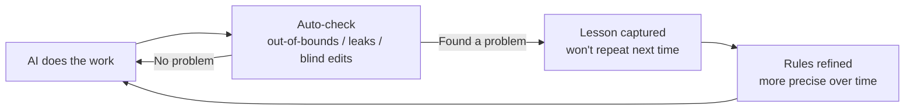
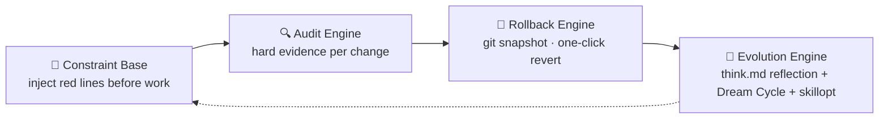

# sofagent

> 🌐 [中文 →](README.md) | English

<p align="center">
  <a href="https://sofagent.ai">
    
  </a>
</p>

<p align="center">
  <strong>FDE (Forward Deployed Engineer) Agent — map workflows · deploy AI nodes · audit every change · capture experience</strong>
</p>

> **sofagent is an FDE Agent** — it comes in, maps your workflows, turns the automatable parts into AI nodes, and runs 7×24 on its own after deployment. Every action the AI takes is automatically checked (warns when it steps out of bounds, rolls back when something breaks, shows you everything it did), and experience is captured automatically — the more you use it, the better it gets.

<p align="center">
  <a href="https://github.com/KongFangXun/sofagent/actions/workflows/verify.yml"></a>
  <a href="./LICENSE"></a>
  <a href="./CHANGELOG.md"></a>
  <a href="#quick-start"></a>
</p>

<p align="center">
  <a href="#what-is-this">What is this</a> · <a href="#quick-start">Quick Start</a> · <a href="#further-reading">Docs</a> · <a href="https://github.com/KongFangXun/sofagent">⭐ Star</a>
</p>

---

## What is this

**The more capable your AI gets, the harder it is to let go** — it writes wrong code, leaks secrets, messes up your files, and you have no idea. When something actually goes wrong, who's responsible? Can it be stopped? Can it be rolled back?

sofagent solves exactly this: **it helps you govern your AI — the AI does the work, you just keep watch.**

Concretely, it does three things:

| What you worry about | What sofagent does | In plain words |
|---------|----------------|---------|
| **Want AI to run on its own?** | First maps your workflows, turns the automatable parts into AI nodes, deployed and running by themselves | From "you do the work" to "you delegate the work" — AI nodes run 7×24 on their own |
| **What if AI goes rogue?** | Every change the AI makes is checked automatically | Someone is watching — the moment it steps out of bounds, you get an alert |
| **What if AI breaks something?** | Every change is archived automatically, one-click rollback | When things go wrong, one click takes you back to a safe state |
| **What if I switch AI tools/models?** | Platform-agnostic — Claude, GPT, self-hosted models all work | Switching models doesn't weaken your protection |
| **Does it get better over time?** | Experience from every AI task is captured automatically, rules refined through regular inspections | It understands your business better the more it works |

**🏞️ Think of it as a river** — big vendors give you "water" (the LLM) and a "riverbed" (the Agent platform), but the water is raw; you wouldn't dare drink it straight. sofagent is the **dam + water treatment plant + pipe network + faucet**:

- **Dam** — keeps the water from flooding (constraining the AI)
- **Water treatment plant** — turns raw water into drinking water (safe sandbox)
- **Pipe network + faucet** — delivers the water where it should go (pipeline constraints)

In short: **it takes AI from "usable" to "safe to trust".**

> 🎯 **90/10 value split**: the model provides 90% of the intelligence; sofagent adds the 10% of reliable execution — and over time that 10% becomes the most valuable part. It's not about building a smarter model; it's adding a set of gates to the intelligence you already have.

> 🔬 **Independent external evidence** (not sofagent's own benchmark): Joel Niklaus' harness-optimization research on HuggingFace shows that with the same model and unchanged weights, optimizing only the outer harness lifted a legal-Agent benchmark from **63.4% → 80.1% (+16.7pp)** — the entire gain came from outer-layer mechanisms. Independent evidence that this class of constraint mechanism works. See [THANKS.md](./docs/THANKS.md).

<details>
<summary>🔄 How does it "get better with use"? (click to see the loop)</summary>



Every violation the AI gets stopped for, and every success, is captured into a "lessons library" — the next run avoids them automatically. That's how it understands your business better over time.

</details>

<details>
<summary>🔧 Technical details (for developers)</summary>

Under the hood it's a **Harness middleware** — every time the Agent finishes a change, audit rules run automatically; violations are blocked on the spot, compliant changes are snapshotted. Four key points:

- **Audit rule structure**: 24 registered rules = 17 enabled by default + 7 extended (require explicit opt-in), including 9 baseline rules that cannot be disabled
- **Zero-token audit core**: hard evidence from git diff — 19/24 rules are pure git-diff (no Agent cooperation needed); 4 hybrid rules need Agent logs
- **Gradual loading**: the core iron-rules layer (core-rules.md ~30 lines) is always injected + role norms appended on demand by task type; the four-layer loading chain skeleton (SKILL.md → fde.md → think.md → knowledge/) is preserved, providing a behavioral baseline for the Agent to read voluntarily (not force-injected)
- **Audit interception paths**: interception works on all paths; reflection generation (think.md) triggers only on MCP/CLI paths

Full architecture: [ARCHITECTURE.md](./docs/ARCHITECTURE.md).

</details>

### How to see what the AI is doing

Two panels give you the whole picture at a glance: where data goes (is anything being exfiltrated), whether the AI broke a rule (overstepping), where the task stands (alive or dead):

**🖥️ HTML Dashboard (web version, recommended)** — a 6-page visual console, all driven by real data: cockpit (live metrics) · FDE guide · AI nodes · ontology · knowledge base · toolbox (install · architecture · audit rules · MCP · npm · docs · FORGE).

**One-click launch**: macOS users can double-click [`start-dashboard.command`](./start-dashboard.command) in the repo root (auto-opens the browser, closes when you close the window).

```bash
node tools/serve-dashboard.mjs    # command-line launch (cross-platform, auto-opens browser)
# → http://localhost:3780
```

> How to open: open via the server to read live data from `~/.sofagent/data` (browser security restriction). Chrome/Edge users can also click "Connect data directory" in the page to pick a directory directly — no server needed. Opening the HTML statically only shows sample data.

**💻 Terminal panel (bash)** — lightweight, zero dependency (requires jq):

```bash
sofagent-dashboard           # view current status
sofagent-dashboard --watch   # live refresh (for watchful reviews)
sofagent-dashboard --full    # expanded full view
```

> Prerequisite: requires `jq` (`brew install jq` / `apt install jq`).

### From delivery to self-running (activation chain)

After the FDE delivers the ontology + workflow.yml + skills/, since v1.2.5 the deliverables run themselves in four steps:

| Stage | What it does | Version |
|------|--------|:----:|
| **ACTIVATE** | Reads the deliverables → registers enterprise SubAgents | v1.2.5 ✅ |
| **ORCHESTRATE** | Builds the enterprise-specific workflow graph (Phase 2 first half: mapping table + registry extension / Phase 2 second half: enterprise-graph) | v1.2.6 ✅ · v1.2.7 ✅ |
| **EXECUTE** | Run + human confirmation + per-step audit | v1.2.8-v1.2.9 (planned) |
| **SUSTAIN** | Continuous optimization, gets better the longer it runs | v1.3.0 (planned) |

Design details: [activation chain doc](./docs/guides/fde-activation-chain.md)

### What's new in v1.2.7?

> 🆕 One-line install, environment check & repair, context compression, goal-driven… full list in [CHANGELOG.md](./CHANGELOG.md).

---

## Quick Start

After installing, say one sentence to your AI tool (WorkBuddy / Codex / Claude Code) and sofagent starts working. No new interface to learn — use the conversational style you already know.

| You are… | First step | What you need |
|------|------|------|
| **Enterprise user** | Install the [FDE guide tool](./FDE/README.md) → the conversation walks you through mapping workflows | Zero dependencies, no Node.js needed |
| **Burning USB keys for employees** | `sofagent-daemon create-usb-key --role "node name" --target /Volumes/XXX --platform macos` | Installed daemon + a USB key |
| **Developer** | `bash install.sh` → `sofagent-audit --init` → install git hook audit | Node.js ≥ 18 + git |

> **Prerequisite**: run the developer path in the root of a git repo. If you don't have a repo yet, run `git init` first.

```bash
# Option 1: one-line install (new in v1.2.7 · recommended)
curl -fsSL https://raw.githubusercontent.com/KongFangXun/sofagent/main/bootstrap.sh | bash

# Option 2: full install (clone + install.sh)
git clone https://github.com/KongFangXun/sofagent.git && cd sofagent
bash install.sh          # install (auto-detects shell config; open a new terminal or source after)
sofagent-audit --init    # initialize (installs git hook)
sofagent-audit --doctor  # verify environment is ready (optional but recommended)
```

> 💡 If `sofagent-audit` still says command not found, **open a new terminal window** and try again.
> 💡 **Don't need the engine?** If you only need the FDE methodology (installing a governance Skill for your Agent), go straight to [FDE/README.md](./FDE/README.md) — zero dependencies, no Node.js.
> 💡 **Next step**: after installing, run `sofagent-audit --doctor` to check environment status, or see the [project navigation index (WIKI) →](./docs/WIKI.md)

### Other install options (optional)

| Option | Who uses it | How |
|------|------|--------|
| 🚀 **npx zero-install** | Quick trial / CI environments | `npx @sofagent/audit --init` (use immediately, no download) |
| ⚡ **install.sh minimal install** | Developers / enterprise IT | `bash install.sh --base-only` (base engine only) |

> [!NOTE]
> - **Requirements**: Node.js ≥ 18 + bash + git
> - **Platforms**: macOS / Linux fully supported, Windows experimental
> - **Terminal Dashboard**: requires jq (macOS `brew install jq` · Linux `apt install jq` / `yum install jq`); the HTML web Dashboard does not need jq

<details>
<summary>🚀 Three-step first experience after install</summary>

> ⚠️ Must run inside a git repo (initialize one with `git init`).

```bash
# 0. Initialize — install the git hook so the audit engine can block commits
sofagent-audit --init

# 1. See the rules — the Agent carries these red lines while working
sofagent-audit --help | head -5

# 2. Run an audit — the --init in step 0 installed a pre-commit hook, so every commit is blocked
# GIT_EDITOR=true keeps git commit from opening an editor (common in CI/automation)
echo "API_KEY=sk-123456" > .env && git add -f .env && GIT_EDITOR=true git commit -m "add env config"
# → ⛔ A1 sensitive files: .env contains a key pattern, commit blocked (never lands)

# 3. See snapshots — auto-archived after every audit
sofagent-audit --timeline

# Cleanup after the demo
git rm --cached -f .env 2>/dev/null; rm -f .env
```
</details>

> ⚠️ **About commit blocking & honest boundaries**: `git commit --no-verify` can bypass the local hook — sofagent is designed as a "guardrail for honest Agents", guarding against **honest Agents' mistakes** (accidentally committing secrets, out-of-scope edits), not malicious Agents deliberately bypassing the rules (hooks can be bypassed, CI cannot). For high-security enterprise scenarios, add a second `sofagent-audit --diff` audit on the CI/CD side as a backstop. See [LIMITATIONS](./docs/LIMITATIONS.md) §1 Known architectural limitations.

**Install on demand**:

| Package | Purpose |
|------|------|
| `@sofagent/audit` | Audit engine (24 rules, git diff hard evidence) |
| `@sofagent/core` | Runtime diagnostics (doctor / verify) |
| `@sofagent/orchestrator` | FORGE self-iteration toolchain (LOOP pipeline + task orchestration; orchestration capability is kept but **not marketed to users** — task orchestration is done by your Agent platform, sofagent only provides constraints/audit/experience capture during the process) |
| `@sofagent/daemon` | Daemon process (file monitoring / scheduled inspection) |
| `@sofagent/mcp` | MCP Server (JSON-RPC 2.0) |

> 💡 Uninstall: `npm uninstall -g @sofagent/audit` + clean up the remaining global packages + `rm -f .git/hooks/commit-msg .git/hooks/post-commit`

⚠️ **Data storage note**: sofagent currently stores audit data as plaintext Markdown in `~/.sofagent/data/`. Built-in encryption (age) is planned for v1.4.0. Before production use, we recommend:
- macOS: put `~/.sofagent/` on an APFS encrypted volume
- Linux: mount `~/.sofagent/` on a LUKS encrypted partition
- See [SECURITY.md](./SECURITY.md#已知风险明文存储)

---

## Why not existing tools

| Tool | What they manage | What sofagent manages |
|------|:--------|:----------------|
| AI Agent platforms (OpenClaw etc.) | Making AI "able to do things" | Making AI "do it right every time, and be accountable when it goes wrong" |
| Enterprise AI consulting | One-time delivery, gone once the consultant leaves | Tool + resident, reusable and maintainable |
| Code checkers (pre-commit etc.) | Checking "is the code written well" | Checking "did the AI behave right" (out-of-bounds / leaks / blind edits) |

In one sentence: **existing tools check code; sofagent checks AI behavior** — secret leaks, out-of-scope file edits, blind modifications. These are AI-specific ways of causing trouble that generic tools don't cover.

<details>
<summary>🔧 Specific differences from technical tools (for developers)</summary>

| Tool | What they manage | What sofagent manages |
|------|:--------|:----------------|
| detect-secrets / gitleaks | Secret scanning (full history + 100+ patterns) | A2 covers common API keys; the differentiator is **Agent behavior auditing**, not secret coverage |
| Cursor Rules / Claude hooks | Single-platform IDE constraints | Audit layer works on all platforms (git diff); constraint layer is tiered per platform (deepest on OpenClaw → WorkBuddy SKILL → other seed instructions) |

> ⚠️ **Comparison snapshot timestamp**: the comparisons above are based on public capability snapshots as of 2026-08-02; tools iterate fast, so details may be outdated. The core differentiator (sofagent audits "AI behavior" rather than "code quality") does not change with tool versions.

</details>

<details>
<summary>📦 After the FDE leaves, the enterprise keeps five things</summary>

The first four are assets; the fifth is the FDE Agent itself that keeps the first four alive — sofagent stays at the customer and keeps running:

| Deliverable | Description |
|--------|--------|
| Deployment manual | An operations manual enterprise IT can maintain independently |
| AI nodes | Running Agents that auto-execute daily tasks (financial reconciliation, audit inspection, data analysis…) |
| AI knowledge base | Continuously accumulated entities, concepts, comparison pages (auto-captured by Dream Cycle) |
| Private evaluation system | eval feedback + Skill iteration history — enterprise IP that can't be copied |
| **The FDE Agent itself** | The control layer stays resident — manages the lifecycle of audit / constraints / knowledge; the human leaves, it stays |

</details>

### How it differs from similar solutions

| Dimension | sofagent | LangSmith | Guardrails AI |
|------|----------|-----------|---------------|
| Positioning | Agent behavior constraint layer (constraint + audit + experience capture) | LLM observability platform | LLM output validation |
| Deployment | Local-first, zero cloud dependency | SaaS | Library integration |
| Core capability | git hook audit + rule interception + constraint injection (provides audit/constraint/capture during Agent platform orchestration) | trace/eval | Output format constraints |
| Use case | Enterprise AI governance & compliance | Development debugging | Single-point output validation |

---

## Deployment sizing (enterprise IT reference)

| Deployment scale | Concurrent Agents | CPU | Memory | Disk | Use case |
|---------|:---:|:---:|:---:|:---:|---------|
| Individual / small team | 1-3 | 1 core | 512 MB | 500 MB | Solo development, git commit hook audit |
| Mid-size team | 5-10 | 2 cores | 1 GB | 2 GB | Multi-dev collaboration, resident daemon + webhook push |
| Enterprise | 10+ | 4 cores | 2 GB | 5 GB+ | Multi-repo federation, A/B review + knowledge base + Dashboard |

> **Resource usage notes**:
> - **Disk**: `~/.sofagent/data/` (audit history + snapshots + knowledge base, ~5 MB/repo/day)
> - **Memory**: resident daemon (~50 MB) + Node.js runtime (~200 MB/concurrent Agent)
> - **Network**: outbound LLM API only, no inbound ports required

---

## Further reading

| You want to know | Where |
|:---------|:--------|
| 🖥️ Dashboard (HTML web + terminal) | [↑ How to see what the AI is doing](#how-to-see-what-the-ai-is-doing) · or open [`dashboard.html`](./dashboard.html) directly in the repo root |
| FDE diagnostic methodology (four phases, twelve steps) | [GUIDE.md](./FDE/GUIDE.md) |
| 🔗 Activation chain design (deliverables → self-running) | [activation chain design doc](./docs/guides/fde-activation-chain.md) |
| How to install, use, and FAQ (enterprise users) | [HANDBOOK](./docs/HANDBOOK.md) |
| Engine architecture, 24 rules, internal mechanisms | [↓ Engine architecture (developers)](#engine-architecture) |
| Why it's designed this way | [ARCHITECTURE](./docs/ARCHITECTURE.md) |
| Design philosophy | [PHILOSOPHY](./docs/PHILOSOPHY.md) |
| Industry validation and ecosystem positioning | [VALIDATION](./docs/VALIDATION.md) |
| Security statement (incl. data storage) | [SECURITY](./SECURITY.md) |
| Known limitations | [LIMITATIONS](./docs/LIMITATIONS.md) |
| Version roadmap | [ROADMAP](./docs/ROADMAP.md) |
| Project navigation index (for AI) | [WIKI](./docs/WIKI.md) |
| Contribution guide | [CONTRIBUTING](./CONTRIBUTING.md) |

> 🧭 **First time here? Pick a path by your role**
> - **Want to use it** (enterprise users / business owners) → [HANDBOOK](./docs/HANDBOOK.md): how to install, how to delegate work, FAQ
> - **Want to understand how it works** (architects / technical decision makers) → [ARCHITECTURE](./docs/ARCHITECTURE.md) (design) → [PHILOSOPHY](./docs/PHILOSOPHY.md) (philosophy)
> - **Want to contribute or integrate** (developers) → [↓ Engine architecture section](#engine-architecture) → [DEVELOPMENT](./docs/DEVELOPMENT.md) (dev guide)

> ⚖️ **Stable-version boundary**: "Stable" means the API is stable and test coverage is complete — it does **not** mean every known limitation is resolved. See [LIMITATIONS.md](./docs/LIMITATIONS.md) · [SECURITY.md](./SECURITY.md).

---

<details>
<summary>🔧 Engine architecture (developer section — non-developers don't need to expand)</summary>

## <a id="engine-architecture"></a>Engine architecture (developers)

> [!NOTE]
> **Brand vs. description**: **sofagent** is the product brand; **FDE Agent** is a description of its core form — sofagent is essentially an FDE Agent (comes in to map workflows, turns automatable steps into AI nodes, builds the ontology, and stays resident on duty). The underlying technical implementation is a Harness middleware that constrains Agent behavior, open-sourced as `@sofagent/*`. Developer view below.

**Two-layer architecture: capability base × lifecycle.** Layer 1 capability base + layer 2 lifecycle:

**Layer 1 · capability base = one base · three engines**
- **Constraint Base (the one base)** — injects rules before work starts
- **Audit Engine** — 24 rules interception
- **Rollback Engine** — auto snapshot + rollback
- **Evolution Engine** — think.md reflection + Dream Cycle knowledge feedback + skillopt Skill optimization

**Layer 2 · lifecycle = activation chain four stages** (v1.2.5+): activate (ACTIVATE) → orchestrate (ORCHESTRATE) → execute (EXECUTE) → sustain (SUSTAIN); extended at both ends by diagnosis (FDE) and evolution (EVOLVE) into **five stages**: diagnose → activate → orchestrate → execute → evolve.

> ⚠️ The FORGE self-iteration toolchain (LOOP pipeline) is an internal development tool, not marketed as an external engine.

<details>
<summary>📖 One base · three engines architecture (developer reference)</summary>



> The 4 rows below = 1 base + 3 engines.

| Component | What it does | Status |
|:------|:--------|:--:|
| 🧭 Constraint Base | Injects rules into Agent context before work starts (SKILL.md + fde.md + think.md + knowledge/) | ✅ stable |
| 🔍 Audit Engine | 24 rules, triggered on every git commit / file change, blocks + records violations. **Zero extra tokens in the audit core** (19 pure git-diff + 1 filesystem monitoring that don't call the LLM, 4 hybrid rules need Agent logs) | ✅ stable |
| 🔄 Rollback Engine | Auto git snapshot after every audit, one-click rollback on violation | ✅ stable |
| 🧬 Evolution Engine | think.md reflection (⚠️ MCP/CLI paths only, not auto-generated on the git hook path) + Dream Cycle knowledge feedback (🔧 lightweight) + skillopt Skill optimization (⚠️ needs external SkillOpt CLI) | 🔧 partially available |

</details>

<details>
<summary>📖 Engine details + 24 rules</summary>

### 🧭 Constraint Base

Three points on gradual loading:

- **Gradual loading**: the core iron-rules layer (core-rules.md ~30 lines) is always injected + role norms appended on demand by task type
- **Four-layer loading chain** (SKILL.md (constitution · immutable) → fde.md (norms · editable) → think.md (reflection · auto-generated) → knowledge/ (knowledge · auto-accumulated)) preserved
- **Self-loading**: since v1.0.7, SubAgents self-load on startup (`buildConstrainedSystemPrompt`), independent of any Agent platform's Skill system

### ⚙️ FORGE self-iteration toolchain (internal tool)

> ⚠️ The FORGE LOOP pipeline (plan→engineer→audit→review→confirm) is a **development tool for sofagent's own self-iteration** (fresh-eyes-loop / release-gate-loop), not marketed as a user-facing orchestration engine. Real task orchestration is done by your AI Agent platform (WorkBuddy / Claude / Cursor etc.); sofagent provides constraints + audit + experience capture during the orchestration process.

Internally it uses LangGraph StateGraph to assemble node flow + 6 built-in tools (read/write/edit/bash/search/test) + ToolGate pre-call interception. Code is open-sourced in the `@sofagent/orchestrator` package for reference and secondary development.

### 🔍 Audit Engine

The audit engine, four points:

- **Rule composition**: of the 24 rules, 19 are pure git-diff (don't rely on Agent cooperation), 4 are hybrid (A7/A8/A14/A15 need Agent logs), 1 is filesystem (A17 abnormal batch changes)
- **Audits work without a git commit**: since v1.0.8, a self-developed git-shadow diff parser (isomorphic-git style, not an embedded third-party package) + daemon file monitoring
- **Cross-device extension**: since v1.1.8, Prompt injection defense (A9 extended) + federated query encryption extend audit capability from local to cross-device
- **Test coverage**: full workspace **1527 tests / 12 packages**

**Default rules (17, active on install)**:

| Category | Rules | What they block |
|------|------|--------|
| 🔴 Secret security | A1 sensitive files · A2 secret leaks | `.env` / `*.pem` commits, hardcoded API keys |
| 🟡 Behavior boundaries | A3 out-of-scope edit · A4 config deletion | Editing files outside the task scope, deleting configs |
| 🟠 Injection defense | A9 injection · A10 malicious sources | Command injection patterns, non-official source dependencies, typosquatting |
| 🔵 Process compliance | A5 empty message · A7 blind edit · A8 skip tests · A19 message quality | Empty commit msg, edit-without-read, skip tests, low-quality msg |
| ⚪ Engineering quality | A6 build break · A11 resource abuse · A18 junk files | Build config anomalies, oversized files, temp file commits |
| 🔴 Security red lines | A20 data exfiltration · A21 persistence backdoor · A22 privilege escalation · A23 path traversal | curl exfiltration, LaunchAgent/systemd backdoors, full-permission chmod, traversal sequences |

> Note: A3 out-of-scope edit is a **heuristic warning (WARN)** — higher false-positive rate, not hard-blocked, to avoid hurting legitimate changes. Other rules are blocked or recorded by severity.

**Extended rules (7, opt-in)**: A14 knowledge-base cross-domain · A15 blind action · A16 unauthorized change · A17 abnormal batch (filesystem monitoring) · E1-E2/E4 (test files / undeclared TODO / low comment ratio). Full 24-rule table (with severity, grading, and logic) at [engine/audit/README.md · Audit rules](./engine/audit/README.md#审计规则).

### 🔄 Rollback Engine

Auto git snapshot after every audit (a lightweight snapshot of the working tree, not a git commit — no history pollution). Pushes a notification + suggests rollback on violation. `sofagent-audit --revert <sha>` takes you back to any snapshot with one command.

### 🧬 Evolution Engine

The evolution engine is not a single component but a three-layer closed loop:

| Layer | Mechanism | Status | How it runs |
|------|------|:---:|------|
| **think.md reflection** | Auto-writes lessons after each audit (which rule triggered, what files changed, what to watch next time). The Agent reads it via the harness loading chain on next startup — doesn't repeat the same mistakes | ⚠️ MCP/CLI only | Triggered by the MCP Server and sofagent-think CLI; not auto-generated on the git hook path (architectural limitation — audit does not reverse-depend on think) |
| **Dream Cycle knowledge feedback** | Daemon synthesizes concepts in background → feeds the skillopt optimization queue, accumulating knowledge for later optimization cycles | 🔧 lightweight | Runs in the daemon background, currently an in-memory queue (lost on restart); full persistent consumption chain planned for v1.3.0. ⚠️ Dream Cycle uses **MockLLM (deterministic pseudo-output) by default** — configure an API Key to connect a real LLM |
| **skillopt Skill optimization** | Failure pattern clustering (≥3 same-type failures) → auto-triggers the external SkillOpt CLI to optimize Skill quality → validates candidates (line count ±30% + change rate ≥5%) | ⚠️ needs external dep | Requires [Microsoft SkillOpt](https://github.com/microsoft/SkillOpt) (`skillopt-sleep` CLI). When not installed, degrades to recording the failure list only, no optimization |

</details>

</details>

---

## Contributing & thanks

Issues and PRs welcome, especially the nitpicky kind. [CONTRIBUTING.md](./CONTRIBUTING.md) · [Thanks](./docs/THANKS.md)

**Author**: [KongFangXun](https://github.com/KongFangXun) · MIT License

---

<p align="center">
  <br/>
  <em>If sofagent helps you</em><br/><br/>
  <a href="https://github.com/KongFangXun/sofagent">⭐ Star · Help more people find it</a>
</p>
