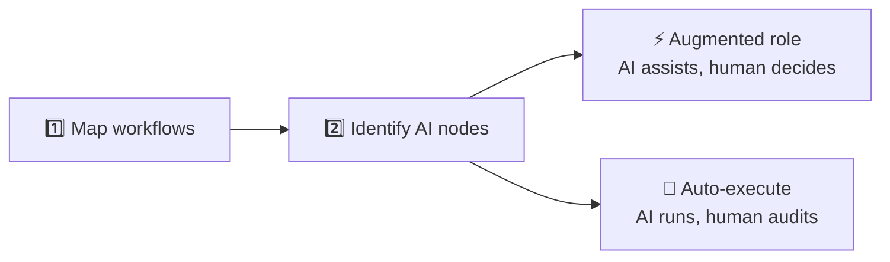
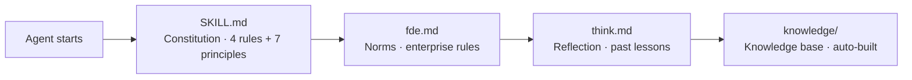
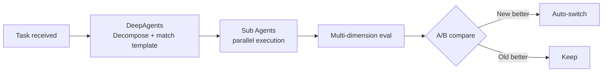
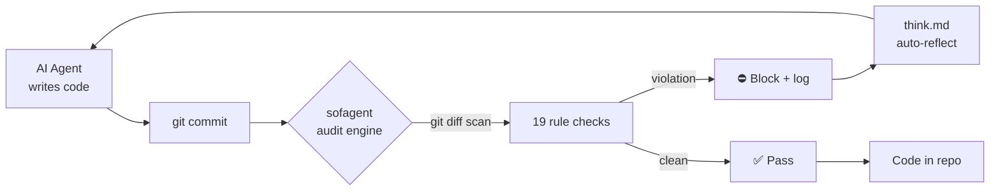

# sofagent

[中文](./README.md) | English

> This is an abridged version. See [中文版](./README.md) for full documentation.

<p align="center">
  
</p>

<p align="center">
  <strong>sofa + agent = sofagent / 沙发特工</strong><br/>
  <em>It's not about connecting businesses to AI — it's about helping them use AI right.</em>
</p>

<p align="center" style="color:#64748B;font-size:14px;">
  Agent Harness Middleware + FDE Toolkit<br/>
  <strong>Giving everyone FDE capabilities</strong>
</p>

<p align="center">
  <a href="https://github.com/KongFangXun/sofagent/actions/workflows/verify.yml"></a>
  <a href="./LICENSE"></a>
  <a href="./CHANGELOG.md"></a>
</p>

---

**Agents can work. Did they do it right? sofagent governs — 1 base + 4 engines, one system.**

🧭 Constraint Base · ⚙️ Orchestration · 🔍 Audit · 🔄 Restore · 🧬 Evolution

---

## Why sofagent?

Most SME AI projects collect dust within 6 months. It's not a tech problem — it's three patterns:

| Problem | What sofagent does |
|------|------|
| 🚫 Bought a pile of tools, don't know where to start | FDE onboards, maps workflows, identifies AI nodes, leaves |
| 🔧 Tech-led, business rules can't be written in code | fde.md uses business language ("don't touch customer data", "large transfers need approval") |
| 👻 Deploy and forget — things break unnoticed, stagnation, no accountability | Every change auto-audited + snapshotted + orchestrated + weekly inspection |

No consultants. No AI team. FDE onboards, deploys, leaves — the AI nodes keep running. Unlike AgentLoop (SaaS, runtime trajectory), sofagent audits **what changed** (file diff, local, MIT open source).

---

## Install

```bash
npm install -g @sofagent/audit && sofagent-audit --init
```

Three-step first experience:

```bash
# 1. See constraints — agents carry these rules
sofagent-audit --help | head -5

# 2. Run audit — change a file and see
echo "API_KEY=sk-123456" > .env && git add .env && git commit -m "test"
# → ⛔ A1 sensitive files: .env contains key pattern, commit blocked

# 3. Check snapshots — auto-saved after every audit
sofagent-audit --timeline
```

> Requires Node.js ≥ 18 + bash + git. Full macOS/Linux support, Windows experimental. [Full install guide](./docs/HANDBOOK.md)

---

## How FDE works

FDE does two things — map + identify, splits into two node types, then five engines take over.



Step 2 is the key — not every step should be fully automated:

| Node type | How it runs | Human's role | sofagent's role |
|------|------|------|------|
| ⚡ **Augmented role** | AI navigates, suggests — rules describable | Decide, approve, sign off | Constraint keeps AI in bounds, audit logs every suggestion, restore enables rollback, evolution refines skills |
| 🔄 **Auto-execute** | AI runs end-to-end autonomously | Review audit reports, spot-check | All five: constrain → orchestrate → audit → restore → evolve weekly |

No consultants. No AI team. FDE onboards, deploys, leaves — the AI nodes keep running.

> 📖 Full FDE workflow: [FDE/FDE.md](./FDE/FDE.md)

### 1 base + 4 engines

> 💡 **sofagent and Gateway**: Enterprise AI can't ship without a Gateway (unified entry/routing/orchestration/sessions).
> OpenClaw/DeepAgents IS your Gateway. sofagent doesn't replace it — it layers on top for governance.
> **The Gateway is the highway. sofagent is the traffic rules + speed cameras + driving coach.**

> 💬 **sofagent has no UI. You talk to it, and it tells you where the result is.** Language is the interface. MCP is the entry point. See [Philosophy](./docs/PHILOSOPHY.md). Full MCP reference: [MCP Usage Guide](./docs/guides/mcp-usage.md).

> 🔮 **v1.1.0 released**: Package purity refactor — audit just audits, 12 independent packages + lightweight multi-device. See [changelog](./docs/changelog/v1.1.0.md). 4 sync methods: [Multi-Device Sync Guide](./docs/guides/multi-device-sync.md).

#### 🧭 Constraint Base

Rules injected into agent context before work starts — so it knows the red lines.



Four-layer loading chain auto-injects on session start. Any platform — OpenClaw via Hook enforcement, other platforms via Agent Read. v1.0.7+ Sub Agents self-load constraints at startup (`buildConstrainedSystemPrompt`).

#### ⚙️ Orchestration engine

Decomposes large tasks, runs Sub Agents in parallel, compares A/B results for better approaches. FDE generates the workflow on onboarding; nodes run autonomously after that.



Powered by DeepAgents (v1.0.7, ao fully retired). `sofagent-orchestrator compose --task` CLI entry — **any Agent platform can use the orchestration engine**. See [ROADMAP](./ROADMAP.md).

#### 🔍 Audit engine

Every git commit gets scanned — what the agent changed can't be denied.



Doesn't trust the agent — trusts git diff hard evidence. **0 token cost — pure regex engine, no LLM calls.** Core rules inspect git diff only, no agent cooperation needed. v1.0.8+ adds filesystem audit via embedded isomorphic-git + daemon, covering non-developers too.

> v1.1.0 splits audit into standalone `@sofagent/audit` package. v1.0.8+ embeds isomorphic-git + daemon file monitoring — no git commit needed for non-developers.

#### 🔄 Restore engine

Auto-snapshot after every audit — violations trigger notifications + rollback suggestions. When things go wrong, go back:

| Result | Auto action | What you see |
|------|---------|------------|
| ✅ PASS | Auto-snapshot saved | Silent |
| ⚠️ WARN | Saved + flagged | daemon-notice.md alert + optional Webhook |
| ❌ FAIL | Saved + rollback suggested | Webhook push + terminal red |

```bash
sofagent-audit --timeline          # Snapshot timeline
sofagent-audit --timeline --json   # JSON output
sofagent-audit --revert <SHA>      # Rollback to any snapshot
```

sofagent is a **dashcam**, not a security checkpoint — post-hoc audit + restore, platform-agnostic.

#### 🧬 Evolution engine (v1.0.8+)

FDE Agent doesn't just deploy once — after deployment, it shifts into **continuous optimization**. Weekly automatic inspection of audit trends + reflections, catching degradation before it impacts production.

```mermaid
graph LR
    A[FDE Weekly Inspection] --> B[Read audit trends<br/>history.jsonl]
    B --> C[Analyze think.md<br/>recurring mistakes]
    C --> D[Check eval<br/>which node is degrading]
    D --> E{Issue found?}
    E -->|Yes| F[Generate optimization report<br/>Update rules / supplement knowledge]
    E -->|No| G[Mark "stable"]
    F --> A
```

| Mode | When | What |
|------|------|------|
| **deploy** | First install / major change | Map workflows → Identify AI nodes → Build knowledge base → Install toolkit |
| **sustain** | Weekly auto / manual trigger | Read audit trends → Analyze think.md → Generate optimization report → Update rules |

```bash
sofagent-orchestrator subagent run fde --mode sustain --task "Inspect all nodes"
```

Five engines, one loop: **Constrain → Orchestrate → Audit → Restore → Evolve**.

---

## vs. existing tools

| | sofagent | detect-secrets | pre-commit hooks |
|------|:--:|:--:|:--:|
| Secret detection | ✅ | ✅ | ❌ |
| Agent boundary violations | ✅ | ❌ | ❌ |
| Injection attack detection | ✅ | ❌ | ❌ |
| Process compliance | ✅ | ❌ | ❌ |
| Knowledge-base cross-domain | ✅ | ❌ | ❌ |
| Config deletion detection | ✅ | ❌ | ❌ |
| Setup | One command | One command | Manual rules |

---

## Does it work?

> 🔬 Hugging Face legal-agent benchmark: same model, harness-only optimization — score jumped from 3.5% to 80.1% (76-point gain, matching Claude Sonnet at 1/7 the cost). [Details](./docs/ARCHITECTURE.md)

Install and run — no dependency on agent compliance:

| Dimension | Data | What it means |
|------|------|------|
| Audit stability | `npm test` all green — diff-parser / A1-A11, A14-A17 / reporter / init | Every code change is audit-checked, cannot be bypassed |
| Audit coverage | 19 rules (A1-A11, A14-A17 + E1-E4): secret leaks, boundary violations, injection, blind edits, knowledge-base access | Most common agent failure modes are caught |
| Platform coverage | git commit audit (developers) + daemon filesystem audit (non-developers) | Anyone's file changes get audited |
| License | MIT | Code, docs, templates — use freely |

---

---
## Built-in Agents (v1.0.7 introduced · infra Agent since v1.0.8)

| Agent | How to invoke | When it auto-triggers |
|------|------|------|
| **FDE Deployment Engineer** | `@sofagent-fde` | Suggests follow-up inspection after deployment |
| **Compliance Auditor** | `@sofagent-audit` | Every commit / FDE deployment / LOOP task completion |

## Which do you need?

| Your scenario | Use |
|---------|------|
| Just block secret leaks | `npm install -g @sofagent/audit` is enough |
| Full agent behavior management | Audit engine + harness base (install.sh) |
| Automatic task orchestration | + orchestration engine (DeepAgents Sub Agent) |

> ⚠️ **Current version (v1.1.0) coverage**: Developer roles (git commit audit) + non-developer roles (filesystem audit) — full coverage.

### Dual-node deployment (v1.0.7+)

sofagent supports two node types:

| Node type | For whom | OpenClaw | Orchestration | Constraints |
|---------|--------|:--:|------|------|
| **Auto-running node** | Enterprise unattended devices | ✅ Required | OpenClaw API | Hook injection |
| **Personal enhancement node** | Individual developers (WorkBuddy/Codex/Claude Code) | ❌ Not needed | `sofagent-orchestrator compose --task` CLI | Sub Agent self-load |

> v1.0.7 Sub Agent constraint self-loading (`buildConstrainedSystemPrompt`) makes constraints platform-independent — Sub Agents read `.sofagent/` files at startup. Change your Agent platform, constraints stay.

---

## Workflow Hub: the reliable foundation for enterprise landing

Pure autonomous Agents are flexible but uncontrolled — random step-skipping, hallucination, and hard-to-trace end-to-end flows are fatal risks in low-tolerance business like credit-risk audit or accounts-payable approval. Yet **80% of enterprise landing scenarios are better served by Workflow** (predefined branches, tool-call order, DB/3rd-party calls): fixed execution trace, per-node monitoring, parallel speedup, near-zero hallucination.

sofagent's [Workflow Hub](./workflow-hub/) uses a **hybrid architecture**: an outer Graph skeleton (`nextNodes` in `workflow.yml`) locks the end-to-end steps and keeps them traceable; inner nodes keep model autonomy (the node `prompt` is a ReAct Agent). You get Workflow's controllability plus local flexibility. Workflows mapped during FDE onboarding become reusable enterprise templates.

---

## Further reading

| You want | Read |
|---------|------|
| Install, use, FAQ | [HANDBOOK](./docs/HANDBOOK.md) |
| Design rationale | [ARCHITECTURE](./docs/ARCHITECTURE.md) |
| Security | [SECURITY](./SECURITY.md) |
| Known limitations | [LIMITATIONS](./LIMITATIONS.md) |
| Roadmap | [ROADMAP](./ROADMAP.md) |
| Contributing | [CONTRIBUTING](./CONTRIBUTING.md) |
| Enterprise deploy (FDE + Workflow) | [FDE/](./FDE/) \| [Workflow Hub](./workflow-hub/) |

---

## Contributing

Issues and PRs welcome — especially the critical kind. [CONTRIBUTING.md](./CONTRIBUTING.md) · [Credits](./docs/THANKS.md)

> sofagent is designed by KongFangXun. Code written by AI models, product decisions and final review by the author. Every release reviewed by an independent model.
