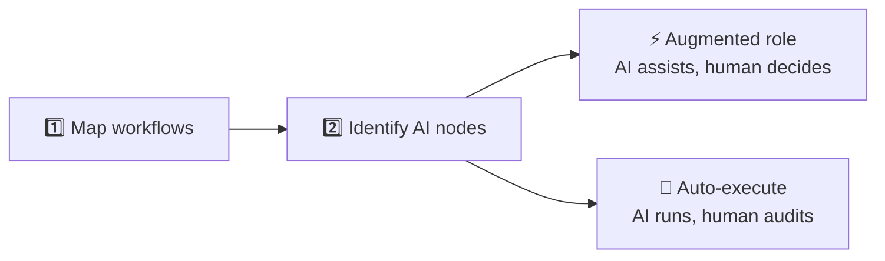
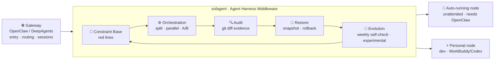
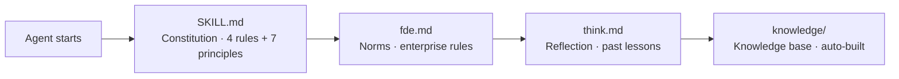
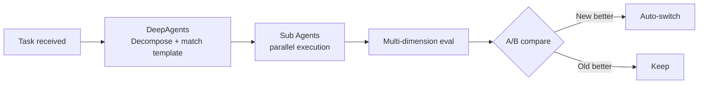
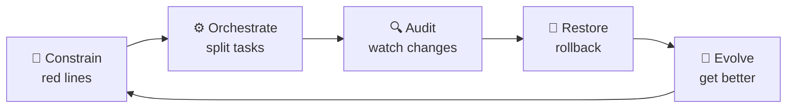

# sofagent

[中文](./README.md) | English

> This is an abridged version. See [中文版](./README.md) for full documentation.

<p align="center">
  
</p>

<p align="center">
  <strong>sofa + agent = sofagent / 沙发特工</strong><br/>
  <em>It's not about connecting businesses to AI — it's about helping them use AI right.</em>
</p>

<p align="center" style="color:#64748B;font-size:14px;">
  Agent Harness Middleware + FDE Toolkit<br/>
  <strong>Giving everyone in SMBs (Small & Medium Businesses) and OPCs (Operating Companies) the capabilities of an FDE (Frontline Deployment Engineer)</strong>
</p>

<p align="center">
  <a href="https://github.com/KongFangXun/sofagent/actions/workflows/verify.yml"></a>
  <a href="./LICENSE"></a>
  <a href="./CHANGELOG.md"></a>
  <a href="#install"></a>
</p>

---

> [!IMPORTANT]
> **Agents can work. Did they do it right? sofagent governs — 1 base + 4 engines, one system.**

🧭 Constraint Base · ⚙️ Orchestration · 🔍 Audit · 🔄 Restore · 🧬 Evolution (experimental)

---

## 10-second version

> **sofagent = an open-source (MIT) FDE toolkit: deploy AI with your own Agents + LLMs, governed and accountable. One base + four engines (constraint / orchestration / audit / restore / evolution) form the accountability base.**

> 💡 Just want to install? Jump to [Quick Start](#install)

---

## Why sofagent?

Most SME AI projects collect dust within 6 months. It's not a tech problem — it's three patterns:

| Problem | What sofagent does |
|------|------|
| 🚫 Bought a pile of tools, don't know where to start | FDE onboards, maps workflows, identifies AI nodes, leaves |
| 🔧 Tech-led, business rules can't be written in code | fde.md uses business language ("don't touch customer data", "large transfers need approval") |
| 👻 Deploy and forget — things break unnoticed, stagnation, no accountability | Every change auto-audited + snapshotted + orchestrated + weekly inspection |

No consultants. No AI team. FDE onboards, deploys, leaves — the AI nodes keep running. Unlike AgentLoop (SaaS, runtime trajectory), sofagent audits **what changed** (file diff, local, MIT open source).

> [!IMPORTANT]
> 🔬 **Hugging Face benchmark**: same model, harness-only optimization — legal-agent score jumped from 3.5% to 80.1% (76-point gain, at ~1/7 the cost of Claude Sonnet). [Details](./docs/THANKS.md)

---

## Install

```bash
npm install -g @sofagent/audit @sofagent/core && sofagent-audit --init
```

<details>
<summary>🚀 Three-step first experience (click to open)</summary>

```bash
# 1. See constraints — agents carry these rules
sofagent-audit --help | head -5

# 2. Run audit — --init installed a pre-commit hook, so every commit is scanned by A1
echo "API_KEY=sk-123456" > .env && git add -f .env && GIT_EDITOR=true git commit -m "test"
# → ⛔ A1 sensitive files: .env contains key pattern, commit blocked (never lands)

# 3. Check snapshots — auto-saved after every audit
sofagent-audit --timeline

# Cleanup after demo (A1 blocked the commit, no new commit): unstage and remove .env
git rm --cached -f .env 2>/dev/null; rm -f .env
```
</details>

> [!NOTE]
> Requires Node.js ≥ 18 + bash + git. Full macOS/Linux support, Windows experimental. [Full install guide](./docs/HANDBOOK.md)

### Uninstall

```bash
npm uninstall -g @sofagent/audit @sofagent/core @sofagent/orchestrator @sofagent/daemon @sofagent/mcp
# Remove the git hook installed by --init (in the current repo)
rm -f .git/hooks/commit-msg .git/hooks/post-commit
```

> [!NOTE]
> Packages are published to npm on each release. If `npm install -g` fails locally, use the in-repo script `sofagent/scripts/install.sh`.

---

## How FDE works

FDE does two things — map + identify, splits into two node types, then the base and four engines take over.



Step 2 is the key — not every step should be fully automated:

| Node type | How it runs | Human's role | sofagent's role |
|------|------|------|------|
| ⚡ **Augmented role** | AI navigates, suggests — rules describable | Decide, approve, sign off | Constraint keeps AI in bounds, audit logs every suggestion, restore enables rollback, evolution refines skills |
| 🔄 **Auto-execute** | AI runs end-to-end autonomously | Review audit reports, spot-check | All five components: constrain → orchestrate → audit → restore → evolve weekly |

No consultants. No AI team. FDE onboards, deploys, leaves — the AI nodes keep running.

> [!NOTE]
> 📖 Full FDE workflow: [FDE/FDE.md](./FDE/FDE.md)

### 1 base + 4 engines



#### 🧭 Constraint Base

Rules injected into agent context before work starts — so it knows the red lines.

<details>
<summary>🔍 Constraint Base internals</summary>


</details>

Four-layer loading chain auto-injects on session start. Any platform — OpenClaw via Hook enforcement, other platforms via Agent Read. v1.0.7+ Sub Agents self-load constraints at startup (`buildConstrainedSystemPrompt`).

#### ⚙️ Orchestration engine

Decomposes large tasks, runs Sub Agents in parallel, compares A/B results for better approaches. FDE generates the workflow on onboarding; nodes run autonomously after that.

<details>
<summary>🔍 Orchestration internals</summary>


</details>

Powered by DeepAgents (v1.0.7, OpenClaw orchestration layer fully retired). `sofagent-orchestrator compose --task` CLI entry — **any Agent platform can use the orchestration engine**. See [ROADMAP](./ROADMAP.md).

> [!WARNING]
> Orchestration requires the separate `@sofagent/orchestrator` package (`npm install -g @sofagent/orchestrator`). The audit engine (`@sofagent/audit`) doesn't bind to OpenClaw and runs standalone; the orchestration engine needs the orchestrator package.

#### 🔍 Audit engine

Every git commit gets scanned — what the agent changed can't be denied.

<details>
<summary>🔍 Audit engine internals</summary>


</details>

Doesn't trust the agent — trusts git diff hard evidence. **0 token cost — pure regex engine, no LLM calls.** Core rules inspect git diff only, no agent cooperation needed. v1.0.8+ adds filesystem audit via embedded isomorphic-git + daemon, covering non-developers too.

> [!NOTE]
> v1.1.0 splits audit into standalone `@sofagent/audit` package. v1.0.8+ embeds isomorphic-git + daemon file monitoring — no git commit needed for non-developers.

#### 🔄 Restore engine (essentially: git snapshot + revert wrapper)

Auto-snapshot after every audit — violations trigger notifications + rollback suggestions. When things go wrong, go back:

| Result | Auto action | What you see |
|------|---------|------------|
| ✅ PASS | Auto-snapshot saved | Silent |
| ⚠️ WARN | Saved + flagged | daemon-notice.md alert + optional Webhook |
| ❌ FAIL | Saved + rollback suggested | Webhook push + terminal red |

```bash
sofagent-audit --timeline          # Snapshot timeline
sofagent-audit --timeline --json   # JSON output
sofagent-audit --revert <SHA>      # Rollback to any snapshot
```

sofagent is a **dashcam**, not a security checkpoint — post-hoc audit + restore, platform-agnostic.

#### 🧬 Evolution engine (v1.0.8+ · experimental)

> [!WARNING]
> **Experimental feature**: A/B auto-promote is based on `consecutiveWins ≥ threshold` + `overallImprovement` guard; eval scoring relies on LLM self-grading (self-grading bias exists). Narrow eval sets may cause false promotions. For production, manually review promote decisions.

FDE Agent doesn't just deploy once — after deployment, it shifts into **continuous optimization**. Weekly automatic inspection of audit trends + reflections, catching degradation before it impacts production.

<details>
<summary>🔍 Evolution engine internals</summary>

```mermaid
graph LR
    A[FDE Weekly Inspection] --> B[Read audit trends<br/>history.jsonl]
    B --> C[Analyze think.md<br/>recurring mistakes]
    C --> D[Check eval<br/>which node is degrading]
    D --> E{Issue found?}
    E -->|Yes| F[Generate optimization report<br/>Update rules / supplement knowledge]
    E -->|No| G[Mark "stable"]
    F --> A
```
</details>

| Mode | When | What |
|------|------|------|
| **deploy** | First install / major change | Map workflows → Identify AI nodes → Build knowledge base → Install toolkit |
| **sustain** | Weekly auto / manual trigger | Read audit trends → Analyze think.md → Generate optimization report → Update rules |

```bash
sofagent-orchestrator subagent run fde --mode sustain --task "Inspect all nodes"
```

#### 1 base + 4 engines — capability overview

| Capability | Solves | Extra install | Status |
|------|---------|:--:|------|
| 🧭 Constraint Base | Agents start with red lines, stay in bounds | No (injected with context) | Stable |
| ⚙️ Orchestration | Break big tasks, parallel Sub Agents, A/B pick | Yes (`@sofagent/orchestrator`) | Stable |
| 🔍 Audit | Hard-evidence review of every change | No (`@sofagent/audit` standalone) | Stable |
| 🔄 Restore | Auto-snapshot + one-click rollback | No (triggered by audit) | Stable |
| 🧬 Evolution | Weekly inspection, self-optimize | No (FDE sustain mode) | ⚠️ Experimental |



The full loop: **Constrain → Orchestrate → Audit → Restore → Evolve**.

---

## vs. existing tools

| Tool | Positioning | Relationship with sofagent |
|------|------|------------------|
| pre-commit + custom scripts | General code quality checks | sofagent focuses on Agent behavior (secrets/boundaries/injection), doesn't duplicate general lint |
| Cursor Rules | IDE-level rule constraints | sofagent is a commit-msg hook, IDE-agnostic |
| Claude Code hooks | Claude-specific hooks | sofagent is platform-agnostic, any Agent + git repo works |

<details>
<summary>📊 Comparison with secret scanners</summary>

| | sofagent | detect-secrets | pre-commit hooks |
|------|:--:|:--:|:--:|
| Secret detection | ✅ | ✅ | ❌ |
| Agent boundary violations | ✅ | ❌ | ❌ |
| Injection attack detection | ✅ | ❌ | ❌ |
| Process compliance | ✅ | ❌ | ❌ |
| Knowledge-base cross-domain | ✅ | ❌ | ❌ |
| Config deletion detection | ✅ | ❌ | ❌ |
| Setup | One command | One command | Manual rules |

</details>

<details>
<summary>💡 How it relates to secret scanners</summary>

> [!NOTE]
> sofagent doesn't replace secret scanners — it adds the "Agent behavior governance" they miss: boundary violations, injection, process compliance, knowledge-base cross-domain are LLM-Agent-specific failure modes.

</details>

---

## Does it work?

Install and run — no dependency on agent compliance:

| Dimension | Data | What it means |
|------|------|------|
| Audit stability | `npm test` all green — diff-parser / A1-A11, A14-A19, E1-E4 / reporter / init | Every code change is audit-checked, cannot be bypassed |
| Audit coverage | 21 rules (A1-A11, A14-A19 + E1-E4): secret leaks, boundary violations, injection, blind edits, knowledge-base access | Most common agent failure modes are caught |
| Platform coverage | git commit audit (developers) + daemon filesystem audit (non-developers) | Anyone's file changes get audited |
| License | MIT | Code, docs, templates — use freely |

---

## Built-in Agents (v1.0.7 introduced · infra Agent since v1.0.8)

| Agent | How to invoke | When it auto-triggers |
|------|------|------|
| **FDE Deployment Engineer** | `@sofagent-fde` | Suggests follow-up inspection after deployment |
| **Compliance Auditor** | `@sofagent-audit` | Every commit / FDE deployment / LOOP task completion |

<details>
<summary>💡 CLI vs Agent identity</summary>

> [!NOTE]
> `@sofagent-audit` is the `@sofagent/audit` npm package invoked as a Skill Agent; `@sofagent-fde` similarly comes from the FDE toolkit — same capability, available both as a CLI and as an Agent.

</details>

## Which do you need?

| Your scenario | Use |
|---------|------|
| Just block secret leaks | `npm install -g @sofagent/audit @sofagent/core` is enough |
| Full agent behavior management | Audit engine + harness base (sofagent/scripts/install.sh) |
| Automatic task orchestration | + orchestration engine (DeepAgents Sub Agent) |

> [!NOTE]
> ⚠️ **Current version (v1.1.6) coverage**: Developer roles (git commit audit) + non-developer roles (filesystem audit) — full coverage. Non-developer filesystem audit requires installing and running the `@sofagent/daemon` daemon.

### Dual-node deployment (v1.0.7+)

sofagent supports two node types — **Auto-running node** (OpenClaw full-stack) and **Personal enhancement node** (third-party Agent + sofagent, no OpenClaw needed). Full comparison table: [ARCHITECTURE — Dual-node architecture](./docs/ARCHITECTURE.md#dual-node-architecture).

> [!NOTE]
> v1.0.7 Sub Agent constraint self-loading (`buildConstrainedSystemPrompt`) makes constraints platform-independent — Sub Agents read `.sofagent/` files at startup. Change your Agent platform, constraints stay.

---

## Workflow Hub: the reliable foundation for enterprise landing

Pure autonomous Agents are flexible but uncontrolled — random step-skipping, hallucination, and hard-to-trace end-to-end flows are fatal risks in low-tolerance business like credit-risk audit or accounts-payable approval. Yet **80% of enterprise landing scenarios are better served by Workflow** (predefined branches, tool-call order, DB/3rd-party calls): fixed execution trace, per-node monitoring, parallel speedup, near-zero hallucination.

sofagent's [Workflow Hub](./workflow-hub/) uses a **hybrid architecture**: an outer Graph skeleton (`nextNodes` in `workflow.yml`) locks the end-to-end steps and keeps them traceable; inner nodes keep model autonomy (the node `prompt` is a ReAct Agent). You get Workflow's controllability plus local flexibility. Workflows mapped during FDE onboarding become reusable enterprise templates.

| Dimension | Pure autonomous Agent | Workflow Hub hybrid |
|------|:--:|:--:|
| End-to-end traceable | ❌ | ✅ fixed nodes + snapshot |
| Anti-hallucination | ❌ | ✅ path locked, flexible only inside nodes |
| Node-level parallel | ⚠️ | ✅ |
| Local flexibility | ✅ | ✅ ReAct inside nodes |

### What's inside?

Workflow Hub is a community-driven industry workflow template repository (code in `sofagent/workflow-hub/`). Ships with **1 real template**:

| Industry | Template | Flow | Nodes | Bundled files |
|------|------|------|:--:|------|
| Manufacturing | [Accounts-payable approval](./workflow-hub/templates/制造业/应付账款审批/) | Vendor invoice → 3-way match → approve → pay | 4 | `workflow.yml` + README + knowledge(4) + skills(3) + subagents(2) |

<details>
<summary>📂 Template directory tree (accounts-payable approval)</summary>

```text
制造业/应付账款审批/
├── workflow.yml          # workflow definition (nodes + nextNodes skeleton)
├── README.md             # adaptation guide
├── knowledge/            # knowledge base seed data
│   ├── approver-list.yml
│   ├── payment-accounts.yml
│   ├── payment-history.yml
│   └── supplier-whitelist.yml
├── skills/               # skill definitions
│   ├── approval-route.md
│   ├── invoice-ocr.md
│   └── three-way-match.md
└── subagents/            # sub-agent definitions
    ├── ap-approver.md
    └── ap-executor.md
```
</details>

> [!NOTE]
> Template format spec: [SPEC.md](./workflow-hub/SPEC.md); full catalog: [CATALOG.md](./workflow-hub/CATALOG.md); submit a template: [CONTRIBUTING.md](./workflow-hub/CONTRIBUTING.md). Local validation: `bash workflow-hub/tools/validate.sh templates/制造业/应付账款审批/`

### How to use?

```bash
sofagent hub list                         # browse published templates
sofagent hub deploy 制造业/应付账款审批    # one-click deploy to your org
```

---

## Further reading

| You want | Read |
|---------|------|
| Install, use, FAQ | [HANDBOOK](./docs/HANDBOOK.md) |
| Design rationale | [ARCHITECTURE](./docs/ARCHITECTURE.md) |
| Security | [SECURITY](./SECURITY.md) |
| Known limitations | [LIMITATIONS](./LIMITATIONS.md) |
| Roadmap | [ROADMAP](./ROADMAP.md) |
| Contributing | [CONTRIBUTING](./CONTRIBUTING.md) |
| Enterprise deploy (FDE + Workflow) | [FDE/](./FDE/) \| [Workflow Hub](./workflow-hub/) |

---

## Contributing

Issues and PRs welcome — especially the critical kind. [CONTRIBUTING.md](./CONTRIBUTING.md) · [Credits](./docs/THANKS.md)

> [!NOTE]
> sofagent is designed by KongFangXun. Code written by AI models, product decisions and final review by the author. Every release reviewed by an independent model.
