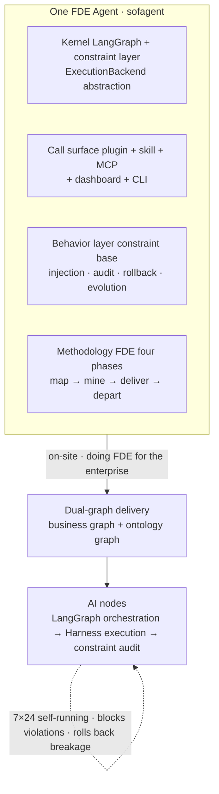
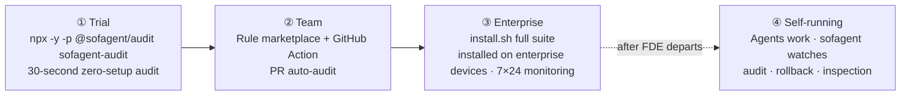

<p align="center">
  
</p>

<p align="center">
  <a href="https://github.com/KongFangXun/sofagent/actions/workflows/verify.yml"></a>
  <a href="./LICENSE"></a>
  <!-- ⚠️ bump version: manually sync this badge version (Version-vX.Y.Z) -->
  <a href="./CHANGELOG.md"></a>
</p>

<p align="center">
  <a href="README.md">中文</a> · <a href="#what-is-this">What is this</a> · <a href="#what-is-an-fde-agent">FDE Agent</a> · <a href="#v140-united-with-deepseek-harness">v1.4.0 × DSH</a> · <a href="#fde-methodology">FDE Methodology</a> · <a href="#constraint-layer-harness">Constraint Layer</a> · <a href="#installation">Install</a> · <a href="#usage">Usage</a> · <a href="#ecosystem--docs-index">Docs</a> · <a href="https://github.com/KongFangXun/sofagent">⭐ Star</a>
</p>


---

## What is this

**An open-source FDE Agent.** On entry: map the business flow clearly, build the ontology graph, deploy the AI nodes in place. On departure: audit every change and keep optimizing.

It ships on [ClawHub](https://clawhub.ai/kongfangxun/skills/sofagent) as an **FDE Skill** (a methodology skill that helps everyone at SMBs and OPCs become the FDE of their own business), and once installed on enterprise devices it runs long-term as a **constraint-layer (Harness) engine**.

## What is an FDE Agent

**FDE = Forward Deployed Engineer** — the person who embeds models into real enterprise operations. sofagent turns this role into an open-source Agent that walks a full FDE business flow through four phases:

- **Phase 1 · Map the business flow on entry** — five-element deep-dive + three-question triage, capturing each role's input / output / owner / time cost / pain points, and calculating what each AI node is worth
- **Phase 2 · Build dual graphs** — business graph (system boundaries, data flows) + ontology graph (shared semantic foundation), turning the enterprise into a machine-readable structure
- **Phase 3 · Deploy AI nodes** — three-layer deliverables (documents + Skills + runtime), installing AI nodes into your existing tools; from "you do the work" to "you delegate the work"
- **Phase 4 · Continuous optimization after departure** — 7×24 automated task execution after the FDE leaves: inspection, audit, optimization; the human leaves, governance doesn't

Official slogan: **Map business flows · Build ontology graphs · Deploy AI nodes · Audit every change**



**Why an FDE Agent**

- **The bottleneck for enterprise AI is deployment, not the model** — mapping workflows, drawing system boundaries, and setting data rules is precisely the FDE's job. MIT NANDA's *The GenAI Divide*: 95% of enterprise GenAI projects failed to produce value worth a financial statement, while FDE job postings surged 729% in a year (verification in [VALIDATION](./docs/VALIDATION.md))
- **Completeness comes from the union** — DSH solves "can work"; sofagent solves "keeps working"; only together do they make a complete FDE Agent (next chapter)
- **"Continuous optimization" only holds with a constraint layer** — backed by auditable, rollback-capable mechanisms, not promises in prompts. Independent external experiment: same model, only the outer Harness optimized — a legal-Agent benchmark rose 63.4% → 80.1% (+16.7pp, see [THANKS](./docs/THANKS.md))
- **Capabilities are portable, never dead-bound to a platform** — the constraint layer is platform-agnostic; the methodology follows the business, not the platform

> 🔄 **Self-bootstrapping**: its first FDE job is sofagent itself — the project itself is one FDE business flow (map → nodes → dual-graph delivery), and the training engine also orbits FDE.

## v1.4.0: United with DeepSeek Harness

The core of this release: officially united with [DeepSeek Harness](https://github.com/deepseek-ai/deepseek-harness) (DSH) to become a complete FDE Agent.

**1 · Why DSH**: DeepSeek's official open-source Agent framework, built on the [Cordis](https://github.com/cordiverse/cordis) runtime under the "Everything is a Plugin" philosophy — its plugin model naturally fits the platform-agnostic constraint layer, and it is the kernel sofagent integrates with most deeply today.

**2 · How**: the four constraint-layer capabilities (injection · audit · rollback · evolution) are packaged into 9 `cordis-plugin-sofagent-*` plugins, all live-mounted into DSH (Plugin list shows 9 Enabled), installable independently and adopted progressively:

| Plugin | Responsibility |
|--------|----------------|
| `audit` | Machine review of changes — 24 rules + git diff hard evidence + node-level auditing |
| `rollback` | Reverse-ordered undo on failure — git snapshot → effect disposer |
| `inject` | Inject enterprise constraints at startup — four-layer loading chain |
| `evolve` | Experience capture — think.md reflection + Dream Cycle + skillopt |
| `ontology` | Shared semantic foundation + knowledge retrieval (ontology_* tools + search_knowledge) |
| `commons` | The commons of capabilities — reuse via commons_* tools |
| `gate` | No pass without acceptance — machine-decidable acceptance + human review |
| `daemon` | 7×24 inspection + health monitoring + webhook push |
| `fde` | Six-tool closed loop of the on-site methodology (fde_interview / classify / quantify / derive / distill / deploy) |

**3 · Division of labor**

| Side | Provides |
|------|----------|
| DeepSeek Harness (DSH) | **The execution body** — model + tools + sessions |
| sofagent | **Enterprise constraints & audit + FDE methodology** |

**Together = a complete FDE Agent**: DSH handles "can work", sofagent handles "keeps working" — every change is audited, out-of-bounds moves are blocked, breakage can be rolled back.

**Other new capabilities in this release** (see the [devlog](./docs/changelog/v1.4/v1.4.0.md); earlier versions in [CHANGELOG](./CHANGELOG.md)):

- **Dashboard productization**: Web worklog page (by Agent / by Workflow / weekly trend / human-in-the-loop, four views) + graph panel (FDE dual graphs: business graph + ontology graph + MCP tool view 66 tools + skill load-chain visualization) + single-file HTML ships with `install.sh` (`worklog.json` falls back to sample data)
- **Cost audit**: overspend warning (WARN only) + `cost_query` MCP tool + `DecisionKind.COST` traceability
- **Dual plugin families**: 9 DSH-form plugins (above) + 4 code-plugins in OpenClaw form (ClawHub ready) + shared precommit hook for Cursor / Claude Code
- **Cross-device**: federation end-to-end (pairing / encrypted query / tamper detection / offline fallback — S320 + S322 dual coverage) + remote API channel (C/S control plane, contract documented)
- **Agentic Browser + eval**: navigate / click / screenshot / assert registered (MCP 61→66) + real Playwright driver + MLflow eval wiring (degrades gracefully when unreachable)
- **Engineering base**: audit provenance fields (`whichDataVersion` + `beforeAfter`) + all shell scripts verified on real bash 3.2

## FDE Methodology

Many companies adopt AI the wrong way around — they pick models, build platforms, and buy Agents first, only to find nobody uses them. The problem isn't the technology; it's that **they haven't figured out their own business processes before handing them to AI**.

Most tools teach you how to build Agents; sofagent first answers **where AI should go** — turning the five-element deep-dive and three-question triage from guesswork into a repeatable methodology:

| Phase | Input | What happens | Deliverable |
|-------|-------|--------------|-------------|
| 1 · Map | Role roster · existing systems | **Five-element deep-dive** — for each process step, capture input / output / owner / time cost / pain points | Enterprise profile |
| 2 · Triage | Enterprise profile | **Three-question triage** — which steps fit AI: 🔄 automate · ⚡ augment · 👤 leave alone, prioritized by ROI | Node plan + annual savings |
| 3 · Deliver | Node plan | **Three-layer deliverables** — documents + Skills + runtime, so AI nodes actually run | Ontology + workflow.yml + skills/ |

Full methodology (four phases, twelve steps) in [FDE/GUIDE.md](./FDE/GUIDE.md) — a half-day read, enough to run FDE independently afterwards.

## Constraint Layer (Harness)

The constraint layer is sofagent's behavioral foundation, with four capabilities:

- **Injection** — inject enterprise constraints at Agent startup through the four-layer loading chain; constraints are advisory
- **Audit** — 24 git-diff hard-evidence rules (quick runs 17 by default, 7 extensions enabled via config) + AgentShield five-face static config scanning; auditing is mandatory — every change gets audited, violations blocked on the spot
- **Rollback** — auto-archived snapshot after every audit, one-click restore to any snapshot
- **Evolution** — think.md reflection + Dream Cycle + skillopt, experience auto-captured into the knowledge base

**Platform-agnostic**: mounts on OpenClaw / WorkBuddy / Cursor / Claude / Gemini — with DeepSeek Harness being the deepest integration (9 plugins live-mounted, previous chapter). Automatic hook injection currently works only on OpenClaw; on other platforms, inject constraints manually and auditing works as usual.

> What gets deployed is not a bare Agent, but an **Agent with a constraint skeleton** — the Agent may ignore the constraints, but every change gets audited without exception.

> ⚠️ **Honest boundary**: currently a single-machine, single-user design — multiple Agents share one knowledge base / audit history (tenant isolation is on the ROADMAP); task logs (task/logs) are written in plaintext, and static encryption currently covers the audit history main chain but not task/logs — read [SECURITY](./SECURITY.md) · [LIMITATIONS](./docs/LIMITATIONS.md) before enterprise deployment. sofagent auditing focuses on **hard evidence from the current diff + Agent behavior auditing** (out-of-scope / injection / privilege dimensions), complementing general-purpose secret scanners (gitleaks / detect-secrets etc., which do full-history scans with broader pattern libraries) rather than replacing them.

## Installation

> ⚠️ **Enterprise users read first** [LIMITATIONS §3](./docs/LIMITATIONS.md) — `config.yml` is **non-fail-closed by default** (rules can be bypassed by Agent tampering), and multi-tenant isolation is not yet landed. For strict-compliance scenarios use CI fallback + file-permission lock (`chmod 444 .sofagent/config.yml`); do not put the single-machine default config directly into production.

**30 seconds, zero setup** — run an audit in any git repo (dev/testing scenarios; for strong-compliance scenarios read [LIMITATIONS §3](./docs/LIMITATIONS.md) first — plaintext storage and multi-tenant isolation are known limitations):

```bash
npx -y -p @sofagent/audit sofagent-audit
```

> 💡 `sofagent-audit` is the quick read-only audit (audits the last commit, safe and side-effect-free by default); `sofagent-audit-full` is the full audit and requires an explicit operation (e.g. `--diff <range>` / `--init`).
>
> ⚠️ **Scope of quick mode**: quick is a zero-setup fast audit running the **17 default rules** (A3 task-scope / A9 commit-msg injection detection is active — quick mode auto-reads the latest commit message; when no commit message is available, A9 is handled by the engine as no-input (marked skipped); rules needing logs fall back to degraded verdicts; **the 7 extension rules are not loaded by default** — the full 24 = 17 default + 7 extension). For full protection (commit-msg injection blocking + scope checks + hook auto-audit) run `--init` to install the git hooks and enter the full engine. See [LIMITATIONS](./docs/LIMITATIONS.md).

Here's what it looks like when a known-format secret leak is blocked (real output):

> ℹ️ Rule A2 detects known formats: AWS AKIA, OpenAI sk-*, GitHub ghp_, PEM private keys, etc.; generic secret shapes (bare `password=`, `secret` values) are intentionally out of scope — conservative design to avoid false positives. See [LIMITATIONS A2](./docs/LIMITATIONS.md#a2-密钥检测局限编码与格式绕过v125-披露).

<p align="center">
  
</p>

<p align="center"><sub>Example output</sub></p>

**Full install** (Node.js ≥ 18, download and review before running) — **installed on the enterprise devices running the AI nodes**:

```bash
curl -fsSL https://raw.githubusercontent.com/KongFangXun/sofagent/refs/tags/v1.3.9/bootstrap.sh -o bootstrap.sh
less bootstrap.sh          # review the script first, confirm it's safe
bash bootstrap.sh && rm bootstrap.sh
sofagent-audit --init      # install the git hook — every commit is audited from now on
sofagent-audit --doctor    # verify the environment (optional)
```

> 💡 All install scripts only write to `~/.sofagent/` and never touch system files. `--no-verify` can bypass the commit-msg audit — it guards against honest Agents' carelessness, not malicious bypass; skipped commits are reconciled afterwards by the post-commit hook (when the audit trail matches, it flags "suspected bypass", re-checkable via `--verify-commit <SHA>`), but does **not block**. Personal developers have three fallbacks: run `sofagent-audit --diff` on the CI side, run `--doctor` periodically, and review the audit records. See [LIMITATIONS](./docs/LIMITATIONS.md).
>
> 📌 **install.sh is the enterprise device installer** — install it on the server/computer running the AI nodes, where it acts as the Agent's constraint-layer engine (injection · audit · rollback · evolution + daemon residency + single-machine dashboard). FDEs do not need to run install.sh on their own machines — the FDE's tools are [FDE Skill](https://clawhub.ai/kongfangxun/skills/sofagent) (the methodology). See [deployment architecture](./docs/ARCHITECTURE.md#安装包边界与部署架构v132-定位校准).
>
> 📌 **How bootstrap.sh and install.sh relate**: bootstrap.sh is a one-line download wrapper around install.sh — `curl bootstrap.sh | bash` is equivalent to "download install.sh + run install.sh". Both scripts install exactly the same thing; bootstrap just saves you the manual clone/download step.

More install options (clone install / full npx install / minimal install / enterprise deployment) in [HANDBOOK](./docs/HANDBOOK.md). Enterprise users who just want the FDE methodology for mapping workflows, see [FDE/README.md](./FDE/README.md) (zero dependencies, no Node.js needed; for the 15-minute shortest path see its "15-minute shortest path" section).

## Usage

<p align="center">
  
</p>

<p align="center"><sub>Dashboard cockpit (single-file HTML · screenshot shows v1.4.0): rule pass rate, audit tasks, violation trends — see at a glance what the AI is doing.<br>(The installed UI is the source of truth.)</sub></p>

> 📊 **The Dashboard has three entries, each in its place**:
>
> | Entry | Command | Form | Who it's for |
> |------|------|------|--------|
> | **Terminal** | `sofagent-dashboard --full` | Terminal ASCII three-pane (zero frontend dependencies) | Developers / FDE quick check |
> | **Web** | `sofagent web` (works right after install) · dev-mode `node tools/dashboard/serve-dashboard.mjs` | Browser visualization (localhost:3780) | Boss / IT visual review |
> | **macOS double-click** | Double-click `start-dashboard.command` | macOS shortcut to the Web version (macOS double-click entry only) | macOS users |
>
> ⚠️ **The Dashboard is an ops panel for existing users, not a first-time experience entry.** Its data source is the audit records under `~/.sofagent/data/` — without having run `sofagent-audit` there is no data (the Web version falls back to sample data). First time here? Run `npx -y -p @sofagent/audit sofagent-audit` in your project first — the Dashboard only shows real data after that.

> 👁️ **Agent's view: how audit results appear** — once hooks are installed, every commit triggers an audit: PASS is silent (auto-snapshot archived), while violations/blocks print the result directly in the Agent's terminal output (the "blocks a .env commit" terminal screenshot above is real blocking output), plus Webhook / IM push per the [fde.md config](./docs/HANDBOOK.md). There is no separate GUI on the Agent side — audit results are presented via terminal / IM push (see [PHILOSOPHY §2 · Capabilities users perceive](./docs/PHILOSOPHY.md#用户感知到的能力)).

No need to commit to the full package up front — start with a 30-second trial, then go deeper if it's useful:



| Entry | What it does | Where installed | Time needed |
|------|--------|--------|:----:|
| **`npx -y -p @sofagent/audit sofagent-audit`** | Zero-setup audit of the last commit, results in seconds (first npx ~30s) | Any git repo (temporary) | 30 sec |
| **`--ruleset` rule marketplace** | Load rulesets like security, or use custom JSON rules | Same as above | 1 min |
| **GitHub Action** | Auto-audit every PR, violations annotated on the diff lines | CI/CD | Set up once |
| **install.sh full suite** | injection · audit · rollback · evolution + daemon inspection + dashboard — the Agent's complete constraint layer | **Enterprise device** (server/computer running the AI nodes) | FDE residency |

**Access-model comparison** (same engine, three install granularities — pick by scenario):

| Access model | Command | Lifecycle | Best for |
|--------------|---------|-----------|----------|
| npx temporary | `npx -y -p @sofagent/audit sofagent-audit` | use-and-go, downloaded each time | quick audit of any repo, one-off checks outside CI |
| npm install (in-project) | `npm install @sofagent/audit` (project devDependency) | installed with project, version locked in package-lock | team projects with fixed deps, reproducible audits |
| npm install -g (global) | `npm install -g @sofagent/audit` | globally available, install once call many | daily audit across local repos, daemon residency |

sofagent supports composable rulesets (**rule marketplace**) — a built-in security ruleset plus community-published ruleset packages. With 24 audit rules built in (quick runs 17 by default, the 7 extensions enabled via config), loading extra rulesets extends audit coverage:

**Rule marketplace**:

```bash
npx -y -p @sofagent/audit sofagent-audit --list-rulesets      # see available rulesets
npx -y -p @sofagent/audit sofagent-audit --ruleset security   # load the security ruleset
```

Community rulesets are published as `sofagent-ruleset-*` npm packages and loaded manually via `--ruleset-path` (auto-discovery of installed npm packages is not supported yet); `--ruleset-path` can also point to your own JSON rules.

**FDE on-site deployment** — pick either of two paths:

- **Methodology path** (zero dependencies): read [FDE/GUIDE.md](./FDE/GUIDE.md) and map workflows manually following the handbook — Excel + your own brain is enough
- **Tooling path** (Node.js ≥ 18): after installing, tell your AI tool "run an FDE diagnosis for me" and the Agent guides you from the entry phase

## Ecosystem & Docs Index

**Upstream & plugin entries**:

- DeepSeek Harness (upstream repository): <https://github.com/deepseek-ai/deepseek-harness>
- Cordis runtime: <https://github.com/cordiverse/cordis>
- 9 `cordis-plugin-sofagent-*` plugin sources: [`engine/dsh-plugins/`](./engine/dsh-plugins/)

| You want to know | Where |
|:---------|:--------|
| **Global index** (one entry to all docs, in Chinese) | [WIKI](./docs/WIKI.md) |
| How to install, use, FAQ | [HANDBOOK](./docs/HANDBOOK.md) |
| Architecture (constraint layer · injection chain · evolution · 24 rules) | [ARCHITECTURE](./docs/ARCHITECTURE.md) |
| Design philosophy | [PHILOSOPHY](./docs/PHILOSOPHY.md) |
| Industry validation & ecosystem positioning (differences from existing tools) | [VALIDATION](./docs/VALIDATION.md) |
| Version roadmap | [ROADMAP](./docs/ROADMAP.md) |
| What each version delivered | [CHANGELOG](./CHANGELOG.md) |
| FDE diagnostic methodology (four phases, twelve steps) | [FDE/GUIDE.md](./FDE/GUIDE.md) |
| Security statement · known limitations | [SECURITY](./SECURITY.md) · [LIMITATIONS](./docs/LIMITATIONS.md) |
| Contribution guide | [CONTRIBUTING](./CONTRIBUTING.md) |

> 🧪 **Engineering credibility**: 2934 tests / 13 packages (12 with tests) (test counts are determined by `tools/check/test-count.sh` (with a built-in flaky retry mechanism); running `npm test` directly may show mcp package timeouts (red) on low-memory machines — re-running that package alone passes, an environment concurrency issue, not a product defect) · 24 audit rules · fresh-eyes independent review continuously running (see [docs/guides/review-system.md](./docs/guides/review-system.md) for how the review system works). Performance figures are single-machine reference values; cross-tool benchmarking is scheduled for v1.4.x together with Benchmark integration.

---

<p align="center">
  Issues and PRs welcome, especially the nitpicky kind · <a href="./CONTRIBUTING.md">Contributing</a> · <a href="./docs/THANKS.md">Thanks</a><br/>
  <sub>MIT License © <a href="https://github.com/KongFangXun/sofagent">Kong Fangxun</a> · <a href="https://github.com/KongFangXun/sofagent">⭐ If sofagent helps you, star it and help more people find it</a></sub>
</p>
