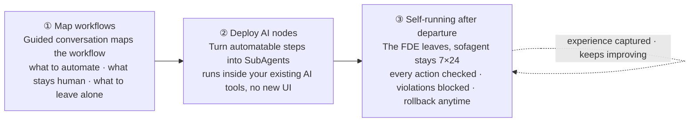
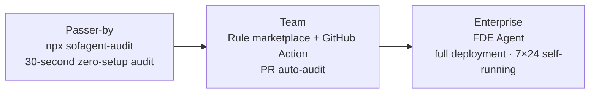

<p align="center">
  
</p>

<p align="center">
  <strong>FDE Agent — map workflows · deploy AI nodes · self-running after departure</strong>
</p>

<p align="center">
  <a href="https://github.com/KongFangXun/sofagent/actions/workflows/verify.yml"></a>
  <a href="./CHANGELOG.md"></a>
  <a href="./LICENSE"></a>
</p>

<p align="center">
  <a href="#what-is-this">What is this</a> · <a href="#quick-start">Quick Start</a> · <a href="#three-entries-from-30-seconds-to-full-deployment">Three Entries</a> · <a href="#docs">Docs</a> · <a href="README.md">中文</a> · <a href="https://github.com/KongFangXun/sofagent">⭐ Star</a>
</p>

---

## What is this

**sofagent is an open-source FDE Agent** (Forward Deployed Engineer Agent) — it comes in and maps your business workflows, turning the automatable steps into AI nodes. Once delivery is complete, the FDE departs while the AI nodes keep running 7×24 on their own — every action is audited, out-of-bounds moves are blocked, and anything that breaks can be rolled back.



> 🏞️ Big vendors hand you "water" (the LLM) and a "riverbed" (the Agent platform), but the water is raw — you wouldn't dare drink it straight. sofagent is the engineering that makes the river water usable across a whole city: the dam stops floods, the treatment plant turns raw water into drinking water, and the pipe network delivers it to every faucet. The model provides 90% of the intelligence; sofagent adds the 10% of reliable execution.

## Key Features

- 🧭 **Map workflows on-site** — the FDE walks you through your business workflow in conversation: which steps to automate, which stay human, which to leave alone — producing an ontology + workflow.yml + skills/
- 🤖 **Deploy AI nodes** — turn automatable steps into SubAgents that run inside your existing AI tools (WorkBuddy / Codex / Claude Code) — no new UI to learn; from "you do the work" to "you delegate the work"
- 🔍 **Zero-setup audit** — `npx sofagent-audit`, audits your last commit in any git repo in 3 seconds, installs nothing
- 🧱 **24 audit rules** — secret leaks, out-of-scope edits, blind modifications, injection defense, privilege red lines — judged on hard git diff evidence, violations blocked on the spot
- 🛡️ **Automatic snapshot & rollback** — auto-archived after every audit, one-click restore to any snapshot
- 🧬 **Keeps getting better** — lessons from every task are captured into the knowledge base automatically, so the next run avoids the same pitfalls
- 🖥️ **Visual dashboard** — a 6-page web console (cockpit / AI nodes / ontology / knowledge base…), all driven by real data
- 🔌 **Rule marketplace + GitHub Action** — built-in security / sofagent rulesets, custom JSON rules supported; every PR auto-audited, violations annotated on the diff lines

## Product Preview

<p align="center">
  
</p>

<p align="center"><sub>Dashboard cockpit: rule pass rate, audit tasks, violation trends — see at a glance what the AI is doing</sub></p>

## Quick Start

**30 seconds, zero setup** — run an audit in any git repo:

```bash
npx sofagent-audit
```

Here's what it looks like when a violation is blocked (real output):

<p align="center">
  
</p>

**Full install** (Node.js ≥ 18, download and review before running):

```bash
curl -fsSL https://raw.githubusercontent.com/KongFangXun/sofagent/main/bootstrap.sh -o bootstrap.sh
less bootstrap.sh          # review the script first, confirm it's safe
bash bootstrap.sh && rm bootstrap.sh
sofagent-audit --init      # install the git hook — every commit is audited from now on
sofagent-audit --doctor    # verify the environment (optional)
```

> 💡 All install scripts only write to `~/.sofagent/` and never touch system files. `--no-verify` can bypass the local hook — sofagent guards against honest Agents' carelessness, not deliberate bypass; for high-security scenarios add `sofagent-audit --diff` on the CI side as a backstop. See [LIMITATIONS](./docs/LIMITATIONS.md).

More install options (clone install / full npx install / minimal install / enterprise deployment) in [HANDBOOK](./docs/HANDBOOK.md). Enterprise users who just want the FDE methodology for mapping workflows, see [FDE/README.md](./FDE/README.md) (zero dependencies, no Node.js needed).

## Three Entries, from 30 Seconds to Full Deployment

No need to commit to the full package up front — start with a 30-second trial, then go deeper if it's useful:



| Entry | What it does | Time needed |
|------|--------|:----:|
| **`npx sofagent-audit`** | Zero-setup audit of the last commit, results in 3 seconds | 30 sec |
| **`--ruleset` rule marketplace** | Load rulesets like security, or use custom JSON rules | 1 min |
| **GitHub Action** | Auto-audit every PR, violations annotated on the diff lines | Set up once |
| **FDE Agent** | Map workflows on-site → deploy AI nodes → 7×24 self-running | FDE residency |

**Rule marketplace**:

```bash
npx sofagent-audit --list-rulesets      # see available rulesets
npx sofagent-audit --ruleset security   # load the security ruleset
```

Community rulesets are published as `sofagent-ruleset-*` npm packages and auto-discovered once installed; `--ruleset-path` can also point to your own JSON rules.

**GitHub Action** — add `.github/workflows/sofagent-audit.yml` to your repo:

```yaml
on: [pull_request]
jobs:
  audit:
    runs-on: ubuntu-latest
    steps:
      - uses: actions/checkout@v4
        with:
          fetch-depth: 0        # auditing needs full diff history
      - uses: KongFangXun/sofagent@v1.2.9
        with:
          ruleset: sofagent     # sofagent / security / community rulesets
```

> 🔬 **Independent external evidence** (not an official self-test): Joel Niklaus' harness-optimization research on HuggingFace shows that with the same model and unchanged weights, optimizing only the outer harness lifted a legal-Agent benchmark from **63.4% → 80.1% (+16.7pp)**. See [THANKS.md](./docs/THANKS.md).

## Docs

| You want to know | Where |
|:---------|:--------|
| How to install, use, FAQ | [HANDBOOK](./docs/HANDBOOK.md) |
| Architecture (constraint layer · injection chain · evolution · 24 rules) | [ARCHITECTURE](./docs/ARCHITECTURE.md) |
| Design philosophy | [PHILOSOPHY](./docs/PHILOSOPHY.md) |
| Industry validation & ecosystem positioning (differences from existing tools) | [VALIDATION](./docs/VALIDATION.md) |
| Version roadmap | [ROADMAP](./docs/ROADMAP.md) |
| FDE diagnostic methodology (four phases, twelve steps) | [FDE/GUIDE.md](./FDE/GUIDE.md) |
| Security statement · known limitations | [SECURITY](./SECURITY.md) · [LIMITATIONS](./docs/LIMITATIONS.md) |
| Contribution guide | [CONTRIBUTING](./CONTRIBUTING.md) |

---

<p align="center">
  Issues and PRs welcome, especially the nitpicky kind · <a href="./CONTRIBUTING.md">Contributing</a> · <a href="./docs/THANKS.md">Thanks</a><br/>
  <sub>MIT License © <a href="https://github.com/KongFangXun/sofagent">Kong Fangxun</a> · <a href="https://github.com/KongFangXun/sofagent">⭐ If sofagent helps you, star it and help more people find it</a></sub>
</p>
