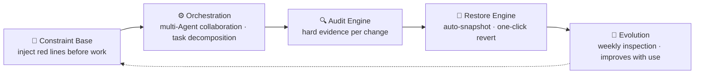

# sofagent

> 🌐 [中文 →](README.md) | English

<p align="center">
  <a href="https://sofagent.ai">
    
  </a>
</p>

<p align="center">
  <strong>Onboard · Deploy AI nodes · Leave them running 24/7</strong><br/>
  <em>Give SMBs the ability to turn AI into daily work.</em>
</p>

<p align="center">
  <a href="https://github.com/KongFangXun/sofagent/actions/workflows/verify.yml"></a>
  <a href="./LICENSE"></a>
  <a href="./CHANGELOG.md"></a>
  <a href="#install-and-get-going"></a>
</p>

<p align="center"><strong>Current version: v1.2.1</strong> · 2026-07-28 · Data directory refactor + custom/ closure + ToolGate integration + SubAgent visibility L2</p>

<p align="center">
  <a href="#what-is-this">What is this</a> · <a href="#what-sofagent-can-do-for-you">Features</a> · <a href="#three-deployment-options">Deployment</a> · <a href="#install-and-get-going">Install</a> · <a href="#further-reading">Docs</a>
</p>

---

## What is this

Companies don't lack LLMs and Agents — they lack the ability to turn AI into daily work.

**That's what sofagent does.** It's an FDE Agent — it onboards with a four-phase process: map your workflows, turn automatable steps into AI nodes, deploy them onto devices, then leave. After departure, those nodes run 24/7 on their own. What you keep is a set of self-sustaining AI assets.

Big vendors built the river — LLM is the water, Agent platforms are the riverbed. But enterprises don't dare drink straight from it. sofagent builds the dam + water treatment plant + pipe network + faucet — turning raw water into drinkable water for everyone. Full analogy: [ARCHITECTURE · River](./docs/ARCHITECTURE.md).

### Why not existing tools

| Tool | What they check | What sofagent checks |
|------|:---------|:----------------|
| pre-commit / husky | Code quality (lint / format) | **Agent behavior** (secret leaks / out-of-scope edits / injection attacks / blind edits) |
| detect-secrets / gitleaks | Secret scanning | Secrets are just A1; sofagent has 20 more rules for Agent failure modes |
| Cursor Rules / Claude Code hooks | Single-platform IDE constraints | Platform-agnostic — any Agent + git repo |
| Agent platforms (OpenClaw etc.) | Agent scheduling — "can it do it" | Agent governance — "can it do it right every time" |

Existing tools check "is the code written well"; sofagent checks "did the Agent behave well" — out-of-scope edits, knowledge base cross-domain, process compliance, edit-without-read. These are LLM-Agent-specific failure modes that generic lint tools don't cover.

<details>
<summary>📦 After FDE leaves, the enterprise keeps five things</summary>

The first four are assets, the fifth is sofagent itself — the FDE Agent that stays and keeps them running:

| Deliverable | Description |
|-------------|-------------|
| Deployment manual | Operation manual that enterprise IT can independently maintain |
| AI nodes | Running Agents that auto-execute daily tasks (financial reconciliation, audit inspection, data analysis...) |
| AI knowledge base | Continuously accumulated entities, concepts, comparison pages (Dream Cycle auto-sedimentation) |
| Private evaluation system | eval feedback + Skill iteration history — non-copyable enterprise IP |
| **sofagent itself** | The FDE Agent running 24/7 — manages the lifecycle of the above four; the human leaves, it stays |

</details>

---

## What sofagent can do for you

| What you want to solve | How sofagent does it |
|------|------|
| **Want AI to auto-run daily tasks** | Onboard, map workflows, turn automatable steps into AI nodes — they run on their own after deployment |
| **What if the Agent goes out of bounds** | 21 rules auto-audit every change — out-of-scope edits, secret leaks, injection attacks, blocked on the spot |
| **Can I roll back if something goes wrong** | Auto git snapshot after every change, one-click revert to any safe state |
| **What if I switch Agent / model** | Platform-agnostic — Claude Code / Codex / Cursor / WorkBuddy, plug and play |
| **Does it get better over time** | Experience auto-sedimented, FDE weekly inspection continuously optimizes rules and knowledge |

> [!TIP]
> **90/10 value split**: the model provides 90% of the intelligence, sofagent adds 10% of reliable execution — and that 10% gets more valuable over time. Not a smarter model, but a set of gates for the intelligence you already have.

---

## Three deployment options

| Option | Who uses it | How |
|------|------|--------|
| 💻 **Install on computer** | Technical staff / developers | `bash install.sh` normal install |
| 🔌 **USB key** | Regular employees (SMB core scenario) | Plug and play, zero residue on unplug, no installation or expertise needed |
| 🖥️ **Headless device** | Server / industrial PC (OPC scenario) | Plug USB and leave it, Agent runs 24/7 in the federation |

> 💡 **USB one-click burn**: build a workflow → burn a batch of USB keys → distribute to the team. Enterprise narrative: "buy USB → download sofagent → write to disk → distribute to employees". See [FDE/FDE.md](./FDE/FDE.md).

---

## Install and get going

After installation, you talk to sofagent in your own Agent (WorkBuddy / Codex / Claude Code) and it starts working. No UI — language is the interface.

```bash
# Main installer (base + FDE Agent)
bash install.sh
```

> [!NOTE]
> Requires Node.js ≥ 18 + bash + git. macOS / Linux fully supported, Windows experimental.

<details>
<summary>🚀 Three-step first experience</summary>

```bash
# 1. See the rules — agents carry these red lines
sofagent-audit --help | head -5

# 2. Run an audit — --init installed a pre-commit hook, so every commit is scanned by A1
echo "API_KEY=sk-123456" > .env && git add -f .env && GIT_EDITOR=true git commit -m "test"
# → ⛔ A1 sensitive files: .env contains key pattern, commit blocked (never lands)

# 3. Check snapshots — auto-saved after every audit
sofagent-audit --timeline

# Cleanup (A1 blocked the commit, so nothing landed)
git rm --cached -f .env 2>/dev/null; rm -f .env
```
</details>

> ⚠️ **About commit blocking**: `git commit --no-verify` can bypass the local hook. sofagent is designed as a "guardrail for honest Agents", not a "defense against malicious attackers". For high-security enterprise scenarios, add a `sofagent-audit --diff` check in your CI/CD pipeline (hooks can be bypassed, CI cannot). See [LIMITATIONS](./LIMITATIONS.md).

**Two install modes**:

| Mode | Command | What it installs |
|------|------|--------|
| Full install | `bash install.sh` | Base + FDE Agent (everyone) |
| Base only | `bash install.sh --base-only` | Base engine only (developers / enterprise IT) |

**Install on demand**:

| Package | Purpose |
|------|------|
| `@sofagent/audit` | Audit engine (21 rules, git diff hard evidence) |
| `@sofagent/core` | Runtime diagnostics (doctor / verify) |
| `@sofagent/orchestrator` | Orchestration engine (multi-Agent collaboration) |
| `@sofagent/daemon` | Daemon process (file monitoring / scheduled inspection) |
| `@sofagent/mcp` | MCP Server (JSON-RPC 2.0) |

<details>
<summary>Uninstall</summary>

```bash
# install.sh globally installs @sofagent/audit (other engines via monorepo local references)
npm uninstall -g @sofagent/audit 2>/dev/null || true
# If you manually installed other packages, clean them up too
npm uninstall -g @sofagent/core @sofagent/orchestrator @sofagent/daemon @sofagent/mcp 2>/dev/null || true
rm -f .git/hooks/commit-msg .git/hooks/post-commit
```
</details>

---

## Further reading

| Want to learn | Where |
|:---------|:--------|
| FDE Agent four-phase onboarding, enterprise deployment | [FDE.md](./FDE/FDE.md) |
| Install, usage, FAQ | [HANDBOOK](./docs/HANDBOOK.md) |
| Engine architecture, 21 rules, internal mechanisms | [↓ Engine architecture (developers)](#engine-architecture-developers) |
| Why designed this way | [ARCHITECTURE](./docs/ARCHITECTURE.md) |
| Design philosophy | [PHILOSOPHY](./docs/PHILOSOPHY.md) |
| Security statement | [SECURITY](./SECURITY.md) |
| Known limitations | [LIMITATIONS](./LIMITATIONS.md) |
| Version roadmap | [ROADMAP](./ROADMAP.md) |
| Contributing | [CONTRIBUTING](./CONTRIBUTING.md) |

---

## Engine architecture (developers)

> [!NOTE]
> **Two names, one thing**: the product you interact with is called **FDE Agent** (helps you map workflows and deploy AI nodes); the underlying engine is called **sofagent** (open-source repo + npm packages `@sofagent/*`). Regular users only need to remember **FDE Agent** — the following section is for developers.

The sofagent engine is a Harness middleware that constrains Agent behavior, with one base and four engines covering the full lifecycle.

<details>
<summary>📖 One base · four engines architecture (developer reference)</summary>



| Engine | What it does | Status |
|:------|:--------|:--:|
| 🧭 Constraint Base | Injects rules into Agent context before work starts (SKILL.md + fde.md + think.md + knowledge/) | ✅ stable |
| ⚙️ Orchestration | Multi-Agent collaboration + task decomposition | 🔶 partial |
| 🔍 Audit Engine | 21 rules on every git commit / file change, blocks + logs violations. **Zero-token audit** — pure static analysis, no LLM cost | ✅ stable |
| 🔄 Restore Engine | Auto git snapshot after every audit, one-click revert | ✅ stable |
| 🧬 Evolution | FDE weekly inspection of audit trends + reflection logs | ⚠️ experimental |

</details>

<details>
<summary>📖 Engine details + 21 rules</summary>

### 🧭 Constraint Base

Four-layer loading chain: SKILL.md (constitution · immutable) → fde.md (norms · editable) → think.md (reflection · auto-generated) → knowledge/ (knowledge · auto-accumulated). v1.0.7+ Sub Agents self-load on startup (`buildConstrainedSystemPrompt`), independent of any Agent platform's Skill system.

### ⚙️ Orchestration Engine

Two layers implemented: ① **Task decomposition** — LangGraph createReactAgent turns task descriptions into orchestration plan YAML; ② **Multi-Agent collaboration** — supports serial orchestration of multiple Sub Agents, per-node checkpoint for interrupt recovery.

> 🔶 Currently a **serial** state machine (not a parallel DAG scheduler). Full DAG parallel scheduling + sandbox execution is planned in [ROADMAP v1.3.1](./ROADMAP.md).

### 🔍 Audit Engine

Of the 21 rules, 16 are pure git-diff (don't need Agent cooperation), 4 are hybrid (A7/A8/A14/A15 need Agent logs), 1 is filesystem (A17 abnormal batch change). v1.0.8+ embeds isomorphic-git + daemon file monitoring, **audits without git commit**. Since v1.1.8, Prompt injection defense (A9 extended) + federated query encryption extend audit capability from local to cross-device.

**Default rules (13, active on install)**:

| Category | Rules | What they block |
|------|------|--------|
| 🔴 Secret security | A1 sensitive files · A2 secret leaks | `.env` / `*.pem` commits, hardcoded API keys |
| 🟡 Behavior boundaries | A3 out-of-scope · A4 config deletion | Editing files outside task scope, deleting configs |
| 🟠 Injection defense | A9 injection · A10 malicious sources | Prompt injection patterns, unofficial source deps |
| 🔵 Process compliance | A5 empty message · A7 blind edit · A8 skip tests · A19 message quality | Empty commit msg, edit-without-read, skip tests, low-quality msg |
| ⚪ Engineering quality | A6 build break · A11 resource abuse · A18 junk files | Build config anomalies, oversized files, temp file commits |

**Extended rules (8, opt-in)**: A14 KB cross-domain · A15 blind action · A16 unauthorized change · A17 batch change · E1-E4 (test files / undeclared TODO / mass deletion / low comment ratio). Full 21-rule table (with severity, grading, logic) at [engine/audit/README.md](./engine/audit/README.md).

### 🔄 Restore Engine

Auto git snapshot after every audit (a lightweight snapshot of the working tree, not a git commit — no history pollution). Pushes notification + suggests rollback on violation. `sofagent-audit --revert <sha>` reverts to any snapshot.

### 🧬 Evolution Engine (experimental)

FDE weekly inspection: read audit trends (history.jsonl) → analyze think.md repeated errors → read eval for node degradation → generate optimization report / mark stable.

</details>

---

## Contributing & thanks

Issues and PRs welcome, especially the nitpicky kind. [CONTRIBUTING.md](./CONTRIBUTING.md) · [Thanks](./docs/THANKS.md)

---

<p align="center">
  <br/>
  <em>If sofagent helps you</em><br/><br/>
  <a href="https://github.com/KongFangXun/sofagent">⭐ Star · Help more people find it</a>
</p>
