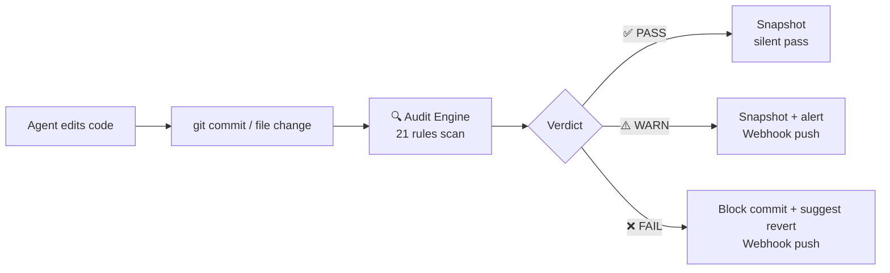
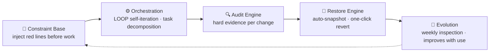
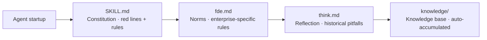
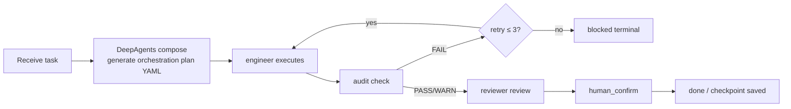
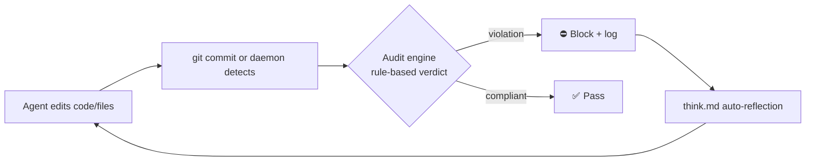

# sofagent

> 🌐 [中文 →](README.md) | English

<p align="center">
  <a href="https://sofagent.ai">
    
  </a>
</p>

<p align="center">
  <strong>sofa + agent = sofagent</strong><br/>
  <em>The FDE Agent for SMBs and OPCs — a harness for your AI, an audit trail for every result.</em>
</p>

<p align="center">
  <a href="https://github.com/KongFangXun/sofagent/actions/workflows/verify.yml"></a>
  <a href="./LICENSE"></a>
  <a href="./CHANGELOG.md"></a>
  <a href="#install"></a>
</p>

---

## ① What is FDE Agent

The smarter the Agent, the less companies dare to let go — when something goes wrong, who's accountable? Can it be stopped? Can it be rolled back?

**sofagent provides FDE Agent for SMBs and OPCs** — a resident Agent that maps your enterprise workflows into AI nodes and runs autonomously after deployment. Under the hood is the sofagent engine (Harness middleware): every time an Agent finishes writing code or files, a rule engine scans automatically — violations are blocked on the spot, compliant changes get snapshotted. What was changed is what was changed, no denying it. The audit engine has zero token cost — pure regex engine, no LLM calls.

> 💡 **Why now**: a16z (2026-07) points out "for the first time in human history, humans are cheaper than software" — every company is hiring "a million bad AI employees," with 80% of tokens spinning idle. The solution isn't a smarter model, but **management**. sofagent is exactly that layer: governing the Agent workforce with constraints + auditing.

<details>
<summary>🏞️ The "one river" analogy (click to open)</summary>

Big vendors build the river (LLM = water, Agent platform = riverbed — without the riverbed, water is just an ocean); we build the **dam + water treatment plant + pipe network + faucet** — the constraint layer (keeps water from flooding) + sandbox/security (makes water from "drinkable" to "trustworthy") + Workflow (routes capability to the business) + Subagent (uses capability in specific business tasks). Picture a city with a great river — the water is good, but you wouldn't scoop it straight from the river to drink; sofagent is the infrastructure that **turns raw river water into tap water businesses dare to drink**. See [FDE/FDE.md §9.6](./FDE/FDE.md#96-river大厂造河与企业用水).

</details>

> 💡 **Another angle: a working agent ≠ a model + a prompt** — it's a multi-layer skeleton (config / knowledge / instruction / validation / orchestration). sofagent's constraint base is the rebar in that skeleton, the audit engine is the quality inspector. We scaffold agents with tools / permissions / sandboxes / rules — rather than building a smarter model.

**Measured impact**:

> [!NOTE]
> 🔬 **Hugging Face benchmark**: same model, harness-only optimization — legal-agent score jumped from 3.5% to 80.1% (76-point gain entirely from outer-layer mechanisms), at ~1/7 the cost (matching Claude Sonnet 4.6). [Details](./docs/THANKS.md)

| Dimension | Data |
|------|------|
| Audit engine | 21 rules fully covered, `npm test` green (live count via `tools/test-count.sh`), 0 token cost |
| Platform coverage | git commit audit (developers) + daemon file audit (non-developers) |
| License | MIT (code / docs / templates — use freely) |

---

## ② Install and get going

```bash
# FDE Agent one-click deploy
bash FDE/fde-install.sh
```

> 💡 Developer wanting only the audit engine? See "④ Engine Architecture · Advanced/Developer Path" below. OpenClaw is only needed for enterprise unattended scenarios.

> [!NOTE]
> Requires Node.js ≥ 18 + bash + git. macOS / Linux fully supported, Windows experimental.

<details>
<summary>🚀 Three-step first experience (click to open)</summary>

```bash
# 1. See the rules — agents carry these red lines
sofagent-audit --help | head -5

# 2. Run an audit — --init installed a pre-commit hook, so every commit is scanned by A1
echo "API_KEY=sk-123456" > .env && git add -f .env && GIT_EDITOR=true git commit -m "test"
# → ⛔ A1 sensitive files: .env contains key pattern, commit blocked (never lands)

# 3. Check snapshots — auto-saved after every audit
sofagent-audit --timeline

# Cleanup (A1 blocked the commit, so nothing landed)
git rm --cached -f .env 2>/dev/null; rm -f .env
```
</details>

**Install on demand**:

| Package | Purpose |
|------|------|
| `@sofagent/audit` | Audit engine (21 rules, git diff hard evidence) |
| `@sofagent/core` | Runtime diagnostics (doctor / verify) |
| `@sofagent/orchestrator` | Orchestration engine (multi-Agent collaboration) |
| `@sofagent/daemon` | Daemon process (file monitoring / scheduled inspection) |
| `@sofagent/mcp` | MCP Server (JSON-RPC 2.0) |

**Uninstall**:

```bash
npm uninstall -g @sofagent/audit @sofagent/core @sofagent/orchestrator @sofagent/daemon @sofagent/mcp
rm -f .git/hooks/commit-msg .git/hooks/post-commit
```

### Two deployment node types

| Node | Scenario | Needs OpenClaw |
|------|------|:--:|
| 🔄 Auto-run node | Enterprise unattended device (server / old computer) | Yes |
| ⚡ Personal augmentation node | Developer using WorkBuddy / Codex / Claude Code | No |

> 💡 Personal augmentation node: clone repo → `bash FDE/fde-install.sh` → go.

---

## ③ Enterprise deployment: FDE Agent

sofagent isn't just a developer tool — enterprise deployment uses the **FDE Agent**:

- **FDE Agent** (`FDE/`): Frontline Deployment Engineer four-phase onboarding (map → mine → deliver → leave) — turns enterprise workflows into AI nodes, FDE leaves after deployment, AI nodes run themselves. See [FDE/FDE.md](./FDE/FDE.md).
- **Workflow Hub**: Industry workflow templates (v1.1.9 physically migrated to commercial product `sofagent-commercial/FLOWHUB/`; no longer maintained in the MIT repo).
- **LOOP self-iteration toolkit** (`LOOP/`): sofagent's outer-loop self-iteration orchestration — inner loop `coding → audit → review → human`, outer loop `FDE supervision → compliance inspection → Agent definition optimization`. See [LOOP/README.md](./LOOP/README.md).

**Three-product relationship**: sofagent core handles "gatekeeping every change" (commit / file change triggers audit); FDE handles "onboarding & delivery" (deploying sofagent into enterprise devices then leaving); LOOP handles "long-term self-iteration" (continuous inspection + optimizing Agent definitions). All three share the same constraint base and audit engine, and none are standalone repos (require cloning the main repo first).

> 💡 **Naming convention**: capitalized directories (`FDE/`, `LOOP/`) are sofagent's **deployment/product entry points** — they require cloning the main repo first (not standalone repos; cloning just the subdirectory will fail due to dependency on `sofagent/scripts/install.sh`); lowercase directories (`sofagent/`, `docs/`, `tools/`) = core code and configuration.

### What FDE Agent delivers

After FDE leaves, the enterprise keeps five things — the first four are assets, the fifth is the FDE Agent itself keeping them alive:

| Deliverable | Description |
|-------------|-------------|
| Deployment manual | Operation manual that enterprise IT can independently maintain |
| AI nodes | Running Agents that auto-execute daily tasks (financial reconciliation, audit inspection, data analysis...) |
| AI knowledge base | Continuously accumulated entities, concepts, comparison pages (Dream Cycle auto-sedimentation) |
| Private evaluation system | eval feedback + Skill iteration history — non-copyable enterprise IP |
| **FDE Agent itself** | Running 24/7 — manages the lifecycle of the above four; the human leaves, it stays |

### USB one-click burn: build workflow → distribute USB keys

After FDE maps out the workflow nodes, you can burn a complete runtime onto a USB key — employees plug it into any computer, double-click, and it runs. No installation, no pairing:

```bash
# After plugging in the USB, one command burns the full runtime
sofagent-daemon create-usb-key \
  --role "Financial Audit Node" \
  --target /Volumes/SOFAGENT \
  --platform macos
```

**What's on the USB**: Portable Node.js + sofagent engine (audit/orchestration/constraint/rollback) + knowledge encrypted on disk (AES-256-GCM) + cross-platform start scripts + HMAC tamper-proof signature.

**Plug and play**: Double-click `start.command` (macOS) / `start.sh` (Linux) / `start.bat` (Windows) → verify signature → decrypt knowledge to memory → daemon starts → federation online. Unplug the USB, zero residue on the computer.

> 💡 Build a financial workflow → burn a batch of USB keys → distribute to the finance team → each person plugs in and uses their own Agent to access the USB's knowledge and audit capabilities. See [FDE/FDE.md §deployment scenarios](./FDE/FDE.md).

### Product form: MCP + dashboard

The sofagent core (audit engine + orchestration engine + FDE capability) is for developers. When productized for non-technical buyers, it needs a different shell:

- **Sell capability, not hours** — package "the AI adoption capability every enterprise should have" as an Agent-driven product; revenue shifts from "consultant hours" to "number of enterprises × subscription".
- **Lightweight dashboard** — LUI-first unchanged, but non-expert buyers need a read-only view showing "how far my company's AI adoption has gone" (audit status / AI progress / compliance monthly report).
- **MCP as bridge** — the dashboard is lightweight, using MCP to let the customer's existing Agent / your sub-agent feed data to the backend.
- **open-core dual track** — the core (audit / FDE / orchestration) stays MIT open-source as a trust asset; commercialization only sells that dashboard layer. Open-source earns trust, closed-source earns payment.

> Control-plane play: the underlying Agent intelligence can be swapped freely, but governance and truth always live in sofagent's dashboard. See [PHILOSOPHY §6](./docs/PHILOSOPHY.md).

---

## ④ Engine Architecture (Developer Section)

> The following is for developers. Non-technical users only need to know: FDE Agent is built on the sofagent engine, which handles auditing and rollback for every change.

### 30-second version of the audit engine



The sofagent engine is a **Harness middleware** — no matter what Agent you use (Claude Code / Codex / Cursor / WorkBuddy) or what model, it hooks into the git commit node and audits with hard git diff evidence. **Platform-agnostic, zero-intrusion, zero tokens**. FDE Agent is built on top of this engine.

### Why not existing tools

| Tool | What it checks | What sofagent checks |
|------|---------|----------------|
| pre-commit / husky | Code quality (lint / format) | **Agent behavior** (secret leaks / out-of-scope edits / injection attacks / blind edits) |
| detect-secrets / gitleaks | Secret scanning | Secrets are just A2; sofagent has 20 more rules for Agent failure modes |
| Cursor Rules / Claude Code hooks | Single-platform IDE constraints | Platform-agnostic — any Agent + git repo |

> 💡 **Core difference**: existing tools check "is the code written well"; sofagent checks "did the Agent behave well" — out-of-scope edits, knowledge base cross-domain, process compliance, blind edits without reading first. These are LLM-Agent-specific failure modes that generic lint tools don't cover.

### 21 rules (5 categories)

**Default rules (13, active on install)**:

| Category | Rules | What they block |
|------|------|--------|
| 🔴 **Secret security** | A1 sensitive files · A2 secret leaks | `.env` / `*.pem` commits, hardcoded API keys |
| 🟡 **Behavior boundaries** | A3 out-of-scope · A4 config deletion | Editing files outside task scope, deleting configs |
| 🟠 **Injection defense** | A9 injection · A10 malicious sources | Prompt injection patterns, unofficial source deps |
| 🔵 **Process compliance** | A5 empty message · A7 blind edit · A8 skip tests · A19 message quality | Empty commit msg, edit-without-read, skip tests, low-quality msg |
| ⚪ **Engineering quality** | A6 build break · A11 resource abuse · A18 junk files | Build config anomalies, oversized files, temp file commits |

**Extended rules (8, opt-in)**: A14 KB cross-domain · A15 blind action · A16 unauthorized file change · A17 abnormal batch change · E1-E4 (test files / undeclared TODO / mass deletion / low comment ratio).

<details>
<summary>📋 Full rule table (21 rules, with detection logic)</summary>

| Rule | Detection | Severity | Class |
|------|------|:--:|------|
| A1 sensitive files | `.env` / `*.pem` / `id_rsa` / key files modified | FAIL | business baseline |
| A2 secret leaks | API Key / Token / Password patterns in code | FAIL | business baseline |
| A3 out-of-scope | Modified file path doesn't match task description | WARN | business baseline |
| A4 config deletion | Config file deleted | FAIL | business baseline |
| A5 empty message | Empty or placeholder commit message | WARN | business baseline |
| A6 build break | Build config file abnormally changed | WARN | capability crutch |
| A7 blind edit | Modified file has no read record | FAIL/WARN | capability crutch |
| A8 skip tests | Build file changed but no test record | FAIL/WARN | capability crutch |
| A9 injection | Command injection risk patterns in code | FAIL | business baseline |
| A10 malicious sources | Dependency blacklist detection | WARN | business baseline |
| A11 resource abuse | Resource abuse (oversized files, etc.) | WARN | business baseline |
| A18 junk files | Temp-file-pattern junk files | WARN | capability crutch |
| A19 message quality | Message hits blacklist or too short | FAIL | business baseline |
| A14 KB cross-domain | Accessing KB pages outside workflow scope | WARN | capability crutch |
| A15 blind action | workflow.yml node has no declared actions | FAIL | capability crutch |
| A16 unauthorized change | Files modified outside workflow scope | FAIL | engineering norm |
| A17 batch change | File change count exceeds threshold | WARN | engineering norm |
| E1 test files | Test files committed to production dirs | WARN | capability crutch |
| E2 undeclared TODO | New TODO not declared in task | WARN | capability crutch |
| E3 mass deletion | Deletion line count exceeds threshold | WARN | capability crutch |
| E4 low comment ratio | >200 new lines with <5% comments | WARN | capability crutch |

**Rule classes**: business baseline (violation breaks delivery integrity) · capability crutch (helps Agent follow correct flow) · engineering norm (code engineering quality baseline).
</details>

### One base · Four engines

The sofagent engine isn't just audit — the full form is a Harness middleware with "one base + four engines":



| Engine | What it does | Status |
|------|--------|:--:|
| 🧭 Constraint Base | Injects rules into Agent context before work starts (SKILL.md + fde.md + think.md + knowledge/) | ✅ stable |
| ⚙️ Orchestration | LOOP self-iteration (engineer→audit→reviewer serial) + task decomposition (generates plan) | 🔶 partial (needs `@sofagent/orchestrator`) |
| 🔍 Audit Engine | Runs 21 rules on every git commit / file change, blocks + logs violations | ✅ stable (`@sofagent/audit` standalone) |
| 🔄 Restore Engine | Auto git snapshot after every audit, one-click revert on violation | ✅ stable |
| 🧬 Evolution | FDE weekly inspection of audit trends + reflection logs | ⚠️ experimental |

> 💡 **Minimum usage**: just install `@sofagent/audit` for pure audit (21 rules + snapshot + revert). Install all 5 packages for the full Harness middleware.

<details>
<summary>📖 Engine details (click to open)</summary>

### 🧭 Constraint Base



Injects rules into Agent context before work starts — so it knows where the red lines are. Four-layer loading chain: SKILL.md (constitution) → fde.md (enterprise rules) → think.md (historical pitfalls) → knowledge/ (auto-accumulated). v1.0.7+ Sub Agents self-load on startup (`buildConstrainedSystemPrompt`), independent of any Agent platform's Skill system.

> 📚 **Knowledge pipeline (v1.1.7)**: knowledge/ is auto-accumulated by the daemon's **Dream Cycle 6-stage pipeline** (extract_facts → extract_atoms → cluster_patterns → synthesize_concepts → skillopt_backfill → embed), replacing the legacy scatter scripts; every entry carries a `sensitivity` level (public/internal/restricted, default internal). Companion governance: the `knowledge-health` inspector (@weekly — orphan/duplicate/broken-link/stale-index/missing-source, fail-closed read-only) plus the `sofagent-daemon knowledge status` aggregation command (one glance at Dream Cycle weekly report / knowledge health / sensitivity stats; restricted entries are counted only, never leaked).

> 🔐 **Security & federation (v1.1.8 · released)**: two paired devices query each other's knowledge/ over the OpenClaw channel — AES-256-GCM application-layer encryption + ECDH key exchange (keys live in memory only) + three pairing paths (6-digit code confirmation / token via `SOFAGENT_FEDERATION_TOKEN` / federation.json HMAC signature verification) + double sensitivity filtering + automerge CRDT merge (trust outranks mtime) + graceful offline fallback. Prompt-injection defenses completed: `<untrusted>` wrapping for external content, prompt-level redaction, and knowledge trust grading (official>internal>user>web; web+restricted dropped). Proactive knowledge notifications: Dream Cycle / health inspections push a summary on completion (best-effort; restricted never included).

### ⚙️ Orchestration Engine



Two layers currently implemented: ① **Task decomposition** — DeepAgents compose turns a task description into an orchestration plan YAML; ② **LOOP self-iteration** — a 4-node StateGraph (engineer → audit → reviewer → human_confirm), where audit FAIL auto-routes back to engineer for retry (up to 3 rounds), with per-node checkpoint for interrupt recovery.

> 🔶 **Capability boundary**: LOOP is currently a **serial** state machine (not a parallel DAG scheduler). The compose output YAML describes "which nodes should exist," but there is no executor that dispatches Sub Agents in parallel by DAG. The A/B comparison mechanism (promote after 2 consecutive wins) is implemented but relies on historical log statistics, not real-time dual runs. Full DAG parallel scheduling + sandbox execution is planned in [ROADMAP v1.3.0](./ROADMAP.md).

### 🔍 Audit Engine



Auto-scans on every git commit or file change — Agent edits code → git commit/daemon detects → audit engine rules judge → violation blocked+logged / compliant released → think.md auto-reflection. Of the 21 rules, 16 are pure git-diff (don't need Agent cooperation), 4 are hybrid (A7/A8/A14/A15 need Agent logs), 1 is filesystem (A17 abnormal batch change). v1.0.8+ embeds isomorphic-git + daemon file monitoring, **audits without git commit**.

### 🔄 Restore Engine (essentially: git snapshot + revert wrapper)

Auto-snapshots after every audit — pushes notification + suggests rollback on violation:

| Result | Auto action | What user sees |
|------|---------|------------|
| ✅ PASS | Auto-snapshot | Silent |
| ⚠️ WARN | Snapshot + mark | daemon-notice.md alert + optional Webhook |
| ❌ FAIL | Snapshot + suggest rollback | Webhook push + terminal red |

### 🧬 Evolution Engine (experimental)

```mermaid
graph LR
    A[FDE weekly inspection] --> B[Read audit trends<br/>history.jsonl]
    B --> C[Analyze think.md<br/>repeated errors]
    C --> D[Read eval<br/>which node is degrading]
    D --> E{Problem found?}
    E -->|Yes| F[Generate optimization report<br/>update rules / enrich knowledge]
    E -->|No| G[Mark "stable"]
    F --> A
```

⚠️ A/B auto-promote is based on `consecutiveWins ≥ threshold` + `overallImprovement` guard, eval scoring relies on LLM self-grading (self-grading bias exists). May mis-promote in narrow eval scenarios — for production, recommend manual review of promote decisions. Two modes: `deploy` (first deployment / major business change) + `sustain` (weekly auto / manual trigger inspection).

</details>

### Your scenario → what to install

| Your scenario | Install |
|---------|--------|
| Just block secret leaks / Agent out-of-scope | `@sofagent/audit` + `@sofagent/core` (minimum) |
| Full-lifecycle Agent governance (constraint + audit + revert) | + `@sofagent/daemon` (file monitoring) |
| Multi-Agent collaboration / workflow orchestration | + `@sofagent/orchestrator` (orchestration engine) |
| Let MCP Client call audit capability | + `@sofagent/mcp` (MCP Server) |

---

## Further reading

| Want to learn | Where |
|---------|--------|
| FDE Agent four-phase onboarding, enterprise deployment | [FDE.md](./FDE/FDE.md) |
| Install, usage, FAQ | [HANDBOOK](./docs/HANDBOOK.md) |
| Why designed this way | [ARCHITECTURE](./docs/ARCHITECTURE.md) |
| Design philosophy | [PHILOSOPHY](./docs/PHILOSOPHY.md) |
| LLM Wiki governance mapping | [docs/llm-wiki-mapping.md](./docs/llm-wiki-mapping.md) |
| Security statement | [SECURITY](./SECURITY.md) |
| Known limitations | [LIMITATIONS](./LIMITATIONS.md) |
| Version roadmap | [ROADMAP](./ROADMAP.md) |
| Contributing | [CONTRIBUTING](./CONTRIBUTING.md) |

---

## Contributing & thanks

Issues and PRs welcome, especially the nitpicky kind. [CONTRIBUTING.md](./CONTRIBUTING.md) · [Thanks](./docs/THANKS.md)
