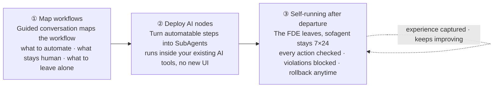
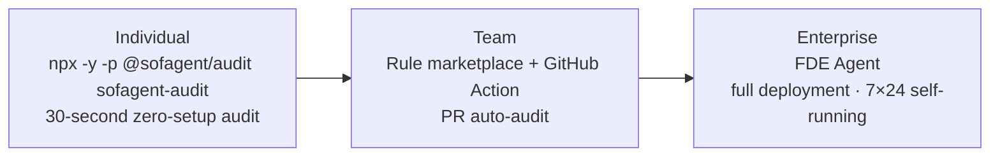

<p align="center">
  
</p>

<p align="center">
  <a href="https://github.com/KongFangXun/sofagent/actions/workflows/verify.yml"></a>
  <a href="./LICENSE"></a>
  <a href="./CHANGELOG.md"></a>
</p>

<p align="center">
  <a href="README.md">中文</a> · <a href="#what-is-this">What is this</a> · <a href="#fde-methodology">FDE Methodology</a> · <a href="#quick-start">Quick Start</a> · <a href="#three-entries-from-30-seconds-to-full-deployment">Three Entries</a> · <a href="#why-sofagent">Why</a> · <a href="#docs">Docs</a> · <a href="https://github.com/KongFangXun/sofagent">⭐ Star</a>
</p>

---

## What is this

**sofagent is an open-source FDE Agent** (Forward Deployed Engineer Agent) — it comes in and maps your business workflows, turning the automatable steps into AI nodes. Once delivery is complete, the FDE departs while the AI nodes keep running 7×24 on their own — every action is audited, out-of-bounds moves are blocked, and anything that breaks can be rolled back.

> 📌 sofagent ships on [ClawHub](https://clawhub.ai) as an **FDE Skill** (a methodology skill that helps FDEs do FDE work), and once installed on enterprise devices it runs long-term as a **constraint-layer engine** (auditing + rollback + injection + daemon monitoring).

> 📊 **Why now**: MIT NANDA Lab's *The GenAI Divide* report shows that over the past three years, global enterprises burned $30–40 billion on generative AI, yet **95% of projects failed to produce value worth putting on a financial statement**. Meanwhile, job postings for a role called "Forward Deployed Engineer" (FDE) surged **729%** year-over-year (Indeed 2025 data). Models are no longer scarce — the scarce thing is people who can embed models into real customer operations. sofagent is the open-source substrate that engineers this. (Data verification and cross-agency calibration: see [VALIDATION §1 · Cost of governance gaps](./docs/VALIDATION.md#治理缺口的代价三项联网核验证据); FDE economics: see [VALIDATION §4](./docs/VALIDATION.md#四市场印证行业判断被市场买单).)



> 🏞️ Big vendors hand you "water" (the LLM) and a "riverbed" (the Agent platform), but the water is raw — you wouldn't dare drink it straight. sofagent is the engineering that makes the river water usable across a whole city: the dam stops floods, the treatment plant turns raw water into drinking water, and the pipe network delivers it to every faucet. The model provides 90% of the intelligence; sofagent adds the 10% of reliable execution.

### How is this different from a bare Agent

| Dimension | Bare Agent (ChatGPT / Copilot) | sofagent |
|:-----|:------|:------|
| Change auditing | None | 24 rules on git diff, hard-evidence verdicts |
| Out-of-bounds blocking | Relies on prompt self-discipline | Violations blocked on the spot + audit trail |
| Rollback after breakage | Manually dig through commits | One-click snapshot restore to any point |
| Experience accumulation | Starts from zero every time | Auto-captured into knowledge base, evolution capabilities under continuous iteration |

## Key Features

**FDE Agent delivery**

- 🧭 **Map workflows on-site** — five-element deep-dive + three-question triage, mapping out every process step and calculating what each AI node is worth
- 🤖 **Deploy AI nodes** — three-layer deliverables (documents + Skills + runtime), running inside your existing AI tools; from "you do the work" to "you delegate the work"
- 🏠 **Stays resident after departure** — the FDE Agent stays for inspection, audit, and optimization, 7×24 online; the human leaves, governance doesn't

**Governance guarantees**

- 🔍 **Zero-setup audit** — `npx -y -p @sofagent/audit sofagent-audit`, audits your last commit in any git repo in 3 seconds
- 🧱 **24 audit rules** — secret leaks, out-of-scope edits, injection defense, privilege red lines — judged on hard git diff evidence, violations blocked on the spot
- 🛡️ **Automatic snapshot & rollback** — auto-archived after every audit, one-click restore to any snapshot

## FDE Methodology

Many companies adopt AI the wrong way around — they pick models, build platforms, and buy Agents first, only to find nobody uses them. The problem isn't the technology; it's that **they haven't figured out their own business processes before handing them to AI**.

Most tools teach you how to build Agents; sofagent first answers **where AI should go** — turning the five-element deep-dive and three-question triage from guesswork into a repeatable methodology:

| Phase | What happens | Deliverable |
|------|--------|------|
| ① Map | **Five-element deep-dive** — for each process step, capture input / output / owner / time cost / pain points | Enterprise profile |
| ② Triage | **Three-question triage** — which steps fit AI: 🔄 automate · ⚡ augment · 👤 leave alone, prioritized by ROI | Node plan + annual savings |
| ③ Deliver | **Three-layer deliverables** — documents + Skills + runtime, so AI nodes actually run | Ontology + workflow.yml + skills/ |

Full methodology (four phases, twelve steps) in [FDE/GUIDE.md](./FDE/GUIDE.md) — a half-day read, enough to run FDE independently afterwards.

## FDE Skill System

Deploying AI nodes is only step one — above we covered **how to map and where to place them**; next is **how to keep them on track every time**. The FDE Skill system loaded with each node solves this:

- 📜 **SKILL.md** — the single entry point, loaded by your AI tool: routes to the matching stage sub-Skill, and auto-injects job specs by task type (mapping / audit / orchestration)
- 🧩 **Stage sub-Skills** — a five-step closed loop: entry → discovery → quantify → deliver → exit (`01-entry` → `05-exit`), with every step's tasks and deliverables defined upfront
- 🔒 **Harness constraint skeleton** — entry-gate / fde-template / engage / loop-check / task-closure…, a constraint template for every step from entry to departure
- 🧬 **Automatic experience capture** — think.md reflection + knowledge maintenance; lessons from every task flow into the knowledge base automatically, with evolution capabilities under continuous iteration

> What gets deployed is not a bare Agent, but an **Agent with a constraint skeleton** — constraints are advisory, audits are mandatory: the Agent may ignore the constraints, but every change gets audited without exception.

## Product Preview

<p align="center">
  
</p>

<p align="center"><sub>Dashboard cockpit: rule pass rate, audit tasks, violation trends — see at a glance what the AI is doing. After install, run <code>sofagent-dashboard --full</code> to launch</sub></p>

## Quick Start

**30 seconds, zero setup** — run an audit in any git repo:

```bash
npx -y -p @sofagent/audit sofagent-audit
```

> 💡 `sofagent-audit` is the quick read-only audit (audits the last commit, safe and side-effect-free by default); `sofagent-audit-full` is the full audit and requires an explicit operation (e.g. `--diff <range>` / `--init`).

Here's what it looks like when a known-format secret leak is blocked (real output):

> ℹ️ Rule A2 detects known formats: AWS AKIA, OpenAI sk-*, GitHub ghp_, PEM private keys, etc.; generic secret shapes (bare `password=`, `secret` values) are intentionally out of scope — conservative design to avoid false positives. See [LIMITATIONS A2](./docs/LIMITATIONS.md#a2-密钥检测局限编码与格式绕过v125-披露).

<p align="center">
  
</p>

**Full install** (Node.js ≥ 18, download and review before running):

```bash
curl -fsSL https://raw.githubusercontent.com/KongFangXun/sofagent/main/bootstrap.sh -o bootstrap.sh
less bootstrap.sh          # review the script first, confirm it's safe
bash bootstrap.sh && rm bootstrap.sh
sofagent-audit --init      # install the git hook — every commit is audited from now on
sofagent-audit --doctor    # verify the environment (optional)
```

> 💡 All install scripts only write to `~/.sofagent/` and never touch system files. `--no-verify` can bypass the local hook — sofagent guards against honest Agents' carelessness, not deliberate bypass; for high-security scenarios add `sofagent-audit --diff` on the CI side as a backstop. See [LIMITATIONS](./docs/LIMITATIONS.md).

More install options (clone install / full npx install / minimal install / enterprise deployment) in [HANDBOOK](./docs/HANDBOOK.md). Enterprise users who just want the FDE methodology for mapping workflows, see [FDE/README.md](./FDE/README.md) (zero dependencies, no Node.js needed).

## Three Entries, from 30 Seconds to Full Deployment

No need to commit to the full package up front — start with a 30-second trial, then go deeper if it's useful:



| Entry | What it does | Time needed |
|------|--------|:----:|
| **`npx -y -p @sofagent/audit sofagent-audit`** | Zero-setup audit of the last commit, results in 3 seconds | 30 sec |
| **`--ruleset` rule marketplace** | Load rulesets like security, or use custom JSON rules | 1 min |
| **GitHub Action** | Auto-audit every PR, violations annotated on the diff lines | Set up once |
| **FDE Agent** | Map workflows on-site → deploy AI nodes → 7×24 self-running | FDE residency |

**Rule marketplace**:

```bash
npx -y -p @sofagent/audit sofagent-audit --list-rulesets      # see available rulesets
npx -y -p @sofagent/audit sofagent-audit --ruleset security   # load the security ruleset
```

Community rulesets are published as `sofagent-ruleset-*` npm packages and auto-discovered once installed; `--ruleset-path` can also point to your own JSON rules.

**FDE Agent** — on-site mapping + deployment + residency, pick either of two paths:

- **Methodology path** (zero dependencies): read [FDE/GUIDE.md](./FDE/GUIDE.md) and map workflows manually following the handbook — Excel + your own brain is enough
- **Tooling path** (Node.js ≥ 18): after installing, tell your AI tool "run an FDE diagnosis for me" and the Agent guides you from the entry phase

## Why sofagent

| Dimension | Generic Agent frameworks | sofagent |
|------|----------------|----------|
| Core question | How to build an Agent | **Where AI should go** (map first, then deploy) |
| Safety guarantee | Relies on prompt constraints | git diff hard-evidence audit + runtime interception + one-click rollback |
| Knowledge accumulation | Starts from zero | Experience auto-captured into knowledge base, continuously optimized |
| Data sovereignty | Cloud-hosted | Local by default, optional federated queries |
| Deployment | Learn a new platform | Runs inside your existing AI tools (Claude Code / Cursor / WorkBuddy…) |

## Evidence & Credibility

> 🔬 **Independent external evidence** (not an official self-test): Joel Niklaus' harness-optimization research ([research code repository](https://github.com/JoelNiklaus/harness-optimization), data in the repo experiments) shows that with the same model and unchanged weights, optimizing only the outer harness lifted a legal-Agent benchmark from **63.4% → 80.1% (+16.7pp)**. See [THANKS.md](./docs/THANKS.md).

> 🧪 **Engineering credibility**: 2235 tests / 12 packages (all green, verified via `tools/test-count.sh`) · 24 audit rules · fresh-eyes independent review continuously running (review tooling at [FORGE/playbook/fresh-eyes-review.md](./FORGE/playbook/fresh-eyes-review.md)).

> 🧠 **v1.3.4 new capabilities** (grouped by theme):
> - **L3 Organizational Capability Market**: 🏪 Five-ring loop (publish → discover → invoke → rate → maintain) · 6 market MCP tools (publish / search / invoke / rate / retire / harvest_rule) · ranking formula trust × rating × log(invocations+1)
> - **SkillScan Security Gate**: 🛡️ Static scan on both publish & install sides · three-state verdict (SAFE / SUSPICIOUS / DANGEROUS) · reuses skillopt scan engine, no duplication
> - **Three-Step Evaluation System**: 📊 Harvest rules from real cases (rule-harvest) → Benchmark as judge (rule-jury) → promote rules (rule-promote, evidence triple)
> - **Orchestration/Execution Separation**: 🔌 ExecutionBackend interface + DSH execution backend (rc version guard, auto-fallback to LangGraph) · FORGE drivers migrated
> - **Market Audit Trace**: 📜 DecisionKind adds MARKET (dedicated audit type for market actions) · daemon dual inspection (daily catalog L1 + weekly health L2)
> See [v1.3.4 devlog](./docs/changelog/v1.3/v1.3.4.md). Earlier versions in [CHANGELOG](./CHANGELOG.md).

## Docs

| You want to know | Where |
|:---------|:--------|
| How to install, use, FAQ | [HANDBOOK](./docs/HANDBOOK.md) |
| Architecture (constraint layer · injection chain · evolution · 24 rules) | [ARCHITECTURE](./docs/ARCHITECTURE.md) |
| Design philosophy | [PHILOSOPHY](./docs/PHILOSOPHY.md) |
| Industry validation & ecosystem positioning (differences from existing tools) | [VALIDATION](./docs/VALIDATION.md) |
| Version roadmap | [ROADMAP](./docs/ROADMAP.md) |
| What each version delivered | [CHANGELOG](./CHANGELOG.md) |
| FDE diagnostic methodology (four phases, twelve steps) | [FDE/GUIDE.md](./FDE/GUIDE.md) |
| Security statement · known limitations | [SECURITY](./SECURITY.md) · [LIMITATIONS](./docs/LIMITATIONS.md) |
| Contribution guide | [CONTRIBUTING](./CONTRIBUTING.md) |

---

<p align="center">
  Issues and PRs welcome, especially the nitpicky kind · <a href="./CONTRIBUTING.md">Contributing</a> · <a href="./docs/THANKS.md">Thanks</a><br/>
  <sub>MIT License © <a href="https://github.com/KongFangXun/sofagent">Kong Fangxun</a> · <a href="https://github.com/KongFangXun/sofagent">⭐ If sofagent helps you, star it and help more people find it</a></sub>
</p>