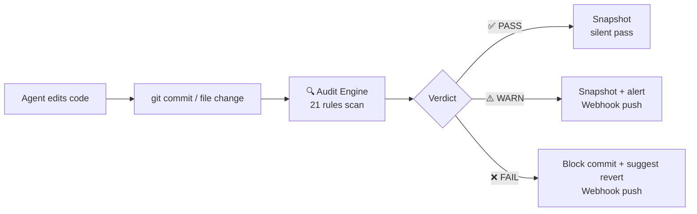
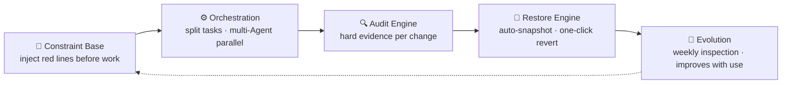

# sofagent

> 🌐 [中文 →](README.md) | English

<p align="center">
  <a href="https://sofagent.ai">
    
  </a>
</p>

<p align="center">
  <strong>sofa + agent = sofagent</strong><br/>
  <em>The dashcam + seatbelt for AI Agents.</em>
</p>

<p align="center">
  <a href="https://github.com/KongFangXun/sofagent/actions/workflows/verify.yml"></a>
  <a href="./LICENSE"></a>
  <a href="./CHANGELOG.md"></a>
  <a href="#install"></a>
</p>

---

## What problem does it solve

The smarter the Agent, the less companies dare to let go — when something goes wrong, who's accountable? Can it be stopped? Can it be rolled back?

**sofagent is a Harness middleware for AI Agents**: every time an Agent finishes writing code or files, a rule engine scans automatically — violations are blocked on the spot, compliant changes get snapshotted. What was changed is what was changed, no denying it. Zero token cost — pure regex engine, no LLM calls.

```bash
npm install -g @sofagent/audit @sofagent/core && sofagent-audit --init
```

> [!NOTE]
> Requires Node.js ≥ 18 + bash + git. macOS / Linux fully supported, Windows experimental.

<details>
<summary>🚀 Three-step first experience (click to open)</summary>

```bash
# 1. See the rules — agents carry these red lines
sofagent-audit --help | head -5

# 2. Run an audit — --init installed a pre-commit hook, so every commit is scanned by A1
echo "API_KEY=sk-123456" > .env && git add -f .env && GIT_EDITOR=true git commit -m "test"
# → ⛔ A1 sensitive files: .env contains key pattern, commit blocked (never lands)

# 3. Check snapshots — auto-saved after every audit
sofagent-audit --timeline

# Cleanup (A1 blocked the commit, so nothing landed)
git rm --cached -f .env 2>/dev/null; rm -f .env
```
</details>

---

## 30-second version



sofagent is a **Harness middleware** — no matter what Agent you use (Claude Code / Codex / Cursor / WorkBuddy) or what model, it hooks into the git commit node and audits with hard git diff evidence. **Platform-agnostic, zero-intrusion, zero tokens**.

> 💡 **An agent that works ≠ a model + a prompt** — it's a multi-layer skeleton (config / knowledge / instruction / validation / orchestration). sofagent is the Harness layer (the rebar + quality inspector), not a smarter model. We operate at the **Harness Engineering** inflection (2025-2026): scaffolding agents with tools / permissions / sandboxes / rules.
>
> 📖 来源：31 篇行业笔记跨批研读（2026-07-20）

> 🏞️ **The "one river" analogy**: Big vendors build the river and supply the water (AI platform = river, model = water); we build the **dam + pipe network + faucet** — the constraint layer (keeps water from flooding the city) + Workflow (routes capability to the business) + Subagent (where capability actually acts). We let enterprises safely run their own AI capability into their business. See [FDE/FDE.md §9.6](./FDE/FDE.md#96-river企业统一-agent-入口).

---

## Why not existing tools

| Tool | What it checks | What sofagent checks |
|------|---------|----------------|
| pre-commit / husky | Code quality (lint / format) | **Agent behavior** (secret leaks / out-of-scope edits / injection attacks / blind edits) |
| detect-secrets / gitleaks | Secret scanning | Secrets are just A2; sofagent has 20 more rules for Agent failure modes |
| Cursor Rules / Claude Code hooks | Single-platform IDE constraints | Platform-agnostic — any Agent + git repo |
| AgentLoop (SaaS) | Runtime trajectory observation | **What changed** (git diff hard evidence, local, MIT open source) |

> 💡 **Core difference**: existing tools check "is the code written well"; sofagent checks "did the Agent behave well" — out-of-scope edits, knowledge base cross-domain, process compliance, blind edits without reading first. These are LLM-Agent-specific failure modes that generic lint tools don't cover.

---

## 21 rules (4 categories)

**Default rules (13, active on install)**:

| Category | Rules | What they block |
|------|------|--------|
| 🔴 **Secret security** | A1 sensitive files · A2 secret leaks | `.env` / `*.pem` commits, hardcoded API keys |
| 🟡 **Behavior boundaries** | A3 out-of-scope · A4 config deletion | Editing files outside task scope, deleting configs |
| 🟠 **Injection defense** | A9 injection · A10 malicious sources | Prompt injection patterns, unofficial source deps |
| 🔵 **Process compliance** | A5 empty message · A7 blind edit · A8 skip tests · A19 message quality | Empty commit msg, edit-without-read, skip tests, low-quality msg |
| ⚪ **Engineering quality** | A6 build break · A11 resource abuse · A18 junk files | Build config anomalies, oversized files, temp file commits |

**Extended rules (8, opt-in)**: A14 KB cross-domain · A15 blind action · A16 unauthorized file change · A17 abnormal batch change · E1-E4 (test files / undeclared TODO / mass deletion / low comment ratio).

<details>
<summary>📋 Full rule table (21 rules, with detection logic)</summary>

| Rule | Detection | Severity | Class |
|------|------|:--:|------|
| A1 sensitive files | `.env` / `*.pem` / `id_rsa` / key files modified | FAIL | business baseline |
| A2 secret leaks | API Key / Token / Password patterns in code | FAIL | business baseline |
| A3 out-of-scope | Modified file path doesn't match task description | WARN | business baseline |
| A4 config deletion | Config file deleted | FAIL | business baseline |
| A5 empty message | Empty or placeholder commit message | WARN | business baseline |
| A6 build break | Build config file abnormally changed | WARN | capability crutch |
| A7 blind edit | Modified file has no read record | FAIL/WARN | capability crutch |
| A8 skip tests | Build file changed but no test record | FAIL/WARN | capability crutch |
| A9 injection | Command injection risk patterns in code | FAIL | business baseline |
| A10 malicious sources | Dependency blacklist detection | WARN | business baseline |
| A11 resource abuse | Resource abuse (oversized files, etc.) | WARN | business baseline |
| A18 junk files | Temp-file-pattern junk files | WARN | capability crutch |
| A19 message quality | Message hits blacklist or too short | FAIL | business baseline |
| A14 KB cross-domain | Accessing KB pages outside workflow scope | WARN | capability crutch |
| A15 blind action | workflow.yml node has no declared actions | FAIL | capability crutch |
| A16 unauthorized change | Files modified outside workflow scope | FAIL | engineering norm |
| A17 batch change | File change count exceeds threshold | WARN | engineering norm |
| E1 test files | Test files committed to production dirs | WARN | capability crutch |
| E2 undeclared TODO | New TODO not declared in task | WARN | capability crutch |
| E3 mass deletion | Deletion line count exceeds threshold | WARN | capability crutch |
| E4 low comment ratio | >200 new lines with <5% comments | WARN | capability crutch |

**Rule classes**: business baseline (violation breaks delivery integrity) · capability crutch (helps Agent follow correct flow) · engineering norm (code engineering quality baseline).
</details>

---

## One base · Four engines

sofagent isn't just audit — the full form is a Harness middleware with "one base + four engines":



| Engine | What it does | Status |
|------|--------|:--:|
| 🧭 Constraint Base | Injects rules into Agent context before work starts (SKILL.md + fde.md + think.md + knowledge/) | ✅ stable |
| ⚙️ Orchestration | Splits big tasks, multi-Sub-Agent parallel, A/B compare to pick best | ✅ stable (needs `@sofagent/orchestrator`) |
| 🔍 Audit Engine | Runs 21 rules on every git commit / file change, blocks + logs violations | ✅ stable (`@sofagent/audit` standalone) |
| 🔄 Restore Engine | Auto git snapshot after every audit, one-click revert on violation | ✅ stable |
| 🧬 Evolution | FDE weekly inspection of audit trends + reflection logs | ⚠️ experimental |

> 💡 **Minimum usage**: just install `@sofagent/audit` for pure audit (21 rules + snapshot + revert). Install all 5 packages for the full Harness middleware.

<details>
<summary>📖 Engine details (click to open)</summary>

### 🧭 Constraint Base

Injects rules into Agent context before work starts — so it knows where the red lines are. Four-layer loading chain: SKILL.md (constitution) → fde.md (enterprise rules) → think.md (historical pitfalls) → knowledge/ (auto-accumulated). v1.0.7+ Sub Agents self-load on startup (`buildConstrainedSystemPrompt`), independent of any Agent platform's Skill system.

### ⚙️ Orchestration Engine

Splits big tasks, runs multi-Sub-Agents in parallel, A/B compares for better solutions. Uses DeepAgents (OpenClaw orchestration fully retired since v1.0.7). CLI entry `sofagent-orchestrator compose --task` — **any Agent platform can use the orchestration engine**. A/B auto-switch: promote only after 2 consecutive wins, old version kept as fallback before switch.

### 🔍 Audit Engine

Auto-scans on every git commit or file change — Agent edits code → git commit/daemon detects → audit engine rules judge → violation blocked+logged / compliant released → think.md auto-reflection. Of the 21 rules, 16 are pure git-diff (don't need Agent cooperation), 4 are hybrid (A7/A8/A14/A15 need Agent logs), 1 is filesystem (A17 abnormal batch change). v1.0.8+ embeds isomorphic-git + daemon file monitoring, **audits without git commit**.

### 🔄 Restore Engine (essentially: git snapshot + revert wrapper)

Auto-snapshots after every audit — pushes notification + suggests rollback on violation:

| Result | Auto action | What user sees |
|------|---------|------------|
| ✅ PASS | Auto-snapshot | Silent |
| ⚠️ WARN | Snapshot + mark | daemon-notice.md alert + optional Webhook |
| ❌ FAIL | Snapshot + suggest rollback | Webhook push + terminal red |

### 🧬 Evolution Engine (experimental)

⚠️ A/B auto-promote is based on `consecutiveWins ≥ threshold` + `overallImprovement` guard, eval scoring relies on LLM self-grading (self-grading bias exists). May mis-promote in narrow eval scenarios — for production, recommend manual review of promote decisions. Two modes: `deploy` (first deployment / major business change) + `sustain` (weekly auto / manual trigger inspection).

</details>

---

## Your scenario → what to install

| Your scenario | Install |
|---------|--------|
| Just block secret leaks / Agent out-of-scope | `@sofagent/audit` + `@sofagent/core` (minimum) |
| Full-lifecycle Agent governance (constraint + audit + revert) | + `@sofagent/daemon` (file monitoring) |
| Multi-Agent collaboration / workflow orchestration | + `@sofagent/orchestrator` (orchestration engine) |
| Let MCP Client call audit capability | + `@sofagent/mcp` (MCP Server) |

### Two deployment node types

| Node | Scenario | Needs OpenClaw |
|------|------|:--:|
| 🔄 Auto-run node | Enterprise unattended device (server / old computer) | Yes |
| ⚡ Personal augmentation node | Developer using WorkBuddy / Codex / Claude Code | No |

> 💡 Personal augmentation node: clone repo → `npm install -g @sofagent/audit @sofagent/core` → `sofagent-audit --init` → go.

---

## Install

```bash
# Minimum install (pure audit)
npm install -g @sofagent/audit @sofagent/core

# Full install (one base · four engines)
git clone https://github.com/KongFangXun/sofagent.git
bash sofagent/scripts/install.sh
```

**Standalone packages on demand**:

| Package | Purpose |
|------|------|
| `@sofagent/audit` | Audit engine (21 rules, git diff hard evidence) |
| `@sofagent/core` | Runtime diagnostics (doctor / verify) |
| `@sofagent/orchestrator` | Orchestration engine (multi-Agent collaboration) |
| `@sofagent/daemon` | Daemon process (file monitoring / scheduled inspection) |
| `@sofagent/mcp` | MCP Server (JSON-RPC 2.0) |

**Uninstall**:

```bash
npm uninstall -g @sofagent/audit @sofagent/core @sofagent/orchestrator @sofagent/daemon @sofagent/mcp
rm -f .git/hooks/commit-msg .git/hooks/post-commit
```

---

## Enterprise deployment: FDE + Work模板市场

sofagent isn't just a developer tool — enterprise deployment uses the **FDE Toolkit** + **Work模板市场**:

- **FDE Toolkit** (`FDE/`): Frontline Deployment Engineer four-phase onboarding (map → mine → deliver → leave) — turns enterprise workflows into AI nodes, FDE leaves after deployment, AI nodes run themselves. See [FDE/FDE.md](./FDE/FDE.md).
- **Work模板市场** (`work模板市场/`): Industry workflow template repo — outer Graph skeleton locks the full chain + inner nodes keep ReAct flexibility. Ships with a manufacturing accounts-payable template. See [work模板市场/](./work模板市场/).

> 💡 **Naming convention**: Uppercase dirs (`FDE/`, `LOOP/`, `work模板市场/`) = standalone products, optional; lowercase dirs (`sofagent/`, `docs/`, `tools/`) = core code and config.

---

## Measured impact

> [!NOTE]
> 🔬 **Hugging Face benchmark**: same model, harness-only optimization — legal-agent score jumped from 3.5% to 80.1% (76-point gain, at ~1/7 the cost of Claude Sonnet). [Details](./docs/THANKS.md)

| Dimension | Data |
|------|------|
| Audit engine | 21 rules fully covered, `npm test` green (700+ cases), 0 token cost |
| Platform coverage | git commit audit (developers) + daemon file audit (non-developers) |
| License | MIT (code / docs / templates — use freely) |

---

## Further reading

| Want to learn | Where |
|---------|--------|
| Install, usage, FAQ | [HANDBOOK](./docs/HANDBOOK.md) |
| Why designed this way | [ARCHITECTURE](./docs/ARCHITECTURE.md) |
| Design philosophy | [PHILOSOPHY](./docs/PHILOSOPHY.md) |
| Security statement | [SECURITY](./SECURITY.md) |
| Known limitations | [LIMITATIONS](./LIMITATIONS.md) |
| Version roadmap | [ROADMAP](./ROADMAP.md) |
| Contributing | [CONTRIBUTING](./CONTRIBUTING.md) |

---

## Contributing & thanks

Issues and PRs welcome, especially the nitpicky kind. [CONTRIBUTING.md](./CONTRIBUTING.md) · [Thanks](./docs/THANKS.md)
