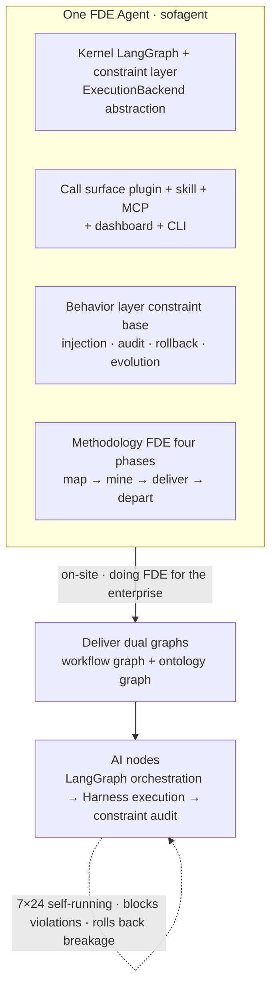
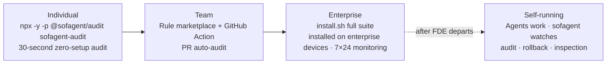

<p align="center">
  
</p>

<p align="center">
  <a href="https://github.com/KongFangXun/sofagent/actions/workflows/verify.yml"></a>
  <a href="./LICENSE"></a>
  <!-- ⚠️ bump version: manually sync this badge version (Version-vX.Y.Z) -->
  <a href="./CHANGELOG.md"></a>
</p>

<p align="center">
  <a href="README.md">中文</a> · <a href="#what-is-this">What is this</a> · <a href="#quick-start">Quick Start</a> · <a href="#fde-methodology">FDE Methodology</a> · <a href="#three-entries-from-30-seconds-to-full-deployment">Three Entries</a> · <a href="#why-sofagent">Why</a> · <a href="#docs">Docs</a> · <a href="https://github.com/KongFangXun/sofagent">⭐ Star</a>
</p>

---

## What is this

**sofagent is an open-source FDE Agent** (Forward Deployed Engineer Agent) — map workflows, deploy AI nodes, and audit every change 7×24, blocking out-of-bounds moves and rolling back breakage. It ships on [ClawHub](https://clawhub.ai/kongfangxun/skills/sofagent) as an **FDE Skill** (a methodology skill that helps everyone at SMBs and OPCs become the FDE of their own business), and once installed on enterprise devices it runs long-term as a **constraint-layer (Harness) engine** (injection · audit · rollback · evolution, with the daemon as its resident carrier).

> 🏗️ **Product shape = one FDE Agent** (encapsulation lands in v1.4.0 as planned; current v1.3.x is constraint layer + LangGraph kernel): sofagent is not a single entry-point agent, but the **wrapper that turns an agent kernel into an FDE Agent** — LangGraph + constraint layer as the kernel (ExecutionBackend abstraction, extensible to other agent runtimes; DeepSeek Harness is an optional commercial-side kernel, not delivered in this open-source repo, see below), plugin + skill + MCP + CLI + dashboard as the full call surface, and the constraint base (injection · audit · rollback · evolution) + FDE methodology as the behavior layer. The wrapped whole is one FDE Agent: it maps workflows on-site, deploys AI nodes, and keeps running 7×24 after handoff, with every action audited.
>
> 🔄 **Self-bootstrapping**: its first FDE job is sofagent itself — the project itself is one FDE workflow (map → nodes → dual-graph delivery), and the training engine also orbits FDE (making FDE better, spinning the data flywheel).



> 🏞️ Big vendors hand you "water" (the LLM) and a "riverbed" (the Agent platform), but the water is raw — you wouldn't dare drink it straight. sofagent is the engineering that makes the river water usable across a whole city: the dam stops floods, the treatment plant turns raw water into drinking water, and the pipe network delivers it to every faucet. The model provides 90% of the intelligence; sofagent adds the 10% of reliable execution.

### How is this different from a bare Agent

| Dimension | Bare Agent (ChatGPT / Copilot etc.) | sofagent |
|:-----|:------|:------|
| Change auditing | Roll your own pre-commit + gitleaks/detect-secrets toolchain (general-purpose scanners, broad coverage) | 24 rules on git diff, hard-evidence verdicts aimed at Agent behavior, works out of the box |
| Out-of-bounds blocking | Assemble the hooks yourself | Violations blocked on the spot + audit trail |
| Rollback after breakage | Manually dig through commits | One-click snapshot restore to any point |
| Experience accumulation | Starts from zero every time | Auto-captured into the knowledge base (think.md + Dream Cycle + skillopt live); effect requires sustained iteration in real use |

> ℹ️ The comparison dimensions are based on capability differences, not aimed at any specific product; general-purpose scanners/frameworks (pre-commit / gitleaks / detect-secrets, etc.) complement sofagent rather than oppose it.

> ℹ️ **Honest boundary**: general-purpose secret scanners ([gitleaks](https://github.com/gitleaks/gitleaks) / detect-secrets) do **full-history scans** with broader pattern libraries ([gitleaks official pattern library, 100+ rules](https://github.com/gitleaks/gitleaks/tree/master/config)); sofagent auditing focuses on **hard evidence from the current diff + Agent behavior auditing** (out-of-scope/injection/privilege dimensions scanners don't cover). They complement rather than replace each other — for strict secret-compliance scenarios, use both.
>
> ⚠️ **Honest boundary**: currently a single-machine, single-user design — multiple Agents share one knowledge base / audit history; multi-person / multi-department sharing requires tenant isolation (ROADMAP v1.4.7 G7). Task logs (task/logs) are written in plaintext, containing task summaries / code snippets / API response summaries / conversation summaries — static encryption currently covers the audit history main chain, not task/logs; read [SECURITY](./SECURITY.md) before enterprise deployment.

## Key Features

**FDE Agent delivery**

- 🧭 **Map workflows on-site** — five-element deep-dive + three-question triage, mapping out every process step and calculating what each AI node is worth
- 🤖 **Deploy AI nodes** — three-layer deliverables (documents + Skills + runtime), running inside your existing AI tools; from "you do the work" to "you delegate the work"
- 🏠 **Stays resident after departure** — the FDE Agent stays for inspection, audit, and optimization, 7×24 online; the human leaves, governance doesn't

**Governance guarantees**

- 🔍 **Zero-setup audit** — `npx -y -p @sofagent/audit sofagent-audit`, audits your last commit in any git repo in seconds (measured on: Apple Silicon macOS, warm cache — ~1.1s per quick run, ~6.1s for a 50k-line diff; single-machine reference figures, not benchmarks; first npx download takes ~30s)
- 🧱 **24 audit rules** (quick runs 17 by default out of the box; the full 24 = 17 default + 7 extensions enabled via config, requiring `--init` to install hooks and enter the full engine) — secret leaks, out-of-scope edits, injection defense, privilege red lines — judged on hard git diff evidence, violations blocked on the spot
- 🛡️ **AgentShield five-face config scanner** (since v1.3.7, deterministic static analysis · zero LLM self-eval) — statically scans five faces: MCP risk (mcp-risk) / hook injection (hook-injection) / Agent config (agent-config) / enhanced secrets (secret-enhanced) / shadow AI (shadow-ai), complementing the 24 git-diff rules (see [SECURITY](./SECURITY.md))
- 🛡️ **Automatic snapshot & rollback** — auto-archived after every audit, one-click restore to any snapshot

## Quick Start

> ⚠️ **Enterprise users read first** [LIMITATIONS §3](./docs/LIMITATIONS.md) — `config.yml` is **non-fail-closed by default** (rules can be bypassed by Agent tampering), and multi-tenant isolation is not yet landed. For strict-compliance scenarios use CI fallback + file-permission lock (`chmod 444 .sofagent/config.yml`); do not put the single-machine default config directly into production.

**30 seconds, zero setup** — run an audit in any git repo (dev/testing scenarios; for strong-compliance scenarios read [LIMITATIONS §3](./docs/LIMITATIONS.md) first — plaintext storage and multi-tenant isolation are known limitations):

```bash
npx -y -p @sofagent/audit sofagent-audit
```

> 💡 `sofagent-audit` is the quick read-only audit (audits the last commit, safe and side-effect-free by default); `sofagent-audit-full` is the full audit and requires an explicit operation (e.g. `--diff <range>` / `--init`).
>
> ⚠️ **Scope of quick mode**: quick is a zero-setup fast audit running the **17 default rules** (A3 task-scope / A9 commit-msg injection detection is active — quick mode auto-reads the latest commit message; when no commit message is available, A9 is handled by the engine as no-input (marked skipped); rules needing logs fall back to degraded verdicts; **the 7 extension rules are not loaded by default** — the full 24 = 17 default + 7 extension). For full protection (commit-msg injection blocking + scope checks + hook auto-audit) run `--init` to install the git hooks and enter the full engine. See [LIMITATIONS](./docs/LIMITATIONS.md).

Here's what it looks like when a known-format secret leak is blocked (real output):

> ℹ️ Rule A2 detects known formats: AWS AKIA, OpenAI sk-*, GitHub ghp_, PEM private keys, etc.; generic secret shapes (bare `password=`, `secret` values) are intentionally out of scope — conservative design to avoid false positives. See [LIMITATIONS A2](./docs/LIMITATIONS.md#a2-密钥检测局限编码与格式绕过v125-披露).

<p align="center">
  
</p>

<p align="center"><sub>v1.3.x example output</sub></p>

**Full install** (Node.js ≥ 18, download and review before running):

```bash
curl -fsSL https://raw.githubusercontent.com/KongFangXun/sofagent/refs/tags/v1.3.9/bootstrap.sh -o bootstrap.sh
less bootstrap.sh          # review the script first, confirm it's safe
bash bootstrap.sh && rm bootstrap.sh
sofagent-audit --init      # install the git hook — every commit is audited from now on
sofagent-audit --doctor    # verify the environment (optional)
```

> 💡 All install scripts only write to `~/.sofagent/` and never touch system files. `--no-verify` can bypass the commit-msg audit — it guards against honest Agents' carelessness, not malicious bypass; skipped commits are reconciled afterwards by the post-commit hook (when the audit trail matches, it flags "suspected bypass", re-checkable via `--verify-commit <SHA>`), but does **not block**. Personal developers have three fallbacks: run `sofagent-audit --diff` on the CI side, run `--doctor` periodically, and review the audit records. See [LIMITATIONS](./docs/LIMITATIONS.md).
>
> 📌 **install.sh is the enterprise device installer** — install it on the server/computer running the AI nodes, where it acts as the Agent's monitoring constraint layer (audit + rollback + injection + daemon inspection + single-machine dashboard). FDEs do not need to run install.sh on their own machines — the FDE's tools are [FDE Skill](https://clawhub.ai/kongfangxun/skills/sofagent) (the methodology). See [deployment architecture](./docs/ARCHITECTURE.md#安装包边界与部署架构v132-定位校准).
>
> 📌 **How bootstrap.sh and install.sh relate**: bootstrap.sh is a one-line download wrapper around install.sh — `curl bootstrap.sh | bash` is equivalent to "download install.sh + run install.sh". Both scripts install exactly the same thing; bootstrap just saves you the manual clone/download step.

More install options (clone install / full npx install / minimal install / enterprise deployment) in [HANDBOOK](./docs/HANDBOOK.md). Enterprise users who just want the FDE methodology for mapping workflows, see [FDE/README.md](./FDE/README.md) (zero dependencies, no Node.js needed; for the 15-minute shortest path see its "15-minute shortest path" section).

## FDE Methodology

Many companies adopt AI the wrong way around — they pick models, build platforms, and buy Agents first, only to find nobody uses them. The problem isn't the technology; it's that **they haven't figured out their own business processes before handing them to AI**.

Most tools teach you how to build Agents; sofagent first answers **where AI should go** — turning the five-element deep-dive and three-question triage from guesswork into a repeatable methodology:

| Phase | What happens | Deliverable |
|------|--------|------|
| ① Map | **Five-element deep-dive** — for each process step, capture input / output / owner / time cost / pain points | Enterprise profile |
| ② Triage | **Three-question triage** — which steps fit AI: 🔄 automate · ⚡ augment · 👤 leave alone, prioritized by ROI | Node plan + annual savings |
| ③ Deliver | **Three-layer deliverables** — documents + Skills + runtime, so AI nodes actually run | Ontology + workflow.yml + skills/ |

Full methodology (four phases, twelve steps) in [FDE/GUIDE.md](./FDE/GUIDE.md) — a half-day read, enough to run FDE independently afterwards.

> 💾 **Don't rush off after deployment**: once a single node's workflow (the Agent's capability) is defined with LangGraph, burn it straight onto a USB drive via DSH (DeepSeek Harness execution backend — an optional commercial-side component, not delivered in this open-source repo) — the USB drive becomes a node, a key: plug it into any machine and it just runs (unplug for zero residue). The open-source default execution backend is LangGraph; DSH is a commercial enhancement. See [HANDBOOK · USB one-click burn](./docs/HANDBOOK.md#近期版本新功能速览).

## FDE Skill System

Deploying AI nodes is only step one — above we covered **how to map and where to place them**; next is **how to keep them on track every time**. The FDE Skill system loaded with each node solves this:

- 📜 **SKILL.md** — the single entry point, loaded by your AI tool: routes to the matching stage sub-Skill, and auto-injects job specs by task type (mapping / audit / orchestration)
- 🧩 **Stage sub-Skills** — a five-step closed loop: entry → discovery → quantify → deliver → exit (`01-entry` → `05-exit`), with every step's tasks and deliverables defined upfront
- 🔒 **Harness constraint skeleton** — entry-gate / fde-template / engage / loop-check / task-closure…, a constraint template for every step from entry to departure
- 🧬 **Automatic experience capture** — think.md reflection + knowledge maintenance; lessons from every task flow into the knowledge base automatically, with evolution capabilities under continuous iteration

> What gets deployed is not a bare Agent, but an **Agent with a constraint skeleton** — constraints are advisory, audits are mandatory: the Agent may ignore the constraints, but every change gets audited without exception.

## Product Preview

<p align="center">
  
</p>

<p align="center"><sub>Dashboard cockpit (single-file HTML): rule pass rate, audit tasks, violation trends — see at a glance what the AI is doing.<br>Screenshot shows v1.2.9; current release is v1.3.9.</sub></p>

> 📊 **The Dashboard has three entries, each in its place**:
>
> | Entry | Command | Form | Who it's for |
> |------|------|------|--------|
> | **Terminal** | `sofagent-dashboard --full` | Terminal ASCII three-pane (zero frontend dependencies) | Developers / FDE quick check |
> | **Web** | `sofagent web` (works right after install) · dev-mode `node tools/dashboard/serve-dashboard.mjs` | Browser visualization (localhost:3780) | Boss / IT visual review |
> | **macOS double-click** | Double-click `start-dashboard.command` | macOS shortcut to the Web version (macOS double-click entry only) | macOS users |
>
> ⚠️ **The Dashboard is an ops panel for existing users, not a first-time experience entry.** Its data source is the audit records under `~/.sofagent/data/` — without having run `sofagent-audit` there is no data (the Web version falls back to sample data). First time here? Run `npx -y -p @sofagent/audit sofagent-audit` in your project first — the Dashboard only shows real data after that.

> 👁️ **Agent's view: how audit results appear** — once hooks are installed, every commit triggers an audit: PASS is silent (auto-snapshot archived), while violations/blocks print the result directly in the Agent's terminal output (the "blocks a .env commit" terminal screenshot above is real blocking output), plus Webhook / IM push per the [fde.md config](./docs/HANDBOOK.md). There is no separate GUI on the Agent side — audit results are presented via terminal / IM push (see [PHILOSOPHY §2 · Capabilities users perceive](./docs/PHILOSOPHY.md#用户感知到的能力)).

## Three Entries, from 30 Seconds to Full Deployment

No need to commit to the full package up front — start with a 30-second trial, then go deeper if it's useful:



| Entry | What it does | Where installed | Time needed |
|------|--------|--------|:----:|
| **`npx -y -p @sofagent/audit sofagent-audit`** | Zero-setup audit of the last commit, results in seconds (first npx ~30s) | Any git repo (temporary) | 30 sec |
| **`--ruleset` rule marketplace** | Load rulesets like security, or use custom JSON rules | Same as above | 1 min |
| **GitHub Action** | Auto-audit every PR, violations annotated on the diff lines | CI/CD | Set up once |
| **install.sh full suite** | injection · audit · rollback · evolution + daemon inspection + dashboard — the Agent's complete constraint layer | **Enterprise device** (server/computer running the AI nodes) | FDE residency |

**Access-model comparison** (same engine, three install granularities — pick by scenario):

| Access model | Command | Lifecycle | Best for |
|--------------|---------|-----------|----------|
| npx temporary | `npx -y -p @sofagent/audit sofagent-audit` | use-and-go, downloaded each time | quick audit of any repo, one-off checks outside CI |
| npm install (in-project) | `npm install @sofagent/audit` (project devDependency) | installed with project, version locked in package-lock | team projects with fixed deps, reproducible audits |
| npm install -g (global) | `npm install -g @sofagent/audit` | globally available, install once call many | daily audit across local repos, daemon residency |

sofagent supports composable rulesets (**rule marketplace**) — a built-in security ruleset plus community-published ruleset packages. With 24 audit rules built in (quick runs 17 by default, the 7 extensions enabled via config), loading extra rulesets extends audit coverage:

**Rule marketplace**:

```bash
npx -y -p @sofagent/audit sofagent-audit --list-rulesets      # see available rulesets
npx -y -p @sofagent/audit sofagent-audit --ruleset security   # load the security ruleset
```

Community rulesets are published as `sofagent-ruleset-*` npm packages and loaded manually via `--ruleset-path` (auto-discovery of installed npm packages is not supported yet); `--ruleset-path` can also point to your own JSON rules.

**FDE Agent** — on-site mapping + deployment + residency, pick either of two paths:

- **Methodology path** (zero dependencies): read [FDE/GUIDE.md](./FDE/GUIDE.md) and map workflows manually following the handbook — Excel + your own brain is enough
- **Tooling path** (Node.js ≥ 18): after installing, tell your AI tool "run an FDE diagnosis for me" and the Agent guides you from the entry phase

## New in v1.3.9

> 🔍 **v1.3.9 new capabilities** (official AST rule engine + meta-harness unified orchestration + AI worklog data layer + API tiering governance + FORGE on DSH + MLflow evaluation + Agentic Browser + cross-platform adapters + toolchain subdirectories + attribution/sandbox/daemon):
> - **Official AST rule engine**: 🔍 `sofagent-ruleset-ast` semantic rule engine (8+2 rule checks = 8 general semantic rules "no dynamic code execution / hardcoded secrets / dynamic require / debugger / child_process shell control / SQL concatenation / http plaintext endpoint / empty catch" + 2 OWASP "ASI01 target hijacking + ASI04 supply-chain SBOM", same pipeline as the v1.2.9 plugin)
> - **meta-harness unified orchestration**: 🧩 multi-harness policy enforcement at the infrastructure layer + cross-session collaboration (19 tests + DSH shape alignment)
> - **AI worklog data layer**: 📊 `worklog` — by Agent / Workflow / week + human-intervention records (reuses audit + decision-log + LLM Trace, zero new data) + `worklog_query` MCP
> - **API tiering governance**: 🔬 explicit `@public`/`@internal` tiers (1444 symbols) + CI gate baseline — breaking changes to `@internal` never affect adapters
> - **FORGE driver on DSH**: ⚙️ explicit backend selection (`SOFAGENT_FORCE_DSH` enable + CLI bridge + full bash permission) — execution backend switchable from LangGraph to DSH
> - **MLflow agent evaluation**: 📈 13 metrics + LLM-as-Judge integration
> - **Agentic Browser**: 🌐 4 tools (navigate/click/form/screenshot) + visual degradation fallback
> - **Cross-platform adapters**: 🧭 Cursor/Codex/Gemini CLI thin mounts (AGENTS.md homomorphic)
> - **Toolchain subdirectories**: 🗂️ `tools/` physically split into `check/`/`gen/`/`forge/`/`release/` + references fully synced
> - **ATTRIBUTION attribution engine**: 🏷️ decision-attribution persistence + 3-dimension query (metric/decision/agentId) + byAgent join (P2 auxiliary)
> - **Dream Sandbox audit**: 🏖️ stage isolation + mandatory human-approval merge (approver required) + path-traversal sanitization + 24h cleanup (P2 auxiliary)
> - **>5MB diff gap fix**: 🩹 spill to disk + 64MB readback + truncation locator
> - **FORGE driver process guard**: 🔄 daemon self-detach + watcher heartbeat monitoring / death-cause audit / auto-resume
>
> See [v1.3.9 devlog](./docs/changelog/v1.3/v1.3.9.md). Earlier versions in [CHANGELOG](./CHANGELOG.md).

## Why sofagent

| Dimension | Generic Agent frameworks | sofagent |
|------|----------------|----------|
| Core question | How to build an Agent | **Where AI should go** (map first, then deploy) |
| Safety guarantee | Integrate scanning/gate tools yourself (pre-commit / trufflehog / gitleaks etc.) | git diff hard-evidence audit + runtime interception + one-click rollback out of the box (see the "honest boundary" note above on scanner coverage) |
| Review model | Manual human review (bottleneck) | **Machine review** — 24 rules auto-audit + git diff hard evidence; even fully autonomous AI nodes get reviewed |
| Knowledge accumulation | Starts from zero | Auto-captured into the knowledge base (think.md + Dream Cycle live); effect requires sustained iteration in real use |
| Data sovereignty | Cloud-hosted | Local by default, optional federated queries (user-configured cloud sync = data leaves the machine, see SECURITY) |
| Deployment | Learn a new platform | Runs inside your existing AI tools (Claude Code / Cursor / WorkBuddy…) |

> ℹ️ **Platform-agnostic boundary**: the core engine (audit / constraint layer) is platform-agnostic; automatic hook injection currently works only on OpenClaw — on other platforms, inject constraints manually and auditing works as usual.

## Evidence & Credibility

> 📊 **Why now**: MIT NANDA Lab's *The GenAI Divide* report shows that over the past three years, global enterprises burned $30–40 billion on generative AI, yet **95% of projects failed to produce value worth putting on a financial statement**. Meanwhile, job postings for a role called "Forward Deployed Engineer" (FDE) surged **729%** year-over-year (Indeed 2025 data). Models are no longer scarce — the scarce thing is people who can embed models into real customer operations. sofagent is the open-source substrate that engineers this. (Data verification and cross-agency calibration: see [VALIDATION §1 · Cost of governance gaps](./docs/VALIDATION.md#治理缺口的代价三项联网核验证据); FDE economics: see [VALIDATION §4](./docs/VALIDATION.md#四市场印证行业判断被市场买单).)

> 🔬 **Independent external evidence** (not an official self-test): Joel Niklaus' harness-optimization research ([research code repository](https://github.com/JoelNiklaus/harness-optimization), data in the repo experiments) shows that with the same model and unchanged weights, optimizing only the outer harness lifted a legal-Agent benchmark from **63.4% → 80.1% (+16.7pp)**. See [THANKS.md](./docs/THANKS.md).

> 🧪 **Engineering credibility**: 2903 tests / 13 packages (12 with tests) (test counts are determined by `tools/check/test-count.sh` (with a built-in flaky retry mechanism); running `npm test` directly may show mcp package timeouts (red) on low-memory machines — re-running that package alone passes, an environment concurrency issue, not a product defect) · 24 audit rules · fresh-eyes independent review continuously running (see [docs/guides/review-system.md](./docs/guides/review-system.md) for how the review system works). Performance figures are single-machine reference values; cross-tool benchmarking is scheduled for v1.4.x together with Benchmark integration.

## Docs

| You want to know | Where |
|:---------|:--------|
| **Global index** (one entry to all docs, in Chinese) | [WIKI](./docs/WIKI.md) |
| How to install, use, FAQ | [HANDBOOK](./docs/HANDBOOK.md) |
| Architecture (constraint layer · injection chain · evolution · 24 rules) | [ARCHITECTURE](./docs/ARCHITECTURE.md) |
| Design philosophy | [PHILOSOPHY](./docs/PHILOSOPHY.md) |
| Industry validation & ecosystem positioning (differences from existing tools) | [VALIDATION](./docs/VALIDATION.md) |
| Version roadmap | [ROADMAP](./docs/ROADMAP.md) |
| What each version delivered | [CHANGELOG](./CHANGELOG.md) |
| FDE diagnostic methodology (four phases, twelve steps) | [FDE/GUIDE.md](./FDE/GUIDE.md) |
| Security statement · known limitations | [SECURITY](./SECURITY.md) · [LIMITATIONS](./docs/LIMITATIONS.md) |
| Contribution guide | [CONTRIBUTING](./CONTRIBUTING.md) |

---

<p align="center">
  Issues and PRs welcome, especially the nitpicky kind · <a href="./CONTRIBUTING.md">Contributing</a> · <a href="./docs/THANKS.md">Thanks</a><br/>
  <sub>MIT License © <a href="https://github.com/KongFangXun/sofagent">Kong Fangxun</a> · <a href="https://github.com/KongFangXun/sofagent">⭐ If sofagent helps you, star it and help more people find it</a></sub>
</p>
