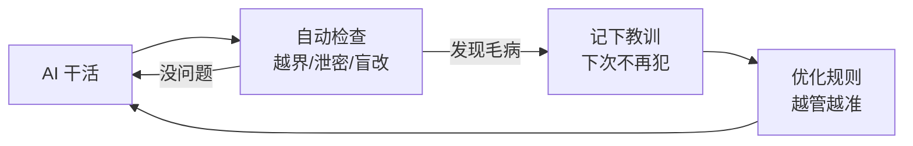
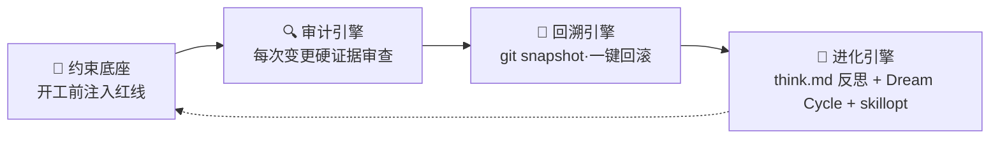

# sofagent

> 🌐 [English →](README.en.md) | 🇨🇳 中文

<p align="center">
  <a href="https://sofagent.ai">
    
  </a>
</p>

<p align="center">
  <strong>FDE（Forward Deployed Engineer）Agent——梳理工作流 · 部署 AI 节点 · 审计每次变更 · 沉淀经验</strong>
</p>

> **sofagent 是一个 FDE Agent**——进场帮你梳理工作流，把能自动化的环节变成 AI 节点，部署后 7×24 自己跑。AI 每次干活都自动受检查（越界就告警、出事能回滚、干了啥看得见），经验自动沉淀，越用越好。
>
> ⚠️ **「越用越好」当前状态（v1.2.8）**：进化引擎骨架已搭通，但尚未全自动闭环——think.md 反思需 MCP/CLI 手动触发、Dream Cycle 为轻量内存态（持久化计划 v1.3.0）、skillopt 需外部 CLI。完整「自动越用越好」闭环为 v1.3.x 目标，详见下方「引擎状态」表。

<p align="center">
  <a href="https://github.com/KongFangXun/sofagent/actions/workflows/verify.yml"></a>
  <a href="./LICENSE"></a>
  <a href="./CHANGELOG.md"></a>
  <a href="#快速开始"></a>
</p>

<p align="center">
  <a href="#这是什么">这是什么</a> · <a href="#快速开始">快速开始</a> · <a href="#延伸阅读">文档</a> · <a href="https://github.com/KongFangXun/sofagent">⭐ Star</a>
</p>

---

## 这是什么

**你的 AI 越能干，你越不敢放手**——它写错了代码、泄漏了机密、改乱了文件，你都不知道。真出事了，谁负责？能拦住吗？能回滚吗？

sofagent 就是解决这个问题的：**它帮你把 AI 管起来，让 AI 干活，你只负责把关。**

具体来说，它做这些事：

| 你担心的 | sofagent 怎么做 | 用人话说 |
|---------|----------------|---------|
| **想让 AI 自动跑？** | 先梳理你的工作流，把能自动化的环节变成 AI 节点，部署完自己跑 | 从"你干活"变成"你派活"——AI 节点 7×24 自己跑 |
| **AI 乱来怎么办？** | 每次 AI 改东西都自动检查一遍 | AI 干的活有人盯着，越界立即告警 |
| **AI 闯祸了怎么办？** | 每次改动自动存档，一键回滚 | 出事能一键回到安全状态 |
| **换了 AI 工具/模型怎么办？** | 不挑平台——Claude、GPT、自建模型都能管 | 换模型不影响防护 |
| **越用越好吗？** | AI 每次干活的经验自动沉淀，定期巡检优化规则（⚠️ v1.2.8 部分自动——详见首屏状态说明） | 它越用越懂你的业务 |

**🏞️ 打个比方：一条河**——大厂给你"水"（大模型）和"河床"（Agent 平台），但水是原水，你不敢直接喝。sofagent 是**堤坝 + 自来水厂 + 管网 + 水龙头**：

- **堤坝**——不让水泛滥（约束 AI 不乱来）
- **自来水厂**——把原水变成直饮水（安全沙箱 · 完整沙箱 v1.4.0 规划中，当前以审计拦截替代）
- **管网 + 水龙头**——把水送到该去的地方（管道约束）

简单说：**让 AI 从"能用"变成"敢用"。**

> 🎯 **90/10 价值分层**：模型给 90% 的智力，sofagent 补 10% 的可靠执行——越往后这 10% 越值钱。不是造更聪明的模型，是给已有的聪明加一套闸门。

> 🔬 **外部独立实验证据**（非 sofagent 官方自测）：HuggingFace 上 Joel Niklaus 的 harness-optimization 研究显示，同一模型不改权重、仅优化外层 Harness，法律 Agent 基准从 **63.4% → 80.1%（+16.7pp）**（提升全部来自外层机制）。这是同类约束机制有效性的外部证据。详见 [THANKS.md](./docs/THANKS.md)。

<details>
<summary>🔄 它怎么"越用越好"？（点开看闭环）</summary>



AI 每次被拦下的毛病、每次成功的经验，都沉淀成"教训库"——下次干活自动避开。这就是它越用越懂你业务的原因。

</details>

<details>
<summary>🔧 技术细节（给开发者）</summary>

底层是 **Harness 中间件**——每次 Agent 改完代码自动跑审计规则，违规当场拦截、合规存快照。四个要点：

- **审计规则结构**：24 条注册 = 17 条默认启用 + 7 条扩展（需显式开启），其中 9 条基线不可禁用
- **零 token 审计核心**：git diff 硬证据——19/24 条纯 git-diff + 1 条 filesystem（不依赖 Agent 配合）；4 条 hybrid 规则需 Agent 日志配合
- **渐进式加载**：核心铁律层（core-rules.md ~30 行）始终注入 + 岗位规范按 task type 按需追加；四层加载链骨架（SKILL.md → fde.md → think.md → knowledge/）在 Agent 启动时通过 Hook 自动注入（Agent 可不遵守约束，但审计会拦——约束是建议性的，审计是强制性的）
- **审计拦截路径**：审计拦截在所有路径生效；反思生成（think.md）仅 MCP/CLI 路径触发

完整架构见 [ARCHITECTURE.md](./docs/ARCHITECTURE.md)。

</details>

### 怎么知道 AI 在干什么？

两种面板一眼看清：数据去哪了（有没有偷偷外传）、AI 犯规了吗（有没有越权）、任务跑到哪了（是活的还是挂了）：

**🖥️ HTML Dashboard（网页版，推荐）**——6 页可视化控制台，全部真实数据驱动：驾驶舱（实时指标）· FDE 引导 · AI 节点 · 本体结构 · 知识库 · 工具箱（安装·架构·审计规则·MCP·npm·文档·FORGE）。

**一键启动**：macOS 用户直接双击仓库根目录的 [`start-dashboard.command`](./start-dashboard.command)（自动开浏览器，关窗口即停）。

```bash
node tools/serve-dashboard.mjs    # 命令行启动（跨平台，自动打开浏览器）
# → http://localhost:3780
```

> 打开方式：通过服务器打开才能读到 `~/.sofagent/data` 的实时数据（浏览器安全限制）。Chrome/Edge 用户也可在页面里点「连接数据目录」直接选目录，免服务器。静态打开 HTML 仅显示示例数据。

**💻 终端面板（bash）**——轻量、零依赖（需 jq）：

```bash
sofagent-dashboard           # 看当前状态
sofagent-dashboard --watch   # 实时刷新（看护审查时用）
sofagent-dashboard --full    # 展开完整视图
```

> 前置依赖：需要 `jq`（`brew install jq` / `apt install jq`）。

### 从交付到自转（激活链）

FDE 交付了本体结构（ontology）+ workflow.yml + skills/ 之后，v1.2.5 起分四步让交付物自己跑起来：

| 阶段 | 做什么 | 版本 |
|------|--------|:----:|
| **ACTIVATE** | 读交付物 → 注册企业 SubAgent | v1.2.5 ✅ |
| **ORCHESTRATE** | 构建企业专属工作流图（Phase 2 前半：映射表+注册扩展 / Phase 2 后半：enterprise-graph） | v1.2.6-v1.2.7 ✅ |
| **EXECUTE** | 运行 + 人工确认 + 每步审计 | v1.2.8 ✅ · v1.2.9 🔨 |
| **SUSTAIN** | 持续优化，越跑越好 | v1.3.0 📋 |

设计详情：[激活链文档](./docs/guides/fde-activation-chain.md)

### v1.2.8 新增了什么？

> 🆕 一键安装、环境自检修复、上下文压缩、目标驱动……完整清单见 [CHANGELOG.md](./CHANGELOG.md)。

---

## 快速开始

装完后，你在自己的 AI 工具（WorkBuddy / Codex / Claude Code）里说一句话，sofagent 就开始干活。不用学新界面——用你熟悉的对话方式就行。

| 你是… | 第一步 | 需要什么 |
|------|------|------|
| **企业用户** | 打开仓库内的 [FDE 引导目录](./FDE/README.md) → 对话引导你梳理工作流 | 零依赖、不需要 Node.js |
| **企业批量部署（USB 烧录）** | `sofagent-daemon create-usb-key --role "节点名" --target /Volumes/XXX --platform macos` | 已装 daemon + 一个 U 盘 |
| **开发者** | `bash install.sh` → `sofagent-audit --init` → 装 git hook 审计 | Node.js ≥ 18 + git |

> **前提**：开发者路径请在 git 仓库根目录下执行。如果还没有仓库，先运行 `git init`。
>
> 🔒 **安全提示**：`curl | bash` 会执行远程脚本。建议先审查脚本内容再执行：`curl -fsSL https://raw.githubusercontent.com/KongFangXun/sofagent/main/bootstrap.sh | less`，确认无误后再运行安装命令。脚本只写入 `~/.sofagent/` 目录，不修改系统文件。

```bash
# 方式 1：一行安装（v1.2.7 新增 · 推荐）
curl -fsSL https://raw.githubusercontent.com/KongFangXun/sofagent/main/bootstrap.sh | bash

# 方式 2：完整安装（clone + install.sh）
git clone https://github.com/KongFangXun/sofagent.git && cd sofagent
bash install.sh          # 安装（自动检测 shell 配置文件，装完新开终端或 source）
sofagent-audit --init    # 初始化（装 git hook）
sofagent-audit --doctor  # 验证环境是否就绪（可选但推荐）
```

> 💡 如果 `sofagent-audit` 仍然提示 command not found，请**新开一个终端窗口**再试。
> 💡 **不需要装引擎？** 如果你只需要 FDE 方法论（给 Agent 装治理 Skill），直接看 [FDE/README.md](./FDE/README.md)——零依赖，不需要 Node.js。
> 💡 **下一步**：安装完成后，运行 `sofagent-audit --doctor` 检查环境状态，或查看 [项目导航索引（WIKI）→](./docs/WIKI.md)

### 其他安装方式（可选）

| 方式 | 谁用 | 怎么用 |
|------|------|--------|
| 🚀 **npx 零安装** | 快速体验 / CI 环境 | `npx @sofagent/audit@latest --init`（即装即用，不需下载）。⚠️ npx 会缓存旧版本，加 `@latest` 确保拉取最新版 |
| ⚡ **install.sh 最小安装** | 开发者 / 企业 IT | `bash install.sh --base-only`（仅底座引擎） |

> [!NOTE]
> - **要求**：Node.js ≥ 18 + bash + git
> - **平台**：macOS / Linux 全功能，Windows 实验性
> - **终端版 Dashboard**：依赖 jq（macOS `brew install jq` · Linux `apt install jq` / `yum install jq`）；HTML 网页版不需要 jq

<details>
<summary>🚀 装完三步体验</summary>

> ⚠️ 需在 git 仓库中运行（`git init` 初始化一个）。

```bash
# 0. 初始化——装 git hook，让审计引擎能拦截 commit
sofagent-audit --init

# 1. 看可用命令
sofagent-audit --help

# 2. 跑审计——第 0 步的 --init 已装好 pre-commit hook，每次 commit 都被拦
# GIT_EDITOR=true 让 git commit 不弹编辑器（CI/自动化场景常用）
echo "API_KEY=sk-123456" > .env && git add -f .env && GIT_EDITOR=true git commit -m "add env config"
# → ⛔ A1 不碰敏感：.env 含密钥格式，提交被拦截（不会真的落库）

# 3. 看快照——每次审计后自动存档
sofagent-audit --timeline

# 演示完清理
git rm --cached -f .env 2>/dev/null; rm -f .env
```
</details>

> ⚠️ **关于 commit 拦截与诚实边界**：`git commit --no-verify` 可以绕过本地 hook——sofagent 的设计初衷是"诚实 Agent 的护栏"，防的是**诚实 Agent 的疏忽**（漏提交密钥、越界改动），不是恶意 Agent 的蓄意绕过（hook 可绕，CI 不可绕）。企业高安全场景请在 CI/CD pipeline 侧再加一道 `sofagent-audit --diff` 审计兜底。详见 [LIMITATIONS](./docs/LIMITATIONS.md) §一·已知架构限制。

**按需安装**：

| 包 | 用途 |
|------|------|
| `@sofagent/audit` | 审计引擎（24 条规则，git diff 硬证据）|
| `@sofagent/core` | 运行时诊断（doctor / verify）|
| `@sofagent/orchestrator` | 任务编排引擎（LOOP 流水线 + 任务编排；注：面向用户的任务编排由 Agent 平台完成，sofagent 在其过程中提供约束/审计/经验沉淀）|
| `@sofagent/daemon` | 守护进程（文件监控 / 定时巡检）|
| `@sofagent/mcp` | MCP Server（JSON-RPC 2.0）|

> 💡 卸载：`npm uninstall -g @sofagent/audit` + 清理其余全局包 + `rm -f .git/hooks/commit-msg .git/hooks/post-commit`

⚠️ **数据存储说明**：sofagent 当前版本将审计数据以 Markdown 明文存储在 `~/.sofagent/data/`。内置加密（age）计划在 v1.4.0 引入。在生产环境使用前，建议：
- macOS：将 `~/.sofagent/` 放在 APFS 加密卷中
- Linux：使用 LUKS 加密分区挂载 `~/.sofagent/`
- 详见 [SECURITY.md](./SECURITY.md#已知风险明文存储)

---

## 为什么不是现有工具

| 工具 | 它们管什么 | sofagent 管什么 |
|------|:--------|:----------------|
| AI Agent 平台（OpenClaw 等）| 让 AI「会做事」 | 让 AI「每次都做对、出事能负责」 |
| 企业 AI 咨询服务 | 一次性交付，人走茶凉 | 工具 + 常驻，可复用、可维护 |
| 代码检查工具（pre-commit 等）| 查「代码写得好不好」 | 查「AI 行为对不对」（越界/泄密/盲改）|

一句话：**现有工具查代码，sofagent 查 AI 的行为**——密钥泄漏、越界改文件、盲目修改，这些是 AI 特有的闯祸方式，通用工具不管。

<details>
<summary>🔧 与技术工具的具体差异（给开发者）</summary>

| 工具 | 它们管什么 | sofagent 管什么 |
|------|:--------|:----------------|
| detect-secrets / gitleaks | 密钥扫描（全量历史 + 100+ 模式）| A2 覆盖常见 API key；差异化 = **Agent 行为审计**而非密钥覆盖率 |
| Cursor Rules / Claude hooks | 单平台 IDE 约束 | 审计层全平台可用（git diff）；约束层按平台分层（OpenClaw 最深 → WorkBuddy SKILL → 其他种子指令）|

> ⚠️ **对比快照时间戳**：以上对比基于 2026-08-02 各工具的公开能力快照；工具迭代快，条款可能过时。差异化的核心论点（sofagent 审计「AI 行为」而非「代码质量」）不随工具版本变化。

</details>

<details>
<summary>📦 FDE 离场后，企业留下五样东西</summary>

前四样是资产，第五样是让前四样一直活着的 FDE Agent 本身——sofagent 留在客户那里继续跑：

| 交付物 | 说明 |
|--------|------|
| 交付手册 | 企业 IT 可独立维护的操作手册 |
| AI 节点 | 在跑的 Agent，自动执行日常任务（财务对账、审计巡检、数据分析…）|
| AI 知识库 | 持续积累的实体、概念、对比页（Dream Cycle 自动沉淀）|
| 私有化评估体系 | eval 反馈 + Skill 迭代历史——无法复制的企业 IP |
| **FDE Agent 本身** | 控制层常驻——管审计 / 约束 / 知识的生命周期，人离场了它留下 |

</details>

### 与同类方案的区别

| 维度 | sofagent | LangSmith | Guardrails AI |
|------|----------|-----------|---------------|
| 定位 | Agent 行为约束层（约束+审计+经验沉淀） | LLM 可观测性平台 | LLM 输出校验 |
| 部署 | 本地优先、零云依赖 | SaaS | 库集成 |
| 核心能力 | git hook 审计 + 规则拦截 + 约束注入（在 Agent 平台编排过程中提供审计/约束/沉淀） | trace/eval | 输出格式约束 |
| 适用场景 | 企业 AI 治理合规 | 开发调试 | 单点输出校验 |

---

## 部署规模（企业 IT 参考）

| 部署规模 | 并发 Agent | CPU | 内存 | 磁盘 | 适用场景 |
|---------|:---:|:---:|:---:|:---:|---------|
| 个人 / 小团队 | 1-3 | 1 核 | 512 MB | 500 MB | 单人开发，git commit hook 审计 |
| 中型团队 | 5-10 | 2 核 | 1 GB | 2 GB | 多人协作，daemon 常驻 + webhook 推送 |
| 企业级 | 10+ | 4 核 | 2 GB | 5 GB+ | 多仓库联邦，A/B 审查 + 知识库 + Dashboard |

> **资源消耗说明**：
> - **磁盘**：`~/.sofagent/data/`（审计历史 + 快照 + 知识库，日均 ~5 MB/仓库）
> - **内存**：daemon 常驻进程（~50 MB）+ Node.js 运行时（~200 MB/并发 Agent）
> - **网络**：仅 LLM API 出站，无入站端口需求

---

## 延伸阅读

| 你想了解 | 看哪里 |
|:---------|:--------|
| 🖥️ Dashboard（HTML 网页版 + 终端版） | [↑ 怎么知道 AI 在干什么](#怎么知道-ai-在干什么) · 或直接打开仓库根目录 [`dashboard.html`](./dashboard.html) |
| FDE 诊断方法论（四阶段十二步） | [GUIDE.md](./FDE/GUIDE.md) |
| 🔗 激活链设计（交付物→自动运转） | [激活链设计文档](./docs/guides/fde-activation-chain.md) |
| 怎么装、怎么用、常见问题（企业用户） | [HANDBOOK](./docs/HANDBOOK.md) |
| 引擎架构、24 条规则、内部机制 | [↓ 引擎架构（开发者段）](#engine-architecture) |
| 为什么这么设计 | [ARCHITECTURE](./docs/ARCHITECTURE.md) |
| 设计哲学 | [PHILOSOPHY](./docs/PHILOSOPHY.md) |
| 行业印证与生态定位 | [VALIDATION](./docs/VALIDATION.md) |
| 安全声明（含数据存储说明） | [SECURITY](./SECURITY.md) |
| 已知局限 | [LIMITATIONS](./docs/LIMITATIONS.md) |
| 版本路线图 | [ROADMAP](./docs/ROADMAP.md) |
| 项目导航索引（AI 用） | [WIKI](./docs/WIKI.md) |
| 贡献指南 | [CONTRIBUTING](./CONTRIBUTING.md) |

> 🧭 **第一次来？按身份选路**
> - **想用起来**（企业用户 / 业务负责人）→ [HANDBOOK](./docs/HANDBOOK.md)：怎么装、怎么派活、常见问题
> - **想懂它怎么工作**（架构师 / 技术决策者）→ [ARCHITECTURE](./docs/ARCHITECTURE.md)（设计）→ [PHILOSOPHY](./docs/PHILOSOPHY.md)（理念）
> - **想动手贡献或集成**（开发者）→ [↓ 引擎架构段](#engine-architecture) → [DEVELOPMENT](./docs/DEVELOPMENT.md)（开发指南）

> ⚖️ **正式版边界**：「正式版」指 API 稳定、测试覆盖完整，**不代表所有已知局限已解决**。详见 [LIMITATIONS.md](./docs/LIMITATIONS.md) · [SECURITY.md](./SECURITY.md)。

---

<details>
<summary>🔧 引擎架构（开发者段——非开发者 3 屏内无需展开）</summary>

## <a id="engine-architecture"></a>引擎架构（开发者段）

> [!NOTE]
> **品牌与描述**：**sofagent** 是产品品牌名；**FDE Agent** 是对它核心形态的描述——sofagent 本质上是一款 FDE Agent（进场梳理工作流、把可自动化环节变成 AI 节点、构建本体结构、常驻值守）。底层技术实现是一套约束 Agent 行为的 Harness 中间件，开源在 `@sofagent/*`。以下为开发者视角。

**双层架构：能力底座 × 生命周期**。层 1 能力底座 + 层 2 生命周期：

**层 1 · 能力底座 = 一底座·三引擎**
- **约束底座（一底座）**——开工前注入规则
- **审计引擎**——24 条规则拦截
- **回溯引擎**——自动快照回滚
- **进化引擎**——think.md 反思 + Dream Cycle 知识回灌 + skillopt Skill 优化

**层 2 · 生命周期 = 激活链四阶段**（v1.2.5+）：激活（ACTIVATE）→ 编排（ORCHESTRATE）→ 执行（EXECUTE）→ 持续（SUSTAIN）；在诊断（FDE）与进化（EVOLVE）两端延伸为**五阶段**：诊断 → 激活 → 编排 → 执行 → 进化。

> ⚠️ FORGE 自迭代工具链（LOOP 流水线）用于 sofagent 项目自身的开发迭代，面向用户的任务编排由 Agent 平台完成。

<details>
<summary>📖 一底座·三引擎架构（开发者参考）</summary>



> 下表 4 项 = 1 底座 + 3 引擎。

| 组件 | 作用 | 状态 |
|:------|:--------|:--:|
| 🧭 约束底座 | 开工前规则注入 Agent 上下文（SKILL.md + fde.md + think.md + knowledge/）| ✅ 稳定 |
| 🔍 审计引擎 | **FDE Agent 的审计引擎核心规则零额外 token**——24 条规则，每次 git commit / 文件变更触发，违规拦截+记录（19 条纯 git-diff + 1 条文件系统监控不调用 LLM，4 条混合规则需 Agent 日志）| ✅ 稳定 |
| 🔄 回溯引擎 | 每次审计后自动 git snapshot，违规一键回滚 | ✅ 稳定 |
| 🧬 进化引擎 | think.md 反思（⚠️ 仅 MCP/CLI 路径触发，git hook 路径不自动生成）+ Dream Cycle 知识回灌（🔧 轻量态）+ skillopt Skill 优化（⚠️ 需外部 SkillOpt CLI）| 🔧 部分可用 |

</details>

<details>
<summary>📖 引擎细节 + 24 条规则</summary>

### 🧭 约束底座

渐进式加载相关，三点：

- **渐进式加载**：核心铁律层（core-rules.md ~30 行）始终注入 + 岗位规范按 task type 按需追加
- **四层加载链骨架**（SKILL.md（宪法·不可改）→ fde.md（规范·可改）→ think.md（反思·自动生成）→ knowledge/（知识·自动积累））保留
- **自加载**：v1.0.7+ SubAgent 启动时自加载（`buildConstrainedSystemPrompt`），不依赖任何 Agent 平台的 Skill 系统

### ⚙️ FORGE 自迭代工具链（内部工具）

> ⚠️ FORGE LOOP 流水线（plan→engineer→audit→review→confirm）是 **sofagent 项目自身自迭代用的开发工具**（fresh-eyes-loop / release-gate-loop），不作为面向用户的编排引擎。真正的任务编排由你使用的 AI Agent 平台（WorkBuddy / Claude / Cursor 等）完成，sofagent 在编排过程中提供约束 + 审计 + 经验沉淀。

LOOP 内部使用 LangGraph StateGraph 组装节点流转 + 6 个内置工具（read/write/edit/bash/search/test）+ ToolGate 事前拦截。代码在 `@sofagent/orchestrator` 包中开源，供参考和二次开发。

### 🔍 审计引擎

审计引擎，四点：

- **规则构成**：24 条中 19 条纯 git-diff（不依赖 Agent 配合）、4 条混合（A7/A8/A14/A15 需 Agent 日志）、1 条文件系统（A17 异常批量变更）
- **不需要 commit 也能审计**：v1.0.8+ 自研 git-shadow diff 解析（isomorphic-git 风格，非内嵌第三方包）+ daemon 文件监控
- **跨设备扩展**：v1.1.8+ Prompt 注入防护（A9 扩展）+ 联邦查询加密，审计能力从本地扩展到跨设备
- **测试覆盖**：全 workspace **1562 测试 / 12 包**

**默认规则（17 条，装上就生效）**：

| 类别 | 规则 | 拦截什么 |
|------|------|--------|
| 🔴 密钥安全 | A1 敏感文件 · A2 密钥泄漏 | `.env` / `*.pem` 提交，硬编码 API Key |
| 🟡 行为边界 | A3 越界编辑 · A4 删配置 | 改任务范围外的文件，删配置 |
| 🟠 注入防御 | A9 注入 · A10 恶意来源 | 命令注入模式，非官方来源依赖，typosquatting |
| 🔵 流程合规 | A5 空消息 · A7 盲改 · A8 跳测试 · A19 消息质量 | 空 commit msg，不读就改，跳测试，低质量 msg |
| ⚪ 工程质量 | A6 破构建 · A11 资源滥用 · A18 垃圾文件 | 构建配置异常，超大文件，临时文件提交 |
| 🔴 安全红线 | A20 数据外传 · A21 持久化后门 · A22 权限提升 · A23 路径穿越 | curl 外传数据，LaunchAgent/systemd 后门，全权限 chmod，目录穿越序列 |

> 注：A3 越界编辑为**启发式告警（WARN）**——误报率较高，不硬拦截，避免误伤正常改动。其余规则按严重度分级拦截或记录。

**扩展规则（7 条，按需开启）**：A14 知识库跨域 · A15 盲动 · A16 非授权变更 · A17 异常批量（文件系统监控）· E1-E2/E4（测试文件 / 未声明 TODO / 低注释率）。完整 24 条规则表（含严重度、分级、判定逻辑）见 [engine/audit/README.md · 审计规则](./engine/audit/README.md#审计规则)。

### 🔄 回溯引擎

每次审计后自动 git snapshot（本质是对工作树的轻量快照，不是 git commit——不产生历史污染）。违规时推送通知 + 建议回滚。`sofagent-audit --revert <sha>` 一键回到任意快照。

### 🧬 进化引擎

进化引擎不是单一组件，而是三层闭环：

| 层 | 机制 | 状态 | 怎么跑 |
|------|------|:---:|------|
| **think.md 反思** | 每次审计自动写教训（哪个规则触发了、改了哪些文件、下次注意什么），Agent 下次启动时通过 harness 加载链读到——不犯同样的错 | ⚠️ 仅 MCP/CLI | MCP Server 与 sofagent-think CLI 触发；git hook 路径不自动生成（架构限制，audit 不反向依赖 think） |
| **Dream Cycle 知识回灌** | daemon 后台合成概念 → 回灌 skillopt 待优化队列，积累知识供后续优化周期消费 | 🔧 轻量态 | daemon 后台运行，当前为内存态队列（重启即丢），完整持久消费链路计划 v1.3.0 交付。⚠️ Dream Cycle **默认使用 MockLLM（确定性伪输出）**——接入真实 LLM 需配置 API Key |
| **skillopt Skill 优化** | 失败模式聚类（≥3 次同类失败）→ 自动触发外部 SkillOpt CLI 优化 Skill 质量 → 校验候选（行数 ±30% + 变化率 ≥5%）| ⚠️ 需外部依赖 | 需安装 [Microsoft SkillOpt](https://github.com/microsoft/SkillOpt)（`skillopt-sleep` CLI）。未安装时自动降级为仅记录失败清单，不执行优化 |

</details>

</details>

---

## 贡献与致谢

欢迎提 Issue 和 PR，尤其较真的那种。[CONTRIBUTING.md](./CONTRIBUTING.md) · [致谢](./docs/THANKS.md)

**作者**：[孔放勋](https://github.com/KongFangXun) · MIT License

---

<p align="center">
  <br/>
  <em>如果 sofagent 帮到你</em><br/><br/>
  <a href="https://github.com/KongFangXun/sofagent">⭐ Star · 让更多人看到</a>
</p>
