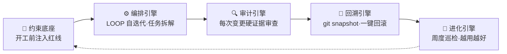

# sofagent

> 🌐 [English →](README.en.md) | 🇨🇳 中文

<p align="center">
  <a href="https://sofagent.ai">
    
  </a>
</p>

<p align="center">
  <strong>进场梳理 · 部署 AI 节点 · 离场后 7×24 自己跑</strong><br/>
  <em>让中小企业拥有把 AI 变成日常工作的能力。</em>
</p>

<p align="center">
  <a href="https://github.com/KongFangXun/sofagent/actions/workflows/verify.yml"></a>
  <a href="./LICENSE"></a>
  <a href="./CHANGELOG.md"></a>
  <a href="#装上就能用"></a>
</p>

<p align="center"><strong>当前版本：v1.2.0</strong> · 2026-07-24 · 物理结构大重构</p>

<p align="center">
  <a href="#这是什么">这是什么</a> · <a href="#sofagent-能帮你做什么">能帮你做什么</a> · <a href="#装上就能用">安装</a> · <a href="#引擎架构开发者段">引擎架构</a> · <a href="#延伸阅读">文档</a>
</p>

---

## 这是什么

企业不缺大模型与 Agent——缺的是把 AI 变成日常工作的能力。

**sofagent 做的就是这件事。** 它是一个 FDE Agent——进场梳理你的工作流，把能自动化的环节变成 AI 节点，部署到设备上，然后离场。离场后这些节点 7×24 自己跑，你留下的是一套能持续维护的 AI 化资产。

> [!NOTE]
> **两个名字，一个东西**：你面对的产品叫 **FDE Agent**（帮你梳理工作流、部署 AI 节点）；底层引擎叫 **sofagent**（开源仓库 + npm 包 `@sofagent/*`）。仓库名不改（8 版本已发布），但你对话时只需要记住 **FDE Agent**。

大厂造了江——LLM 是水，Agent 平台是河床。但企业不敢直接舀着喝。sofagent 做的是堤坝 + 自来水厂 + 管网 + 水龙头——帮每个人把原水变成直饮水。完整类比见 [ARCHITECTURE · River](./docs/ARCHITECTURE.md)。

> [!IMPORTANT]
> **实测数据**：Hugging Face 基准测试——同模型、纯 Harness 优化，legal-agent 得分从 3.5% 跳到 80.1%（76 分提升全来自外层机制），成本仅 1/7。

### 为什么不是现有工具

| 工具 | 它们管什么 | sofagent 管什么 |
|------|:--------|:----------------|
| pre-commit / husky | 代码质量（lint / format）| **Agent 行为**（密钥泄漏 / 越界编辑 / 注入攻击 / 盲改）|
| detect-secrets / gitleaks | 密钥扫描 | 密钥只是 21 条规则中的一条 |
| Cursor Rules / Claude hooks | 单平台 IDE 约束 | 平台无关——任何 Agent + git 仓库 |
| Agent 平台（OpenClaw 等）| Agent 调度——「会不会做」| Agent 治理——「能不能每次都做对」|

现有工具查"代码写得对不对"；sofagent 查"Agent 行为对不对"。这些是 LLM Agent 特有的失败模式，通用工具不覆盖。

<details>
<summary>📦 FDE 离场后，企业留下五样东西</summary>

前四样是资产，第五样是让前四样一直活着的 FDE Agent 本身——sofagent 留在客户那里继续跑：

| 交付物 | 说明 |
|--------|------|
| 交付手册 | 企业 IT 可独立维护的操作手册 |
| AI 节点 | 在跑的 Agent，自动执行日常任务（财务对账、审计巡检、数据分析…）|
| AI 知识库 | 持续积累的实体、概念、对比页（Dream Cycle 自动沉淀）|
| 私有化评估体系 | eval 反馈 + Skill 迭代历史——无法复制的企业 IP |
| **FDE Agent 本身** | 7×24 在跑——管上面四样东西的生命周期，人离场了它留下 |

**USB 一键烧录**——搭好 workflow → 烧一批 U 盘 → 发给团队。插上即用，拔掉零残留。

**三种部署方式，覆盖所有场景**：① 装电脑——技术人员正常安装；② U 盘——普通员工插上就能用，不需要安装、不需要专业知识；③ 无头设备——服务器/工控机插 U 盘别拔，Agent 一直在联邦里跑。企业叙事：「买 U 盘 → 下载 sofagent → 写盘 → 发给员工」。详见 [FDE/FDE.md](./FDE/FDE.md)。

</details>

---

## sofagent 能帮你做什么

| 你想解决什么 | sofagent 怎么做 |
|------|------|
| **想让 AI 自动跑日常任务** | 进场梳理工作流，把能自动化的环节变成 AI 节点，部署完自己跑 |
| **Agent 越界了怎么办** | 21 条规则自动审计每次变更——越界编辑、密钥泄漏、注入攻击，commit 时自动拦截（注：`git commit --no-verify` 可绕过 hook，是已知架构限制。企业场景建议配合 CI 侧 `sofagent-audit --diff` 兜底，详见 [LIMITATIONS](./LIMITATIONS.md)） |
| **出了事能回滚吗** | 每次变更自动 git snapshot，一键回到任意安全状态 |
| **换了 Agent / 模型怎么办** | 平台无关——Claude Code / Codex / Cursor / WorkBuddy，即挂即用 |
| **越用越好吗** | 经验自动沉淀，FDE Agent 周度巡检持续优化规则与知识 |

> [!TIP]
> **90/10 价值分层**：模型给 90% 的智力，sofagent 补 10% 的可靠执行——越往后这 10% 越值钱。不是造更聪明的模型，是给已有的聪明加一套闸门。

---

## 装上就能用

装完后，你在自己的 Agent（WorkBuddy / Codex / Claude Code）里说一句话，sofagent 就开始干活。没有界面——语言就是界面。

```bash
# sofagent 一键部署（主安装器 = 底座 + FDE Agent）
bash install.sh
```

> [!NOTE]
> 需要 Node.js ≥ 18 + bash + git。macOS / Linux 全功能，Windows 实验性。

<details>
<summary>🚀 装完三步体验</summary>

```bash
# 1. 看规则——Agent 会带着这些红线干活
sofagent-audit --help | head -5

# 2. 跑审计——--init 已装好 pre-commit hook，每次 commit 都被拦
echo "API_KEY=sk-123456" > .env && git add -f .env && GIT_EDITOR=true git commit -m "test"
# → ⛔ A1 不碰敏感：.env 含密钥格式，提交被拦截（不会真的落库）

# 3. 看快照——每次审计后自动存档
sofagent-audit --timeline

# 演示完清理
git rm --cached -f .env 2>/dev/null; rm -f .env
```
</details>

> ⚠️ **关于 commit 拦截**：`git commit --no-verify` 可以绕过本地 hook。sofagent 的设计初衷是"诚实 Agent 的护栏"而非"恶意攻击者的防线"。企业高安全场景建议在 CI/CD pipeline 侧再加一道 `sofagent-audit --diff` 审计（hook 可绕，CI 不可绕）。详见 [LIMITATIONS](./LIMITATIONS.md) §一·已知架构限制。

**两种使用方式**：

| 节点 | 场景 | 需 OpenClaw |
|------|------|:--:|
| 🔄 自动运行节点 | 企业无人值守设备（服务器 / 旧电脑）| 是 |
| ⚡ 个人增强节点 | 开发者用 WorkBuddy / Codex / Claude Code | 否 |

> 💡 个人增强节点：clone 仓库 → `bash install.sh` → 开始用。

**按需安装**：

| 包 | 用途 |
|------|------|
| `@sofagent/audit` | 审计引擎（21 条规则，git diff 硬证据）|
| `@sofagent/core` | 运行时诊断（doctor / verify）|
| `@sofagent/orchestrator` | 编排引擎（多 Agent 协作）|
| `@sofagent/daemon` | 守护进程（文件监控 / 定时巡检）|
| `@sofagent/mcp` | MCP Server（JSON-RPC 2.0）|

<details>
<summary>卸载</summary>

```bash
npm uninstall -g @sofagent/audit @sofagent/core @sofagent/orchestrator @sofagent/daemon @sofagent/mcp
rm -f .git/hooks/commit-msg .git/hooks/post-commit
```
</details>

---

## 引擎架构（开发者段）

> 以下内容面向开发者。普通用户了解 sofagent 能做什么就够了——跳到 [延伸阅读](#延伸阅读)。

sofagent 是一个 FDE Agent——对外产品身份帮你梳理工作流、部署 AI 节点。底层引擎是一套约束 Agent 行为的 Harness 中间件，一底座·四引擎覆盖全生命周期。

<details>
<summary>📖 一底座·四引擎架构（开发者参考）</summary>



| 引擎 | 作用 | 状态 |
|:------|:--------|:--:|
| 🧭 约束底座 | 开工前规则注入 Agent 上下文（SKILL.md + fde.md + think.md + knowledge/）| ✅ 稳定 |
| ⚙️ 编排引擎 | LOOP 自迭代（engineer→audit→reviewer 串行）+ 任务拆解 | 🔶 部分 |
| 🔍 审计引擎 | 21 条规则，每次 git commit / 文件变更触发，违规拦截+记录。**审计引擎零 token**——纯静态分析，不消耗任何 LLM 额度 | ✅ 稳定 |
| 🔄 回溯引擎 | 每次审计后自动 git snapshot，违规一键回滚 | ✅ 稳定 |
| 🧬 进化引擎 | FDE 周度巡检审计趋势 + 反思日志 | ⚠️ 实验性 |

</details>

> [!NOTE]
> **最小用量**：只装 `@sofagent/audit` 就有纯审计（21 规则 + 快照 + 回滚）。五包全装才是完整 Harness 中间件。
>
> **三个产品层各自独立、按需选用**：`install.sh`（底座 + FDE Agent，所有人）· `install.sh --base-only`（仅底座引擎）· `LOOP/loop-install.sh`（底座 + 开发循环，开发者）。FDE 安装不自动装 LOOP——用户要的是"能干活的人"，不是"自己迭代开发工具"。

<details>
<summary>📖 引擎细节 + 21 条规则</summary>

### 🧭 约束底座

四层加载链：SKILL.md（宪法·不可改）→ fde.md（规范·可改）→ think.md（反思·自动生成）→ knowledge/（知识·自动积累）。v1.0.7+ Sub Agent 启动时自加载（`buildConstrainedSystemPrompt`），不依赖任何 Agent 平台的 Skill 系统。

### ⚙️ 编排引擎

两层已实现：① **任务拆解**——DeepAgents compose 把任务描述变成编排方案 YAML；② **LOOP 自迭代**——四节点 StateGraph（engineer → audit → reviewer → human_confirm），audit FAIL 自动路由回 engineer 重试（≤3 轮），每节点有 checkpoint 支持中断恢复。

> 🔶 当前是**串行**状态机（非并行 DAG 调度）。完整 DAG 并行调度 + 沙箱执行规划在 [ROADMAP v1.3.0](./ROADMAP.md)。

### 🔍 审计引擎

21 条规则中 16 条纯 git-diff（不依赖 Agent 配合），4 条混合（A7/A8/A14/A15 需 Agent 日志），1 条文件系统（A17 异常批量变更）。v1.0.8+ 内嵌 isomorphic-git + daemon 文件监控，**不需要 git commit 也能审计**。自 v1.1.8 起加入 Prompt 注入防护（A9 扩展）+ 联邦查询加密，审计能力从本地扩展到跨设备。

**默认规则（13 条，装上就生效）**：

| 类别 | 规则 | 拦截什么 |
|------|------|--------|
| 🔴 密钥安全 | A1 敏感文件 · A2 密钥泄漏 | `.env` / `*.pem` 提交，硬编码 API Key |
| 🟡 行为边界 | A3 越界编辑 · A4 删配置 | 改任务范围外的文件，删配置 |
| 🟠 注入防御 | A9 注入 · A10 恶意来源 | 命令注入模式，非官方来源依赖 |
| 🔵 流程合规 | A5 空消息 · A7 盲改 · A8 跳测试 · A19 消息质量 | 空 commit msg，不读就改，跳测试，低质量 msg |
| ⚪ 工程质量 | A6 破构建 · A11 资源滥用 · A18 垃圾文件 | 构建配置异常，超大文件，临时文件提交 |

**扩展规则（8 条，按需开启）**：A14 知识库跨域 · A15 盲动 · A16 非授权变更 · A17 异常批量 · E1-E4（测试文件 / 未声明 TODO / 批量删除 / 低注释率）。完整 21 条规则表（含严重度、分级、判定逻辑）见 [engine/audit/README.md · 审计规则](./engine/audit/README.md#审计规则)。

### 🔄 回溯引擎

每次审计后自动 git snapshot（本质是对工作树的轻量快照，不是 git commit——不产生历史污染）。违规时推送通知 + 建议回滚。`sofagent-audit --revert <sha>` 一键回到任意快照。

### 🧬 进化引擎（实验性）

FDE 周度巡检：读审计趋势（history.jsonl）→ 分析 think.md 反复出错 → 读 eval 看哪个节点退化 → 生成优化报告 / 标记稳定。

</details>

> 完整引擎说明、架构设计哲学、内部机制 → [ARCHITECTURE](./docs/ARCHITECTURE.md) · [PHILOSOPHY](./docs/PHILOSOPHY.md) · [DEVELOPMENT](./docs/DEVELOPMENT.md)

---

## 延伸阅读

| 你想了解 | 看哪里 |
|:---------|:--------|
| FDE Agent 进场四阶段、企业落地 | [FDE.md](./FDE/FDE.md) |
| 怎么装、怎么用、常见问题 | [HANDBOOK](./docs/HANDBOOK.md) |
| 为什么这么设计 | [ARCHITECTURE](./docs/ARCHITECTURE.md) |
| 设计哲学 | [PHILOSOPHY](./docs/PHILOSOPHY.md) |
| 内部机制（Skill / 编排 / 反思 / 数据架构）| [DEVELOPMENT](./docs/DEVELOPMENT.md) |
| 安全声明 | [SECURITY](./SECURITY.md) |
| 已知局限 | [LIMITATIONS](./LIMITATIONS.md) |
| 版本路线图 | [ROADMAP](./ROADMAP.md) |
| LLM 对标映射 | [llm-wiki-mapping](./docs/llm-wiki-mapping.md) |
| 贡献指南 | [CONTRIBUTING](./CONTRIBUTING.md) |

---

## 贡献与致谢

欢迎提 Issue 和 PR，尤其较真的那种。[CONTRIBUTING.md](./CONTRIBUTING.md) · [致谢](./docs/THANKS.md)

---

<p align="center">
  <br/>
  <em>如果 sofagent 帮到你</em><br/><br/>
  <a href="https://github.com/KongFangXun/sofagent">⭐ Star · 让更多人看到</a>
</p>
