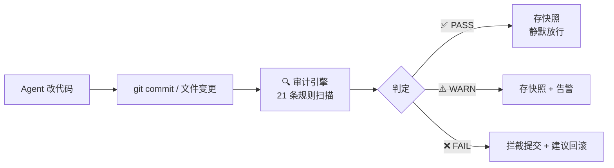
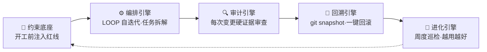

# sofagent

> 🌐 [English →](README.en.md) | 🇨🇳 中文

<p align="center">
  <a href="https://sofagent.ai">
    
  </a>
</p>

<p align="center">
  <strong>sofa + agent = sofagent / 沙发特工</strong><br/>
  <em>帮 SMB 和 OPC 的人成为自己业务的前线部署工程师。</em>
</p>

<p align="center">
  <a href="https://github.com/KongFangXun/sofagent/actions/workflows/verify.yml"></a>
  <a href="./LICENSE"></a>
  <a href="./CHANGELOG.md"></a>
  <a href="#装上就能用"></a>
</p>

---

## ① FDE Agent 是什么

Agent 越聪明，企业越不敢放手——真出事了，谁负责？能拦住吗？能回滚吗？

**FDE Agent —— 帮 SMB 和 OPC 的人成为自己业务的前线部署工程师。** 底层是 sofagent 引擎（Harness 中间件）：每次 Agent 改代码、写文件，自动跑 21 条规则审计——违规的当场拦截，合规的存快照。审计引擎零 token（纯正则，不调 LLM）。

> 🏞️ **一条河的模型**：大厂造河（LLM = 水，Agent 平台 = 河床），我们不做河——做堤坝（约束）+ 自来水厂（沙箱）+ 管网（Workflow）+ 水龙头（Subagent），让原水变直饮水。详见 [ARCHITECTURE · River](./docs/ARCHITECTURE.md)。

> [!NOTE]
> 🔬 **Hugging Face 实测**：同一模型不改权重、仅优化外层 Harness，法律 Agent 基准 **3.5% → 80.1%**（76 分差全部来自外层机制），成本仅 1/7。详见 [THANKS.md](./docs/THANKS.md)。

| 维度 | 数据 |
|------|------|
| 审计引擎 | 21 条规则全覆盖，`npm test` 全绿（见 `tools/test-count.sh` 实测），0 token 消耗 |
| 平台覆盖 | git commit 审计（开发者）+ daemon 文件审计（非开发者）|
| 协议 | MIT（代码 / 文档 / 模板随便用）|

<details>
<summary>📦 FDE Agent 交付什么 + USB 一键烧录</summary>

**FDE 离场后，企业留下五样东西——前四样是资产，第五样是让前四样一直活着的 FDE Agent 本身：**

| 交付物 | 说明 |
|--------|------|
| 交付手册 | 企业 IT 可独立维护的操作手册 |
| AI 节点 | 在跑的 Agent，自动执行日常任务（财务对账、审计巡检、数据分析…）|
| AI 知识库 | 持续积累的实体、概念、对比页（Dream Cycle 自动沉淀）|
| 私有化评估体系 | eval 反馈 + Skill 迭代历史——无法复制的企业 IP |
| **FDE Agent 本身** | 7×24 在跑——管上面四样东西的生命周期，人离场了它留下 |

**USB 一键烧录：搭好 workflow → 发 U 盘**

```bash
sofagent-daemon create-usb-key --role "财务审计节点" --target /Volumes/SOFAGENT --platform macos
```

U 盘里有什么：Node.js 便携版 + sofagent 引擎 + knowledge AES-256-GCM 加密落盘 + HMAC 防篡改签名 + 三平台启动脚本。**插上即用，拔掉零残留。**

> 💡 搭好一个财务 workflow → 烧一批 U 盘 → 发给财务团队 → 每人插上就能用自己的 Agent 开始干活。详见 [FDE/FDE.md §部署场景](./FDE/FDE.md)。

</details>

---

## ② 装上就能用

```bash
# FDE Agent 一键部署
bash FDE/fde-install.sh
```

> 需要 Node.js ≥ 18 + bash + git。macOS / Linux 全功能，Windows 实验性。

<details>
<summary>🚀 装完三步体验</summary>

```bash
# 1. 看规则——Agent 会带着这些红线干活
sofagent-audit --help | head -5

# 2. 跑审计——--init 已装好 pre-commit hook，每次 commit 都被拦
echo "API_KEY=sk-123456" > .env && git add -f .env && GIT_EDITOR=true git commit -m "test"
# → ⛔ A1 不碰敏感：.env 含密钥格式，提交被拦截（不会真的落库）

# 3. 看快照——每次审计后自动存档
sofagent-audit --timeline

# 演示完清理
git rm --cached -f .env 2>/dev/null; rm -f .env
```
</details>

**按需安装**：

| 包 | 用途 |
|------|------|
| `@sofagent/audit` | 审计引擎（21 条规则，git diff 硬证据）|
| `@sofagent/core` | 运行时诊断（doctor / verify）|
| `@sofagent/orchestrator` | 编排引擎（多 Agent 协作）|
| `@sofagent/daemon` | 守护进程（文件监控 / 定时巡检）|
| `@sofagent/mcp` | MCP Server（JSON-RPC 2.0）|

**卸载**：

```bash
npm uninstall -g @sofagent/audit @sofagent/core @sofagent/orchestrator @sofagent/daemon @sofagent/mcp
rm -f .git/hooks/commit-msg .git/hooks/post-commit
```

---

## ③ 开发者入口

> 面向开发者。非技术用户只需知道：FDE Agent 建在 sofagent 引擎上，引擎负责每次变更的审计与回滚。

### 30 秒看懂审计引擎



sofagent 引擎是 **Harness 中间件**——不管你用什么 Agent、什么模型，挂在 git commit 上，用 git diff 硬证据做审计。**平台无关、零侵入、零 token。**

### 你的场景 → 用什么

| 你的场景 | 装什么 |
|---------|--------|
| 只想拦截密钥泄漏 / Agent 越界 | `@sofagent/audit` + `@sofagent/core`（最小）|
| 管住 Agent 全流程（约束 + 审计 + 回滚）| + `@sofagent/daemon` |
| 多 Agent 协作 / 工作流编排 | + `@sofagent/orchestrator` |
| 让 MCP Client 调用审计能力 | + `@sofagent/mcp` |

### 引擎全貌

sofagent 完整形态是「一底座 + 四引擎」的 Harness 中间件：



| 引擎 | 作用 | 状态 |
|------|--------|:--:|
| 🧭 约束底座 | 开工前规则注入 Agent 上下文 | ✅ 稳定 |
| ⚙️ 编排引擎 | LOOP 自迭代 + 任务拆解 | 🔶 部分 |
| 🔍 审计引擎 | 21 条规则，git diff 硬证据 | ✅ 稳定 |
| 🔄 回溯引擎 | 审计后自动快照，一键回滚 | ✅ 稳定 |
| 🧬 进化引擎 | 周度巡检审计趋势 + 自动优化 | ⚠️ 实验性 |

> 完整引擎说明、21 条规则详情、架构设计哲学 → [ARCHITECTURE](./docs/ARCHITECTURE.md) · [PHILOSOPHY](./docs/PHILOSOPHY.md) · [DEVELOPMENT](./docs/DEVELOPMENT.md)

---

## 延伸阅读

| 你想了解 | 看哪里 |
|---------|--------|
| FDE Agent 进场四阶段、企业落地 | [FDE.md](./FDE/FDE.md) |
| 怎么装、怎么用、常见问题 | [HANDBOOK](./docs/HANDBOOK.md) |
| 为什么这么设计 | [ARCHITECTURE](./docs/ARCHITECTURE.md) |
| 设计哲学 | [PHILOSOPHY](./docs/PHILOSOPHY.md) |
| 安全声明 | [SECURITY](./SECURITY.md) |
| 已知局限 | [LIMITATIONS](./LIMITATIONS.md) |
| 版本路线图 | [ROADMAP](./ROADMAP.md) |
| 贡献指南 | [CONTRIBUTING](./CONTRIBUTING.md) |

---

## 贡献与致谢

欢迎提 Issue 和 PR，尤其较真的那种。[CONTRIBUTING.md](./CONTRIBUTING.md) · [致谢](./docs/THANKS.md)
