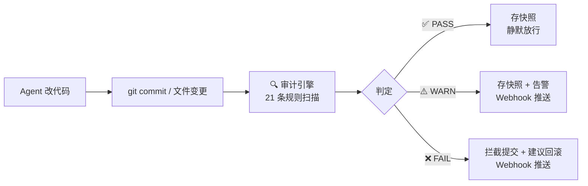
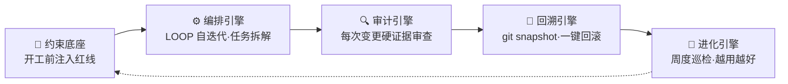
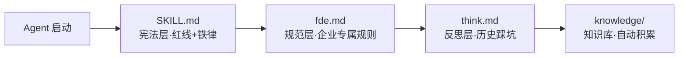
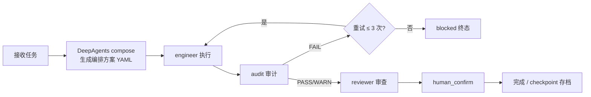
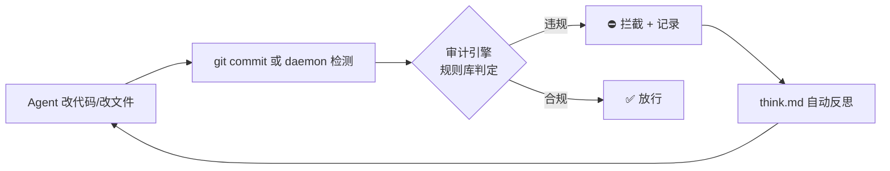
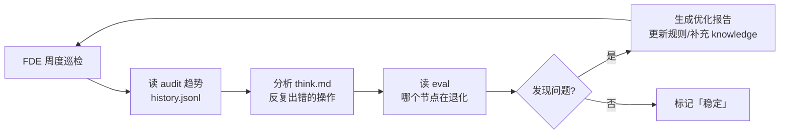

# sofagent

> 🌐 [English →](README.en.md) | 🇨🇳 中文

<p align="center">
  <a href="https://sofagent.ai">
    
  </a>
</p>

<p align="center">
  <strong>sofa + agent = sofagent / 沙发特工</strong><br/>
  <em>给 SMB 和 OPC 的 FDE Agent —— 约束底座管行为，审计引擎盯结果，编排引擎自动干活。</em>
</p>

<p align="center">
  <a href="https://github.com/KongFangXun/sofagent/actions/workflows/verify.yml"></a>
  <a href="./LICENSE"></a>
  <a href="./CHANGELOG.md"></a>
  <a href="#怎么装"></a>
</p>

---

## ① FDE Agent 是什么

Agent 越聪明，企业越不敢放手——真出事了，谁负责？能拦住吗？能回滚吗？

**sofagent 给 SMB 和 OPC 提供 FDE Agent**——一个帮你把企业工作流梳理成 AI 节点、部署完就能自己跑的常驻 Agent。底层是 sofagent 引擎（Harness 中间件）：每次 Agent 改完代码、写完文件，自动跑一遍规则库，违规的当场拦截、合规的存快照。改了什么就是什么，无可抵赖。审计引擎零 token 消耗——纯正则引擎，不调 LLM。

> 💡 **为什么是现在**：a16z（2026-07）指出「人类历史上第一次，人比软件便宜」——每家公司在雇「一百万个糟糕的 AI 员工」，80% 的 token 在空转。解法不是更强的模型，而是**管理**。sofagent 正是那一层：用约束 + 审计把 Agent 队伍管起来。

<details>
<summary>🏞️ 一条河的模型（点开）</summary>

大厂造河（LLM = 水，Agent 平台 = 河床，没有河床水只是一片汪洋），我们做**堤坝 + 自来水厂 + 管网 + 水龙头**——约束层（不让水泛滥）+ 沙箱安全（让水从"能喝"到"敢喝"）+ Workflow（把能力引到业务）+ Subagent（让能力在具体业务用水）。想象一座城市——城边的大江水是好水，但你不敢直接舀着喝；sofagent 就是修堤坝、建自来水厂、铺管网、装水龙头那套——**让原水变成企业敢喝的直饮水**。详见 [`FDE/FDE.md` §9.6](FDE/FDE.md#96-river大厂造河与企业用水)。

</details>

> 💡 **换个角度说：一个能用的智能体 ≠ AI + 一段 prompt**——它是一套由多层组成的骨架（配置 / 知识 / 指令 / 校验 / 编排）。sofagent 的约束底座是骨架里的钢筋，审计引擎是质检。给 Agent 搭脚手架（工具 / 权限 / 沙箱 / 规则），而非造一个更聪明的模型。

**实测效果**：

> [!NOTE]
> 🔬 **Hugging Face 实测**：同一模型不改权重、仅优化外层 Harness，法律 Agent 基准 **3.5% → 80.1%**（76 分差全部来自外层机制），成本仅 1/7（追平 Claude Sonnet 4.6）。[详情](./docs/THANKS.md)

| 维度 | 数据 |
|------|------|
| 审计引擎 | 21 条规则全覆盖，`npm test` 全绿（见 tools/test-count.sh 实测），0 token 消耗 |
| 平台覆盖 | git commit 审计（开发者）+ daemon 文件审计（非开发者）|
| 协议 | MIT（代码 / 文档 / 模板随便用）|

---

## ② 装上就能用

```bash
# FDE Agent 一键部署
bash FDE/fde-install.sh
```

> 💡 开发者想只跑审计引擎？看下方「④ 引擎架构 · 高级/开发者路径」。OpenClaw 是企业无人值守场景才需要。

> [!NOTE]
> 需要 Node.js ≥ 18 + bash + git。macOS / Linux 全功能，Windows 实验性。

<details>
<summary>🚀 装完三步体验（点开）</summary>

```bash
# 1. 看规则——Agent 会带着这些红线干活
sofagent-audit --help | head -5

# 2. 跑审计——--init 已装好 pre-commit hook，每次 commit 都会被 A1 拦
echo "API_KEY=sk-123456" > .env && git add -f .env && GIT_EDITOR=true git commit -m "test"
# → ⛔ A1 不碰敏感：.env 含密钥格式，提交被拦截（不会真的落库）

# 3. 看快照——每次审计后自动存档
sofagent-audit --timeline

# 演示完清理（A1 已拦提交，无新 commit）
git rm --cached -f .env 2>/dev/null; rm -f .env
```
</details>

**按需安装**：

| 包 | 用途 |
|------|------|
| `@sofagent/audit` | 审计引擎（21 条规则，git diff 硬证据）|
| `@sofagent/core` | 运行时诊断（doctor / verify）|
| `@sofagent/orchestrator` | 编排引擎（多 Agent 协作）|
| `@sofagent/daemon` | 守护进程（文件监控 / 定时巡检）|
| `@sofagent/mcp` | MCP Server（JSON-RPC 2.0）|

**卸载**：

```bash
npm uninstall -g @sofagent/audit @sofagent/core @sofagent/orchestrator @sofagent/daemon @sofagent/mcp
rm -f .git/hooks/commit-msg .git/hooks/post-commit
```

### 两种部署节点

| 节点 | 场景 | 需要 OpenClaw |
|------|------|:--:|
| 🔄 自动运行节点 | 企业无人值守设备（服务器/旧电脑）| 是 |
| ⚡ 个人增强节点 | 开发者用 WorkBuddy / Codex / Claude Code | 否 |

> 💡 个人增强节点：clone 仓库 → `bash FDE/fde-install.sh` → 直接上手。

---

## ③ 企业落地：FDE Agent

sofagent 不只是开发者工具——企业落地用 **FDE Agent**：

- **FDE Agent**（`FDE/`）：前线部署工程师进场四阶段（梳理 → 挖掘 → 交付 → 离场），把企业工作流梳理成 AI 节点，部署完撤离、AI 节点自己跑。详见 [FDE/FDE.md](./FDE/FDE.md)。
- **Work模板市场**：行业工作流模板（v1.1.9 已物理迁出至商业产品 `商业仓库/模板市场/`，MIT 仓库不再维护）。
- **LOOP 自迭代工具包**（`LOOP/`）：sofagent 的外层自迭代编排——内层 `coding → audit → review → human`，外层 `FDE 监督 → compliance 巡检 → 优化 Agent 定义`。详见 [LOOP/README.md](./LOOP/README.md)。

**三产品关系**：sofagent 核心管「每次变更守门」（commit / 文件变更即审计）；FDE 管「进场部署交付」（把 sofagent 装到企业设备并撤离）；LOOP 管「长期自迭代」（持续巡检 + 优化 Agent 定义）。三者共享同一套约束底座与审计引擎，均非可独立运行的独立仓库（需先 `git clone` 主仓库）。

> 💡 **命名约定**：大写目录（`FDE/`、`LOOP/`）是 sofagent 的**部署/产品入口**，需先 `git clone` 主仓库后运行（**非可独立运行的独立仓库**，单独 clone 子目录会因依赖主仓库 `sofagent/scripts/install.sh` 而跑不通）；小写目录（`sofagent/`、`docs/`、`tools/`）= 核心代码与配置。

### 产品形态：MCP + dashboard

sofagent 内核（审计引擎 + 编排引擎 + FDE 能力）是给开发者用的。产品化交给非技术买家时，需要一层不同的外壳：

- **卖能力，不卖工时**——把「企业该有的 AI 落地能力」封装成 Agent 驱动的产品，营收从「顾问工时」变成「企业数 × 订阅」。
- **轻量 dashboard**——LUI-first 不变，但非专家买家需要一个看得见「我公司 AI 化到哪了」的只读视图（审计状态 / AI 化进度 / 合规月报）。
- **MCP 做桥**——dashboard 不重，靠 MCP 让客户已有的 Agent / 你的 sub-agent 把数据喂给后端。
- **open-core 双轨**——内核（审计 / FDE / 编排）MIT 开源做信任资产；商业化只卖那层 dashboard。开源负责让人信，闭源负责让人付。

> 控制平面打法：底层 Agent 智能随便换，治理与真相永远在 sofagent 的 dashboard 里。详见 [PHILOSOPHY §六](./docs/PHILOSOPHY.md)。

---

## ④ 引擎架构（开发者段）

> 以下内容面向开发者。非技术用户只需知道：FDE Agent 建在 sofagent 引擎上，引擎负责每次变更的审计与回滚。

### 30 秒看懂审计引擎



sofagent 引擎是 **Harness 中间件**——不管你用什么 Agent（Claude Code / Codex / Cursor / WorkBuddy）、什么模型，挂在 git commit 这个节点上，用 git diff 硬证据做审计。**平台无关、零侵入、零 token**。FDE Agent 就建在这套引擎上。

### 为什么不用现有工具

| 工具 | 它查什么 | sofagent 查什么 |
|------|---------|----------------|
| pre-commit / husky | 代码质量（lint / format） | **Agent 行为**（密钥泄漏 / 越界修改 / 注入攻击 / 盲改） |
| detect-secrets / gitleaks | 密钥扫描 | 密钥只是 A2 一条规则，sofagent 还有 20 条管 Agent 失效模式 |
| Cursor Rules / Claude Code hooks | 单平台 IDE 内约束 | 平台无关——任何 Agent + git 仓库都能跑 |

> 💡 **核心差异**：现有工具查「代码写得对不对」，sofagent 查「Agent 做得对不对」——边界越界、知识库跨域、流程合规、盲改逃验证，这些是 LLM Agent 特有的失效模式，通用 lint 工具覆盖不到。

### 21 条规则（5 类）

**默认规则（13 条，装完即生效）**：

| 类别 | 规则 | 拦什么 |
|------|------|--------|
| 🔴 **密钥安全** | A1 不碰敏感 · A2 不泄密钥 | `.env` / `*.pem` 提交、代码硬编码 API Key |
| 🟡 **行为边界** | A3 不改越界 · A4 不删配置 | 改了任务没要求的文件、删配置 |
| 🟠 **注入防护** | A9 不纳注入 · A10 不引毒源 | prompt 注入模式、非官方源依赖 |
| 🔵 **流程合规** | A5 不瞒真相 · A7 不存盲改 · A8 不逃验证 · A19 msg 质量 | 空 commit message、没读就改、改完不测、低质 message |
| ⚪ **工程质量** | A6 不坏构建 · A11 不滥资源 · A18 垃圾文件 | 构建配置异常、超大文件、临时文件提交 |

**扩展规则（8 条，需 opt-in）**：A14 知识库越权 · A15 不盲动 · A16 非授权文件变更 · A17 异常批量变更 · E1-E4（测试文件 / TODO 未声明 / 大量删除 / 低注释率）。

<details>
<summary>📋 完整规则表（21 条，含判定逻辑）</summary>

| 规则 | 判定 | 严重度 | 分级 |
|------|------|:--:|------|
| A1 不碰敏感 | `.env` / `*.pem` / `id_rsa` / 密钥文件被修改 | FAIL | 业务底线 |
| A2 不泄密钥 | 代码中出现 API Key / Token / Password 模式 | FAIL | 业务底线 |
| A3 不改越界 | 修改文件路径与任务描述不匹配 | WARN | 业务底线 |
| A4 不删配置 | 配置文件被删除 | FAIL | 业务底线 |
| A5 不瞒真相 | commit message 为空或纯占位符 | WARN | 业务底线 |
| A6 不坏构建 | 构建配置文件异常改动 | WARN | 能力拐杖 |
| A7 不存盲改 | 被修改文件无读取记录 | FAIL/WARN | 能力拐杖 |
| A8 不逃验证 | 构建文件变更后无测试记录 | FAIL/WARN | 能力拐杖 |
| A9 不纳注入 | 代码中存在命令注入风险模式 | FAIL | 业务底线 |
| A10 不引毒源 | 依赖包黑名单检测 | WARN | 业务底线 |
| A11 不滥资源 | 资源滥用检测（超大文件等） | WARN | 业务底线 |
| A18 垃圾文件 | 临时文件名模式的垃圾文件 | WARN | 能力拐杖 |
| A19 msg 质量 | message 命中黑名单词或过短 | FAIL | 业务底线 |
| A14 知识库越权 | 访问超出工作流声明范围的知识库页面 | WARN | 能力拐杖 |
| A15 不盲动 | workflow.yml 节点未声明 actions | FAIL | 能力拐杖 |
| A16 非授权文件变更 | 非工作流声明范围内的文件被修改 | FAIL | 工程规范 |
| A17 异常批量变更 | 单次提交变更文件数超阈值 | WARN | 工程规范 |
| E1 测试文件 | 测试文件被提交到生产目录 | WARN | 能力拐杖 |
| E2 TODO 未声明 | 新增 TODO 未在任务中声明 | WARN | 能力拐杖 |
| E3 大量删除 | 单次提交删除行数 > 阈值 | WARN | 能力拐杖 |
| E4 低注释率 | 新增 >200 行且注释率 < 5% | WARN | 能力拐杖 |

**规则分级**：业务底线（违反即破坏交付完整性）· 能力拐杖（帮 Agent 走完正确流程）· 工程规范（代码工程质量基线）。
</details>

### 一底座 · 四引擎

sofagent 引擎不只是审计——完整形态是「一底座 + 四引擎」的 Harness 中间件：



| 引擎 | 作用 | 状态 |
|------|--------|:--:|
| 🧭 约束底座 | 开工前把规则注入 Agent 上下文（SKILL.md + fde.md + think.md + knowledge/）| ✅ 稳定 |
| ⚙️ 编排引擎 | LOOP 自迭代（engineer→audit→reviewer 串行）+ 任务拆解（生成编排方案）| 🔶 部分（需 `@sofagent/orchestrator`）|
| 🔍 审计引擎 | 每次 git commit / 文件变更跑 21 条规则，违规拦截+存证 | ✅ 稳定（`@sofagent/audit` 独立）|
| 🔄 回溯引擎 | 每次审计后自动 git snapshot，违规时一键 revert | ✅ 稳定 |
| 🧬 进化引擎 | FDE 周度巡检审计趋势 + 反思记录，发现退化就优化 | ⚠️ 实验性 |

> 💡 **最小用法**：只装 `@sofagent/audit` 就是纯审计工具（21 条规则 + 快照 + 回滚）。装齐 5 个包才是完整 Harness 中间件。

<details>
<summary>📖 引擎详细说明（点开）</summary>

### 🧭 约束底座



开工前把规则注入 Agent 上下文——让它知道红线在哪。四层加载链：SKILL.md（宪法层）→ fde.md（企业规则层）→ think.md（历史踩坑层）→ knowledge/（自动积累层）。v1.0.7+ Sub Agent 启动时自加载（`buildConstrainedSystemPrompt`），不依赖任何 Agent 平台的 Skill 系统。

> 📚 **知识沉淀流水线（v1.1.7）**：knowledge/ 由 daemon **Dream Cycle 6 阶段 pipeline** 自动沉淀（extract_facts → extract_atoms → cluster_patterns → synthesize_concepts → skillopt_backfill → embed），替换旧散点脚本；每条知识带 `sensitivity` 分级（public/internal/restricted，缺省 internal）。配套治理：`knowledge-health` 巡检器（@weekly，孤立/重复/断链/index 过旧/缺源 5 项，fail-closed 只读）+ `sofagent-daemon knowledge status` 聚合命令（一眼看见 Dream Cycle 周报 / 知识健康 / sensitivity 统计，restricted 只计数不泄露）。

> 🔐 **安全与联邦（v1.1.8 · 已发布）**：两台配对设备经 OpenClaw channel 互查 knowledge/——AES-256-GCM 应用加密 + ECDH 密钥交换（key 只存内存）+ 三条配对路径（6 位码确认 / token / federation.json HMAC 验签）+ sensitivity 双重过滤 + automerge CRDT 合并（trust 优先于 mtime）+ 离线降级不阻塞。Prompt 注入防护补齐：外部内容 `<untrusted>` 包裹 + prompt 级脱敏 + 知识可信分级（official>internal>user>web，web+restricted 丢弃）。知识沉淀主动通知：Dream Cycle / 健康巡检跑完自动推送摘要（best-effort，restricted 不进通知）。

### ⚙️ 编排引擎



当前实现两层能力：① **任务拆解**——DeepAgents compose 把任务描述转成编排方案 YAML；② **LOOP 自迭代**——`engineer → audit → reviewer → human_confirm` 四节点 StateGraph，audit FAIL 自动回 engineer 重试（最多 3 轮），每个节点 checkpoint 存档支持中断恢复。

> 🔶 **能力边界**：LOOP 当前是**串行**状态机（非并行 DAG 调度）。compose 输出的编排方案 YAML 描述了"应该有哪些节点"，但暂无按 DAG 并行分发 Sub Agent 的执行器。A/B 对比机制（连续胜出 2 次 promote）已实现，但依赖历史日志统计，非实时双跑。完整的 DAG 并行调度 + 沙箱执行环境规划在 [ROADMAP v1.3.0](./ROADMAP.md)。

### 🔍 审计引擎



每次 git commit 或文件变更时自动扫描——Agent 改代码 → git commit/daemon 检测 → 审计引擎规则库判定 → 违规拦截+记录 / 合规放行 → think.md 自动反思。21 条规则中 16 条为纯 git-diff（不依赖 Agent 配合），4 条 hybrid（A7/A8/A14/A15 需 Agent 日志），1 条 filesystem（A17 异常批量变更）。v1.0.8+ 内嵌 isomorphic-git + daemon 文件监控，**不需 git commit 也能审计**。

### 🔄 回溯引擎（本质：git snapshot + revert 包装）

每次审计后自动快照存档——违规时推送通知 + 建议回滚：

| 结果 | 自动动作 | 用户看到什么 |
|------|---------|------------|
| ✅ PASS | 自动快照存档 | 静默 |
| ⚠️ WARN | 存档 + 标记 | daemon-notice.md 告警 + 可选 Webhook |
| ❌ FAIL | 存档 + 建议回滚 | Webhook 推送 + 终端标红 |

### 🧬 进化引擎（实验性）



⚠️ A/B 自动 promote 基于 `consecutiveWins ≥ threshold` + `overallImprovement` 守卫，eval 评分依赖 LLM 自评（存在 self-grading bias）。窄 eval 集场景下可能误晋升，生产环境建议人工复核 promote 决策。两种模式：`deploy`（首次部署/业务大变更）+ `sustain`（每周自动/手动触发巡检）。

</details>

### 你的场景 → 用什么

| 你的场景 | 装什么 |
|---------|--------|
| 只想拦截密钥泄漏 / Agent 越界 | `@sofagent/audit` + `@sofagent/core`（最小） |
| 管住 Agent 全流程（约束 + 审计 + 回滚）| + `@sofagent/daemon`（文件监控）|
| 多 Agent 协作 / 工作流编排 | + `@sofagent/orchestrator`（编排引擎）|
| 让 MCP Client 调用审计能力 | + `@sofagent/mcp`（MCP Server）|

---

## 延伸阅读

| 你想了解 | 看哪里 |
|---------|--------|
| FDE Agent 进场四阶段、企业落地 | [FDE.md](./FDE/FDE.md) |
| 怎么装、怎么用、常见问题 | [HANDBOOK](./docs/HANDBOOK.md) |
| 为什么这么设计 | [ARCHITECTURE](./docs/ARCHITECTURE.md) |
| 设计哲学 | [PHILOSOPHY](./docs/PHILOSOPHY.md) |
| LLM Wiki 治理映射 | [docs/llm-wiki-mapping.md](./docs/llm-wiki-mapping.md) |
| 安全声明 | [SECURITY](./SECURITY.md) |
| 已知局限 | [LIMITATIONS](./LIMITATIONS.md) |
| 版本路线图 | [ROADMAP](./ROADMAP.md) |
| 贡献指南 | [CONTRIBUTING](./CONTRIBUTING.md) |

---

## 贡献与致谢

欢迎提 Issue 和 PR，尤其较真的那种。[CONTRIBUTING.md](./CONTRIBUTING.md) · [致谢](./docs/THANKS.md)
