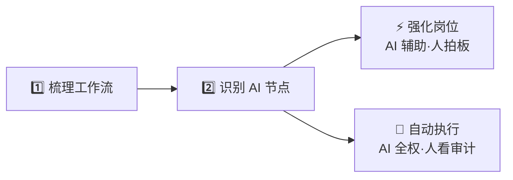
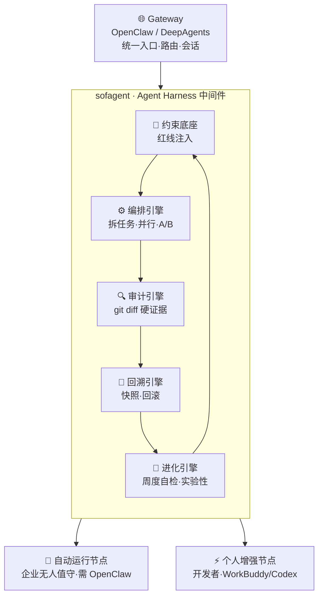
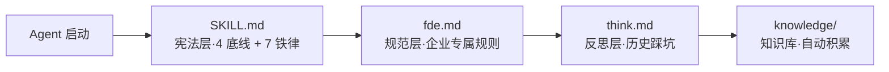
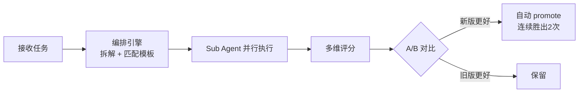
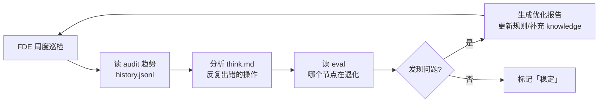
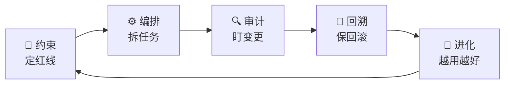

# sofagent

> 🌐 [English abridged version →](README.en.md) | 🇨🇳 中文完整版

<p align="center">
  <a href="https://sofagent.ai">
    
  </a>
</p>

<svg width="100%" height="60" viewBox="0 0 720 60" xmlns="http://www.w3.org/2000/svg" role="img" aria-label="sofagent capability banner">
  <rect width="720" height="60" rx="8" fill="#0B1220"/>
  <rect x="0" y="0" width="144" height="60" fill="#16B8F3" opacity="0.15"/>
  <text x="360" y="26" fill="#16B8F3" font-family="-apple-system,Segoe UI,sans-serif" font-size="16" font-weight="700" text-anchor="middle">约束底座 · 编排 · 审计 · 回溯 · 进化</text>
  <text x="360" y="46" fill="#94A3B8" font-family="-apple-system,Segoe UI,sans-serif" font-size="12" text-anchor="middle">Agent Harness 中间件 + FDE 工具包 · 让企业用对 AI</text>
</svg>

<p align="center">
  <strong>sofa + agent = sofagent / 沙发特工</strong><br/>
  <em>不是帮企业「接上 AI」，是帮企业「用对 AI」。</em>
</p>

<p align="center" style="color:#64748B;font-size:14px;">
  Agent Harness 中间件 + FDE 工具包<br/>
  <strong>让 SMB 与 OPC 的每个人都具备 FDE 的能力</strong>
</p>

<p align="center">
  <a href="https://github.com/KongFangXun/sofagent/actions/workflows/verify.yml"></a>
  <a href="./LICENSE"></a>
  <a href="./CHANGELOG.md"></a>
  <a href="https://www.npmjs.com/package/@sofagent/audit"></a>
  <a href="./README.md"></a>
</p>

<p align="center" style="color:#64748B;font-size:13px;">
  <strong>Gateway 是高速公路，sofagent 是交规 + 测速摄像头 + 驾校教练。</strong><br/>
  OpenClaw/DeepAgents 就是你的 Gateway——sofagent 不替代它，挂在里面管 Agent 行为治理。
</p>

---

> [!IMPORTANT]
> **管住 Agent 从部署到持续优化的全生命周期。**

🧭 约束底座 · ⚙️ 编排引擎 · 🔍 审计引擎 · 🔄 回溯引擎 · 🧬 进化引擎（实验性）

---

| 你想要 | sofagent 给什么 |
|------|------|
| 让 Agent 不越界 | 🧭 约束底座（红线注入） |
| 大任务并行、自动择优 | ⚙️ 编排引擎 |
| 改了什么赖不掉 | 🔍 审计引擎（git diff 硬证据·0 token） |
| 出事能回滚 | 🔄 回溯引擎（自动快照） |
| 越用越好 | 🧬 进化引擎（周度自检，实验性） |

---

## 目录

- [10 秒看懂 sofagent](#10-秒看懂-sofagent)
- [为什么需要 sofagent？](#为什么需要-sofagent)
- [怎么装？](#怎么装)
- [新手上路（成为 FDE 节点）](#新手上路成为-fde-节点)
- [FDE 怎么工作？](#fde-怎么工作)
- [对比现有工具](#对比现有工具)
- [效果怎么样？](#效果怎么样)
- [内置 Agent](#内置-agent)
- [你需要哪个？](#你需要哪个)
- [Flow Hub：企业落地的可靠底座](#flow-hub企业落地的可靠底座)
- [延伸阅读](#延伸阅读)

---

↑ [回到顶部](#sofagent)

## 10 秒看懂 sofagent

> **sofagent = 开源（MIT）的 FDE 工具包：用你自选的 Agent + 大模型，可治理、可问责地落地 AI。一底座·四引擎（约束 / 编排 / 审计 / 回溯 / 进化）做问责底座。**

---

↑ [回到顶部](#sofagent)

## 为什么需要 sofagent？

很多中小企业上了 AI 工具，半年后就吃灰了。不是技术不行——是这三个问题：

| 企业的问题 | sofagent 怎么做 |
|------|------|
| 🚫 买了一堆工具，不知道从哪下手 | FDE 进场梳理工作流，识别 AI 节点，装完就走 |
| 🔧 技术主导，业务规则写不了代码 | fde.md 用业务语言写规则（不碰客户数据、大额需审批） |
| 👻 装了没人管，改坏了不知道、半年水平不变、出事找不到人 | 每次改动自动审计 + 快照回滚 + 编排拆任务并行 + 周度巡检自动优化 |

不用请顾问、不用养 AI 团队。FDE 进场四步走，交付完离场——AI 节点留在企业自己跑。与 AgentLoop 的区别：它观测 Agent 怎么想（运行时轨迹、SaaS），sofagent 审计 Agent **改了什么**（文件 diff、本地、MIT 开源）。

> [!IMPORTANT]
> 🔬 **Hugging Face 实测**：同一模型不改权重、仅优化外层 Harness，法律 Agent 基准 **3.5% → 80.1%**（76 分差全部来自外层机制），成本仅 1/7（追平 Claude Sonnet 4.6）。[详情](./docs/ARCHITECTURE.md)

---

↑ [回到顶部](#sofagent)

## 怎么装？

```bash
npm install -g @sofagent/audit @sofagent/core && sofagent-audit --init
```
> [!NOTE]
> `@sofagent/core` 提供 doctor/verify 等运行时诊断能力，是 audit 的必备配套包。

<details>
<summary>🚀 装完三步体验（点开）</summary>

```bash
# 1. 看约束规则——Agent 会带着这些红线干活
sofagent-audit --help | head -5

# 2. 跑审计——--init 已装好 pre-commit hook，每次 commit 都会被 A1 拦
echo "API_KEY=sk-123456" > .env && git add -f .env && GIT_EDITOR=true git commit -m "test"
# → ⛔ A1 不碰敏感：.env 含密钥格式，提交被拦截（不会真的落库）

# 3. 看快照——每次审计后自动存档
sofagent-audit --timeline

# 演示完清理（A1 已拦提交，无新 commit）：取消暂存并删除 .env
git rm --cached -f .env 2>/dev/null; rm -f .env
```
</details>

> [!NOTE]
> 需要 Node.js ≥ 18 + bash + git。macOS / Linux 全功能，Windows 实验性。[完整安装说明](./docs/HANDBOOK.md)

### 按需安装独立包

`@sofagent/audit` 为纯审计引擎（核心功能）。如需完整能力，可按需安装独立包：

| 包 | 用途 | 安装命令 |
|------|------|------|
| `@sofagent/audit` | 纯审计引擎（21 条规则，git diff 硬证据） | `npm install -g @sofagent/audit @sofagent/core` |
| `@sofagent/core` | 运行时诊断（doctor/verify，audit 的必备配套） | `npm install -g @sofagent/core` |
| `@sofagent/orchestrator` | 编排引擎（多 Agent 协作 / 工作流调度） | `npm install -g @sofagent/orchestrator` |
| `@sofagent/daemon` | 主动巡检守护进程（定时审计/健康度/新鲜度检测） | `npm install -g @sofagent/daemon` |
| `@sofagent/mcp` | MCP Server（JSON-RPC 2.0，暴露审计能力给 MCP Client） | `npm install -g @sofagent/mcp` |

> [!NOTE]
> 以上包均可独立使用，互不强制依赖。`@sofagent/audit` 为最简入口，其他包按需叠加。

### 卸载

```bash
npm uninstall -g @sofagent/audit @sofagent/core @sofagent/orchestrator @sofagent/daemon @sofagent/mcp
# 移除 --init 装入的 git hook（当前仓库）
rm -f .git/hooks/commit-msg .git/hooks/post-commit
```

> [!NOTE]
> 包随每次发版自动发布到 npm；若本地 `npm install -g` 装不上，可改用仓库内本地安装脚本 `sofagent/scripts/install.sh`。

---

↑ [回到顶部](#sofagent)

## 新手上路（成为 FDE 节点）

想用 sofagent 成为自己业务的 FDE 节点？按这个顺序读，半小时就能上手：

1. 读 [FDE/FDE.md](./FDE/FDE.md) 的四阶段流程（进场 → 挖掘 → 交付 → 离场）。
2. 读 [docs/ARCHITECTURE.md](./docs/ARCHITECTURE.md) 理解一底座·四引擎怎么协作。
3. 读 [docs/PHILOSOPHY.md](./docs/PHILOSOPHY.md) 理解「为什么这么做」。
4. 动手部署：参考 [FDE/fde-install.sh](./FDE/fde-install.sh) 与 [LOOP/loop-install.sh](./LOOP/loop-install.sh)。

> [!NOTE]
> 具体安装与命令以对应脚本和文档为准。术语速查见 [docs/ARCHITECTURE.md · 术语对照](./docs/ARCHITECTURE.md#术语对照)。

---

↑ [回到顶部](#sofagent)

## FDE 怎么工作？

FDE 进驻企业做两件事——梳理 + 识别，分出两种节点，然后五个能力接管运行。



第二步是关键——不是所有环节都适合 AI 全自动。FDE 把节点分成两类：

| 节点类型 | 怎么跑 | 人做什么 | sofagent 做什么 |
|------|------|------|------|
| ⚡ **强化岗位** | AI 做领航员辅助出方案，规则可描述 | 决策、审批、签字 | 约束底座确保方案不越界，审计引擎记录每次建议可追溯，回溯引擎改错可回滚，进化引擎沉淀辅助 skill |
| 🔄 **自动执行** | AI 全权执行，自动跑完整个流程 | 看审计报告、定期抽查 | 全能力开启：约束定红线→编排拆任务→审计盯变更→回溯保回滚→进化周度优化 |

FDE 交付完就撤离，AI 节点留在企业自己跑。

> [!NOTE]
> 📖 完整 FDE 工作流程见 [FDE/FDE.md](./FDE/FDE.md)

### 一底座 · 四引擎

> [!NOTE]
> 💡 **sofagent 和 Gateway 的关系**：见首屏定位区。sofagent 不替代 Gateway——它挂在 Gateway 里面，管 Agent 行为治理。

> [!NOTE]
> 💬 **sofagent 没有界面。你和它对话，它做完了告诉你结果在哪。** 语言就是界面，MCP 就是入口。详见 [设计哲学](./docs/PHILOSOPHY.md)。MCP 完整调用方式见 [MCP 使用指南](./docs/guides/mcp-usage.md)。

> [!NOTE]
> 🔮 **v1.1.0 已发布**：包结构纯度重构——audit 只做审计，12 个独立包 + 轻量多设备。详见 [开发日志](./docs/changelog/v1.1.0.md)。4 种同步方案见 [多设备同步指南](./docs/guides/multi-device-sync.md)。

> [!TIP]
> 一图鸟瞰：Gateway 在外面跑，sofagent 挂进去管行为；五能力形成闭环，落到两种部署节点。



#### 🧭 约束底座

开工前把规则注入 Agent 上下文——让它知道红线在哪。



四层加载链自动注入，Agent 会话一开始就带着约束。全平台可用——OpenClaw 通过 Hook 精确注入，其他平台 Agent 主动 Read，v1.0.7+ Sub Agent 启动时自加载（`buildConstrainedSystemPrompt`）。

#### ⚙️ 编排引擎

把大任务拆小、多 Sub Agent 并行执行、A/B 对比找更优方案。



当前走 DeepAgents（v1.0.7 OpenClaw 编排层完全退役）。`sofagent-orchestrator compose --task` CLI 入口——**任何 Agent 平台都能用编排引擎**。A/B 自动切换：连续胜出 2 次才 promote，切换前旧版本保留为 fallback。详见 [ROADMAP](./ROADMAP.md)。

> [!WARNING]
> ⚠️ 编排能力需另装 `@sofagent/orchestrator`（`npm install -g @sofagent/orchestrator`）。审计引擎（`@sofagent/audit`）不绑 OpenClaw，可独立运行；编排引擎需 orchestrator 包。

#### 🔍 审计引擎

每次 git commit 或文件变更时自动扫描——Agent 改代码 → git commit/daemon 检测 → 审计引擎规则库判定 → 违规拦截+记录 / 合规放行 → think.md 自动反思。改了什么就是什么，赖不掉。

不依赖 AI 自觉——看的是 git diff 硬证据。**0 token 消耗——纯正则引擎，不调 LLM。** 21 条规则中 16 条为纯 git-diff（不依赖 Agent 配合），4 条 hybrid 需 Agent 日志（A7/A8/A14/A15），1 条 filesystem（A17 异常批量变更）。

> [!NOTE]
> v1.1.0 已拆为独立 `@sofagent/audit` 包。v1.0.8+ 内嵌 isomorphic-git + daemon 文件监控，不需 git commit。

#### 🔄 回溯引擎

每次审计后自动快照存档——违规时推送通知 + 建议回滚，出了事能回到改之前：

| 结果 | 自动动作 | 用户看到什么 |
|------|---------|------------|
| ✅ PASS | 自动快照存档 | 静默 |
| ⚠️ WARN | 存档 + 标记 | daemon-notice.md 告警 + 可选 Webhook |
| ❌ FAIL | 存档 + 建议回滚 | Webhook 推送 + 终端标红 |

```bash
sofagent-audit --timeline          # 快照时间线
sofagent-audit --timeline --json   # JSON 输出
sofagent-audit --revert <SHA>      # 回滚到任意快照
```

sofagent 是**行车记录仪**，不是安检——不管什么 Agent、什么平台，事后审计 + 回溯恢复，不依赖任何平台。

#### 🧬 进化引擎（v1.0.8+ · 实验性）

> [!WARNING]
> ⚠️ **实验性功能**：A/B 自动 promote 基于 `consecutiveWins ≥ threshold` + `overallImprovement` 守卫，eval 评分依赖 LLM 自评（存在 self-grading bias）。窄 eval 集场景下可能误晋升。生产环境使用建议人工复核 promote 决策。

FDE Agent 不只部署一次——部署完成后转为**持续优化角色**。每周自动巡检审计趋势 + 反思记录，发现退化就优化。



| 模式 | 时机 | 做什么 |
|------|------|------|
| **deploy** | 首次部署 / 业务大变更 | 梳理工作流 → 识别 AI 节点 → 构建知识库 → 安装底座 |
| **sustain** | 每周自动 / 手动触发 | 读 audit 趋势 → 分析 think.md → 生成优化报告 → 更新规则 |

```bash
# 手动触发
sofagent-orchestrator subagent run fde --mode sustain --task "巡检所有节点"
```

#### 一底座·四引擎 能力总览

| 能力 | 解决什么 | 需额外安装 | 状态 |
|------|---------|:--:|------|
| 🧭 约束底座 | Agent 带着红线开工，不越界 | 否（随上下文注入） | 稳定 |
| ⚙️ 编排引擎 | 大任务拆小、多 Agent 并行、A/B 择优 | 是（`@sofagent/orchestrator`） | 稳定 |
| 🔍 审计引擎 | 每次变更硬证据审查，赖不掉 | 否（`@sofagent/audit` 独立） | 稳定 |
| 🔄 回溯引擎 | 自动快照 + 一键回滚 | 否（随审计触发） | 稳定 |
| 🧬 进化引擎 | 周度巡检、持续自我优化 | 否（FDE sustain 模式） | ⚠️ 实验性 |



一底座 · 四引擎形成闭环：**约束定红线 → 编排拆任务 → 审计盯变更 → 回溯保回滚 → 进化越用越好**。

---

↑ [回到顶部](#sofagent)

## 对比现有工具

| | sofagent | detect-secrets | pre-commit hooks |
|------|:--:|:--:|:--:|
| 密钥检测 | ✅ | ✅ | ❌ |
| Agent 边界越界 | ✅ | ❌ | ❌ |
| 注入攻击检测 | ✅ | ❌ | ❌ |
| 流程合规 | ✅ | ❌ | ❌ |
| 知识库跨域 | ✅ | ❌ | ❌ |
| 配置删除检测 | ✅ | ❌ | ❌ |
| 安装方式 | 一条命令 | 一条命令 | 手动配置规则 |

<details>
<summary>💡 它和密钥扫描工具的关系</summary>

> [!NOTE]
> sofagent 不替代密钥扫描工具，而是补上它们没覆盖的「Agent 行为治理」——边界越界、注入、流程合规、知识库跨域，是 LLM Agent 特有的翻车模式。

</details>

---

↑ [回到顶部](#sofagent)

## 效果怎么样？

装上就跑通，不靠 Agent 自觉：

| 维度 | 数据 | 什么意思 |
|------|------|------|
| 审计引擎稳定性 | `npm test` 全绿 — diff-parser / A1-A11、A14-A19、E1-E4 / reporter / init 全覆盖 | 改了代码就能查，不会被绕过 |
| 审计覆盖率 | 21 条规则（A1-A11、A14-A19 + E1-E4），覆盖密钥泄漏、越界修改、注入攻击、盲改、知识库越权、垃圾文件、commit 质量 | 最常见的 Agent 翻车模式都拦住了 |
| 平台覆盖 | git commit 审计（开发者）+ daemon 文件审计（非开发者） | 不管谁改的文件，都能审计 |
| 开源协议 | MIT | 随便用，代码、文档、模板都行 |

---

↑ [回到顶部](#sofagent)

## 内置 Agent（v1.0.7 引入 · 基础设施 Agent 自 v1.0.8）

| Agent | 调用方式 | 触发时机 |
|------|------|------|
| **FDE 部署工程师** | `@sofagent-fde` | 部署完成后 suggest 后续巡检 |
| **合规审计员** | `@sofagent-audit` | 每次 commit / FDE 部署 / LOOP 任务闭环 |

<details>
<summary>💡 命令行 vs Agent 身份</summary>

> [!NOTE]
> `@sofagent-audit` 底层即 `@sofagent/audit` npm 包，以 Skill Agent 形式被调用；`@sofagent-fde` 同理来自 FDE 工具包——同一套能力，既可以命令行跑，也可以 Agent 身份被调用。

</details>

---

↑ [回到顶部](#sofagent)

## 你需要哪个？

| 你的场景 | 用什么 |
|---------|--------|
| 只想拦截密钥泄漏 | `npm install -g @sofagent/audit @sofagent/core` |
| 管住 Agent 全流程 | 审计引擎 + 约束底座（sofagent/scripts/install.sh） |
| 自动编排 Agent 任务 | + 编排引擎（DeepAgents Sub Agent） |

> [!NOTE]
> ⚠️ **当前版本（v1.1.5）覆盖范围**：开发者岗位（git commit 审计）+ 非开发岗位（文件系统审计）全覆盖。非开发岗位的文件系统审计需安装并启动 `@sofagent/daemon` 守护进程。

### 两种部署节点（v1.0.7+）

sofagent 支持两种节点类型——**自动运行节点**（企业无人值守设备，需 OpenClaw）和**个人增强节点**（个人开发者用 WorkBuddy/Codex/Claude Code，不需要 OpenClaw）。完整对照表见 [ARCHITECTURE 双节点架构](./docs/ARCHITECTURE.md#双节点架构)。

> [!NOTE]
> v1.0.7 的 Sub Agent 约束自加载（`buildConstrainedSystemPrompt`）让约束不依赖任何 Agent 平台的 Skill 系统——Sub Agent 启动时直接读 `.sofagent/` 文件，平台换了约束不丢。

---

↑ [回到顶部](#sofagent)

## Flow Hub：企业落地的可靠底座

纯自主 Agent 灵活但不可控——随机跳步、幻觉、全链路难追溯，在金融信贷审核、应付账款这类**低容错业务**上是致命风险。而 **80% 的企业级落地场景，Workflow（预先编排好分支、工具调用顺序、数据库/第三方接口调用）反而更靠谱**：全流程轨迹固定、节点独立监控、可并行提效、几乎无幻觉。

sofagent 的 [Flow Hub](./FLOWHUB/) 采用**混合架构**：外层用 `workflow.yml` 的 Graph 骨架（`nextNodes`）锁定全链路步骤、保证可追溯；内层单个节点保留模型自主规划（节点 `prompt` 即 ReAct Agent）。既拿到 Workflow 的可控性，又保留局部灵活性。FDE 进场梳理出的工作流，直接沉淀为可复用的企业模板。

| 维度 | 纯自主 Agent | Flow Hub 混合架构 |
|------|:--:|:--:|
| 全链路可追溯 | ❌ | ✅ 节点固定 + 快照 |
| 抗幻觉 | ❌ | ✅ 路径锁定，仅节点内灵活 |
| 节点级并行提效 | ⚠️ | ✅ |
| 局部灵活性 | ✅ | ✅ 节点内 ReAct |

### 里面有什么？

Flow Hub 是社区驱动的行业工作流模板仓库（代码实现在 `sofagent/workflow-hub/`）。开箱已带 **1 个真实模板**：

| 行业 | 模板 | 流程 | 节点 | 配套文件 |
|------|------|------|:--:|------|
| 制造业 | [应付账款审批](./FLOWHUB/templates/制造业/应付账款审批/) | 供应商发票 → 三单匹配 → 审批 → 付款 | 4 | `workflow.yml` + README + 知识库(4) + 技能(3) + Sub Agent(2) |

<details>
<summary>📂 模板目录结构（应付账款审批）</summary>

```text
制造业/应付账款审批/
├── workflow.yml          # 工作流定义（节点 + nextNodes 骨架）
├── README.md             # 适配指南
├── knowledge/            # 知识库初始数据
│   ├── approver-list.yml
│   ├── payment-accounts.yml
│   ├── payment-history.yml
│   └── supplier-whitelist.yml
├── skills/               # 技能定义
│   ├── approval-route.md
│   ├── invoice-ocr.md
│   └── three-way-match.md
└── subagents/            # Sub Agent 定义
    ├── ap-approver.md
    └── ap-executor.md
```
</details>

> [!NOTE]
> 模板格式规范见 [SPEC.md](./FLOWHUB/SPEC.md)；完整模板目录见 [CATALOG.md](./FLOWHUB/CATALOG.md)；提交新模板见 [CONTRIBUTING.md](./FLOWHUB/CONTRIBUTING.md)。本地校验：`bash FLOWHUB/tools/validate.sh templates/制造业/应付账款审批/`

### 怎么用？

```bash
sofagent hub list                         # 浏览已发布模板
sofagent hub deploy 制造业/应付账款审批    # 一键部署到企业
```

---

↑ [回到顶部](#sofagent)

## 延伸阅读

| 你想了解 | 看哪里 |
|---------|--------|
| 怎么装、怎么用、常见问题 | [HANDBOOK](./docs/HANDBOOK.md) |
| 为什么这么设计 | [ARCHITECTURE](./docs/ARCHITECTURE.md) |
| 安全声明 | [SECURITY](./SECURITY.md) |
| 已知局限 | [LIMITATIONS](./LIMITATIONS.md) |
| 版本路线图 | [ROADMAP](./ROADMAP.md) |
| 贡献指南 | [CONTRIBUTING](./CONTRIBUTING.md) |
| 企业部署（FDE 工具包 + Workflow 模板） | [FDE/](./FDE/) \| [Flow Hub](./FLOWHUB/) |
| 12 包架构（v1.1.0） | [ARCHITECTURE](./docs/ARCHITECTURE.md) · [v1.1.0 日志](./docs/changelog/v1.1.0.md) |

---

↑ [回到顶部](#sofagent)

## 贡献与致谢

欢迎提 Issue 和 PR，尤其挑刺的那种。[CONTRIBUTING.md](./CONTRIBUTING.md) · [致谢](./docs/THANKS.md)

> [!NOTE]
> sofagent 由孔放勋设计，代码由 AI 模型编写，每个版本经独立模型评审。

↑ [回到顶部](#sofagent)
