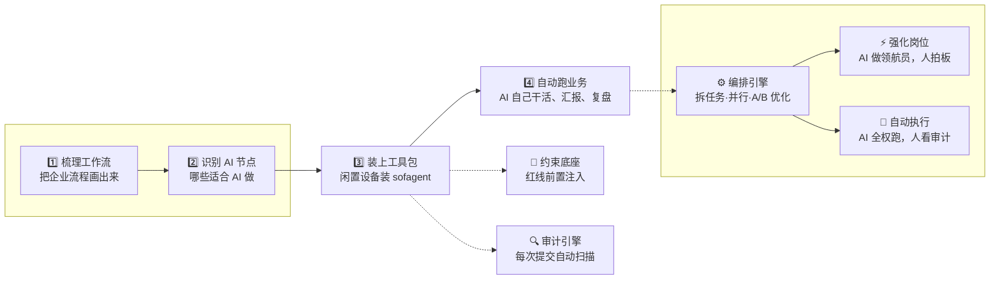
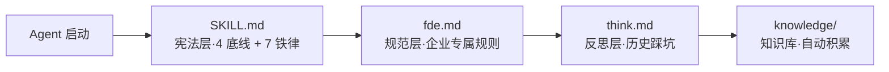
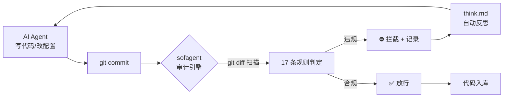
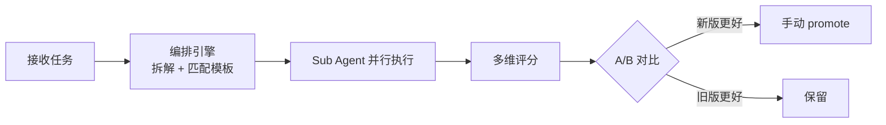

# sofagent

> 🌐 [English abridged version →](README.en.md) | 🇨🇳 中文完整版

<p align="center">
  
</p>

<p align="center">
  <strong>sofa + agent = sofagent / 沙发特工</strong><br/>
  <em>做的不是帮企业「接上 AI」——是帮企业「用对 AI」。</em>
</p>

<p align="center" style="color:#64748B;font-size:14px;">
  Agent Harness 中间件<br/>
  约束行为管得住，审计变更有硬证据，经验沉淀可跨设备共享
</p>

<p align="center">
  <a href="https://github.com/KongFangXun/sofagent/actions/workflows/verify.yml"></a>
  <a href="./LICENSE"></a>
  <a href="./CHANGELOG.md"></a>
</p>

---

## 为什么需要 sofagent？

87% 的中小企业 AI 项目在半年内停摆。不是技术不行——是这三道坎：

| 🚫 预期太高 | 🔧 技术主导 | 👻 装了没人管 |
|:--|:--|:--|
| 买了一堆 AI 工具，以为什么都能干。不是 AI 不行——是没人梳理工作流，不知道从哪下手 | 技术视角看不到业务节点。AI 落地不是 IT 项目，是业务改造 | AI 干得好不好没人知道。行为没约束、结果缺审计——出了问题找不到责任人 |

**sofagent 做的事**：FDE 就像一个工头，带着一群 AI 工人干活——进场先梳理工作流、识别 AI 节点、装上工具包、让 AI 自己跑业务。不用请顾问、不用养 AI 团队。

---

## 怎么装？

```bash
npm install -g @sofagent/audit && sofagent-audit --init
```

装完改个文件提交试试——hook 会先跑审计再放行：

```bash
echo "API_KEY=sk-123456" > .env && git add .env && git commit -m "test"
# → ⛔ A1 不碰敏感：.env 包含密钥格式，拦截提交
```

> 需要 Node.js ≥ 18 + bash + git。macOS / Linux 全功能，Windows 实验性。[完整安装说明](./docs/HANDBOOK.md)

---

## FDE 怎么工作？

FDE（Forward Deployed Engineer）进驻企业走四步——[完整指南 → FDE/FDE.md](./FDE/FDE.md)



第二步是关键——不是所有环节都适合 AI 全自动。FDE 把节点分成两类：

| 节点类型 | 怎么跑 | 人做什么 | sofagent 做什么 |
|------|------|------|------|
| ⚡ **强化岗位** | AI 做领航员辅助出方案，规则可描述 | 决策、审批、签字 | 约束底座确保 AI 不越界，审计引擎记录每一次建议 |
| 🔄 **自动执行** | AI 全权执行，自动跑完整个流程 | 看审计报告、定期抽查 | 三引擎全开：约束→执行→审计→反思循环 |

不用请顾问、不用养 AI 团队——FDE 走完四步就撤离，AI 节点留在企业自己跑。

### 三个引擎

#### 🧭 约束底座

开工前把规则注入 Agent 上下文——让它知道红线在哪。



四层加载链自动注入，Agent 会话一开始就带着约束。全平台可用——OpenClaw 通过 Hook 强制注入，其他平台 Agent 主动 Read。

#### 🔍 审计引擎

每次 git commit 自动扫描——改了什么就是什么，赖不掉。



不依赖 AI 自觉——看的是 git diff 硬证据。全平台可用，装 pre-commit hook 即可。

#### ⚙️ 编排引擎（实验性）

把大任务拆小、多 Sub Agent 并行执行、A/B 对比找更优方案。FDE 进场时生成编排方案，之后节点自己跑。



编排引擎当前走 ao compose（agency-orchestrator），DeepAgents 接入层已就绪。迁移路线：v1.0.6 compose 迁到 DeepAgents → v1.0.7 ao 退役 + A/B 自动切换。详见 [ROADMAP](./ROADMAP.md)。

> 🆕 **v1.0.5**：[Ontology](./docs/ARCHITECTURE.md#行业印证palantir-同构) 统一层 + Work模板市场 行业模板 + Agent Dashboard + 原子写入 + fail-closed 安全 + A9 分级安全 + 首次运行分类器

---

## 和现有工具有什么区别？

| | sofagent | detect-secrets | pre-commit hooks |
|------|:--:|:--:|:--:|
| 密钥检测 | ✅ | ✅ | ❌ |
| Agent 越界检测 | ✅ | ❌ | ❌ |
| 注入攻击检测 | ✅ | ❌ | ❌ |
| 流程合规（改前读/改后测） | ✅ | ❌ | ❌ |
| 知识库越权 | ✅ | ❌ | ❌ |
| 配置删除检测 | ✅ | ❌ | ❌ |
| 安装复杂度 | 一行命令 | 一行命令 | 需手写规则 |

---

## 效果怎么样？

> 🔬 Hugging Face 实验：同一模型不改权重，仅优化外层 Harness，在法律 Agent 基准中从 3.5% 跃升至 80.1%（76 分差全部来自外层机制）。[详情](./docs/ARCHITECTURE.md)

- 核心逻辑 **470+ tests 全绿**（diff-parser / config-loader / rules A1-A15 / reporter）
- **17 条审计规则**：11 纯 git-diff（A1-A6,A9-A11）+ 4 需 Agent 日志（A7-A8,A12-A13）+ 2 扩展（A14 知识库越权·事后审计提醒、A15 约束验证），覆盖密钥泄漏、越界修改、注入攻击、知识库越权等
- ⚠️ A14 是**事后审计提醒**而非运行时访问控制——Agent commit 前仍可能访问受限数据，A14 让管理员能在审计中发现越权行为
- MIT 许可证，代码、文档、模板随便用

> ⚠️ 编排引擎需要 DeepAgents 环境，能跑但还在打磨。[已知局限](./docs/LIMITATIONS.md)

---

## 你需要哪个？

| 你的场景 | 用什么 |
|---------|--------|
| 只想拦截密钥泄漏 | `npm install -g @sofagent/audit` 就够了 |
| 想管住 Agent 全流程 | 审计引擎 + 约束底座（install.sh） |
| 想自动编排 Agent 任务 | + 编排引擎（DeepAgents Sub Agent） |

---

## 延伸阅读

| 你想了解 | 看哪里 |
|---------|--------|
| 怎么装、怎么用、常见问题 | [HANDBOOK](./docs/HANDBOOK.md) |
| 为什么这么设计 | [ARCHITECTURE](./docs/ARCHITECTURE.md) |
| 安全声明 | [SECURITY](./SECURITY.md) |
| 已知局限 | [LIMITATIONS](./docs/LIMITATIONS.md) |
| 版本路线图 | [ROADMAP](./ROADMAP.md) |
| 贡献指南 | [CONTRIBUTING](./CONTRIBUTING.md) |
| 企业部署（FDE 工具包 + Work模板市场 模板） | [FDE/](./FDE/) \| [Work模板市场](./work模板市场/) |

---

## 贡献与致谢

欢迎提 Issue 和 PR，尤其挑刺的那种。[CONTRIBUTING.md](./CONTRIBUTING.md) · [致谢](./docs/THANKS.md)

> 我叫孔放勋，一个只懂点前端代码的产品经理。sofagent 的代码由 AI 模型编写，作者做产品决策和终审。每个版本经独立模型评审。
