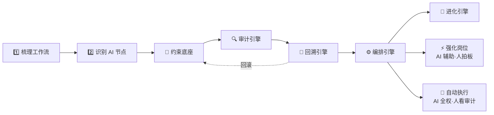
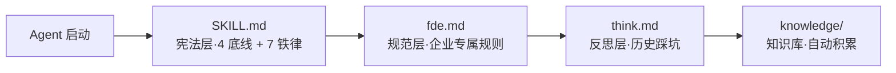
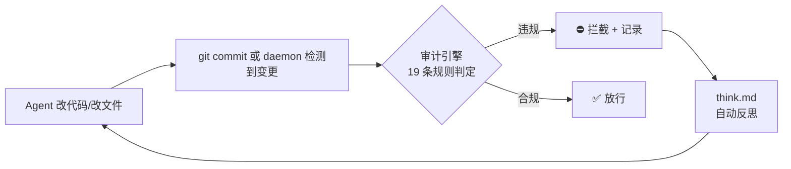
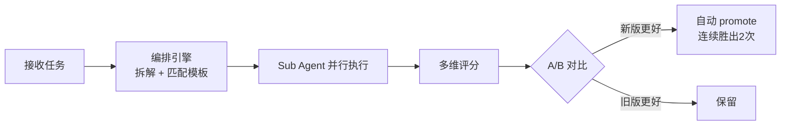
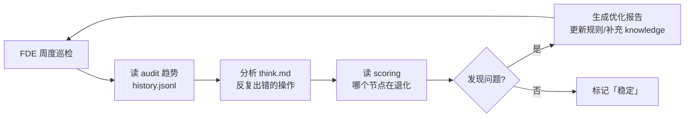

# sofagent

> 🌐 [English abridged version →](README.en.md) | 🇨🇳 中文完整版

<p align="center">
  <a href="https://sofagent.ai">
    
  </a>
</p>

<p align="center">
  <strong>sofa + agent = sofagent / 沙发特工</strong><br/>
  <em>做的不是帮企业「接上 AI」——是帮企业「用对 AI」。</em>
</p>

<p align="center" style="color:#64748B;font-size:14px;">
  Agent Harness 中间件<br/>
  约束 · 审计 · 回溯 · 编排 · 进化：管住 Agent 从部署到持续优化的全生命周期
</p>

<p align="center">
  <a href="https://github.com/KongFangXun/sofagent/actions/workflows/verify.yml"></a>
  <a href="./LICENSE"></a>
  <a href="./CHANGELOG.md"></a>
</p>

---

**Gateway 管怎么跑，sofagent 管跑没跑对——五个引擎，一套搞定。**

🧭 约束底座 · 🔍 审计引擎 · 🔄 回溯引擎 · ⚙️ 编排引擎 · 🧬 进化引擎

---

## 为什么需要 sofagent？

很多中小企业上了 AI 工具，半年后就吃灰了。不是技术不行——是这三个问题：

| 企业的问题 | sofagent 怎么做 |
|------|------|
| 🚫 买了一堆工具，不知道从哪下手 | FDE 进场梳理工作流，识别 AI 节点，装完就走 |
| 🔧 技术主导，业务规则写不了代码 | fde.md 用业务语言写规则（不碰客户数据、大额需审批） |
| 👻 装了没人管，改坏了不知道、半年水平不变、出事找不到人 | 每次改动自动审计 + 快照回滚 + 编排拆任务并行 + 周度巡检自动优化 |

不用请顾问、不用养 AI 团队。FDE 进场四步走，交付完离场——AI 节点留在企业自己跑。与 AgentLoop 的区别：它观测 Agent 怎么想（运行时轨迹、SaaS），sofagent 审计 Agent **改了什么**（文件 diff、本地、MIT 开源）。

---

## 怎么装？

```bash
npm install -g @sofagent/audit && sofagent-audit --init
```

装完三步体验：

```bash
# 1. 看约束规则——Agent 会带着这些红线干活
sofagent-audit --help | head -5

# 2. 跑审计——改个文件试试
echo "API_KEY=sk-123456" > .env && git add .env && git commit -m "test"
# → ⛔ A1 不碰敏感：.env 包含密钥格式，拦截提交

# 3. 看快照——每次审计后自动存档
sofagent-audit --timeline
```

> 需要 Node.js ≥ 18 + bash + git。macOS / Linux 全功能，Windows 实验性。[完整安装说明](./docs/HANDBOOK.md)

---

## FDE 怎么工作？

FDE 进驻企业做两件事——梳理 + 识别，后面引擎接管。



第二步是关键——不是所有环节都适合 AI 全自动。FDE 把节点分成两类：

| 节点类型 | 怎么跑 | 人做什么 | sofagent 做什么 |
|------|------|------|------|
| ⚡ **强化岗位** | AI 做领航员辅助出方案，规则可描述 | 决策、审批、签字 | 约束底座确保 AI 不越界，审计引擎记录每一次建议 |
| 🔄 **自动执行** | AI 全权执行，自动跑完整个流程 | 看审计报告、定期抽查 | 五引擎全开：约束→编排→审计→回溯→进化循环 |

FDE 走完四步就撤离，AI 节点留在企业自己跑。

### 五个引擎

> 💡 **sofagent 和 Gateway 的关系**：企业级 AI 绕不开 Gateway（统一入口/路由/编排/会话）。
> OpenClaw/DeepAgents 就是你的 Gateway。sofagent 不替代 Gateway——它挂在 Gateway 里面，管 Agent 行为治理：
> **Gateway 是高速公路，sofagent 是交规 + 测速摄像头 + 驾校教练。**

> 🔮 **v1.1.0 预告**：包结构纯度重构——audit 只做审计，其余 10 个包独立。现有 `npm install -g @sofagent/audit` 用户无感知迁移。

#### 🧭 约束底座

开工前把规则注入 Agent 上下文——让它知道红线在哪。



四层加载链自动注入，Agent 会话一开始就带着约束。全平台可用——OpenClaw 通过 Hook 精确注入，其他平台 Agent 主动 Read，v1.0.7+ Sub Agent 启动时自加载（`buildConstrainedSystemPrompt`）。

#### 🔍 审计引擎

每次 git commit 或文件变更时自动扫描——改了什么就是什么，赖不掉。



不依赖 AI 自觉——看的是 git diff 硬证据。**0 token 消耗——纯正则引擎，不调 LLM。** 核心规则纯看 git diff，不需要 Agent 配合。

> v1.1.0 将拆为独立 `@sofagent/audit` 包。v1.0.8+ 内嵌 isomorphic-git + daemon 文件监控，不需 git commit。

#### 🔄 回溯引擎

每次审计后自动快照存档——违规时推送通知 + 建议回滚，出了事能回到改之前：

| 结果 | 自动动作 | 用户看到什么 |
|------|---------|------------|
| ✅ PASS | 自动快照存档 | 静默 |
| ⚠️ WARN | 存档 + 标记 | daemon-notice.md 告警 + 可选 Webhook |
| ❌ FAIL | 存档 + 建议回滚 | Webhook 推送 + 终端标红 |

```bash
sofagent-audit --timeline          # 快照时间线
sofagent-audit --timeline --json   # JSON 输出
sofagent-audit --revert <SHA>      # 回滚到任意快照
```

sofagent 是**行车记录仪**，不是安检——不管什么 Agent、什么平台，事后审计 + 回溯恢复，不依赖任何平台。

#### ⚙️ 编排引擎

把大任务拆小、多 Sub Agent 并行执行、A/B 对比找更优方案。



当前走 DeepAgents（v1.0.7 ao 完全退役）。`sofagent-audit compose --task` CLI 入口——**任何 Agent 平台都能用编排引擎**。详见 [ROADMAP](./ROADMAP.md)。

#### 🧬 进化引擎（v1.0.8+）

FDE Agent 不只部署一次——部署完成后转为**持续优化角色**。每周自动巡检审计趋势 + 反思记录，发现退化就优化。



| 模式 | 时机 | 做什么 |
|------|------|------|
| **deploy** | 首次部署 / 业务大变更 | 梳理工作流 → 识别 AI 节点 → 构建知识库 → 安装底座 |
| **sustain** | 每周自动 / 手动触发 | 读 audit 趋势 → 分析 think.md → 生成优化报告 → 更新规则 |

```bash
# 手动触发
sofagent-audit subagent run fde --mode sustain --task "巡检所有节点"
```

五个引擎形成闭环：**约束定红线 → 编排拆任务 → 审计验结果 → 回溯保安全 → 进化越用越好**。

---

## 效果怎么样？

> 🔬 Hugging Face 实验：同一模型不改权重，仅优化外层 Harness，法律 Agent 基准 3.5%→80.1%（76 分差全部来自外层机制）。[详情](./docs/ARCHITECTURE.md)

装上就跑通，不靠 Agent 自觉：

| 维度 | 数据 | 什么意思 |
|------|------|------|
| 审计引擎稳定性 | `npm test` 全绿 — diff-parser / A1-A17 / reporter / init 全覆盖 | 改了代码就能查，不会被绕过 |
| 审计覆盖率 | 19 条规则，覆盖密钥泄漏、越界修改、注入攻击、盲改、知识库越权 | 最常见的 Agent 翻车模式都拦住了 |
| 平台覆盖 | git commit 审计（开发者）+ daemon 文件审计（非开发者） | 不管谁改的文件，都能审计 |
| 开源协议 | MIT | 随便用，代码、文档、模板都行 |

---

## 内置 Agent（v1.0.8）

| Agent | 调用方式 | 什么时候自动触发 |
|------|------|------|
| **FDE 部署工程师** | `@sofagent-fde` | 部署完成后 suggest 后续巡检 |
| **合规审计员** | `@sofagent-audit` | 每次 commit / FDE 部署 / LOOP 任务闭环 |

---

## 你需要哪个？

| 你的场景 | 用什么 |
|---------|--------|
| 只想拦截密钥泄漏 | `npm install -g @sofagent/audit` |
| 管住 Agent 全流程 | 审计引擎 + 约束底座（install.sh） |
| 自动编排 Agent 任务 | + 编排引擎（DeepAgents Sub Agent） |

> ⚠️ **当前版本（v1.0.9）覆盖范围**：开发者岗位（git commit 审计）+ 非开发岗位（文件系统审计）全覆盖。

### 两种部署节点（v1.0.7+）

sofagent 支持两种节点类型，按需选择：

| 节点类型 | 适合谁 | 需要 OpenClaw | 编排引擎怎么用 | 约束怎么注入 |
|---------|--------|:--:|------|------|
| **自动运行节点** | 企业无人值守设备 | ✅ 必须 | OpenClaw Channel + DeepAgents 内部 API | OpenClaw Hook 精确注入 |
| **个人增强节点** | 个人开发者用 WorkBuddy/Codex/Claude Code | ❌ 不需要 | `sofagent-audit compose --task` CLI | Sub Agent 启动时自加载 |

> v1.0.7 的 Sub Agent 约束自加载（`buildConstrainedSystemPrompt`）让约束不依赖任何 Agent 平台的 Skill 系统——Sub Agent 启动时直接读 `.sofagent/` 文件，平台换了约束不丢。

---

## 延伸阅读

| 你想了解 | 看哪里 |
|---------|--------|
| 怎么装、怎么用、常见问题 | [HANDBOOK](./docs/HANDBOOK.md) |
| 为什么这么设计 | [ARCHITECTURE](./docs/ARCHITECTURE.md) |
| 安全声明 | [SECURITY](./SECURITY.md) |
| 已知局限 | [LIMITATIONS](./LIMITATIONS.md) |
| 版本路线图 | [ROADMAP](./ROADMAP.md) |
| 贡献指南 | [CONTRIBUTING](./CONTRIBUTING.md) |
| 企业部署（FDE 工具包 + Work模板市场 模板） | [FDE/](./FDE/) \| [Work模板市场](./work模板市场/) |

---

## 贡献与致谢

欢迎提 Issue 和 PR，尤其挑刺的那种。[CONTRIBUTING.md](./CONTRIBUTING.md) · [致谢](./docs/THANKS.md)

> sofagent 由孔放勋设计，代码由 AI 模型编写，每个版本经独立模型评审。
