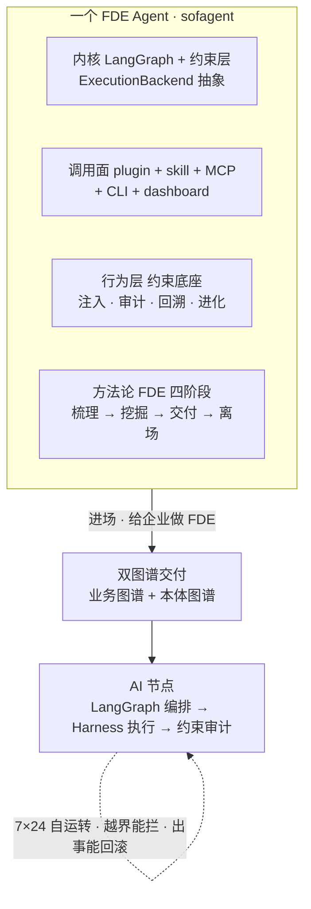
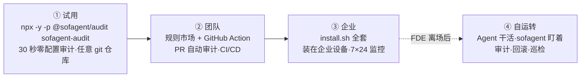

<p align="center">
  
</p>

<p align="center">
  <a href="https://github.com/KongFangXun/sofagent/actions/workflows/verify.yml"></a>
  <a href="./LICENSE"></a>
  <!-- ⚠️ bump 版本时手动同步此 badges 版本号（Version-vX.Y.Z） -->
  <a href="./CHANGELOG.md"></a>
</p>

<p align="center">
  <a href="README.en.md">English</a> · <a href="#这是什么">这是什么</a> · <a href="#快速开始">快速开始</a> · <a href="#fde-方法论">FDE 方法论</a> · <a href="#三个入口从-30-秒到全套部署">三个入口</a> · <a href="#为什么选-sofagent">为什么选</a> · <a href="#文档">文档</a> · <a href="https://github.com/KongFangXun/sofagent">⭐ Star</a>
</p>


---

## 这是什么

**sofagent 是一个开源 FDE Agent**（MIT）——进场梳理业务流、构建本体图谱、部署 AI 节点、7×24 审计每次变更，越界能拦、出事能回滚。它以 [FDE Skill](https://clawhub.ai/kongfangxun/skills/sofagent) 形态在 ClawHub 分发（帮 SMB · OPC 的每个人成为自己业务的 FDE 的方法论 Skill），装到企业设备后以**约束层（Harness）引擎**长期运行（注入·审计·回溯·进化四种能力，daemon 为其常驻载体）。

> 🏗️ **产品形态 = 一个 FDE Agent**：sofagent 不是某个入口级 Agent，而是**把 Agent 内核变成 FDE Agent 的封装**——以 LangGraph + 约束层为开源内核（ExecutionBackend 抽象，可扩展其他 Agent 运行时；DeepSeek Harness 为商业侧可选内核），plugin + skill + MCP + CLI + dashboard 构成完整调用面，约束底座（注入·审计·回溯·进化）+ FDE 方法论构成行为层。封装后的整体就是一个 FDE Agent：进场梳理业务流、构建本体图谱、部署 AI 节点、离场后 7×24 自运转，每次干活受审计。
>
> 🔄 **自举**：它给自己做的第一份 FDE，就是 sofagent 自己——项目自身就是一条 FDE 业务流（梳理 → 节点 → 双图谱交付），训练引擎也围绕 FDE（怎么让 FDE 更好、怎么让数据飞轮转起来）。



> 🏞️ 大厂给你"水"（大模型）和"河床"（Agent 平台），但水是原水，你不敢直接喝。sofagent 是帮你把河里的水让整个城市用起来的工程——堤坝不让水泛滥、自来水厂把原水变直饮水、管网把水送到每家每户的水龙头。模型给 90% 的智力，sofagent 补 10% 的可靠执行。

### 和裸 Agent 有什么不同

| 维度 | 裸 Agent（ChatGPT / Copilot 等） | sofagent |
|:-----|:------|:------|
| 变更审计 | 可自行配 pre-commit + gitleaks/detect-secrets 等工具链（通用扫描器，覆盖面广） | git diff 24 条规则面向 Agent 行为的硬证据判定，装好即用 |
| 越界拦截 | 需自行拼装 hooks / 规则 | 违规当场阻断 + 审计留证 |
| 出事回滚 | 手动翻 commit | 一键快照回到任意节点 |
| 经验积累 | 每次从零开始 | 自动沉淀进知识库（think.md + Dream Cycle + skillopt 已实装），效果需随使用持续迭代观察 |

> ℹ️ 对比维度基于能力差异，不针对特定产品；通用扫描器/框架（pre-commit / gitleaks / detect-secrets 等）与 sofagent 互补而非对立。

> ℹ️ **诚实边界**：通用密钥扫描器（[gitleaks](https://github.com/gitleaks/gitleaks) / detect-secrets）做**全量历史扫描**、模式库更广（[gitleaks 官方模式库 100+ 规则](https://github.com/gitleaks/gitleaks/tree/master/config)）；sofagent 审计专注**当前 diff 的硬证据 + Agent 行为审计**（越界/注入/权限维度是扫描器不做的）。两者互补，不互替——强密钥合规场景建议并用。
>
> ⚠️ **诚实边界**：当前为**单机单用户**设计，多 Agent 共享同一知识库/审计历史——多人/多部门共用需等租户隔离（ROADMAP v1.4.7 G7）。任务日志（task/logs）明文落盘，含任务摘要/代码片段/API 响应摘要/对话摘要——静态加密当前覆盖审计历史主链，task/logs 未覆盖；企业部署前读 [SECURITY](./SECURITY.md)。

## 核心特性

**FDE 交付（进场 → 部署 → 离场 → 自运转）**

- 🧭 **进场梳理业务流**——五要素深挖 + 三问判定法，把每个岗位环节摸清，算清每个 AI 节点值多少钱
- 🤖 **部署 AI 节点**——三层交付物（文档层 + Skill 层 + 运行层），装进你已有的 AI 工具，从"你干活"变"你派活"
- 🏠 **离场后常驻**——FDE Agent 留下巡检、审计、优化，7×24 在线，人离场治理不离开

**治理保障**

- 🔍 **零配置审计**——`npx -y -p @sofagent/audit sofagent-audit`，任何 git 仓库秒级审计最近一次 commit（实测环境：Apple Silicon（M 系列）macOS、预热缓存（非冷启动）、quick 模式单次约 1.1s、5 万行 diff 约 6.1s；数值为单机实测参考值，非基准承诺，不同机器/盘速会有差异。首次 npx 下载约 30 秒）
- 🧱 **24 条审计规则**（quick 零配置默认跑 17 条；完整 24 条 = 17 默认 + 7 扩展经 config 启用，需 `--init` 装 hook 走完整引擎）——密钥泄漏、越界编辑、注入防御、权限红线，git diff 硬证据判定，违规当场拦截
- 🛡️ **AgentShield 五类配置面扫描**（v1.3.7 起，确定性静态分析·零 LLM 自评）——对 MCP 风险（mcp-risk）/ hook 注入（hook-injection）/ Agent 配置（agent-config）/ 增强密钥（secret-enhanced）/ 影子 AI（shadow-ai）五类面做静态扫描，与 24 条 git-diff 规则互补（详见 [SECURITY](./SECURITY.md)）
- 🛡️ **自动快照回溯**——每次审计后自动存档，出事一键回到任意快照

## 快速开始

> ⚠️ **企业用户先读** [LIMITATIONS §三](./docs/LIMITATIONS.md#三安全与信任模型局限)——`config.yml` 默认**非 fail-closed**（规则可被 Agent 篡改绕过），多租户隔离尚未落地。强合规场景建议 CI 兜底 + 文件权限锁（`chmod 444 .sofagent/config.yml`），不要用单机默认配置直接上生产。

**30 秒，零配置**——在任何 git 仓库跑一次审计（开发/测试场景；强合规场景先读 [LIMITATIONS §三](./docs/LIMITATIONS.md#三安全与信任模型局限)——明文存储与多租户隔离是已披露的当前边界）：

```bash
npx -y -p @sofagent/audit sofagent-audit
```

> 💡 `sofagent-audit` 是 quick 只读审计（审计最近一次 commit，默认安全无副作用）；`sofagent-audit-full` 是完整审计，需显式指定操作（如 `--diff <range>` / `--init` 等）。
>
> ⚠️ **quick 模式范围**：quick 是零配置快速审计，跑 **17 条默认规则**（A3 任务越界 / A9 commit msg 注入检测生效——quick 模式自动读取最近一次 commit 的 message，commit msg 取不到时 A9 由引擎按无输入处理（标跳过）；需日志的规则走降级判定；**7 条扩展规则默认不加载**——完整 24 条 = 17 默认 + 7 扩展）。完整防护（commit msg 注入拦截 + 越界检查 + hook 自动审计）需 `--init` 安装 git hook 走完整引擎。详见 [LIMITATIONS §三](./docs/LIMITATIONS.md#三安全与信任模型局限)。

拦截特定格式密钥泄漏时是这样的（真实输出）：

> ℹ️ A2 检测 AWS AKIA、OpenAI sk-*、GitHub ghp_、PEM 私钥等已知格式；通用密钥形态（password=、secret 裸值）暂不覆盖——保守设计防误报。详见 [LIMITATIONS §三 A2](./docs/LIMITATIONS.md#三安全与信任模型局限)。

<p align="center">
  
</p>

<p align="center"><sub>v1.3.x 示例输出</sub></p>

**完整安装**（Node.js ≥ 18，先下载审查再执行）——**装在企业跑 AI 节点的设备上**：

```bash
curl -fsSL https://raw.githubusercontent.com/KongFangXun/sofagent/refs/tags/v1.3.9/bootstrap.sh -o bootstrap.sh
less bootstrap.sh          # 先看一眼脚本内容，确认安全
bash bootstrap.sh && rm bootstrap.sh
sofagent-audit --init      # 装 git hook，之后每次 commit 自动审计
sofagent-audit --doctor    # 验证环境（可选）
```

> 💡 所有安装脚本只写入 `~/.sofagent/`，不修改系统文件。`--no-verify` 可以跳过 commit-msg 审计——它防的是诚实 Agent 的疏忽，不是恶意绕过；被跳过的 commit 会由 post-commit hook 事后对账留痕（命中拦截记录会提示「疑似绕过」，可用 `--verify-commit <SHA>` 复核），但**不阻断**。个人开发者的兜底就三件事：跑 CI 侧 `sofagent-audit --diff`、定期 `--doctor`、翻看审计记录。详见 [LIMITATIONS](./docs/LIMITATIONS.md)。
>
> 📌 **install.sh 是企业设备安装器**——装在跑 AI 节点的服务器/电脑上，给 Agent 当约束层引擎（注入·审计·回溯·进化四能力 + daemon 常驻巡检 + 单机 dashboard）。FDE 自己的电脑不需要跑 install.sh，FDE 的工具是 [FDE Skill](https://clawhub.ai/kongfangxun/skills/sofagent)（方法论）。详见 [部署架构](./docs/ARCHITECTURE.md#安装包边界与部署架构v132-定位校准)。
>
> 📌 **bootstrap.sh 和 install.sh 的关系**：bootstrap.sh 是 install.sh 的一行下载包装器——`curl bootstrap.sh | bash` 等价于"下载 install.sh + 运行 install.sh"。两个脚本装的东西完全一样，bootstrap 只是省去手动 clone/下载的步骤。

更多安装方式（clone 安装 / npx 完整安装 / 最小安装 / 企业部署）见 [HANDBOOK](./docs/HANDBOOK.md)。企业用户想直接用 FDE 方法论梳理业务流，看 [FDE/README.md](./FDE/README.md)（零依赖，不需要 Node.js；15 分钟最短路径见其「15 分钟最短路径」小节）。

## FDE 方法论

很多企业上 AI 的路径是反的——先选模型、搭平台、买 Agent，结果没人用。问题不在技术，在于**还没搞清楚自己的业务流程，就想让 AI 接管**。

多数工具教你怎么造 Agent，sofagent 先解决**AI 该放在哪**——五要素深挖和三问判定法，把这个判断从拍脑袋变成可复制的方法论：

| 阶段 | 做什么 | 产出 |
|------|--------|------|
| ① 梳理 | **五要素深挖**——按岗位把每个环节的输入 / 输出 / 负责人 / 耗时 / 痛点摸清 | 企业画像 |
| ② 判定 | **三问判定法**——从业务流中的**业务节点**识别哪些可 AI 化：🔄 自动执行 / ⚡ 强化岗位 → **AI 节点**，👤 暂不动 → Human 节点，按 ROI 排优先级 | 节点方案 + 年节省金额 |
| ③ 交付 | **三层交付物**——文档层 + Skill 层 + 运行层，让 AI 节点真的跑起来 | 本体数据（ontology）+ workflow.yml + skills/ |

完整方法论（四阶段十二步）见 [FDE/GUIDE.md](./FDE/GUIDE.md)——半天精读，读完能独立做 FDE。

> 💾 **部署完别急着走**：单个节点的 workflow（Agent 的能力）用 LangGraph 定义好后，经 DSH（DeepSeek Harness 执行后端，商业侧可选组件，非开源仓库内交付）直接「烧」进 U 盘——U 盘就变成一个节点、一把 key，插到哪台机器哪台就能跑（拔掉零残留）。开源版默认执行后端为 LangGraph，DSH 为商业增强。详见 [HANDBOOK · USB 一键烧录](./docs/HANDBOOK.md#近期版本新功能速览)。

## FDE Skill 体系

部署 AI 节点只是第一步——上面讲的是**怎么梳理、放哪里**，接下来是**怎么让它每次都守规矩**。随节点一起加载的 FDE Skill 体系解决这个问题：

- 📜 **SKILL.md**——唯一主入口，由你的 AI 工具加载：按阶段路由到对应子 Skill，岗位规范按任务类型自动注入（梳理 / 审计 / 编排）
- 🧩 **阶段子 Skill**——进场 → 深挖 → 量化 → 交付 → 离场五步闭环（`01-entry` → `05-exit`），每一步该做什么、交付什么都定义清楚
- 🔒 **harness 约束骨架**——entry-gate / fde-template / engage / loop-check / task-closure…，从进场到离场每一步都有对应的约束模板
- 🧬 **经验自动沉淀**——think.md 反思 + knowledge 维护，每次任务的经验教训自动进知识库

> 部署的不是裸 Agent，是**带约束骨架的 Agent**——约束是建议性的，审计是强制性的：Agent 可以不遵守约束，但每次变更都逃不过审计。

## 产品一瞥

<p align="center">
  
</p>

<p align="center"><sub>Dashboard 驾驶舱（单文件 HTML · 截图版本 v1.4.0）：规则通过率、审计任务、违规趋势——AI 在干什么，一眼看清。<br>（实际界面以安装态为准）</sub></p>

> 📊 **Dashboard 有三个入口，各归各位**：
>
> | 入口 | 命令 | 形态 | 给谁看 |
> |------|------|------|--------|
> | **终端版** | `sofagent-dashboard --full` | 终端 ASCII 三栏（零前端依赖） | 开发者 / FDE 快速看 |
> | **Web 版** | `sofagent web`（装完即用）· 仓库态 `node tools/dashboard/serve-dashboard.mjs` | 浏览器可视化（localhost:3780） | 老板 / IT 可视化看 |
> | **macOS 双击** | 双击 `start-dashboard.command` | Web 版的 macOS 快捷方式（仅 macOS 双击入口） | macOS 用户 |
>
> ⚠️ **Dashboard 是已用用户的运维面板，不是首次体验入口。** 数据源是 `~/.sofagent/data/` 下的审计记录——没跑过 `sofagent-audit` 就没数据（Web 版降级显示示例数据）。第一次用？先在你的项目里跑 `npx -y -p @sofagent/audit sofagent-audit`，跑完 Dashboard 才有真实数据。

> 👁️ **Agent 视角：审计结果怎么呈现**——Agent 装完 hook 后，每次 commit 都会触发审计：PASS 时静默放行（自动快照存档），违规/拦截时把结果直接打到 Agent 的终端输出里（上方「拦截特定格式密钥泄漏」的终端截图即真实拦截输出），并按 [fde.md 配置](./docs/HANDBOOK.md)推送 Webhook / IM。Agent 侧无独立图形界面，审计结果以终端/IM 推送呈现（详见 [PHILOSOPHY §二 用户感知到的能力](./docs/PHILOSOPHY.md#用户感知到的能力)）。

## 三个入口，从 30 秒到全套部署

不用一开始就做全套决定——从 30 秒体验开始，觉得有用再深入：



| 入口 | 做什么 | 装在哪 | 花多久 |
|------|--------|--------|:----:|
| **`npx -y -p @sofagent/audit sofagent-audit`** | 零配置审计最近一次 commit，秒级出结果（首次 npx 约 30 秒） | 任意 git 仓库（临时） | 30 秒 |
| **`--ruleset` 规则市场** | 加载安全等规则集，或自定义 JSON 规则 | 同上 | 1 分钟 |
| **GitHub Action** | 每次 PR 自动审计，违规标注在 diff 行上 | CI/CD | 配置一次 |
| **install.sh 全套** | 注入·审计·回溯·进化四能力 + daemon 巡检 + dashboard——Agent 的完整约束层 | **企业设备**（跑 AI 节点的服务器/电脑） | FDE 驻场安装 |

**访问模型对照**（同一引擎三种安装粒度，按使用场景选）：

| 访问模型 | 命令 | 生命周期 | 适合场景 |
|---------|------|---------|---------|
| npx 临时 | `npx -y -p @sofagent/audit sofagent-audit` | 用完即走，每次临时下载 | 快速审计任意仓库、CI 外的单次检查 |
| npm install 项目内 | `npm install @sofagent/audit`（项目 devDependency） | 随项目安装，版本锁进 package-lock | 团队项目固定依赖、可复现审计 |
| npm install -g 全局 | `npm install -g @sofagent/audit` | 全局可用，一次安装多次调用 | 本机多仓库日常审计、daemon 常驻 |

sofagent 支持加载可组合的规则集（**规则市场**）——内置安全规则集，也支持社区发布的规则集包。内置 24 条审计规则（quick 默认跑 17 条，扩展 7 条经 config 启用），加载额外规则集可以扩展审计覆盖面：

**规则市场**：

```bash
npx -y -p @sofagent/audit sofagent-audit --list-rulesets      # 看有哪些规则集
npx -y -p @sofagent/audit sofagent-audit --ruleset security   # 加载安全规则集
```

社区规则集以 `sofagent-ruleset-*` npm 包发布，通过 `--ruleset-path` 手动加载（当前不支持 npm 包自动发现）；也支持 `--ruleset-path` 指向你自己的 JSON 规则。

**FDE 进场部署**——两条路径任选：

- **方法论路径**（零依赖）：读 [FDE/GUIDE.md](./FDE/GUIDE.md)，按手册手动梳理业务流，Excel + 人脑也能跑
- **工具路径**（Node.js ≥ 18）：FDE 在企业设备上跑 install.sh 装好约束层后，用自己的 AI 工具说"帮我做 FDE 诊断"，Agent 从进场开始引导

## v1.4.0 新能力

> 📊 **v1.4.0 新能力**（Dashboard 产品化 + 成本审计 + 双插件家族 + 跨设备 + Agentic Browser）：
> - **Dashboard 产品化**：📊 Web 工作明细页（按 Agent / Workflow / 周趋势 / 人工介入四视角）+ **图谱栏**（🗺️ FDE 双图谱：业务图谱 + 本体图谱 + MCP 工具视图 66 tools + skill 加载链四层可视化）+ 单文件 HTML 随 `install.sh` 装到用户机（`worklog.json` 无数据自动降级）
> - **成本审计**：💰 超支告警（WARN only 不拦截）+ `cost_query` MCP tool + `DecisionKind.COST` 决策日志追溯
> - **双插件家族**：🔌 DSH 形态 9 款 `cordis-plugin-sofagent-*`（真实挂载进 DeepSeek Harness，Plugin list 可见 9 个 Enabled）+ 🦞 OpenClaw 形态 4 款 code-plugin（ClawHub 发布就绪）+ Cursor/Claude Code 共享 precommit hook 拦截
> - **跨设备**：🔄 联邦查询端到端（配对 / 加密查询 / 篡改检测 / 离线降级——S320 + S322 双覆盖）+ 📡 远程 API 通道（C/S 控制面契约文档化）
> - **Agentic Browser + 评测**：🌐 navigate/click/screenshot/assert 4 工具注册（MCP 61→66）+ Playwright 真实驱动 + 🔗 MLflow 评测接线（不可达降级不抛）
> - **工程基座**：🔍 审计溯源字段（`whichDataVersion` + `beforeAfter`）+ 🐚 bash 3.2 真实环境全脚本验证
>
> 详见 [v1.4.0 开发日志](./docs/changelog/v1.4/v1.4.0.md)。更早版本见 [CHANGELOG](./CHANGELOG.md)。

## 为什么选 sofagent

| 维度 | 通用 Agent 框架 | sofagent |
|------|----------------|----------|
| 核心问题 | 怎么造 Agent | **AI 该放在哪**（先梳理再部署） |
| 安全保障 | 需自行集成扫描/门禁工具（pre-commit / trufflehog / gitleaks 等） | git diff 硬证据审计 + 运行时拦截 + 一键回滚，开箱即用（扫描器覆盖面对照见上方「诚实边界」注） |
| 审阅方式 | 靠人手动 review（人力瓶颈） | **机器审阅**——24 条规则自动审 + git diff 硬证据，纯 AI 节点也能被审 |
| 知识积累 | 从零开始 | 自动沉淀进 knowledge 知识库（think.md + Dream Cycle 已实装），效果需随使用持续迭代观察 |
| 数据主权 | 云端托管 | 缺省全量本地，可选联邦查询（用户自主配置云同步=数据出本机，见 SECURITY） |
| 部署方式 | 学新平台 | 装进你已有的 AI 工具（Claude Code / Cursor / WorkBuddy…） |

> ℹ️ **平台无关的边界**：核心引擎（审计/约束层）平台无关；hook 自动注入当前仅 OpenClaw 生效，其他平台手动注入约束 + 审计照常。

## 证据与可信度

> 📊 **为什么是现在**：MIT NANDA 实验室《生成式人工智能的鸿沟》报告指出，全球企业过去三年在生成式 AI 上烧了三四百亿美元，**95% 的项目没能产生能写进财务报表的价值**；与此同时，一个叫「前线部署工程师」（Forward Deployed Engineer，FDE）的岗位发布量一年涨了 **729%**（Indeed 2025 数据）。模型不稀缺了，能把模型塞进客户真实业务里的人，才稀缺——sofagent 就是把这件事工程化的开源底座。（数据核验与多机构口径对照见 [VALIDATION §一·治理缺口的代价](./docs/VALIDATION.md#治理缺口的代价三项联网核验证据)，FDE 经济账见 [VALIDATION §四](./docs/VALIDATION.md#四市场印证行业判断被市场买单)。）

> 🔬 **外部独立实验证据**（非官方自测）：Joel Niklaus 的 harness-optimization 研究（[研究代码仓库](https://github.com/JoelNiklaus/harness-optimization)，数据见仓库内实验）显示，同一模型不改权重、仅优化外层 Harness，法律 Agent 基准从 **63.4% → 80.1%（+16.7pp）**。详见 [THANKS.md](./docs/THANKS.md)。

> 🧪 **工程可信度**：2915 测试 / 13 包（12 个含测试）（测试数以 `tools/check/test-count.sh` 判定为准（内置 flaky 重跑机制）；`npm test` 直跑在低内存机器可能出现 mcp 包超时闪红，单独重跑即绿，属环境并发问题非产品缺陷）· 24 条审计规则 · fresh-eyes 独立审查持续运行（审查体系运作见 [docs/guides/review-system.md](./docs/guides/review-system.md)）。性能数据为单机参考值，跨工具横评排期 v1.4.x 与 Benchmark 集成。

## 文档

| 你想了解 | 看哪里 |
|:---------|:--------|
| **全局索引**（所有文档一个入口） | [WIKI](./docs/WIKI.md) |
| 怎么装、怎么用、常见问题 | [HANDBOOK](./docs/HANDBOOK.md) |
| 架构设计（约束层「对内的技术名字」 · 注入链 · 进化机制 · 24 条规则） | [ARCHITECTURE](./docs/ARCHITECTURE.md) |
| 设计哲学 | [PHILOSOPHY](./docs/PHILOSOPHY.md) |
| 行业印证与生态定位（与现有工具的差异） | [VALIDATION](./docs/VALIDATION.md) |
| 版本路线图 | [ROADMAP](./docs/ROADMAP.md) |
| 每个版本做了什么 | [CHANGELOG](./CHANGELOG.md) |
| FDE 诊断方法论（四阶段十二步） | [FDE/GUIDE.md](./FDE/GUIDE.md) |
| 安全声明 · 已知局限 | [SECURITY](./SECURITY.md) · [LIMITATIONS](./docs/LIMITATIONS.md) |
| 贡献指南 | [CONTRIBUTING](./CONTRIBUTING.md) |

---

<p align="center">
  欢迎提 Issue 和 PR，尤其较真的那种 · <a href="./CONTRIBUTING.md">贡献指南</a> · <a href="./docs/THANKS.md">致谢</a><br/>
  <sub>MIT License © <a href="https://github.com/KongFangXun/sofagent">孔放勋</a> · <a href="https://github.com/KongFangXun/sofagent">⭐ 如果 sofagent 帮到你，Star 一下让更多人看到</a></sub>
</p>
