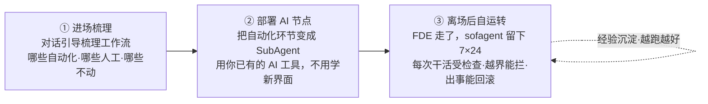
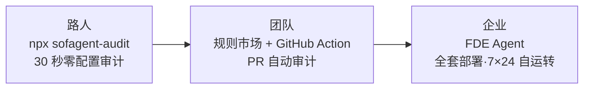

<p align="center">
  
</p>

<p align="center">
  <strong>FDE Agent——进场梳理工作流 · 部署 AI 节点 · 离场后自运转</strong>
</p>

<p align="center">
  <a href="https://github.com/KongFangXun/sofagent/actions/workflows/verify.yml"></a>
  <a href="./CHANGELOG.md"></a>
  <a href="./LICENSE"></a>
</p>

<p align="center">
  <a href="#这是什么">这是什么</a> · <a href="#快速开始">快速开始</a> · <a href="#三个入口从-30-秒到全套部署">三个入口</a> · <a href="#文档">文档</a> · <a href="README.en.md">English</a> · <a href="https://github.com/KongFangXun/sofagent">⭐ Star</a>
</p>

---

## 这是什么

**sofagent 是一个开源 FDE Agent**（Forward Deployed Engineer Agent）——进场帮你梳理业务工作流，把能自动化的环节变成 AI 节点；交付完成后 FDE 离场，AI 节点继续 7×24 自动执行任务，每次干活受审计、越界能拦截、出事能回滚。



> 🏞️ 大厂给你"水"（大模型）和"河床"（Agent 平台），但水是原水，你不敢直接喝。sofagent 是帮你把河里的水让整个城市用起来的工程——堤坝不让水泛滥、自来水厂把原水变直饮水、管网把水送到每家每户的水龙头。模型给 90% 的智力，sofagent 补 10% 的可靠执行。

## 核心特性

- 🧭 **进场梳理工作流**——FDE 对话引导你把业务工作流拆清楚：哪些环节自动化、哪些留给人、哪些不动，产出本体结构（ontology）+ workflow.yml + skills/
- 🤖 **部署 AI 节点**——把自动化环节变成 SubAgent，装进你已有的 AI 工具（WorkBuddy / Codex / Claude Code）里跑，不用学新界面，从"你干活"变成"你派活"
- 🔍 **零配置审计**——`npx sofagent-audit`，在任何 git 仓库 3 秒审计最近一次 commit，不安装任何东西
- 🧱 **24 条审计规则**——密钥泄漏、越界编辑、盲目修改、注入防御、权限红线，git diff 硬证据判定，违规当场拦截
- 🛡️ **自动快照回溯**——每次审计后自动存档，出事一键回到任意快照
- 🧬 **越跑越好**——每次任务的经验教训自动沉淀进知识库，下次干活自动避开同样的坑
- 🖥️ **可视化 Dashboard**——6 页网页控制台（驾驶舱 / AI 节点 / 本体结构 / 知识库…），真实数据驱动
- 🔌 **规则市场 + GitHub Action**——内置 security / sofagent 规则集，支持自定义 JSON 规则；每次 PR 自动审计，违规标注在 diff 行上

## 产品一瞥

<p align="center">
  
</p>

<p align="center"><sub>Dashboard 驾驶舱：规则通过率、审计任务、违规趋势——AI 在干什么，一眼看清</sub></p>

## 快速开始

**30 秒，零配置**——在任何 git 仓库跑一次审计：

```bash
npx sofagent-audit
```

拦截违规时是这样的（真实输出）：

<p align="center">
  
</p>

**完整安装**（Node.js ≥ 18，先下载审查再执行）：

```bash
curl -fsSL https://raw.githubusercontent.com/KongFangXun/sofagent/main/bootstrap.sh -o bootstrap.sh
less bootstrap.sh          # 先看一眼脚本内容，确认安全
bash bootstrap.sh && rm bootstrap.sh
sofagent-audit --init      # 装 git hook，之后每次 commit 自动审计
sofagent-audit --doctor    # 验证环境（可选）
```

> 💡 所有安装脚本只写入 `~/.sofagent/`，不修改系统文件。`--no-verify` 可绕过本地 hook——sofagent 防的是诚实 Agent 的疏忽，不是恶意绕过；高安全场景请在 CI 侧加 `sofagent-audit --diff` 兜底。详见 [LIMITATIONS](./docs/LIMITATIONS.md)。

更多安装方式（clone 安装 / npx 完整安装 / 最小安装 / 企业部署）见 [HANDBOOK](./docs/HANDBOOK.md)。企业用户想直接用 FDE 方法论梳理工作流，看 [FDE/README.md](./FDE/README.md)（零依赖，不需要 Node.js）。

## 三个入口，从 30 秒到全套部署

不用一开始就做全套决定——从 30 秒体验开始，觉得有用再深入：



| 入口 | 做什么 | 花多久 |
|------|--------|:----:|
| **`npx sofagent-audit`** | 零配置审计最近一次 commit，3 秒出结果 | 30 秒 |
| **`--ruleset` 规则市场** | 加载安全等规则集，或自定义 JSON 规则 | 1 分钟 |
| **GitHub Action** | 每次 PR 自动审计，违规标注在 diff 行上 | 配置一次 |
| **FDE Agent** | 进场梳理工作流 → 部署 AI 节点 → 7×24 自运转 | FDE 驻场 |

**规则市场**：

```bash
npx sofagent-audit --list-rulesets      # 看有哪些规则集
npx sofagent-audit --ruleset security   # 加载安全规则集
```

社区规则集以 `sofagent-ruleset-*` npm 包发布，装上自动发现；也支持 `--ruleset-path` 指向你自己的 JSON 规则。

**GitHub Action**——在仓库加 `.github/workflows/sofagent-audit.yml`：

```yaml
on: [pull_request]
jobs:
  audit:
    runs-on: ubuntu-latest
    steps:
      - uses: actions/checkout@v4
        with:
          fetch-depth: 0        # 审计需要完整 diff 历史
      - uses: KongFangXun/sofagent@v1.2.9
        with:
          ruleset: sofagent     # sofagent / security / 社区规则集
```

> 🔬 **外部独立实验证据**（非官方自测）：HuggingFace 上 Joel Niklaus 的 harness-optimization 研究显示，同一模型不改权重、仅优化外层 Harness，法律 Agent 基准从 **63.4% → 80.1%（+16.7pp）**。详见 [THANKS.md](./docs/THANKS.md)。

## 文档

| 你想了解 | 看哪里 |
|:---------|:--------|
| 怎么装、怎么用、常见问题 | [HANDBOOK](./docs/HANDBOOK.md) |
| 架构设计（约束层 · 注入链 · 进化机制 · 24 条规则） | [ARCHITECTURE](./docs/ARCHITECTURE.md) |
| 设计哲学 | [PHILOSOPHY](./docs/PHILOSOPHY.md) |
| 行业印证与生态定位（与现有工具的差异） | [VALIDATION](./docs/VALIDATION.md) |
| 版本路线图 | [ROADMAP](./docs/ROADMAP.md) |
| FDE 诊断方法论（四阶段十二步） | [FDE/GUIDE.md](./FDE/GUIDE.md) |
| 安全声明 · 已知局限 | [SECURITY](./SECURITY.md) · [LIMITATIONS](./docs/LIMITATIONS.md) |
| 贡献指南 | [CONTRIBUTING](./CONTRIBUTING.md) |

---

<p align="center">
  欢迎提 Issue 和 PR，尤其较真的那种 · <a href="./CONTRIBUTING.md">贡献指南</a> · <a href="./docs/THANKS.md">致谢</a><br/>
  <sub>MIT License © <a href="https://github.com/KongFangXun/sofagent">孔放勋</a> · <a href="https://github.com/KongFangXun/sofagent">⭐ 如果 sofagent 帮到你，Star 一下让更多人看到</a></sub>
</p>
