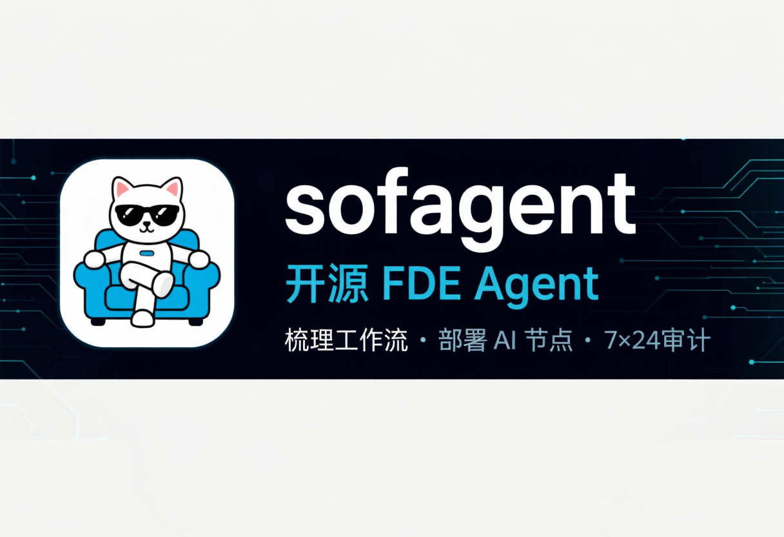
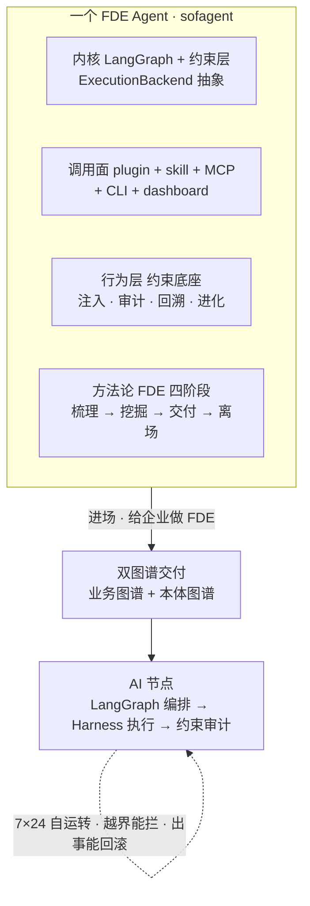
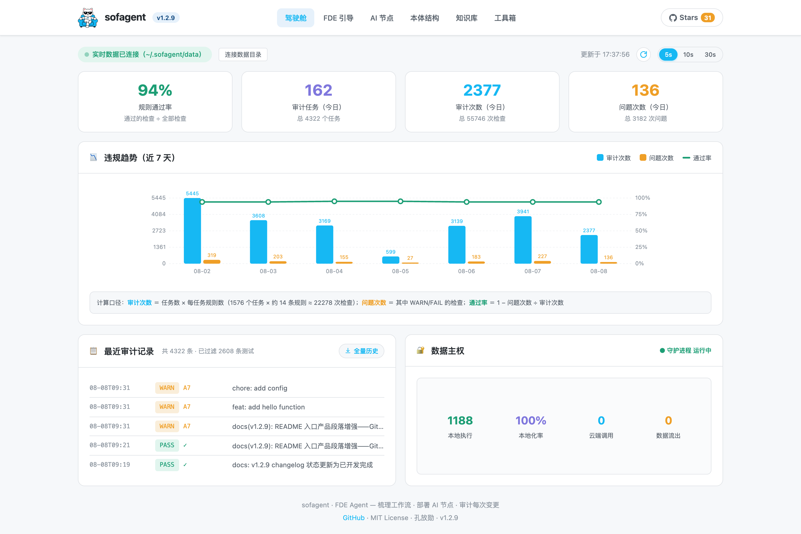
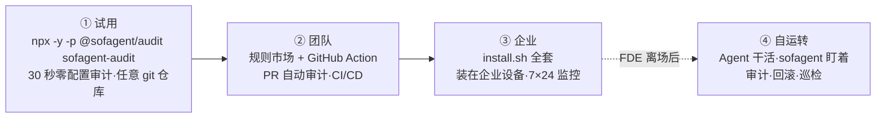

<p align="center"></p>

<p align="center">
  <a href="https://github.com/KongFangXun/sofagent/actions/workflows/verify.yml"></a>
  <a href="./LICENSE"></a>
  <!-- ⚠️ bump 版本时手动同步此 badges 版本号（Version-vX.Y.Z） -->
  <a href="./CHANGELOG.md"></a>
</p>

<p align="center">
  <a href="README.en.md">English</a> · <a href="#这是什么">这是什么</a> · <a href="#核心特性">核心特性</a> · <a href="#什么是-fde-agent">FDE Agent</a> · <a href="#v140结合-deepseek-harness">v1.4.0 × DSH</a> · <a href="#多平台挂载">多平台</a> · <a href="#fde-方法论">FDE 方法论</a> · <a href="#fde-skill-体系">Skill 体系</a> · <a href="#约束层harness">约束层</a> · <a href="#安装">安装</a> · <a href="#使用">使用</a> · <a href="#常见问题">FAQ</a> · <a href="#生态与文档索引">文档</a> · <a href="https://github.com/KongFangXun/sofagent">⭐ Star</a>
</p>

---

## 这是什么

**开源 FDE Agent。**进场，把业务流梳理清楚、把本体图谱构建起来、把 AI 节点部署到位；离场，审计每一次变更，持续优化。

以 [FDE Skill](https://clawhub.ai/kongfangxun/skills/sofagent) 形态在 ClawHub 分发（帮 SMB · OPC 的每个人成为自己业务的 FDE 的方法论 Skill），装到企业设备后以**约束层（Harness）引擎**长期运行。

> 🏞️ 大厂给你"水"（大模型）和"河床"（Agent 平台），但水是原水，你不敢直接喝。sofagent 是帮你把河里的水让整个城市用起来的工程——堤坝不让水泛滥、自来水厂把原水变直饮水、管网把水送到每家每户的水龙头。模型给 90% 的智力，sofagent 补 10% 的可靠执行。

## 核心特性

- 🧭 **进场梳理业务流**——五要素深挖 + 三问判定法，把每个岗位环节摸清，算清每个 AI 节点值多少钱
- 🤖 **部署 AI 节点**——三层交付物（文档层 + Skill 层 + 运行层），装进你已有的 AI 工具，从"你干活"变"你派活"
- 🏠 **离场后常驻**——FDE Agent 留下巡检、审计、优化，7×24 在线，人离场治理不离开
- 🔍 **零配置审计**——`npx -y -p @sofagent/audit sofagent-audit`，任何 git 仓库秒级审计最近一次 commit（单机实测：quick 约 1.1s、5 万行 diff 约 6.1s，口径见 [HANDBOOK](./docs/HANDBOOK.md)）
- 🧱 **24 条审计规则**——密钥泄漏、越界编辑、注入防御、权限红线，git diff 硬证据判定，违规当场拦截（quick 默认 17 条，完整 24 条 = 17 默认 + 7 扩展）
- 🛡️ **自动快照回溯**——每次审计后自动存档，出事一键回到任意快照

## 什么是 FDE Agent

**FDE = Forward Deployed Engineer（前线部署工程师）**——把模型塞进企业真实业务里的人。sofagent 把这个角色做成开源 Agent，四个阶段走完一条完整的 FDE 业务流：

- **一、进场梳理业务流**——五要素深挖 + 三问判定法，把每个岗位环节的输入 / 输出 / 负责人 / 耗时 / 痛点摸清，算清每个 AI 节点值多少钱
- **二、构建双图谱**——业务图谱（系统边界、数据流向）+ 本体图谱（共享语义底座），把企业变成机器可读的结构
- **三、部署 AI 节点**——三层交付物（文档层 + Skill 层 + 运行层），把 AI 节点装进你已有的工具，从"你干活"变"你派活"
- **四、离场持续优化**——离场后 7×24 自动执行任务：巡检、审计、优化，人离场治理不离开

官方 slogan：**梳理业务流 · 构建本体图谱 · 部署 AI 节点 · 审计每次变更**



- **企业 AI 落地的瓶颈不是模型，是部署**——MIT NANDA《生成式人工智能的鸿沟》：95% 的企业 GenAI 项目没能产生能写进财务报表的价值，而 FDE 岗位发布量一年涨了 729%
- **约束层「持续优化」靠机制不靠承诺**——外部独立实验：同一模型仅优化外层 Harness，法律 Agent 基准 63.4% → 80.1%（+16.7pp）——更多核验见 [VALIDATION](./docs/VALIDATION.md) · [THANKS](./docs/THANKS.md)

> 🔄 **自举**：它给自己做的第一份 FDE，就是 sofagent 自己——项目自身就是一条 FDE 业务流（梳理 → 节点 → 双图谱交付），训练引擎也围绕 FDE。

## v1.4.0：结合 DeepSeek Harness

本版核心：正式结合 [DeepSeek Harness](https://github.com/deepseek-ai/deepseek-harness)（简称 DSH），成为完整的 FDE Agent。

**一、为什么选 DSH**：DeepSeek 官方开源 Agent 框架，基于 [Cordis](https://github.com/cordiverse/cordis) 运行时，理念「Everything is a Plugin」——插件化与约束层的平台无关形态天然契合，也是当前结合最深的一个内核。

**二、怎么结合**：约束层四能力（注入 · 审计 · 回溯 · 进化）封装成 9 款 `cordis-plugin-sofagent-*` 插件，全部真实挂载进 DSH（Plugin list 可见 9 个 Enabled），可独立安装、渐进采用：

| 插件 | 职责 |
|------|------|
| `audit` | 变更机器审阅——24 规则 + git diff 硬证据 + 节点级审计 |
| `rollback` | 出错逆序撤销——git snapshot → effect disposer |
| `inject` | 启动注入企业约束——四层加载链 |
| `evolve` | 经验沉淀——think.md 反思 + Dream Cycle + skillopt |
| `ontology` | 共享语义底座 + 知识检索（ontology_* tools + search_knowledge） |
| `commons` | 能力公地五环——commons_* tool 复用 |
| `gate` | 验收不过不放行——机器可判定验收 + 人审 |
| `daemon` | 7×24 巡检 + 健康监测 + webhook 推送 |
| `fde` | 进场方法论六 tool 闭环（fde_interview / classify / quantify / derive / distill / deploy） |

**三、分工**

| 一方 | 提供什么 |
|------|----------|
| DeepSeek Harness（DSH） | **执行体**——模型 + 工具 + 会话 |
| sofagent | **企业约束与审计 + FDE 方法论** |

**两者合一 = 完整 FDE Agent**：DSH 负责「能干活」，sofagent 负责「干得住」——每次变更受审计，越界能拦、出事能回滚。

**本版其他新能力**（详见[开发日志](./docs/changelog/v1.4/v1.4.0.md)，更早版本见 [CHANGELOG](./CHANGELOG.md)）：

- **Dashboard 产品化**：Web 工作明细页（按 Agent / Workflow / 周趋势 / 人工介入四视角）+ 图谱栏（FDE 双图谱：业务图谱 + 本体图谱 + MCP 工具视图 66 tools + skill 加载链四层可视化）+ 单文件 HTML 随 `install.sh` 装到用户机（`worklog.json` 无数据自动降级）
- **成本审计**：超支告警（WARN only 不拦截）+ `cost_query` MCP tool + `DecisionKind.COST` 决策日志追溯
- **插件家族双轨**：DSH 形态 9 款插件（如上）+ OpenClaw 形态 4 款 code-plugin（ClawHub 发布就绪）+ Cursor / Claude Code 共享 precommit hook 拦截
- **跨设备**：联邦查询端到端（配对 / 加密查询 / 篡改检测 / 离线降级——S320 + S322 双覆盖）+ 远程 API 通道（C/S 控制面契约文档化）
- **Agentic Browser + 评测**：navigate / click / screenshot / assert 4 工具注册（MCP 61→66）+ Playwright 真实驱动 + MLflow 评测接线（不可达降级不抛）
- **工程基座**：审计溯源字段（`whichDataVersion` + `beforeAfter`）+ bash 3.2 真实环境全脚本验证

## 多平台挂载

骑在你已有的 Agent 之上，不替代模型，只补可靠执行——约束层平台无关，方法论跟着业务走，不跟着平台走：

| 档位 | 平台 | 约束注入 | 挂载方式 |
|------|------|---------|---------|
| **深度结合** | DeepSeek Harness | ✅ 插件级 | 9 款 `cordis-plugin-sofagent-*` 挂载进运行时（见上章） |
| **完整挂载** | OpenClaw | ✅ 自动 | Hook 注入 + 断路器 |
| | WorkBuddy | ✅ 自动 | Skill 按需加载 |
| **薄挂载** | Claude Code / Codex / Cursor / Gemini CLI | ⚠️ 手动 | 部署宪法 + 种子指令（写入各自配置文件） |

- **自动加载是宿主运行时给的**——Skill 按需加载取决于宿主有没有技能注册表（DSH / OpenClaw / WorkBuddy 有；薄挂载平台以静态配置文件承载）
- **审计兜底平台无关**——`sofagent-audit --install-hook` 走 git hook，任何档位每次 commit 都过 24 条审计，违规硬拦截。约束是建议性的，审计是强制性的

一条命令选定挂载档位：`bash install.sh --platform <平台名>`（全部平台与差异见 [HANDBOOK](./docs/HANDBOOK.md)）

## FDE 方法论

很多企业上 AI 的路径是反的——先选模型、搭平台、买 Agent，结果没人用。问题不在技术，在于**还没搞清楚自己的业务流程，就想让 AI 接管**。

多数工具教你怎么造 Agent，sofagent 先解决**AI 该放在哪**——五要素深挖和三问判定法，把这个判断从拍脑袋变成可复制的方法论：

| 阶段 | 输入 | 做什么 | 产出 |
|------|------|--------|------|
| 一、梳理 | 岗位清单 · 现有系统 | **五要素深挖**——按岗位把每个环节的输入 / 输出 / 负责人 / 耗时 / 痛点摸清 | 企业画像 |
| 二、判定 | 企业画像 | **三问判定法**——从业务流中的**业务节点**识别哪些可 AI 化：🔄 自动执行 / ⚡ 强化岗位 → **AI 节点**，👤 暂不动 → Human 节点，按 ROI 排优先级 | 节点方案 + 年节省金额 |
| 三、交付 | 节点方案 | **三层交付物**——文档层 + Skill 层 + 运行层，让 AI 节点真的跑起来 | 本体数据（ontology）+ workflow.yml + skills/ |

完整方法论（四阶段十二步）见 [FDE/GUIDE.md](./FDE/GUIDE.md)——半天精读，读完能独立做 FDE。

> 💾 **部署完别急着走**：单个节点的 workflow 经 DeepSeek Harness 执行后端直接「烧」进 U 盘——U 盘就变成一个节点、一把 key，插到哪台机器哪台就能跑（拔掉零残留）。开源 9 款插件已挂载进 DSH，烧录即用。

## FDE Skill 体系

部署 AI 节点只是第一步——上面讲的是怎么梳理、放哪里，接下来是怎么让它每次都守规矩。随节点一起加载的 FDE Skill 体系解决这个问题：

- 📜 **SKILL.md**——唯一主入口，由你的 AI 工具加载：按阶段路由到对应子 Skill，岗位规范按任务类型自动注入（梳理 / 审计 / 编排）
- 🧩 **阶段子 Skill**——进场 → 深挖 → 量化 → 交付 → 离场五步闭环（01-entry → 05-exit），每一步该做什么、交付什么都定义清楚
- 🔒 **harness 约束骨架**——entry-gate / fde-template / engage / loop-check / task-closure…，从进场到离场每一步都有对应的约束模板
- 🧬 **经验自动沉淀**——think.md 反思 + knowledge 维护，每次任务的经验教训自动进知识库

> 部署的不是裸 Agent，是**带约束骨架的 Agent**——约束是建议性的，审计是强制性的：Agent 可以不遵守约束，但每次变更都逃不过审计。

## 约束层（Harness）

约束层是 sofagent 的行为底座，四种能力：

- **注入**——Agent 启动时注入企业约束，四层加载链；约束是建议性的
- **审计**——24 条 git diff 硬证据规则（quick 零配置默认 17 条，扩展 7 条经 config 启用）+ AgentShield 五类配置面静态扫描；审计是强制性的，每次变更必审，违规当场拦截
- **回溯**——每次审计后自动快照存档，出事一键回到任意快照
- **进化**——think.md 反思 + Dream Cycle + skillopt，经验自动沉淀进知识库

## 安装

> ⚠️ **企业用户先读** [LIMITATIONS §三](./docs/LIMITATIONS.md#三安全与信任模型局限)——`config.yml` 默认**非 fail-closed**（规则可被 Agent 篡改绕过），多租户隔离尚未落地。强合规场景建议 CI 兜底 + 文件权限锁（`chmod 444 .sofagent/config.yml`），不要用单机默认配置直接上生产。

**30 秒，零配置**——在任何 git 仓库跑一次审计：

```bash
npx -y -p @sofagent/audit sofagent-audit
```

> 💡 quick 跑 17 条默认规则，完整 24 条 + hook 自动审计需 `--init`——详见 [LIMITATIONS §三](./docs/LIMITATIONS.md#三安全与信任模型局限)。

拦截特定格式密钥泄漏时是这样的（真实输出；A2 检测 AWS AKIA、OpenAI sk-*、GitHub ghp_、PEM 私钥等已知格式，通用密钥形态暂不覆盖——保守设计防误报，详见 [LIMITATIONS §三 A2](./docs/LIMITATIONS.md#三安全与信任模型局限)）：

<p align="center"></p>

**完整安装**（Node.js ≥ 18，先下载审查再执行）——**装在企业跑 AI 节点的设备上**：

```bash
curl -fsSL https://raw.githubusercontent.com/KongFangXun/sofagent/refs/tags/v1.3.9/bootstrap.sh -o bootstrap.sh
less bootstrap.sh          # 先看一眼脚本内容，确认安全
bash bootstrap.sh && rm bootstrap.sh
sofagent-audit --init      # 装 git hook，之后每次 commit 自动审计
sofagent-audit --doctor    # 验证环境（可选）
```

> 💡 安装脚本只写入 `~/.sofagent/`。`--no-verify` 可跳过 commit-msg 审计——防的是诚实 Agent 的疏忽不是恶意绕过，被跳过的 commit 由 post-commit 事后对账留痕（提示「疑似绕过」）但不阻断；个人兜底三件事：CI 侧 `sofagent-audit --diff`、定期 `--doctor`、翻审计记录。详见 [LIMITATIONS](./docs/LIMITATIONS.md)。📌 **install.sh 是企业设备安装器**（约束层引擎 + daemon 巡检 + 单机 dashboard；bootstrap.sh 只是它的一行下载包装器）——FDE 自己的电脑不需要跑，FDE 的工具是 [FDE Skill](https://clawhub.ai/kongfangxun/skills/sofagent)（方法论），详见 [部署架构](./docs/ARCHITECTURE.md#安装包边界与部署架构v132-定位校准)。

更多安装方式（clone 安装 / npx 完整安装 / 最小安装 / 企业部署）见 [HANDBOOK](./docs/HANDBOOK.md)。企业用户想直接用 FDE 方法论梳理业务流，看 [FDE/README.md](./FDE/README.md)（零依赖，不需要 Node.js；15 分钟最短路径见其「15 分钟最短路径」小节）。

## 使用

<p align="center"><br/><sub>Dashboard 驾驶舱（单文件 HTML · 截图版本 v1.4.0）：规则通过率、审计任务、违规趋势——AI 在干什么，一眼看清。<br>（实际界面以安装态为准）</sub></p>

> 📊 **Dashboard 有三个入口，各归各位**：
>
> | 入口 | 命令 | 形态 | 给谁看 |
> |------|------|------|--------|
> | **终端版** | `sofagent-dashboard --full` | 终端 ASCII 三栏（零前端依赖） | 开发者 / FDE 快速看 |
> | **Web 版** | `sofagent web`（装完即用）· 仓库态 `node tools/dashboard/serve-dashboard.mjs` | 浏览器可视化（localhost:3780） | 老板 / IT 可视化看 |
> | **macOS 双击** | 双击 `start-dashboard.command` | Web 版的 macOS 快捷方式（仅 macOS 双击入口） | macOS 用户 |

> 👁️ **Agent 视角**：装完 hook 后每次 commit 触发审计——PASS 静默放行（自动快照），违规直接打进终端输出并按配置推送 Webhook / IM，Agent 侧无独立图形界面（详见 [PHILOSOPHY §二](./docs/PHILOSOPHY.md#用户感知到的能力)）。



| 入口 | 做什么 | 装在哪 | 花多久 |
|------|--------|--------|:----:|
| **`npx -y -p @sofagent/audit sofagent-audit`** | 零配置审计最近一次 commit，秒级出结果（首次 npx 约 30 秒） | 任意 git 仓库（临时） | 30 秒 |
| **`--ruleset` 规则市场** | 加载安全等规则集，或自定义 JSON 规则 | 同上 | 1 分钟 |
| **GitHub Action** | 每次 PR 自动审计，违规标注在 diff 行上 | CI/CD | 配置一次 |
| **install.sh 全套** | 注入·审计·回溯·进化四能力 + daemon 巡检 + dashboard——Agent 的完整约束层 | **企业设备**（跑 AI 节点的服务器/电脑） | FDE 驻场安装 |

**规则市场**——内置 24 条审计规则（quick 默认 17 条），社区规则集以 `sofagent-ruleset-*` npm 包发布、`--ruleset-path` 手动加载（也支持指向你自己的 JSON 规则）：

```bash
npx -y -p @sofagent/audit sofagent-audit --list-rulesets      # 看有哪些规则集
npx -y -p @sofagent/audit sofagent-audit --ruleset security   # 加载安全规则集
```

**FDE 进场部署**——两条路径任选：

- **方法论路径**（零依赖）：读 [FDE/GUIDE.md](./FDE/GUIDE.md)，按手册手动梳理业务流，Excel + 人脑也能跑
- **工具路径**（Node.js ≥ 18）：FDE 在企业设备上跑 install.sh 装好约束层后，用自己的 AI 工具说"帮我做 FDE 诊断"，Agent 从进场开始引导

## 常见问题

- **能上生产吗？** 当前为单机单用户设计，多 Agent 共享同一知识库 / 审计历史，多租户隔离见 [ROADMAP](./docs/ROADMAP.md)；任务日志（task/logs）明文落盘——企业部署前读 [SECURITY](./SECURITY.md) · [LIMITATIONS](./docs/LIMITATIONS.md)。`config.yml` 默认非 fail-closed，强合规场景建议 CI 兜底 + 文件权限锁。
- **收集我的数据吗？** 缺省全量本地。可选联邦查询 = 你主动配置才出本机（见 SECURITY）。
- **和 gitleaks 这类扫描器什么关系？** 互补不互替——扫描器做全量历史扫描、模式库更广；sofagent 专注当前 diff 硬证据 + Agent 行为审计（越界 / 注入 / 权限维度），建议强密钥合规场景并用。

## 生态与文档索引

**上游与插件入口**：

- DeepSeek Harness（DSH 上游仓库）：<https://github.com/deepseek-ai/deepseek-harness>
- Cordis 运行时：<https://github.com/cordiverse/cordis>
- 9 款 `cordis-plugin-sofagent-*` 插件源码：[`engine/dsh-plugins/`](./engine/dsh-plugins/)

| 你想了解 | 看哪里 |
|:---------|:--------|
| **全局索引**（所有文档一个入口） | [WIKI](./docs/WIKI.md) |
| 怎么装、怎么用、常见问题 | [HANDBOOK](./docs/HANDBOOK.md) |
| 架构设计（约束层「对内的技术名字」 · 注入链 · 进化机制 · 24 条规则） | [ARCHITECTURE](./docs/ARCHITECTURE.md) |
| 设计哲学 | [PHILOSOPHY](./docs/PHILOSOPHY.md) |
| 行业印证与生态定位（与现有工具的差异） | [VALIDATION](./docs/VALIDATION.md) |
| 版本路线图 | [ROADMAP](./docs/ROADMAP.md) |
| 每个版本做了什么 | [CHANGELOG](./CHANGELOG.md) |
| FDE 诊断方法论（四阶段十二步） | [FDE/GUIDE.md](./FDE/GUIDE.md) |
| 安全声明 · 已知局限 | [SECURITY](./SECURITY.md) · [LIMITATIONS](./docs/LIMITATIONS.md) |
| 贡献指南 | [CONTRIBUTING](./CONTRIBUTING.md) |

> 🧪 **工程可信度**：2934 测试 / 13 包（12 个含测试）（测试数以 `tools/check/test-count.sh` 判定为准（内置 flaky 重跑机制）；`npm test` 直跑在低内存机器可能出现 mcp 包超时闪红，单独重跑即绿，属环境并发问题非产品缺陷）· 24 条审计规则 · fresh-eyes 独立审查持续运行（审查体系运作见 [docs/guides/review-system.md](./docs/guides/review-system.md)）。性能数据为单机参考值，跨工具横评排期 v1.4.x 与 Benchmark 集成。

---

<p align="center">
  欢迎提 Issue 和 PR，尤其较真的那种 · <a href="./CONTRIBUTING.md">贡献指南</a> · <a href="./docs/THANKS.md">致谢</a><br/>
  <sub>MIT License © <a href="https://github.com/KongFangXun/sofagent">孔放勋</a> · <a href="https://github.com/KongFangXun/sofagent">⭐ 如果 sofagent 帮到你，Star 一下让更多人看到</a></sub>
</p>
