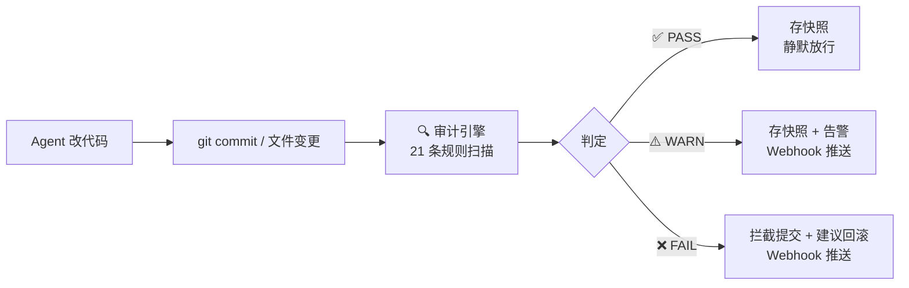
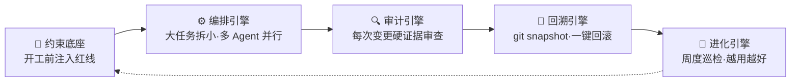

# sofagent

> 🌐 [English →](README.en.md) | 🇨🇳 中文

<p align="center">
  <a href="https://sofagent.ai">
    
  </a>
</p>

<p align="center">
  <strong>sofa + agent = sofagent / 沙发特工</strong><br/>
  <em>AI Agent 的行车记录仪 + 安全带。</em>
</p>

<p align="center">
  <a href="https://github.com/KongFangXun/sofagent/actions/workflows/verify.yml"></a>
  <a href="./LICENSE"></a>
  <a href="./CHANGELOG.md"></a>
  <a href="#怎么装"></a>
</p>

---

## 它解决什么问题

Agent 越聪明，企业越不敢放手——真出事了，谁负责？能拦住吗？能回滚吗？

**sofagent 是 AI Agent 的 Harness 中间件**：每次 Agent 改完代码、写完文件，自动跑一遍规则库，违规的当场拦截、合规的存快照。改了什么就是什么，赖不掉。零 token 消耗——纯正则引擎，不调 LLM。

```bash
npm install -g @sofagent/audit @sofagent/core && sofagent-audit --init
```

> [!NOTE]
> 需要 Node.js ≥ 18 + bash + git。macOS / Linux 全功能，Windows 实验性。

<details>
<summary>🚀 装完三步体验（点开）</summary>

```bash
# 1. 看规则——Agent 会带着这些红线干活
sofagent-audit --help | head -5

# 2. 跑审计——--init 已装好 pre-commit hook，每次 commit 都会被 A1 拦
echo "API_KEY=sk-123456" > .env && git add -f .env && GIT_EDITOR=true git commit -m "test"
# → ⛔ A1 不碰敏感：.env 含密钥格式，提交被拦截（不会真的落库）

# 3. 看快照——每次审计后自动存档
sofagent-audit --timeline

# 演示完清理（A1 已拦提交，无新 commit）
git rm --cached -f .env 2>/dev/null; rm -f .env
```
</details>

---

## 30 秒看懂



sofagent 是 **Harness 中间件**——不管你用什么 Agent（Claude Code / Codex / Cursor / WorkBuddy）、什么模型，挂在 git commit 这个节点上，用 git diff 硬证据做审计。**平台无关、零侵入、零 token**。

> 🏞️ **一条河的比喻**：大厂建江+供水（AI 中台 = 江，模型 = 水），我们做**堤坝 + 管网 + 水龙头**——约束层（不让水泛滥）+ Workflow（把能力引到业务）+ Subagent（让能力真正作用）。让企业安全地用自己的 AI 能力流进业务。约束层也像「操守过滤器 / 有护栏的操作台」——受控变更，而非自由 SQL 通道。详见 [`FDE/FDE.md` §9.6](FDE/FDE.md#96-river企业统一-agent-入口)。

> 💡 **一个能用的智能体 ≠ AI + 一段 prompt**——它是一套由多层组成的骨架（配置 / 知识 / 指令 / 校验 / 编排）。sofagent 的约束底座是骨架里的钢筋，审计引擎是质检。我们处在 **Harness Engineering（2025-2026 行业范式跃迁阶段）**——给 Agent 搭脚手架（工具 / 权限 / 沙箱 / 规则），而非造一个更聪明的模型。
>
> 📖 来源：31 篇行业笔记跨批研读（2026-07-20）

---

## 为什么不用现有工具

| 工具 | 它查什么 | sofagent 查什么 |
|------|---------|----------------|
| pre-commit / husky | 代码质量（lint / format） | **Agent 行为**（密钥泄漏 / 越界修改 / 注入攻击 / 盲改） |
| detect-secrets / gitleaks | 密钥扫描 | 密钥只是 A2 一条规则，sofagent 还有 20 条管 Agent 翻车模式 |
| Cursor Rules / Claude Code hooks | 单平台 IDE 内约束 | 平台无关——任何 Agent + git 仓库都能跑 |

> 💡 **核心差异**：现有工具查「代码写得对不对」，sofagent 查「Agent 做得对不对」——边界越界、知识库跨域、流程合规、盲改逃验证，这些是 LLM Agent 特有的翻车模式，通用 lint 工具覆盖不到。

---

## 21 条规则（4 类）

**默认规则（13 条，装完即生效）**：

| 类别 | 规则 | 拦什么 |
|------|------|--------|
| 🔴 **密钥安全** | A1 不碰敏感 · A2 不泄密钥 | `.env` / `*.pem` 提交、代码硬编码 API Key |
| 🟡 **行为边界** | A3 不改越界 · A4 不删配置 | 改了任务没要求的文件、删配置 |
| 🟠 **注入防护** | A9 不纳注入 · A10 不引毒源 | prompt 注入模式、非官方源依赖 |
| 🔵 **流程合规** | A5 不瞒真相 · A7 不存盲改 · A8 不逃验证 · A19 msg 质量 | 空 commit message、没读就改、改完不测、低质 message |
| ⚪ **工程质量** | A6 不坏构建 · A11 不滥资源 · A18 垃圾文件 | 构建配置异常、超大文件、临时文件提交 |

**扩展规则（8 条，需 opt-in）**：A14 知识库越权 · A15 不盲动 · A16 非授权文件变更 · A17 异常批量变更 · E1-E4（测试文件 / TODO 未声明 / 大量删除 / 低注释率）。

<details>
<summary>📋 完整规则表（21 条，含判定逻辑）</summary>

| 规则 | 判定 | 严重度 | 分级 |
|------|------|:--:|------|
| A1 不碰敏感 | `.env` / `*.pem` / `id_rsa` / 密钥文件被修改 | FAIL | 业务底线 |
| A2 不泄密钥 | 代码中出现 API Key / Token / Password 模式 | FAIL | 业务底线 |
| A3 不改越界 | 修改文件路径与任务描述不匹配 | WARN | 业务底线 |
| A4 不删配置 | 配置文件被删除 | FAIL | 业务底线 |
| A5 不瞒真相 | commit message 为空或纯占位符 | WARN | 业务底线 |
| A6 不坏构建 | 构建配置文件异常改动 | WARN | 能力拐杖 |
| A7 不存盲改 | 被修改文件无读取记录 | FAIL/WARN | 能力拐杖 |
| A8 不逃验证 | 构建文件变更后无测试记录 | FAIL/WARN | 能力拐杖 |
| A9 不纳注入 | 代码中存在命令注入风险模式 | FAIL | 业务底线 |
| A10 不引毒源 | 依赖包黑名单检测 | WARN | 业务底线 |
| A11 不滥资源 | 资源滥用检测（超大文件等） | WARN | 业务底线 |
| A18 垃圾文件 | 临时文件名模式的垃圾文件 | WARN | 能力拐杖 |
| A19 msg 质量 | message 命中黑名单词或过短 | FAIL | 业务底线 |
| A14 知识库越权 | 访问超出工作流声明范围的知识库页面 | WARN | 能力拐杖 |
| A15 不盲动 | workflow.yml 节点未声明 actions | FAIL | 能力拐杖 |
| A16 非授权文件变更 | 非工作流声明范围内的文件被修改 | FAIL | 工程规范 |
| A17 异常批量变更 | 单次提交变更文件数超阈值 | WARN | 工程规范 |
| E1 测试文件 | 测试文件被提交到生产目录 | WARN | 能力拐杖 |
| E2 TODO 未声明 | 新增 TODO 未在任务中声明 | WARN | 能力拐杖 |
| E3 大量删除 | 单次提交删除行数 > 阈值 | WARN | 能力拐杖 |
| E4 低注释率 | 新增 >200 行且注释率 < 5% | WARN | 能力拐杖 |

**规则分级**：业务底线（违反即破坏交付完整性）· 能力拐杖（帮 Agent 走完正确流程）· 工程规范（代码工程质量基线）。
</details>

---

## 一底座 · 四引擎

sofagent 不只是审计——完整形态是「一底座 + 四引擎」的 Harness 中间件：



| 引擎 | 干嘛的 | 状态 |
|------|--------|:--:|
| 🧭 约束底座 | 开工前把规则注入 Agent 上下文（SKILL.md + fde.md + think.md + knowledge/）| ✅ 稳定 |
| ⚙️ 编排引擎 | 大任务拆小、多 Sub Agent 并行、A/B 对比择优 | ✅ 稳定（需 `@sofagent/orchestrator`）|
| 🔍 审计引擎 | 每次 git commit / 文件变更跑 21 条规则，违规拦截+存证 | ✅ 稳定（`@sofagent/audit` 独立）|
| 🔄 回溯引擎 | 每次审计后自动 git snapshot，违规时一键 revert | ✅ 稳定 |
| 🧬 进化引擎 | FDE 周度巡检审计趋势 + 反思记录，发现退化就优化 | ⚠️ 实验性 |

> 💡 **最小用法**：只装 `@sofagent/audit` 就是纯审计工具（21 条规则 + 快照 + 回滚）。装齐 5 个包才是完整 Harness 中间件。

<details>
<summary>📖 引擎详细说明（点开）</summary>

### 🧭 约束底座

开工前把规则注入 Agent 上下文——让它知道红线在哪。四层加载链：SKILL.md（宪法层）→ fde.md（企业规则层）→ think.md（历史踩坑层）→ knowledge/（自动积累层）。v1.0.7+ Sub Agent 启动时自加载（`buildConstrainedSystemPrompt`），不依赖任何 Agent 平台的 Skill 系统。

### ⚙️ 编排引擎

把大任务拆小、多 Sub Agent 并行执行、A/B 对比找更优方案。走 DeepAgents（v1.0.7 起 OpenClaw 编排层完全退役）。CLI 入口 `sofagent-orchestrator compose --task`——**任何 Agent 平台都能用编排引擎**。A/B 自动切换：连续胜出 2 次才 promote，切换前旧版本保留为 fallback。

### 🔍 审计引擎

每次 git commit 或文件变更时自动扫描——Agent 改代码 → git commit/daemon 检测 → 审计引擎规则库判定 → 违规拦截+记录 / 合规放行 → think.md 自动反思。21 条规则中 16 条为纯 git-diff（不依赖 Agent 配合），4 条 hybrid（A7/A8/A14/A15 需 Agent 日志），1 条 filesystem（A17 异常批量变更）。v1.0.8+ 内嵌 isomorphic-git + daemon 文件监控，**不需 git commit 也能审计**。

### 🔄 回溯引擎（本质：git snapshot + revert 包装）

每次审计后自动快照存档——违规时推送通知 + 建议回滚：

| 结果 | 自动动作 | 用户看到什么 |
|------|---------|------------|
| ✅ PASS | 自动快照存档 | 静默 |
| ⚠️ WARN | 存档 + 标记 | daemon-notice.md 告警 + 可选 Webhook |
| ❌ FAIL | 存档 + 建议回滚 | Webhook 推送 + 终端标红 |

### 🧬 进化引擎（实验性）

⚠️ A/B 自动 promote 基于 `consecutiveWins ≥ threshold` + `overallImprovement` 守卫，eval 评分依赖 LLM 自评（存在 self-grading bias）。窄 eval 集场景下可能误晋升，生产环境建议人工复核 promote 决策。两种模式：`deploy`（首次部署/业务大变更）+ `sustain`（每周自动/手动触发巡检）。

</details>

---

## 你的场景 → 用什么

| 你的场景 | 装什么 |
|---------|--------|
| 只想拦截密钥泄漏 / Agent 越界 | `@sofagent/audit` + `@sofagent/core`（最小） |
| 管住 Agent 全流程（约束 + 审计 + 回滚）| + `@sofagent/daemon`（文件监控）|
| 多 Agent 协作 / 工作流编排 | + `@sofagent/orchestrator`（编排引擎）|
| 让 MCP Client 调用审计能力 | + `@sofagent/mcp`（MCP Server）|

### 两种部署节点

| 节点 | 场景 | 需要 OpenClaw |
|------|------|:--:|
| 🔄 自动运行节点 | 企业无人值守设备（服务器/旧电脑）| 是 |
| ⚡ 个人增强节点 | 开发者用 WorkBuddy / Codex / Claude Code | 否 |

> 💡 个人增强节点：clone 仓库 → `npm install -g @sofagent/audit @sofagent/core` → `sofagent-audit --init` → 开干。

---

## 怎么装

```bash
# 最小安装（纯审计）
npm install -g @sofagent/audit @sofagent/core

# 完整安装（一底座·四引擎）
git clone https://github.com/KongFangXun/sofagent.git
bash sofagent/scripts/install.sh
```

**按需安装独立包**：

| 包 | 用途 |
|------|------|
| `@sofagent/audit` | 审计引擎（21 条规则，git diff 硬证据）|
| `@sofagent/core` | 运行时诊断（doctor / verify）|
| `@sofagent/orchestrator` | 编排引擎（多 Agent 协作）|
| `@sofagent/daemon` | 守护进程（文件监控 / 定时巡检）|
| `@sofagent/mcp` | MCP Server（JSON-RPC 2.0）|

**卸载**：

```bash
npm uninstall -g @sofagent/audit @sofagent/core @sofagent/orchestrator @sofagent/daemon @sofagent/mcp
rm -f .git/hooks/commit-msg .git/hooks/post-commit
```

---

## 企业落地：FDE + Work模板市场

sofagent 不只是开发者工具——企业落地用 **FDE 工具包** + **Work模板市场**：

- **FDE 工具包**（`FDE/`）：前线部署工程师进场四阶段（梳理 → 挖掘 → 交付 → 离场），把企业工作流梳理成 AI 节点，部署完撤离、AI 节点自己跑。详见 [FDE/FDE.md](./FDE/FDE.md)。
- **Work模板市场**（`work模板市场/`）：行业工作流模板仓库，外层 Graph 骨架锁定全链路 + 内层节点保留 ReAct 灵活性。开箱带制造业应付账款审批模板。详见 [work模板市场/](./work模板市场/)。
- **LOOP 自迭代工具包**（`LOOP/`）：sofagent 的外层自迭代编排——内层 `coding → audit → review → human`，外层 `FDE 监督 → compliance 巡检 → 优化 Agent 定义`。详见 [LOOP/README.md](./LOOP/README.md)。


---

## 实测效果

> [!NOTE]
> 🔬 **Hugging Face 实测**：同一模型不改权重、仅优化外层 Harness，法律 Agent 基准 **3.5% → 80.1%**（76 分差全部来自外层机制），成本仅 1/7（追平 Claude Sonnet 4.6）。[详情](./docs/THANKS.md)

| 维度 | 数据 |
|------|------|
| 审计引擎 | 21 条规则全覆盖，`npm test` 全绿（见 tools/test-count.sh 实测），0 token 消耗 |
| 平台覆盖 | git commit 审计（开发者）+ daemon 文件审计（非开发者）|
| 协议 | MIT（代码 / 文档 / 模板随便用）|

---

## 延伸阅读

| 你想了解 | 看哪里 |
|---------|--------|
| 怎么装、怎么用、常见问题 | [HANDBOOK](./docs/HANDBOOK.md) |
| 为什么这么设计 | [ARCHITECTURE](./docs/ARCHITECTURE.md) |
| 设计哲学 | [PHILOSOPHY](./docs/PHILOSOPHY.md) |
| 安全声明 | [SECURITY](./SECURITY.md) |
| 已知局限 | [LIMITATIONS](./LIMITATIONS.md) |
| 版本路线图 | [ROADMAP](./ROADMAP.md) |
| 贡献指南 | [CONTRIBUTING](./CONTRIBUTING.md) |

---

## 贡献与致谢

欢迎提 Issue 和 PR，尤其挑刺的那种。[CONTRIBUTING.md](./CONTRIBUTING.md) · [致谢](./docs/THANKS.md)
