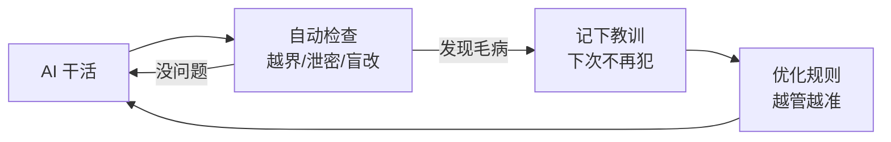
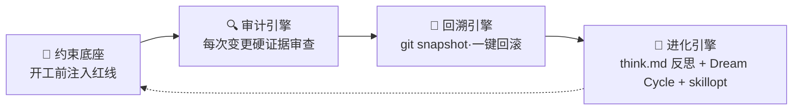

# sofagent

> 🌐 [English →](README.en.md) | 🇨🇳 中文

<p align="center">
  <a href="https://sofagent.ai">
    
  </a>
</p>

<p align="center">
  <strong>FDE Agent——梳理工作流 · 部署 AI 节点 · 审计每次变更</strong><br/>
  <em>让 AI 替你干活，且每次都干得对。</em>
</p>

> **sofagent 是一个 FDE Agent**——进场帮你梳理工作流，把能自动化的环节变成 AI 节点，部署后 7×24 自己跑。AI 每次干活都自动受检查（越界就拦、出事能回滚、干了啥看得见），经验自动沉淀，越用越好。

<p align="center">
  <a href="https://github.com/KongFangXun/sofagent/actions/workflows/verify.yml"></a>
  <a href="./LICENSE"></a>
  <a href="./CHANGELOG.md"></a>
  <a href="#快速开始"></a>
</p>

<p align="center"><strong>当前版本：v1.2.4</strong> · 2026-08-01 · 知识进化（分层巡检 L1/L2/L3 + skillopt 自动触发 + 失败清单 + 联邦蒸馏 + 进化引擎接通 eval + Dashboard 历史趋势）</p>

<p align="center">
  <a href="#这是什么">这是什么</a> · <a href="#sofagent-能帮你做什么">能帮你做什么</a> · <a href="#为什么不是现有工具">为什么不是现有工具</a> · <a href="#快速开始">快速开始</a> · <a href="#延伸阅读">文档</a>
</p>

> 🧭 **第一次来？按身份选路**
> - **想用起来**（企业用户 / 业务负责人）→ [HANDBOOK](./docs/HANDBOOK.md)：怎么装、怎么派活、常见问题
> - **想懂它怎么工作**（架构师 / 技术决策者）→ [ARCHITECTURE](./docs/ARCHITECTURE.md)（设计）→ [PHILOSOPHY](./docs/PHILOSOPHY.md)（理念）
> - **想动手贡献或集成**（开发者）→ [↓ 引擎架构段](#engine-architecture) → [DEVELOPMENT](./docs/DEVELOPMENT.md)（开发指南）

---

## 这是什么

**你的 AI 越能干，你越不敢放手**——它写错了代码、泄漏了机密、改乱了文件，你都不知道。真出事了，谁负责？能拦住吗？能回滚吗？

sofagent 就是解决这个问题的：**它帮你把 AI 管起来，让 AI 干活，你只负责把关。**

具体来说，它做三件事：

| 你担心的 | sofagent 怎么做 | 用人话说 |
|---------|----------------|---------|
| **AI 乱来怎么办？** | 每次 AI 改东西都自动检查一遍 | AI 干的活有人盯着，越界立刻拦住 |
| **AI 闯祸了怎么办？** | 每次改动自动存档，一键回滚 | 出事能一键回到安全状态 |
| **AI 干了啥不知道？** | 终端面板一眼看清 AI 的一举一动 | 数据去哪了、有没有犯规、任务跑到哪，都看得见 |

<details>
<summary>🏞️ 打个比方：一条河（点开）</summary>

大厂给你"水"（大模型）和"河床"（Agent 平台），但水是原水，你不敢直接喝。sofagent 是**堤坝 + 自来水厂 + 管网 + 水龙头**——不让水泛滥（约束 AI 不乱来）、把水变成直饮水（安全沙箱）、把水送到该去的地方（工作流编排）。简单说：**让 AI 从"能用"变成"敢用"。**

</details>

> 🎯 **90/10 价值分层**：模型给 90% 的智力，sofagent 补 10% 的可靠执行——越往后这 10% 越值钱。不是造更聪明的模型，是给已有的聪明加一套闸门。

> 🔬 **外部独立实验证据**（非 sofagent 官方自测）：HuggingFace 上 Joel Niklaus 的 harness-optimization 研究显示，同一模型不改权重、仅优化外层 Harness，法律 Agent 基准从 **3.5% → 80.1%**（76 分差全部来自外层机制），成本仅 1/7。这是同类约束机制有效性的外部证据。详见 [THANKS.md](./docs/THANKS.md)。

<details>
<summary>🔧 技术细节（给开发者）</summary>

底层是 **Harness 中间件**——每次 Agent 改完代码自动跑 21 条规则（git diff 硬证据，零 token），违规当场拦截、合规存快照。四层加载链（SKILL.md → fde.md → think.md → knowledge/）在 Agent 启动时注入行为底线。完整架构见 [ARCHITECTURE.md](./docs/ARCHITECTURE.md)。

</details>

---

## sofagent 能帮你做什么

**想让 AI 自动跑日常任务？**
先梳理你的工作流，把能自动化的环节变成 AI 节点，部署完它自己跑。你从"干活的人"变成"派活的人"。

**AI 越界了怎么办？**
每次变更自动检查——越界改文件、泄漏密钥、盲目修改，当场拦下。不用你盯着，规则替你把关。

**出了事能回滚吗？**
每次改动自动存档，一键回到任意安全状态。AI 闯了祸，你按一下就能恢复。

**换了 AI 工具/模型怎么办？**
sofagent 不挑平台——Claude、GPT、自建模型都能管。换模型不影响防护。

**越用越好吗？**
AI 每次干活的经验自动沉淀，sofagent 定期巡检优化规则——它越用越懂你的业务。

<details>
<summary>🔄 它怎么"越用越好"？（点开看闭环）</summary>



AI 每次被拦下的毛病、每次成功的经验，都沉淀成"教训库"——下次干活自动避开。这就是它越用越懂你业务的原因。

</details>

**怎么知道 AI 在干什么？**
终端面板一眼看清：数据去哪了（有没有偷偷外传）、AI 犯规了吗（有没有越权）、任务跑到哪了（是活的还是挂了）：

```bash
sofagent-dashboard           # 看当前状态
sofagent-dashboard --watch   # 实时刷新（看护审查时用）
sofagent-dashboard --full    # 展开完整视图
```

> 前置依赖：需要 `jq`（`brew install jq` / `apt install jq`）。

> 🔗 **给企业的完整闭环（v1.2.5+ 规划中）**：现在梳理完工作流后，交付物还需要人工配置才能跑起来。后续版本将自动化这一步——诊断完，企业工作流自动注册、自动编排、自动跑。详见 [激活链设计文档](./docs/guides/fde-activation-chain.md)。

---

## 为什么不是现有工具

| 工具 | 它们管什么 | sofagent 管什么 |
|------|:--------|:----------------|
| AI Agent 平台（OpenClaw 等）| 让 AI「会做事」 | 让 AI「每次都做对、出事能负责」 |
| 企业 AI 咨询服务 | 一次性交付，人走茶凉 | 工具 + 常驻，可复用、可维护 |
| 代码检查工具（pre-commit 等）| 查「代码写得好不好」 | 查「AI 行为对不对」（越界/泄密/盲改）|

一句话：**现有工具查代码，sofagent 查 AI 的行为**——密钥泄漏、越界改文件、盲目修改，这些是 AI 特有的闯祸方式，通用工具不管。

<details>
<summary>🔧 与技术工具的具体差异（给开发者）</summary>

| 工具 | 它们管什么 | sofagent 管什么 |
|------|:--------|:----------------|
| detect-secrets / gitleaks | 密钥扫描（全量历史 + 100+ 模式）| A2 覆盖常见 API key；差异化 = **Agent 行为审计**而非密钥覆盖率 |
| Cursor Rules / Claude hooks | 单平台 IDE 约束 | 审计层全平台可用（git diff）；约束层按平台分层（OpenClaw 最深 → WorkBuddy SKILL → 其他种子指令）|

</details>

<details>
<summary>📦 FDE 离场后，企业留下五样东西</summary>

前四样是资产，第五样是让前四样一直活着的 FDE Agent 本身——sofagent 留在客户那里继续跑：

| 交付物 | 说明 |
|--------|------|
| 交付手册 | 企业 IT 可独立维护的操作手册 |
| AI 节点 | 在跑的 Agent，自动执行日常任务（财务对账、审计巡检、数据分析…）|
| AI 知识库 | 持续积累的实体、概念、对比页（Dream Cycle 自动沉淀）|
| 私有化评估体系 | eval 反馈 + Skill 迭代历史——无法复制的企业 IP |
| **FDE Agent 本身** | 控制层常驻——管审计 / 约束 / 知识的生命周期，人离场了它留下 |

</details>

---

## 快速开始

装完后，你在自己的 AI 工具（WorkBuddy / Codex / Claude Code）里说一句话，sofagent 就开始干活。不用学新界面——用你熟悉的对话方式就行。

| 你是… | 第一步 | 需要什么 |
|------|------|------|
| **企业用户** | 装 [FDE 引导工具](./FDE/README.md) → 对话引导你梳理工作流 | 零依赖、不需要 Node.js |
| **要给员工发 U 盘** | `sofagent-daemon create-usb-key --role "节点名" --target /Volumes/XXX --platform macos` | 已装 daemon + 一个 U 盘 |
| **开发者** | `bash install.sh` → `sofagent-audit --init` → 装 git hook 审计 | Node.js ≥ 18 + git |

> **前提**：开发者路径请在 git 仓库根目录下执行。如果还没有仓库，先运行 `git init`。

```bash
bash install.sh          # 安装（自动检测 shell 配置文件，装完新开终端或 source）
sofagent-audit --init    # 初始化（装 git hook）
sofagent-audit --doctor  # 验证环境是否就绪（可选但推荐）
```

> 💡 如果 `sofagent-audit` 仍然提示 command not found，请**新开一个终端窗口**再试。
> 💡 **不需要装引擎？** 如果你只需要 FDE 方法论（给 Agent 装治理 Skill），直接看 [FDE/README.md](./FDE/README.md)——零依赖，不需要 Node.js。
> 💡 **下一步**：安装完成后，运行 `sofagent-audit --doctor` 检查环境状态，或查看 [项目导航索引（WIKI）→](./docs/WIKI.md)

### 三种安装方式，适配所有场景

| 方式 | 谁用 | 怎么用 |
|------|------|--------|
| 🚀 **npx 零安装** | 快速体验 / CI 环境 | `npx @sofagent/audit --init`（即装即用，不需下载） |
| 💻 **install.sh 全量安装** | 技术人员 / 开发者 | `bash install.sh`（底座 + FDE Agent） |
| ⚡ **install.sh 最小安装** | 开发者 / 企业 IT | `bash install.sh --base-only`（仅底座引擎） |

> [!NOTE]
> 需要 Node.js ≥ 18 + bash + git。macOS / Linux 全功能，Windows 实验性。Dashboard 依赖 jq（macOS 请 `brew install jq`，Linux 请 `apt install jq` / `yum install jq`）。

<details>
<summary>🚀 装完三步体验</summary>

> ⚠️ 需在 git 仓库中运行（`git init` 初始化一个）。

```bash
# 0. 初始化——装 git hook，让审计引擎能拦截 commit
sofagent-audit --init

# 1. 看规则——Agent 会带着这些红线干活
sofagent-audit --help | head -5

# 2. 跑审计——第 0 步的 --init 已装好 pre-commit hook，每次 commit 都被拦
# GIT_EDITOR=true 让 git commit 不弹编辑器（CI/自动化场景常用）
echo "API_KEY=sk-123456" > .env && git add -f .env && GIT_EDITOR=true git commit -m "add env config"
# → ⛔ A1 不碰敏感：.env 含密钥格式，提交被拦截（不会真的落库）

# 3. 看快照——每次审计后自动存档
sofagent-audit --timeline

# 演示完清理
git rm --cached -f .env 2>/dev/null; rm -f .env
```
</details>

> ⚠️ **关于 commit 拦截**：`git commit --no-verify` 可以绕过本地 hook。sofagent 的设计初衷是"诚实 Agent 的护栏"而非"恶意攻击者的防线"。企业高安全场景建议在 CI/CD pipeline 侧再加一道 `sofagent-audit --diff` 审计（hook 可绕，CI 不可绕）。详见 [LIMITATIONS](./LIMITATIONS.md) §一·已知架构限制。

> **推荐**：新用户使用 `bash install.sh`（一键安装全套）。高级用户/CI 环境使用 `npm install -g @sofagent/audit`（仅安装审计引擎）。

**按需安装**：

| 包 | 用途 |
|------|------|
| `@sofagent/audit` | 审计引擎（21 条规则，git diff 硬证据）|
| `@sofagent/core` | 运行时诊断（doctor / verify）|
| `@sofagent/orchestrator` | FORGE 自迭代工具链（LOOP 流水线 + 任务编排）|
| `@sofagent/daemon` | 守护进程（文件监控 / 定时巡检）|
| `@sofagent/mcp` | MCP Server（JSON-RPC 2.0）|

> 💡 卸载：`npm uninstall -g @sofagent/audit` + 清理其余全局包 + `rm -f .git/hooks/commit-msg .git/hooks/post-commit`

⚠️ **数据存储说明**：sofagent 当前版本将审计数据以 Markdown 明文存储在 `~/.sofagent/data/`。内置加密（age）计划在 v1.4.0 引入。在生产环境使用前，建议：
- macOS：将 `~/.sofagent/` 放在 APFS 加密卷中
- Linux：使用 LUKS 加密分区挂载 `~/.sofagent/`
- 详见 [SECURITY.md](./SECURITY.md#已知风险明文存储)

---

## 延伸阅读

| 你想了解 | 看哪里 |
|:---------|:--------|
| FDE 诊断方法论（四阶段十二步） | [GUIDE.md](./FDE/GUIDE.md) |
| 🔗 激活链设计（交付物→自动运转） | [激活链设计文档](./docs/guides/fde-activation-chain.md) |
| 怎么装、怎么用、常见问题 | [HANDBOOK](./docs/HANDBOOK.md) |
| 引擎架构、21 条规则、内部机制 | [↓ 引擎架构（开发者段）](#engine-architecture) |
| 为什么这么设计 | [ARCHITECTURE](./docs/ARCHITECTURE.md) |
| 设计哲学 | [PHILOSOPHY](./docs/PHILOSOPHY.md) |
| 安全声明（含数据存储说明） | [SECURITY](./SECURITY.md) |
| 已知局限 | [LIMITATIONS](./LIMITATIONS.md) |
| 版本路线图 | [ROADMAP](./ROADMAP.md) |
| 项目导航索引（AI 用） | [WIKI](./docs/WIKI.md) |
| 贡献指南 | [CONTRIBUTING](./CONTRIBUTING.md) |

---

## <a id="engine-architecture"></a>引擎架构（开发者段）

> [!NOTE]
> **品牌与描述**：**sofagent** 是产品品牌名；**FDE Agent** 是对它核心形态的描述——sofagent 本质上是一款 FDE Agent（进场梳理工作流、把可自动化环节变成 AI 节点、构建本体、部署专属小模型的常驻硅基员工）。底层技术实现是一套约束 Agent 行为的 Harness 中间件（**能力底座 × 生命周期**双层架构：层 1 一底座·三引擎 + 层 2 激活链四阶段），开源在 `@sofagent/*`。下面这段是给开发者看的。

sofagent 底层引擎是一套约束 Agent 行为的 Harness 中间件，**能力底座 × 生命周期**双层架构。**层 1 能力底座 = 一底座·三引擎**：一底座 = 约束底座（开工前注入规则）；三引擎 = 审计引擎（21 条规则拦截）+ 回溯引擎（自动快照回滚）+ 进化引擎（think.md 反思 + Dream Cycle 知识回灌 + skillopt Skill 优化）。**层 2 生命周期 = 激活链四阶段**（v1.2.5+）：激活 → 编排 → 执行 → 闭环。FORGE 自迭代工具链（LOOP 流水线）是项目内部开发工具，不作为对外引擎宣称。

<details>
<summary>📖 一底座·三引擎架构（开发者参考）</summary>



> 下表 4 项 = 1 底座 + 3 引擎。

| 组件 | 作用 | 状态 |
|:------|:--------|:--:|
| 🧭 约束底座 | 开工前规则注入 Agent 上下文（SKILL.md + fde.md + think.md + knowledge/）| ✅ 稳定 |
| 🔍 审计引擎 | 21 条规则，每次 git commit / 文件变更触发，违规拦截+记录。**审计引擎核心规则零 token**（16 条纯 git-diff 规则不调用 LLM + 1 条文件系统监控，4 条混合规则需 Agent 日志）——不调用 LLM（0 token），不消耗任何 LLM 额度 | ✅ 稳定 |
| 🔄 回溯引擎 | 每次审计后自动 git snapshot，违规一键回滚 | ✅ 稳定 |
| 🧬 进化引擎 | think.md 反思（✅ 已交付）+ Dream Cycle 知识回灌（🔧 轻量态）+ skillopt Skill 优化（⚠️ 需外部 SkillOpt CLI）| 🔧 部分可用 |

</details>

<details>
<summary>📖 引擎细节 + 21 条规则</summary>

### 🧭 约束底座

四层加载链：SKILL.md（宪法·不可改）→ fde.md（规范·可改）→ think.md（反思·自动生成）→ knowledge/（知识·自动积累）。v1.0.7+ SubAgent 启动时自加载（`buildConstrainedSystemPrompt`），不依赖任何 Agent 平台的 Skill 系统。

### ⚙️ FORGE 自迭代工具链（内部工具）

> ⚠️ FORGE LOOP 流水线（plan→engineer→audit→review→confirm）是 **sofagent 项目自身自迭代用的开发工具**（fresh-eyes-loop / release-gate-loop），不作为面向用户的编排引擎。真正的任务编排由你使用的 AI Agent 平台（WorkBuddy / Claude / Cursor 等）完成，sofagent 在编排过程中提供约束 + 审计 + 经验沉淀。

LOOP 内部使用 LangGraph StateGraph 组装节点流转 + 6 个内置工具（read/write/edit/bash/search/test）+ ToolGate 事前拦截。代码在 `@sofagent/orchestrator` 包中开源，供参考和二次开发。

### 🔍 审计引擎

21 条规则中 16 条纯 git-diff（不依赖 Agent 配合），4 条混合（A7/A8/A14/A15 需 Agent 日志），1 条文件系统（A17 异常批量变更）。v1.0.8+ 内嵌 isomorphic-git + daemon 文件监控，**不需要 git commit 也能审计**。自 v1.1.8 起加入 Prompt 注入防护（A9 扩展）+ 联邦查询加密，审计能力从本地扩展到跨设备。全 workspace 测试覆盖 **1317 测试 / 13 包**。

**默认规则（13 条，装上就生效）**：

| 类别 | 规则 | 拦截什么 |
|------|------|--------|
| 🔴 密钥安全 | A1 敏感文件 · A2 密钥泄漏 | `.env` / `*.pem` 提交，硬编码 API Key |
| 🟡 行为边界 | A3 越界编辑 · A4 删配置 | 改任务范围外的文件，删配置 |
| 🟠 注入防御 | A9 注入 · A10 恶意来源 | 命令注入模式，非官方来源依赖 |
| 🔵 流程合规 | A5 空消息 · A7 盲改 · A8 跳测试 · A19 消息质量 | 空 commit msg，不读就改，跳测试，低质量 msg |
| ⚪ 工程质量 | A6 破构建 · A11 资源滥用 · A18 垃圾文件 | 构建配置异常，超大文件，临时文件提交 |

**扩展规则（8 条，按需开启）**：A14 知识库跨域 · A15 盲动 · A16 非授权变更 · A17 异常批量（文件系统监控）· E1-E4（测试文件 / 未声明 TODO / 批量删除 / 低注释率）。完整 21 条规则表（含严重度、分级、判定逻辑）见 [engine/audit/README.md · 审计规则](./engine/audit/README.md#审计规则)。

### 🔄 回溯引擎

每次审计后自动 git snapshot（本质是对工作树的轻量快照，不是 git commit——不产生历史污染）。违规时推送通知 + 建议回滚。`sofagent-audit --revert <sha>` 一键回到任意快照。

### 🧬 进化引擎

进化引擎不是单一组件，而是三层闭环：

| 层 | 机制 | 状态 | 怎么跑 |
|------|------|:---:|------|
| **think.md 反思** | 每次审计自动写教训（哪个规则触发了、改了哪些文件、下次注意什么），Agent 下次启动时通过 harness 加载链读到——不犯同样的错 | ✅ 已交付 | 审计引擎每次跑自动触发，无需配置 |
| **Dream Cycle 知识回灌** | daemon 后台合成概念 → 回灌 skillopt 待优化队列，积累知识供后续优化周期消费 | 🔧 轻量态 | daemon 后台运行，当前为内存态队列（重启即丢），完整持久消费链路计划 v1.3.0 交付 |
| **skillopt Skill 优化** | 失败模式聚类（≥3 次同类失败）→ 自动触发外部 SkillOpt CLI 优化 Skill 质量 → 校验候选（行数 ±30% + 变化率 ≥5%）| ⚠️ 需外部依赖 | 需安装 [Microsoft SkillOpt](https://github.com/microsoft/SkillOpt)（`skillopt-sleep` CLI）。未安装时自动降级为仅记录失败清单，不执行优化 |

</details>

---

## 贡献与致谢

欢迎提 Issue 和 PR，尤其较真的那种。[CONTRIBUTING.md](./CONTRIBUTING.md) · [致谢](./docs/THANKS.md)

---

<p align="center">
  <br/>
  <em>如果 sofagent 帮到你</em><br/><br/>
  <a href="https://github.com/KongFangXun/sofagent">⭐ Star · 让更多人看到</a>
</p>
