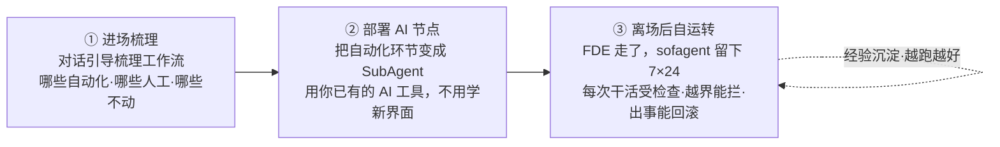
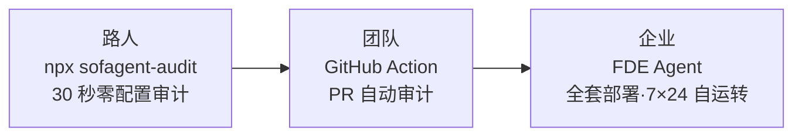

# sofagent

> 🌐 [English →](README.en.md)（⚠️ 英文版更新中，以中文版为准）| 🇨🇳 中文

<p align="center">
  <a href="https://sofagent.ai">
    
  </a>
</p>

<p align="center">
  <strong>sofagent：FDE Agent——梳理工作流 · 部署 AI 节点 · 审计每次变更 · 沉淀经验</strong>
</p>

<p align="center">
  <a href="https://github.com/KongFangXun/sofagent/actions/workflows/verify.yml"></a>
  <a href="./LICENSE"></a>
  <a href="./CHANGELOG.md"></a>
  <a href="#快速开始"></a>
</p>

<p align="center">
  <a href="#这是什么">这是什么</a> · <a href="#三个入口从-30-秒到全套部署">三个入口</a> · <a href="#快速开始">快速开始</a> · <a href="#文档索引">文档</a> · <a href="https://github.com/KongFangXun/sofagent">⭐ Star</a>
</p>

## 这是什么

**sofagent 是一个 FDE Agent**——进场帮你梳理工作流、把能自动化的环节变成 AI 节点、部署后 7×24 自动执行任务的开源 FDE Agent。

FDE（Forward Deployed Engineer）——工程师驻场客户、掌握完整上下文、打破岗位边界、对结果负责。sofagent 把 FDE 能力产品化，做三件事：



- **① 进场梳理**——对话引导你梳理业务工作流，产出本体结构（ontology）+ workflow.yml + skills/
- **② 部署 AI 节点**——把能自动化的环节变成 SubAgent，部署完自己跑，从"你干活"变成"你派活"
- **③ 离场后自运转**——人离场了，AI 节点继续跑，治理不离开

> 💡 **它怎么"越用越好"**：AI 每次干活的经验和教训自动沉淀——下次干活自动避开同样的坑。定期巡检优化规则，越跑越懂你的业务。

> 🏞️ **打个比方**：大厂给你"水"（大模型）和"河床"（Agent 平台），但水是原水，你不敢直接喝。sofagent 是帮你把河里的水让整个城市用起来的工程——堤坝不让水泛滥、自来水厂把原水变直饮水、管网把水送到每家每户的水龙头。
>
> 🎯 **90/10 价值分层**：模型给 90% 的智力，sofagent 补 10% 的可靠执行——越往后这 10% 越值钱。不是造更聪明的模型，是给已有的聪明加一套闸门。

### 激活链：从交付到自转（v1.2.5+）

FDE 交付了本体结构 + workflow.yml + skills/ 之后，分四步让交付物自己跑起来：

| 阶段 | 做什么 | 版本 |
|------|--------|:----:|
| **ACTIVATE** | 读交付物 → 注册企业 SubAgent | v1.2.5 ✅ |
| **ORCHESTRATE** | 构建企业专属工作流图（映射表+注册扩展+enterprise-graph） | v1.2.6-v1.2.7 ✅ |
| **EXECUTE** | 运行 + 人工确认 + 每步审计 | v1.2.8 ✅ · v1.2.9 ✅ |
| **SUSTAIN** | 持续优化，越跑越好 | v1.3.0 📋 |

设计详情：[激活链文档](./docs/guides/fde-activation-chain.md)

<details>
<summary>📦 FDE 离场后，企业留下五样东西</summary>

前四样是资产，第五样是让前四样一直活着的 FDE Agent 本身——sofagent 留在客户那里继续跑：

| 交付物 | 说明 |
|--------|------|
| 交付手册 | 企业 IT 可独立维护的操作手册 |
| AI 节点 | 在跑的 Agent，自动执行日常任务（财务对账、审计巡检、数据分析…）|
| AI 知识库 | 持续积累的实体、概念、对比页（Dream Cycle 自动沉淀）|
| 私有化评估体系 | eval 反馈 + Skill 迭代历史——无法复制的企业 IP |
| **FDE Agent 本身** | 常驻值守——管审计 / 约束 / 知识的生命周期，人离场了它留下 |

</details>

---

## 三个入口，从 30 秒到全套部署

不需要一开始就部署整个 FDE Agent。三个入口产品形成获客漏斗，你可以从 30 秒体验开始：



| 入口 | 适合谁 | 做什么 | 时间 |
|------|--------|--------|:----:|
| **`npx sofagent-audit`** | 任何开发者 | 零配置审计最近一次 commit，3 秒出结果 | 30 秒 |
| **GitHub Action** | 有 PR 流程的团队 | 每次 PR 自动审计，违规直接标注在 diff 行上 | 配置一次 |
| **FDE Agent** | 企业 | 进场梳理工作流 → 部署 AI 节点 → 7×24 自运转 | FDE 驻场 |

> 💡 审计能力是入口产品（让陌生人 30 秒体验到价值），FDE Agent 是完整产品（让企业获得全流程部署）。不是替代关系，是获客漏斗。

> 🔬 **外部独立实验证据**（非 sofagent 官方自测）：HuggingFace 上 Joel Niklaus 的 harness-optimization 研究显示，同一模型不改权重、仅优化外层 Harness，法律 Agent 基准从 **63.4% → 80.1%（+16.7pp）**（提升全部来自外层机制）。详见 [THANKS.md](./docs/THANKS.md)。

---

## 快速开始

装完后，你在自己的 AI 工具（WorkBuddy / Codex / Claude Code）里说一句话，sofagent 就开始干活。不用学新界面——用你熟悉的对话方式就行。

| 你是… | 第一步 | 需要什么 |
|------|------|------|
| **企业用户** | 打开仓库内的 [FDE 引导目录](./FDE/README.md) → 对话引导你梳理工作流 | 零依赖、不需要 Node.js |
| **企业批量部署（USB 烧录）** | `sofagent-daemon create-usb-key --role "节点名" --target /Volumes/XXX --platform macos` | 已装 daemon + 一个 U 盘 |
| **开发者** | `bash install.sh` → `sofagent-audit --init` → 装 git hook 审计 | Node.js ≥ 18 + git |

> **前提**：开发者路径请在 git 仓库根目录下执行。如果还没有仓库，先运行 `git init`。

```bash
# 方式 1：安全一键安装（先下载再执行，推荐）
curl -fsSL https://raw.githubusercontent.com/KongFangXun/sofagent/main/bootstrap.sh -o bootstrap.sh
less bootstrap.sh   # ← 先看一眼脚本内容，确认安全
bash bootstrap.sh && rm bootstrap.sh

# 方式 2：完整安装（clone + install.sh）
git clone https://github.com/KongFangXun/sofagent.git && cd sofagent
bash install.sh          # 安装（自动检测 shell 配置文件，装完新开终端或 source）
sofagent-audit --init    # 初始化（装 git hook）
sofagent-audit --doctor  # 验证环境是否就绪（可选但推荐）
```

> 💡 如果 `sofagent-audit` 仍然提示 command not found，请**新开一个终端窗口**再试。
> 💡 **不需要装引擎？** 如果你只需要 FDE 方法论（给 Agent 装治理 Skill），直接看 [FDE/README.md](./FDE/README.md)——零依赖，不需要 Node.js。

> 🔒 **安全第一**：所有安装脚本只写入 `~/.sofagent/` 目录，不修改系统文件。建议先审查脚本内容再执行。

### 其他安装方式

| 方式 | 谁用 | 怎么用 |
|------|------|--------|
| 🚀 **npx 零安装** | 快速体验 / CI 环境 | `npx @sofagent/audit@latest --init`（即装即用）。⚠️ npx 会缓存旧版本，加 `@latest` 确保拉取最新版 |
| ⚡ **install.sh 最小安装** | 开发者 / 企业 IT | `bash install.sh --base-only`（仅底座引擎） |

<details>
<summary>🚀 装完三步体验</summary>

> ⚠️ 需在 git 仓库中运行（`git init` 初始化一个）。

```bash
# 0. 初始化——装 git hook，让审计能拦截 commit
sofagent-audit --init

# 1. 跑审计——第 0 步的 --init 已装好 commit-msg hook，每次 commit 都被拦
echo "API_KEY=sk-123456" > .env && git add -f .env && GIT_EDITOR=true git commit -m "add env config"
# → ⛔ A1 不碰敏感：.env 含密钥格式，提交被拦截（不会真的落库）

# 2. 看快照——每次审计后自动存档
sofagent-audit --timeline

# 演示完清理
git rm --cached -f .env 2>/dev/null; rm -f .env
```

</details>

> ⚠️ **关于 commit 拦截与诚实边界**：`git commit --no-verify` 可以绕过本地 hook——sofagent 防的是**诚实 Agent 的疏忽**（漏提交密钥、越界改动），不是恶意蓄意绕过。企业高安全场景请在 CI/CD pipeline 侧再加一道 `sofagent-audit --diff` 审计兜底。详见 [LIMITATIONS](./docs/LIMITATIONS.md)。

### 按需安装

| 包 | 用途 |
|------|------|
| `@sofagent/audit` | 审计引擎（24 条规则，git diff 硬证据）|
| `@sofagent/core` | 运行时诊断（doctor / verify）|
| `@sofagent/orchestrator` | 任务编排引擎（LOOP 流水线；注：面向用户的任务编排由 Agent 平台完成，sofagent 在其过程中提供约束/审计/经验沉淀）|
| `@sofagent/daemon` | 守护进程（文件监控 / 定时巡检）|
| `@sofagent/mcp` | MCP Server（JSON-RPC 2.0）|

> 💡 卸载：`npm uninstall -g @sofagent/audit` + 清理其余全局包 + `rm -f .git/hooks/commit-msg .git/hooks/post-commit`

---

## 怎么知道 AI 在干什么

两种面板，一眼看清数据去哪了、AI 犯规了吗、任务跑到哪了：

**🖥️ HTML Dashboard（网页版，推荐）**——6 页可视化控制台，全部真实数据驱动：驾驶舱（实时指标）· FDE 引导 · AI 节点 · 本体结构 · 知识库 · 工具箱。

**一键启动**：macOS 用户直接双击仓库根目录的 [`start-dashboard.command`](./start-dashboard.command)（自动开浏览器，关窗口即停）。

```bash
node tools/serve-dashboard.mjs    # 命令行启动（跨平台，自动打开浏览器）
# → http://localhost:3780
```

**💻 终端面板（bash）**——轻量、仅需 jq：

```bash
sofagent-dashboard           # 看当前状态
sofagent-dashboard --watch   # 实时刷新
sofagent-dashboard --full    # 展开完整视图
```

---

## 与现有工具的区别

| 工具 | 它们管什么 | sofagent 管什么 |
|------|:--------|:----------------|
| AI Agent 平台（OpenClaw 等）| 让 AI「会做事」 | 让 AI「每次都做对、出事能负责」 |
| 企业 AI 咨询服务 | 一次性交付，人走茶凉 | 工具 + 常驻，可复用、可维护 |
| 代码检查工具（pre-commit 等）| 查「代码写得好不好」 | 查「AI 行为对不对」（越界/泄密/盲改）|

一句话：**现有工具查代码，sofagent 查 AI 的行为**——密钥泄漏、越界改文件、盲目修改，这些是 AI 特有的闯祸方式，通用工具不管。

<details>
<summary>🔧 与技术工具的具体差异（给开发者）</summary>

| 工具 | 它们管什么 | sofagent 管什么 |
|------|:--------|:----------------|
| detect-secrets / gitleaks | 密钥扫描（全量历史 + 100+ 模式）| A2 覆盖常见 API key；差异化 = **Agent 行为审计**而非密钥覆盖率 |
| Cursor Rules / Claude hooks | IDE/CLI 级约束（Claude hooks 已支持 25+ 生命周期事件）| 审计层全平台可用（git diff）；约束层按平台分层 |

> ⚠️ **对比快照时间戳**：以上对比基于 2026-08-02 各工具的公开能力快照；工具迭代快，条款可能过时。差异化的核心论点（sofagent 审计「AI 行为」而非「代码质量」）不随工具版本变化。

</details>

---

## 部署规模（企业 IT 参考）

| 部署规模 | 并发 Agent | CPU | 内存 | 磁盘 | 适用场景 |
|---------|:---:|:---:|:---:|:---:|---------|
| 个人 / 小团队 | 1-3 | 1 核 | 512 MB | 500 MB | 单人开发，git commit hook 审计 |
| 中型团队 | 5-10 | 2 核 | 1 GB | 2 GB | 多人协作，daemon 常驻 + webhook 推送 |
| 企业级 | 10+ | 4 核 | 2 GB | 5 GB+ | 多仓库联邦，A/B 审查 + 知识库 + Dashboard |

> **资源消耗说明**：
> - **磁盘**：`~/.sofagent/data/`（审计历史 + 快照 + 知识库，日均 ~5 MB/仓库）
> - **内存**：daemon 常驻进程（~50 MB）+ Node.js 运行时（~200 MB/并发 Agent）
> - **网络**：仅 LLM API 出站，无入站端口需求

⚠️ **数据存储说明**：sofagent 当前版本将审计数据以 Markdown 明文存储在 `~/.sofagent/data/`。内置加密（age）计划在 v1.4.0 引入。在生产环境使用前，建议将 `~/.sofagent/` 放在加密卷中。详见 [SECURITY.md](./SECURITY.md#已知风险明文存储)。

---

## 文档索引

| 你想了解 | 看哪里 |
|:---------|:--------|
| 设计哲学 | [PHILOSOPHY](./docs/PHILOSOPHY.md) |
| 架构设计 | [ARCHITECTURE](./docs/ARCHITECTURE.md) |
| 行业印证与生态定位 | [VALIDATION](./docs/VALIDATION.md) |
| 版本路线图 | [ROADMAP](./docs/ROADMAP.md) |
| 安全声明 | [SECURITY](./SECURITY.md) |
| 已知局限 | [LIMITATIONS](./docs/LIMITATIONS.md) |
| 怎么装、怎么用、常见问题 | [HANDBOOK](./docs/HANDBOOK.md) |
| FDE 诊断方法论（四阶段十二步） | [GUIDE.md](./FDE/GUIDE.md) |
| 项目导航索引（AI 用） | [WIKI](./docs/WIKI.md) |
| 贡献指南 | [CONTRIBUTING](./CONTRIBUTING.md) |

> 🧭 **第一次来？按身份选路**
> - **想用起来**（企业用户 / 业务负责人）→ [HANDBOOK](./docs/HANDBOOK.md)
> - **想懂它怎么工作**（架构师 / 技术决策者）→ [ARCHITECTURE](./docs/ARCHITECTURE.md) → [PHILOSOPHY](./docs/PHILOSOPHY.md)
> - **想动手贡献或集成**（开发者）→ [引擎架构段（见下方折叠）](#引擎架构开发者段) → [DEVELOPMENT](./docs/DEVELOPMENT.md)

---

<details>
<summary>🔧 引擎架构（开发者段）</summary>

## <a id="引擎架构开发者段"></a>引擎架构（开发者段）

> **品牌与描述**：**sofagent** 是产品品牌名；**FDE Agent** 是对它核心形态的描述——sofagent 本质上是一款 FDE Agent（进场梳理工作流、把可自动化环节变成 AI 节点、构建本体结构、常驻值守）。底层技术实现是一套约束 Agent 行为的约束层（Harness），开源在 `@sofagent/*`。以下为开发者视角。

### 双层架构：约束层 × 生命周期

| 层 | 是什么 | 视角 | 回答什么问题 |
|----|--------|------|-------------|
| **层 1 · 约束层** | 一个层四种能力（注入·审计·回溯·进化） | 能力视角 | "怎么保证每次执行都做对" |
| **层 2 · 生命周期** | 诊断 → 激活 → 编排 → 执行 → 进化 | 流程视角 | "企业 AI 从诊断到自运转怎么走" |

> **约束层为生命周期提供能力，生命周期让约束层有活干**——审计在 EXECUTE 阶段每步把关，进化在 SUSTAIN 阶段吃 think.md 回写。两个模型不是并列关系，是**能力 × 流程的矩阵**。

### 约束层四种能力

| 能力 | 做什么 | 状态 |
|:------|:--------|:--:|
| 📥 注入 | 四层约束注入链（SKILL.md → fde.md → think.md → knowledge/），Agent 启动前灌入 | ✅ 稳定 |
| 🔍 审计 | 24 条规则，每次 git commit / 文件变更触发，违规拦截+记录（19 条纯 git-diff + 1 条文件系统监控不调用 LLM，4 条混合规则需 Agent 日志）| ✅ 稳定 |
| 🔄 回溯 | 每次审计后自动 git snapshot，违规一键回滚 | ✅ 稳定 |
| 🧬 进化 | think.md 反思（⚠️ 仅 MCP/CLI 路径触发）+ Dream Cycle 知识回灌（🔧 轻量态）+ skillopt Skill 优化（⚠️ 需外部 SkillOpt CLI）| 🔧 部分可用 |

### 约束注入链（Constraint Injection Chain）

Agent 启动时通过 Hook 自动注入的四层约束骨架——强度递减，灵活性递增：

| 层 | 文件 | 作用 | 强度 |
|:--|:------|:-----|:----:|
| L1 | `SKILL.md` | 宪法·不可改 | 🔴 强制 |
| L2 | `fde.md` | 规范·可改 | 🟡 强建议 |
| L3 | `think.md` | 反思·自动生成 | 🟢 建议 |
| L4 | `knowledge/` | 知识·自动积累 | 🟢 按需 |

> v1.0.7+ SubAgent 启动时自加载（`buildConstrainedSystemPrompt`），不依赖任何 Agent 平台的 Skill 系统。Agent 可不遵守约束，但审计会拦——约束是建议性的，审计是强制性的。

### 审计规则（24 条）

**默认规则（17 条，装上就生效）**：

| 类别 | 规则 | 拦截什么 |
|------|------|--------|
| 🔴 密钥安全 | A1 敏感文件 · A2 密钥泄漏 | `.env` / `*.pem` 提交，硬编码 API Key |
| 🟡 行为边界 | A3 越界编辑 · A4 删配置 | 改任务范围外的文件，删配置 |
| 🟠 注入防御 | A9 注入 · A10 恶意来源 | 命令注入模式，非官方来源依赖，typosquatting |
| 🔵 流程合规 | A5 空消息 · A7 盲改 · A8 跳测试 · A19 消息质量 | 空 commit msg，不读就改，跳测试，低质量 msg |
| ⚪ 工程质量 | A6 破构建 · A11 资源滥用 · A18 垃圾文件 | 构建配置异常，超大文件，临时文件提交 |
| 🔴 安全红线 | A20 数据外传 · A21 持久化后门 · A22 权限提升 · A23 路径穿越 | curl 外传数据，LaunchAgent/systemd 后门，全权限 chmod，目录穿越序列 |

**扩展规则（7 条，按需开启）**：A14 知识库跨域 · A15 盲动 · A16 非授权变更 · A17 异常批量（文件系统监控）· E1-E2/E4（测试文件 / 未声明 TODO / 低注释率）。完整 24 条规则表（含严重度、分级、判定逻辑）见 [engine/audit/README.md · 审计规则](./engine/audit/README.md#审计规则)。

> 注：A3 越界编辑为**启发式告警（WARN）**——误报率较高，不硬拦截。其余规则按严重度分级拦截或记录。

### 回溯

每次审计后自动 git snapshot（本质是对工作树的轻量快照，不是 git commit——不产生历史污染）。违规时推送通知 + 建议回滚。`sofagent-audit --revert <sha>` 一键回到任意快照。

### 进化

三层闭环：

| 层 | 机制 | 状态 | 怎么跑 |
|------|------|:---:|------|
| **think.md 反思** | 每次审计自动写教训，Agent 下次启动时通过约束注入链读到——不犯同样的错 | ⚠️ 仅 MCP/CLI | MCP Server 与 sofagent-think CLI 触发；git hook 路径不自动生成 |
| **Dream Cycle 知识回灌** | daemon 后台合成概念 → 回灌待优化队列 | 🔧 轻量态 | daemon 后台运行，当前为内存态队列。⚠️ 默认使用 MockLLM（确定性伪输出）——接入真实 LLM 需配置 API Key |
| **skillopt Skill 优化** | 失败模式聚类（≥3 次同类失败）→ 自动触发外部 SkillOpt CLI → 校验候选 | ⚠️ 需外部依赖 | 需安装 [Microsoft SkillOpt](https://github.com/microsoft/SkillOpt)。未安装时降级为仅记录失败清单 |

### FORGE 自迭代工具链（内部工具）

> ⚠️ FORGE LOOP 流水线（plan→engineer→audit→review→confirm）是 **sofagent 项目自身自迭代用的开发工具**（fresh-eyes-loop / release-gate-loop），不作为面向用户的编排引擎。真正的任务编排由你使用的 AI Agent 平台（WorkBuddy / Claude / Cursor 等）完成，sofagent 在编排过程中提供约束 + 审计 + 经验沉淀。

LOOP 内部使用 LangGraph StateGraph 组装节点流转 + 6 个内置工具（read/write/edit/bash/search/test）+ ToolGate 事前拦截。代码在 `@sofagent/orchestrator` 包中开源，供参考和二次开发。

</details>

---

## 贡献与致谢

欢迎提 Issue 和 PR，尤其较真的那种。[CONTRIBUTING.md](./CONTRIBUTING.md) · [致谢](./docs/THANKS.md)

**作者**：[孔放勋](https://github.com/KongFangXun) · MIT License

---

<p align="center">
  <br/>
  <em>如果 sofagent 帮到你</em><br/><br/>
  <a href="https://github.com/KongFangXun/sofagent">⭐ Star · 让更多人看到</a>
</p>
