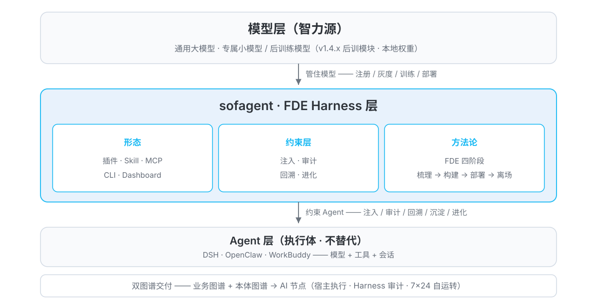

<p align="center"></p>

<p align="center">
  <a href="https://github.com/KongFangXun/sofagent/actions/workflows/verify.yml"></a>
  <a href="./LICENSE"></a>
  <!-- ⚠️ bump 版本时手动同步此 badges 版本号（Version-vX.Y.Z） -->
  <a href="./CHANGELOG.md"></a>
</p>

<p align="center"><sub>[简体中文](./README.md) | [English](./README.en.md)</sub></p>

> 🚀 **v1.4.4**——后训模块 · 信号与部署闭环（语料导出三件套 / 本地权重部署 / 产物→注册衔接 / 多基座对比 / 决策因果链 / CI 供应链加固 / 存量升级 / spec-first 硬禁令 / 审查收编批 / 五能力叙事）。**⏳ 待发版**（开发完成，tag/npm 发版时同步）。见 [CHANGELOG](./CHANGELOG.md)。

---

## 这是什么

**开源 FDE Harness 层。**一人公司 / 小企业的 AI 落地工程师——不睡觉、不离职、自带审计官。**横跨成熟 Agent（执行体：DSH / OpenClaw / WorkBuddy）、纵贯模型层（智力源：通用大模型 + 专属小模型 / 后训练模型）**，嵌在两者之间做治理。以 **FDE 插件 + Skill + MCP + CLI + Dashboard** 五种形态分发：进场，把业务流梳理清楚、把本体图谱构建起来、把 AI 节点部署到位；离场，审计每一次变更，持续优化。

> 💬 **一句话版本**：你的 AI 员工每次改代码、动文件，都先过一道安检、留一份记录、存一个快照——出事能查、能回滚，这就是 sofagent 干的事。

sofagent 不造 Agent——执行能力交给成熟宿主（模型 + 工具 + 会话），它交付的是 **FDE Harness 层**。**FDE Harness = FDE 方法论 × Harness 工程**——把前线部署工程师的打法（进场梳理 → 部署 → 离场）固化成 Harness 约束层（注入 · 审计 · 回溯 · 沉淀 · 进化），装进任何已有 Agent；让任何模型（通用或专属）都被管住（注册/灰度/训练/部署全留痕）。

> 🚂 **后训模块为什么在治理仓里**（30 秒答案）：治理的天花板是数据——审计发现的错误（哪些任务做砸了、哪种输出不合格）正是训练的燃料。后训模块把「审计出来的问题 → 修复问题的模型」这条闭环接通，让治理数据反哺模型层；训练资产本身走商业侧交付，治理仓只保留协议与接口（外部化 / 可配置）。

<p align="center">
  <br/>
  <sub>零配置审计实拍：一行命令审计最近一次 commit，密钥泄漏当场拦截</sub>
</p>

> 🏞️ 大厂给你"水"（大模型）和"河床"（Agent 平台），但水是原水，你不敢直接喝。sofagent 是帮你把河里的水让整个城市用起来的工程——堤坝不让水泛滥、自来水厂把原水变直饮水、管网把水送到每家每户的水龙头。模型给 90% 的智力，sofagent 补 10% 的可靠执行。

### 该不该装？

| 如果你是… | 建议 |
|----------|------|
| **给现有 Agent 加纪律**——已有 DSH / OpenClaw / WorkBuddy，想让 AI 干活时守规矩、留痕、出事能回溯 | ✅ **现在装**。核心价值就是约束层（注入 · 审计 · 回溯 · 沉淀 · 进化），装完即用 |
| **一人公司 / 小企业想落地 AI**——没有专职工程师，需要一个"不离职的 FDE"帮你梳理业务流、部署 AI 节点 | ✅ **现在装**。FDE Harness 层就是干这个的，从梳理到部署到离场审计全链路 |
| **要开箱即用的企业级 Agent 平台**——期待完整商业产品（多租户、权限管理、计费、SLA） | ⏸️ **暂缓**。sofagent 是治理层，不是平台产品——平台级能力不在本开源仓库范围内。有集成能力的团队仍可把约束层接入自有平台，作为其中的治理模块；纯开箱需求建议另选平台产品 |
| **纯研究 / 想看看约束层怎么设计**——读代码、学架构、借鉴方法论 | ✅ **现在装**。文档齐全（[HANDBOOK](./docs/HANDBOOK.md) / [ARCHITECTURE](./docs/ARCHITECTURE.md) / [PHILOSOPHY](./docs/PHILOSOPHY.md)），MIT 协议 |

## 核心特性

- 🧭 **进场梳理业务流**——五要素深挖 + 三问判定法，把每个岗位环节摸清，算清每个 AI 节点值多少钱
- 🤖 **部署 AI 节点**——三层交付物（文档层 + Skill 层 + 运行层），装进你已有的 AI 工具，从"你干活"变"你派活"
- 🏠 **离场后常驻**——FDE 能力留下巡检、审计、优化，7×24 在线守护（commit 时触发审计），人离场治理不离开
- 🔍 **零配置审计**——`npx -y -p @sofagent/audit sofagent-audit`，任何 git 仓库秒级审计最近一次 commit（单机实测：quick 约 1.1s、5 万行 diff 约 6.1s，口径见 [HANDBOOK](./docs/HANDBOOK.md)）
- 🧱 **24 条审计规则 + 80 个 MCP tool**——密钥泄漏、越界编辑、注入防御、权限红线，git diff 硬证据判定，违规当场拦截（critical 层命中后其余规则跳过——fail-fast 设计）；证据基于本地 diff，信任边界与已知绕过面见 [LIMITATIONS §三](./docs/LIMITATIONS.md#三安全与信任模型局限)（quick 默认 17 条，完整 24 条 = 17 默认 + 7 扩展）
- 🛡️ **自动快照回溯**——每次审计后自动存档，出事一键回到任意快照

## 什么是 FDE Harness

**FDE = Forward Deployed Engineer（前线部署工程师）**——把模型塞进企业真实业务里的人。sofagent 把这个角色做成开源 FDE Harness 层，嵌在你的 Agent（DSH / OpenClaw / WorkBuddy）与模型层之间，四个阶段走完一条完整的 FDE 业务流：**梳理业务流 → 构建双图谱 → 部署 AI 节点 → 离场持续优化**。双图谱 = 业务图谱（系统边界、数据流向）+ 本体图谱（共享语义底座），把企业变成机器可读的结构；离场后 7×24 巡检、审计、优化（审计在 commit 等变更事件时触发），人离场治理不离开。

<p align="center"></p>

**为什么是 FDE Harness**

- **企业 AI 落地的瓶颈不是模型，是部署**——MIT NANDA《生成式人工智能的鸿沟》：95% 的企业 GenAI 项目没能产生能写进财务报表的价值，而 FDE 岗位发布量一年涨了 729%（核验见 [VALIDATION](./docs/VALIDATION.md)）
- **完整来自组合**——DSH 解决「能干活」，sofagent 解决「持续干」，两者合起来才是完整的 FDE Harness（见下章）
- **约束层「持续优化」靠机制不靠承诺**——外部独立实验（ARC-AGI-3）：同一模型仅优化外层 Harness 可显著提升任务完成率。核验见 [VALIDATION](./docs/VALIDATION.md) · [THANKS](./docs/THANKS.md)
- **能力可迁移，绝不绑死单一平台**——约束层平台无关，方法论跟着业务走、不跟着平台走

> 🔄 **自举**：sofagent 给自己做的第一份 FDE，就是 sofagent 自己——项目本身就是一条完整的 FDE 业务流（梳理 → 构建 → 部署 → 离场），这个开源仓库就是那份交付物。

## v1.4.4：训练信号与部署闭环

🚀 让训练**信号出得来、部署落得下**——`corpus_export` 训练语料导出三件套（规则/FDE 方法论/带标签样本，27 编号位零遗漏 + reward 骨架 + 脱敏聚合）· `model_register source: 'local-path'` 企业专属模型本地权重部署（manifest 清单 + sha256 篡改拒绝 + `rollback-weights` 版本回滚）· 训练产物→注册自动衔接（train done + eval pass → model_register，双层幂等）· `train compare` 多基座对比训练（ROI 排序，选型不靠拍脑袋）· 决策因果链（`causedBy` 因果边 + 先例检索）· CI 供应链全 SHA 固定 + dashboard 完全离线 · 五能力叙事定稿（注入·审计·回溯·沉淀·进化）。（版本时点数字：MCP 79→80 tools、测试 3619→3753，见开发日志——当前口径以[核心特性](#核心特性)为准。）完整内容见[开发日志](./docs/changelog/v1.4/v1.4.4.md) · 更早版本见 [CHANGELOG](./CHANGELOG.md)。

## 多平台挂载

横跨你已有的 Agent、纵贯模型层，不替代模型，只补可靠执行——**FDE Harness 层平台无关**（插件 / Skill / MCP / CLI / Dashboard 五种形态按宿主能力分发），方法论跟着业务走，不跟着平台走：

| 档位 | 平台 | 约束注入 | 挂载方式 |
|------|------|---------|---------|
| **深度结合** | DeepSeek Harness | ✅ 插件级 | 9 款 `cordis-plugin-sofagent-*` 挂载进运行时（见上章） |
| **完整挂载** | OpenClaw / WorkBuddy | ✅ 自动 | Hook 注入四层约束 + 断路器 |
| **薄挂载** | Claude Code / Codex / Cursor / Gemini CLI | ⚠️ 半自动 | Skill 目录 symlink / AGENTS.md 种子指令 + git hook 审计 |

- **差在当前深度适配范围，不是差在 skill**——Claude Code、Cursor 也有 skills 目录（装完 Skill 同样能加载），差别是 sofagent 当前深度适配了哪些宿主：OpenClaw / WorkBuddy 已完成 Hook 通道接入（开机自动注入 + 断路器实时拦截）；Claude Code 支持 PreToolUse 等事件级 hook、Cursor/Gemini CLI 走 Skill 目录加载——未深度适配的平台约束随 Skill 文本加载（建议性），硬拦截统一交给 git hook（强制性）
- **审计兜底平台无关**——`sofagent-audit --install-hook` 走 git hook，任何档位每次 commit 都过 24 条审计，违规硬拦截。约束是建议性的，审计是强制性的

一条命令选定挂载档位：`bash install.sh --platform <平台名>`（全部平台与差异见 [HANDBOOK](./docs/HANDBOOK.md)）

## FDE 方法论

很多企业上 AI 的路径是反的——先选模型、搭平台、买 Agent，结果没人用。问题不在技术，在于**还没搞清楚自己的业务流程，就想让 AI 接管**。

多数工具教你怎么造 Agent，sofagent 先解决**AI 该放在哪**——把这个判断从拍脑袋变成可复制的方法论：

| 阶段 | 输入 | 做什么 | 产出 |
|------|------|--------|------|
| 一、梳理 | 岗位清单 · 现有系统 | **五要素深挖**——按岗位摸清每个环节的输入 / 输出 / 负责人 / 耗时 / 痛点 | 企业画像 |
| 二、判定 | 企业画像 | **三问判定法**——从业务节点识别可 AI 化的：🔄 自动执行 / ⚡ 强化岗位 → **AI 节点**，👤 暂不动，按 ROI 排优先级 | 节点方案 + 年节省金额 |
| 三、交付 | 节点方案 | **三层交付物**——文档层 + Skill 层 + 运行层，让 AI 节点真的跑起来 | 本体数据（ontology）+ workflow.yml + skills/ |

完整方法论（四阶段十二步）见 [FDE/GUIDE.md](./FDE/GUIDE.md)——半天精读，读完能独立做 FDE。

> 💾 **部署完别急着走**：单个节点的 workflow 经 DeepSeek Harness 执行后端直接「烧」进 U 盘——U 盘就变成一个节点、一把 key，插到哪台机器哪台就能跑（拔掉零残留）。开源 9 款插件已挂载进 DSH，烧录即用。

## FDE Skill 体系

部署 AI 节点只是第一步——上面讲的是怎么梳理、放哪里，接下来是怎么让它每次都守规矩。随节点一起加载的 FDE Skill 体系解决这个问题：

- 📜 **SKILL.md**——唯一主入口，由你的 AI 工具加载：按阶段路由到对应子 Skill，岗位规范按任务类型自动注入（梳理 / 审计 / 编排）
- 🧩 **阶段子 Skill**——进场 → 深挖 → 量化 → 交付 → 离场五步闭环（01-entry → 05-exit），每一步该做什么、交付什么都定义清楚
- 🔒 **harness 约束骨架**——entry-gate / fde-template / engage / loop-check / task-closure…，从进场到离场每一步都有对应的约束模板
- 📚 **知识资产管道（沉淀能力）**——think.md 反思 + knowledge 维护的结构化管道已就绪；持续使用场景下的沉淀效果实测数据积累中（详见 [LIMITATIONS §核心效果实测情况](./docs/LIMITATIONS.md#核心效果实测情况)）

> 部署的不是裸 Agent，是**带约束骨架的 Agent**——约束是建议性的，审计是强制性的：Agent 可以不遵守约束，但每次变更都逃不过审计。

## 约束层（Harness）

约束层是 sofagent 的行为底座，五种能力：

- **注入**——Agent 启动时注入企业约束，四层加载链；约束是建议性的
- **审计**——24 条 git diff 硬证据规则（quick 零配置默认 17 条，扩展 7 条经 config 启用）+ AgentShield 五类配置面静态扫描；审计是强制性的，每次变更必审，违规当场拦截
- **回溯**——每次审计后自动快照存档，出事一键回到任意快照
- **沉淀**——审计轨迹、think.md 反思、行业案例蒸馏成可复用知识资产（knowledge/ 知识库 + SKILL 文件；知识沉淀当前为格式管道，内容填充随模型接入推进，见 [LIMITATIONS](./docs/LIMITATIONS.md)）
- **进化**——think.md 反思 + Dream Cycle + skillopt，消费沉淀的知识资产自动变强（知识沉淀当前为格式管道，内容填充随模型接入推进，见 [LIMITATIONS](./docs/LIMITATIONS.md)）

## 安装

> ⚠️ **企业用户先读** [LIMITATIONS §三](./docs/LIMITATIONS.md#三安全与信任模型局限)——`config.yml` 默认**非 fail-closed**（规则可被 Agent 篡改绕过），多租户隔离尚未落地。强合规场景建议 CI 兜底 + 文件权限锁（`chmod 444 .sofagent/config.yml`），不要用单机默认配置直接上生产。

**30 秒，零配置**——在任何 git 仓库跑一次审计：

```bash
npx -y -p @sofagent/audit sofagent-audit
```

> 💡 quick 跑 17 条默认规则（A3 任务范围 / A9 commit-msg 注入检测激活——自动读最近一次 commit 消息，无消息时 A9 引擎按无输入处理标记跳过），完整 24 条 + hook 自动审计需 `--init`——详见 [LIMITATIONS §三](./docs/LIMITATIONS.md#三安全与信任模型局限)。

拦截特定格式密钥泄漏时是这样的（真实输出；A2 检测 AWS AKIA/Secret、OpenAI sk-*、GitHub ghp_、Google AIza、Slack xox*-、JWT、PEM 私钥等已知格式，通用密钥形态暂不覆盖——保守设计防误报，详见 [LIMITATIONS §三 A2](./docs/LIMITATIONS.md#三安全与信任模型局限)）——首屏的实拍图即此场景，此处不再重复。

**完整安装**（Node.js ≥ 18，先下载审查再执行）——**装在企业跑 AI 节点的设备上**：

```bash
curl -fsSL https://raw.githubusercontent.com/KongFangXun/sofagent/refs/tags/v1.4.3/bootstrap.sh -o bootstrap.sh
less bootstrap.sh          # 先看一眼脚本内容，确认安全
bash bootstrap.sh && rm bootstrap.sh
sofagent-audit --init      # 装 git hook，之后每次 commit 自动审计
sofagent-audit --doctor    # 验证环境（可选）
```

> 💡 安装脚本主要写入 `~/.sofagent/`（数据目录）+ `~/.local/bin`（CLI 入口）；检测到 OpenClaw 时额外写入其集成目录；npm 权限不足时 CLI 入口 fallback 到 `/usr/local/bin`。其余系统文件零改动。`--init` 安装三层防线 git hook（pre-commit 拦 .sofagent/ 入库 + commit-msg 规则审计 + post-commit 对账）；`--no-verify` 可跳过 commit-msg 审计——防的是诚实 Agent 的疏忽不是恶意绕过，被跳过的 commit 由 post-commit 事后对账留痕（提示「疑似绕过」）但不阻断；个人兜底三件事：CI 侧 `sofagent-audit --diff`、定期 `--doctor`、翻审计记录。详见 [LIMITATIONS](./docs/LIMITATIONS.md)。
>
> 📌 **install.sh 是企业设备安装器**——装在企业跑 AI 节点的设备上（约束层引擎 + daemon 巡检 + 单机 dashboard）；FDE 自己的电脑不需要跑，FDE 的工具是 [FDE Skill](https://clawhub.ai/kongfangxun/skills/sofagent)（方法论），详见 [部署架构](./docs/ARCHITECTURE.md#安装包边界与部署架构v132-定位校准)。
>
> 📌 **bootstrap.sh 和 install.sh 的关系**：bootstrap.sh 是 install.sh 的一行下载包装器——`curl bootstrap.sh | bash` 等价于「下载 install.sh + 运行 install.sh」。两个脚本装的是完全一样的东西，bootstrap 只是省掉手动 clone/下载那一步。

更多安装方式（clone 安装 / npx 完整安装 / 最小安装 / 企业部署）见 [HANDBOOK](./docs/HANDBOOK.md)。企业用户想直接用 FDE 方法论梳理业务流，看 [FDE/README.md](./FDE/README.md)（零依赖，不需要 Node.js；15 分钟最短路径见其「15 分钟最短路径」小节）。

## 使用

<p align="center"><br/><sub>Dashboard 驾驶舱（单文件 HTML · 截图版本 v1.4.0）：规则通过率、审计任务、违规趋势——AI 在干什么，一眼看清。<br>（实际界面以安装态为准）</sub></p>

> 📊 **Dashboard 有三个入口，各归各位**：
>
> | 入口 | 命令 | 形态 | 给谁看 |
> |------|------|------|--------|
> | **终端版** | `sofagent-dashboard --full` | 终端 ASCII 三栏（零前端依赖） | 开发者 / FDE 快速看 |
> | **Web 版** | `sofagent web`（装完即用）· 仓库态 `node tools/dashboard/serve-dashboard.mjs` | 浏览器可视化（localhost:3780） | 老板 / IT 可视化看 |
> | **macOS 双击** | 双击 `start-dashboard.command` | Web 版的 macOS 快捷方式（仅 macOS 双击入口） | macOS 用户 |

> 👁️ **Agent 视角**：装完 hook 后每次 commit 触发审计——PASS 输出简短回声后放行（自动快照），违规直接打进终端输出并按配置推送 Webhook / IM，Agent 侧无独立图形界面（详见 [PHILOSOPHY §二](./docs/PHILOSOPHY.md#系统暴露的能力agent-视角)）。

<p align="center"></p>

| 入口 | 做什么 | 装在哪 | 花多久 |
|------|--------|--------|:----:|
| **`npx -y -p @sofagent/audit sofagent-audit`** | 零配置审计最近一次 commit，秒级出结果（首次 npx 约 30 秒） | 任意 git 仓库（临时） | 30 秒 |
| **`--ruleset` 规则市场** | 加载安全等规则集，或自定义 JSON 规则 | 同上 | 1 分钟 |
| **GitHub Action** | 每次 PR 自动审计，违规标注在 diff 行上 | CI/CD | 配置一次 |
| **install.sh 全套** | 注入·审计·回溯·沉淀·进化五能力 + daemon 巡检 + dashboard——Agent 的完整约束层 | **企业设备**（跑 AI 节点的服务器/电脑） | FDE 驻场安装 |

**安装粒度对比**（同一个引擎，三种装法——按场景选）：

| 装法 | 命令 | 生命周期 | 适合 |
|------|------|---------|------|
| npx 临时 | `npx -y -p @sofagent/audit sofagent-audit` | 用完即走，每次重新下载 | 任意仓库快速审计、CI 外的一次性检查 |
| npm 项目内 | `npm install @sofagent/audit`（项目 devDependency） | 随项目安装，版本锁进 package-lock | 固定依赖的团队项目、可复现审计 |
| npm 全局 | `npm install -g @sofagent/audit` | 装一次到处用 | 跨仓库日常审计、daemon 常驻 |

**规则市场**——社区规则集以 `sofagent-ruleset-*` npm 包发布、`--ruleset-path` 手动加载（也支持指向你自己的 JSON 规则）：

```bash
npx -y -p @sofagent/audit sofagent-audit --list-rulesets      # 看有哪些规则集
npx -y -p @sofagent/audit sofagent-audit --ruleset security   # 加载安全规则集
```

**FDE 进场部署**——两条路径任选：

- **方法论路径**（零依赖）：读 [FDE/GUIDE.md](./FDE/GUIDE.md)，按手册手动梳理业务流，Excel + 人脑也能跑
- **工具路径**（Node.js ≥ 18）：FDE 在企业设备上跑 install.sh 装好约束层后，用自己的 AI 工具说"帮我做 FDE 诊断"，Agent 从进场开始引导

## 常见问题

- **能上生产吗？** 当前为单机单用户设计，多 Agent 共享同一知识库 / 审计历史，多租户隔离见 [ROADMAP](./docs/ROADMAP.md)；当前 task/logs 为明文——数据静态加密接线未启用（排期 v1.4.7），且接线范围暂不覆盖 task/logs（该目录在审计历史主链之外，见 [LIMITATIONS §三](./docs/LIMITATIONS.md#三安全与信任模型局限)）。企业部署前读 [SECURITY](./SECURITY.md) · [LIMITATIONS](./docs/LIMITATIONS.md)。`config.yml` 默认非 fail-closed，强合规场景建议 CI 兜底 + 文件权限锁。
- **收集我的数据吗？** 缺省全量本地。可选联邦查询 = 你主动配置才出本机（见 SECURITY）。
- **和 gitleaks 这类扫描器什么关系？** 互补不互替——扫描器做全量历史扫描、模式库更广；sofagent 专注当前 diff 硬证据 + Agent 行为审计（越界 / 注入 / 权限维度），建议强密钥合规场景并用。

## 生态与文档索引

**Featured in**（社区收录）：

[](https://glama.ai/mcp/servers/KongFangXun/sofagent)
[](https://github.com/punkpeye/awesome-mcp-servers/pull/13312)
[](https://github.com/ai-boost/awesome-harness-engineering/pull/227)
[](https://github.com/e2b-dev/awesome-ai-agents/pull/1471)

**上游与插件入口**：

- DeepSeek Harness（DSH 上游仓库）：<https://github.com/deepseek-ai/deepseek-harness>
- Cordis 运行时：<https://github.com/cordiverse/cordis>
- 9 款 `cordis-plugin-sofagent-*` 插件源码：[`engine/dsh-plugins/`](./engine/dsh-plugins/)

| 你想了解 | 看哪里 |
|:---------|:--------|
| **全局索引**（所有文档一个入口） | [WIKI](./docs/WIKI.md) |
| 怎么装、怎么用、常见问题 | [HANDBOOK](./docs/HANDBOOK.md) |
| 架构设计（约束层「对内的技术名字」 · 注入链 · 进化机制 · 24 条规则） | [ARCHITECTURE](./docs/ARCHITECTURE.md) |
| 接口总览（六大接口面 + 80 MCP tools 清单） | [API](./docs/API.md) |
| 设计哲学 | [PHILOSOPHY](./docs/PHILOSOPHY.md) |
| 行业印证与生态定位（与现有工具的差异） | [VALIDATION](./docs/VALIDATION.md) |
| 版本路线图 | [ROADMAP](./docs/ROADMAP.md) |
| 每个版本做了什么 | [CHANGELOG](./CHANGELOG.md) |
| FDE 诊断方法论（四阶段十二步） | [FDE/GUIDE.md](./FDE/GUIDE.md) |
| 安全声明 · 已知局限 | [SECURITY](./SECURITY.md) · [LIMITATIONS](./docs/LIMITATIONS.md) |
| 贡献指南 | [CONTRIBUTING](./CONTRIBUTING.md) |

> 🧪 **工程可信度**：3753 测试 / 13 引擎包 + 13 插件（引擎包 = 12 主包 + 1 load-chain；插件 = 9 DSH + 4 OpenClaw，插件测试经根 `npm test --workspaces` 统一执行）· 24 条审计规则 · fresh-eyes 独立审查持续运行（测试数以 `tools/check/test-count.sh` 判定为准，环境注意事项见 [docs/guides/review-system.md](./docs/guides/review-system.md)。性能数据为单机参考值，跨工具横评排期 v1.4.x 与 Benchmark 集成）。

---

<p align="center">
  欢迎提 Issue 和 PR，尤其较真的那种 · <a href="./CONTRIBUTING.md">贡献指南</a> · <a href="./docs/THANKS.md">致谢</a><br/>
  <sub>MIT License © <a href="https://github.com/KongFangXun/sofagent">孔放勋</a> · <a href="https://github.com/KongFangXun/sofagent">⭐ 如果 sofagent 帮到你，Star 一下让更多人看到</a></sub>
</p>
