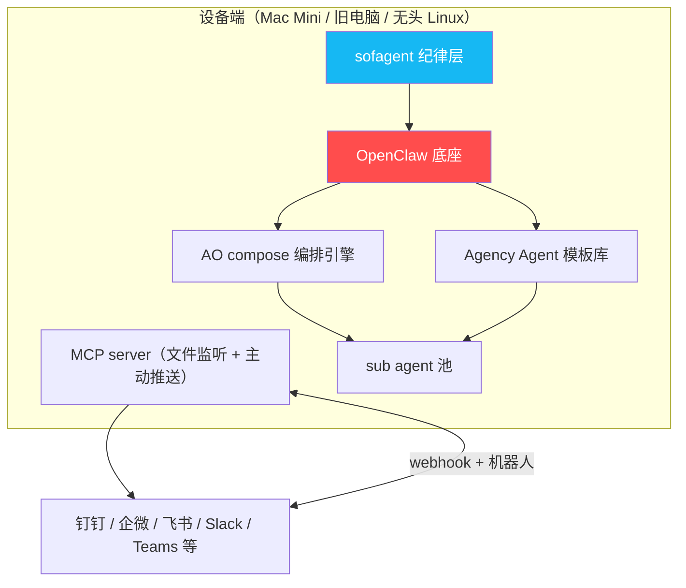

# 路线图 · Roadmap

> 已经做了什么、未来要去哪、哪些地方需要你的帮助。
> v0.93 · 2026-06-26 · 工程迁移 + 实验验证——4 项 FP 修复 + bash→TS 迁移 + 10 组实验完成（纪律层增量 = f(陷阱难度)，高难度场景 0% vs 100% 误伤）
>
> **先证明纪律层增量是真的，再做其他任何事。**

---

## 目录

- [**现在在哪：v0.93**](#现在在哪v093)
- [**迭代历程**](#迭代历程) — 倒叙，从最新到最早
- [**未来去哪**](#未来去哪) — v0.94 → v1.0 → v2.x
- [**探索方向**](#探索方向)
- [**不需要的**](#不需要的)
- [**欢迎参与**](#欢迎参与)

---

## 现在在哪：v0.93

> v0.93 是**工程迁移 + 实验验证版本**。v0.92 经三视角全身审查（GitHub 大神 + 企业 CTO + 未来参与者），17 项问题中的 11 项落地。

| 级别 | 交付 | 状态 |
|------|------|:--:|
| P0 | 4 项 FP 修复（deleted / docker build / 低风险排除 / --strict 模式）+ rule-07 ^锚点修复 | ✅ |
| P1 | bash→TS 迁移（verify-evidence + skill-safety-check）+ 检测精度闭环（27 cases FP=0% FN=0%）| ✅ |
| P2 | 6 项文档修缮 + package.json bin 补齐 + 温故知新增量吸收 | ✅ |
| 实验 | 10 组对照实验完成：纪律层增量 = f(陷阱难度)——高难度 0% vs 100% 误伤，低难度无差异 | ✅ |
| 代码 | 7 files / 100 tests / build 全绿 / 零 execSync | ✅ |

> 📖 [详细开发日志](./docs/changelog/v0.93.md) · [实验总览](./docs/benchmark/2026-06-26-openclaw-task2-4-summary.md)

---

## 迭代历程

> 倒叙排列，从最新到最早。每个版本有独立开发日志。

### v0.93 — 工程迁移 + 实验验证 ✅

> v0.92 全身审查落地 + bash→TS 迁移 + 10 组实验完成。📖 [开发日志](./docs/changelog/v0.93.md)

| # | 交付物 | 说明 |
|:--:|------|------|
| 1 | **4 项 FP 修复 + --strict** | deleted / docker build / 低风险排除 / ^锚点 / strict 模式 |
| 2 | **bash→TS 迁移** | verify-evidence + skill-safety-check（额外发现 2 个 bash bug） |
| 3 | **检测精度闭环** | 27 cases JSON fixture，FP=0% FN=0% |
| 4 | **10 组对照实验** | 4 任务 × 2 条件 × 独立 session，结论：增量 = f(陷阱难度) |
| 5 | **6 项文档修缮** | 信任模型精确化 / 中英文对齐 / 温故知新吸收 / LIMITATIONS 补 recovery path |
| 6 | **bin 补齐** | verify-evidence + skill-safety-check CLI 入口 |

### v0.92 — 审查修复 ✅

| # | 交付物 | 说明 |
|:--:|------|------|
| 1 | **安全加固** | execSync→execFileSync + range 格式校验，命令注入零残留 |
| 2 | **信任模型声明** | LIMITATIONS + audit-design + README 三层诚实标注 |
| 3 | **铁律 #1 检测加固** | 子串匹配→精确 basename，支持无扩展名文件，否定语义过滤 |
| 4 | **工程欠债清算** | bash 技术债标注 + TS utils + set -e 统一 + 69 tests + 规则注册表 |
| 5 | **文档预算** | 全局预算明确化 + ROADMAP 砍削 + FDE 收敛 |
| 6 | **反转实验启动** | 🔴 Task 1 OpenClaw 对照完成（sofagent 0% 误伤 vs 裸 100%），10 组进行中 |

---

### v0.91 — 评审落地 + sofagent-audit MVP ✅

> 两份独立评审（GLM-5.2 + DeepSeek V4 Pro）共识落地，启动提交时审计战略转向。📖 [开发日志](./docs/changelog/v0.91.md)

| # | 交付物 | 说明 |
|:--:|------|------|
| 1 | **sofagent-audit MVP** | TypeScript CLI，扫描 git diff 对标 4 条铁律（#1/#3/#7/#10），exit code 0/1/2。不依赖 Agent 运行时配合，跨平台 |
| 2 | **ARCHITECTURE 瘦身** | 710→378 行（47% 减），只回答"为什么这么设计" |
| 3 | **ROADMAP 版本号理顺** | v0.9 15+ 处引用 → 按内容分拆为 v0.91/v0.92/v0.93 |
| 4 | **COMMUNITY.md** | 社区状态 + 贡献者阶梯 + 透明指标看板 |
| 5 | **engine.md Ghost 超时** | 第 7 个失败分支——Agent 无响应超时（28% 数据） |

> v0.90 交付物（安全审查 + 数据声明 + 3 个 P0 修复 + FDE 叙事）仍在生效，详见 [v0.90 开发日志](./docs/changelog/v0.90.md)。

---

### v0.86 — 运行时加固 ✅

> engine.md 读写型分流 + 19 项学习笔记约束落地 + 8 项评审反馈。📖 [开发日志](./docs/changelog/v0.86.md)

| # | 交付物 | 说明 |
|:--:|------|------|
| 1 | **读写型复杂任务分流** | engine.md A4——写型复杂不拆子 Agent，走单 Agent 高质量上下文模式 |
| 2 | **Loop 成熟度四问** | loop-check.md closure——怎么停/谁判通过/失败怎么反馈/何时交还人类 |
| 3 | **19 项学习笔记约束落地** | ROADMAP + ARCHITECTURE + loop-check + engine + DEVELOPMENT |
| 4 | **8 项评审反馈** | 适用范围声明、平台能力表、token 比例化、跨平台纪律标准、bash→Node.js 演进 |

---

### v0.85 — 定位重构 + ROADMAP 砍削 ✅

> 不改代码逻辑，改定位和路线。📖 [开发日志](./docs/changelog/v0.85.md)

| # | 交付物 | 说明 |
|:--:|------|------|
| 1 | **定位校准** | 「Agent 治理层」→「Agent 纪律层」 |
| 2 | **ROADMAP 砍削** | 20+ 项企业级功能砍到合规刚需 3 项 + 验证工具 3 项 |
| 3 | **验证实验设计** | 45 组对照（3 模型 × 5 任务 × 3 次），确定性指标 + 盲评 + 反转设计 |
| 4 | **sofagent Lite** | `install.sh --lite`——30 秒只装宪法层 |
| 5 | **sofagent-audit 方向确立** | 提交时审计——从预防转向检测，不依赖 Agent 运行时配合 |
| 6 | **编排引擎降级** | `--no-ao` 升为非 OpenClaw 推荐默认 |

**能用的（v0.84 继承）**：OpenClaw 上 Agent 能读到宪法，复杂任务自动拆解，跑完自我复盘。日志脱敏，过期数据清理。`install.sh` 一键安装。daemon 已跑通骨架。5 组 A/B benchmark 数据已回。

**还不太行的**：加载链在非 OpenClaw 平台靠 Agent 自觉。治理加固仅在 OpenClaw 生效。纪律层增量未排除知识传递效应。数据明文存储。

---

### v0.82 — 五平台实测 ✅

> v0.81 评审问题修复 + 五平台能力矩阵全部填入实测数据。📖 [开发日志](./docs/changelog/v0.82.md)

实测底线确认：步数闸 / 熔断闸 / 幂等检查 / 评判器隔离在非 OpenClaw 平台均不生效。

---

### v0.81 — daemon 核心骨架 + 治理加固 ✅

> daemon 进程 + 5 项治理加固（步数闸、熔断闸、幂等检查、评判器隔离、意图债）。📖 [开发日志](./docs/changelog/v0.81.md)

- macOS launchd + Linux systemd 注册，crash 自动重启
- GitHub Actions CI（Linux）
- daemon 检测 think.md / rules.md 变化后写 daemon-notice.md

---

### v0.75 — 降低试用门槛 + 补可信度数据 ✅

> 门面和可信度——让看到项目的人更愿意试一下，让试过的人能看到数据。📖 [开发日志](./docs/changelog/v0.75.md)

- benchmark.sh A/B 数据、demo.gif + 架构图 + 截图
- 英文 README + EVIDENCE
- Co-maintainer 招募（Contributor→Triage→Co-maintainer）
- LICENSE 统一为 MIT
- CI/CD + Migration Checklist

---

### v0.74 — 治理层自身治理 ✅

> 修治理层自己的文档臃肿、可信度缺口和易用性短板。📖 [开发日志](./docs/changelog/v0.74.md)

- 文档拆分 + 去重
- benchmark.sh API 模式、EVIDENCE 最小模板
- verify.sh --quick、一行安装
- Scoring 基准线报告

---

### v0.73 — 运行时逻辑加固 ✅

> 三道闸门体系落地 + 编排引擎加固 + 记忆系统最小闭环。📖 [开发日志](./docs/changelog/v0.73.md)

- 任务闸 / 执行闸 / 验收闸
- 记忆三规则（写入/合并/遗忘）
- scoring 第九维——弃权率
- ComplexityScorer 模型路由
- rules.md 升级 + constitution/ 扁平化

---

### v0.72 — 门面实证 ✅

> 修 README 里「说有但做不到」的宣称，给效果一个可复现的基准。📖 [开发日志](./docs/changelog/v0.72.md)

- README 平台能力表重构
- benchmark.sh、anti-cases 反案例目录
- handler.ts 回归验证、ao compose 依赖加固

---

### v0.7x — 企业合规 ✅

- 数据保留策略（cleanup.sh 自动清理 + tar.gz 归档）
- task/logs 脱敏（API Key / 密码 / 手机号写入前打码）
- 审计日志（task-record.sh 独立审计日志 + task/logs 追溯双通道）

---

### v0.6x — 质量加固 ✅

- 新会话端到端测试：OpenClaw + WorkBuddy 已验证
- 端到端闭环验证：task/logs → think.md → scoring/ → orchestrator/
- WorkBuddy 专家团共存 + load-chain.sh 权重折半

> ⚠️ v0.60 发布自检：Agent 声称"跑了 sofagent"，实际只读了 1/3。SKILL.md 层面改不动，强制力只能来自外部 Hook。v0.64 起 OpenClaw 通过内部 hook 实现强制注入。

---

### v0.5x — 企业级能力 ✅

- install.sh / uninstall.sh 一键安装卸载
- 离线模式 + `--no-ao` 参数
- 编排 fallback + 企业部署文档
- .sofagent/ 权限加固（chmod 700）+ 配置注入开关

---

### v0.1 ~ v0.4 — 治理核心 ✅

- **4 底线 + 10 铁律**：宪法层，定义 Agent 不可逾越的行为边界
- **Loop Agent**：checkpoint / failure / closure 三层循环
- **三层闸门**：入境 → 每任务 → Loop → 离境
- **渐进减薄编排**：跑顺减步骤、跑崩加回来
- **think.md 反思区**：持久化跨 session 经验积累
- **scoring 技能记录**：按使用频率动态调整 Skill 信任等级
- **task-orchestrate 脚本引擎**：复杂任务自动拆解为 L1~L4 编排深度
- **seed-plan 种子指令方案**：最小化加载链（SKILL.md → think.md → rules.md），~3,100 token 地基

---

## 未来去哪

> ⚠️ 诚实地说：下面是**方向**，不是承诺。没实测过的事标「不知道」——不画饼。
> **v0.85 砍削原则**：验证优先于功能，先证明纪律层增量是真的，再做其他任何事。

### 终局：设备端 Agent 纪律委员

sofagent 会变成一台设备上的 **Agent 纪律委员**。安装时自动带 OpenClaw，通过它调度设备上任意 Agent。固定 workflow 节点只需首次编排——AO compose 拆解 + Agency Agent 注入模板后固化，之后每次开启新 session 复用即可。做完的结果通过 MCP server 直接推到支持 webhook 的企业协同平台。**数据主权在设备**——所有记忆、日志、决策记录永不离开本地。一台设备 = 一个 7×24 的 AI 工作流节点。

---

### v0.9x — 纪律层验证 + 工程基底

#### v0.93：工程迁移 + 检测精度闭环 + 文档修缮

> ⚠️ 如果 10 组实验增量无法复现，MCP server 和 Agency Agent 对接顺延，优先做文档精修和社区复现。

- task/logs JSONL 结构化日志：MD→JSONL，审计工具精确匹配
- MCP server MVP：watch `.sofagent/task/logs/`，任务完成立即推送
- 对接 Agency Agent 模板库（同一开发者，天然兼容，不需要从零建模板注入器）
- OpenClaw 预装集成：`install.sh` 自动装 OpenClaw + 注册系统服务
- 合规三件套（脱敏增强 + 审计报告 + 保留策略强制执行）
- **文档精修**：DEVELOPMENT.md 重构（绿灯路径检测独立成节 + 状态账本模板）、ARCHITECTURE.md 引用砍削（Hirom+Lima 合并）、信任模型缓解措施完善
- **社区复现计划**：标准化复现脚本 + COMMUNITY.md 第三方复现任务入口
- demo.gif 录制（实验数据完整后）

> ⚠️ 如果 10 组实验增量无法复现，MCP server 和 Agency Agent 对接顺延，优先做文档精修和社区复现。

#### v0.95：首个企业平台 webhook

- 支持 webhook 的企业协同平台接入（选一个平台做 MVP，如飞书或 Slack）
- 任务完成 → MCP server 检测 → 主动推送到企业平台
- 支持 webhook bot 机器人接收任务 + 回传结果
- 对标 Claude 的 Slack 集成

#### v0.96：跨 Agent 分发 + 实验验证

- OpenClaw AO compose 拆解任务 → Agency Agent 注入模板 → sub agent 执行
- 45 组反转实验数据分析：p<0.05 证实 / p≥0.05 存疑 / 无趋势证伪
- **最坏情况预案**：如果增量无法复现——诚实发表结果

#### Beta 公测（v0.97-0.99）

- 招募 20 个用户（至少 2 个企业场景），30 天试用
- Beta 期间只修反馈，不加新功能
- 飞书 webhook 接入（补第三个平台）

---

### v1.0 — 正式版：设备端纪律委员

**什么时候发**：当下面这些条件同时满足：

- 纪律层增量在反转实验中被证实
- OpenClaw 预装 + AO compose + Agency Agent 全链路跑通
- MCP server + 至少一个企业平台 webhook 跑通
- daemon 在 macOS 和 Linux 上稳定运行 ≥ 30 天
- 至少 3 个外部用户的 30 天使用数据
- install → verify → 首次任务通过率 ≥ 90%
- 能力矩阵五个平台都有实测数据

**发布动作**：GitHub Release + 更新 ClawHub/SkillHub + v1.0 公告。

---

### v1.x — 发布后

> 纪律层验证通过后再评估的功能。

| 想法 | 难度 | 说明 |
|------|:--:|------|
| age 加密 | 🔧 | age 加密 think.md + task/logs |
| 多用户隔离 | 🔧 | 同机权限隔离 + 共享 rules.md |
| 多企业平台 webhook | 🔧 | 飞书 + 自定义 webhook |
| 记忆架构升级 | 🔧 | Ledger-Views-Policy 三层模型 |
| Skill 自进化 | 🔧 | SkillOpt + TRACE2SKILL + Evil Skill |
| 成本仪表盘 | 🔧 | bash 读 task/logs 输出 token/循环次数/失败率 |
| Windows 支持 | 🔧 | PowerShell 平行实现（待需求验证） |
| 认知投降防线 / 外部评估器 / loop-check 反驳层 | 🔧 | 原 v1.x |
| 企业 workflow 可视化后台 | 🔧 | Web 后台快速梳理企业 workflow，可视化画布中每个节点对应 sofagent 的固定 Agent session |
| 分布式反思同步 | 🔧 | 多设备 Agent 反思聚合——参照 Gossip 去中心化协议（vs 中心化黑板）+ 信任加权投票（基于历史正确率动态权重矩阵）处理多 Agent 冲突裁定。CAP 理论权衡框架与 sofagent「不追求完美方案」哲学一致 |

---

### v2.x — 多设备协同（规划中）

> v1.0 之后——从单设备纪律委员进化到跨设备联邦。模型厂不做硬件、不做跨平台治理、不做本地数据治理，这三个"不做"就是 sofagent 的生存空间。

**四阶段渐进**：
1. 协同编排协议：Markdown 优先，人可直接阅读、git 可 diff
2. Agent 发现与注册：内网自动发现 + 手动白名单
3. 跨设备任务分发：根据能力画像智能分派
4. 企业 Agent 知识库：多设备蒸馏记忆聚合到企业自有 NAS 或云盘，知识库管理员 Agent 自动分类、去重、建索引，通过 MCP server 连接器同步

**设计原则**：数据主权在设备、存储在企业自己指定的云端、Markdown 优先、渐进式、治理不僭越。

---

## 探索方向

> 值得想但不着急做。记下来防止遗忘，等主线稳了之后再回头看。

| 方向 | 面向谁 | 一句话 |
|------|------|------|
| **CI/CD Gate** | 工程团队 / DevOps | 铁律打包成 GitHub Action，PR 自动检查 Agent 生成的代码 |
| **sofagent Lite** | 个人开发者 | 只有宪法（SKILL.md）+ 反思（think.md），30 秒装好 |
| **审计报告** | 企业管理者 / 合规 | task/logs → "你的 Agent 这周有没有违反铁律"的周报 |
| **轻量插件** | 非 OpenClaw 平台用户 | 浏览器/IDE 插件在 DOM 层注入 1-2 条核心铁律，最低限度的纪律层 |
| **双闸验证** | 安全敏感场景 | 工具执行前 gate + 执行后副作用复查（Google Cloud Code 模式）——不光问「能不能做」，还要问「做完了对不对」 |
| **审计工具健康度** | DevOps / 长期运维 | sofagent-audit 规则本身也需要被审计——规则是否因模型升级失效？baseline 是否悄悄漂移？ |
| **Agent 疲劳度检测** | 长时间任务用户 | 监控上下文窗口污染和决策质量衰减信号，铁律 #2 的专门化扩展 |
| **IDE 实时防护整合** | Cursor/Copilot 用户 | 与 IDE 原生能力（diff 级撤销、inline suggestion）的整合方向 + 道德风险检测 |

---

## 不需要的

以下认真考虑过但决定不做：

| 想法 | 为什么不 |
|------|------|
| 自研行为验证器 `behavior-validator.js` | OpenClaw 原生 `tools.loopDetection` 已覆盖 |
| 定时触发（cron） | 当前所有 Agent 平台都不支持 cron 级定时 |
| 动态 Skill Hook | OpenClaw 不支持 Skill 级动态 Hook |
| Connector（连接外部系统） | sofagent 是纪律层，不是自动化流水线。Markdown 文件就是接口 |
| 记忆压缩自动化 | v0.56 前试过，已取消。每个 Agent 有自己的记忆 |

---

## 欢迎参与

| 你能做的事 | 大约多久 | 说明 |
|------|:--:|------|
| 跨平台测试 | 30 分钟 | 你有 Codex / Hermes Agent / Claude Code？装一下，告诉我们能不能跑通 |
| 补充 FAQ | 20 分钟 | 你踩了什么坑？直接改 Handbook §六 |
| 文档翻译 | 1-2 小时 | Handbook 只有中文，英文翻译对社区意义巨大 |
| 第三方证据 | 1 周 | 装完用一周，填 EVIDENCE.md。你的真实数据比我们的自我感觉有用一万倍 |
| 安全审计 | 不限 | 欢迎给 SECURITY.md 挑刺 |
| 企业场景反馈 | 30 分钟 | 你们团队怎么用 Agent？直接开 Issue |

以上任何一个想法，直接开 Issue 讨论或提 PR。没写过开源项目？没关系——这个项目的作者也没写过代码。所有文件都是和 AI 合作生成的，**你的想法比你的代码量重要**。
→ [CONTRIBUTING.md](./CONTRIBUTING.md)
