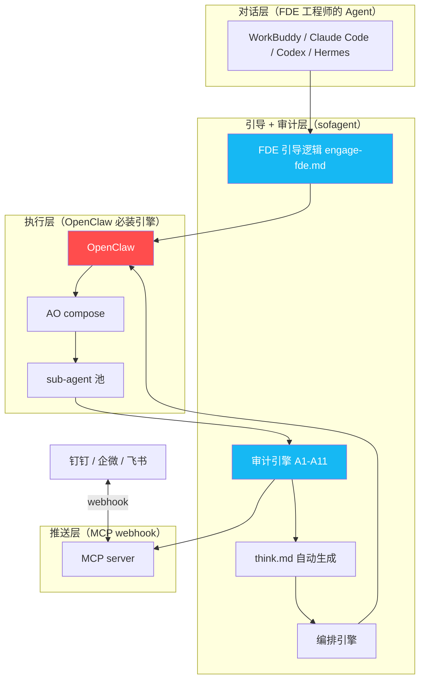

# 路线图 · Roadmap

> 已经做了什么、未来要去哪、哪些地方需要你的帮助。
> v0.98 · 2026-06-30 · 架构重组版——产品核心从事前约束转向事后审计 + FDE 企业部署，OpenClaw 重定义为必装引擎，v1.0 定位转向 FDE 部署底座。详见 [v0.98 开发日志](./docs/changelog/v0.98.md)
>
> **先跑通 FDE 部署闭环，再谈其他。**

> 🎯 **v1.0 定位**：**FDE 部署底座**——帮 FDE 工程师快速梳理企业 workflow → 定义 AI 节点 → 部署到任意设备 → 审计结果自动推送到协作平台。审计引擎是主产品，FDE 引导逻辑内联，think.md 由审计引擎自动生成。

---

## 目录

- [**现在在哪：v0.98**](#现在在哪v098)
- [**迭代历程**](#迭代历程) — 倒叙，从最新到最早
- [**未来去哪**](#未来去哪) — v0.99 → v1.0 → v2.x
- [**探索方向**](#探索方向)
- [**不需要的**](#不需要的)
- [**欢迎参与**](#欢迎参与)

---

## 现在在哪：v0.98

> v0.98 是 **架构重组版**——产品核心从事前约束转向事后审计 + FDE 企业部署，OpenClaw 重定义为必装引擎。详见 [v0.98 开发日志](./docs/changelog/v0.98.md)。

| 级别 | 交付 | 状态 |
|------|------|:----:|
| P0 | 产品架构重组（lite 删除 + rules→FDE.md + think.md 自动生成） | ✅ |
| P0 | OpenClaw 重定义为必装引擎（平台能力矩阵删除） | ✅ |
| P0 | ROADMAP v1.0 定位重构（审计工具 → FDE 部署底座） | ✅ |
| P0 | 审计闭环六步（检测→分类→根因→改进→回归→上线） | ✅ |
| P1 | GitHub Action 模板（审计进 CI） | ❌ 推迟 v0.99 |
| P1 | install.sh 模块化（941→~580 行，4 模块 + 1 主入口） | ❌ 推迟 v0.99 |
| P1 | MCP webhook 推送 POC（钉钉/飞书/企微） | ❌ 推迟 v0.99 |
| P1 | 文档诚实化（README/HANDBOOK/ARCHITECTURE 叙事更新） | ✅ |
| P1 | FDE 从 Skill 改为根目录文档 + engage-fde.md 引导逻辑 | ✅ |

> 📖 [详细开发日志](./docs/changelog/v0.98.md)

---

## 迭代历程

> 倒叙排列，从最新到最早。每个版本有独立开发日志。

### v0.97 — 证据版本 ✅

> 审计 A9/A10/A11 + 编排引擎重构 + bash→TS 第二波 + 概念精简。📖 [开发日志](./docs/changelog/v0.97.md)

| 级别 | 交付 | 状态 |
|------|------|:----:|
| P0 | 审计 A9/A10 代码实现（prompt injection + 供应链检测） | ✅ |
| P0 | 编排引擎精简重构（砍四级深度 → 两档拆解 + engage.md） | ✅ |
| P0 | bash→TS 第二波：6 个核心脚本 + daemon 家族迁移 | ✅ |
| P1 | 概念精简：22 条规则 → 14 条核心概念 | ✅ |

### v0.96 — 诚实收缩 ✅

> README 六段式重构（373→166 行）+ AI 中台叙事贯通 + bash→TS 第一波 + 铁律重排 + 审计 A9/A10/A11 规则草案 + 编排引擎定位澄清。📖 [开发日志](./docs/changelog/v0.96.md)

| 级别 | 交付 | 状态 |
|------|------|:----:|
| P0 | README 六段式重构（373→166 行）+ AI 中台叙事贯通 | ✅ |
| P0 | bash→TS 第一波：3 个僵尸脚本删除 + task-orchestrate.sh 迁移 | ✅ |
| P0 | 铁律重排 + 审计 A9/A10/A11 规则草案 | ✅ |
| P1 | 编排引擎定位澄清 + 精简设计（两档拆解 + 砍四级深度/三档自由度/渐进减薄/信任等级） | ✅ |

### v0.95 — 审计体系重构 ✅

> 铁律精简为 6 条（4 条移审计层），sofagent-audit/ → sofagent/audit/。📖 [开发日志](./docs/changelog/v0.95.md)

| 级别 | 交付 | 状态 |
|------|------|:----:|
| P0 | 审计体系 4·6·8·4（4 底线 + 6 铁律 + 8 审计 A1-A8 + 4 扩展 E1-E4）+ 铁律 10→6 + 目录改名 sofagent-audit/ → sofagent/audit/ | ✅ |
| P1 | ARCHITECTURE 三源收敛（Ralph Loop + MiroFish 模式 + 卡普二分法）+ FDE 商业模式（三阶梯收费 + 五类客户）+ EVIDENCE 量化锚点 | ✅ |
| P2 | 安装副本同步（workbuddy + openclaw）+ pre-commit hook 模板 + 版本号统一 | ✅ |
| 代码 | 12 files / 256 tests / build 全绿 / tsc 零错误 | ✅ |

### v0.94 — 代码止血 + 审计独立化 ✅

> v0.93 双轮评审重排落地。📖 [开发日志](./docs/changelog/v0.94.md)

| # | 交付物 | 说明 |
|:--:|------|------|
| 1 | **6 项代码止血** | VERSION 不一致 / 正则 i flag / 词边界 / 正负证据 / 三元死代码 / checkLogs 拆分 |
| 2 | **沉默审计 --silent** | 7 条纯 git-diff 规则，零依赖 Agent 配合 |
| 3 | **LogFormat 可插拔** | MD + JSONL 双格式 + task-record.ts JSONL 结构化日志 |
| 4 | **FDE Skill 部署者优先** | 社区复现指南 + SMB 部署者入口 |

### v0.93 — 工程迁移 + 实验验证 ✅

> v0.92 全身审查落地 + bash→TS 迁移 + 10 组实验完成。📖 [开发日志](./docs/changelog/v0.93.md)

| # | 交付物 | 说明 |
|:--:|------|------|
| 1 | **4 项 FP 修复 + --strict** | deleted / docker build / 低风险排除 / ^锚点 / strict 模式 |
| 2 | **bash→TS 迁移** | verify-evidence + skill-safety-check（额外发现 2 个 bash bug） |
| 3 | **检测精度闭环** | 27 cases JSON fixture，FP=0% FN=0% |
| 4 | **10 组对照实验** | 4 任务 × 2 条件 × 独立 session，结论：增量 = f(陷阱难度) |
| 5 | **6 项文档修缮** | 信任模型精确化 / 中英文对齐 / 温故知新吸收 / LIMITATIONS 补 recovery path |
| 6 | **bin 补齐** | verify-evidence + skill-safety-check CLI 入口 |

### v0.92 — 审查修复 ✅

| # | 交付物 | 说明 |
|:--:|------|------|
| 1 | **安全加固** | execSync→execFileSync + range 格式校验，命令注入零残留 |
| 2 | **信任模型声明** | LIMITATIONS + audit-design + README 三层诚实标注 |
| 3 | **审计 A7 检测加固** | 子串匹配→精确 basename，支持无扩展名文件，否定语义过滤 |
| 4 | **工程欠债清算** | bash 技术债标注 + TS utils + set -e 统一 + 69 tests + 规则注册表 |
| 5 | **文档预算** | 全局预算明确化 + ROADMAP 砍削 + FDE 收敛 |
| 6 | **反转实验启动** | 🔴 Task 1 OpenClaw 对照完成（sofagent 0% 误伤 vs 裸 100%），10 组进行中 |

---

### v0.91 — 评审落地 + sofagent-audit MVP ✅

> 两份独立评审（GLM-5.2 + DeepSeek V4 Pro）共识落地，启动提交时审计战略转向。📖 [开发日志](./docs/changelog/v0.91.md)

| # | 交付物 | 说明 |
|:--:|------|------|
| 1 | **sofagent-audit MVP** | TypeScript CLI，扫描 git diff 对标 4 条审计规则（A3/A5/A7/A8），exit code 0/1/2。不依赖 Agent 运行时配合，跨平台 |
| 2 | **ARCHITECTURE 瘦身** | 710→378 行（47% 减），只回答"为什么这么设计" |
| 3 | **ROADMAP 版本号理顺** | v0.9 15+ 处引用 → 按内容分拆为 v0.91/v0.92/v0.93 |
| 4 | **COMMUNITY.md** | 社区状态 + 贡献者阶梯 + 透明指标看板 |
| 5 | **engine.md Ghost 超时** | 第 7 个失败分支——Agent 无响应超时（28% 数据） |

> v0.90 交付物（安全审查 + 数据声明 + 3 个 P0 修复 + FDE 叙事）仍在生效，详见 [v0.90 开发日志](./docs/changelog/v0.90.md)。

---

### v0.86 — 运行时加固 ✅

> engine.md 读写型分流 + 19 项学习笔记约束落地 + 8 项评审反馈。📖 [开发日志](./docs/changelog/v0.86.md)

| # | 交付物 | 说明 |
|:--:|------|------|
| 1 | **读写型复杂任务分流** | engine.md A4——写型复杂不拆子 Agent，走单 Agent 高质量上下文模式 |
| 2 | **Loop 成熟度四问** | loop-check.md closure——怎么停/谁判通过/失败怎么反馈/何时交还人类 |
| 3 | **19 项学习笔记约束落地** | ROADMAP + ARCHITECTURE + loop-check + engine + DEVELOPMENT |
| 4 | **8 项评审反馈** | 适用范围声明、平台能力表、token 比例化、跨平台纪律标准、bash→Node.js 演进 |

---

### v0.85 — 定位重构 + ROADMAP 砍削 ✅

> 不改代码逻辑，改定位和路线。📖 [开发日志](./docs/changelog/v0.85.md)

| # | 交付物 | 说明 |
|:--:|------|------|
| 1 | **定位校准** | 「Agent 治理层」→「Agent 纪律层」 |
| 2 | **ROADMAP 砍削** | 20+ 项企业级功能砍到合规刚需 3 项 + 验证工具 3 项 |
| 3 | **验证实验设计** | 45 组对照（3 模型 × 5 任务 × 3 次），确定性指标 + 盲评 + 反转设计 |
| 4 | **sofagent Lite** | `install.sh --lite`——30 秒只装宪法层 |
| 5 | **sofagent-audit 方向确立** | 提交时审计——从预防转向检测，不依赖 Agent 运行时配合 |
| 6 | **编排引擎降级** | `--no-ao` 升为非 OpenClaw 推荐默认 |

**能用的（v0.84 继承）**：OpenClaw 上 Agent 能读到宪法，复杂任务自动拆解，跑完自我复盘。日志脱敏，过期数据清理。`install.sh` 一键安装。daemon 已跑通骨架。5 组 A/B benchmark 数据已回。

**还不太行的**：加载链在非 OpenClaw 平台靠 Agent 自觉。治理加固仅在 OpenClaw 生效。纪律层增量未排除知识传递效应。数据明文存储。

---

### v0.82 — 五平台实测 ✅

> v0.81 评审问题修复 + 五平台能力矩阵全部填入实测数据。📖 [开发日志](./docs/changelog/v0.82.md)

实测底线确认：步数闸 / 熔断闸 / 幂等检查 / 评判器隔离在非 OpenClaw 平台均不生效。

---

### v0.81 — daemon 核心骨架 + 治理加固 ✅

> daemon 进程 + 5 项治理加固（步数闸、熔断闸、幂等检查、评判器隔离、意图债）。📖 [开发日志](./docs/changelog/v0.81.md)

- macOS launchd + Linux systemd 注册，crash 自动重启
- GitHub Actions CI（Linux）
- daemon 检测 think.md / fde.md 变化后写 daemon-notice.md

---

### v0.75 — 降低试用门槛 + 补可信度数据 ✅

> 门面和可信度——让看到项目的人更愿意试一下，让试过的人能看到数据。📖 [开发日志](./docs/changelog/v0.75.md)

- benchmark.sh A/B 数据、demo.gif + 架构图 + 截图
- 英文 README + EVIDENCE
- Co-maintainer 招募（Contributor→Triage→Co-maintainer）
- LICENSE 统一为 MIT
- CI/CD + Migration Checklist

---

### v0.74 — 治理层自身治理 ✅

> 修治理层自己的文档臃肿、可信度缺口和易用性短板。📖 [开发日志](./docs/changelog/v0.74.md)

- 文档拆分 + 去重
- benchmark.sh API 模式、EVIDENCE 最小模板
- verify.sh --quick、一行安装
- Scoring 基准线报告

---

### v0.73 — 运行时逻辑加固 ✅

> 三道闸门体系落地 + 编排引擎加固 + 记忆系统最小闭环。📖 [开发日志](./docs/changelog/v0.73.md)

- 任务闸 / 执行闸 / 验收闸
- 记忆三规则（写入/合并/遗忘）
- scoring 第九维——弃权率
- ComplexityScorer 模型路由
- fde.md 升级 + constitution/ 扁平化

---

### v0.72 — 门面实证 ✅

> 修 README 里「说有但做不到」的宣称，给效果一个可复现的基准。📖 [开发日志](./docs/changelog/v0.72.md)

- README 平台能力表重构
- benchmark.sh、anti-cases 反案例目录
- handler.ts 回归验证、ao compose 依赖加固

---

### v0.7x — 企业合规 ✅

- 数据保留策略（cleanup.sh 自动清理 + tar.gz 归档）
- task/logs 脱敏（API Key / 密码 / 手机号写入前打码）
- 审计日志（task-record.sh 独立审计日志 + task/logs 追溯双通道）

---

### v0.6x — 质量加固 ✅

- 新会话端到端测试：OpenClaw + WorkBuddy 已验证
- 端到端闭环验证：task/logs → think.md → scoring/ → orchestrator/
- WorkBuddy 专家团共存 + load-chain.sh 权重折半

> ⚠️ v0.60 发布自检：Agent 声称"跑了 sofagent"，实际只读了 1/3。SKILL.md 层面改不动，强制力只能来自外部 Hook。v0.64 起 OpenClaw 通过内部 hook 实现强制注入。

---

### v0.5x — 企业级能力 ✅

- install.sh / uninstall.sh 一键安装卸载
- 离线模式 + `--no-ao` 参数
- 编排 fallback + 企业部署文档
- .sofagent/ 权限加固（chmod 700）+ 配置注入开关

---

### v0.1 ~ v0.4 — 治理核心 ✅

- **4 底线 + 6 则铁律**：宪法层，定义 Agent 不可逾越的行为边界（v0.95 前为 10 铁律，4 条有 git diff 痕迹的移至审计层）
- **Loop Agent**：checkpoint / failure / closure 三层循环
- **三层闸门**：入境 → 每任务 → Loop → 离境
- **渐进减薄编排**：跑顺减步骤、跑崩加回来
- **think.md 反思区**：持久化跨 session 经验积累
- **scoring 技能记录**：按使用频率动态调整 Skill 信任等级
- **task-orchestrate 脚本引擎**：复杂任务自动拆解为 L1~L4 编排深度
- **seed-plan 种子指令方案**：最小化加载链（SKILL.md → think.md → fde.md），~3,100 token 地基

---

## 未来去哪

> ⚠️ 诚实地说：下面是**方向**，不是承诺。没实测过的事标「不知道」——不画饼。
> **v0.85 砍削原则**：验证优先于功能，先证明纪律层增量是真的，再做其他任何事。

### 终局：FDE 工程师帮企业 AI 化的一站式底座

> **行业定位**：sofagent 是**组织级 Agent Harness 的治理底座标准**。Agent 赛道正从「模型能力 + 交互入口」转向「组织协作体系搭建能力」——谁能把散落在员工头脑中的历史逻辑、协作关联方、共享上下文、组织记忆重新串联起来，谁就赢（参考 Anthropic Cloudtag / Lance Martin 的 Org Level Agent Harness 定义）。sofagent 不做全栈产品，做的是：Agent 进组织时的纪律层标准——就像 Linux 不是云平台，但所有云平台都跑在 Linux 上。

sofagent 的终局是：**FDE 工程师帮企业 AI 化的一站式底座**。FDE 工程师用自己的 Agent 对话，sofagent 引导梳理 workflow，后台 OpenClaw 执行 AI 节点，审计结果自动推送到协作平台。

> **与"组织级 Agent Harness"的关系**：OpenClaw / Hermes 解决的是 Agent **接入问题**（让 Agent 能跑）；sofagent 解决的是 Agent **治理问题**（让 Agent 在组织里守规矩、有记忆、可审计）。两者是互补关系，不是竞争——OpenClaw 负责让 Agent 能进组织协作频道，sofagent 负责进组织后不闯祸、不犯错、可追溯。

#### 两条路径，同一终局

| 路径 | 面向谁 | 怎么落地 | 终点 |
|------|------|------|------|
| **FDE 驻场部署** | 传统中小企业（无技术团队） | FDE 工程师进场 → FDE.md 十步流程 → 部署交付 → 撤离。老板无感，只知道"AI 能用了" | 企业 Agent 不出错的纪律底座 |
| **开发者自部署** | 开源社区 / 技术团队 | git clone → install.sh → 审计工具 → CI 集成 | 设备端 Agent 纪律委员 |

> 💡 **客户 ≠ 使用者**。传统中小企业的老板不读 README，不跑 install.sh——他只看 FDE 交付的方案书和运行报告。真正部署 sofagent 的是 FDE 工程师、企业 IT、或公司里懂点技术的年轻人。sofagent 面向**部署者**，不面向买单者。

#### 设备端形态

sofagent 会变成一台设备上的 **Agent 纪律委员**。安装时自动带 OpenClaw，通过它调度设备上任意 Agent。固定 workflow 节点只需首次编排——AO compose 拆解 + Agency Agent 注入模板后固化，之后每次开启新 session 复用即可。做完的结果通过 MCP server 直接推到支持 webhook 的企业协同平台。**数据主权在设备**——所有记忆、日志、决策记录永不离开本地。一台设备 = 一个 7×24 的 AI 工作流节点。

---

### v0.9x — 审计独立化 + 架构重组（v0.98 进行中）

> v0.93-v0.97 已交付。v0.98-v0.99 两步走到 v1.0。

#### v0.98：架构重组 + FDE 转身

- **产品架构重组（P0）**：lite 删除 + rules→FDE.md + think.md 自动生成 + FDE 从 Skill 改为根目录文档
- **OpenClaw 重定义为必装引擎（P0）**：平台能力矩阵删除，后台统一 OpenClaw
- **审计闭环六步（P0）**：检测→分类→根因→改进→回归→上线
- **GitHub Action 模板（P1）**：零配置 CI 集成
- **install.sh 模块化（P1）**：941→~580 行，4 模块 + 1 主入口
- **MCP webhook 推送 POC（P1）**：钉钉优先，验证推送链路
- **文档诚实化（P1）**：README/HANDBOOK 叙事更新 + v1.0 定位重构

#### v0.99：v1.0 前收尾

- **engage-fde.md 引导逻辑实现（P0）**：FDE 场景主动引导 → 自动产出 yaml + 方案书
- **install.sh OpenClaw 必装实现（P0）**：自动检测 + 共存复用 + 幂等注册
- **workflow.yaml schema 定义（P0）**：基于 FDE §六 自动产出——workflow.yaml 不只是 AI 节点定义，还承载组织协作流程的历史沉淀（参考「组织记忆」概念）
- **DAG JSON 格式对接（P0）**：查 OpenClaw `ao compose` 标准输出
- **FDE 完整链路端到端验证（P0）**：装环境→FDE 引导→梳理 workflow→编排→执行→审计→推送
- **MCP webhook 后台开发（P1）**：从 POC 到可用的推送服务
- **v1.0 准入条件核查（P0）**：逐条打勾，不满意的诚实调低
- **外部反馈整理（P0）**：GitHub Issues triage + EVIDENCE 更新

---

### v1.0 — 正式版：FDE 部署底座

> **定位**：**FDE 部署底座**——帮 FDE 工程师快速梳理企业 workflow → 定义 AI 节点 → 部署到任意设备 → 审计结果自动推送到协作平台。审计引擎是主产品，think.md 由审计引擎自动生成（不依赖 Agent 自觉），FDE 引导逻辑内联。

**v1.0 三条主线**：

| # | 主线 | 做什么 |
|:--:|------|------|
| 1 | 快速帮 FDE 工程师实现 workflow | FDE 引导逻辑（engage-fde.md）→ 自动产出 workflow.yaml + 部署方案书 |
| 2 | 任意节点部署 + 执行 | 部署好的 FDE 方案装到任意电脑/设备 → OpenClaw 跑 workflow AI 节点 |
| 3 | 审计结果主动推送 | MCP webhook → 钉钉/飞书/企微，审计文档自动推给 FDE 工程师 |

**什么时候发**：当下面这些条件同时满足：

| # | 准入条件 | 衡量方式 |
|:--:|------|------|
| 1 | FDE 引导逻辑（engage-fde.md）跑通十步 | 至少 1 次完整 FDE 部署 |
| 2 | workflow.yaml → DAG → OpenClaw 执行全链路 | 端到端跑通 |
| 3 | 审计引擎自动生成 think.md | 不依赖 Agent 自觉 |
| 4 | MCP webhook 推送 ≥1 个平台（钉钉优先） | 推到群里人能看到 |
| 5 | OpenClaw 必装 + 共存检测 | install.sh 自动处理 |
| 6 | 至少 1 个企业节点持续运行 ≥7 天 | 真实任务，不是实验 |

> 原 9 条准入条件中的"3 个外部用户 30 天"、"daemon 30 天"、"五平台实测数据"已调整：外部用户和 daemon 降级为"持续观察"而非准入门槛。纪律层实验结果已作废（见 [anti-cases/004](./docs/evidence/anti-cases/004-discipline-experiment-inconclusive.md)）。

**发布动作**：GitHub Release + 更新 ClawHub/SkillHub + v1.0 公告。

**🔴 硬性截止日期**：**2026-09-30**。如果这个日期前准入条件达标率 < 3/6，v1.0 定位诚实降为「审计工具 + FDE 技术预览版」。没有截止日期的 roadmap 是愿望清单。

### 🔴 放弃条件（v0.99 正式引入）

> 来源：2026-06-29 两份独立审查共识 + 2026-06-30 架构重组调整。

| # | 触发条件 | 判定时机 | 处置 |
|:--:|------|:--:|------|
| 1 | FDE 部署链路验证失败（engage-fde.md 跑不通十步） | v1.0 发布前 | FDE 降为"文档参考"，只保留审计引擎 |
| 2 | 审计工具推出 3 个月，推广 20 人，0 安装 | v1.0 后 3 个月 | archive 仓库，写事后总结 |
| 3 | 2026-09-30 准入达标率 < 3/6 | 截止日期 | 诚实降级定位 |
| 4 | OpenClaw 架构变更，hook 兼容丢失，3 个月无迁移路径 | 变更时 | 只保留审计引擎 |
| 5 | 作者 30 天无 commit，无 Co-maintainer 接手 | 连续 30 天 | archive，标注「不再维护」 |

> **「放弃」不是失败的标签——是诚实的工程决策。** 触发后公开写事后总结，文档保持原样。

---

### v1.x — 发布后

> v1.0 FDE 部署底座跑通后再评估的功能。

| 想法 | 难度 | 说明 |
|------|:--:|------|
| **Skill 自进化闭环** | 🔧🔧 | FDE 部署时生成的企业专属 Skill → workflow 检查点标记不合格任务 → skillopt 自动分析失败模式 → Skill 自动升级。形成"部署→运行→检查→进化"四步闭环 |
| **workflow 自主迭代机制** | 🔧🔧 | 基于 think.md 反馈，编排引擎自动优化任务拆分策略。workflow 不是静态的——随节点执行次数增加越来越精准 |
| 质量抽检仪表盘 | 🔧 | 每个企业节点的抽检合格率、不合格趋势、skillopt 迭代记录可视化 |
| age 加密 | 🔧 | age 加密 think.md + task/logs |
| 多用户隔离 | 🔧 | 同机权限隔离 + 共享 FDE.md |
| 多企业平台 webhook | 🔧 | 飞书 + 企微 + 自定义 webhook |
| 记忆架构升级 | 🔧 | Ledger-Views-Policy 三层模型 |
| 成本仪表盘 | 🔧 | bash 读 task/logs 输出 token/循环次数/失败率 |
| Windows 支持 | 🔧 | PowerShell 平行实现（待需求验证） |
| 企业 workflow 可视化后台 | 🔧 | Web 后台快速梳理企业 workflow，可视化画布中每个节点对应 sofagent 的固定 Agent session |
| 分布式反思同步 | 🔧 | 多设备 Agent 反思聚合——参照 Gossip 去中心化协议 + 信任加权投票处理多 Agent 冲突裁定 |

---

### v2.x — 多设备协同（规划中）

> v1.0 之后——从单设备纪律委员进化到跨设备联邦。模型厂不做硬件、不做跨平台治理、不做本地数据治理，这三个"不做"就是 sofagent 的生存空间。
>
> **组织级 Harness 对标**：参考 Anthropic Cloudtag 的「组织级 Agent Harness」概念（Lance Martin 定义），v2.x 的目标是让 Agent 真正融入组织协作——携带独立身份（fde.md 企业约束）、专属连接器（MCP webhook）、组织记忆（think.md 共享版）。Agent 从「个人助手」进入「组织协作频道」，sofagent 是其纪律底座。

**四阶段渐进**：
1. 协同编排协议：Markdown 优先，人可直接阅读、git 可 diff
2. Agent 发现与注册：内网自动发现 + 手动白名单
3. 跨设备任务分发：根据能力画像智能分派
4. 企业 Agent 知识库：多设备蒸馏记忆聚合到企业自有 NAS 或云盘，知识库管理员 Agent 自动分类、去重、建索引，底层检索引擎用 [Graphify](https://github.com/safishamsi/graphify)（轻量知识图谱，原生支持 OpenClaw），通过 MCP server 连接器同步

**设计原则**：数据主权在设备、存储在企业自己指定的云端、Markdown 优先、渐进式、治理不僭越。

**演化路径——从 Ralph（真菌）到无身份 Agent（细菌）**：

> 来自「人与Agent」系列五期 + Geoffrey Huntley 的进化软件工厂愿景。

| 阶段 | 形态 | 对应版本 | 特征 |
|------|------|:--:|------|
| Ralph 循环（真菌） | 状态外化到文件，Agent 本体无状态 | v0.x-v1.x | 当前阶段——SKILL.md/task/logs/git 是持久层 |
| Ralph 工厂（Huntley 的 Loom/Gas Town Level 9） | 自治循环进化产品，自动优化营收 | v2.x 规划 | 参考 Huntley 的「进化软件工厂」愿景 |
| 无身份 Agent（细菌） | 用完即焚，全新生成，零状态 | v3.x 远景 | HTTP 无状态三十年 → Agent 无状态可以更长 |

---

## 探索方向

> 值得想但不着急做。记下来防止遗忘，等主线稳了之后再回头看。

| 方向 | 面向谁 | 一句话 |
|------|------|------|
| **workflow 外部模板扩充** | FDE 工程师 | 除 n8n-workflows 外，引入 BPMN 2.0 标准 / Coze / Dify 作为行业流程参考 |
| **多企业平台 webhook** | 企业安全 | v1.0 钉钉优先，v1.x 扩展飞书/企微/Slack/Teams |
| **企业 AI 节点知识库** | FDE 工程师 + 企业 | 多设备蒸馏记忆聚合到企业自有 NAS 或云盘，知识库管理员 Agent 自动分类、去重、建索引 |
| **Agent 疲劳度检测** | 长时间任务用户 | 监控上下文窗口污染和决策质量衰减信号 |
| **双闸验证** | 安全敏感场景 | 工具执行前 gate + 执行后副作用复查——不光问「能不能」，还问「做对没」 |
| **SMB 场景审计扩展** | 传统中小企业 | 审计规则从代码开发扩展到数据处理/报表生成/文档撰写——"验证再干"对 SMB 不是 `npm test`，是"数据算对了没有" |
| **组织记忆主动调取** | 企业协作 | Agent 接到任务前，先检索 think.md 共享版（组织记忆），补全历史前情和关联方——参考 Cloudtag「被动到主动」变革 |
| **异步长任务自治** | 长周期业务 | daemon 从「监控文件变化」升级为「长任务自主运行、自主检查、自主纠偏、异步交付结果」——参考 Cloudtag「同步到异步」变革 |

---

## 不需要的

以下认真考虑过但决定不做：

| 想法 | 为什么不 |
|------|------|
| 自研行为验证器 `behavior-validator.js` | OpenClaw 原生 `tools.loopDetection` 已覆盖 |
| 定时触发（cron） | 当前所有 Agent 平台都不支持 cron 级定时 |
| 动态 Skill Hook | OpenClaw 不支持 Skill 级动态 Hook |
| Connector（连接外部系统） | sofagent 是纪律层+审计层，不是自动化流水线。Markdown 文件就是接口 |
| 记忆压缩自动化 | v0.56 前试过，已取消。每个 Agent 有自己的记忆 |
| **sofagent-lite 独立产品** | v0.98 删除——OpenClaw 自带约束机制，独立宪法 skill 多余。宪法层内联到主 SKILL.md |
| **平台能力矩阵五平台** | v0.98 删除——后台统一 OpenClaw |
| **三层加载链叙事** | v0.98 废弃——三层拆分为独立产品（宪法内联 + think.md 自动生成 + FDE.md 企业约束） |
| **sofagent-fde 独立 Skill** | v0.98 改为根目录 FDE.md 大文档——FDE 工程师自己装，Skill 机制意义不大 |
| **纪律层实验第三次重跑** | v0.97 + v0.98 两次各 100 次都因任务设计无法结论，结果已作废。第三次不会有不同结果，换赛道到日常使用审计数据 |
| **全栈组织级 Harness 产品** | Cloudtag 做全栈（身份 + 连接器 + 协作频道 + 组织记忆），sofagent 只做治理底座标准（纪律 + 审计）。不做聊天入口，不做文档库，不做协作频道——做 Agent 进组织时的纪律标准 |

---

## 欢迎参与

| 你能做的事 | 大约多久 | 说明 |
|------|:--:|------|
| 跨平台测试 | 30 分钟 | 你有 Codex / Hermes Agent / Claude Code？装一下，告诉我们能不能跑通 |
| 补充 FAQ | 20 分钟 | 你踩了什么坑？直接改 Handbook §六 |
| 文档翻译 | 1-2 小时 | Handbook 只有中文，英文翻译对社区意义巨大 |
| 第三方证据 | 1 周 | 装完用一周，填 EVIDENCE.md。你的真实数据比我们的自我感觉有用一万倍 |
| 安全审计 | 不限 | 欢迎给 SECURITY.md 挑刺 |
| 企业场景反馈 | 30 分钟 | 你们团队怎么用 Agent？直接开 Issue |

以上任何一个想法，直接开 Issue 讨论或提 PR。没写过开源项目？没关系——这个项目的作者也没写过代码。所有文件都是和 AI 合作生成的，**你的想法比你的代码量重要**。
→ [CONTRIBUTING.md](./CONTRIBUTING.md)
