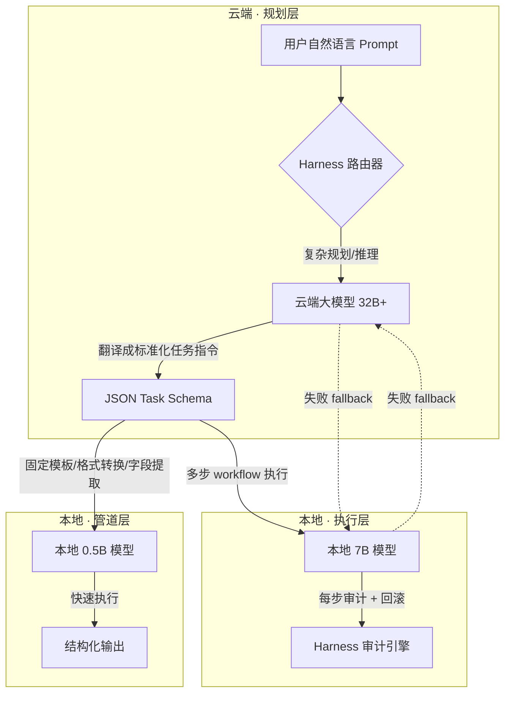

# 路线图 · Roadmap

> 已经做了什么、未来要去哪、哪些地方需要你的帮助。
> v1.2.0 · 2026-07-26（UTC）· 物理结构大重构（/sofagent/→/engine/ + SKILL 收敛 + 发版工具链拆散 + install.sh 提根 + rules 独立包）· 规划：v1.2.x（编排隔离底座：并行 SubAgent git worktree 隔离）→ v1.3.1（并行编排 / 控制图波次并行）→ v1.4.0（完整沙箱执行 + 生产级编排）→ v1.5.0（meta-harness 多 harness 编排）

产品定位详见 [设计哲学](./docs/PHILOSOPHY.md) 和 [README](./README.md)。

## 现在在哪：v1.2.0（已发版 · 2026-07-26）

> **物理结构大重构已完成（v1.2.0）**：`/sofagent/` → `/engine/` 目录重命名 + Skill 收敛到 `/SKILL/`（harness/ + agents/ + custom/ 三层结构）+ install.sh 提升根目录 + engine/rules/ 独立规则引擎包。发版工具链已拆散——发版 SOP 迁 `docs/changelog/releasing.md`、版本号脚本迁 `tools/bump-version.sh`、审查规范迁 `FORGE/playbook/`，releaser Skill 已移除，质量循环改为基于 `FORGE/SKILL/<loop>/` 定义 + LangGraph createReactAgent 驱动。v1.2.x 方向：编排隔离底座（并行 SubAgent git worktree 隔离）+ Dashboard 原型 + Skill 分层升级策略实现。
>
> 📖 [v1.2.0 开发日志](./docs/changelog/v1.2/v1.2.0.md) · 完整版本历史见 [CHANGELOG](./CHANGELOG.md) 和 [迭代历程](#迭代历程)

> 🔴 **企业采购阻塞项 · Webhook 推送上提至 v1.2.1**：v1.1.6 已接通 webhook **PASS/WARN/FAIL 三态推送**（本地 agent 自测可用），但推送到企业协同平台（飞书/钉钉/企微）的**完整 Webhook 能力原规划在 v1.2.2，现上提至 v1.2.1**（见 SECURITY.md「审计结果推送」）。对需通过企业安全采购评审的客户，Webhook 推送是**采购阻塞项**——v1.1.6 本地三态已通，v1.2.1 补企业平台完整推送，避免卡住企业订单。

---

## 迭代历程

完整版本历史见 [CHANGELOG](./CHANGELOG.md)。v0.x 为实验/测试版，v1.0.0 起为正式版。

| 版本 | 核心交付 |
|------|------|
| **v1.2.0** | 物理结构大重构（/sofagent/→/engine/ + SKILL 收敛 + 发版工具链拆散 + install.sh 提根 + rules 独立包） |
| **v1.1.9** | 产品叙事收敛（FDE Agent）+ USB 完整运行时 + daemon A/B 自动调度器 + 控制图状态抽取 + v1.1.8 BugFix 42 项 |
| **v1.1.8** | 安全层加密配对 + 联邦查询 + Prompt 注入防护补齐 + 编排引擎串行版（DAG 并行规划在 v1.3.1） |
| **v1.1.7** | Dream Cycle 6 阶段 + sensitivity + 知识健康巡检 + 知识可观测性：gbrain 精简 pipeline 替换旧脚本 + knowledge 敏感度分级（缺省 internal）+ knowledge-health 5 项检查（@weekly）+ `knowledge status` 聚合命令 |
| **v1.1.6** | BugFix 21 项 + LLM Wiki 3 层分层 + conflict-check：v1.1.5 遗留全数修复 + Ledger-Views-Policy 显式化（详见 [`docs/llm-wiki-mapping.md`](docs/llm-wiki-mapping.md)）+ daemon 知识健康巡检（矛盾/孤儿/死链） |

## 未来去哪

> 以下是**方向**，不是承诺。没实测过的事标「不知道」。

**终局**：企业不再需要 FDE。AI 节点部署后自主运行，审计引擎持续盯变更，编排引擎自动纠偏，知识库自我积累——人只需要偶尔看一眼 dashboard 确认一切正常。我们做的不是给企业装 AI，是让企业忘了我们的存在。

> DeepMind 创始人 Demis Hassabis 在 2026 年 Guardian 采访中坦言："**现在发生的一切，并不是我当初希望 AI 发展的方式。**"这位一手推动了 AlphaFold 和 AlphaGo 的人，在 AI 走向商业化失控的转折点上，公开表达了不安。sofagent 的终局不是"更多的 AI"，而是"AI 可以被管住"——如果连创造 AI 的人都觉得方向失控了，那 Harness 中间件就不是选配，是刚需。

**为什么是现在——转折点的三信号**：单一信号不够，三信号同时成熟才构成真正的范式转折点：

| 信号 | 维度 | 内容 |
|------|------|------|
| 供给侧 | AI Coding 成本趋零 | FDE 借 AI Coding 1 天出 Demo，瓶颈从技术能力转向**业务抽象能力**（能否把 SOP 拆成 Agent 工作流） |
| 治理侧 | Agent IAM 组织身份 | Agent 有工号/权限/审计/全生命周期管理，从「工具」变「员工」，才能进生产环境 |
| 能力侧 | 协同飞轮持续进化 | 每次人工纠正/确认/追问回流为结构化学习信号，越用越懂企业 |

**现实验证（数字原生工作方式）**：工作流主语从「人」迁移到「Agent」——将 SOP 拆为 Agent 工作流、给 Agent 派工号、把人工纠正回流为学习信号——正是三信号同时成熟的落地案例，让抽象框架变现实（2026-07 行业观察）。

sofagent 的定位正卡在这个转折点上：审计引擎（治理侧）+ Ontology（能力侧）+ 开源 MIT（供给侧）——三信号缺一不可，单独做任何一个都不够。

两条路径：**FDE 驻场部署**（传统中小企业，FDE 进场→四阶段十二步流程→交付→撤离）和 **开发者自部署**（开源社区，git clone→install.sh→审计→CI 集成）。

设备端形态：安装时自动带 OpenClaw，审计结果通过 MCP server 推到企业协同平台。**数据主权在设备**——所有记忆、日志、决策记录永不离开本地。

---

## 版本规划

> 以下带状态版本表为权威源；各版本详细子节见下方 `###`。

### 规划版本

> 🔴 **阻塞项占位纪律**：任何 🔴 采购 / 合规阻塞项必须在下表占据一个**明确的版本单元格**（标注具体版本号，如 v1.2.1），不得仅写在散文备注里。散文式「建议优先排期」会悄然过时——v1.2.0 时 Webhook 阻塞项就曾因只写在备注、未落版本格，导致建议过期却仍未排期。教训：**阻塞项 = 版本格，不是建议**。

| 版本 | 状态 | 核心交付 | 日志 |
|------|:--:|------|:--:|
| **v1.1.9** | ✅ 开发完成 | **产品叙事收敛 + BugFix + USB + A/B + 控制图**：① 叙事收敛——对外从"Harness 中间件 + FDE 工具包"转为"FDE Agent（由 sofagent 引擎驱动）"；Harness 叙事降级为开发者文档里的实现说明；模板市场 已物理迁出至 商业仓库/模板市场/。② v1.1.8 发布后 42 条 BugFix（6 P0 + 15 P1 + 21 P2）。③ USB 完整运行时（Node 便携版 + 启动脚本 + HMAC 签名 + knowledge/ AES-256 磁盘加密 + 零残留）。④ daemon A/B 自动调度器（探索-利用循环，ab-scheduler 四阶段状态机 + ab-history jsonl + cron `ab-schedule` 分支）。⑤ 控制图状态抽取（checkpoint → ControlGraphState，version:'v1' schema 供 v1.2.x Dashboard 消费）。测试 863→909（11 包全绿，QA 第 1 轮 906 + BUG-1 修复回归 2 + POC-6 碰撞消除 1）；版本 bump 留 releasing SOP | [📖](./docs/changelog/v1.1/v1.1.9.md) |
| **v1.2.0** | ✅ 已发版 | **物理结构大重构（/sofagent/→/engine/ + SKILL 收敛 + 发版工具链拆散 + install.sh 提根 + rules 独立包）🎉**：① **结构重构**——`/sofagent/` 内层目录 → `/engine/`（底座引擎改名）；Skill 从 4 处散落收敛到根目录 `/SKILL/`（fde/audit/engineer/reviewer/releaser + sofagent 约束底座）；`install.sh` 提升到根目录；模板市场 物理移出 MIT scope 到商业产品目录；engine/rules/ 独立规则引擎包。② 端到端全功能验证（FORGE + Dream Cycle + 联邦查询 + 加密）+ gbrain 行业对标 + USB key 产品故事写入主文档 + 兜底修复。v1.2.x 完整多设备协同的起点 | [📖](./docs/changelog/v1.2/v1.2.0.md) |
| **v1.2.x** | 📋 规划中 | 完整多设备协同——**L2 团队协作协议**：共享态/意图广播/触发反应/冲突消解/反馈放大五大机制，从单人约束到团队协作；**L3 组织能力市场**：Skill/Agent/流程在企业内发布→发现→调用→评价，高频高价值自然胜出。+ Agent 独立身份码 + 跨设备审计轨迹聚合 + 场景驱动权限体系 + 代理网关硬边界。**🔮 探索**：路由器式配网（边缘设备 WiFi 热点 + 手机端配置网页，仅用于初始配置，配置完成后回归纯 LUI）+ **协议中立**（审计层只走 MCP 等开放协议和 git diff/JSONL/Markdown 开放格式，不为任何单一平台写专属集成——不绑定平台，平台不绑定审计） + **编排隔离底座（git worktree 轻量形态）+ 波次拓扑可视化（控制图视角，随 dashboard 交付，详见子里程碑）** | — |

#### v1.2.x 里程碑拆分

> 6 版本定稿 + 3 弹性位（v1.2.7/v1.2.8/v1.2.9 空位，紧急修复或探索项按需取用）。

| 版本 | 主题 | 核心交付 |
|------|------|------|
| **v1.2.1** | **数据目录重构 + 收口验证 + 🔴 Webhook + SubAgent 可见性 L2** | **数据目录重构**：`.sofagent/` 669 个运行时数据文件统一迁移到 `data/` 可见目录——用户能直接打开、Dashboard 直接消费、备份只需拷贝一个目录（v1.2.2 Dashboard 前置基础设施）· 🔴 **Webhook 推送完整能力（飞书/钉钉/企微）— 采购阻塞项，从 v1.2.2 上提** · **SubAgent 可见性 L2**（ProgressMiddleware：worker 内部工具调用序列 + LLM 心跳 → sub-progress jsonl，Dashboard 实时面板数据前置）· custom/ 加载链 + 安装保护闭环 · 数据层清理（IDENTITY.md + eval.md 删除 + 模板标注 + daemon-health.json）（详见 [开发日志](./docs/changelog/v1.2/v1.2.1.md)）|
| **v1.2.2** | **数据主权 + 路由 + Dashboard（数据主权 + SubAgent 实时面板）** | ① 数据主权审计追踪（4 维审计日志 + 年/月目录 + 每日/周/月报告 + 四路分发闭环）② 混合模型路由层（ModelRouter 敏感度×任务类型路由 + Ollama 接入）③ FDE Dashboard 第一版（数据主权视图 + **SubAgent 实时面板 L3**：消费 v1.2.1 L2 数据，双 agent 状态卡 + 工具调用流 + 成本曲线 + 心跳检测）④ Skill 分层升级三策略 install.sh 实现（详见 [开发日志](./docs/changelog/v1.2/v1.2.2.md)）|
| **v1.2.3** | **Dashboard 产品化 + 编排隔离** | ① Dashboard 波次拓扑可视化（控制图渲染 + 节点/边/波次分层实时状态）② 编排隔离底座（git worktree 四子里程碑：隔离原语→审计合并卡关→冲突消解→filesValue 边界）③ Dashboard 用户可读性（面向非开发者的语言化呈现）（详见 [开发日志](./docs/changelog/v1.2/v1.2.3.md)）|
| **v1.2.4** | **知识进化** | ① 分层巡检 L1/L2/L3（@daily/@weekly/@monthly 三级 + 读写回路对标）② skillopt 自动触发（失败模式 3 次自动优化）③ 失败清单驱动优化（负面样本为主要燃料）④ conflict-check CLI + 联邦蒸馏 ⑤ Skill 升级策略（若 v1.2.2 未完成）（详见 [开发日志](./docs/changelog/v1.2/v1.2.4.md)）|
| **v1.2.5** | **多设备协同 L2/L3** | ① L2 团队协作协议（共享态/意图广播/触发反应/冲突消解/反馈放大五大机制）② Agent 独立身份码 + KYA 轻量版 ③ L3 组织能力市场（Skill/Agent/流程发布→发现→调用→评价）④ 跨设备审计轨迹聚合 ⑤ 场景驱动权限体系 + 代理网关硬边界 ⑥ ATTRIBUTION 归因引擎（审计决策→业务价值因果链）⑦ 协议中立审计（只走 MCP + 开放格式）（详见 [开发日志](./docs/changelog/v1.2/v1.2.5.md)）|
| **v1.2.6** | **🔒 弹性预留 + 产品化快速补强** | 紧急修复 / 探索项按需取用。**储备项（不阻塞主线，有空间就做）**：① `sofagent-audit --support-bundle`（一键生成 issue 摘要 + 证据 zip，参考 DeerFlow `make support-bundle`）② `--doctor` 输出增强（可操作修复提示，不只报红绿，参考 DeerFlow `make doctor`）③ README Deployment Sizing 表格（企业 IT 必问资源规格）④ One-Line Agent Setup（给 Claude Code/Codex 一句话自动安装）。如果 v1.2.1-v1.2.5 中间有紧急修复，占用此版本号（详见 [开发日志](./docs/changelog/v1.2/v1.2.6.md)）|
| **v1.2.7** | **编排引擎增强（DeerFlow 启发）** | ① **Session Goals**（`/goal` 给线程附完成条件 + 非思考模型评估 + N 次续接上限）— 改进 FORGE fresh-eyes-loop 停止条件（当前仅"连续2轮无发现"）② **手动上下文压缩**（`/compact` 用户侧减压阀，聊天可见但后续调用用摘要）— 直击 LangChain 消息只增不减痛点 ③ **Skill 渐进式加载**（仅任务需要时加载，非全量注入 SKILL.md）— 直击加载链步进脆弱性 ④ **`make doctor` / `--doctor` 可操作修复提示**（从 v1.2.6 储备提升，若 v1.2.6 已做则此条作废）（详见 [开发日志](./docs/changelog/v1.2/v1.2.7.md)）|
| **v1.2.8** | **记忆分层 + 定时任务（DeerFlow 启发）** | ① **记忆事实级分层**（per-user memory.json + per-fact Markdown + `__default__` 桶）— Dream Cycle 缺事实级粒度 ② **Scheduled Tasks MVP**（cron+once / 暂停/恢复/触发/历史/删除）— daemon cron.ts 从占位升级为一级定时任务（LIMITATIONS §七「定时触发做不到」的解法）③ **Workspace 变更摘要**（每次运行后记录创建/修改/删除文件清单，非完整 diff）— Dashboard 数据前置 ④ **ToolOutputBudget 中间件化**（把 sf_read 500 行截断从单点提升为分层中间件，参考 DeerFlow ToolOutputBudget）（详见 [开发日志](./docs/changelog/v1.2/v1.2.8.md)）|
| **v1.2.9** | **🔒 弹性预留** | 紧急修复 / 探索项按需取用 |
| **v1.3.0** | 📋 规划中 | **运行时审计最小闭环（LangGraph middleware 启发）**：把 engine/rules 的 3 条 tool-gate 规则从「编排层静态 gate」升级为「运行时动态拦截 + 审计日志」——在 createReactAgent 外面包一层 wrapToolCall middleware，拦截每个工具调用、记录审计日志、危险操作前要求人工批准。复用 FORGE fresh-eyes-loop 已跑的 createReactAgent，只加 middleware 层，可行性高 | [📖](./docs/changelog/v1.3/v1.3.0.md) |
| **v1.3.1** | 📋 规划中 | **Ontology 认知底座 + 国标对齐 + 并行编排**：① 本体即认知底座——将 Ontology 统一层从「描述事实如何被理解」升级为「可运行推理底座」（对齐 LLM + Harness 规则 A1-A11、A14-A19 + E1-E4（共 21 条）+ 记忆 Ledger-Views-Policy）；② 三层落地法（统一元模型 → 企业通用 Ontology 规范：命名/版本/验证 → 与 Agent 平台打通）；③ 国标对齐 GB/T 48000.3-2026《标准数字化 第3部分:本体建模要求》作为审计/Ontology 层合规参考基线；④ **编排引擎并行调度（Graph Engineering 视角：控制图多循环 DAG 波次并行）**：基于 v1.1.8 的编排引擎调度原型（已从 DeepAgents 迁移至 LangGraph createReactAgent），新增 DAG 依赖解析（Kahn 波次拓扑）+ 并行扇出/扇入（LangGraph `Send` API）+ 循环依赖检测 + 失败传播策略 + 超时熔断；每波次经 audit 节点（★Reality Anchor，真实 git diff 作 guard edge）卡关，并行 SubAgent 文件隔离由 v1.2.x 的 git worktree 隔离底座提供 | [📖](./docs/changelog/v1.3/v1.3.1.md) |
| **v1.4.0** | 📋 规划中 | **SubAgent 完整沙箱执行环境 + 生产级编排**：将 orchestrator 内置为完整的沙箱运行时——虚拟文件系统隔离（FilesystemBackend + virtualMode）、网络出站白名单、**工具调用中介（前置 allow/deny，非仅审计追踪）**、**虚拟 key 凭证边界注入（真实凭证 host 边界注入，SubAgent 只拿临时虚拟 key）**、AsyncSubAgent（远程 Agent Protocol 服务端）+ 真·实时 A/B 双跑（候选方案并行执行实时对比，替代当前日志统计法）。**并行 SubAgent 文件隔离**：git worktree 轻量形态已于 v1.2.x 落地，v1.4.0 升级为完整沙箱隔离 + 多 SubAgent 文件竞争检测。审计引擎从「事后」扩展到「运行时」（**范围限定 SubAgent，主 Agent 仍事后审计**） | — |

#### v1.3.x 里程碑拆分

> 运行时审计最小闭环（v1.3.0）是 v1.3.x 第一刀：不替换 harness，只在 createReactAgent 上加 middleware 层。完整运行时审计（策略强制 + 沙箱 + 状态化拦截）仍留 v1.4.0；meta-harness 多 harness 编排已前移到 v1.5.0（承接 v1.4.0 沙箱底座）。

| 版本 | 主题 | 核心交付 |
|------|------|------|
| **v1.3.0** | **运行时审计最小闭环（LangGraph middleware）** | ① wrapToolCall middleware 包 createReactAgent ② engine/rules 3 条 tool-gate 规则升级为运行时拦截 + 审计日志 ③ 危险操作前人工批准钩子 ④ 复用 FORGE 已跑 createReactAgent（详见 [开发日志](./docs/changelog/v1.3/v1.3.0.md)）|
| **v1.3.1** | **Ontology 认知底座 + 国标对齐 + 并行编排** | 见上方主表：本体认知底座 + GB/T 48000.3-2026 国标对齐 + 控制图多循环 DAG 波次并行 |
| **v1.3.2-v1.3.9** | 🔒 弹性预留 | 紧急修复 / 探索项按需取用（智能 E2E 测试 Agent、规则文件独立只读焊死门、Agent 执行层实时治理等 v1.3+ 探索项可在此落位）|

### v1.2.x Graph Engine 进化路线

> 理论基础：Carlos E. Perez·[From Loop Engineering to Graph Engineering?](https://engineering.zooz.com/intuitionmachine/from-loop-engineering-to-graph-engineering-d3ebeb08511c)（单闭环四类失效→Graph 拓扑解法+grounding）、Addy Osmani·Loop Engineering（Context→Harness→Loop 三层框架）、工程实践（Workflow→Graph Engine 五组件五原则）。五层工程化模型（Prompt→Context→Harness→Loop→Graph）为行业共识框架。详见 [ARCHITECTURE §Graph Engineering 视角](./docs/ARCHITECTURE.md#graph-engineering-视角控制图--stategraph) 和 [THANKS](./docs/THANKS.md)。

| 版本 | Graph Engine 交付 | 对标缺口 |
|------|---------|------|
| **v1.2.2** | **Planner 节点**（任务分解）+ **降级路由链**（retry→降级→标记→人工）+ **engineer-decide/execute 分层**（LLM 层 + 代码层）+ Dashboard Graph Engine 状态卡片 | ③Planner / ④降级 / ⑤LLM vs 代码 |
| **v1.2.3** | **并行子图执行**（worktree 隔离 + 多 engineer 并发）+ **Dashboard React Flow 控制图**（Org Graph / Work Graph 同屏 + 边类型标注） | ①并行 / Dashboard 图视图 |
| **v1.2.4** | **多类型 Checker**（format/fact/source-validator 作为图节点）+ **受控循环升级**（补信息→重规划 + 降级通过 + 循环守卫）+ skillopt 对接失败清单 | ②Checker 扩展 / ⑥受控循环 |
| **v1.2.5** | **五类边契约形式化**（数据流/控制流/权限流/证据流/失败流）+ **Anchor 配置**（冻结验收标准防自洽）+ Graph Engine 归因 | ⑧边契约 / ⑨Anchor |
| **v1.3.1** | 控制图多循环 DAG 波次并行（Kahn 拓扑 + `Send` API + ★Reality Anchor git diff guard edge） | ①并行（完整 DAG） |

### v1.2.0 — 记忆/知识层升级（认知底座铺垫）

> 💡 **v1.2.0 是 v1.2.x 主题线的第一刀**：把 gbrain / LLM Wiki / Palantir 操作型本体论的外部验证吸收为「方法」（分阶段记忆整合、分层巡检、读写回路对标），不吸收其「定位」（不变成 agent runtime，不走集中式 Ontology OS）。详细 scope / 交付拆分（P0/P1/P2）/ 边界见 [v1.2.0 开发日志](./docs/changelog/v1.2/v1.2.0.md)。

🛡️ **差异化铁律（对标时必守）**：gbrain 是「agent 自己的脑」，Palantir Ontology 是「企业级操作层」，sofagent 是「约束中间件」（数据主权 + 第三方独立 + MIT 可审计）。吸收方法，不吸收定位；不建自动化 diff 任务，发版前由架构评审顺带 diff 一次 gbrain 的 dream-cycle / skillopt / Palantir 的 OAG 进展，结论进当版 changelog「行业对标」小节。

### v1.2.x — 完整多设备协同（规划中）

> 💡 **多 Agent 协同已在 v1.x 完成**：v1.0.3 FDE SubAgent + Audit SubAgent 并存 → v1.0.4 A/B 自动优化双 Agent 对比。**轻量多设备在 v1.1.0 起步**（经验共享 + 权限作用域化 + daemon 主动巡检）。v1.2.x 做完整版——两件事：**完整多设备协同**（每个 AI 节点独立身份、跨设备审计轨迹可追溯、场景驱动权限体系、代理网关硬边界）和 **Work模板市场 前端**（Web catalog + 社区贡献仪表盘 + 模板 marketplace）。

**ATTRIBUTION 归因引擎（v1.2.x 探索）**：审计能告诉你 Agent 违规了，但不能告诉你哪次正确的审计干预带来了业务价值。ATTRIBUTION 需要在多设备、多客户、长时间尺度上追踪审计决策→业务指标的因果链。

**失败清单驱动 skillopt（v1.2.x 探索）**：积累负面样本——每个 Skill 跑失败时记录失败场景 + 原因 + 正确做法，以负面样本为主要燃料驱动优化。"告诉模型什么做法是错的"比"什么是对的"信息量更大。

**KYA 身份确权（v1.2.x 探索）**：a16z 研判非人类身份:人类 = 96:1，急需 KYA（Know Your Agent）——加密签名凭证将 Agent 与委托人/约束/法律责任深度绑定。sofagent 审计引擎（约束 + 审计 + 归属）本质是轻量版 KYA。

**智能 E2E 测试 Agent（v1.3+ 探索）**：笔记① Lantern+Playwright 实测表明，AI 大脑 + Web 自动化执行器 + 本地模型可做到「给高层级目标、零定位代码自主测试」（页面变更免疫、需求泛用、数据不出网）。可演进 sofagent 的 QA / `acceptance-test`——用 Agent 替代 bash 断言脚本做端到端验证，作为 v1.3+ 的质量保障方向。

四阶段渐进：协同编排协议（Markdown 优先）→ Agent 发现与注册 → 跨设备任务分发 → 企业 Agent 知识库（多设备蒸馏记忆聚合到企业自有 NAS/云盘，底层用 [Graphify](https://github.com/safishamsi/graphify) 轻量知识图谱）

> 🧠 A2A 协议参考：Google A2A 为多 Agent 协作定义三层——动态服务发现 / 能力契约对齐 / 全状态接力。MCP 解决「脑和手」，A2A 解决「脑和脑」。工程参考：Multica 的 Polymorphic Actor + Session Resumption + Claim-then-Execute 模式为 v1.2.x 的 Agent 独立身份码提供可落地方向。

**双层循环（Loop Engineering）**：

| 循环层 | 时间尺度 | 职责 | 状态 |
|--------|:--:|------|:--:|
| 内层 | 秒-分钟 | Agent 执行 + 审计 + 反思 + 自动纠偏 | ✅ v1.0+ |
| 外层 | 天-周 | Skill 优化 + 知识库沉淀 | v1.2.x 规划 |

**Dream Sandbox 沙盒审计（v2.x 探索）**：Agent 操作先在平行空间模拟运行，人类审批后点「合并」才生效——将约束从事后升级为事前。来源：Palantir AIP，详见 [THANKS](./docs/THANKS.md)。

**v1.2.x 子里程碑 · 编排隔离底座 + 波次拓扑可视化（Graph Engineering 印证）**

> 从 v1.4.0 重沙箱捆绑中拆出**纯 git 原生形态**的并行文件隔离，并补齐用户视角的控制图可视化——这是 v1.3.1「控制图波次并行」的**隔离前提 + 可观测前提**。重沙箱（虚拟文件系统 + 虚拟 key 凭证边界 + AsyncSubAgent + 实时 A/B 双跑）仍留 v1.4.0。

**② 并行 SubAgent git worktree 隔离（拆 4 子里程碑）**：
- **②·1 worktree 隔离原语**：orchestrator 调度并行 SubAgent 时，每个 SubAgent `git worktree add` 独立工作树 + 独立分支；无 FilesystemBackend / 虚拟文件系统 / AsyncSubAgent 等新运行时依赖
- **②·2 审计合并卡关**：各 worktree 工作完成后，sofagent audit 对每棵树跑 `git diff` 硬证据卡关（★Reality Anchor），通过后再合并回主工作树
- **②·3 冲突消解策略**：并行 SubAgent 写到同一逻辑文件时的冲突仲裁规则（按节点职责域划分优先 / 人工确认兜底），写入 harness 约束
- **②·4 与 v1.1.8 `filesValue` 同步合并的边界**：明确"同步并行用 filesValue 自动合并" vs "跨波次并行用 worktree 隔离"的适用边界，二者不互相替代

**③ 用户视角波次拓扑可视化（拆 2 子里程碑，数据层 ③·1 已提前至 v1.1.9）**：
- **③·1 Dashboard 波次拓扑视图**：前端渲染控制图（节点 + 边 + 波次分层），实时显示每波次 SubAgent 状态 + audit 卡关结果，替代纯技术状态文件
- **③·2 用户可读性**：面向"人看一眼就懂现在卡在哪"的语言化呈现（非开发者视角），随 v1.2.x dashboard 产品化节奏交付

**演化路径**：

| 阶段 | 形态 | 对应版本 |
|------|------|:--:|
| Ralph 循环（真菌） | 状态外化到文件，Agent 本体无状态 | v0.x-v1.0.x |
| Ralph 工厂（轻量多设备） | 自治循环进化——经验共享 + 审计可见 + 权限作用域化 | v1.1.x |
| 有身份 Agent（多设备完整） | 每个 AI 节点有独立身份，跨设备审计聚合，场景驱动权限 | v1.2.x 规划 |
| 无身份 Agent（细菌） | 用完即焚，全新生成，零状态 | v3.x 远景 |

**交付组织探索（v1.2.x 储备）**
规模化交付 FDE 时，孔老师设想一种「阿米巴三人组」的最小交付单元——一个可独立核算、快速组合的小队结构，对应 FDE 在企业侧落地的部署 / 合规 / 工程 / 审查等角色。配套的技能分级采用 S / A / B / C 四档：S 级为经生产验证、可独立上线的成熟技能；A 级为已对齐标准、需轻量监督；B 级为可用但需人工兜底；C 级为实验性、仅内部验证。该分级旨在让交付质量可度量、可定价，是 v1.2.x 商业化规模化的方法储备，非当前版本范围。

### v1.3.1 — Ontology 认知底座（操作型本体论落地）

> 💡 来自 Palantir 操作型本体论系列研报（2026-07）的启发。Palantir 4000 亿美元市值的核心护城河不是"本体论"概念包装，而是 **Action Types 作为类型系统一等公民**——操作语义与数据定义同层建模，LLM 所有调用必须经过本体层定义的 Action 执行，无法绕过直接写库。

sofagent v1.3.1 的 Ontology 认知底座方向与之高度同构，但走**分布式路线**——不建中央本体操作系统，让每个 Agent 自建本体（Ledger-Views-Policy），联邦查询跨设备共享，git diff + audit history 做硬证据链：

| Palantir 做法 | sofagent 做法 | 差异化 |
|------|------|------|
| Action Types 内嵌本体，LLM 调用必经 | A15 约束验证（事后）+ fde.md Policy（事前声明） | 事后审计 + 逐步前移 |
| OAG 五层确定性架构 | Harness 约束底座 + MCP + FORGE 双 Agent | 同构轻量，无需五层就位即可工作 |
| 集中式 Ontology OS，重度物化索引 | 分布式 knowledge/，联邦查询按需获取 | MIT 开源、零锁定、数据主权本地 |
| Markings + CBAC 本体级安全 | sensitivity frontmatter + 跨设备联邦过滤 | 渐进式演进 |

---

## 产品化与商业化方向

> 控制平面打法——卖「能力」不卖「工时」，必须有自己的 MCP + dashboard。

sofagent 的结构性壁垒不在「更聪明的 Agent」（那是大厂在商品化的东西），而在「管住 Agent 的那一层」。产品化方向锁定四条：

1. **卖能力不卖工时**：FDE 从「一种岗位 / 服务」重构成「企业该有的能力」，用 Agent / SubAgent / 产品化封装交给企业，企业自己用、自己落地 AI 化。
2. **MCP + dashboard 必须有**：dashboard 是自有视图（持久可见 + 真相源），MCP 是向外接的桥。Agent 的 LUI + LLM 吞噬一切 → 所以要有 dashboard；dashboard 轻量 → 所以靠 MCP 配合。两者配合才能把「项目」变成「产品」。
3. **open-core 双轨**：内核 MIT 开源（信任 + 分发 + 生态），只卖 dashboard 那层（控制台 / 合规月报 / 告警）。
4. **能力长在代码里，不长在 prompt 里——对抗「模型吞噬一切」**：skill / prompt engineering / context engineering / 以 skill 形式做的 harness engineering，本质都是**文字形式的约束**。每次注入到模型 = 每次投喂 = 每次训练——模型会训练得越来越强，**必然吞噬文字形式的约束**（今天的 Skill 是差异化优势，明天就是模型的内置能力）。sofagent 对策：把 Skill + Harness 能力**封装进 Subagent**（代码级实现，非文字注入）+ **防投喂机制**（防止输入素材变成大模型训练材料）。生存位：细分业务 workflow 上对业务最终结果的可约束性——这个不会被模型吞噬。

**市场信号**（非技术变更，纯定位 / 竞品补充）：
- **FDE-as-a-Service / Services-as-Software 被资本验证**（详见「探索方向 · 市场信号验证」）：Anthropic 收购 Fractional AI、Accenture×Anthropic 3 万人 FDE 受训、Blackstone+H&F+Goldman 共建企业 AI 服务公司、Anthropic 接入 Palantir FedStart。
- **受监管行业规模化交付（2026 concrete 证据，强化上条）**：全球 Top-3 SI 将 FDE 能力标准化、规模化交付至强监管场景——TCS×Anthropic 在 56 国为 5 万员工与受监管行业部署 Claude；DXC×Anthropic 联盟（FDE 培训认证规模化）；Anthropic×Infosys 在电信等受监管行业共建 AI Agent。三者同源互证 sofagent「FDE 通用能力化 + Services-as-Software + 受监管行业护城河」定位，且印证「卖能力不卖工时」路线在强监管客户侧已被头部 SI 验证可行。
  > 📖 来源：温故知新 2026-07-23 / 2026-07-25（OpenFDE 信号库 P2 🎯：DXC / TCS / Infosys）
- **PE/VC 多企业审计仪表盘**（探索方向）：投后管理场景，所有被投企业 AI 审计数据汇总到一个面板。
- **WB 企业版竞品对标**（商业化储备）：席位全生命周期管理 + 成本三维核算 + 统一采购合规 + 审计追踪 + 安全沙箱。
- **🔴 Skill 廉价化危机（2026-07-25 阿里/钉钉会议验证）**：豆包已能自动生成 Skill、Hermes 能给自己生成 Skill → 以 Prompt 形式出现的所有产品形态都将被模型吞噬。Skill 只是入口（初级交付，数千元），企业专属小模型才是护城河（高阶交付，数十万元）。资本叙事四级：Skill(千元) → Workflow 自动化(万元) → 企业专属小模型(数十万元) → "训练小模型的模型"(技术壁垒)。v3.x 从"远景"提升为"战略必争"。
- **私有化部署需求加速（2026-07-25 会议验证）**：客户担心数据被用于训练（已有硬件客户代码出现在 AI 输出中）。U 盘交付模式的"龙虾 U 盘"心理价值——插入即用、拔出即停，制造"盾牌般的物理安全感"。核心卖的不是技术实现，是老板的掌控感。

**待落地**：首个 MVP = FDE Agent + 一个引擎 dashboard（进度 / 合规视图）；商业计划（GTM / 定价 / 买家画像 / 竞争象限）独立私有仓维护，不进本 MIT 库。

**分层落地中型蓝海**
商业化切入上，孔老师倾向「分层落地」而非一刀切：先在中型客户（有真实 workflow、愿为成果付费、但养不起自建 AI 团队）的蓝海市场建立标杆，用 FDE 的「交付企业专有 skill」模式把单点打透，再向大型客户的标准化模块、小型客户的自助模板双向延伸。核心判断是——卖能力不卖工时，控制平面（sofagent 引擎）是底层，业务 workflow 的可约束性才是护城河。

### 价值度量翻转：FDE vs 传统外包（2026-07 钉钉 CTO 一粟 blog 研读）

钉钉 CTO 一粟以「数字员工」重新定义 AI to B 的价值度量：传统外包按人·月计费，FDE 按成果·Token 计费，成本差可达三个数量级。

| 维度 | 传统外包团队 | 1 个 FDE Agent |
|------|------|------|
| 人力 | 5 人（待核验）| 1 FDE（编排 + 四引擎）|
| 周期 | 3 个月（待核验）| 3 天（待核验）|
| 成本 | 50 万（待核验）| 500 元 Token（待核验）|

> 印证 sofagent 商业化判断「卖能力不卖工时」：护城河是可约束的业务 workflow，不是人头。

> 📖 来源：钉钉 CTO 一粟 blog《价值度量翻转》（2026，具体 URL 待核验）

---

## 行业印证

### 🔮 Graph Engineering 印证（2026-07 新概念 · 迭代参考）

> 📐 来源：2026-07 行业新概念「Graph Engineering」——prompt→context→harness→loop→**graph** 的演进（嵌套非替换）；本质 = 设计 loop/process 之间的关系。理论根 = FSM/Statecharts（Harel 1987）。核心构件：**控制图**（node=state, edge=transition, guard edge 守门）+ **数据图**（知识图谱/血缘）+ **★Reality Anchor**（无 anchor = 披着 PM 外衣的幻觉）。实现模式含 DAG 波次拓扑（Kahn）、扇出/扇入、worktree 隔离、可审计状态文件、动态重规划。

sofagent 的编排引擎天然就是「控制图」——`engine/orchestrator/src/loop/graph.ts` 用 `@langchain/langgraph` StateGraph 实现 `START→engineer→audit→reviewer→human_confirm→END`，`audit` 节点即 Reality Anchor（真实 git diff A1-A11、A14-A19 + E1-E4（共 21 条）作 guard edge），`FileCheckpointer` 快照到 `.sofagent/checkpoint/` 即可审计状态文件。数据图天然对应 蓄水池（知识库）+ 市政规划（Ontology）。**所以 sofagent 已经在做 Graph Engineering，只是没用这个词**——后续迭代用其术语框定「并行编排」与「可视化」，不引入新能力。

**可学习的未来迭代（落盘到对应版本）**：① 多循环 DAG 波次并行、② 并行 SubAgent git worktree 隔离、③ 用户视角波次拓扑可视化——三项能力的现状与落地版本已并入上方「版本规划」表（v1.3.1 ④ / v1.2.x 子里程碑 ②·1~②·4、③·1~③·2 / v1.1.9 ③·1），详细拆分见 `### v1.2.x` 与 `### v1.3.1` 子节。此处仅作 Graph Engineering 概念框定，不新增能力范围。

> 🔴 **落地纪律**：① 和 ② 是「用 Graph Engineering 术语框定已有/规划能力」，不新增能力范围；③ 是纯可视化，依赖 dashboard 产品化节奏（v1.2.x 起）。

### 🔮 DeerFlow 参考清单（2026-07 · 行业印证 + 迭代参考）

> 📐 来源：[DeerFlow 2.0](https://github.com/bytedance/deer-flow) · 字节跳动 — 自称 "super agent **harness**"，与 sofagent Harness 中间件品类判断**字面一致**（详见 [PHILOSOPHY §十 · DeerFlow 印证](./docs/PHILOSOPHY.md#deerflow-20大厂用harness命名的活样本2026-07-行业印证)）。它做运行时（River 比喻的「河」），sofagent 做堤坝——定位互补。以下为设计启发清单，已按优先级 / 实现成本分配到版本：

**已落版本（技术设计）**

| # | DeerFlow 设计 | sofagent 痛点 | 落地版本 |
|---|---|---|---|
| 1 | `make support-bundle`（一键 issue 摘要 + 证据 zip）| 有 --doctor 但没"出问题怎么收集信息给维护者" | v1.2.6 储备 |
| 2 | `make doctor` 可操作修复提示（不只红绿，还告诉怎么修）| --doctor 输出质量待提升 | v1.2.6 → v1.2.7 |
| 3 | Session Goals（`/goal` + 非思考模型评估 + N 次续接上限）| FORGE fresh-eyes-loop 停止条件粗糙 | **v1.2.7** |
| 4 | 手动上下文压缩（`/compact` 用户侧减压阀）| LangChain 消息只增不减的第四层解法 | **v1.2.7** |
| 5 | Skill 渐进式加载（仅任务需要时加载）| SKILL.md 全量注入，加载链步进脆弱 | **v1.2.7** |
| 6 | 记忆事实级分层（per-user memory.json + per-fact Markdown）| knowledge/ 目录级，Dream Cycle 缺事实级粒度 | **v1.2.8** |
| 7 | Scheduled Tasks MVP（cron+once / 暂停/恢复/触发/历史）| daemon cron.ts 占位，LIMITATIONS 认「定时触发做不到」| **v1.2.8** |
| 8 | ToolOutputBudget 中间件化（sf_read 500 行截断升级为分层中间件）| FORGE b-fix 上下文溢出三层修复的单点版 | **v1.2.8** |
| 9 | 中间件链设计（InputSanitization→TokenBudget→SafetyFinishReason 26 步有序流水线）| Graph Engine Harness 层→Loop 层的工程化范式 | v1.2.2-v1.2.5（已在 Graph Engine 进化路线）|
| 10 | Skill 质量门禁 + content-hash 校验 | skillopt 仅"冷启动保护 + LLM 自评×0.3"，缺 hash 完整性 | v1.2.4 知识进化 |
| 11 | 多 worker 租约 + 原子 takeover + gap 事件 | v1.3.1 DAG 并行调度的多 worker 安全蓝图 | v1.3.1 |

**长期参考（v1.4.x / v2.x 探索方向，落盘到 ROADMAP 探索表）**

| # | DeerFlow 设计 | sofagent 对应 | 建议版本 |
|---|---|---|---|
| 12 | SkillScan 确定性安全扫描器（Phase 1 离线，无 Semgrep 依赖）| A9 注入检测局限的分层补充（纯正则覆盖不了 leet/编码绕过）| v1.4.x Checker 扩展 |
| 13 | Agentic Browser（Playwright 全套 + SSRF 防护）| FDE Agent 做"网页审计巡检"AI 节点时的现成方案 | v1.4.x 工具层 |
| 14 | TUI Terminal Workbench（嵌入式运行，键盘驱动 + slash 命令）| 补强"感知层"——用户不开 Agent 平台就能看审计历史/跑 doctor | v2.x 产品化 |
| 15 | Web UI / Dashboard（流式 Markdown / 对话分支 / 工作区徽章）| 自有 Dashboard（保持轻量单页，不照抄 DeerFlow 重部署）| v2.x 产品化 |
| 16 | 对话分支（完成回合可分支为新对话）| "Agent 走错路想从中间重来"——Dashboard 关键交互 | v2.x 前端 |

**产品化方向参考（不照抄重部署，保持零依赖调性）**

- DeerFlow 顶部嵌演示视频、One-Line Agent Setup、Deployment Sizing 表格——这些都是低成本高收益的产品化补强，已纳入 v1.2.6 储备项
- 产品进化叙事（"一开始是 X，社区跑出了新玩法，所以重写成 Y"）——sofagent 有完整 v0.x→v1.2 进化史，可写成故事进 README 或 PHILOSOPHY

> 🔴 **落地纪律**：DeerFlow 是 Python 运行时框架，代码级集成不可行。以上全部是**设计启发**（抄思路 + 拿背书），不是依赖引入。差异化铁律：DeerFlow 做运行时，sofagent 做审计——用 DeerFlow 的团队，仍然需要一个跨平台、本地留证、不改运行时的审计层。

### 🔮 Omnigent 参考清单（2026-07 · meta-harness 印证 + 迭代参考）

> 📐 来源：[Omnigent](https://github.com/omnigent-ai/omnigent) · Databricks 系团队（Apache-2.0，alpha，31 天 7091 star）— 开源 **meta-harness**（坐在 Claude Code / Codex / Pi 等 harness 之上的一层）。与 sofagent「Harness 中间件」品类判断同源（详见 [PHILOSOPHY §十 · Omnigent 印证](./docs/PHILOSOPHY.md#databricks-omnigentmeta-harness-把策略强制在基础设施层2026-07-行业印证)）。它做运行时（河），sofagent 做提交时（堤坝）——定位互补。以下为设计启发清单，分配到版本：

**已实现 → 印证 sofagent 判断（不抄代码，拿背书）**

| # | Omnigent 设计 | 印证 sofagent 什么 |
|---|---|---|
| 1 | 策略在 meta-harness **基础设施层**强制（非 prompt）| 印证「约束必须永远在线 + 防投喂」铁律——同一结论的工程化版本 |
| 2 | 装包后拦截 git push 需人批（状态化、动作前）| 与 commit gate（A1 不碰敏感）+ git hook **同源**，只是运行时版 |
| 3 | egress proxy 注入密钥，Agent 不见明文 | 与 A2 不泄密钥同源；未来「安全定制层」可采此模式 |
| 4 | OS 沙箱按平台（bwrap / seatbelt）| 对应「安全定制层 / SubAgent 沙箱」，标准开源可复用 |
| 5 | YAML agent 跨 harness 一行切换 | 印证「约束底座 harness 无关」设计 |

**未实现 / 路线图 → 有开源可借力（方便未来迭代）**

| # | 方向 | 可直接借力的开源 | 落点 |
|---|---|---|---|
| 6 | 成本追踪 / 预算 / 路由 / 护栏（控制平面）| **[LiteLLM](https://github.com/BerriAI/litellm)**（MIT，100+ LLM）| 控制平面 v1.4.x |
| 7 | OS 沙箱（省得自研）| **[bubblewrap](https://github.com/containers/bubblewrap)** + macOS Seatbelt（Omnigent 同款）| SubAgent 沙箱 v1.4.0 |
| 8 | agent 量化评估（LLM-as-Judge）| **[MLflow](https://github.com/mlflow/mlflow)** / promptfoo / ragas | FORGE 评估框架 v2.x |
| 9 | **运行时审计精确接入点** | **[LangChain middleware](https://docs.langchain.com/oss/javascript/langchain/middleware/custom)**（wrapToolCall / wrapModelCall）— 咱们已用 createReactAgent，包一层即运行时审计 | v1.3.x 最小闭环 |
| 10 | 现成运行时护栏库 | **[EnkryptAI Secure MCP Gateway](https://mintlify.wiki/enkryptai/secure-mcp-gateway)**（audit_only 模式）| v1.4.x 参考/集成 |
| 11 | meta-harness 开放接入标准 | **[ACP](https://github.com/Agent-Client-Protocol/spec)**（LSP 式，Omnigent 在用）| 观察（不押注单一厂商）|
| 12 | 轻量多 agent 编排验证 | **Conductor**（比 Omnigent 轻量）| 观察 |
| 13 | 云端 runtime 与算力分离 | **Cloudflare Agent Runtime / Vercel** | 观察 |

> 🔴 **落地纪律**：Omnigent 是 Python + 需 server + 沙箱（alpha）。以上全部是**设计启发 + 开源借力**（抄思路 + 拿背书 + 复用现成库），不是依赖引入。差异化铁律：Omnigent 做运行时，sofagent 做提交时——用 Omnigent 的团队，仍然需要一个跨平台、本地留证、不改运行时的审计层。

### 🔮 DataFlow 参考清单（2026-07 · 行业印证 + 迭代参考）

> 📐 来源：[DataFlow](https://github.com/OpenDCAI/DataFlow) · 北京大学 DCAI — 论文 arXiv:2607.16617（HuggingFace Paper of the day）用「Harness」命名其 Agent 约束层，与 DeerFlow / Omnigent 同月，是**第三个独立佐证**（含顶尖高校）。它做「数据流水线」Harness，sofagent 做「FDE Agent 工作流」Harness——对象不同，约束范式同源。以下为印证 + 迭代参考，已按优先级 / 实现成本分配到版本：

| # | DataFlow 设计 | 印证 sofagent 什么 |
|---|---|---|
| 1 | Agent 经受控接口（MCP）作业，禁自由写脚本 | scoped tool-gate + SKILL 约束底座——「关 Agent 边界」路线对 |
| 2 | Request-Validate-Commit 受控变异（State Retrieval→Mediated Mutation→Validation→Commit） | FORGE session 监控 + audit A1-A19——受控变异+校验+提交是通用范式 |
| 3 | DataFlow-Skills 程序化引导（过程蓝图 + 组合约束） | SKILL 约束底座——用结构化 SKILL 优于裸提示词 |
| 4 | Validation Engine（DAG 无环 + schema 兼容） | ontology 业务节点本体模型——结构化约束 LLM 输出是共识 |
| 5 | NL2Pipeline gap（工件须可检查 / 可编辑 / 可复用） | FDE Agent 核心价值——产出可审计工件，而非自由行动 |

> 🔴 **落地纪律**：DataFlow 治理「数据流水线」，sofagent 治理「FDE Agent 工作流 + 运行时审计（A1-A19 行为问责）」。它只校验 pipeline 结构与 schema，**不审计 Agent 行为问责、无常驻员工、无控制平面治理**——这些是我们的差异化地盘。以上全部是**设计启发 + 行业背书**，不是依赖引入。可借鉴的 8 项具体落版本见下方「探索方向」表（可视化 DAG 编辑 / ontology I/O schema 硬化 / 工作状态 per-node 遥测 / 分层模型多模型编排 / MCP 暴露 ontology-audit / 变异前读最新状态铁律 / ontology 组合约束图 / workflow 构建蓝图）。

### 🔮 OpenFDE/ChatDemo 参考清单（2026-07 · FDE 同源佐证 + 迭代参考）

> 📐 来源：[ChatDemo](https://github.com/OpenFDEAI/ChatDemo) · OpenFDEAI — 以 **Forward Deployed Engineer** 命名其售前"边聊边出 Demo"工作流（Claude Code Skill + localhost 控制台，回合制 start/turn/wrap）。与我们「前线部署工程师」**术语同源**（Palantir 脉络），但定位在售前采集入口，与 sofagent 常驻部署+治理方法论互补。以下为 FDE 同源佐证 + 优先借鉴项：

| # | ChatDemo 设计 | 印证/借鉴 sofagent 什么 | 关系 | 落地优先级 |
|---|---|---|---|---|
| 1 | 回合制协议：FDE 控节拍，agent 不在客户说话时抢话；每回合 ≤3min、超预算占位不阻塞 | 人控节拍、Agent 不自由跑——我们已有同判断，它落成了可操作流程 | 印证+领先（执行更细）| — |
| 2 | spec-first 硬禁令：DEMO_SPEC.md 单一事实源，transcript 永不直接驱动代码 | 对话/指令增量必须先进 workflow artifact 再驱动实现；补"触发直驱工件"的明文铁律 | 补缺 | **最高优先** |
| 3 | decisions.jsonl 判断时刻日志：{kind, moment, why, spec_ref} 现场即时记，会后喂 FDE Loop→INDUCE→Judgment Unit | A1-A19 记行为，缺"决策理由链"；吸收该 schema 补行为问责 | 补缺 | **最高优先** |
| 4 | 开源优先阶梯 + 预验证画廊（复用>组装>生成）+ License 标红 + 会前跑通 | 知识库/工件池升级为带合规标签、会前预验证、候选短名单隔离的"画廊"机制 | 印证+领先 | 参考 |
| 5 | 双引擎无状态架构（claude/codex 可切，状态在文件，共享回合 prompt）| 印证 Harness 应 runtime-agnostic；借鉴 adapters/prompt.ts 协议-引擎解耦 | 印证 | 参考 |
| 6 | 分级降级梯队：console→TUI、ASR→手敲、dev 挂→走 spec，workflow never stops | 为 7×24 常驻员工定义分级降级 SOP：模型不可用→规则兜底、工具断→占位、控制面断→本地自治 | 补缺 | **最高优先** |
| 7 | 数据敏感度分层：转写按敏感度选云/本地、音频不存、API mock-first | 把默认 mock、敏感数据本地推理、凭证 0600 不入库固化为控制平面数据治理基线 | 印证+补缺 | 参考 |
| 8 | 一键启动器 + 品牌化模板底座（theme.json 一文件换肤）| "安装 sofagent 底座" onboarding 借鉴自包含工作区骨架 + 一键拉起 + 单文件品牌化 | 补缺 | 参考 |

> 🔴 **落地纪律**：ChatDemo 是售前 POC 工具（单 FDE、单场会议），sofagent 是常驻部署+治理的编排操作系统——定位互补不竞争。它**无 A1-A19 运行时行为审计、无常驻硅基员工、无控制平面治理、让 Agent 直接写应用代码**（约束在"何时/权限/来源"而非"禁写脚本"）；这些是我们的差异化地盘。以上全部是**设计启发 + FDE 同源背书**，不是依赖引入。

### 🔮 OpenFDE 主仓 对标借鉴（2026-07 · FDE Loop / INDUC / Judgment Unit）

> 📐 来源：[Open-FDE/OpenFDE](https://github.com/Open-FDE/OpenFDE) 主仓（知识库 + 工具地图**内容仓**，非运行时；FDE Loop 运行时实现 Open-FDE/FDEAgent 已移走 / 404 不可读）。重点对标三大模块：FDE Loop（五阶段 `OBSERVE→ELICIT→INDUC→ACT→EVOLVE + DEPLOY/ATTRIBUTION`）、INDUC（知识沉淀阶段，产出 Judgment Unit）、Judgment Unit（专家判断资产化、可开关规则）。以下为从**主仓**补充的借鉴项（ChatDemo 子项目未覆盖的部分）：

| # | 主仓设计 | 印证/借鉴 sofagent 什么 | 关系 | 落地优先级 |
|---|---|---|---|---|
| 2 | **INDUC 阶段化知识归纳**：把"经验→判断"显式成 FDE Loop 的一个阶段，产出可开关的 Judgment Unit（专家判断资产化，规则可开可关、可版本化） | 我们的"蓄水池/知识库"目前是被动沉淀，缺"显式归纳阶段 + 可开关判断资产"；吸收 INDUC 把知识归纳提升为一等公民阶段，Judgment Unit 对应我们 A1-A19 判定层的可开关化 | 补缺 | 参考 |
| 3 | **产品化阈值 / 四类沉淀物硬护栏**：前 1-3 客户高度定制，第 4 起定制度递减，每单 Day90 前沉淀≥1 能力回产品；四类沉淀物 = ①连接器/集成 playbook ②模板/加速器/框架 ③Eval 框架 ④产品需求 | 为"组织复利纪律"立硬护栏：避免每次交付从零定制、强制沉淀复用；补我们知识库缺的"产品化阈值 + 四类资产形态"定义 | 补缺 | 参考 |

> 🔴 **落地纪律**：#4 分级降级梯队（console→TUI、ASR→手敲、dev 挂→走 spec，workflow never stops）已在上方「OpenFDE/ChatDemo 参考清单」第 6 行（**最高优先**）落盘，**本轮回不重复**。以上主仓项全部是**设计启发 + 行业背书**，不是依赖引入。FDE Loop 运行时实现不可读（FDEAgent 404），结论基于主仓 README 阶段定义 + ChatDemo 数据流（`decisions.jsonl`→INDUC→Judgment Unit）跨仓对齐，未编造。

### 🔴 运行时审计演进路线（meta-harness 三问作答 · 2026-07）

> 用户三问：① harness 层能否升级 meta-harness？② 何时能做运行时审计？③ 用 LangGraph create_react_agent 时是否就能做到运行时审计？

**问题①：能否升级 meta-harness？** 能，但分两阶段——
- 当前 harness 层 = SKILL.md 约束底座（注入层）+ 提交时 git diff 21 条规则。与 Omnigent 的本质差异：咱们管「提交时」，meta-harness 管「运行时」。
- 阶段一（运行时审计）：把「提交时审计」延伸为「运行时拦截 + 审计日志」——不替换 harness，而是在 createReactAgent 外面包一层 middleware。
- 阶段二（meta-harness）：多 harness 编排 + 跨会话协作 + 统一策略治理（参考 Omnigent 的 server/agent/session 三档策略）。这是 **v1.5.0** 的事——承接 v1.4.0 沙箱底座（单 SubAgent 沙箱 → 多 harness 统一编排更连贯），不必拖到 v2.x。

**问题②：何时能做运行时审计？**
- 最小运行时审计（工具调用前/后钩子 + 审计日志，复用 engine/rules 的 3 条 tool-gate 规则）：**v1.3.x** 即可（FORGE fresh-eyes-loop 已用 createReactAgent，加 wrapToolCall 钩子）。
- 完整运行时审计（策略强制 + 沙箱 + 状态化拦截，范围限定 SubAgent）：**v1.4.0**（已有规划：「审计引擎从事后扩展到运行时，工具调用中介前置 allow/deny，虚拟 key 边界注入」）。
- meta-harness（多 harness 编排）：**v1.5.0**（承接 v1.4.0 沙箱底座，单 SubAgent 沙箱 → 多 harness 统一编排）。

**问题③：用 create_react_agent 时能否做到运行时审计？** —— **能，但 create_react_agent 本身不做审计，它只提供接入点**：
- 老版 create_react_agent 有「pre_model_hook」/「post_model_hook」（只能拦 model 前后，粗粒度）。
- LangGraph 已用 createReactAgent（TS，@langchain/langgraph），支持「interruptBefore」/「interruptAfter」+ pre/post model hook，可做粗粒度运行时拦截。
- 升级到 LangChain 1.0 的「create_agent」可拿完整 **middleware 系统**：「wrapToolCall」（绕每次工具调用）是运行时审计的**精确接入点**——拦截每个工具调用、记录审计日志、危险操作前要求人工批准。
- **最小闭环方案**：在 createReactAgent 外面包一层 wrapToolCall middleware，把 engine/rules 的 3 条 tool-gate 规则从「编排层静态 gate」升级为「运行时动态拦截 + 审计日志」。可行性：高（FORGE 已跑 createReactAgent，只需加 middleware 层）。这正是 DeerFlow 中间件链 + Omnigent 策略层的同款思路。

### 🔮 a16z AI 管理七法则 印证（2026-07 · 迭代参考）

> 📐 来源：a16z（2026-07-15，Hebbia 创始人 George Sivulka）[《You Just Hired a Million Bad Employees》](https://www.a16z.news/)（原文 URL 待核实）——「人比软件便宜」，解法 = 管理。七法则逐条印证 sofagent 已做对什么、缺什么。

七法则完整映射表（a16z 概念 → sofagent 对应 → 现状 → 落地版本 → 说明）已整理到 [PHILOSOPHY · a16z 印证](./docs/PHILOSOPHY.md#a16z你刚雇了一百万个糟糕员工印证2026-07)。本节仅保留与 ROADMAP 规划直接相关的「落地纪律」结论：

> 🔴 **落地纪律**：①~⑧ 是「用 a16z 术语框定已有/规划能力」，不新增能力范围；⑨ 企业专属 eval 套件产品化 → v1.3.1+（tie 失败清单驱动优化 v1.2.x + RSI 验证体系 v2.x）；⑩ 转型服务规模化 / 多客户并行交付 → tie FDE 陪跑期机制 + PE/VC 多企业审计仪表盘 + FDE Demo Kit 工程化。两者均为真实缺口，挂接既有储备，不凭空造功能。

### 行业研报印证：动态 Agent 组织与 5 阶段风险收敛（2026-07）

- **动态 Agent 组织（Graph 自我改写）**：研报把「Prompt → Loop → Graph」的下一跳定义为「动态 Agent 组织」——图结构能自行改写自身（增删节点/重排依赖）。这是 sofagent 编排层（graph.ts + 进化引擎）的远期探索方向，但需与「约束底座永远在线」共存——动态只在编排层发生，约束/审计层不动。
- **5 阶段落地节奏对照**：研报给出「只读对象层 → 统一状态关系 → 挂载 Method → 开放低风险 Action → 高风险 Action」的渐进路径，核心是**不要一上来就 Agent 自动闭环**。与 sofagent「分阶段风险收敛 + human-in-the-loop 按风险分级」同构，可作为 v1.3.1 Ontology 认知底座落地的节奏参考。

> 📖 来源：温故知新 2026-07-21（行业研报《从提示工程到图系统》《Ontology Runtime 企业级架构落地》）

---

## 探索方向

| 方向 | 一句话 |
|------|------|
| workflow 外部模板扩充 | 引入 BPMN 2.0 / Coze / Dify 作为行业流程参考 |
| 企业 AI 节点知识库 | 多设备蒸馏记忆聚合到企业 NAS，知识库管理员 Agent 自动分类 |
| Agent 疲劳度检测 | 监控上下文窗口污染和决策质量衰减信号 |
| 双闸验证 | 工具执行前 gate + 执行后副作用复查 |
| SMB 场景审计扩展 | 审计从代码开发扩展到数据处理/报表生成 |
| 组织记忆主动调取 | Agent 接任务前先检索 think.md 共享版 |
| 异步长任务自治 | daemon 从文件监控升级为长任务自主运行 |
| PE/VC 多企业审计仪表盘 | 投后管理场景——所有被投企业的 AI 审计数据汇总到一个面板，投后团队统一监控 |
| FDE 陪跑期机制 | 部署后前 2 周 AI 节点 daily review，人类反馈和 AI 反思双向写入 think.md |
| 国标 Agent 审计对位 | 关注国家 AI 智能体互联标准草案进展（截至 2026-07 仍为征求意见稿阶段），标准正式发布后评估 sofagent 审计规则的合规对齐 |
| **自带净水设备的水龙头（v3.x-v4.x+ 远景）** | Subagent 内置 workflow 专属精调小模型，零投喂、本地推理、离线可用——防投喂的终极工程落地 |
| **Agent 身份码（v1.1.0）** | 国标草案中唯一明确「后续转强制」的方向。v1.1.0 预研——标准仍在制定中，落地取决于国标正式发布 |
| **RSI 验证体系（v2.x+ 远期储备）** | 递归漂移（Recursive Drift）是 RSI 核心障碍。验证体系 = 分治式子 Agent + 多路径冗余校验 + RL 同步训练裁判防"奖励黑客"。当前漂移率 10% 量级，目标降到 0.1% 以下——解题/验证分离思想已近期吸收（ARCHITECTURE §二），RL 裁判训练远期储备 |
| **FDE 双团队模型（储备）** | Echo（领域专家发现）+ Delta（工程师快速原型）双团队配对 + demo 驱动 + 产品团队作泛化引擎。作 FDE 模型补充参考 |
| **WB 企业版竞品对标（商业化储备）** | 席位全生命周期管理（离职自动释放）+ 成本三维核算（部门/项目/成员）+ 统一采购合规 + 审计追踪+安全沙箱 + 知识资产沉淀。商业化方向参考 |
| **市场信号验证（OpenFDE 信号库 · 2025-2026）** | 据 OpenFDE 信号库 P2 扫描（indices 0-11，均 Anthropic 系动态）记录的四起市场动作，佐证 FDE-as-a-Service / Services-as-Software 方向被资本验证，强化 sofagent FDE 通用能力化 + Services-as-Software 对外叙事说服力（非技术变更，纯定位/竞品补充）：① Anthropic 收购 Fractional AI（FDE 即服务 M&A 实证）；② Accenture×Anthropic 3 万人受训含 FDE（最大规模 FDE 标准化培训）；③ Blackstone+H&F+Goldman 共建企业 AI 服务公司（Services-as-Software 资本化）；④ Anthropic 接入 Palantir FedStart（AI 厂商借力合规底座） |
| **FDE Demo Kit 工程化（储备）** | 演示 FDE Agent 能力范式：7 行业 demo + demo 隔离 + IaC/CI-CD + 可追溯部署 + 权限演示。FDE demo 工程化参照标杆 |
| **Agent 执行层实时治理（Runta 参考 · v1.3.1+，仅 SubAgent）** | syscall/网络/凭证边界实时拦截，**范围限定 sofagent 自派 SubAgent 沙箱**（主 Agent 永远事后审计，不做实时拦截）；凭证虚拟 key 中介（host 边界注入）。详见 [ARCHITECTURE.md 行业框架对齐章节](./docs/ARCHITECTURE.md)（外部框架对标含 Runta） |
| **LangSmith 可观测性集成（开发者可选 · 不进产品核心）** | LangSmith 是 LangChain 生态的 Agent 可观测性平台。**定位：开发调试工具，不是产品组成部分**——就像用 Chrome DevTools 调试网页，但不把 DevTools 打包进产品。开发阶段设 `LANGSMITH_TRACING=true` + `LANGSMITH_API_KEY` 获得推理级 trace（免费 5,000 traces/月）。**不作为 sofagent 产品的依赖**——Dashboard 基于 sofagent 自带的 jsonl 状态文件（git diff + usage.jsonl + progress.jsonl），不依赖闭源商业服务。SDK 是 MIT 开源，平台服务闭源收费——企业想用自己集成，不在 MIT 仓内内置 |
| SkillHub → 单人闭环多岗（阿里 OPT） | 对标阿里 OPT（One Person Team）——单人 + agent skill + 企业系统 → 闭环完成多岗工作 |
| 规则文件独立只读（焊死的门 · v1.3.x） | 约束规则文件独立于 Agent 工作区，只读挂载，Agent 不可篡改——根治「AI 改测试掩盖错误」 |
| **SkillScan 确定性安全扫描器（v1.4.x · DeerFlow 启发）** | A9 注入检测局限的分层补充——纯正则覆盖不了 leet speak（`1gn0r3`）/ Unicode 同形字 / Base64 编码绕过。DeerFlow 用确定性扫描器（Phase 1 离线，无 Semgrep 依赖）做第一道，语义分析留后续。sofagent 可借鉴：先做确定性扫描层，LLM 辅助检测推 v1.4.x+ |
| **Agentic Browser 工具层（v1.4.x · DeerFlow 启发）** | FDE Agent 做"网页审计巡检"AI 节点时的现成方案——Playwright 全套（navigate/snapshot/click/type/screenshot）+ SSRF 防护默认开启。sofagent 可封装为 MCP tool，供 SubAgent 做网页内容审计 |
| **TUI Terminal Workbench（v2.x 产品化 · DeerFlow 启发）** | 补强感知层——用户不开 Agent 平台就能看审计历史/跑 doctor/看知识库状态。DeerFlow 的 TUI 是嵌入式运行（不需要 Gateway/Docker），键盘驱动 + slash 命令面板。sofagent TUI 应更轻（纯 Node，读 `.sofagent/` 目录），符合零依赖调性。性价比最高的产品化补强 |
| **轻量 Web UI / Dashboard（v2.x 产品化 · DeerFlow 启发但不照抄）** | DeerFlow Web UI 功能完整（流式 Markdown/对话分支/工作区徽章/设置面板），但部署重（Nginx+Gateway+Postgres 起步 8C16G）。sofagent Dashboard 保持轻量单页（Vite+React 读 `.sofagent/` 目录），不引入重部署依赖。对话分支（完成回合可分支为新对话）是关键交互 |
| **产品进化叙事（产品化 · DeerFlow 启发）** | DeerFlow 专门写"一开始是 Deep Research 框架，社区跑出了新玩法，所以重写成 Harness"。sofagent 有完整 v0.x→v1.2 进化史（10+ 版本），可写成同样的故事进 README 或 PHILOSOPHY——感染力远胜功能列表 |
| **Subagent 内置专精小模型（v3.x-v4.x+ 远景 · "自带净水设备的水龙头"）** | 四阶段：① v1.2.x 架构预留（Subagent 定义加 `inference` 字段支持调 Ollama）→ ② v3.x 工具链（`sofagent-model distill`，用 workflow 运行日志微调专属小模型）→ ③ v4.x 本地推理（业务 workflow 默认跑本地精调模型；代码/强推理等高价值智能任务直连云端最强 LLM，本地小模型只覆盖业务 workflow 场景）→ ④ v4.x+ 离线节点（USB key = 完整 AI 节点，不联网、不走大厂、零投喂——数据主权的终极形态）。详见 River 比喻概念体系（本地 Desktop 概念稿 `sofagent-river-比喻概念体系-2026-07-21.md`，未入仓）§3.2。为什么不是 v2.x 做工具链：微调是数据工程，需要足够多的真实 workflow 日志才有训练燃料；v2.x 还在铺多设备协同和 Dashboard，数据积累不够 · 🔴 术语纠正：这里不是「从 72B 大模型剪枝/蒸馏」——剪枝/蒸馏/量化是大厂造小基座的上游技术（Qwen2.5-0.5B 已是蒸馏+剪枝+量化后的开源产物，直接拿）。sofagent 做产业链下游最后一环：下载已开源小基座 → 用企业 workflow 数据 **QLoRA 微调**（4-bit 量化基座 + 低秩适配器；不动基座参数）→ 教它这一个 workflow。CLI 名 `distill` 是品牌叫法，实际动作是 QLoRA 精调 · 🔴 **后训练定位**：QLoRA 精调属「领域后训练（domain post-training）」的一环，是参数高效微调（PEFT）的一种；区别于基模厂商发布前的通用后训练（SFT + RLHF 等对齐），sofagent 做的是企业侧领域适配 · 🔴 **分层模型策略定稿（2026-07-25 孔老师拍板）**：不做"一个模型跑所有 workflow"，也不做"每个 workflow 一个专职小模型"——做 **Harness 分层路由**（三层模型 + 数据主权驱动）。核心洞察：云端大模型把自然语言 Prompt 翻译成标准化任务指令，摘出本地模型能做的部分交给本地执行，数据不出内网。0.5B 的甜区 = 约束完善后的管道执行（模板填充/格式转换/字段提取），不需要理解自然语言；7B 负责多步 workflow 执行（读写 Excel + 调工具）；32B/云端负责复杂规划推理。核心驱动力 = 数据主权：企业数据进 API key 大模型 = 一定被拿去训练，沙盒也拦不住（已有客户硬件代码出现在 AI 输出中的真实案例）。分层让敏感数据只在本地处理，通用知识才走云端 · 32B 量化后 ~32G 显存单台 RTX 5090 可推理；9B 微调一台 5090 够用；0.5B Mac Mini 可跑 · 🔴 **v3.x 优先级论证（2026-07-25 确认）**：阿里/钉钉会议验证 Skill 廉价化危机——豆包/Hermes 已能自动生成 Skill，以 Prompt 形式出现的产品形态将被模型吞噬。Skill 只是入口（初级交付，数千元），企业专属小模型才是护城河（高阶交付，数十万元）。v3.x 从"远景"应提升为"战略必争" · 工具链 TypeScript CLI（`sofagent-model`）封装 Python 训练引擎 + node-llama-cpp 推理，项目工程面保持 NodeJS

---

| **运行时审计接入点（v1.3.x · LangGraph middleware 启发）** | LangChain 1.0+「create_agent」/「create_react_agent」的 middleware 系统：**wrapToolCall**（绕每次工具调用）是运行时审计精确接入点；node-style hooks（beforeAgent/beforeModel/afterModel/afterAgent）做粗粒度拦截。咱们已用 createReactAgent，包一层 middleware 即可把 engine/rules 的 tool-gate 升级为运行时拦截 + 审计日志 |
| **EnkryptAI Secure MCP Gateway（v1.4.x · 现成护栏库）** | LangChain/LangGraph 的 pre_model_hook / post_model_hook 安全护栏，支持 **audit_only 模式（只记录不阻断）**。可作为 v1.4.x 运行时审计层的参考或集成，省得自研护栏 |
| **LiteLLM 控制平面（v1.4.x · 开源借力）** | BerriAI 开源 LLM gateway（MIT，100+ LLM，240M+ 拉取）：成本追踪 / 预算 / 路由 / 护栏。未来「控制平面」成本与路由层站在这上面，不必自研网关 |
| **bubblewrap / seatbelt 沙箱（v1.4.0 · 开源借力）** | Omnigent 同款 OS 级沙箱原语（Linux bwrap+seccomp / macOS seatbelt）。SubAgent 沙箱执行环境的「工具调用中介 + 虚拟 key 边界」可直接复用，省得自研沙箱底座 |
| **ACP 开放协议（观察 · 不押注）** | Agent Client Protocol（LSP 式，Omnigent 在用）— meta-harness 开放接入标准。标准化赢面大于厂商锁定，未来接入层可对齐 ACP 而非自造协议 |
| **Conductor 轻量多 agent 编排（观察）** | 比 Omnigent 轻量的多 agent 编排验证方案，先于完整 meta-harness 验证「多 agent 并行」价值 |
| **Cloudflare Agent Runtime / Vercel（观察）** | 云端 runtime 与算力分离的多 provider 格局，未来 SubAgent 云端执行可参考 |
| **MLflow agent 评估（v2.x · 开源借力）** | Databricks 开源（Apache-2.0），50+ agent 评估指标 + LLM-as-Judge。FORGE fresh-eyes-loop 缺量化「Agent 行为评审标准」，可进 v2.x 评估框架参考 |
| **可视化 DAG 编辑（v2.x 产品化 · DataFlow 启发）** | Dashboard v2.x 引入 workflow DAG 画布，双模态共享状态（会话 Agent + DAG 画布实时同步同一 pipeline 表示），把 workflow 编排从纯文本/Markdown 升级为可拖拽、可检查、可回滚的可视化图——补 sofagent 缺的「workflow 可视图」 |
| **ontology I/O schema 硬化（v2.x · DataFlow 启发）** | 将 ontology 从目录级升级为带 JSON Schema 校验的约束图，硬化每个 workflow 节点的输入/输出形状，变异前拦截不兼容——与 audit A1-A19 同源的事前约束 |
| **工作状态 per-node 遥测（v1.2.2/v2.x · DataFlow 启发）** | 借鉴 DataFlow 按算子统计（执行名/成功率/耗时）的遥测思路，SubAgent 状态卡具体化 per-node 遥测：成功率/平均耗时/任务名——让「工作状态」栏从"在不在跑"升级为"跑得好不好" |
| **分层模型多模型编排抽象（v3.x · DataFlow 启发）** | 借鉴 DataFlow 的多模型适配层（claude/codex/cursor），为 v3.x 分层模型（云端32B规划+本地7B执行+管道0.5B）引入多模型适配层，统一不同模型供应商接入 |
| **MCP 暴露 ontology / audit（v2.x+ 集成协议 · DataFlow 启发）** | 提供对外 MCP 集成协议，让外部 Agent 经受控接口读写 ontology 与审计记录（而非自由脚本），对齐 ACP 思路；Dashboard 后端经 MCP 喂数据，与 §六 控制平面打法同源 |
| **变异前必先读最新状态铁律（v1.x 铁律 + v2.x 实现 · DataFlow 启发）** | 借鉴 DataFlow「每轮合成前先拉取最新 pipeline 状态」的设计，正式立为铁律：任何 workflow 变异前必先读取最新状态（含人工改动），避免并发/陈旧状态导致的不一致——FORGE session 监控已有雏形 |
| **ontology 组合约束图（v2.x · DataFlow 启发）** | 借鉴 DataFlow 的组合约束（算子兼容图：模态匹配/字段流约定），ontology 从"节点目录"升级为"节点兼容约束图"，显式声明哪些节点可前后衔接 |
| **workflow 构建蓝图（v2.x · DataFlow 启发）** | 借鉴 DataFlow 的过程蓝图（推荐构建序列），将 SKILL 正式化为 workflow 构建蓝图——给定目标时推荐节点选择/参数配置/组装步骤序列，减少语义错误 |

## 分层模型架构（v3.x 技术骨架 2026-07-25 定稿）

> 核心驱动力：**数据主权**。企业数据进 API key 大模型 = 一定被拿去训练，沙盒也拦不住。分层让敏感数据只在本地处理。

### 三层模型 + Harness 路由

### 各层职责与选型

| 层 | 模型规模 | 职责 | 硬件门槛 | 数据安全级别 |
|----|---------|------|---------|------------|
| **规划层** | 32B+ / 云端 API | 复杂规划 · 长上下文推理 · 多轮对话 · **Prompt→标准化指令翻译** | 无（API 调用） | 通用知识/脱敏数据 |
| **执行层** | 7B-9B | 多步 workflow 执行 · 读写 Excel · 调用工具 | 单台 RTX 5090 | 企业业务数据（不出内网） |
| **管道层** | 0.5B-1B | 模板填充 · 格式转换 · 字段提取 · 规则化任务 | Mac Mini | 所有数据（含核心机密） |

### 0.5B 的甜区（2026-07-25 孔老师洞察）

0.5B 不需要理解自然语言指令。它的甜区是：**约束做够后的结构化执行**。

云端大模型负责把自然语言翻译成标准化任务指令（JSON schema），0.5B 只管执行这个指令。它不需要"听懂"人话，只需要"见过这种模式就能照着做"。需要理解自然语言、需要跟人多轮交互的部分，那是大模型的活。

**后训练对小基座的甜区约束**：0.5B 经领域后训练后，甜区仍只覆盖**管道层**（模板填充 / 格式转换 / 字段提取）——后训练强化「见过这种模式就照着做」，但抬不动基座的智力天花板。真实企业 workflow（多步执行、读写业务系统、调用工具）需 7B-9B 后训练（执行层）；复杂规划推理仍需 32B / 云端（规划层）。即「后训练 ≠ 小模型包打天下」：后训练放大的是窄域执行力，不是通用智能。选型原则与 §各层职责 一致（阿里 P9 验证：0.5B 撑不住企业 workflow，至少 6B-7B，最好 32B）。

### 数据分流 = 安全分级

| 数据类型 | 走哪层 | 为什么 |
|---------|--------|--------|
| 公开信息 / 通用知识 | 规划层（云端） | 不敏感 |
| 企业业务数据（报表/合同/绩效） | 执行层（本地 7B） | 核心资产，不能进 API |
| 企业核心机密（财务/股权/客户名单） | 管道层（本地 0.5B）+ 权限审计 | 最高级别 |

### 为什么不做"一个 32B 搞定一切"

| 维度 | 一个 32B 跑所有事 | Harness 分层路由 |
|------|------------------|-----------------|
| 成本 | 每企业上一台 5090（~2.5 万） | 大量低成本任务由 0.5B 吃掉（Mac Mini 可跑） |
| 延迟 | 32B 推理慢 | 0.5B 推理速度是 7B 的 10 倍以上 |
| 可审计性 | 黑盒跑完所有事，出问题难定位 | 每层都有审计 + 回滚 |
| 数据主权 | 数据必须过大模型 API | 敏感数据只在本地处理 |
| 渐进部署 | 一上来就得买 GPU | 先用云端 API + Harness，逐步落地本地 |

### 实现难度

路由层本身不难——任务路由（Prompt→标准化指令）、格式定义（JSON schema）、本地模型服务（Ollama）都是成熟技术。真正难的是 v3.x 的 LoRA 精调 pipeline（数据工程，需要足够多 workflow 日志）和 v4.x 的离线 USB 节点（完整 AI 节点封装）。

> 路由层可以提前到 v2.x 做，不依赖精调模型——一开始本地跑通用 7B/0.5B 就行，数据主权保护立刻生效。精调是后来的优化，不是路由的前提。

---

## 不需要的

以下认真考虑过但决定不做。完整设计禁区见 [PHILOSOPHY §八](./docs/PHILOSOPHY.md#八不做什么设计禁区)。

---

## 欢迎参与

| 你能做的事 | 时间 | 说明 |
|------|:--:|------|
| 跨平台测试 | 30 min | 你有 Codex / Hermes / Claude Code？装一下告诉我们 |
| 补充 FAQ | 20 min | 你踩了什么坑？直接改 HANDBOOK §三（排查问题） |
| 文档翻译 | 1-2 h | 英文翻译对社区意义巨大 |
| 第三方证据 | 1 周 | 装完用一周，填 EVIDENCE.md |
| 安全审计 | 不限 | 给 SECURITY.md 较真 |
| 企业场景反馈 | 30 min | 你们团队怎么用 Agent？直接开 Issue |

→ [CONTRIBUTING.md](./CONTRIBUTING.md)

---

## 长期叙事：Conway/Coase 双重反转

> **Conway 定律反转**：传统软件架构反映组织沟通结构。Agent 时代出现反转——Agent 架构（谁做什么、怎么协作）开始**反向塑造企业组织形态**。阿里巴巴 OPT 已观察到这一趋势：单人 + Agent Skill + 企业系统 → 闭环完成多岗工作，传统部门边界被 Agent 能力边界替代。
>
> **Coase 定理反转**：企业存在的经济学理由是内部交易成本低于市场。当 Agent 将内部协调成本降为零，企业的边界开始模糊——一个人借 Agent 能做成的事，不再需要一个部门。"企业"从组织结构变成一个 Agent 能力矩阵。
>
> sofagent 的终局：**Ontology（业务世界模型）+ SkillHub（跨岗能力）+ 审计引擎（责任确权）= 让单人 + 硅基构成的最小闭环单元，替代传统多部门协作。**
## 历史架构演进

编排引擎从 ao → DeepAgents → LangGraph 的升级史（v1.2.0 起 FORGE loop 已完全弃用 deepagents，改用 createReactAgent；历史编排引擎的 DeepAgents 调度原型见 v1.1.8 changelog）、Ontology 从实体关联到认知底座的渐进构建、外部框架对标（Palantir/gbrain/WeKnora/Runta）、Loop Engineering 全栈对照等详见 **[ARCHITECTURE.md](./docs/ARCHITECTURE.md)** 的「行业印证」+「编排引擎」+「Ontology 认知底座」章节，以及各版本 **[开发日志](./docs/changelog/)**。

> 📖 多设备同步方案见 [多设备同步指南](./docs/guides/multi-device-sync.md)。
