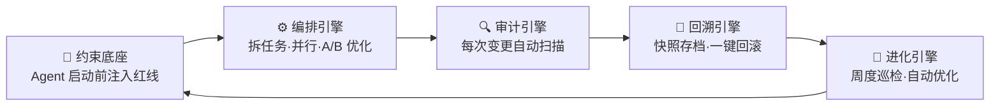
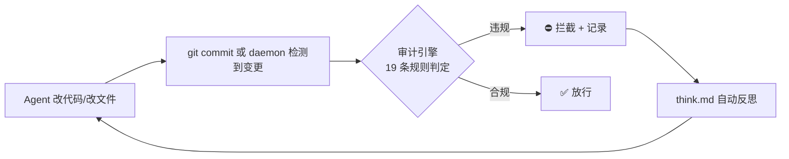
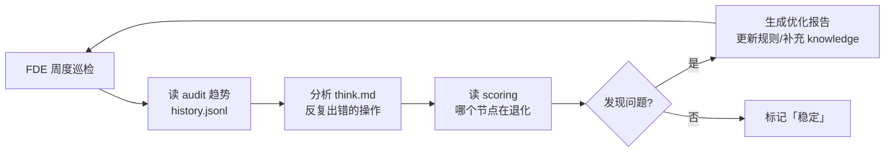

# sofagent Architecture

> 设计决策记录——从为什么存在、五个引擎如何协作，到每个关键决策的工程理由。
> v1.0.9 · 2026-07-14（UTC）· 孔放勋


## 目录

- [术语对照](#术语对照)
- [一、核心理念与架构全景](#一核心理念与架构全景)
- [二、五个引擎设计](#二五个引擎设计)
- [三、部署与运行架构](#三部署与运行架构)
- [四、核心设计决策](#四核心设计决策)
- [五、已知局限与未来方向](#五已知局限与未来方向)

---

## 术语对照

| 引擎 | 英文 | 一句话 |
|------|------|------|
| 🧭 约束底座 | Constraint Base | 四层加载链，Agent 启动前注入红线 |
| 🔍 审计引擎 | Audit Engine | git diff + 文件变更硬证据审计（v1.1.0 拆独立包） |
| 🔄 回溯引擎 | Restore Engine | 每次审计自动快照，`--revert` 一键回滚 |
| ⚙️ 编排引擎 | Orchestration Engine | 任务拆解 + Sub Agent 并行 + A/B 优化 |
| 🧬 进化引擎 | Evolution Engine | FDE 周度巡检 + 自动优化，v1.0.8+ |
| 加载链 | Load Chain | Agent 启动时注入的约束文件 |
| FDE | Forward Deployed Engineer | 前线部署工程师——梳理工作流、部署 sofagent、交付离场 |
| Gateway | Gateway | 企业级 AI 统一入口（OpenClaw/DeepAgents） |

---

## 一、核心理念与架构全景

### 定位：Harness 中间件

提示工程管「说什么」，上下文工程管「知道什么」，约束工程管「跑在哪」。sofagent 管最后一步：**跑完谁验收。** 不是给 AI 写 SOP，是装缰绳——让 AI 在个性化上下文里跑出 85-90 分而不越界。

sofagent 的架构基因来自 Geoffrey Huntley 的 Ralph 循环——「Agent 失忆，文件不失忆」。Agent 的记忆长在文件系统（git diff / task/logs / SKILL.md），不长在 Agent 内部。**不信任 Agent 自我报告，只看 git diff 硬证据。**

| 维度 | 通用 Agent 平台（OpenClaw/DeepAgents） | sofagent |
|------|------|------|
| 管什么 | 「会不会做」——能力问题 | 「能不能每次都做对」——执行控制问题 |
| 怎么管 | 路由、调度、工具调用、会话管理 | 约束注入、变更审计、快照回溯、持续进化 |
| 关系 | Gateway 高速公路 | 交规 + 测速摄像头 + 驾校教练 |

### 理论基础

> 完整引证见 [THANKS.md](./THANKS.md)。关键验证：Hugging Face 实验——同一模型不改权重，仅优化外层 Harness，法律 Agent 基准 3.5%→80.1%，追平 Claude Sonnet 成本仅 1/7。Harness 分两种（翁荔）：补模型短板型（价值随模型升级消失）vs 现实世界接入型（模型越强价值越大）——sofagent 属后者。Karpathy AutoResearch、Palantir AIP、OpenFDE、gstack 等多方独立验证了「Agent 需要外置审计 + 结构化反思」这个方向。

### 五引擎治理架构

Agent 不是装完就完事了——从部署到持续优化，需要五个引擎各管一摊。sofagent 不是"审计工具"——审计是其中一个引擎。



| 引擎 | 一句话设计原则 |
|------|------|
| 🧭 约束底座 | 不知道红线就不会守——启动时注入四层加载链，永远在线 |
| 🔍 审计引擎 | 不信任 Agent 自我报告，只看 git diff 硬证据（v1.1.0 拆独立包） |
| 🔄 回溯引擎 | 行车记录仪，不是安检——事后快照 + `--revert` 回滚，不依赖任何平台 |
| ⚙️ 编排引擎 | 大任务拆小、多 Agent 并行、A/B 对比找更优方案（DeepAgents + compose CLI） |
| 🧬 进化引擎 | 部署完不是终点——FDE 转为持续优化，daemon cron @weekly 自动巡检 |

Gateway（OpenClaw/DeepAgents）管路由调度，sofagent 管行为治理——**Gateway 是高速公路，sofagent 是交规 + 测速摄像头 + 驾校教练**。

### 地基与引擎

sofagent 分两层——地基永远在线，引擎按需启动：

| 层 | 是什么 | 何时激活 |
|:--:|------|:--:|
| 地基 | 约束底座——四层加载链（SKILL.md + fde.md + think.md + knowledge/）| 每个会话启动，永远在线 |
| 引擎 | 审计 + 回溯 + 编排 + 进化——四个运行时模块 | 审计/回溯：每次变更自动；编排：任务拆分时；进化：周度 cron |

> v1.1.0 将审计引擎拆为独立 npm 包 `@sofagent/audit`，地基（约束底座）和其余四个引擎不受影响。

### 产品架构展望（五层）

| 层 | 部署在哪 | 干什么 | 状态 |
|:--:|------|------|:--:|
| **Harness 层** | Agent 上下文 | 纯 MD 文件，Agent 读即生效 | ✅ |
| **执行层** | 用户设备 | daemon 常驻进程——跨 session 经验不丢失 | ✅ |
| **审计层** | git 仓库 + 文件系统 | sofagent-audit——提交时审计 + 文件变更审计 | ✅ |
| **MCP 推送层** | 设备 MCP server | @sofagent/mcp 独立包 | ✅ |
| **协同层** | 多设备 + 云端 | Agent 独立身份、共享上下文、组织记忆 | v2.x |

---

## 二、五个引擎设计

### 🧭 约束底座

四层加载链（SKILL.md → fde.md → think.md → knowledge/）在 Agent 启动时自动注入。每层有不同权限：

| 层 | 文件 | 权限 | 加载时机 |
|:--:|------|:--:|------|
| 1 宪法 | SKILL.md | ❌ 不可修改 | 最先加载（开头注意力最高） |
| 2 规范 | fde.md | ✅ 可改 | 企业专属规则 |
| 3 反思 | think.md | ⚠️ 自动生成 | 上轮踩过的坑 |
| 4 知识 | knowledge/ | ✅ 积累 | 自动关联的 best practice |

OpenClaw 通过 Hook 精确注入，其他平台 Agent 主动 Read，v1.0.7+ Sub Agent 启动时自加载（`buildConstrainedSystemPrompt`）。

### 🔍 审计引擎

核心设计决策：**审计必须外置。** Anthropic 发现 Claude 内部存在 J-space——AI 自己知道控制不住自己。所以不信任 Agent 自我报告，只看 git diff 硬证据。



**证据分层**：git diff = 硬证据（不可绕过），Agent 日志 = 软证据（可伪造）。`--silent` 模式只跑纯 git-diff 规则，零依赖 Agent 配合。

> [Anthropic《When AI builds itself》](https://www.anthropic.com/institute/recursive-self-improvement)（2026-06）：工程师代码产出达 2024 年 8 倍后，人工代码审查成为新堵点。sofagent 的审计引擎把审查外置到 git diff 自动化——正是解这个瓶颈的方向。

**行业印证**：Palantir AIP 靠 Ontology 实现 Agent 可靠性——「根本接触不到 > 被告知不能说」与 sofagent 的 A15 约束验证 + 审计外置遵循同一原则。五个操作特征（闭环操作、控量上下文、权限约束、分支评审、工具定制）与 sofagent 的 loop/evaluate/exit、task-aware、A15、A/B 对比、Skill 系统一一对应。

### 🔄 回溯引擎

行车记录仪，不是安检——事后快照，不依赖任何平台：

| 结果 | 自动动作 | 用户看到什么 |
|------|---------|------------|
| ✅ PASS | 自动快照存档 | 静默 |
| ⚠️ WARN | 存档 + 标记 | daemon-notice.md 告警 |
| ❌ FAIL | 存档 + 建议回滚 | Webhook + 终端标红 |

```bash
sofagent-audit --timeline     # 快照时间线
sofagent-audit --revert SHA   # 回滚到任意快照
```

daemon 自动清理 30 天前旧快照。Webhook 配置在 `.sofagent/config.yml`。

### ⚙️ 编排引擎

大任务拆小、多 Sub Agent 并行、A/B 对比找更优方案。基于 DeepAgents，`sofagent-audit compose --task` CLI 入口——任何 Agent 平台都能用。

**为什么是 Skill + 脚本 + Runtime**：
| 什么事 | 谁来做 | 为什么 |
|------|------|------|
| 判断（评分、反思、选模板） | Skill（MD prompt） | LLM 长项——模式识别 |
| 机械操作（文件读写、API） | 脚本（bash） | 确定性操作 |
| 硬安全（加载链、断路器） | Runtime（OpenClaw） | Agent 失控时没法自己管自己 |

**编排收敛条件**：目标必须可验证（有量化标准）+ 模型可自主判断。Maker-Checker 分离是收敛前提——同一 Agent 自验覆盖仅 7-33%，分离为独立审查后提升至 73%。

### 🧬 进化引擎

FDE 部署完成后转为**持续优化角色**。daemon cron @weekly 自动巡检审计趋势 + 反思记录，发现退化就优化。



---

## 三、部署与运行架构

### 双节点架构

sofagent 支持两种节点类型：

| 维度 | 自动运行节点 | 个人增强节点 |
|------|------|------|
| **场景** | 企业无人值守设备 | 个人开发者（WorkBuddy/Codex 等） |
| **OpenClaw** | ✅ 必须 | ❌ 不需要 |
| **编排调用** | OpenClaw 内部 API | `sofagent-audit compose --task` CLI |
| **约束注入** | OpenClaw Hook 精确注入 | Sub Agent 自加载（`buildConstrainedSystemPrompt`） |

> Sub Agent 约束自加载：启动时读 `.sofagent/` 下的约束文件，拼装为 system prompt。纯文件系统操作，不依赖任何 Agent 平台的 Skill 系统。换平台约束不丢。

### River — Workflow — Subagent 三层架构

**River = 多个 Workflow 的集合**——每条小溪（Workflow）并行/串行执行，汇入同一条大河（River），从头到尾同一个身份、同一段上下文。

```
用户 → River（统一入口）→ Workflow A/B/C（任务拆解）→ Subagent（执行）
              ↑ 回流                                    ↑ 审计引擎
```

| 层 | 是什么 | 类比 |
|------|------|------|
| **River** | 统一 Agent 入口 | 大河——只有一个入口 |
| **Workflow** | 任务编排方案 | 河道——决定水流走向 |
| **Subagent** | 执行具体能力的 Agent | 水滴——干完活消失 |

River 的载体是 OpenClaw + sofagent + Channel 集成。sofagent 不做 River 本身，而是确保 River 里的每一个 Sub Agent 都有纪律、可追溯、会反思。

### Agent 基础设施层（v1.0.8+）

两个内置 Agent 被所有 workflow 节点引用：

| Agent | 管什么 | 触发时机 |
|------|------|------|
| **合规审计员** `@sofagent-audit` | 管底线——P0/P1 分级 | 每次 commit / FDE 部署 / LOOP 闭环 |
| **FDE 部署工程师** `@sofagent-fde` | 管上限——deploy/sustain | 部署时 / daemon cron @weekly |

Agent 定义在 `agents/SKILL/{name}/SKILL.md`，`parseSkillMd()` 读 front matter 作为身份标签，body 注入 DeepAgents 作为 role prompt。

### OpenClaw 在架构中的角色

**审计层不需要 OpenClaw**——sofagent-audit 是独立 TypeScript CLI，输入 git diff，输出 exit code。即使不装 OpenClaw，`npm install -g @sofagent/audit` 配 pre-commit hook 就能让任何 Agent 平台的提交经过审计。

**编排层当前走 DeepAgents**——`compose --task` CLI 入口，任何 Agent 平台都能用。迁移路径：ao → DeepAgents（v1.0.7 完成，ao 已退役）。

### 文件系统审计

v1.0.8+ daemon 监控文件变更，非开发者也能用审计：

| 维度 | git commit 审计 | 文件系统审计 |
|------|------|------|
| 触发 | 用户主动 commit | daemon 自动检测 |
| 拦截 | ✅ 阻断 commit | ❌ 事后告警（已改完） |
| 需要 git | ✅ | ❌ 内嵌 isomorphic-git |

事后审计是平台无关性的前提——实时拦截需深度集成平台，一旦集成丧失第三方独立性。v1.0.8 daemon 让事后审计达到准实时（fs.watch → 2 秒防抖 → 立即审计）。

---

## 四、核心设计决策

### 设计原则

sofagent 的四条设计原则，每条背后有独立的理论/工程/经济学论证：

| 原则 | 含义 | 工程体现 |
|------|------|------|
| **状态最贵** | CS 两大难题都指向状态——缓存失效和命名 | Ralph Loop 无状态范式：Agent 失忆，文件不失忆 |
| **模型输出是提案** | 大模型是带噪声的随机过程——不消除随机性，用循环驯化 | git diff + 审计规则 = 适应度函数 |
| **先有掌控感再自动化** | 不信任 Agent 自我验证 | Maker-Checker 分离：审计引擎独立于 Agent |
| **90%/10% 价值分层** | 模型完成 90% 常规任务，剩余 10% 高风险场景价值反升 | 约束底座占据高价值 10%——模型越强，约束越值钱 |

> **历史转折（v0.98）**：sofagent 最初走「事前约束」路线——在 Agent 干活前注入规则，指望它自律。两次 200 次对照实验后放弃：不是约束无效，是实验室测不出来。转向「事后审计」路线——git diff 是客观证据，不依赖实验设计。这次转向定义了 sofagent 的立身之本：**不信任 Agent 自我报告，只看文件 diff 硬证据。**

### 三层加载链：为什么是这个顺序

| 层 | 文件 | 权限 | 位置原因 |
|:--:|------|:--:|------|
| 1 | SKILL.md（宪法） | ❌ 不可改 | 最前面——开头注意力最高 |
| 2 | think.md（反思） | ⚠️ 自动生成 | 中间——提醒上轮踩坑 |
| 3 | fde.md（规范） | ✅ 可改 | 最后——末尾注意力最高 |

三层之外还有 knowledge/（第四层，按需加载 top-N）。加载链总占用不超过上下文窗口的 3%，500 字原则（每份文件 ≤500 字）是 Agent 压缩后可读的最低保证。

### 反认知投降的制度设计

当 AI 能力过强时，人类会不自觉进入「认知自动驾驶」。sofagent 的三道制度护栏：

| 护栏 | 防什么 | 怎么防 |
|------|--------|--------|
| fde.md 规则可随时覆盖 | AI 判断替代人类意志 | 人类写一条规则，AI 必须遵守 |
| 编排方案可回滚 | AI 方案先斩后奏 | 人类不确认，编排不执行 |
| 审计引擎独立于 Agent | AI 自己验收自己 | git diff 硬证据，Agent 无法篡改 |

### 文件系统架构

理由：`cat task/logs/` 就能拿到记录，不需要 SQL/连接串/权限管理。天然可审计、可传输、支持 Git。Ledger-Views-Policy 三层映射：task/logs = Ledger（只追加）→ knowledge/ + think.md = Views（派生视图）→ fde.md = Policy（读写规则）。

### 模型选择

默认推荐 DeepSeek：不碰 SaaS（API 模式数据不经过第三方）、成本可控（Loop 额外消耗 <1 美分）。模型选择是开放的——Flash 干粗活、Pro 干细活，按成本 4:1 分配。

### 编排收敛与 A/B 测试

编排是 Loop 工程——任务到达后持续迭代至收敛。收敛条件：目标可验证 + 模型可自主判断。A/B 对比走确定性指标（运行次数、违规率、步数、通过率），不由 Agent 主观判断。连续胜出 2 次自动 promote。

| 收敛反例 | 为什么不行 |
|------|------|
| 「优化页面美观度」 | 不可量化，Loop 会跑十几小时无法收敛 |
| 同一 Agent 自验 | 覆盖率 7-33%，裁判运动员同一人 |
| Maker-Checker 分离后 | 覆盖率提升至 73% |

---

## 五、已知局限与未来方向

**已知局限**：18 条详见 [LIMITATIONS.md](./LIMITATIONS.md)。核心：Harness 层自身在上下文里、加载链步进脆弱性、Skill 自进化处于经验记录阶段。

**未来方向**：
- **v1.1.0**：审计引擎拆独立包 `@sofagent/audit` + 轻量多设备经验共享 + daemon 主动巡检
- **v1.2.x**：完整多设备协同——Agent 独立身份 + 跨设备审计聚合 + 场景驱动权限 + 代理网关硬边界
- **v2.x**：组织级共享记忆 + 协同层

> **范围声明**：sofagent 是 Harness 中间件——覆盖行为约束 + 变更审计 + 经验沉淀 + 持续优化。不覆盖 Agent 平台本身（IM 渠道/沙箱/工具调用——OpenClaw/DeepAgents 的事），也不覆盖运维层（监控/告警/重启/日志轮转）。Cloudtag 类全栈产品管从 Agent 到权限的全部层，sofagent 管其中可独立标准化的约束+审计层——不管企业用什么 Agent 平台，sofagent 是第三方独立底线守卫。
