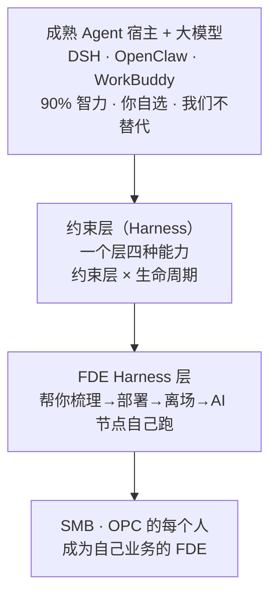
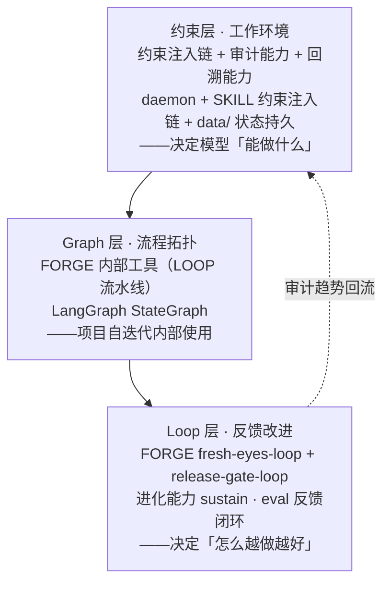
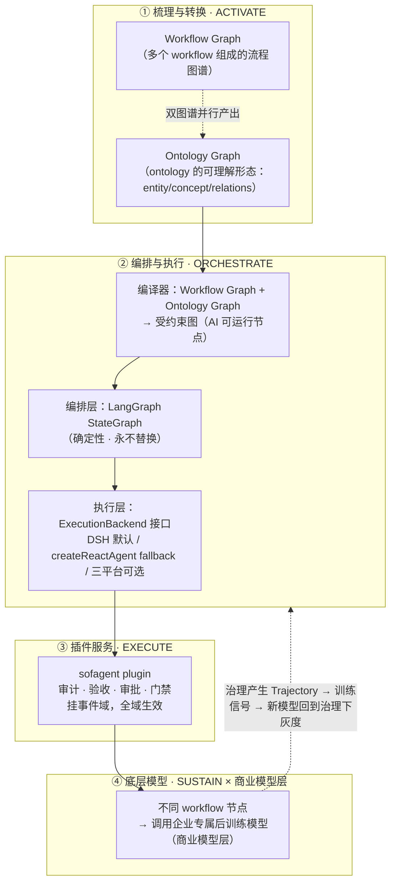
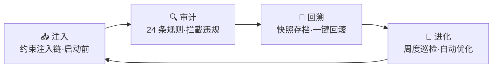
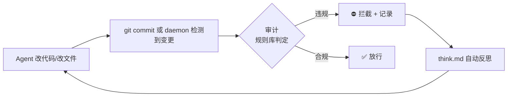
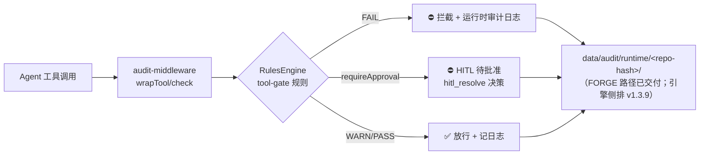
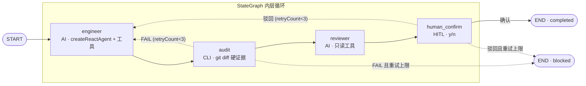
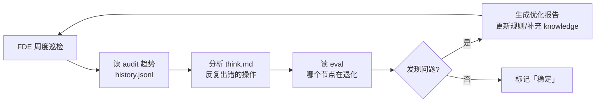
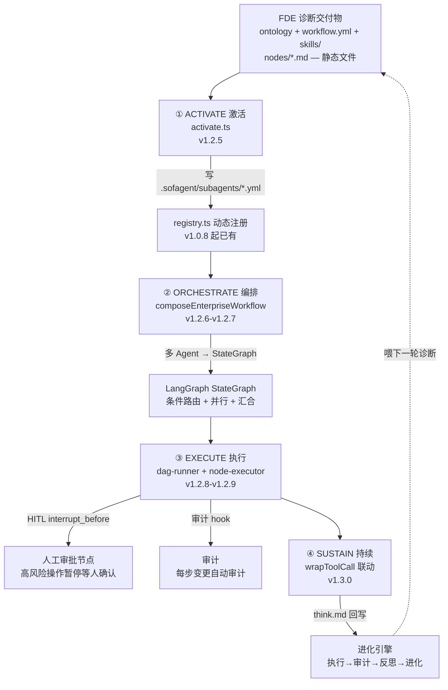

# sofagent Architecture

> 设计决策记录——从为什么存在、约束层四种能力如何协作，到每个关键决策的工程理由。
>
> **产品定位锚定**：本架构服务的产品 = **FDE Harness 层**（sofagent）——不造 Agent，夹在成熟 Agent（执行体：DSH / OpenClaw / WorkBuddy）与模型层（智力源：通用大模型 + 专属小模型 / 后训练模型）之间做治理：对执行体约束（plugin + skill + MCP + CLI + dashboard 五种形态分发），对智力源治理（注册 / 灰度 / 训练 / 部署全留痕）（产品叙事见 [WIKI §二](./WIKI.md#二产品叙事sofagent-是-fde-harness-层不造-agent夹在-agent-与模型之间做治理)）。
> v1.4.0 · 2026-08-23（UTC）


## 心智模型（先读这个）

> **sofagent 是一个开源 FDE Harness 层**（MIT）——不造 Agent，夹在成熟 Agent（DSH / OpenClaw / WorkBuddy）与模型层之间做治理，对外帮你进场梳理业务流、构建本体图谱、部署 AI 节点、离场后 7×24 自己跑。能力底座是一套约束 Agent 行为的约束层（Harness），**约束层 × 生命周期**双层架构：层 1 约束层 = 一个层四种能力（注入·审计·回溯·进化）；层 2 生命周期 = 诊断 → 激活 → 编排 → 执行 → 进化。FORGE 自迭代工具链（LOOP 流水线）是项目内部开发工具，保证每次变更可审计、可回滚、可进化。



### 双层架构：约束层与生命周期（主框架）

**这是理解 sofagent 最关键的一张图**——之前只有"约束层四种能力"（那是**能力视角**：怎么保证做对）。激活链（Activation Chain：FDE 诊断交付物 → 注册企业 SubAgent → 编排成 LangGraph 业务流自动跑，四阶段 ACTIVATE→ORCHESTRATE→EXECUTE→SUSTAIN）引入后，产品在"治理"之外多了一条**流程视角**（企业 AI 从诊断到自动运行怎么走）：

| 层 | 是什么 | 视角 | 回答什么问题 |
|----|--------|------|-------------|
| **层 1 · 约束层** | 一个层四种能力（注入·审计·回溯·进化） | 能力视角 | "怎么保证每次执行都做对" |
| **层 2 · 生命周期** | 诊断 → 激活 → 编排 → 执行 → 进化 | 流程视角 | "企业 AI 从诊断到自运转怎么走" |

```mermaid
graph LR
    subgraph 层2 · 生命周期（流程视角 · v1.4.1+）
        D1[诊断<br/>FDE 四阶段] --> D2[激活 ACTIVATE<br/>交付物→SubAgent]
        D2 --> D3[编排 ORCHESTRATE<br/>多 Agent→StateGraph]
        D3 --> D4[执行 EXECUTE<br/>DAG + HITL + 审计]
        D4 --> D5[进化 SUSTAIN<br/>反思 + 回灌]
        D5 -.->|喂下一轮诊断| D1
    end
    subgraph 层1 · 约束层（能力视角 · 已交付）
        C0[📥 注入<br/>约束注入链·开工前]
        C1[🔍 审计<br/>每次变更硬证据]
        C2[🔄 回溯<br/>快照·回滚]
        C3[🧬 进化<br/>反思·知识·优化]
        C0 --> C1 --> C2 --> C3
    end
    D4 -.->|每步审计| C1
    C1 -.->|违规拦截·回滚| C2
    C2 -.->|回滚后重试| D4
    C2 -.->|重试上限| TERM[🛑 终止 + 审计留痕]
    D5 -.->|think.md 回写| C3
```

> **约束层为生命周期提供能力，生命周期让约束层有活干**——审计在 EXECUTE 阶段每步把关，进化在 SUSTAIN 阶段吃 think.md 回写。两个模型不是并列关系，是**能力 × 流程的矩阵**：约束层是"怎么保证做对"，生命周期是"让什么跑起来"。

### 补充视角：约束层内部分层与业务概念嵌套

> 以下两个视角是对双层架构内部结构的补充展开，不是独立的架构框架——**双层架构是唯一主框架**。

**引擎工程视角**——约束层内部按「环境 → 流程 → 反馈」组织：



> **记忆法：环境、流程、反馈。** 约束层给 Agent 一个稳定的工作间（上下文/工具/权限/可观测性），Graph 告诉它任务流向哪（节点边界/路由条件/并行/汇合），Loop 让它出错后能基于证据自己改进（验证→反馈→修复→再验证）。三层缺一不可——再漂亮的 Graph 没有约束层就不可执行，再好的 Loop 没有 Graph 就不知道在哪个环节改进。
>
> 📌 三层嵌套的**完整 ASCII 架构图（唯一源 / SSOT）见 [WIKI §三·三层嵌套](./WIKI.md#三层嵌套harness--graph--loop)**。本节只做补充说明，不在 ARCHITECTURE 重复维护完整三层图——修改三层结构请改 WIKI 那份。

**业务概念视角**——从企业用户角度看，同一套系统体现为四个自外向内的嵌套层级：

| 层级 | 定义 | sofagent 对应 | 例子 |
|------|------|--------------|------|
| **本体图谱（Ontology Graph）** | 企业全部业务节点和关联关系的全局拓扑——FDE 交付的静态语义图谱（机器读） | FDE 第三章 本体数据（objects / relations / knowledge-domain） | objects.yml + relations |
| **业务图谱（Workflow Graph）** | 企业全部业务流组成的流程图谱——FDE 交付的动态流程图谱（人读）；其中每条完整业务链路即单个业务流 | FDE 第四章 梳理出的业务流集合 | 采购审批流、财报生成流 |
| **Loop** | 业务流中的一个闭环执行单元，由 Goal 驱动 | FORGE loop / AI 节点跑起来 | fresh-eyes-loop、release-gate-loop |
| **Goal** | Loop 的退出条件——达成即停，偏离即纠 | exit-gate 判定 | "所有 P0 修复完成" "审查全绿" |

**业务流（Workflow）由业务节点组成**——业务节点 = AI 节点 + Human 节点（对应 FDE 第四章 三问判定法：从业务节点中识别哪些可 AI 化 → 🔄/⚡ 成为 AI 节点，👤 保持 Human 节点）：

- 🔄 **纯 Loop（AI 节点·自动执行）** — AI 跑完即退出，Goal 达成自动收工
- ⚡ **Loop + Human（AI 节点·强化岗位）** — AI 跑 Loop，Human 在关键环节介入（审批 / 检查 / 兜底）
- 👤 **纯 Human（Human 节点·暂不动）** — 当前不适合上 AI，保持人工

> **Human-in-the-loop 不是"loop 里面塞了人"，而是 workflow 里 loop 节点和 human 节点的协同编排。** 一个 workflow = 一条由不同类型节点串联而成的路径。

举例：采购审批流 = `[🔄 收集报价] → [⚡ 主管审批] → [🔄 生成合同] → [Human 签字]`

### 四层运行形态：企业 AI 从梳理到专属模型

前两张图分别讲「能力视角」（约束层四种能力）和「流程视角」（激活链五阶段）。这张图是**第三个视角——站在企业/客户看完整运行形态**，回答「装上 sofagent 之后，企业 AI 最终长成什么样」：



> 这张图的三处关键精化（2026-08-16 明确）：
> - **L1 是「双图谱并行产出」不是单向转换**——Workflow Graph 管流转（**人读它理解企业怎么运转**）、Ontology Graph 管语义（**AI 读它理解企业是什么**），两者从同一次 FDE 访谈并行产出、互相校验（SHACL），不是「Workflow Graph 画完再转 Ontology Graph」（转换会丢访谈里的隐性知识）。**双图谱术语**：ontology 本身是哲学定义，加 Graph 让它成为可被理解、可视化的东西——FDE 交付的两张图谱即 Workflow Graph（多个 workflow 组成，人读的运转图）与 Ontology Graph（本体数据的图谱化形态，AI 读的语义图）。**行业坐标**：Workflow Graph / Ontology Graph / 知识图谱 / 上下文图谱同属「知识层」（描述业务世界），图谱工程（构建·校验·维护图谱的工程实践）属「工程层」——sofagent 的双图谱交付 = 用工程层方法产出知识层资产，行业对标详见 [VALIDATION](./VALIDATION.md)。
> - **L2 是「编排层永不换 + 执行层可换」两层分离**——编排层 LangGraph StateGraph 永不替换（确定性审计依赖显式图结构），执行层走 ExecutionBackend 接口：DSH 默认 / createReactAgent fallback / 三平台可选。DSH 是最大的一条河，但「堤修在哪条河上都行」，不把企业命脉押在 developer preview 上。
> - **L3 挂的是「事件域」不是节点**——plugin 装一次即在 tools/result、turn-stopping、approval seam 上全域生效，无需逐节点插桩；独立模式（OpenClaw/WorkBuddy + git diff 审计）永远保留，不依赖 DSH 才成立。

## 目录

- [术语对照](#术语对照)
- [能力与状态总览](#能力与状态总览)
- [一、核心理念与架构全景](#一核心理念与架构全景)
- [二、约束层（Harness）设计——一个层，四种能力](#二约束层harness设计一个层四种能力)
- [三、部署与运行架构](#三部署与运行架构)
- [四、核心设计决策](#四核心设计决策)
- [五、激活链架构（v1.2.5+ Phase 1-4 已交付）](#五激活链架构v125-phase-1-4-已交付)
- [六、已知局限与未来方向](#六已知局限与未来方向)
- [七、架构设计决策的行业锚点](#七架构设计决策的行业锚点)
- [八、数据层路线建议（v1.3.2 转正为正式章节）](#八数据层路线建议v132-转正为正式章节)

---

## 术语对照

| 能力 | 英文 | 一句话 |
|------|------|------|
| 📥 注入 | Constraint Injection | 四层约束注入链，Agent 启动前灌入红线 |
| 🔍 审计 | Audit | git diff + 文件变更硬证据审计（v1.1.0 拆独立包） |
| 🔄 回溯 | Restore | 每次审计自动快照，`--revert` 一键回滚 |
| ⚙️ FORGE 工具链 | FORGE Toolchain | LOOP 流水线（内部自迭代用，非对外能力） |
| 🧬 进化 | Evolution | FDE 周度巡检 + 自动优化 |
| 加载链 | Load Chain | Agent 启动时注入的约束文件（又称约束注入链） |
| FDE | Forward Deployed Engineer（前线部署工程师） | 源自 Palantir 交付纪律：工程师驻场客户，掌握完整上下文、打破岗位边界、对结果负责。sofagent 把 FDE 能力产品化——FDE 进场部署 AI 节点，离场后节点自己跑 |
| Harness | 约束层 | 挂在 Agent 之上的行为约束层：一个层四种能力（注入·审计·回溯·进化）。对外中文「约束层」、英文「Harness」为 SSOT；「Constraint Layer」为同义英文旧称，不再单独使用 |
| Gateway | Gateway | 企业级 AI 统一入口（WorkBuddy / OpenClaw 等大厂平台），sofagent 不替代它 |
| Sub Agent | Sub Agent | 用 LangGraph createReactAgent 搭的专有执行节点 |
| Ontology | 本体数据 | 企业的业务世界模型——一套「什么实体存在、能做什么动作、受什么约束」的规则书（机器可读），FDE 帮你搭建并持续维护 |
| River | 统一 Agent 入口 | 多个 Workflow 的集合——每段 Workflow 把模型能力引到业务侧，汇入同一条大河。详见 §三 River—Workflow—Subagent 三层架构 |
| SMB | 中小企业（Small & Medium Business） | 没有专职 AI 部署团队、想低成本具备 FDE 能力的企业 |
| OPC | 一人公司（One Person Company） | 个人或小团队，用自己的 Agent + 模型自主完成部署，不愿被单一厂商锁定 |
| 激活链 | Activation Chain | 生命周期层：FDE 交付物 → 企业业务流自动跑。四阶段 ACTIVATE→ORCHESTRATE→EXECUTE→SUSTAIN（v1.2.5+） |
| ACTIVATE | 激活 | 读 FDE 交付物 → 写 `.sofagent/subagents/*.yml` → 注册企业 SubAgent（v1.2.5） |
| ORCHESTRATE | 编排 | 多个企业 SubAgent → LangGraph StateGraph 业务流（v1.2.6-v1.2.7） |
| EXECUTE | 执行 | DAG 运行 + HITL 人工审批 + 审计集成 + 异常兜底（v1.2.8-v1.2.9） |
| SUSTAIN | 持续 | wrapToolCall 联动：执行 → 审计 → 反思 → 进化（v1.3.0） |

> ⚠️ **旧名兼容**：注入/审计/回溯/进化即原约束底座/审计引擎/回溯引擎/进化引擎，v1.2.9 起统一为约束层四种能力；「约束底座」「Constraint Layer」均为「约束层（Harness）」的同义旧称，不再单独使用。历史文档中的"引擎"表述保留不动（archive/changelog 是历史快照不改）。代码层面的类名 `AuditEngine`、函数名 `runAuditGate`、文件名 `engine/audit` 全是 API，保持不动。

> 💬 **交互范式**：sofagent 的核心交互是语言（MCP / IM / CLI），无操作型 GUI——所有能力通过 MCP 协议暴露，用户通过 Agent 对话（LUI）操作：说一句话，它做完告诉你结果在哪。dashboard 是只读监控视图（localhost:3780，详见下文），不承担操作职能。这是架构的根本设计约束：不存在「仅 CLI 可用」或「需要打开页面」的能力。详见 [设计哲学](./PHILOSOPHY.md)。

### 约束层七维度（Agent 的构成面）

Agent = **模型 + 上下文 + 工具 + 状态 + 执行控制 + 权限 + 可观测性** 七个维度。约束层四种能力（注入·审计·回溯·进化）各自覆盖其中若干维度，不构成独立架构层——七维度是「Agent 由什么构成」的分析框架，四种能力是「约束层对 Agent 做什么」的生命周期框架，两者正交。

| 维度 | 含义 | 主要受约束层哪阶段覆盖 |
|------|------|----------------------|
| 模型 | 推理内核 | 注入（系统约束）+ 进化（模型选择反思） |
| 上下文 | 注入的知识 / 记忆 / 本体 | 注入（L1-L4 加载链） |
| 工具 | Agent 可调用的外部能力 | 注入（工具边界红线）+ 审计（越权调用） |
| 状态 | 运行中的中间态 | 审计（变更留痕）+ 回溯（快照） |
| 执行控制 | 编排 / DAG / HITL | 注入（流程约束）+ 审计（异常路径） |
| 权限 | 能碰什么资源 | 审计（A 类越权规则）+ 回溯（最小权限） |
| 可观测性 | 日志 / 追溯 / 签名 | 审计（硬证据）+ 进化（趋势反思） |

> 维度构成以 [WIKI 术语表](./WIKI.md) 本行为准；四种能力各自的维度分工详见 [设计哲学 §一·四件事的分工](./PHILOSOPHY.md#四件事的分工mcp--skills--ontology--harness)。

---

## 能力与状态总览

> 这份清单是「现在能干什么」的单一索引。约束层内部设计见 [二、约束层（Harness）设计——一个层，四种能力](#二约束层harness设计一个层四种能力)；未来方向见 [六、已知局限与未来方向](#六已知局限与未来方向)。

### 22 个 workspace 源码包（构成以 package.json workspaces 为准：12 个引擎 @sofagent/* 包 + 1 个工具包 + 9 个 DSH 插件包 cordis-plugin-sofagent-*；其中 13 个发布为 @sofagent npm 包，DSH 插件 9 款经 SkillHub 分发。「12 包」统计口径指有 test script 的引擎包）

| 包 | 职责 | 状态 |
|---|---|---|
| audit | 提交时审计，24 条规则（17 默认 + 7 扩展，[完整清单见 SECURITY](../SECURITY.md#24-条审计规则完整清单文档级-ssot)）硬证据扫描 + 快照/回滚/webhook + 本体建模要求对齐维度（`runRules({gb48000:true})` opt-in） | ✅ 已实现（878 测试） |
| core | 核心运行时：git diff 解析、shadow-repo 快照、AES-256-GCM/ECDH、think.md 契约、doctor、LLM 调用 Trace、stop_reason 分类、身份码 Ed25519 | ✅ 已实现（368 测试） |
| harness | 四层约束加载链 `buildConstrainedSystemPrompt()` + L4 渐进加载（热点全文 + 索引） | ✅ 已实现 |
| rules | 规则引擎纯函数包（零 fs/git 依赖），编排层 tool-call 事前拦截 + 审批四模式 | ✅ 已实现 |
| eval | 质量评估引擎：精确匹配 / 语义相似 / 规则合规 三维评分 | ✅ 已实现 |
| ab-test | A/B 自进化：current vs candidate 并行对比，连续胜出 + 非退化守卫才晋升 | ✅ 已实现 |
| orchestrator | 编排引擎：DAG 任务拆解 + LangGraph 闭环 + A/B 调度器 + ToolGate 事前拦截 + Ontology 运行时层 + 并行编排（MergeQueue/ParallelScheduler/波次卡关）+ Durable Execution + Onboard L1-L5 + Benchmark 评测 + agent-creation + FDE 梳理辅助 + Session 隔离 + meta-harness 多 harness 编排 + worklog 工作明细数据层 | ✅ 已实现（1070 测试） |
| daemon | 守护进程：cron + fs 监听 + 文件级审计 + USB 烧录 + 联邦查询 + Dream Cycle 6 阶段 + 启动 LOOP 续跑检查 + 审计轨迹聚合巡检 | ✅ 已实现（267 测试） |
| mcp | MCP Server：JSON-RPC 2.0 over stdio，tools + resources（67 tools） | ✅ 已实现 |
| ontology | 领域本体：合并 / 状态 / 视图 / 概念合成，三层 YAML 自动生长 | ✅ 已实现 |
| skillopt | Skill 优化：复用 audit 规则做安全审查 + 集成优化 + 回填 | ✅ 已实现 |
| think | 思考链分析：基于 diff + 审计结果自动生成 think.md 反思条目（append-only） | ✅ 已实现（⚠️ 仅 MCP/CLI 路径触发，git hook 路径不自动生成） |
| load-chain | 加载链 Hook 包 `@sofagent/load-chain`：Agent 平台（OpenClaw / WorkBuddy 等）hook 注入四层约束（v1.2.0 DP-4（设计原则 4）提升为正式 workspace 包） | ✅ 已实现 |

### API 分级边界决策（@public / @internal）

v1.3.9 起对所有 workspace 包的入口 export 做显式分级，CI 门禁（[tools/check/public-api.mjs](./../tools/check/public-api.mjs)）拦截未 bump 版本的 `@public` 破坏性变更。

**为什么是这个粒度**：
- 基线覆盖 **12 个含 test script 的包**（hooks 包 `load-chain` 为纯 hook 安装器，无 `@public` 符号，不计入分级基线）——当前 12 包共 **1456 个 @public 符号**（以 `public-api.mjs` AST 解析为权威口径，非 grep 计数；v1.4.0 成本审计新增 5 符号：runCostAudit/loadWorklogSlice/CostBudget/CostFinding/WorklogSlice）。
- 未标记的导出**默认视为 @public**（保守默认：宁可多承诺不可漏承诺），`@internal` 需显式标注。

**为什么 @internal 破坏性变更不影响适配层**：
- 跨平台适配器（Cursor / Codex / Gemini CLI 薄挂载）与 `@sofagent/audit` 等外部依赖方**只许 import `@public` 层**——`@internal` 是引擎内部实现细节，破坏性变更不触发 semver 约束。
- 若某符号从 `@internal` 升为 `@public`，等同新增公开 API，需 bump 版本 + CHANGELOG 记录（门禁自动拦截漏标场景）。

> 符号数声称与 baseline 的自动校验见 `public-api.mjs` 的「文档声称符号数校验」段——文档写 1456 必须与 baseline 实际数一致，否则门禁 FAIL（根治历史 1449 漂移类问题）。

### 对外核心能力（FDE Agent 给用户什么）

> 累计能力表（按版本归组，全部 ✅ 已发布可用；规划中/排期项见下方「已排期」）：

| 版本 | 关键能力 |
|------|---------|
| **基座（v1.2.0）** | FDE 常驻部署（进场梳理 → 识别节点 → 构建知识库 → 离场 7×24 自跑）· AI 节点自动化 · 24 条规则行为审计（零 token 纯静态，当场拦截）· 一键回滚（git snapshot `--revert`）· 平台无关核心约束（Claude Code / Codex / WorkBuddy / OpenClaw 均可用审计能力；支持平台 Hook 自动注入，其他平台手动注入约束 + 审计照常生效）· AI 知识库自动积累（Dream Cycle + sensitivity 分级）· Ontology 本体数据 · USB 一键烧录（AES-256 加密 + HMAC 签名，插上即用拔掉零残留）· 安全联邦多设备互查（v1.1.8+）· 4 个 Sub Agent（@sofagent-fde + @sofagent-audit + engineer + reviewer）· daemon 守护进程 + A/B 自动调度器 · MCP Server 暴露全部能力 · FDE 四阶段十二步方法论 · 持续优化 sustain 模式 · 控制图状态抽取（ControlGraphState 数据层） |
| **v1.2.9** | 三个入口产品（npx 零配置审计 CLI + 规则市场 `--ruleset` + GitHub Action）· FORGE Driver 短任务化 + Checkpoint/Resume worker 级断点 + PM2 守护进程 |
| **v1.3.0** | 运行时审计最小闭环（wrapToolCall middleware + tool-gate 动态拦截 + 运行时审计日志）· 决策审计（emitDecision + HMAC 链 + kind-wise 查询）· 规则透明化（`list_rules` MCP tool）· 危险操作 HITL 钩子 · 双规则系统统一（`ruleType`）· 激活链 Phase 4 收尾（SUSTAIN 全闭环）· 外部记忆后端 Path A（可选，缺省关闭）· 进化链路写保护 |
| **v1.3.1** | Ontology 运行时层（Action 注册表 + validator 三态 + Schema 定稿）· 并行编排（ParallelScheduler + 波次审计卡关 + MergeQueue）· Durable Execution（checkpoint 续跑 + 副作用幂等）· Agent 身份码 Ed25519 · 🚀 Onboard Agent L1（loop_debug）· 📊 Benchmark 评测（evaluate）· 工具审批四模式 · LLM 调用级 Trace · 错误处理升级（stop_reason + 退避）· L4 渐进加载 · 本体建模要求对齐 GB/T 48000.3-2026（`runRules({gb48000:true})`）· 跨设备审计轨迹聚合（audit_trail） |
| **v1.3.3** | L2 团队协作协议 + Refine Agent 完整版 + 入口路由 |
| **v1.3.4** | L3 组织能力公地（发布→发现→调用→评价→养护）+ SkillScan 安全门（三态判定）+ 编排层与执行层分离（ExecutionBackend） |
| **v1.3.5** | MCP 自进化+运维闭环（A/B 实验 run_ab_test / promote_ab 人审晋升 + 快照 snapshot_list / snapshot_restore 人审恢复）+ instinct→skill 自动进化（三源提取 + 置信度评分 + /evolve 聚合）+ FDE 运维五件 + DSH MCP 互通 |
| **v1.3.6** | 引擎接口外化——Workflow 标准格式 + 运行容器（`workflow_submit`）/ Ontology Schema 注册（`ontology_import` D1-D5 留痕）/ 模型注册 + 灰度切换（`model_register` / `model_switch`）/ SubAgent 托管 SDK（`harness.wrap` 双形态）/ 训练协议三约定 + 预算控制（`train_budget`）/ 机器可判定验收（`define_acceptance` / `check_acceptance`）/ 路由决策可解释性（EndpointProfile + route-policy + routeReason）/ 可靠性五件（worktree 隔离 + 双闸验证 + 疲劳度检测 + 分级降级 + decisions.jsonl 完整版）· MCP 60 tools |
| **v1.3.7** | SubAgent 完整沙箱（虚拟 FS / 网络白名单 / 工具中介 / 虚拟 key / 独立进程 / A-B 双跑）· 场景驱动权限 · AgentShield 五类扫描 · 行业 overlay 四套 · 断路器行为监控 · ontology 生命周期 |
| **v1.3.8** | 代理网关硬边界（唯一出入口 + 风险分级 + 权限单调守卫 + HITL 审批队列）· 数据静态加密（纯 TS AES-256-GCM）· Durable Execution L3（WAL 三态恢复 + undo 三档回滚）· 异步长任务自治 · FORGE driver 保活三件套 · 托管 SDK `sandbox:true` 启用 · release-gate 瘦身 · fresh-eyes 成本重构 · 快照写路径加固 |

> **v1.2.0 审计链安全加固**（BugFix 批次）：`--doctor` hash chain 三态判定（ok / tampered / unverifiable，`checkHistoryChainDetailed`）· HMAC key ≥16 字节强校验（`validateHmacKey`）· HMAC 签名改为基于脱敏记录（先 sanitize 再签名，写读一致）· config 可选签名校验（`verifyConfigSignature` + `signConfig` CLI）· CLI 版本一致性自检（`checkVersionConsistency`）。详见 `engine/core/src/audit-history.ts`、`engine/core/src/config-loader.ts`。

### 安装包边界与部署架构（v1.3.2 定位校准）

> **核心定位**：sofagent 装在**企业跑 AI 节点的设备**上，是 Agent 的监控约束层。FDE 自己的电脑不该跑 install.sh——FDE 的工具是 Skill（方法论）+ 未来 商业模型层 模型。
>
> **行业坐标（2026-08-19 红杉闭门分享吸收）**：红杉说「所有 AI 应用公司终将成为 Neo-Lab」——竞争主战场从应用层转向智能层，**产品即智能**。sofagent 的差异化立场不在智能层而在约束层：**智能是模型厂商的，管住智能的约束层才是企业的护城河**。Sovereign AI 要的是「对关键智能链路的控制权」，而控制权的一半（数据主权、审计、审批、回滚、灰度）正是约束层的职责——红杉说智能是护城河，sofagent 说「管住智能」才是护城河，两者互补不冲突：企业掌控智能（Neo-Lab 的活），sofagent 提供管控（约束层的活）。

**谁装什么——三个位置各归各位**：

| 位置 | 装什么 | 目的 |
|------|--------|------|
| **FDE 的电脑** | FDE Skill（ClawHub 装）+ 未来 商业模型层 FDE 模型 | FDE 做诊断——五要素拆解、建 workflow、搭 ontology |
| **企业设备**（跑 AI 节点）| **sofagent install.sh 全套** | **盯 Agent**——审计每次变更、回溯、注入铁律、daemon 7×24 巡检 |
| **企业员工的 Agent 平台**（WorkBuddy/Codex） | sofagent Skill（ClawHub 装）| 员工的 Agent 受铁律约束干活 |

**install.sh 装什么——企业设备需要全套（事前约束 + 事后拦截）**：

| install.sh 装的 | 为什么企业设备需要 |
|---|---|
| @sofagent/audit + git hook | 事后拦截——Agent commit 时扫 24 条规则 |
| daemon | 7×24 巡检（数据主权 / 知识健康 / 失败模式） |
| dashboard | **单机监控面板**——企业 IT 看本设备 Agent 运行状态（多设备聚合走商业侧 商业平台，不在开源范围） |
| SKILL.md + fde.md + rules/core-rules.md + rules/role-*.md | **事前约束**——Agent 启动时读铁律，知道规则才能遵守 |
| 4 个 Agent Skill（fde/audit/engineer/reviewer）| SubAgent 岗位定义 |
| HMAC key | 审计记录防篡改 |

> **事前约束（Skill 注入）+ 事后拦截（审计引擎）缺一不可**——只有审计没 Skill = Agent 不知道规则；只有 Skill 没审计 = Agent 知道规则但可以不遵守。install.sh 是这两者的完整闭环。

**安装器模式**：

| 命令 | 装什么 | 适用 |
|---|---|---|
| `install.sh`（默认） | 底座 + FDE Skill + hook（全套） | **企业设备**：要常驻 Agent + 7×24 监控 |
| `install.sh --base-only` | 仅底座（审计·回溯·daemon） | 企业 IT：只要核心监控，不装 Agent Skill |
| `npx -y -p @sofagent/audit sofagent-audit` | 零安装，临时审计 | 开发者：30 秒体验，在任何 git 仓库跑一次 |

> ⚠️ **FDE 不该在自己电脑跑 install.sh**——install.sh 是企业设备安装器，不是 FDE 工具。FDE 的工具是 Skill（ClawHub 装）+ 未来 商业模型层 模型。
>
> ⚠️ **dashboard 是单机监控面板**——每台装了 sofagent 的设备一个 dashboard，盯本机 Agent。多设备聚合是企业级需求，走商业侧 商业平台（不在开源范围）。

> 最小可用：只装 `@sofagent/audit` 就有纯审计（24 条规则，17 默认启用 + 7 扩展 opt-in + 快照 + 回滚）；五包全装才是完整约束层（Harness）。

### 已排期（开发中或即将开发，详见 ROADMAP）

Dashboard Web 前端（`dashboard.html` 单文件控制台已落：驾驶舱/FDE 引导/AI 节点/本体数据/知识库/工具箱 6 页 + `tools/dashboard/serve-dashboard.mjs` 服务，读 `data/` 实时数据 + 示例降级；工作明细数据层 v1.3.9 + Web 工作明细页 v1.4.0）· 完整多设备协同 L2 · meta-harness 多 harness 编排（v1.3.9）· 本地推理 workflow 专属 LoRA 小模型（v3.x–v4.x 远景，纯画饼）。完整路线见 [六、已知局限与未来方向](#六已知局限与未来方向) 与 ROADMAP。
>
> **Dashboard 双形态说明（v1.3.5 归位 tools/）**：`tools/dashboard/dashboard.html`（Web 形态，`node tools/dashboard/serve-dashboard.mjs` 起服务——与服务器同目录）与 `tools/dashboard/sofagent-dashboard.sh`（终端形态，装到 `~/.sofagent/bin/`，零依赖 bash）是同一 Dashboard 的两种产品入口（README 三入口表）：Web 给老板/IT 可视化看，终端给开发者/FDE 快速看。二者职责不同，勿混用/勿删其一。

---

## 一、核心理念与架构全景

> 📖 **「为什么这么做」**见 [PHILOSOPHY](./PHILOSOPHY.md)。这里只讲架构设计——**怎么做的。**

sofagent 的架构基因来自 Geoffrey Huntley 的 Ralph 循环——「Agent 失忆，文件不失忆」。**不信任 Agent 自我报告，只看 git diff 硬证据。**

| 维度 | 通用 Agent 平台（WorkBuddy / OpenClaw 等） | sofagent |
|------|------|------|
| 管什么 | 「会不会做」——能力问题 | 「能不能每次都做对」——执行控制问题 |
| 关系 | Gateway 高速公路 | 交规 + 测速摄像头 + 驾校教练 |

> **90%/10% 价值分层**：AI 模型提供 90% 的智力输出（写代码、做分析、生成报告），但企业敢不敢让 Agent 自主执行，取决于最后 10%——**可靠性、可追溯性、可问责性**。sofagent 的价值不在那 90% 里（那是模型的事），在那 10% 里（约束层的事）。模型越强，约束层越值钱——因为 Agent 能做更多事了，但"做错了怎么办"的代价也更大。

> 理论基础及行业验证见 [THANKS.md](./THANKS.md) 和 [PHILOSOPHY §四 信任模型](./PHILOSOPHY.md#四怎么管信任模型)。

### 治理架构（约束层四种能力）



| 能力 | 设计原则 | 独立包 |
|------|------|:--:|
| 📥 注入 | 四层约束注入链永远在线 | @sofagent/harness |
| 🔍 审计 | 只看 git diff 硬证据 | @sofagent/audit |
| 🔄 回溯 | 事后快照 + `--revert` | @sofagent/core |
| ⚙️ FORGE 工具链 | StateGraph LOOP 流水线（内部自迭代用） | @sofagent/orchestrator |
| 🧬 进化 | daemon cron @weekly | @sofagent/daemon + @sofagent/skillopt |

> 约束层四种能力的完整设计哲学见 [PHILOSOPHY §三 架构全景](./PHILOSOPHY.md#三怎么跑架构全景)。

### 输出签名机制（v1.1.3）

约束层最大的挑战是存在感——约束在正常工作，但用户看到好结果时不知道是约束层在起作用。v1.1.3 引入三层签名：

| 层级 | 机制 | 用户如何感知 |
|------|------|------------|
| 审计输出 | CLI / Webhook / MCP 所有返回值以 `[sofagent]` 开头 | 看到 `✅ sofagent 审计通过` 而非 `✅ PASS` |
| 能力清单 | `list_capabilities` description 标注引擎来源 | Agent 转述能力时附带"谁在做、怎么做的" |
| 审查报告 | FORGE 审查报告顶部标注审计来源 | 报告中体现 `sofagent` 标识 |

签名不修改审计逻辑、不加速度开关——约束层不允许关掉自己的存在感。

### 跨能力关注点：持续感知层

签名解决的是"当下这一条结果是谁做的"。但 FDE 离场后，还有一个更长周期的问题：**客户 3-6 个月后是否还记得 FDE 部署了什么。**

这是 sofagent 的**持续感知层**——审计能力产出证据，进化能力生成报表，MCP 层负责推送。**FDE 的成功悖论是结构性的**：系统跑得越稳，客户感知越弱（详见 [FDE/GUIDE.md §5.9 离场](../FDE/GUIDE.md#59-离场五大能力)）。持续感知层是产品的必修课，不是营销策略。

> 📖 完整的感知衰减曲线 + 三层持续感知体系（定期价值证明 / 系统自曝复杂度 / 不可替代性标记）+ 配置方法见 [SKILL/skills/05-exit.md](../SKILL/skills/05-exit.md)（AI 执行层）与 [FDE/GUIDE.md §5.9](../FDE/GUIDE.md#59-离场五大能力)（人读概念）。

### 地基与引擎

| 层 | 是什么 | 成本 |
|:--:|------|:--:|
| 地基 | 四层加载链（纯 MD 文件，Agent 读即生效） | ~3,500 token |
| 约束层（引擎） | 编排 + 审计 + 回溯 + 进化（含质量评估）+ 约束注入链（daemon + CLI） | 按需启动 |

> v1.1.0 将审计拆为独立 npm 包 `@sofagent/audit`，地基（约束注入链）和其余能力（编排/审计/进化）与回溯不受影响。

### 产品架构展望（五层）

| 层 | 部署在哪 | 干什么 | 状态 |
|:--:|------|------|:--:|
| **Harness 层** | Agent 上下文 | 纯 MD 文件，Agent 读即生效 | ✅ |
| **执行层** | 用户设备 | daemon 常驻进程——跨 session 经验不丢失 | ✅ |
| **审计层** | git 仓库 + 文件系统 | sofagent-audit——提交时审计 + 文件变更审计 | ✅ |
| **MCP 推送层** | 设备 MCP server | @sofagent/mcp 独立包 | ✅ |
| **协同层** | 多设备 + 云端 | Agent 独立身份、共享上下文、组织记忆 | v2.x |

---

## 二、约束层（Harness）设计——一个层，四种能力

### 📥 注入（约束注入链）

四层加载链（SKILL.md → fde.md → think.md → knowledge/）在 Agent 启动时自动注入。每层有不同权限：

| 层 | 文件 | 权限 | 加载时机 |
|:--:|------|:--:|------|
| 1 宪法 | SKILL.md | ❌ 不可修改 | 最先加载（开头注意力最高） |
| 2 规范 | fde.md | ✅ 可改 | 企业专属规则 |
| 3 反思 | think.md | ⚠️ 自动生成 | 上轮踩过的坑 |
| 4 知识 | knowledge/ | ✅ 积累 | 自动关联的 best practice |

Agent 平台（OpenClaw / WorkBuddy 等）通过 Hook 精确注入，其他平台 Agent 主动 Read，v1.0.7+ Sub Agent 启动时自加载（`buildConstrainedSystemPrompt`）。

> **v1.1.8 加载链扩展**：联邦知识注入于 knowledge/ 层（加载链第 4 层，位于 think.md 第 3 层之后；目录 `knowledge/federation/`，daemon 联邦查询落盘的 peer 知识快照）——低于 SKILL.md 宪法层。联邦内容是外部来源，强制 `<untrusted source="federation">` 包裹（Prompt 注入防线层 1，详见 SECURITY.md 8 层映射表）。

### 为什么选注入，而不选 fine-tune / 显式 prompt

约束层选择「注入」作为核心机制，是因为两个备选方案各有不可接受的代价：

| 方案 | 为什么不选 |
|------|-----------|
| **fine-tune（微调模型内化约束）** | 不可审计（约束被压缩进权重，无法逐条核对模型是否真的记住了）· 不可回滚（改约束需重新训练，不能像改 MD 文件一样即时撤销）· 不可按会话粒度调整（微调是模型级改动，无法针对单个 Agent / 单次会话差异化）· 成本高（每次约束变更都要训练） |
| **显式 prompt（把约束写进系统提示词）** | 依赖 Agent 注意力，无机制保障——模型可能忽略长文本中的约束（Lost in the Middle），无法保证 100% 命中 |

注入（四层约束注入链）把约束放在可审计、可回滚、可逐会话加载的 MD 文件层，配合事后审计的 git diff 硬证据兜底。注入的已知边界是「约束力 = Agent 注意力 × 平台加载可靠性」（见 [LIMITATIONS「Harness 层自身在上下文里」](./LIMITATIONS.md#harness-层自身在上下文里)），但相比 fine-tune 的不可审计与显式 prompt 的无兜底，注入是三者中唯一「可被外部逐条验证」的路径。

### 权限四原则与零凭证沙箱

行业参考将 Agent 权限治理归纳为四条可操作原则，与 sofagent 审计能力 + 约束注入链同构：

1. **最小权限**：每个 Agent 只拿当前任务必需的最小凭证集，不预置全量权限。
2. **群维度隔离**：按组织 / 项目 / 环境维度隔离权限域，跨域调用需显式授权。
3. **不可越权**：硬约束层（审计能力）兜底，越权动作在 Action 边界被拦截，AI 绕不过。
4. **可热更新**：权限策略运行时可改、即时生效，不重启 Agent。

**零凭证沙箱**：运行时上下文不落明文密钥——凭证由守护进程注入、用毕即销，Agent 全程只见句柄不见明文（对齐 A2 不泄密钥铁律）。

**最坏情况反问**（权限模型必答题）：「如果这个 Agent 被 Prompt 注入了，最坏情况是什么？」答案应是它 profile 内那些权限能做的事，而非整个系统沦陷——权限不是限制 Agent，是保护组织。

**动态治理三机制**（行业参考内部实践）：
- 动态提权：任务触发、限时授权、到期自动回收（临时审批申请 → 批准 → 约 2 小时后过期）。
- 熔断拦截：高危操作实时拦截、等待人类确认。
- 红线制度：超阈值动作（如合同金额 > 10 万）须 VP 签字等边际审批。

### 联邦查询（v1.1.8）

两台配对设备经 Agent 平台 channel（如 OpenClaw）互相查 knowledge/。纵深防御四层：MCP localhost 绑定 → 平台 channel 路由 → **AES-256-GCM 应用加密**（审计结论：本地回环 ws:// 明文无 TLS，第 3 层是唯一保密防线）→ sensitivity frontmatter 过滤。

| 模块 | 落点 | 职责 |
|------|------|------|
| 安全层 | `core/src/crypto/` | AES-256-GCM（IV 12 字节随机不复用 + tag 校验）· ECDH(prime256v1)+HKDF 派生 32 字节 key（只存内存）· 24h 密钥轮换（旧 key 只解不加）· 三条配对路径（6 位码 + y/N / `~/.sofagent/federation.token` 文件（权限 600，带外交换）/ federation.json HMAC .sig 验签） |
| 传输层 | `daemon/src/federation/channel.ts` | Agent 平台 channel 抽象（依赖倒置，测试内存 channel）；只搬运密文帧（iv‖tag‖ciphertext） |
| 查询路由 | `daemon/src/federation/query-router.ts` | 并发 fetch + 单 peer 5s 超时按离线 + sensitivity 本地端二次校验（restricted 不接收；篡改标签降权 trust=web + 审计 WARN） |
| 合并 | `daemon/src/federation/merge.ts` | `automerge@1.0.1-preview.7`（MIT）CRDT 合并（clone-fork 共享版本史收敛）；裁决：trust 优先于 mtime；排序 trust 降 → mtime 降 |
| 离线降级 | `daemon/src/federation/offline-fallback.ts` | 任一 peer 离线跳过不阻塞；全部离线/整块失败退化纯本地查；审计 `federation_query{peers, merged, onlinePeers}` |
| 注入点 | `mcp/src/mcp-server.ts` · `harness/src/index.ts` | search_knowledge 异步联邦合并（best-effort）；harness 加载链第 3 层（`<untrusted>` 包裹） |

### 🔍 审计能力

核心设计决策：**审计必须外置。** Anthropic 发现 Claude 内部存在 J-space——AI 自己知道控制不住自己。所以不信任 Agent 自我报告，只看 git diff 硬证据。



**证据分层**：git diff = 硬证据（不可绕过），Agent 日志 = 软证据（可伪造）。`--silent` 模式只跑纯 git-diff 规则，零依赖 Agent 配合。

> [Anthropic《When AI builds itself》](https://www.anthropic.com/institute/recursive-self-improvement)（2026-06）：工程师代码产出达 2024 年 8 倍后，人工代码审查成为新堵点。sofagent 的审计把审查外置到 git diff 自动化——正是解这个瓶颈的方向。

**行业印证**：Palantir AIP 靠 Ontology 实现 Agent 可靠性——「根本接触不到 > 被告知不能说」与 sofagent 的 A15 约束验证 + 审计外置遵循同一原则（不依赖 Agent 自我报告，只看 git diff 硬证据）。Palantir OAG 的「确定性与概率性分离」与 sofagent 审计完全同构——sofagent 的 19/24 条规则为纯 git-diff（不依赖 Agent 配合）正是这一原则的工程实现。完整的行业对标分析（Palantir OAG 五层映射、Ledger-Views-Policy 对照、DeerFlow/Omnigent/DataFlow 等）见 [PHILOSOPHY §五·世界模型](./PHILOSOPHY.md#为什么世界模型优先于语言模型) 和 [VALIDATION](./VALIDATION.md)。

> 💡 **规则编号说明**：A1–A11 + A18–A23 为默认规则（17 条），A14–A17 + E1/E2/E4 为扩展规则（7 条，需 opt-in），全量 24 条（17 默认 + 7 扩展）。**24 条规则完整清单（文档级 SSOT）见 [SECURITY.md → 24 条审计规则完整清单](../SECURITY.md#24-条审计规则完整清单文档级-ssot)**，逐条行为表见 `engine/audit/README.md`。A12/A13 已在 v0.99.4 合并入 A11，E3 已在 v1.2.5 并入 A11，编号不再使用。

**审计的双重定位**：

| 层级 | 做什么 | 行业对标 |
|------|--------|---------|
| 工程层 | 约束行为 + 变更审计 + 责任归属 | 事后护栏——每次变更都可追溯 |
| 叙事层 | Agent 责任确权底座 | **轻量级 KYA（Know Your Agent）**——Agent 的每一次行动都有加密签名凭证 + 不可伪造的硬证据链 |

> 🔑 **机器审阅（GitHub 式协作底座的差异化核心）**：GitHub 的 PR 审阅靠人（reviewer 手动看 diff），而 sofagent 的审阅门是 **24 条规则自动审 + git diff 硬证据**。这意味着审阅不需要「人来看」——**纯自动 AI 节点（7×24 无人值守）也能被审阅**。审阅从「人力的瓶颈」变成「机器的流水线」，所以「人+AI 提 PR」「纯 AI 提 PR」两种贡献形态才同时成立。这正是 sofagent 从「审计工具」升维为「GitHub 式协作底座」的关键一跃。

在 agent-wrapping-agent 多层嵌套的架构趋势下（a16z 2026 研判），审计不仅是「事后护栏」——它是 Agent 嵌套体系中的**一等架构评估层**：外层 Agent 在运行期评估子 Agent 的方法论质量（评估层定位，非运行时实时拦截；实时拦截治理：v1.3.0 起 middleware 层轻量拦截，v1.3.7 完整沙箱），层层筛选合成高价值结论。审计是这个评估层的基础设施。

> a16z 研判：智能体经济瓶颈从「智力」转向「身份」——非人类身份:人类 = 96:1，急需 KYA。审计 + 约束层 = 企业内部轻量版 KYA。v1.2.x 评估引入签名凭证做 Agent 行动的可审计绑定（身份层，**对所有 Agent 适用**）；凭证虚拟 key 中介（host 边界注入真凭证）在 v1.3.7 **仅限自派 SubAgent 沙箱**（v1.3.0 为 middleware 层轻量拦截，无沙箱隔离）。

#### 运行时审计 tool wrapper（v1.3.0）

v1.3.0 把「提交时审计（git diff）」扩展为「运行时拦截 + 留证」——在 `createReactAgent` 的工具定义层包一层 tool wrapper（`FORGE/src/audit-middleware.mjs` 的 `createAuditMiddleware`，对标 `progressMw.wrapToolCall` 模式）：



- 规则引擎：`@sofagent/rules`（`RulesEngine.check + aggregate`），3 条 tool-gate 规则（A1/A2/A9 移植版，`ruleType: 'tool'`）
- 判定便捷 API：`shouldAllow(engine, ctx)` → `{ allow, reason, requireApproval }`
- 运行时审计日志按 git 仓库隔离（**FORGE 自托管 SubAgent 路径已交付**——`FORGE/src/audit-middleware.mjs` 写 `data/audit/runtime/<repo-hash>/runtime-audit.jsonl`，`git rev-parse --show-toplevel` hash，非 git 回退 `nogit-<cwd-hash>`；**引擎侧 data-sovereignty 审计日志（`data/audit/data-sovereignty/{年}/{月}/`）仍全局，已移排 v1.4.7 复用 FORGE 方案补齐**）
- 每次判定同步写 `emitDecision`（决策审计 TOOL_GATE）
- 企业 Agent 路径（node-executor）经 `wrapToolsWithGate` 补 gate——与 LOOP 路径一致

#### 决策审计（v1.3.0 · 意图层审计 MVP）

把 A1-A23 的「行为问责（扫 git diff）」升级为「意图问责（运行时记决策理由链）」：

| 组件 | 文件 | 作用 |
|------|------|------|
| Schema | `engine/audit/src/decision-schema.ts` | DecisionKind(9)/LoopPhase(7)/DecisionWhy + `sanitizeWhy`（先脱敏再签名铁律） |
| 受控写 | `engine/audit/src/decision-log.ts` | `emitDecision()`——唯一落盘入口，HMAC 链与 history.jsonl 同套（同密钥/同签名/同环境指纹） |
| 链校验 | `engine/audit/src/decision-chain.ts` | `checkDecisionChainDetailed()`——mirror history 链范式 |
| 查询层 | `engine/audit/src/decision-query.ts` | `queryByKind` / `getKindSummary` / `traceBack`（decision→spec→artifact→行为记录 join）/ `traceFromBehavior` |

决策日志路径：`data/audit/decision-log.jsonl`（history.jsonl 同级兄弟文件）。Agent 只能经 `emitDecision` 落盘——**受控写铁律**。

**评估即需求（Eval as Spec）**：在 Agent 系统中，传统软件的需求文档（PRD）正在被评估用例取代——不是先写 PRD 再让 Agent 照着做，而是先定义"什么算做对了"（可量化、可执行的验收标准），让 Agent 在这个靶子里自主循环收敛。sofagent 的审计就是这个理念的工程骨架：24 条规则 = 24 条可执行的验收标准（19 条纯 git-diff 零 token 确定性判定 + 5 条非纯 git-diff：4 条 hybrid 需 Agent 日志 + 1 条 filesystem 扫描），每次 commit 自动跑一轮回归——不是"写完看看对不对"，是"不满足标准就进不了主干"。这与 fresh-eyes 独立审查、release-gate 验收闭环同构：把"做完了的判定"（What + Done）从人的主观审查变成代码的确定性裁决。评估驱动的约束比提示词约束更坚固——提示词会被模型吞噬，可执行约束不会。

**审计的三重身份**：Code Review 体系化实践中，Review / Verification / Gate 是三个独立环节——sofagent 的审计同时承担三者：

| 环节 | 属性 | sofagent 对应 |
|------|------|--------------|
| Review（静态分析） | 模型读代码判断逻辑合理性，概率性 | A3/A4/A5/A7 等需理解意图的规则 |
| Verification（规则校验） | 固定校验流程，确定性 100% 可复现 | A1/A2/A9/A10 等纯 pattern 匹配规则 |
| Gate（决策管控） | 基于 Review+Verification 结果判断能否合并 | exit code 0/1/2 → 放行/WARN/阻断 commit |

> **设计原则**：Review Agent 默认不配代码执行权限——纯静态分析避免执行逻辑干扰审查客观性。sofagent 审计同样零执行权限，只看 git diff 硬证据。

**审计作为 E2E Test Harness**：对 Coding Agent 最有效的约束不是更多提示词（模型会内化文字约束），而是端到端测试 Harness——一套提交时自动触发、判定通过/不通过的执行层。sofagent 审计就是这种 Harness：`git commit` 触发 → 24 条规则并行判定 → exit code 决定能否进主干。与 CI/CD 的测试管线相比，审计的优势在"零执行权限"——不看 Agent 跑出来什么结果，只看 git diff 留下什么证据，因此不可被 Agent 的"好结果"说服而放过坏变更。可执行约束 > 提示词约束：前者是文件系统的是非题，后者是概率推理的判断题。

**数据面参照：Langfuse**。[Langfuse](https://github.com/langfuse/langfuse)（开源 LLM 可观测与评估平台）做 trace 采集（每次调用的输入/输出/工具/耗时）+ 指标看板 + 评估数据集与回归，正好对位审计的**数据面**；sofagent 做控制面（约束在先、变更留痕、经验回流）。两者互补——**可观测性是控制面的必要非充分条件**，看得见不等于管得住。

两点可直接借力：① Langfuse 支持自托管，而"数据不出内网"是金融/政务/医疗客户的硬约束，这条路径下无需自研 trace 存储；② 其 dataset + evaluation 数据模型可作为审计回归门禁的 schema 参照。

> 📖 来源：[langfuse/langfuse](https://github.com/langfuse/langfuse)（github.com，2026-08 核实）

**审计留痕的六项必留字段**：Agent 写入生产系统时，审计日志必须保留六项信息才能支撑事后追溯与回滚重建。这一规格来自 OWASP LLM Top 10 2025（LLM06:2025 过度授权）和 Microsoft Security Blog「Least Privilege for AI Agents」（2026-07）的行业共识——比通用审计日志的默认字段更严格：

| # | 必留字段 | 为什么不能省 | sofagent 当前覆盖 |
|---|---------|------------|:---:|
| 1 | 谁（操作主体） | Agent 独立身份，不复用人账号 | ✅ v1.2.5 身份码 |
| 2 | 何时（时间戳） | 跨系统时间戳需可对齐 | ✅ 审计记录 timestamp |
| 3 | 对哪个对象 | 改了哪个文件 / 哪条记录 | ✅ git diff 文件路径 |
| 4 | 执行了什么 | 动作类型 + 参数 | 🟡 部分覆盖（diff 可推断） |
| 5 | 改前改后值 | 对比才能判断影响 | 🟡 v1.3.8 补全（需差异快照） |
| 6 | 是否可回滚 | 有回滚路径才能撤销 | 🟡 回溯引擎有，日志未显式标记 |

字段 5/6 是当前缺口——git diff 隐含改前值但不显式记录，回滚路径存在但审计日志未标记。v1.3.0 运行时审计 middleware 和 v1.3.8 审计日志存储补齐后（差异快照 + WAL，见上表），六项字段将完整覆盖。离开 Foundry 这类平台的统一权限模型后，这六项必留痕是不可省的工程门槛——平台原生留痕通常只含时点、数据版本、经手应用三项，不含操作主体、改前改后值与回滚标记。

> 📖 来源：OWASP LLM Top 10 2025（LLM06:2025）/ Microsoft Security Blog 2026-07-16「Least Privilege for AI Agents」/ SAP Architecture Center ref-arch 137800 / Palantir Foundry 官方文档（Ontology 留痕能力对照）

### 本体建模要求对齐：GB/T 48000.3-2026 合规参考基线（v1.3.1 交付 2）

> 📐 **定位**：将 GB/T 48000.3-2026《标准数字化 第 3 部分:本体建模要求》作为审计层 / Ontology 层的**合规参考基线**（reference baseline）——不是认证声明，是映射清单 + opt-in 覆盖度报告。合规口径：不虚构国标条款原文编号（无权威文本在手），按「本体建模要求类别」映射到 v1.3.1 交付 1 的 CORE-OBJ/ACT/LNK/STM 四类内核契约。

**条款映射表**（单一事实源：`engine/audit/src/gb48000.ts` 的 `GB48000_CLAUSE_MAP`，审计维度与本文档共用）：

| 条款 | 本体建模要求类别 | sofagent 落地映射 | 状态 |
|------|------|------|:--:|
| OBJ-01 | 对象建模要求（实体/概念定义） | CORE-OBJ · ontology/schema/entity.schema.json + concept.schema.json | ✅ 已对齐 |
| LNK-01 | 关系建模要求（关联方向与基数） | CORE-LNK · ontology/schema/relations.schema.json | ✅ 已对齐 |
| ACT-01 | 动作/行为建模要求（动作→载体映射） | CORE-ACT · ontology/action-registry.ts | ✅ 已对齐 |
| STM-01 | 状态建模要求（生命周期状态迁移） | CORE-STM · ontology/contracts.ts 状态机契约 | 🟡 部分对齐（迁移执行引擎待规划） |
| META-01 | 元数据/标识要求 | frontmatter name + created_at/updated_at（D4 规则） | ✅ 已对齐 |
| VAL-01 | 一致性/校验要求 | validateAgainstSchema + 审计 D 规则 | ✅ 已对齐 |
| VER-01 | 版本/演进要求 | Benchmark revision freeze + Durable checkpoint | 🟡 部分对齐（本体 Schema 版本迁移待 v1.3.6） |
| ITF-01 | 互操作/标准化导出要求 | v1.3.6 Ontology 注册接口（规划） | ⚪ 不适用（当前版本） |

**审计报告「本体建模要求对齐」维度（opt-in）**：`runRules({ gb48000: true })`（编程接口选项，非 CLI flag）→ 结果追加 `GB48000` 信息条目（ruleClass='工程规范'，按 name 排除 exitCode 计算——默认行为零变化）。该维度对齐的是 **GB/T 48000.3-2026「标准数字化·本体建模要求」**（ontology schema/action-registry/contracts 合规映射，8 条 OBJ/LNK/ACT/STM/META/VAL/VER/ITF），**不是行为审计国标**，且为**非认证声明**。覆盖度：已对齐 5 / 部分对齐 2 / 不适用 1。

### 已知技术债：双规则系统重叠（v1.3.0 部分收敛）

`engine/rules/`（tool-level 规则，3 条）和 `engine/audit/src/rules/`（git-diff 规则，24 条）
均包含 secret-leak 检测功能。历史上两者并行维护，存在行为不一致风险。

> ✅ **v1.3.0 已部分收敛**——规则正则模式（如 secret-leak 检测 pattern）已共享至 `@sofagent/core`，避免两套各自维护同一正则；但**规则引擎仍是 `rules`/`audit` 两套**（触发时机不同：tool-level 在调用前拦截、audit 在 commit 后审计，统一 `ruleType` 字段后在两种触发模式下复用同一套规则定义）。**统一为单一规则引擎排期见 ROADMAP**。详见 [ROADMAP v1.3.0](./ROADMAP.md)。

### 🔄 回溯能力（自研同构 Git 引擎 · 一键回滚）

行车记录仪，不是安检——事后快照，不依赖任何平台：

| 结果 | 自动动作 | 用户看到什么 |
|------|---------|------------|
| ✅ PASS | 自动快照存档 | 静默 |
| ⚠️ WARN | 存档 + 标记 | daemon-health.json 告警 |
| ❌ FAIL | 存档 + 建议回滚 | Webhook + 终端标红 |

```bash
sofagent-audit --timeline     # 快照时间线
sofagent-audit --revert SHA   # 回滚到任意快照
```

快照上限 50 份（MAX_SNAPSHOTS 滚动裁剪，超出移除最旧 + 回收孤儿 blob——v1.3.4/v2 实现，2026-08-19 修正此前「30 天」的过时口径）。Webhook 配置在 `.sofagent/config.yml`。

> 📐 **设计决策记录：`.git-shadow/` 为何在仓库内**：审计快照存放在被审计仓库根目录的 `.sofagent/.git-shadow/`（而非全局 `~/.sofagent/`），设计意图是**按 git 仓库隔离快照**——不同仓库的快照不能串，否则回溯到错误仓库的状态。代价是用户仓库内会多一个隐藏目录（已 sanitize 脱敏 + 默认 `.gitignore` 覆盖，不进 git 提交，但 `ls -a` 可见）。v1.3.4 bugfix 已为快照内容加 sanitize 管道（API key / 密码 / 手机号打码），防止快照自身成为泄漏点。改存储位置是 v1.4 架构决策，当前版本只披露。

**实现说明（v1.3.7 起）**：底层是**自研纯 JS 同构 Git 引擎**（`engine/core/src/filesystem/isomorphic-git.ts`）——不调用系统 git 二进制、不依赖 npm isomorphic-git 包，但复用 Git 核心思想：SHA-256 内容寻址 + shadow repo + v2 内容池去重（blobs 跨快照共享，14 份快照约 12MB vs v1 直存 141MB）。选自研而非系统 git 的动机：①非 git 目录也能快照（企业 workflow 目录往往不是 git 仓库）②零环境依赖（装 sofagent 即用）③快照内容 sanitize 脱敏。**局限（如实标注）**：文件级快照、非事务级——revert 逐文件写回，中途失败会留下部分恢复状态（`restored` 数组报告已恢复文件）；与 v1.3.8 Durable L3 WAL（工具调用级 undo + 崩溃恢复）是互补关系。**产品口径**：对外只讲「一键回滚到任意安全状态」；自研引擎是实现细节（用户置信度锚点是 Git 语义的可靠回滚，而非自研实现）。

**工程参照：LangGraph checkpoint**。[LangGraph](https://github.com/langchain-ai/langgraph) 把 checkpoint 持久化状态做成一等公民——任意步可回放、可分叉重跑，这正是「回溯」的工程前提：**先有可寻址的状态快照，才谈得上回溯到某次变更之前**。其 human-in-the-loop 中断点对位约束层的人类终裁闸门，执行轨迹对位审计的 trace 输入。

需要说清分工：业界已把「有状态 + 可回溯 + 可人审」确立为生产级 Agent 编排的**默认要求**，而非 sofagent 独创。差异在 LangGraph 提供机制（checkpoint / interrupt 原语），sofagent 提供策略（什么该拦、拦了怎么判、经验怎么回流）。sofagent 的回溯实现是自有的 FileCheckpointer（详见下方 [Checkpoint 持久化](#checkpoint-持久化) 五条并发安全规矩）+ 自研同构 Git 引擎——与 LangGraph checkpoint 是同一思路的两种载体。

> 📖 来源：[langchain-ai/langgraph](https://github.com/langchain-ai/langgraph)（github.com，2026-08 核实）

### ⚙️ FORGE 自迭代工具链（内部）

大任务拆小、多 Sub Agent 并行、A/B 对比找更优方案。基于 LangGraph createReactAgent，`sofagent-orchestrator compose --task` CLI 入口——任何 Agent 平台都能用。

**为什么是 Skill + 脚本 + Runtime**：
| 什么事 | 谁来做 | 为什么 |
|------|------|------|
| 判断（评分、反思、选模板） | Skill（MD prompt） | LLM 长项——模式识别 |
| 机械操作（文件读写、API） | 脚本（bash） | 确定性操作 |
| 硬安全（加载链、断路器） | Runtime（Agent 平台，如 OpenClaw） | Agent 失控时没法自己管自己 |

**编排收敛条件**：目标必须可验证（有量化标准）+ 模型可自主判断。Maker-Checker 分离是收敛前提——详见下文「解题/验证分离」及 [§四 编排收敛与 A/B 测试](#编排收敛与-ab-测试)。

> 💡 **Loop 和 Graph 不是替代关系**
>
> 行业从 Loop Engineering 热到 Graph Engineering，但 Loop 没有被淘汰——**Loop 是带回边的 Graph**，复杂 Graph 内部嵌套大量局部 Loop。sofagent 的 fresh-eyes-loop（A/B 双盲审查 5 步循环）就是一个 Loop，它未来会成为 v1.3.1 控制图里的一个子图节点。演进路径是"Loop 跑通一个 → 编排进 Graph"，不是"丢掉 Loop 换成 Graph"。
>
> Graph 的价值在于把**不可合并的独立角色 + 交接点**直接写进系统里——实现→测试→独立审查、合规审批强制节点、多来源并行检索后合并冲突。sofagent 的审计（24 条规则，其中 19 条纯确定性 git-diff，其余需 LLM 语义判断）= "必须走固定流程"；编排引擎（createReactAgent）= "让模型自由判断"——这正是 Graph Engineering 真正的工程难点：**控制权分配**。
>
> **一句话分界线：看「谁决定下一步」。** 节点是 Agent 还是 Workflow，不看节点里装了什么（大模型调用、工具调用、子 Agent 都只是积木），只看下一步去哪由谁决定——**模型现场决定 = Agent；代码提前写死 = Workflow**。所以 Workflow 的节点可以是任意类型，关键在控制流归谁。生产环境的主流打法正是"骨架确定、关节灵活"：Workflow 锁死主流程，需要灵活判断的节点才嵌 Agent——纯 Agent 不可控，纯 Workflow 太脆弱，两者组合才是稳态（对应本文件下方「Workflow 的混合架构」）。

> 💡 **「翻译官不应该有决策权」——智能与控制分离**
>
> 受控智能体引擎的实践验证了一个核心判断：**模型负责理解，不负责执行。** LLM 的不可替代价值是把模糊的自然语言翻译成结构化意图（意图识别、参数提取、歧义消解）；但写操作的确认、权限校验、状态流转——所有需要确定性的控制——必须握在系统代码手里，不交给概率性的模型。你永远无法 100% 确定模型不会在某个奇怪的上下文里，把一句模棱两可的话判定为"用户确认了"。
>
> 这正是 sofagent 审计的设计逻辑：24 条规则中 19 条是纯 git-diff（零 token、不调 LLM、100% 确定性），不是因为模型不够聪明，而是因为**确认这件事，必须由系统代码硬判断**——"是就是，不是就不是"，没有概率空间。模型产出意图（工程师 Agent 写代码），系统决定能不能放行（审计跑规则）——这就是"智能属于模型，控制属于系统"在 sofagent 的工程落地。
>
> 📖 来源：受控智能体引擎设计实践（2026-07）·「智能属于模型，控制属于系统」

**工具集设计约束**：每个 Sub Agent 的工具集应零重叠、无歧义——工具功能描述不能模糊交叉。当工具数上百时，瓶颈不在模型推理而在工具描述歧义。v1.1.0 daemon 工具注册将做静态重叠检测。

**为什么多 Agent 协作 > 单强模型**：来自 Apple Dex RSI 训练团队的一手观察——基于 self-attention 架构的固有局限，单模型处理超长上下文有不可逾越的上限。多 Agent 协作（分治验证 + 多路径冗余 + 记忆机制）效果远超单强模型。核心推论：**工程化能力具备独立于模型基础能力的结构性壁垒**，不会被通用模型迭代轻易覆盖。sofagent 的编排引擎（Sub Agent 分治 + Maker-Checker 分离）正是这个理论的产品化落地。

**解题/验证分离**：RSI 研究表明，同一 Agent 自验覆盖率仅 7-33%，分离为独立验证后提升至 73%（内部实测参考值，非外部基准）。这与审计的"不信任 Agent 自我报告"原则同构——解题 Agent 和验证 Agent 必须物理隔离，验证是核心基因，需分领域（代码用单测、数学用形式化证明、非标准领域用多 Agent 协作）。

> 💡 **Agent 粒度判定（X4）**：单请求内被调 >3 次的 Agent 合并到上游；日均调用 <5 次的 Agent 标记僵尸预警——防纳米 Agent 膨胀。

> 💡 **Graph Engineering 实操四纪律**
>
> **① 节点不全是 Agent。** 节点分三类：Agent 节点（需求分析/代码理解等要语义判断的）、工具节点（跑编译器/JSON 结构校验——普通代码更便宜更稳定）、人工节点（合并主分支这类关键操作交给人）。别看到 graph 就往每个方框里塞一个 Agent——「连三个数组都召唤一个大模型」不是智能，是铺张浪费。sofagent 的四节点状态机正是活例：engineer/reviewer = Agent 节点，audit = 工具节点（19 条纯 git-diff 零 token），human_confirm = 人工节点。
>
> **② 汇合比并行更难。** 并行的难点不是怎么出去，是怎么回来：哪些结果必须全部到齐、哪些只看关键结果、超时后是停止任务还是带着「尚未确认」的标记继续——这才是汇合规则。不能简单等全部完成（最慢的拖垮整张图），也不能投票放行（两票通过就假装漏洞不存在）。v1.3.1 并行波次落地时须为每一波显式定义汇合条件。
>
> **③ 画图之前先问值不值得。** 两个条件：任务里真的存在多组依赖/并行/条件分支；每个阶段能交出一个可单独检查的结果。一个 Agent 能完成的简单任务就继续用 Loop——别为了追新名词硬拆五个 Agent 开会；还在探索、问题边界没摸清的任务先让 Agent 调查，等结构稳定再固化成 Graph。
>
> **④ 五问检验真工程还是花架子**：每个节点交什么？边上传递什么？并行后怎么汇合？失败从哪里继续？哪一步会扩大权限？答得出来才是能稳定运行的图，答不出来就是一张看起来很忙的组织架构图。
>
> 注：五层工程谱系、「Loop 是带回边的 Graph」、控制权分配等已见于本文件上方「Loop 和 Graph 不是替代关系」段及 [DEVELOPMENT.md「控制权分配」](./DEVELOPMENT.md)，不重复。

#### 四节点状态机（v1.1.3+）

编排引擎的核心是 LangGraph StateGraph——一条 `engineer → audit → reviewer → human_confirm` 的流水线，跑挂了能回退重试，中断了能从断点续跑。



**三态终态**：`completed`（人工确认通过）/ `blocked`（重试 3 次仍不过）/ `aborted`（stdin 关闭等中断，checkpoint 已保存可 `loop --resume` 恢复）。

**三个条件路由函数**（纯函数，可单测）：

| 路由 | 判定 | 出口 |
|------|------|------|
| `routeAfterAudit` | blocked→END；FAIL→engineer；PASS/WARN→reviewer | engineer / reviewer / END |
| `routeAfterHuman` | 非 running→END；running（驳回）→engineer | engineer / END |
| `routeFromStart` | 正常→engineer；resume→指定节点 | 四节点之一 |

**为什么 audit 是程序不是 AI**：audit 节点调 `@sofagent/audit` 跑 A1-A11、A14-A23 + E1-E2/E4（共 24 条）规则——只看 `git diff HEAD` 硬证据，标准是硬的、可复现的，不随模型波动。reviewer 才是 AI 语义审查。这正是上文"解题/验证分离"在编排层的产品化落地——audit 做确定性验证，reviewer 做概率性语义验证，两者物理隔离。

#### 状态契约：LoopArtifacts

节点之间不靠全局变量，全靠 `state.artifacts` 这个对象传递。LangGraph 的 `Annotation` 给它配了浅合并 reducer——节点返回时只需给增量字段，框架自动合并。

| 字段 | 类型 | 谁写 | 谁读 |
|------|------|------|------|
| `task` | string | 初始化 | 全部节点 |
| `engineerOutput` | string | engineer | audit / reviewer |
| `engineerOutputs` | string[] | engineer（追加） | 历史追溯 |
| `auditReport` | string | audit | reviewer / engineer 修复 |
| `auditReports` | string[] | audit（追加） | 历史追溯 |
| `reviewReport` | string | reviewer | human_confirm / engineer 修复 |
| `reviewReports` | string[] | reviewer（追加） | 历史追溯 |
| `humanFeedback` | string | human_confirm | 路由判定 |

> 这张表对应的源码是 `engine/orchestrator/src/loop/state.ts` 的 `LoopArtifacts` 接口。

> 💡 **节点交接三件套：接口契约 + 共享状态 + 上下文隔离**
>
> Graph 的节点之间怎么交接是真正的工程难点——光有共享状态不够，三件事缺一不可：
>
> - **接口契约**：每个节点必须明确输入输出（少一项不算完成）。sofagent 的 LoopArtifacts 表就是契约——engineer 交 `engineerOutput` + 追加 `engineerOutputs`，audit 交 `auditReport`，字段缺失则路由判定直接 FAIL。**别只给 Agent 分岗位，还要规定他怎么交差。**
> - **共享状态**：整张图有一份持续更新的公共记事本（任务 ID、版本、证据、修改记录、当前步骤）。LoopArtifacts 的浅合并 reducer 就是这个公共记事本。
> - **上下文隔离**：不是所有节点都能看全部信息——前端调查 Agent 不需要生产数据库凭证。sofagent v1.3.7 的 SubAgent 沙箱（文件系统隔离 + 虚拟 key 边界注入）正是上下文隔离的工程落地。Graph 决定信息往哪儿走，Context Engineering 决定每个节点具体看到什么。

#### Graph Engineering 视角（控制图 = StateGraph）

> 📐 2026-07 行业新概念「Graph Engineering」把 Prompt→Context→Harness→Loop→**Graph** 的演进框定为五层工程化方法。核心判断：「先做扎实前四层再上 Graph，跳过前四层直接上图会组织混乱」。sofagent 前四层已扎实（v1.2.0 完成），**Graph 层是自然进化而非跳步。** Carlos E. Perez（[From Loop Engineering to Graph Engineering?](https://engineering.zooz.com/intuitionmachine/from-loop-engineering-to-graph-engineering-d3ebeb08511c)）系统论证了四类失效与拓扑解法，并指出真正的分界线不在 Loop vs Graph，而在是否显式化了 grounding。理论根 = FSM/Statecharts（Harel 1987）。

sofagent 的编排引擎天然就是一张**控制图（Control Graph）**——不必新造能力，只需用这套精确词汇重新表述已有实现：

| Graph Engineering 构件 | sofagent 对应实现 | 源码位置 |
|------|------|------|
| **控制图 Control Graph**（node=state, edge=transition, guard edge 守门） | `StateGraph` 四节点 `START→engineer→audit→reviewer→human_confirm→END`，`routeAfterAudit`/`routeAfterHuman` 条件路由，WARN 透传为 guard 放行 | `engine/orchestrator/src/loop/graph.ts` |
| **★Reality Anchor**（无锚点 = 披 PM 外衣的幻觉） | `audit` 节点——只看 `git diff HEAD` 硬证据（A1-A11、A14-A23 + E1-E2/E4，共 24 条），不信任 Agent 自报，比"只看 PR 号"更硬。**Grounding 三必要条件**（Carlos E. Perez）：① audit 规则不可篡改 = ground-truth ② `acceptance-test.sh` = 冻结验收标准 ③ 用户 task 来自系统外部 | `@sofagent/audit` |
| **可审计状态文件**（状态落盘可复核） | `FileCheckpointer` 每节点前后 snapshot 到 `.sofagent/checkpoint/`，`resumeLoopGraph()` 断点续跑 | `engine/orchestrator/src/graph/checkpoint.ts` |
| **数据图 Data Graph**（知识图谱/血缘） | 蓄水池（知识库 `knowledge/`） + 市政规划（Ontology，Ledger-Views-Policy）——与编排控制图正交 | `knowledge/` + Ontology 层 |
| **Org Graph（稳定角色）** | 四节点（engineer/audit/reviewer/human_confirm）是稳定角色——不随任务变化；变动的是节点内的 Work Graph 子拓扑 | `engine/orchestrator/src/loop/graph.ts:128-132` |
| **Work Graph（临时拓扑）** | 每个任务的子任务拆分 + 并行 engineer 实例 = 任务结束即解散的工作图；v1.2.2 Planner 节点 + v1.2.3 并行子图已落地 | ✅ v1.2.2-v1.2.3 已交付 |

**控制图 vs 数据图二分天然具备**：管道（Workflow / StateGraph）= 控制图，决定"先干什么后干什么"；蓄水池 + 市政规划 = 数据图，承载"知道什么、怎么理解"。两者解耦——控制图无知识库也能跑（纯编排），数据图无控制图也能沉淀（Dream Cycle 独立跑）。

**Org Graph vs Work Graph 双图模型**（行业前沿框架）：Org Graph = 长期稳定的角色节点（engineer/audit/reviewer/human_confirm），变动慢，像公司组织架构；Work Graph = 为当前任务动态拼装的协作拓扑（子任务 engineer 实例 + 并行扇出），任务结束即解散。两者分离——长期能力与短期任务解耦，避免每次任务都重建整套组织。

**Org Graph 节点六要素**（每节点定义：职责 / 输入契约 / 输出契约 / 工具权限 / 状态范围 / 退出条件）：

| 节点 | 职责 | 输入 | 输出 | 工具权限 | 退出条件 |
|------|------|------|------|---------|---------|
| **engineer** | 写代码/改文件 | `artifacts.task` + `reviewReport` | `engineerOutput` | write/edit/run_bash | audit PASS→next；FAIL→retry；retry≥3→blocked |
| **audit** | git diff 硬证据审计 | `engineerOutput` | `auditReport` + `auditResult` | 只读 git diff | 规则跑完→next |
| **reviewer** | AI 语义审查 | `auditReport` + `engineerOutput` | `reviewReport` | 只读上下文 | 审查完成→human_confirm |
| **human_confirm** | HITL 人工确认 | `reviewReport` + 全量上下文 | `humanFeedback` | 人工决策 | 确认→END；驳回→engineer |

**Work Graph 示例**（行业调研任务，v1.2.3 Planner 落地后自动生成）：

```
START → plan（拆解："调研 AI 笔记产品"）
     → engineer-search（并行：竞品 A）
     → engineer-search（并行：竞品 B）
     → engineer-search（并行：竞品 C）
     → merge（合并结果）
     → engineer-analyze（功能/价格/评价）
     → audit（审计引用来源）
     → reviewer（审查分析质量）
     → human_confirm
```

**单闭环四类失效 → sofagent 解法**（Carlos E. Perez）：① Goodhart 目标漂移→audit 用 git diff 不信自报；② 参照盲→audit 规则硬编码不随模型波动；③ 耦合冲突→Maker-Checker 职责硬分离；④ 测量退化→指标来自事实层非主观报告。

**Loop 四类失败（行业科普版）**（与 Carlos 四类失效同源互补，偏「业务表现」视角）：① **指标异化**——优化解决率 → 客户流失率翻倍 → audit 节点看 git diff 硬证据兜底；② **目标僵化**——Agent 不质疑目标本身 → human_confirm 节点 + 危险操作前人工批准钩子兜底；③ **多目标冲突**——两个 loop 互相打架 → ★Reality Anchor guard edge 统一裁决；④ **测量衰退**——测试数据老化 95% 通过率是假象 → audit 规则不可篡改（ground-truth）+ acceptance-test 冻结验收标准。完整映射见 [VALIDATION §三](./VALIDATION.md)。

**Loop → Graph 六触发信号**（什么时候该升级，sofagent 并行编排 v1.3.1 的适用性判断框架）：任务需交接 / 需散出汇合 / 每步不同模型工具 / 需显式可审计角色 / 节点失败需隔离 / 需独立 reviewer——满足其一才上 Graph，否则用 Loop 就够（"先用 loop，复杂到需要多角色协作再 graph"，避免过度设计）。sofagent 落点对照（dag-runner vs Send API 并行 / worktree 隔离 / StateGraph 四节点 / audit+fresh-eyes 独立审查）见 [VALIDATION §三](./VALIDATION.md#循环的边界从-loop-到-graph-的升级判据)。

**五类边契约**（行业共识）：当前实现仅有 **数据流**（`artifacts` 传递）和 **控制流**（`routeAfterAudit`/`routeAfterHuman`）——**缺权限流、证据流、失败流**。待 v1.3.1 并行编排落地时形式化全部五类边。

**可学习的未来迭代（详见 [ROADMAP](./ROADMAP.md)「v1.2.x Graph Engine 进化路线」）**：① **Planner 节点**——任务分解（✅ v1.2.2）；② **降级路由链**——retry→降级→标记→人工（✅ v1.2.2）；③ **engineer-decide/execute 分层**——LLM 层 + 代码层（✅ v1.2.2）；④ **并行子图执行**——worktree 隔离 + 多 engineer 并发（✅ v1.2.3）；⑤ **Dashboard ASCII 控制图**——节点/边/波次分层（✅ v1.2.3）；⑥ **控制图多循环 DAG 波次并行**——LangGraph 原生 Send API + ★Reality Anchor 每波次卡关（📋 v1.3.1）。

#### 重试语义：统一计数器

`retryCount` 一个计数器管两种失败——audit 判 FAIL 或 HITL 驳回，都 `retryCount++` 回 engineer。达到上限（默认 3）仍未过 → `finalStatus = 'blocked'` 终态 + 写 audit history（engine 字段标 `loop-graph`），不无限循环。blocked 可被 `audit-root-cause` / 周报追溯。

WARN 不阻断流转——`[审计告警]` 前缀透传给 reviewer 输入，由 reviewer + human_confirm 兜底把关。

#### Checkpoint 持久化

每个节点执行**前后各 snapshot 一次**到 `.sofagent/checkpoint/`。`resumeLoopGraph()` 读 latest checkpoint → 算出恢复入口节点 → 重新跑图。daemon 重启后的自动续跑也复用这条路径。

**FileCheckpointer 五条并发安全规矩**（`engine/orchestrator/src/graph/checkpoint.ts`）：

| # | 规矩 | 实现 |
|---|------|------|
| 1 | 文件名永不覆盖 | `checkpoint-{ISO时间戳}-{6位随机}.json`（时间戳 `:`/`.` 替换为 `-`，Windows 兼容） |
| 2 | latest 指针 | symlink 指向最新（Windows 无权限时降级为指针文件，读取端两种都兼容） |
| 3 | schema 版本 | JSON 第一字段 `schemaVersion: 'v1'`，未来变化走 `migrateCheckpoint()` 显式迁移，不静默丢字段 |
| 4 | 原子写 | `writeFileSync(tmp) + renameSync(final)`，跨设备 EXDEV 时降级 copy+unlink |
| 5 | 文件锁 | `O_EXCL` 排它创建 `locks/{checkpointId}.lock`，30s stale 检测回收，防多进程并发写脏 |

#### audit 节点降级逻辑

audit 节点程序化调用 `@sofagent/audit`（比 CLI 子进程侵入更小，类型安全）。审计不可用时（如 git 环境缺失）**降级 WARN 而非 FAIL**——不直接烧穿重试次数，由 reviewer + human_confirm 兜底。降级时 audit history 的 engine 字段标 `loop-graph-degraded` 便于追溯。`git diff HEAD` 为空时也返回 WARN（engineer 可能未产生文件修改）。

#### 上下文预算管理：四层防御

FORGE 的 worker（LangGraph createReactAgent）跑长任务时面临上下文膨胀——工具调用越多、工具输出越长，prompt_tokens 从 30K 膨胀到 100K+ 直至 OOM。v1.2.5–v1.2.9 的性能优化经验总结为四层防御，每层解决不同层面的膨胀问题：

| 层 | 做什么 | FORGE 实现 | 设计依据 |
|---|---|---|---|
| L1 工具输出截断 | 超长工具输出按步骤预算截断 | tool-output-budget.mjs：头尾各半 + 渐进式磁盘加载 | 短结果直接入上下文，长结果截断但不丢失 |
| L2 小模型总结 | 超阈值输出用 lite 模型按任务目标总结 | summarizeToolOutput：审查类步骤触发，失败 fallback 截断 | 信息密度 > 原文截断 |
| L3 上下文裁剪 | 每次模型调用前裁剪历史消息 | trimMessagesSafe + preModelHook + 动态 token 估算 | 保留 system + 首条 user + 最近 N 条 |
| L4 工具调用预算 + 内存限制 | 硬上限撞了立即 break | TOOL_SOFT_LIMIT=35 / HARD=45 + --max-old-space-size=2048 | prompt 层纪律对模型无效，须代码层硬熔断 |

与 ClaudeCode 上下文管理的对标：ClaudeCode 三级压缩（SN 快照→微压缩→全局压缩）解决单进程长会话；FORGE 四层防御解决多 worker 短任务进程。交集在 L1（渐进式加载）和 L3（消息裁剪），差异在 FORGE 独有的 L4（工具调用预算——ClaudeCode 不限制工具调用次数，FORGE 用零窗口熔断强制收敛）。FORGE 不需要 ClaudeCode 的磁盘持久化恢复——worker 是短命子进程，跑完就退出，不存在跨 session 恢复场景。

### 🧬 进化能力

FDE 部署完成后转为**持续优化角色**。daemon cron @weekly 自动巡检审计趋势 + 反思记录，发现退化就优化。



### 运行时数据层：引擎间数据流全景

约束层（审计/回溯/进化）运行时共同往 `data/` 目录读写数据（编排引擎 @sofagent/orchestrator 为内部实现，也读写此目录）。以下是生产者→数据文件→消费者的完整单向数据流（v1.2.1 补全 eval + ab-test 后的全景）：

```
                        写入侧（生产者）                          data/ 目录                          读取侧（消费者）
┌─────────────────────────────────────────┐  ┌──────────────────────┐  ┌─────────────────────────────────────┐
│ @sofagent/audit（审计）               │  │ audit/               │  │ @sofagent/daemon（巡检器）            │
│   每次 commit/变更 → runRules()          │→ │   history.jsonl      │→ │   warn-accumulator（WARN 聚合）      │
│   会话结束 → buildSessionReport()        │→ │   session-report.json│→ │   audit-history-analyzer（趋势）     │
│                                          │→ │   session-report.md  │→ │   qa-verify-warn-accumulator         │
├─────────────────────────────────────────┤  ├──────────────────────┤  ├─────────────────────────────────────┤
│ @sofagent/think（反思生成器）              │  │ think.md             │  │ @sofagent/harness（加载链第3层）      │
│   generateThinkEntry() 基于 diff+审计结果 │→ │   （append-only）      │→ │   buildConstrainedSystemPrompt()     │
│                                          │→ │                      │→ │ @sofagent/daemon（dream-cycle）       │
│                                          │→ │                      │→ │   extract-facts() → knowledge/       │
├─────────────────────────────────────────┤  ├──────────────────────┤  ├─────────────────────────────────────┤
│ @sofagent/eval（评分引擎）⭐ v1.2.1 补全   │  │ eval/ ⭐              │  │ @sofagent/think（进化引擎）⭐ 接通    │
│   runEval() 跑 golden set                │→ │   history.jsonl      │→ │   检测 passRate 下降→写 think.md      │
│   eval-reporter 持久化                    │→ │   reports/*.md       │→ │ Dashboard（v1.2.3）质量趋势面板       │
├─────────────────────────────────────────┤  ├──────────────────────┤  ├─────────────────────────────────────┤
│ @sofagent/ab-test（A/B 框架）⭐ v1.2.1   │  │ ab-test/ ⭐           │  │ @sofagent/orchestrator（ab-scheduler）│
│   runABTest() 对比方案                     │→ │   history.jsonl      │→ │   aggregateRecent() 方案判定          │
│                                          │→ │   reports/*.md       │→ │ Dashboard（v1.2.3）A/B 对比面板       │
├─────────────────────────────────────────┤  ├──────────────────────┤  ├─────────────────────────────────────┤
│ @sofagent/daemon（守护进程）              │  │ dashboard/           │  │ Dashboard（v1.2.3）                  │
│   health-reporter → runHealthReport()    │→ │   daemon-health.json │→ │   健康面板                            │
│   dream-cycle → extract/synthesize       │→ ├──────────────────────┤  │ @sofagent/harness（加载链第4层）      │
│                                          │→ │ knowledge/           │→ │   buildConstrainedSystemPrompt()     │
├─────────────────────────────────────────┤  ├──────────────────────┤  ├─────────────────────────────────────┤
│ FORGE driver                             │  │ forge-runs/          │  │ verdict.md（人类读）                  │
│   fresh-eyes / release-gate              │→ │   <loop>/<date>/run/ │→ │                                     │
├─────────────────────────────────────────┤  ├──────────────────────┤  ├─────────────────────────────────────┤
│ @sofagent/orchestrator ⭐ v1.2.7         │  │ agent-mailbox/ ⭐     │  │ @sofagent/orchestrator ⭐ v1.2.7     │
│   SubAgent send() → inbox JSON           │→ │   <agent>/inbox/*.json│→ │ MessageInjector.injectMessages()    │
│   （SubAgent 间异步消息）                 │→ │                      │→ │   （节点开始前注入 system prompt）   │
├─────────────────────────────────────────┤  ├──────────────────────┤  ├─────────────────────────────────────┤
│ @sofagent/core ⭐ v1.2.7                 │  │ orchestrator/goals/ ⭐│  │ @sofagent/orchestrator ⭐ v1.2.7     │
│   /goal → evaluateGoal() 写 current.json │→ │   current.json       │→ │   goal_eval 节点（每轮评估收敛）     │
│   （Session Goals 持久化）                │→ │                      │→ │                                     │
├─────────────────────────────────────────┤  ├──────────────────────┤  ├─────────────────────────────────────┤
│ @sofagent/audit ⭐ v1.2.7                │  │ support-bundles/ ⭐   │  │ 人类（报障附件）                      │
│   --support-bundle → generateSupportBundle│→ │   <timestamp>.zip    │→ │   （脱敏后的诊断快照）               │
├─────────────────────────────────────────┤  ├──────────────────────┤  ├─────────────────────────────────────┤
│ @sofagent/core ⭐ v1.3.0                 │  │ memory/ ⭐ v1.3.0     │  │ @sofagent/daemon（dream-cycle）      │
│   createMemoryStore → per-fact Markdown  │→ │   memory.json 索引   │→ │   extract-facts 写入事实级记忆       │
│   （事实级记忆存储）                      │→ │   __default__/*.md   │→ │ @sofagent/core（search/list/delete）│
├─────────────────────────────────────────┤  ├──────────────────────┤  ├─────────────────────────────────────┤
│ @sofagent/daemon ⭐ v1.3.0               │  │ scheduler/ ⭐ v1.3.0  │  │ CLI（scheduler list/history）        │
│   createScheduler → cron/once 定时任务   │→ │   tasks.json 索引    │→ │   daemon start → getDueTasks()       │
│   （定时任务调度器）                      │→ │   history/<id>/*.json│→ │                                     │
└─────────────────────────────────────────┘  └──────────────────────┘  └─────────────────────────────────────┘
```

**数据流铁律**：
- ✅ 生产者 → data/ → 消费者：合法（单向派生）
- ✅ Ledger → Views：合法（Dream Cycle 从 think.md 派生 knowledge/）
- ❌ Views → Ledger：禁止反向写回（代码级强制）
- ❌ 任何层 → 历史条目覆写：禁止（append-only 不变量）

> 📖 此图的 v1.2.1 原始出处及交付细节见 [changelog v1.2.1 §P0b](./changelog/v1.2/v1.2.1.md)。

---

## 三、部署与运行架构

<a id="dual-node-architecture"></a>

### 双节点架构

sofagent 支持两种节点类型：

| 维度 | 自动运行节点 | 个人增强节点 |
|------|------|------|
| **场景** | 企业无人值守设备 | 个人开发者（WorkBuddy/Codex 等） |
| **Agent 平台** | ✅ 必须（OpenClaw 或其他企业级平台） | ❌ 不需要 |
| **编排调用** | 平台内部 API | `sofagent-orchestrator compose --task` CLI |
| **约束注入** | 平台 Hook 精确注入 | Sub Agent 自加载（`buildConstrainedSystemPrompt`） |

> Sub Agent 约束自加载：启动时读 `.sofagent/` 下的约束文件，拼装为 system prompt。纯文件系统操作，不依赖任何 Agent 平台的 Skill 系统。换平台约束不丢。

### River — Workflow — Subagent 三层架构

**River = 多个 Workflow 的集合**——每段 Workflow 把模型能力（水）引到业务侧，汇入同一条大河（River），从头到尾同一个身份、同一段上下文。

Workflow 的混合架构（外层 `workflow.yml` Graph 骨架锁步骤 + 内层 ReAct 节点）实现细节见 HANDBOOK 的 Workflow 配置章节。

```
用户 → River（统一入口）→ Workflow A/B/C（分发）→ Subagent（执行）
              ↑ 回流                                    ↑ 审计
```

| 层 | 是什么 | 类比 |
|------|------|------|
| **River** | 统一 Agent 入口 | 大河——只有一个入口 |
| **Workflow** | 任务编排方案 | 把水引到业务侧 |
| **Subagent** | 执行具体能力的 Agent | 水龙头 / 用水设备——让水真正作用 |

River 的载体是 Agent 平台（OpenClaw / WorkBuddy 等）+ sofagent + Channel 集成。sofagent 不做 River 本身（河是大厂造的——LLM 是水，Agent 平台是河床），而是做河的约束层（约束 + 安全 + 编排 + 执行），确保 River 里的每一个 Sub Agent 都有纪律、可追溯、会反思。

> 🏞️ **River 比喻完整映射**见 [README · 这是什么](../README.md#这是什么)——sofagent 做堤坝 + 自来水厂 + 管网 + 水龙头，不做河本身。

> **Workflow 的混合架构**：每条 Workflow 采用「外层 Graph 骨架 + 内层 ReAct 节点」——`workflow.yml` 的 `nextNodes` 锁定全链路步骤、保证可追溯（对应 Graph 实现全局流程骨架），单个节点的 `prompt` 保留模型自主规划能力（对应内层 ReAct Agent）。这一设计兼顾全局稳定性与局部灵活性：低容错业务靠 Graph 锁死流程，复杂节点靠 ReAct 保灵活。

#### MCP 触发完整链路（v1.1.8+）

> 这一节回答一个具体问题：**企业员工在钉钉/飞书/企微里 @ 一个 tag，sofagent 怎么接住这个请求并跑完 Workflow？**

大厂入口 Agent（River 载体）通过 MCP 协议调用 sofagent。`sofagent_compose` 这个 MCP tool **已存在**（v1.1.0 起），v1.1.8 补上 `--run` 真正执行 + `--enterprise-workflow` 接收 FDE workflow 参考后，链路完整：

```
① 用户在钉钉 @sofagent-tag "帮我实现用户注册模块"
     ↓ 钉钉 AI（LLM：Opus / GPT / 智谱 / DeepSeek 均可）识别意图
② LLM 调用 MCP tool: sofagent_compose
     参数：
       task: "实现用户注册模块"
       enterprise_workflow: "fde梳理的认证流程.yaml"  ← v1.1.8 T02 新增
       run: true                                     ← v1.1.8 T03 新增
③ sofagent compose 基于企业 workflow 拆解任务
     → 输出编排方案 YAML + 结构化 SubAgent[] 配置
     → 每个 SubAgent 注入四层约束加载链（buildConstrainedSystemPrompt）
④ dag-runner 调 LangGraph createReactAgent 真正调度（v1.2.0 前为 createDeepAgent（deepagents），已弃用）
     → 主 Agent 自主决定何时委派给哪个 Sub Agent（串行 / 同步并行）
⑤ Sub Agent 执行（带企业专有 Harness 约束）
     → 审计在每个节点卡关（git diff 硬证据）
⑥ 审计通过 → human_confirm → 结果回传给 LLM
⑦ LLM 把结果翻译成自然语言返回给用户
```

**关键差异化**：大厂入口 Agent 做通用调度（什么都能干，但什么都不精），sofagent 做 **Workflow 专项**——FDE 帮企业梳理好的 workflow 做约束，Sub Agent 只做这一个专项任务，比入口 Agent 的通用调度更可控。这就是「专项 Harness > 通用 Agent」的价值，也是 sofagent 不与大厂 Agent 竞争而是做补充层的定位体现。

**前提条件**：大厂入口 Agent 需支持 MCP 协议。目前 Coze / Dify / WorkBuddy 已支持，钉钉/飞书/企微的 AI 助手在跟进 MCP 标准。

**与 扣子（Coze，字节跳动） 在 Slack @tag 的区别**：扣子（Coze，字节跳动） 把 Agent 嵌入协同平台（Agent 还是通用 Agent），sofagent 把**约束过的专项 Workflow** 嵌入协同平台（Agent 行为被 Harness 限制在企业业务流程边界内）。

### 编排层与执行层分离（v1.3.4 增量 · DSH 执行后端接入）

> 📖 设计来源：DeepSeek Harness（DSH）「一切皆插件」Cordis 运行时 + sofagent「确定性审计依赖显式图结构」铁律的融合——编排层不换（确定性），执行层可换（灵活性）。

sofagent 的编排引擎从 v1.3.4 起显式分为两层——**编排层不换（确定性），执行层可换（灵活性）**：

```
编排层（LangGraph StateGraph · 确定性 · 永不替换）
├── 图结构定义：节点 + 边 + 条件路由（enterprise-graph.ts）
├── 审计卡关：每个波次 git diff + decision-log（merge-gate.ts）
├── Checker 节点：format/fact/source 三类检查（checker-nodes.ts）
├── HITL 挂载：人工审批节点（graph.ts / nodes.ts）
├── loop 编排规则：fresh-eyes / release-gate 的 A→B→汇总→修→验
│   （verdict 解析 / 场景覆盖 / 行数警戒线 / 声称一致性检查）
└── 并行调度：ParallelScheduler + MergeQueue（v1.3.1）
        ↓ 通过 ExecutionBackend 接口调用执行层
执行层（可替换 · 默认 DSH Cordis 运行时 · fallback createReactAgent）
├── 默认后端：DSH Cordis 插件运行时（v1.3.4 接入）
├── Fallback：LangGraph createReactAgent（DSH 不可用时自动降级）
├── 可选后端：WorkBuddy / Claude Code / OpenClaw（现有三平台）
└── 契约：实现 ExecutionBackend 接口 { execute(task) → result }
```

**边界规则**：
- **编排层永远不换**——24 条 git diff 规则 + HMAC 链 + DAG 波次审计 + decision-log 全部依赖显式图结构，换掉编排层 = 放弃确定性审计
- **执行层可换**——只要实现 `ExecutionBackend` 接口（`execute(task) → result`），任何框架都能挂载
- **loop 的编排规则留编排层**（verdict 解析/场景覆盖/行数警戒线），**loop 内部 worker 跑 agent 的那一步可以让给执行层**——sofagent 管「循环逻辑」（判对错/定位/收敛），执行后端管「循环执行」（跑 agent 代码）
- **工具 wrapper 原样透传**——audit-middleware（运行时审计）/ progress-middleware（进度监控）包裹在工具 func 上（v1.3.0 模式），随 `ExecutionTask.tools` 走，任何后端不得重包装或替换工具实现

**迁移范围**：v1.3.4 完成第一波分离——`launcher.ts`（主入口）+ FORGE `fresh-eyes-driver` + `release-gate-driver` 三个调用点已改为通过 `ExecutionBackend.execute()` 调用。`dag-runner` / `composer` / `loop/nodes` / `node-executor` 等调用点列入后续迁移清单。

**DSH 关系定位**：DSH 是「agent 框架插件化」路线，sofagent 是「FDE 方法论 + 确定性审计」路线。两者通过 `ExecutionBackend` 接口对接——DSH Cordis 运行时成为 sofagent 执行层默认后端，LangGraph createReactAgent 作为 fallback。

> ⚠️ **接入门禁状态（2026-08-24 更新）**：早期候选包名（deepseek-harness / @dsh/core 等）曾长期 404，v1.4.0 已改走 **Cordis 内嵌路径**（@deepseek-ai/cordis@4.0.1 stable + @deepseek-ai/dsh@0.1.0-rc.x，rc.2 内嵌已验证可行：boot() + loadProfile() + 注入 cmdlineArgs/appExit + agent.followup 驱动，对照官方 dsh-headless runner 实现）。rc 期**内嵌为主路径**，内嵌执行失败自动 fallback CLI 桥接；LangGraph 作为最终 fallback。决策记录见 ROADMAP（precheck 证据注入保持主路径）。

> 💡 **为什么不把整个编排层也换成 DSH**：DSH 的事件驱动模型（插件 A 触发 B → B 触发 C）没有显式执行路径，运行时才确定——而 sofagent 的审计引擎（git diff 硬证据 + HMAC 链 + 波次审计卡关）全部依赖预先画好的 DAG 图结构。用 DSH 替代 LangGraph 编排 = 放弃确定性审计能力。分层使用 = 两者各取所长。

### Agent 基础设施层（v1.0.8+）

两个内置 Agent 被所有 workflow 节点引用：

| Agent | 管什么 | 触发时机 |
|------|------|------|
| **合规审计员** `@sofagent-audit` | 管底线——P0/P1 分级 | 每次 commit / FDE 部署 / FORGE 闭环 |
| **FDE 部署工程师** `@sofagent-fde` | 管上限——deploy/sustain | 部署时 / daemon cron @weekly |

Agent 定义在 `SKILL/agents/{name}/SKILL.md`，`parseSkillMd()` 读 front matter 作为身份标签，body 注入 createReactAgent 作为 role prompt。

### Agent 平台在架构中的角色

**审计层不依赖任何特定平台**——sofagent-audit 是独立 TypeScript CLI，输入 git diff，输出 exit code。即使不装 Agent 平台（OpenClaw / WorkBuddy 等），开发者也可通过 `bash install.sh`（推荐）或 `npm install -g @sofagent/audit`（高级/开发者路径）配 commit-msg hook，让任何 Agent 平台的提交经过审计。

**编排层当前走 LangGraph createReactAgent**——`compose --task` CLI 入口，任何 Agent 平台都能用。迁移路径：ao（AutoGen）→ DeepAgents（v1.0.7）→ LangGraph createReactAgent（v1.2.0，deepagents 已弃用）。

### 文件系统审计

v1.0.8+ daemon 监控文件变更，非开发者也能用审计：

| 维度 | git commit 审计 | 文件系统审计 |
|------|------|------|
| 触发 | 用户主动 commit | daemon 自动检测 |
| 拦截 | ✅ 阻断 commit | ❌ 事后告警（已改完） |
| 需要 git | ✅ | ❌ 自研 git-shadow diff 解析（isomorphic-git 风格，非内嵌第三方包） |

事后审计是平台无关性的前提——实时拦截需深度集成平台，一旦集成丧失第三方独立性。v1.0.8 daemon 让事后审计达到准实时（fs.watch → 2 秒防抖 → 立即审计）。因此**实时拦截 / 运行时治理仅限 sofagent 自派 SubAgent**（sofagent 起环境又发凭证、天然拥有执行边界）；主 Agent 由第三方平台运行，sofagent 不进其执行环，保持事后审计。

---

### 长驻运行时治理（对标 Managed Agent Runtime）

行业参考观点：Agent 不能「用的时候开、不用的时候关」，应作为**长驻微服务**治理（非脚本）。sofagent 的 daemon（cron.ts）已落地常驻，但尚缺下列运维模式——这些模式仅针对 sofagent 自派 SubAgent 的隔离运行时治理（§五 范围声明例外；主 Agent 运行于第三方平台，sofagent 不做其运维层），补齐即 daemon 完整的「7×24 工位」：

| 模式 | 作用 | sofagent 现状 |
|------|------|------|
| Supervisor（进程守护）| 心跳上报 / 任务队列排空 / 内存水位监控 | 部分（daemon 常驻）|
| Health Probe（约 30s 心跳）| 上报当前任务数 / 最近成功响应 / Token 余额；连续约 3 次超时触发 Auto Recovery | 缺 |
| Auto Recovery | 先 graceful restart（排空任务），失败 force kill + cold start | 缺 |
| Graceful Shutdown | 排空在途任务再退出 | 部分 |
| Version Rollout（蓝绿切换）| 零停机升级 | 缺 |
| Circuit Breaker | 外部依赖连续失败约 5 次进入降级模式（停主动任务、留被动应答 + 告警）| 缺 |

> 关键认知：进程活着 ≠ 服务健康——卡死在死锁里的 Agent 进程 ps 看着正常，但已 30 分钟没处理消息。健康须靠心跳 + 恢复闭环证明。

## 四、核心设计决策

### 设计原则

sofagent 的四条设计原则，每条背后有独立的理论/工程/经济学论证：

| 原则 | 含义 | 工程体现 |
|------|------|------|
| **状态最贵** | CS 两大难题都指向状态——缓存失效和命名 | Ralph Loop 无状态范式：Agent 失忆，文件不失忆 |
| **模型输出是提案** | 大模型是带噪声的随机过程——不消除随机性，用循环驯化 | git diff + 审计规则 = 适应度函数 |
| **先有掌控感再自动化** | 不信任 Agent 自我验证 | Maker-Checker 分离：审计独立于 Agent |
| **90%/10% 价值分层** | 模型完成 90% 常规任务，剩余 10% 高风险场景价值反升 | 约束层占据高价值 10%——模型越强，约束越值钱 |

> **历史转折（v0.98）**：sofagent 最初走「事前约束」路线——在 Agent 干活前注入规则，指望它自律。两次 200 次对照实验后放弃：不是约束无效，是实验室测不出来。转向「事后审计」路线——git diff 是客观证据，不依赖实验设计。这次转向定义了 sofagent 的立身之本：**不信任 Agent 自我报告，只看文件 diff 硬证据。**

### 四层加载链：为什么是这个顺序

| 层 | 文件 | 权限 | 位置原因 |
|:--:|------|:--:|------|
| 1 | SKILL.md（宪法） | ❌ 不可改 | 最前面——开头注意力最高 |
| 2 | fde.md（规范） | ✅ 可改 | 企业专属规则 |
| 3 | think.md（反思） | ⚠️ 自动生成 | 上轮踩过的坑 |
| 4 | knowledge/（知识） | 📚 自动积累 | 按需加载 top-N，不占基础预算 |

四层中前三层（SKILL.md / fde.md / think.md）在 Agent 启动时加载，第四层 knowledge/ 按需召回 top-N，不占基础预算。加载链总占用不超过上下文窗口的 3%，规范类文件（SKILL.md/fde.md 等）预算 ≤500 字，think.md 反思区单独预算 ≤2K token——这是 Agent 压缩后可读的最低保证（**上述预算为规划目标，尚未全量落地**，落地状态见下方注记）。

> ⚠️ **预算约束当前状态（v1.3.8 文档对齐）**：上述「≤3% 总占用 / 规范类 ≤500 字 / think ≤2K」为**规划中的目标预算，尚未全量落地**——当前实现为全文注入（SKILL.md / fde.md / think.md 加载时不截断），仅 persona（前 500 字符）与 knowledge 单篇（前 2000 字符）有截断（`engine/harness/src/index.ts`）。窗口占用超预算时的拒载/降级机制列入后续版本。进度跟踪见 [ROADMAP「加载链预算目标跟踪」](./ROADMAP.md#加载链预算目标跟踪)。

> 💡 **记忆系统的三软肋 = 知识健康巡检的防御目标**
>
> sofagent 的四层加载链（SKILL.md → fde.md → think.md → knowledge/）与业界长期记忆系统的「基石上下文 / 手写规划 / 自动记忆库」三层架构同构，核心同样是「索引常驻、细节按需召回」。但自动沉淀的记忆有三个共性软肋，正是知识健康巡检（daemon conflict-check + Dream Cycle）必须防的：
>
> | 软肋 | 表现 | sofagent 的防御 |
> |------|------|----------------|
> | **不会遗忘** | 堆积过期/重复/矛盾笔记，旧决策干扰新任务 | Dream Cycle 定期整理 + conflict-check 查矛盾/孤儿 |
> | **索引膨胀** | 索引超长后尾部被悄悄挤出召回范围且不报错 | 加载链预算约束（≤3% 窗口 / 规范 ≤500 字 / think ≤2K；目标预算，当前落地状态见上方说明） |
> | **无强制规则** | 记什么/怎么分类/何时合并删除全靠临场发挥 | memory-contract.ts 代码层强制追加不变量 + 派生方向单向 |
>
> 一句话：管得住比记得多重要。某 30 万行项目仅用 148 行主索引承载 1.4 万行记忆——印证「索引常驻、细节按需」是记忆架构的正解。

### 反认知投降的制度设计

当 AI 能力过强时，人类会不自觉进入「认知自动驾驶」。sofagent 的三道制度护栏：

| 护栏 | 防什么 | 怎么防 |
|------|--------|--------|
| fde.md 规则可随时覆盖 | AI 判断替代人类意志 | 人类写一条规则，AI 必须遵守 |
| 编排方案可回滚 | AI 方案先斩后奏 | 人类不确认，编排不执行 |
| 审计独立于 Agent | AI 自己验收自己 | git diff 硬证据，Agent 无法篡改 |

### 文件系统架构

理由：`cat task/logs/` 就能拿到记录，不需要 SQL/连接串/权限管理。天然可审计、可传输、支持 Git。Ledger-Views-Policy 三层映射：task/logs + think.md = Ledger（原始数据，只追加）→ knowledge/ = Views（派生视图）→ fde.md = Policy（读写规则）。

> 记忆模型的完整契约（追加不变量、多写入方、派生方向单向）以 `docs/PHILOSOPHY.md` §五 为唯一权威文字定义，并以 `@sofagent/core` 的 `memory-contract.ts` 在代码层强制（路径 `getThinkPath()`、只追加写入点 `appendThinkEntry()`）。本文件仅描述架构映射，不重复定义契约。

#### Ledger-Views-Policy ↔ LLM Wiki 三层同构对照

sofagent 的三层治理与 Karpathy LLM Wiki 的 `raw materials → Wiki entries → spec norms` 范式同构：

| LLM Wiki 层 | sofagent 对应 | 物理位置 | 读 | 写 | 审计 |
|------|------|------|------|------|------|
| **raw materials** | **Ledger** | `think.md` + `audit/history.jsonl` | Agent + 审计 | Agent 实时写入（append-only，`memory-contract.ts` 强制） | audit 引擎每次 commit |
| **Wiki entries** | **Views** | `knowledge/{entities,concepts,comparisons,summaries}/` | Agent + MCP tools（`read_entity` / `read_concept` / `list_entities` / `search_knowledge`） | Dream Cycle 派生 | daemon `conflict-check`（矛盾/孤儿/死链） |
| **spec norms** | **Policy** | `fde.md` + `SKILL/agents/*/SKILL.md` | Agent 启动时经 Harness 加载链注入 | 人 + FDE 维护（手动 / sustain 模式） | A15 约束验证规则 |

> ⚠️ Views 层是 **4 个子目录**：`entities/` `concepts/` `comparisons/` `summaries/`。此前部分文档只列 3 个（漏 summaries），v1.1.6 起统一为 4 个，与 MCP server 实际规范对齐。

##### RAG 三层视角：取知识 / 组织知识 / 管理检索与执行

知识系统选型常被混为一谈，实际是三个正交层次。sofagent 三层全占，而非只做其中一层：

| 层 | 职责 | 流程特点 | sofagent 对应 |
|------|------|---------|------|
| **RAG**（固定检索） | 取知识 | 线性流程：提问 → 向量化 → 召回 → 重排 → 注入上下文 | `search_knowledge` 单次检索（sensitivity 分级过滤 + 联邦合并）；FDE 进场时的知识库构建 |
| **LLM Wiki**（知识组织） | 组织和使用知识 | 知识体系建设：关系 / 来源 / 版本 / 更新 | Ledger-Views-Policy 三层（对照见上表）——面向 Agent 的知识结构，非供人查阅的文档库 |
| **Agentic RAG**(智能控制) | 管理检索与执行过程 | 动态反馈循环：要不要检索 → 检索哪个源 → 结果够不够 → 拆解问题还是调用工具 → 继续还是收尾 | **编排引擎本身**——ReAct 循环的每个决策点（检索规划 / 多源调用 / 结果评估 / 继续迭代）+ daemon 巡检补位 + A/B 收敛判定 |

> 💡 **为什么这个视角重要**：市面上多数「企业知识库」产品只做到第一层（RAG）或第二层（Wiki），检索决策仍是固定管线——第一次检索不充分也不会换个查询方式再试。sofagent 的编排引擎天然就是第三层（Agentic RAG 的控制循环 = ReAct Agent 的决策循环），且用 ontology 语义底座替代了裸向量检索（召回的是「有治理的实体关系」，不是「相似度碎片」）。**第一层是能力，第二层是资产，第三层是编排**——三层齐了，知识才从「存着」变成「被智能地使用」。

**每层对现有引擎的调用关系**：

| 层 | 主要读取方 | 主要写入方 | 审计/巡检方 | 现有引擎 |
|------|------|------|------|------|
| **Ledger** | 编排引擎 / daemon（lessons-extract）/ Harness 加载链 / 人类 | 审计（git diff 自动反思）+ 主 Agent（write_think）+ FDE/loop 陪跑 | audit 引擎（每次 commit 跑 24 条规则） | `@sofagent/audit` · `@sofagent/core`（memory-contract） |
| **Views** | Agent + MCP tools（7 个 knowledge tool） | Dream Cycle 自动派生 | daemon 巡检（`conflict-check` 矛盾/孤儿/死链 · `knowledge-freshness` 新鲜度） | `@sofagent/daemon` · `@sofagent/mcp` |
| **Policy** | Agent 启动时经 Harness 加载链注入 | 人 + FDE 维护（deploy 初次建 + sustain 每周迭代） | A15 约束验证（Agent 是否违反 SKILL 铁律） | `@sofagent/audit`（rule A15）· `@sofagent/harness`（加载链） |

**为什么这样分层**：

| LLM Wiki 设计意图 | sofagent 对应实现 |
|------|------|
| raw materials 必须可追溯、不可篡改 | think.md append-only，`memory-contract.ts` 代码级强制；audit history 环境指纹防篡改 |
| Wiki entries 是加工品，应可重建 | knowledge/ 全部可从 think.md 派生重建（Dream Cycle 落地）；conflict-check 保证派生质量 |
| spec norms 是人类意志的最后防线 | fde.md 业务四问由人写、A15 由代码强制；SKILL.md 铁律是 Agent 启动时注入的硬约束 |

### 模型选择

默认推荐 DeepSeek（第三方 API 服务，调用时数据离开本机到 DeepSeek 处理——「数据不出本机」仅指 sofagent 自身审计/知识/决策数据落盘，不含 LLM 调用）；成本可控（Loop 额外消耗 <1 美分，内部实测参考值，非外部基准）。模型选择是开放的——Flash 干粗活、Pro 干细活，按成本 4:1 分配。

### 编排收敛与 A/B 测试

编排是 Loop 工程——任务到达后持续迭代至收敛。收敛条件：目标可验证 + 模型可自主判断。A/B 对比走确定性指标（运行次数、违规率、步数、通过率），不由 Agent 主观判断。连续胜出 2 次自动 promote。

| 收敛反例 | 为什么不行 |
|------|------|
| 「优化页面美观度」 | 不可量化，Loop 会跑十几小时无法收敛 |
| 同一 Agent 自验 | 覆盖率 7-33%，裁判运动员同一人 |
| Maker-Checker 分离后 | 覆盖率提升至 73% |

> 注：「7-33% → 73%」为内部实测参考值，非外部基准（呼应 [LIMITATIONS「LLM 自评无外部基准」](./LIMITATIONS.md)）。

### 四层运行形态的三条决策

四层运行形态（见心智模型区第三张图）背后是三条硬决策，各自对应一个「不做」：

| 决策 | 含义 | 反模式（不做） |
|------|------|---------------|
| **双图谱并行产出** | Workflow Graph（流转）+ Ontology Graph（语义）从同一次 FDE 访谈并行产出，SHACL 互相校验 | 不做「Workflow Graph → Ontology Graph」单向转换——转换丢访谈中的隐性知识，本体沦为业务流的副产品 |
| **执行层可换（编排层不换）** | 编排层 LangGraph StateGraph 永不替换；执行层走 ExecutionBackend 接口——DSH 默认 / createReactAgent fallback / 三平台可选，双后端镜像验证 | 不做「只修一处的堤」——企业命脉不押单一运行时，DSH rc 阶段 breaking change 风险不传导给客户 |
| **治理是事件域横切面** | plugin 挂 tools/result、turn-stopping、approval seam 等全局事件域，装一次全域生效 | 不做「逐节点插桩」——治理不是节点附件，是横切所有节点的约束层 |

> 📖 **双图谱术语定义（2026-08-17 定）**：FDE 的最终输出统一表述为——**梳理 workflow、定义 ontology，交付 Workflow Graph + Ontology Graph 双图谱**。「Graph」是可视化/可理解形态的统称：**Workflow Graph** = FDE 梳理好 workflow 后多个 workflow 组成的流程图谱（动态，**人读它理解企业怎么运转**）；**Ontology Graph** = ontology 的图谱化形态（ontology 本身是哲学定义，加 Graph 才让人知道它是可被理解、可视化的东西；静态，**AI 读它理解企业是什么**）。**两者对应同一套业务，只是读者不同**——人读 Workflow Graph 理解企业的运转方式，AI 读 Ontology Graph 理解企业的语义；FDE 进场两种都读（既向人解释流程，也向 AI 喂语义）。**与 Graph Engineering 的关系**：双图谱正是企业级 Graph Engineering 的前提——有了 Workflow Graph 和 Ontology Graph，Agent 才能针对它们做 graph engineering（编排、审阅、进化都作用在这两张图上）；sofagent 不自创概念，只负责帮企业把这两张图搭建出来。商业平台层（暂定名 商业平台，规划文档独立于本 MIT 仓库维护）托管的就是这双图谱。**名称辨析**：行业研报的 Org Graph（进组织架构的硅基员工，见 VALIDATION）与 Ontology Graph 是不同概念——前者讲 Agent 的组织归属，后者讲业务语义的图谱化形态，勿混。

## 五、激活链架构（v1.2.5+ Phase 1-4 已交付）

> **本章是心智模型「层 2 · 生命周期」的架构展开**——层 1 约束层（一个层四种能力）已在第二章详述，这里讲生命周期怎么跑。
>
> **问题**：FDE 诊断交付了 ontology + workflow.yml + skills/ + nodes/*.md，这些静态文件躺在磁盘上，企业 IT 不知道怎么把它们跑起来。交付物和"业务流自动运行"之间有一道**大断裂带**。

激活链（ACTIVATE→ORCHESTRATE→EXECUTE→SUSTAIN）是连接"交付"和"自运转"的桥。详细设计见 [激活链设计文档](./guides/fde-activation-chain.md)，这里讲架构层面。

### 数据流闭环



### 四阶段 × 版本 × 依赖

| 阶段 | 版本 | 核心交付 | 依赖已有能力 |
|------|------|---------|-------------|
| ① ACTIVATE | v1.2.5 | `activate.ts` + MCP `activate_workflow` tool + workflow.yml 扩展 | registry.ts 动态注册（v1.0.8）+ MCP Server（27 tools） |
| ② ORCHESTRATE | v1.2.6-v1.2.7 | workflow-parser 扩展 + `composeEnterpriseWorkflow()` + StateGraph 构建 | orchestrator + LangGraph StateGraph |
| ③ EXECUTE | v1.2.8-v1.2.9 | dag-runner node-executor + HITL interrupt + 审计集成 + 异常兜底 | audit + daemon 文件监控 |
| ④ SUSTAIN | v1.3.0 | 全链路验证 + `wrapToolCall` 联动 | think（反思引擎）+ eval + skillopt |

> **关键认知**：底座（引擎）已经全绿（测试数量以 `tools/check/test-count.sh` 实测为准），激活链不是造新引擎，是往已有引擎上放车厢——"轨道从早期就铺好了，一直没人往上面放车厢"。

### 企业 SubAgent YML 格式（v1.2.5 新增）

```yaml
# .sofagent/subagents/financial-audit-agent.yml
name: financial-audit-agent
source: FDE-generated  # 标记来源：FDE 激活链自动生成
skill_ref: skills/financial-audit/SKILL.md
workflow_ref: workflows/financial-audit.yml
node_ref: nodes/financial-audit.md
hitl:
  mode: interrupt_before  # 高风险节点执行前暂停等人确认
  trigger: writeback      # 写回业务系统时触发
audit:
  on_step: true           # 每步自动审计
  on_complete: true       # 完成后全量审计
```

### 与 River 比喻的对应

| River 比喻 | 激活链对应 |
|-----------|-----------|
| 自来水厂（沙箱安全） | EXECUTE 的沙箱隔离 |
| 管道（审计） | EXECUTE 的 `on_step: true` 审计集成 |
| 水龙头（Sub Agent） | ACTIVATE 注册的企业 SubAgent |
| 水表（审计 Dashboard） | SUSTAIN 的 wrapToolCall 可观测 |

> 激活链 = 把"水厂造好的水"（FDE 交付物）通过"管网"（编排）送到"水龙头"（执行节点），再通过"水表"（审计）计量——最后根据用水数据（think.md）优化整个系统。

---

## 六、已知局限与未来方向

**已知局限**：详见 [LIMITATIONS.md](./LIMITATIONS.md)（按主题分章，含 Key Limitations 速览）。核心：Harness 层自身在上下文里、加载链步进脆弱性、Skill 自进化处于经验记录阶段。

**已交付（v1.3.0-v1.3.3）**：
- **v1.3.0**：**🔗 激活链 Phase 4 收尾（SUSTAIN）**——全链路验证（activate→compose→run→HITL→audit→sustain）+ `wrapToolCall` middleware 联动 + FDE SKILL.md 新增 activate 引导。Phase 1-3（v1.2.5-v1.2.8）已交付。详见 [激活链设计文档](./guides/fde-activation-chain.md)
- **v1.3.1**：Ontology 本体数据 + 并行编排 + Agent 身份码 + Onboard Agent L1
- **v1.3.2**：Onboard Agent 完整版（L2-L5）
- **v1.3.3**：L2 团队协作协议 + Refine Agent 完整版 + 主 agent 编排 + 入口路由 + 进化闭环升级

**未来方向（v1.3.4+）**：
- **v1.3.x 后期**：完整多设备协同——Agent 独立身份 + 跨设备审计聚合 + 场景驱动权限（v1.3.7）+ 代理网关硬边界（v1.3.8）+ SubAgent 沙箱（v1.3.7）
- **v2.x**：组织级共享记忆 + 协同层 + **分层模型路由**（Harness 按任务复杂度路由到云端大模型/本地 7B/本地 0.5B，数据主权驱动——敏感数据不出内网）+ **离线 USB 节点**（企业专属模型本地推理 + workflow 烧录合体，依赖 v1.4.4 本地权重部署 + v1.4.7 workflow 烧录底座，2026-08-19 从 v3.x-v4.x 提前）
- **v3.x-v4.x+**：企业专属小模型精调（`sofagent-model distill` QLoRA）——离线节点本地推理的轻量化（蒸馏到 7B/0.5B）。详见 [ROADMAP · 分层模型架构](./ROADMAP.md#分层模型架构v3x-远景概述)
- **远期护城河演进方向（非当前能力）**：当前护城河 = 约束层 + 审计能力（模型越强越值钱）。更远的演进方向：把「帮 sofagent 自身进化」的 Harness + 进化引擎能力，泛化为「**自动帮企业部署后训练模型**」的引擎。届时护城河从「约束能力」升维为「**后训练模型的自动化部署能力**」——交付物是部署在企业侧的定制模型（基于企业自有/通用基座后训练，非 sofagent 自制大模型），使用者是企业客户而非 sofagent 自身；ontology 在此既是企业数字孪生（语义层），也是后训练规格来源（每个 workflow 节点 → 一个专精模型）。**此为长期目标蓝图，当前完全不具备该能力**，仅作演进方向记录，不视为现状或近期计划。
> **远期部署形态与数据逻辑（非当前能力）**：引擎作为**软件**部署在**企业侧信任边界内**（独立控制节点或容器内），由其**驱动训练流水线**——加载企业自带 license/key 的开源基座 + 企业私有数据，训练产出定制模型；全程**数据不出域**、sofagent 不碰原始数据、企业用自有 GPU/key（BYOK）。训练主体是**软件/引擎跑脚本**，模型不"自训练"。此为长期目标蓝图，当前不具备。

> **数据飞轮 = 护城河的正反馈引擎**：企业真正的护城河不在模型或算力，而在**持续沉淀的私有数据资产**。专家对 AI 结果的每一次修正（审计记录的 git diff、fresh-eyes 发现的 finding、Verifier 定义的"什么算合格"）都会生成**独有的垂直数据**——越用越懂自己的业务，形成正反馈闭环（数据飞轮）。sofagent 的「数据主权 / 本地闭环 / BYOK」不只是防守（数据不出域），更是进攻：**每一次使用都在让下一次更好**。这与 PHILOSOPHY「企业把自身 workflow 数据做成领域后训练即护城河」一脉相承。

**daemon 主动巡检清单**（`engine/daemon/src/inspectors/`，注册于 `runInspectors()`）：

| Inspector | schedule | 检查内容 |
|-----------|----------|---------|
| audit-history | @daily | 审计历史健康度（exit code 分布 / 高频 WARN 规则） |
| conflict-check | @weekly | knowledge 矛盾（critical）/ 孤儿（warning）/ 死链（warning） |
| doctor-health | @daily | daemon 自身运行状态（plist / fs-watch / 依赖） |
| knowledge-freshness | @weekly | knowledge/ 30 天以上未更新提醒 |
| knowledge-health | @weekly | knowledge 健康：孤立/重复（normalized-key）/断链/index 过旧（>24h）/缺源（warning，fail-closed 只读，报告落 health-report.md） |
| skill-staleness | @weekly（默认禁用） | Skill 陈旧度（需 eval 数据支持） |
| warn-accumulator | @daily | 连续未处理 WARN 累积（阈值 3，含文件级追踪） |

> **范围声明**：sofagent 是 Harness 中间件——覆盖行为约束 + 变更审计 + 经验沉淀 + 持续优化。不覆盖**主 Agent 平台**本身（IM 渠道 / 第三方平台托管的沙箱 / 工具调用——WorkBuddy / OpenClaw 等大厂平台的事），也不覆盖运维层（监控/告警/重启/日志轮转）。**例外**：sofagent 托管**自派 SubAgent** 的运行时治理——v1.3.0 起为 middleware 层轻量拦截（工具调用中介 + 人工批准钩子），v1.3.7 扩展为完整沙箱（文件系统隔离 + 网络出站白名单 + 工具调用前置 allow/deny + 虚拟 key 边界注入），因 sofagent 既起环境又发凭证、天然拥有执行边界。**运行时治理仅限自派 SubAgent，主 Agent 永远事后审计**。扣子（Coze，字节跳动） 类全栈产品管从 Agent 到权限的全部层，sofagent 管其中可独立标准化的约束+审计层——不管企业用什么 Agent 平台，sofagent 是第三方独立底线守卫。

---

## 七、架构设计决策的行业锚点

> 本节保留 sofagent 自有的架构设计决策（借行业术语表达），纯行业印证分析（Palantir OAG 五层映射 / Apache Ossie / Onyx / AOS / 脑力自动化四阶段 / 行业五层骨架映射等）已移至 [VALIDATION §三](./VALIDATION.md)。

### 本体数据 = GitHub 生长树（核心设计原则）

本体数据不只是一套静态 schema，而是**一棵在长、可分支、可审阅、可回退的活结构**——这一隐喻统一了「本体怎么演化才安全」：

| 生长树角色 | 本体数据里的对应 | 说明 |
|------|------|------|
| **树干** = 共同主线 | **本体数据本身**（objects / actions / constraints 的基座） | 企业的共享模型，所有能力从它生长；本体由多个 workflow 组成 |
| **分支** = 小变更空间 | **单个 ontology 节点新增 / 扩展** | 每次给本体加节点、扩关系，是一次 branch，不直接动树干 |
| **护栏** = 不变量守卫 | **审计**（A7 不盲改 + HMAC + reality anchor） | 错误不会悄悄混进主干；护栏不是树干，是围着树干的围栏 |
| **根系** = 可复用前提 | **每个节点的强制 frontmatter** | 每个 ontology 节点 / Skill 必须声明：解决什么问题 / 输入 / 产出 / 怎么算通过 / 谁能使用 / 哪些数据不能用 |
| **养护** = 审阅与回退 | **本体变更的 review + rollback** | 分支经审计闸门（人类按风险分级审阅）才合入主干；不合适就剪掉。对应 v2.x「ontology I/O schema 硬化」+ 运行时审计 |

**与路线图的契合**：v1.3.1「Ontology 本体数据」把这套隐喻落到产品（分布式 knowledge/ + 联邦查询 + git diff 硬证据）；v2.x「ontology I/O schema 硬化」把「根系」升级为 JSON Schema 校验的节点输入/输出形状约束——正是上表「根系」的工程化。5 阶段风险收敛（只读对象层→…→高风险 Action）则是「养护」的节奏参考：不要一上来就让 Agent 自动闭环。

**养护的操作化身**：上表「养护」不是抽象姿态，而是由 fresh-eyes 独立审查机制兑现——`FORGE/playbook/fresh-eyes-review.md`（12 视角独立审查：零上下文、相信直觉、只报告不修复）正是护栏的审阅范式；FORGE `fresh-eyes-loop` 把这套独立视角自动化，ROADMAP v2.x 借 MLflow agent 评估为其补量化评审标准。换言之，本体分支要合入主干前，先过 fresh-eyes 这一关。

**本体运维（OntologyOps = 知识资产的可版本化治理）**：本体数据不只是"一棵在长的树"，它还需要一套运维体系——把 DevOps 的版本化、可审计、可回滚实践应用到知识资产。sofagent 的落地：本体节点 = 带版本和 frontmatter 的文件（可 diff、可 review、可 revert）；knowledge/ 目录 = 可审计的知识仓库（daemon 的 conflict-check 巡检矛盾/孤儿/死链 = 知识层的 CI）；think.md append-only 契约 = 不可篡改的变更日志。换言之，Ledger-Views-Policy 三层不只是知识分类法，还是一套知识运维管线——Ledger 是 git 历史，Views 是构建产物，Policy 是合并保护规则。本体数据走向规模化的标志，不是"节点变多了"，而是"改一个节点有完整的 diff → review → merge → audit → rollback 流程"。

### Ontology 阶段匹配：不要提前进化（A1 实操）

Lyman Talk（2026-07-21）给出一张"你该在哪个阶段"的决策图——核心：**行业知识组织方式应与团队规模匹配，阶段无好坏、只有匹配，不要提前进化**。

| 判断维度 | Stage 1 | Stage 2 | Stage 3 | Stage 4 |
|----------|---------|---------|---------|---------|
| 团队人数 | 1-5 | 5-15 | 15-50 | 50+ |
| 别名数量 | <500 | 500-2000 | 2000-10000 | >10000 |
| 改一个别名的流程 | 改 YAML→重启（~5min） | CLI 一行→立即生效（~1min） | Web 界面→搜索→编辑→审批 | 系统自动发现→专家确认 |
| 典型痛点 | AI 不认识别名 | 改别名要重启 | 改了无审批出过事 | 外部客户需不同命名空间 |

**sofagent 启示**：多数团队用第一步（人数）即可定位。FDE 在客户侧交付 Ontology 时，应先打 Stage 1 基础（共享/任务本体分离、命名规范、加载器健壮），热加载/集中管理等 Stage 2 能力等"改了要重启"真正成为痛点再上；Stage 3/4 两年不用考虑。Palantir 的先进源于其规模量级，不是更聪明——你的 YAML 方案不是"低级"。

### Action Type 七步管线（A2）

Action Type = 一个**有身份的变更请求**：携带参数 + 校验 + 权限 + 前后置函数。执行走七步管线，每步独立审计、可回滚：

| 步骤 | 做什么 | 审计点 |
|------|------|------|
| 1 权限检查 | 调用方是否有权触发该 Action | 谁、什么角色 |
| 2 参数解析 | 解析入参，类型 / 范围校验 | 参数合法性 |
| 3 业务校验 | 业务规则前置校验（如余额充足） | 规则命中 |
| 4 前置函数 | 执行前钩子（锁资源 / 记日志） | 副作用前置 |
| 5 核心执行 | 真正改业务状态 | 变更内容 |
| 6 后置函数 | 执行后钩子（通知 / 触发下游） | 副作用后置 |
| 7 物化回写 | 落库 + 广播结果 | 落库证据 |

这正是 sofagent「堤坝 = 约束层」的工程实例化——约束不是一段 prompt，而是嵌在变更请求管线里的七道闸。

### 权威归属三原则（A3）

| 原则 | 含义 | sofagent 落点 |
|------|------|------|
| **Backend as Source of Truth** | 语义层不拥有数据，只映射视图 | Ontology（objects/actions/constraints）是业务系统的只读映射，不替代后端 |
| **谁创建谁拥有** | 资源的写权限归创建方，Permission 受控开放 | knowledge/ 由对应节点 owner 维护，跨域访问走 knowledge-domain 白名单 |
| **行级权限** | 权限精确到单条数据行 | Object Security Policy，约束层对单条实体的读 / 写 / 触发做精细控制 |

这三条注入 sofagent 的 Policy 层，避免「语义层想管一切」导致的权限失控。

### Benchmark 评测与工具审批（PenguinHarness 方法论）

[PenguinHarness](https://github.com/Prism-Shadow/penguin-harness)（Yaowei Zheng，Apache-2.0）的自我进化方法论，经方案 D（Skill 层借鉴——只提炼方法论、不引入代码依赖）落地为 v1.3.1 两个能力：

**① Benchmark 评测体系**——「不 crash ≠ 能用」的量化判据，Onboard Agent L1 前置：
- **Statement / Rubric 物理分离**：statement 公开给被测 Agent，rubric 私有（评分标准 + Gold 答案），statement 中绝不放 Gold——防泄露的根本设计
- **Pilot 校准**：初稿是假设 → 跑一轮看 Agent 怎么解题 → 调难度 → Freeze 冻结 + 记录 Formal Baseline
- **隔离执行**：独立 workspace + 只暴露 statement + 协议化 YAML 输出 + 四种失败码（invalid_request / benchmark_invalid / version_changed / evaluation_failed）
- 数据落 `data/<project>/benchmarks/<id>/`，评测记录进 evaluation-log.jsonl（复用 HMAC 审计链）

**② 工具审批模式**——wrapToolCall 运行时拦截增强（v1.3.0 已有拦截层，v1.3.1 加审批模式）：
- 四模式：`allow-with-audit`（默认，全放行+审计）/ `deny-all` / `read-only`（只放行 `permission: "r"` 工具）/ `always-ask`
- **保守默认拒绝**：SDK 未传审批回调时默认拒绝一切（不是放行）
- 审批继承：子 Agent 继承父 Agent 审批模式；每次审批决定记录 `approval_decision` 事件
- **Benchmark 评测时 Test Agent 强制 read-only**——隔离 workspace + statement 物理分离 + read-only 审批三重保障

> 🧭 **借鉴边界（方案 D 铁律）**：只借鉴方法论，不引入 `@prismshadow/*` 依赖。评测记录复用 sofagent 自有审计链（HMAC 防篡改），审批复用 v1.3.0 wrapToolCall——零新第三方依赖。

### Harness 代际半衰期与规则库消融巡检

Claude Code 之父 Boris Cherny（YC 访谈）给出 Harness 层的代际时钟：**Harness 补丁的保质期约半年**——模型每次代际升级都会吞噬一批「教模型怎么做」的能力补丁，此时正确动作不是加规则而是删除（Claude Code 曾一次砍掉 80% 的 prompt）。对 sofagent 的含义：**能力型规则会过时，约束/审计职能常青**——「哪些行为不允许」不随模型变强而失效，「怎么做得更好」会。

工程落点（规则库健康巡检的「消融删除法」）：每代模型升级后，对 24 条审计规则与四层加载链做一轮消融测试——逐条禁用后跑 golden-set，**无指标退化的条目标记为「代际冗余」候选**，进入人审删除队列（不自动删，删什么由人决策）。这与进化引擎的 Dream Cycle 互补：Dream Cycle 沉淀「该加什么」，消融巡检发现「该删什么」。


### 记忆查算分离与冷热分层同构

模型架构层的「记忆=事实 / 计算=推理」功能解耦（DeepSeek Engram 的查算分离）与 Agent 系统层的外部记忆后端跨层同构：sofagent 的约束层本质是**可独立读写的持久记忆层**（SKILL.md/审计规则/decision-log），与模型参数化能力正交——模型换代会丢能力，不丢这份外部记忆。分层存储（GPU 显存/CPU/NVMe 按成本分级）映射到 sofagent 记忆冷热分级：热层=加载链常驻（SKILL.md 铁律），温层=按需检索（knowledge/ 目录），冷层=归档（日忆沉淀后的 wiki）。


### SHACL 语义契约（跨 Agent 协同的管控层参照）

跨 Agent 协同缺的不是连接而是**统一语义契约**：静态 OWL 本体配 SHACL 形状约束作守门（语义漂移/版本偏移在提交时拦截），相当于「审计引擎的协同版」——单 Agent 场景审计 git diff，多 Agent 协同场景审计本体变更是否符合契约。对 sofagent v1.3.9 meta-harness（多 harness 统一编排）的参照价值：协同层的语义校验不必自研，SHACL 是 W3C 标准化实现路径；本体驱动的工程实践（OAG 方向）显示推理校验可显著提升结果可靠性。


---

### 架构反模式：五种常见 Agent 工程错误

> 来源：DBGoal《Agent Harness、Loop 与 Graph：别再把三层架构混为一谈》(2026-07)。以下五种反模式在 Agent 工程实践中反复出现，与 sofagent 的已知局限形成对照。

| # | 反模式 | 表现 | sofagent 的应对 |
|:--:|--------|------|----------------|
| 1 | **不了解工作就先画巨型 Graph** | 在稳定路径出现之前就设计复杂的 DAG/编排 | 编排引擎先做串行版（v1.1），完整 DAG 并行规划在 v1.3+（见 [LIMITATIONS §八](./LIMITATIONS.md#八包依赖与编排局限v113-起)） |
| 2 | **让同一个模型既写又评** | 执行者和审查者用同一个 LLM，自评不客观 | FORGE fresh-eyes-loop 要求 A/B 用不同厂商模型（异构） |
| 3 | **把「继续尝试」当作 Loop** | 无限重试无新证据，只是费用泄漏 | Loop 围绕「证据」设计——sustain 的 eval 反馈闭环需要明确 passRate 阈值 |
| 4 | **把 Harness 变成工具垃圾场** | 工具过多增加选择错误，宽泛权限扩大事故范围 | ToolGate 限定了 Agent 工具调用的前置门禁，不是所有工具都能随便调用 |
| 5 | **用 Graph 掩盖 Harness 缺陷** | 流程图无法修复陈旧数据、不可靠工具和缺少权限控制的问题 | 审计引擎的「硬证据」原则（19/24 条纯 git-diff）不依赖 Agent 意愿——这就是 Harness 的底线 |

> **核心教训**：Architecture complexity should come from observed real needs, not from imagining "advanced agents"。sofagent 的约束层四能力不是同时做的——先有审计（Harness 层），再有 think.md 反思（回溯/进化），最后才到 skillopt 自优化。FORGE 工具链是项目自迭代过程中逐步长出来的内部工具。这个顺序本身就是对反模式 1 和 5 的预防。

---

## 八、数据层路线建议（v1.3.2 转正为正式章节）

> 本节为数据层路线建议——已审阅确认并纳入正式架构讨论，作为后续数据层演进的参考基线。本节记录建议与设计理由，不修改任何既有引擎行为。

### 8.1 问题：语义层 / 本体该由谁建

业界同一议题存在两种对立路线（非产品之争，是"业务上下文层该由谁建、谁说了算、怎么可信"之争）：

- **路线 A · 人工精心构建（Palantir）**：语义层 = 共享行动现实，由人 / FDE 在部署时精心建模统一业务对象、状态、动作、权限；慢但出处清楚，是 Agent 规模化的前提。
- **路线 B · 自动生成（Databricks Genie Ontology）**：语义层 = LLM Wiki 企业版 ＋ 权限过滤 ＋ 类 PageRank 权威排序，从公司已有使用痕迹里"长"出来；快但赌"流行 ≈ 正确"，且"认证能否强制压过流行"未定义。

**关键咬合点**：自动语义层来了，手工语义层没死，反而变成整张图的**压舱石**——手工层负责"认证"（金标准不可被覆盖），自动层负责"补全"（长尾语义，默认权重低于认证层）。对立不是二选一，而是**两层怎么分工、谁压顶**。

### 8.2 建议：采用「混合路线」，且人工认证层永远压顶

sofagent 的现有架构**天然已是这种混合结构**，只是还没把"谁压顶"写成硬约束：

| sofagent 层 | 对应路线 | 当前状态 |
|------|------|------|
| **Policy 层**（ontology / fde.md / SKILL.md） | 路线 A 人工构建 | FDE 部署时精心建模，是"业务世界模型"的压舱石 ✅ |
| **Views 层**（knowledge/） | 路线 B 自动生成 | Dream Cycle 从 think.md（Ledger）自动抽取沉淀 ⚠️ 加权待硬化 |
| **Ledger → Views 单向** | 派生方向约束 | 已有不变量（Views 不得反向写回 Ledger）✅ |

### 8.3 待硬化的三条设计决策（建议上升为硬约束）

1. **铁律：人工认证压顶**——ontology / fde.md 中显式声明的规则（`certified`）在冲突时**强制压过** knowledge/ 中由"被引用次数"隐式加权的自动沉淀条目。对应 Databricks 笔记点名的"认证能否强制压过流行"盲区，须显式闭合。
2. **自动层只补全、不推翻**——knowledge/ 自动派生物不得反向覆盖 Policy 层认证条目。扩展现有 Ledger→Views 单向不变量为"**Views 自动条目不得覆盖 Policy 认证条目**"。
3. **权威排序显式化**——进化引擎经验加权当前按"命中次数"隐性加权，与 Databricks PageRank **同构**，存在"高频错误经验挤掉低频正确铁律"风险；须改为 **命中次数 × 来源可信度（certified 权重最高）**。

### 8.4 落到版本的下一步

- **v1.3.0 数据层硬化**：ontology I/O schema 硬化（§七 生长树"根系"工程化）；knowledge/ 条目标注 `certified: true | false` 来源标记；冲突裁决规则（certified 压顶）代码化。
- **进化引擎加权改造**：经验条目从"纯命中次数"改为"命中次数 × 来源可信度"，`certified` 条目权重视为 ∞（不可被高频非认证条目挤掉）。
- **巡检联动**：`conflict-check` 增加"认证条目被高频非认证条目反向影响"的告警维度。

### 8.5 后续待办的问题

1. 是否将"人工认证压顶"上升为 **A 系列审计规则**（类似 A15 的约束验证），在 commit 时硬拦截反向覆盖？
2. knowledge/ 自动条目是否**强制带 `certified` 字段**（缺省 = false，不得压顶）？
3. 此混合路线是否写入 **PHILOSOPHY.md §五 世界模型**，作为"世界模型优先于语言模型"的工程补充？
4. 本节建议若后续细化为正式实现方案，需在实现前补充实施步骤与迁移影响评估。
