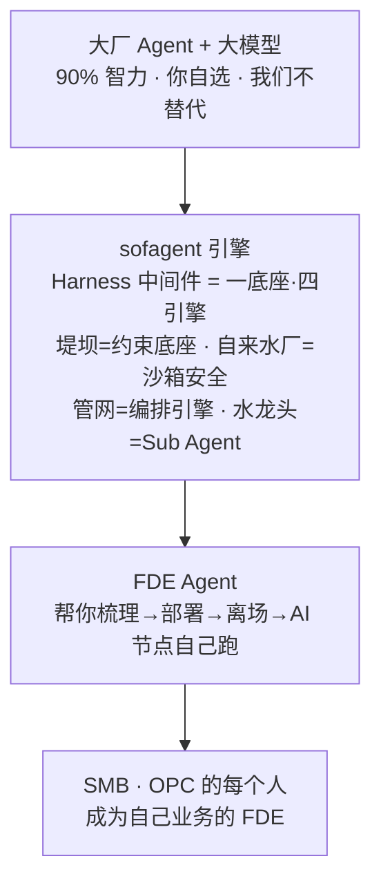
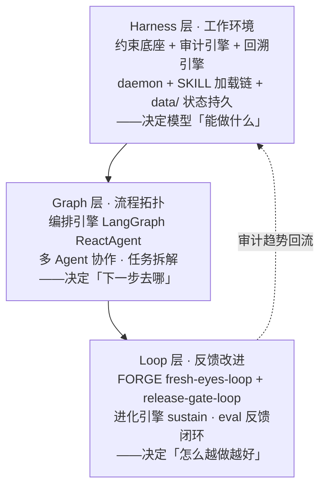
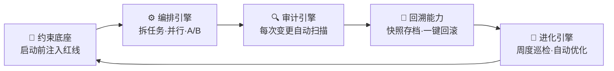
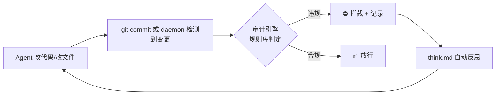
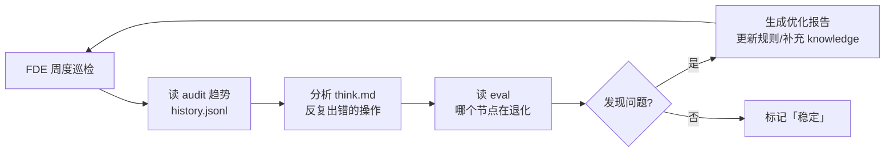

# sofagent Architecture

> 设计决策记录——从为什么存在、一底座·四引擎如何协作，到每个关键决策的工程理由。
> v1.2.3 · 2026-07-30（UTC）· 孔放勋


## 心智模型（先读这个）

> **sofagent 是一个 FDE Agent**（开源 MIT）——对外帮你进场梳理工作流、部署 AI 节点、离场后 7×24 自己跑。底层引擎是一套约束 Agent 行为的 Harness 中间件，一底座·四引擎（约束底座 + 编排/审计/回溯/进化引擎）保证每次变更可审计、可回滚、可进化。


### Agent 工程三层嵌套

一底座·四引擎不是并列关系——它们按「环境 → 流程 → 反馈」三层嵌套：



> **记忆法：环境、反馈、流程。** Harness 给 Agent 一个稳定的工作间（上下文/工具/权限/可观测性），Graph 告诉它任务流向哪（节点边界/路由条件/并行/汇合），Loop 让它出错后能基于证据自己改进（验证→反馈→修复→再验证）。三层缺一不可——再漂亮的 Graph 没有 Harness 就不可执行，再好的 Loop 没有 Graph 就不知道在哪个环节改进。

### 核心概念层次：Graph > Workflow > Loop > Goal

上面三层嵌套讲的是引擎视角（Harness / Graph / Loop）。换到**业务视角**，同样的概念体现为四个自外向内的嵌套层级：

| 层级 | 定义 | sofagent 对应 | 例子 |
|------|------|--------------|------|
| **Graph** | 企业全部业务节点和关联关系的全局拓扑 | FDE §5 本体模型（objects / relations / knowledge-domain） | objects.yml + relations |
| **Workflow** | Graph 上的一条完整业务链路——从输入到产出 | FDE §4 梳理出的工作流 | 采购审批流、财报生成流 |
| **Loop** | Workflow 中的一个闭环执行单元，由 Goal 驱动 | FORGE loop / AI 节点跑起来 | fresh-eyes-loop、release-gate-loop |
| **Goal** | Loop 的退出条件——达成即停，偏离即纠 | exit-gate 判定 | "所有 P0 修复完成" "审查全绿" |

**Workflow 由 Loop 节点和 Human 节点交替组成**（对应 FDE §6 三问判定法）：

- 🔄 **纯 Loop（自动执行）** — AI 跑完即退出，Goal 达成自动收工
- ⚡ **Loop + Human（强化岗位）** — AI 跑 Loop，Human 在关键环节介入（审批 / 检查 / 兜底）
- 👤 **纯 Human（暂不动）** — 当前不适合上 AI，保持人工

> **Human-in-the-loop 不是"loop 里面塞了人"，而是 workflow 里 loop 节点和 human 节点的协同编排。** 一个 workflow = 一条由不同类型节点串联而成的路径。

举例：采购审批流 = `[🔄 收集报价] → [⚡ 主管审批] → [🔄 生成合同] → [Human 签字]`

## 目录

- [术语对照](#术语对照)
- [一、核心理念与架构全景](#一核心理念与架构全景)
- [二、一底座·四引擎设计](#二一底座·四引擎设计)
- [三、部署与运行架构](#三部署与运行架构)
- [四、核心设计决策](#四核心设计决策)
- [能力与状态总览（v1.2.0）](#能力与状态总览v120)
- [五、已知局限与未来方向](#五已知局限与未来方向)
- [六、行业框架对齐](./ARCHITECTURE.md#六行业框架对齐研究如何印证-sofagent-架构2026-07-研读)

---

## 术语对照

| 引擎 | 英文 | 一句话 |
|------|------|------|
| 🧭 约束底座 | Constraint Base | 四层加载链，Agent 启动前注入红线 |
| 🔍 审计引擎 | Audit Engine | git diff + 文件变更硬证据审计（v1.1.0 拆独立包） |
| 🔄 回溯能力 | Restore Capability | 每次审计自动快照，`--revert` 一键回滚 |
| ⚙️ 编排引擎 | Orchestration Engine | 任务拆解 + Sub Agent 并行 + A/B 优化 |
| 🧬 进化引擎 | Evolution Engine | FDE 周度巡检 + 自动优化，v1.0.8+ |
| 加载链 | Load Chain | Agent 启动时注入的约束文件 |
| FDE | 一种能力（非岗位 title）——前线部署工程能力模型：掌握完整上下文、打破岗位边界、对结果负责 |
| Harness | Harness 中间层 | 挂在 Agent 之上的行为约束层（约束底座）：约束 + 审计 + 回溯 + 迭代 |
| Gateway | Gateway | 企业级 AI 统一入口（OpenClaw/WorkBuddy 等大厂平台），sofagent 不替代它 |
| Sub Agent | Sub Agent | 用 LangGraph createReactAgent 搭的专有执行节点 |
| Ontology | 本体模型 | 企业的业务世界模型，FDE 帮你搭建并持续维护 |
| River | FDE 交接清单 | FDE 离场时交接的产物集合：私有化评估 / Ontology 说明书 / 持续巡检配置 |
| SMB | 中小企业（Small & Medium Business） | 没有专职 AI 部署团队、想低成本具备 FDE 能力的企业 |
| OPC | 一人公司（One Person Company） | 个人或小团队，用自己的 Agent + 模型自主完成部署，不愿被单一厂商锁定 |

> 💬 **交互范式**：sofagent 没有图形界面。所有能力通过 MCP 协议暴露，用户通过 Agent 对话（LUI）操作——说一句话，它做完告诉你结果在哪。这是架构的根本设计约束：不存在「仅 CLI 可用」或「需要打开页面」的能力。详见 [设计哲学](./PHILOSOPHY.md)。

---

## 一、核心理念与架构全景

> 📖 **「为什么这么做」**见 [PHILOSOPHY](./PHILOSOPHY.md)。这里只讲架构设计——**怎么做的。**

sofagent 的架构基因来自 Geoffrey Huntley 的 Ralph 循环——「Agent 失忆，文件不失忆」。**不信任 Agent 自我报告，只看 git diff 硬证据。**

| 维度 | 通用 Agent 平台（OpenClaw/WorkBuddy） | sofagent |
|------|------|------|
| 管什么 | 「会不会做」——能力问题 | 「能不能每次都做对」——执行控制问题 |
| 关系 | Gateway 高速公路 | 交规 + 测速摄像头 + 驾校教练 |

> **90%/10% 价值分层**：AI 模型提供 90% 的智力输出（写代码、做分析、生成报告），但企业敢不敢让 Agent 自主执行，取决于最后 10%——**可靠性、可追溯性、可问责性**。sofagent 的价值不在那 90% 里（那是模型的事），在那 10% 里（约束底座的事）。模型越强，约束层越值钱——因为 Agent 能做更多事了，但"做错了怎么办"的代价也更大。

> 理论基础及行业验证见 [THANKS.md](./THANKS.md) 和 [PHILOSOPHY §四 信任模型](./PHILOSOPHY.md#四怎么管信任模型)。

### 治理架构（一底座·四引擎）



| 组件 | 设计原则 | 独立包 |
|------|------|:--:|
| 🧭 约束底座 | 四层加载链永远在线 | @sofagent/harness |
| 🔍 审计引擎 | 只看 git diff 硬证据 | @sofagent/audit |
| 🔄 回溯能力 | 事后快照 + `--revert` | @sofagent/core |
| ⚙️ 编排引擎 | StateGraph 四节点循环 + 任务拆解（v1.1.3+） | @sofagent/orchestrator |
| 🧬 进化引擎 | daemon cron @weekly | @sofagent/daemon + @sofagent/skillopt |

> 一底座·四引擎的完整设计哲学见 [PHILOSOPHY §三 架构全景](./PHILOSOPHY.md#三怎么跑架构全景)。

### 输出签名机制（v1.1.3）

Harness 中间件最大的挑战是存在感——引擎在正常工作，但用户看到好结果时不知道是 harness 层在起作用。v1.1.3 引入三层签名：

| 层级 | 机制 | 用户如何感知 |
|------|------|------------|
| 审计输出 | CLI / Webhook / MCP 所有返回值以 `[sofagent]` 开头 | 看到 `✅ sofagent 审计通过` 而非 `✅ PASS` |
| 能力清单 | `list_capabilities` description 标注引擎来源 | Agent 转述能力时附带"谁在做、怎么做的" |
| 审查报告 | FORGE 审查报告顶部签名段 | 报告第一行就是 `🔍 本报告由 sofagent 审计引擎 + 代码审查员 Agent 联合生成` |

签名不修改审计逻辑、不加速度开关——harness 层不允许关掉自己的存在感。

### 跨引擎关注点：持续感知层

签名解决的是"当下这一条结果是谁做的"。但 FDE 离场后，还有一个更长周期的问题：**客户 3-6 个月后是否还记得 FDE 部署了什么。**

这是 sofagent 的**持续感知层**——审计引擎产出证据，进化引擎生成报表，MCP 层负责推送。**FDE 的成功悖论是结构性的**：系统跑得越稳，客户感知越弱（详见 [FDE/FDE.md §13](../FDE/FDE.md)）。持续感知层是产品的必修课，不是营销策略。

> 📖 完整的感知衰减曲线 + 三层持续感知体系（定期价值证明 / 系统自曝复杂度 / 不可替代性标记）+ 配置方法见 [FDE §13 持续存在感机制](../FDE/FDE.md#13-竣工后持续存在感机制)。

### 地基与引擎

| 层 | 是什么 | 成本 |
|:--:|------|:--:|
| 地基 | 四层加载链（纯 MD 文件，Agent 读即生效） | ~3,500 token |
| 引擎 | 编排 + 审计 + 回溯能力 + 进化（含质量评估）+ 约束底座（daemon + CLI） | 按需启动 |

> v1.1.0 将审计引擎拆为独立 npm 包 `@sofagent/audit`，地基（约束底座）和其余引擎（编排/审计/进化）与回溯能力不受影响。

### 产品架构展望（五层）

| 层 | 部署在哪 | 干什么 | 状态 |
|:--:|------|------|:--:|
| **Harness 层** | Agent 上下文 | 纯 MD 文件，Agent 读即生效 | ✅ |
| **执行层** | 用户设备 | daemon 常驻进程——跨 session 经验不丢失 | ✅ |
| **审计层** | git 仓库 + 文件系统 | sofagent-audit——提交时审计 + 文件变更审计 | ✅ |
| **MCP 推送层** | 设备 MCP server | @sofagent/mcp 独立包 | ✅ |
| **协同层** | 多设备 + 云端 | Agent 独立身份、共享上下文、组织记忆 | v2.x |

> 📖 MCP resource 完整列表与 push target 配置见 [MCP 使用指南](./guides/mcp-usage.md)。

---

## 二、一底座·四引擎设计

### 🧭 约束底座

四层加载链（SKILL.md → fde.md → think.md → knowledge/）在 Agent 启动时自动注入。每层有不同权限：

| 层 | 文件 | 权限 | 加载时机 |
|:--:|------|:--:|------|
| 1 宪法 | SKILL.md | ❌ 不可修改 | 最先加载（开头注意力最高） |
| 2 规范 | fde.md | ✅ 可改 | 企业专属规则 |
| 3 反思 | think.md | ⚠️ 自动生成 | 上轮踩过的坑 |
| 4 知识 | knowledge/ | ✅ 积累 | 自动关联的 best practice |

OpenClaw 通过 Hook 精确注入，其他平台 Agent 主动 Read，v1.0.7+ Sub Agent 启动时自加载（`buildConstrainedSystemPrompt`）。

> **v1.1.8 加载链扩展**：联邦知识注入于 knowledge/ 层（加载链第 4 层，位于 think.md 第 3 层之后；目录 `knowledge/federation/`，daemon 联邦查询落盘的 peer 知识快照）——低于 SKILL.md 宪法层。联邦内容是外部来源，强制 `<untrusted source="federation">` 包裹（Prompt 注入防线层 1，详见 SECURITY.md 8 层映射表）。

### 权限四原则与零凭证沙箱（2026-07 行业参考 blog 研读）

行业参考将 Agent 权限治理归纳为四条可操作原则，与 sofagent 审计引擎 + 约束底座同构：

1. **最小权限**：每个 Agent 只拿当前任务必需的最小凭证集，不预置全量权限。
2. **群维度隔离**：按组织 / 项目 / 环境维度隔离权限域，跨域调用需显式授权。
3. **不可越权**：硬约束层（审计引擎）兜底，越权动作在 Action 边界被拦截，AI 绕不过。
4. **可热更新**：权限策略运行时可改、即时生效，不重启 Agent。

**零凭证沙箱**：运行时上下文不落明文密钥——凭证由守护进程注入、用毕即销，Agent 全程只见句柄不见明文（对齐 A2 不泄密钥铁律）。

**最坏情况反问**（权限模型必答题）：「如果这个 Agent 被 Prompt 注入了，最坏情况是什么？」答案应是它 profile 内那些权限能做的事，而非整个系统沦陷——权限不是限制 Agent，是保护组织。

**动态治理三机制**（行业参考内部实践口径，待核验）：
- 动态提权：任务触发、限时授权、到期自动回收（临时审批申请 → 批准 → 约 2 小时后过期，待核验）。
- 熔断拦截：高危操作实时拦截、等待人类确认。
- 红线制度：超阈值动作（如合同金额 > 10 万，待核验）须 VP 签字等边际审批。

> 📖 来源：行业参考 blog《权限四原则》《零凭证沙箱》（2026，具体 URL 待核验）/ 行业参考 blog/公众号 2026-07-27《Agent 进入企业，还差一个工位》

### 联邦查询（v1.1.8）

两台配对设备经 OpenClaw channel 互相查 knowledge/。纵深防御四层：MCP localhost 绑定 → OpenClaw channel 路由 → **AES-256-GCM 应用加密**（审计结论：OpenClaw 本地回环 ws:// 明文无 TLS，第 3 层是唯一保密防线）→ sensitivity frontmatter 过滤。

| 模块 | 落点 | 职责 |
|------|------|------|
| 安全层 | `core/src/crypto/` | AES-256-GCM（IV 12 字节随机不复用 + tag 校验）· ECDH(prime256v1)+HKDF 派生 32 字节 key（只存内存）· 24h 密钥轮换（旧 key 只解不加）· 三条配对路径（6 位码 + y/N / `SOFAGENT_FEDERATION_TOKEN` token / federation.json HMAC .sig 验签） |
| 传输层 | `daemon/src/federation/channel.ts` | OpenClaw channel 抽象（依赖倒置，测试内存 channel）；只搬运密文帧（iv‖tag‖ciphertext） |
| 查询路由 | `daemon/src/federation/query-router.ts` | 并发 fetch + 单 peer 5s 超时按离线 + sensitivity 本地端二次校验（restricted 不接收；篡改标签降权 trust=web + 审计 WARN） |
| 合并 | `daemon/src/federation/merge.ts` | `automerge@1.0.1-preview.7`（MIT）CRDT 合并（clone-fork 共享版本史收敛）；裁决：trust 优先于 mtime；排序 trust 降 → mtime 降 |
| 离线降级 | `daemon/src/federation/offline-fallback.ts` | 任一 peer 离线跳过不阻塞；全部离线/整块失败退化纯本地查；审计 `federation_query{peers, merged, onlinePeers}` |
| 注入点 | `mcp/src/mcp-server.ts` · `harness/src/index.ts` | search_knowledge 异步联邦合并（best-effort）；harness 加载链第 3 层（`<untrusted>` 包裹） |

### 审计引擎

核心设计决策：**审计必须外置。** Anthropic 发现 Claude 内部存在 J-space——AI 自己知道控制不住自己。所以不信任 Agent 自我报告，只看 git diff 硬证据。



**证据分层**：git diff = 硬证据（不可绕过），Agent 日志 = 软证据（可伪造）。`--silent` 模式只跑纯 git-diff 规则，零依赖 Agent 配合。

> [Anthropic《When AI builds itself》](https://www.anthropic.com/institute/recursive-self-improvement)（2026-06）：工程师代码产出达 2024 年 8 倍后，人工代码审查成为新堵点。sofagent 的审计引擎把审查外置到 git diff 自动化——正是解这个瓶颈的方向。

**行业印证**：Palantir AIP 靠 Ontology 实现 Agent 可靠性——「根本接触不到 > 被告知不能说」与 sofagent 的 A15 约束验证 + 审计外置遵循同一原则（不依赖 Agent 自我报告，只看 git diff 硬证据）。

**Palantir 操作型本体论 ↔ sofagent 三层映射**：Palantir 的核心命题「语义必须与动力学配对」——本体不能只是知识库，必须是能干预世界的操作系统——与 sofagent 的 Ledger-Views-Policy 高度同构：数据集成 = Ledger 层（think.md append-only + audit history）、逻辑层 = Views 层（knowledge/ entities/concepts/comparisons/summaries）、操作层 = Policy 层（fde.md + SKILL.md）、读写回路 = Dream Cycle（v1.1.7 规划）、OAG 语义锚定 = Harness 约束底座。**核心差异**：Palantir 是集中式 SaaS 闭源操作系统，sofagent 是分布式 MIT 开源 Harness 中间件——让 Agent 自建本体，不由中央统一定义。

**「确定性与概率性分离」原则**——Palantir OAG 五层架构的核心理念，与 sofagent 审计引擎完全同构：刚性安全边界由确定性系统保障，不受 LLM 概率性输出影响。sofagent 的 16/21 条规则为纯 git-diff（不依赖 Agent 配合）正是这一原则的工程实现。

> 💡 **规则编号说明**：A1–A11 + A18/A19 为默认规则（13 条），A14–A17 + E1–E4 为扩展规则（8 条，需 opt-in），全量 21 条。A12/A13 已在 v0.99.4 合并入 A11，编号不再使用。

**审计引擎的双重定位**：

| 层级 | 做什么 | 行业对标 |
|------|--------|---------|
| 工程层 | 约束行为 + 变更审计 + 责任归属 | 事后护栏——每次变更都可追溯 |
| 叙事层 | Agent 责任确权底座 | **轻量级 KYA（Know Your Agent）**——Agent 的每一次行动都有加密签名凭证 + 不可伪造的硬证据链 |

在 agent-wrapping-agent 多层嵌套的架构趋势下（a16z 2026 研判），审计引擎不仅是「事后护栏」——它是 Agent 嵌套体系中的**一等架构评估层**：外层 Agent 在运行期评估子 Agent 的方法论质量（评估层定位，非运行时实时拦截；实时拦截治理仅限 v1.3.0 自派 SubAgent 沙箱），层层筛选合成高价值结论。审计引擎是这个评估层的基础设施。

> a16z 研判：智能体经济瓶颈从「智力」转向「身份」——非人类身份:人类 = 96:1，急需 KYA。审计引擎 + 约束底座 = 企业内部轻量版 KYA。v1.2.x 评估引入签名凭证做 Agent 行动的可审计绑定（身份层，**对所有 Agent 适用**）；凭证虚拟 key 中介（host 边界注入真凭证）在 v1.3.0 **仅限自派 SubAgent 沙箱**。

**审计引擎的三重身份**：Code Review 体系化实践中，Review / Verification / Gate 是三个独立环节——sofagent 的审计引擎同时承担三者：

| 环节 | 属性 | sofagent 对应 |
|------|------|--------------|
| Review（静态分析） | 模型读代码判断逻辑合理性，概率性 | A3/A4/A5/A7 等需理解意图的规则 |
| Verification（规则校验） | 固定校验流程，确定性 100% 可复现 | A1/A2/A9/A10 等纯 pattern 匹配规则 |
| Gate（决策管控） | 基于 Review+Verification 结果判断能否合并 | exit code 0/1/2 → 放行/WARN/阻断 commit |

> **设计原则**：Review Agent 默认不配代码执行权限——纯静态分析避免执行逻辑干扰审查客观性。sofagent 审计引擎同样零执行权限，只看 git diff 硬证据。

### 🔄 回溯能力（本质：git snapshot + revert 包装）

行车记录仪，不是安检——事后快照，不依赖任何平台：

| 结果 | 自动动作 | 用户看到什么 |
|------|---------|------------|
| ✅ PASS | 自动快照存档 | 静默 |
| ⚠️ WARN | 存档 + 标记 | daemon-health.json 告警 |
| ❌ FAIL | 存档 + 建议回滚 | Webhook + 终端标红 |

```bash
sofagent-audit --timeline     # 快照时间线
sofagent-audit --revert SHA   # 回滚到任意快照
```

daemon 自动清理 30 天前旧快照。Webhook 配置在 `.sofagent/config.yml`。

### ⚙️ 编排引擎

大任务拆小、多 Sub Agent 并行、A/B 对比找更优方案。基于 LangGraph createReactAgent，`sofagent-orchestrator compose --task` CLI 入口——任何 Agent 平台都能用。

**为什么是 Skill + 脚本 + Runtime**：
| 什么事 | 谁来做 | 为什么 |
|------|------|------|
| 判断（评分、反思、选模板） | Skill（MD prompt） | LLM 长项——模式识别 |
| 机械操作（文件读写、API） | 脚本（bash） | 确定性操作 |
| 硬安全（加载链、断路器） | Runtime（OpenClaw） | Agent 失控时没法自己管自己 |

**编排收敛条件**：目标必须可验证（有量化标准）+ 模型可自主判断。Maker-Checker 分离是收敛前提——同一 Agent 自验覆盖仅 7-33%，分离为独立审查后提升至 73%。

> 💡 **Loop 和 Graph 不是替代关系**
>
> 行业从 Loop Engineering 热到 Graph Engineering，但 Loop 没有被淘汰——**Loop 是带回边的 Graph**，复杂 Graph 内部嵌套大量局部 Loop。sofagent 的 fresh-eyes-loop（A/B 双盲审查 5 步循环）就是一个 Loop，它未来会成为 v1.3.1 控制图里的一个子图节点。演进路径是"Loop 跑通一个 → 编排进 Graph"，不是"丢掉 Loop 换成 Graph"。
>
> Graph 的价值在于把**不可合并的独立角色 + 交接点**直接写进系统里——实现→测试→独立审查、合规审批强制节点、多来源并行检索后合并冲突。sofagent 的审计引擎（21 条规则，其中 16 条纯确定性 git-diff，其余需 LLM 语义判断）= "必须走固定流程"；编排引擎（createReactAgent）= "让模型自由判断"——这正是 Graph Engineering 真正的工程难点：**控制权分配**。

> 💡 **「翻译官不应该有决策权」——智能与控制分离**
>
> 受控智能体引擎的实践验证了一个核心判断：**模型负责理解，不负责执行。** LLM 的不可替代价值是把模糊的自然语言翻译成结构化意图（意图识别、参数提取、歧义消解）；但写操作的确认、权限校验、状态流转——所有需要确定性的控制——必须握在系统代码手里，不交给概率性的模型。你永远无法 100% 确定模型不会在某个奇怪的上下文里，把一句模棱两可的话判定为"用户确认了"。
>
> 这正是 sofagent 审计引擎的设计逻辑：21 条规则中 16 条是纯 git-diff（零 token、不调 LLM、100% 确定性），不是因为模型不够聪明，而是因为**确认这件事，必须由系统代码硬判断**——"是就是，不是就不是"，没有概率空间。模型产出意图（工程师 Agent 写代码），系统决定能不能放行（审计引擎跑规则）——这就是"智能属于模型，控制属于系统"在 sofagent 的工程落地。
>
> 📖 来源：受控智能体引擎设计实践（2026-07）·「智能属于模型，控制属于系统」

**工具集设计约束**：每个 Sub Agent 的工具集应零重叠、无歧义——工具功能描述不能模糊交叉。当工具数上百时，瓶颈不在模型推理而在工具描述歧义。v1.1.0 daemon 工具注册将做静态重叠检测。

**为什么多 Agent 协作 > 单强模型**：来自 Apple Dex RSI 训练团队的一手观察——基于 self-attention 架构的固有局限，单模型处理超长上下文有不可逾越的上限。多 Agent 协作（分治验证 + 多路径冗余 + 记忆机制）效果远超单强模型。核心推论：**工程化能力具备独立于模型基础能力的结构性壁垒**，不会被通用模型迭代轻易覆盖。sofagent 的编排引擎（Sub Agent 分治 + Maker-Checker 分离）正是这个理论的产品化落地。

**解题/验证分离**：RSI 研究表明，同一 Agent 自验覆盖率仅 7-33%，分离为独立验证后提升至 73%。这与审计引擎的"不信任 Agent 自我报告"原则同构——解题 Agent 和验证 Agent 必须物理隔离，验证是核心基因，需分领域（代码用单测、数学用形式化证明、非标准领域用多 Agent 协作）。

> 💡 **Agent 粒度判定（X4）**：单请求内被调 >3 次的 Agent 合并到上游；日均调用 <5 次的 Agent 标记僵尸预警——防纳米 Agent 膨胀。
>
> 📖 [行业笔记]

#### 四节点状态机（v1.1.3+）

编排引擎的核心是 LangGraph StateGraph——一条 `engineer → audit → reviewer → human_confirm` 的流水线，跑挂了能回退重试，中断了能从断点续跑。


**三态终态**：`completed`（人工确认通过）/ `blocked`（重试 3 次仍不过）/ `aborted`（stdin 关闭等中断，checkpoint 已保存可 `loop --resume` 恢复）。

**三个条件路由函数**（纯函数，可单测）：

| 路由 | 判定 | 出口 |
|------|------|------|
| `routeAfterAudit` | blocked→END；FAIL→engineer；PASS/WARN→reviewer | engineer / reviewer / END |
| `routeAfterHuman` | 非 running→END；running（驳回）→engineer | engineer / END |
| `routeFromStart` | 正常→engineer；resume→指定节点 | 四节点之一 |

**为什么 audit 是程序不是 AI**：audit 节点调 `@sofagent/audit` 跑 A1-A11、A14-A19 + E1-E4（共 21 条）规则——只看 `git diff HEAD` 硬证据，标准是硬的、可复现的，不随模型波动。reviewer 才是 AI 语义审查。这正是上文"解题/验证分离"在编排层的产品化落地——audit 做确定性验证，reviewer 做概率性语义验证，两者物理隔离。

#### 状态契约：LoopArtifacts

节点之间不靠全局变量，全靠 `state.artifacts` 这个对象传递。LangGraph 的 `Annotation` 给它配了浅合并 reducer——节点返回时只需给增量字段，框架自动合并。

| 字段 | 类型 | 谁写 | 谁读 |
|------|------|------|------|
| `task` | string | 初始化 | 全部节点 |
| `engineerOutput` | string | engineer | audit / reviewer |
| `engineerOutputs` | string[] | engineer（追加） | 历史追溯 |
| `auditReport` | string | audit | reviewer / engineer 修复 |
| `auditReports` | string[] | audit（追加） | 历史追溯 |
| `reviewReport` | string | reviewer | human_confirm / engineer 修复 |
| `reviewReports` | string[] | reviewer（追加） | 历史追溯 |
| `humanFeedback` | string | human_confirm | 路由判定 |

> 这张表对应的源码是 `engine/orchestrator/src/loop/state.ts` 的 `LoopArtifacts` 接口。

#### Graph Engineering 视角（控制图 = StateGraph）

> 📐 2026-07 行业新概念「Graph Engineering」把 Prompt→Context→Harness→Loop→**Graph** 的演进框定为五层工程化方法。核心判断：「先做扎实前四层再上 Graph，跳过前四层直接上图会组织混乱」。sofagent 前四层已扎实（v1.2.0 完成），**Graph 层是自然进化而非跳步。** Carlos E. Perez（[From Loop Engineering to Graph Engineering?](https://engineering.zooz.com/intuitionmachine/from-loop-engineering-to-graph-engineering-d3ebeb08511c)）系统论证了四类失效与拓扑解法，并指出真正的分界线不在 Loop vs Graph，而在是否显式化了 grounding。理论根 = FSM/Statecharts（Harel 1987）。

sofagent 的编排引擎天然就是一张**控制图（Control Graph）**——不必新造能力，只需用这套精确词汇重新表述已有实现：

| Graph Engineering 构件 | sofagent 对应实现 | 源码位置 |
|------|------|------|
| **控制图 Control Graph**（node=state, edge=transition, guard edge 守门） | `StateGraph` 四节点 `START→engineer→audit→reviewer→human_confirm→END`，`routeAfterAudit`/`routeAfterHuman` 条件路由，WARN 透传为 guard 放行 | `engine/orchestrator/src/loop/graph.ts` |
| **★Reality Anchor**（无锚点 = 披 PM 外衣的幻觉） | `audit` 节点——只看 `git diff HEAD` 硬证据（A1-A11、A14-A19 + E1-E4，共 21 条），不信任 Agent 自报，比"只看 PR 号"更硬。**Grounding 三必要条件**（Carlos E. Perez）：① audit 规则不可篡改 = ground-truth ② `acceptance-test.sh` = 冻结验收标准 ③ 用户 task 来自系统外部 | `@sofagent/audit` |
| **可审计状态文件**（状态落盘可复核） | `FileCheckpointer` 每节点前后 snapshot 到 `.sofagent/checkpoint/`，`resumeLoopGraph()` 断点续跑 | `engine/orchestrator/src/graph/checkpoint.ts` |
| **数据图 Data Graph**（知识图谱/血缘） | 蓄水池（知识库 `knowledge/`） + 市政规划（Ontology，Ledger-Views-Policy）——与编排控制图正交 | `knowledge/` + Ontology 层 |
| **Org Graph（稳定角色）** | 四节点（engineer/audit/reviewer/human_confirm）是稳定角色——不随任务变化；变动的是节点内的 Work Graph 子拓扑 | `engine/orchestrator/src/loop/graph.ts:128-132` |
| **Work Graph（临时拓扑）** | 每个任务的子任务拆分 + 并行 engineer 实例 = 任务结束即解散的工作图；v1.2.3 Planner 节点落地后显式生成 | 规划中（v1.2.2+） |

**控制图 vs 数据图二分天然具备**：管网（Workflow / StateGraph）= 控制图，决定"先干什么后干什么"；蓄水池 + 市政规划 = 数据图，承载"知道什么、怎么理解"。两者解耦——控制图无知识库也能跑（纯编排），数据图无控制图也能沉淀（Dream Cycle 独立跑）。

**Org Graph vs Work Graph 双图模型**（行业前沿框架）：Org Graph = 长期稳定的角色节点（engineer/audit/reviewer/human_confirm），变动慢，像公司组织架构；Work Graph = 为当前任务动态拼装的协作拓扑（子任务 engineer 实例 + 并行扇出），任务结束即解散。两者分离——长期能力与短期任务解耦，避免每次任务都重建整套组织。

**Org Graph 节点六要素**（每节点定义：职责 / 输入契约 / 输出契约 / 工具权限 / 状态范围 / 退出条件）：

| 节点 | 职责 | 输入 | 输出 | 工具权限 | 退出条件 |
|------|------|------|------|---------|---------|
| **engineer** | 写代码/改文件 | `artifacts.task` + `reviewReport` | `engineerOutput` | write/edit/run_bash | audit PASS→next；FAIL→retry；retry≥3→blocked |
| **audit** | git diff 硬证据审计 | `engineerOutput` | `auditReport` + `auditResult` | 只读 git diff | 规则跑完→next |
| **reviewer** | AI 语义审查 | `auditReport` + `engineerOutput` | `reviewReport` | 只读上下文 | 审查完成→human_confirm |
| **human_confirm** | HITL 人工确认 | `reviewReport` + 全量上下文 | `humanFeedback` | 人工决策 | 确认→END；驳回→engineer |

**Work Graph 示例**（行业调研任务，v1.2.3 Planner 落地后自动生成）：

```
START → plan（拆解："调研 AI 笔记产品"）
     → engineer-search（并行：竞品 A）
     → engineer-search（并行：竞品 B）
     → engineer-search（并行：竞品 C）
     → merge（合并结果）
     → engineer-analyze（功能/价格/评价）
     → audit（审计引用来源）
     → reviewer（审查分析质量）
     → human_confirm
```

**单闭环四类失效 → sofagent 解法**（Carlos E. Perez）：① Goodhart 目标漂移→audit 用 git diff 不信自报；② 参照盲→audit 规则硬编码不随模型波动；③ 耦合冲突→Maker-Checker 职责硬分离；④ 测量退化→指标来自事实层非主观报告。

**五类边契约**（行业共识）：当前实现仅有 **数据流**（`artifacts` 传递）和 **控制流**（`routeAfterAudit`/`routeAfterHuman`）——**缺权限流、证据流、失败流**。v1.2.5 将形式化全部五类边。

**可学习的未来迭代（落盘见 [ROADMAP](../ROADMAP.md)「v1.2.x Graph Engine 进化路线」）**：① **Planner 节点**——任务分解（v1.2.3）；② **降级路由链**——retry→降级→标记→人工（v1.2.2）；③ **engineer-decide/execute 分层**——LLM 层 + 代码层（v1.2.2）；④ **并行子图执行**——worktree 隔离 + 多 engineer 并发（v1.2.3）；⑤ **Dashboard React Flow 控制图**——Org Graph + Work Graph 同屏 + 边类型标注（v1.2.3）；⑥ **多类型 Checker**——format/fact/source-validator（v1.2.4）；⑦ **受控循环升级**——补信息→重规划 + 降级通过（v1.2.4）；⑧ **五类边契约形式化** + Anchor 配置（v1.2.5）；⑨ 控制图多循环 DAG 波次并行（v1.3.0）。

#### 重试语义：统一计数器

`retryCount` 一个计数器管两种失败——audit 判 FAIL 或 HITL 驳回，都 `retryCount++` 回 engineer。达到上限（默认 3）仍未过 → `finalStatus = 'blocked'` 终态 + 写 audit history（engine 字段标 `loop-graph`），不无限循环。blocked 可被 `audit-root-cause` / 周报追溯。

WARN 不阻断流转——`[审计告警]` 前缀透传给 reviewer 输入，由 reviewer + human_confirm 兜底把关。

#### Checkpoint 持久化

每个节点执行**前后各 snapshot 一次**到 `.sofagent/checkpoint/`。`resumeLoopGraph()` 读 latest checkpoint → 算出恢复入口节点 → 重新跑图。daemon 重启后的自动续跑也复用这条路径。

**FileCheckpointer 五条并发安全规矩**（`engine/orchestrator/src/graph/checkpoint.ts`）：

| # | 规矩 | 实现 |
|---|------|------|
| 1 | 文件名永不覆盖 | `checkpoint-{ISO时间戳}-{6位随机}.json`（时间戳 `:`/`.` 替换为 `-`，Windows 兼容） |
| 2 | latest 指针 | symlink 指向最新（Windows 无权限时降级为指针文件，读取端两种都兼容） |
| 3 | schema 版本 | JSON 第一字段 `schemaVersion: 'v1'`，未来变化走 `migrateCheckpoint()` 显式迁移，不静默丢字段 |
| 4 | 原子写 | `writeFileSync(tmp) + renameSync(final)`，跨设备 EXDEV 时降级 copy+unlink |
| 5 | 文件锁 | `O_EXCL` 排它创建 `locks/{checkpointId}.lock`，30s stale 检测回收，防多进程并发写脏 |

#### audit 节点降级逻辑

audit 节点程序化调用 `@sofagent/audit`（比 CLI 子进程侵入更小，类型安全）。审计引擎不可用时（如 git 环境缺失）**降级 WARN 而非 FAIL**——不直接烧穿重试次数，由 reviewer + human_confirm 兜底。降级时 audit history 的 engine 字段标 `loop-graph-degraded` 便于追溯。`git diff HEAD` 为空时也返回 WARN（engineer 可能未产生文件修改）。

### 🧬 进化引擎

FDE 部署完成后转为**持续优化角色**。daemon cron @weekly 自动巡检审计趋势 + 反思记录，发现退化就优化。



### 运行时数据层：引擎间数据流全景

四个引擎运行时共同往 `data/` 目录读写数据。以下是生产者→数据文件→消费者的完整单向数据流（v1.2.1 补全 eval + ab-test 后的全景）：

```
                        写入侧（生产者）                          data/ 目录                          读取侧（消费者）
┌─────────────────────────────────────────┐  ┌──────────────────────┐  ┌─────────────────────────────────────┐
│ @sofagent/audit（审计引擎）               │  │ audit/               │  │ @sofagent/daemon（巡检器）            │
│   每次 commit/变更 → runRules()          │→ │   history.jsonl      │→ │   warn-accumulator（WARN 聚合）      │
│   会话结束 → buildSessionReport()        │→ │   session-report.json│→ │   audit-history-analyzer（趋势）     │
│                                          │→ │   session-report.md  │→ │   qa-verify-warn-accumulator         │
├─────────────────────────────────────────┤  ├──────────────────────┤  ├─────────────────────────────────────┤
│ @sofagent/think（反思生成器）              │  │ think.md             │  │ @sofagent/harness（加载链第3层）      │
│   generateThinkEntry() 基于 diff+审计结果 │→ │   （append-only）      │→ │   buildConstrainedSystemPrompt()     │
│                                          │→ │                      │→ │ @sofagent/daemon（dream-cycle）       │
│                                          │→ │                      │→ │   extract-facts() → knowledge/       │
├─────────────────────────────────────────┤  ├──────────────────────┤  ├─────────────────────────────────────┤
│ @sofagent/eval（评分引擎）⭐ v1.2.1 补全   │  │ eval/ ⭐              │  │ @sofagent/think（进化引擎）⭐ 接通    │
│   runEval() 跑 golden set                │→ │   history.jsonl      │→ │   检测 passRate 下降→写 think.md      │
│   eval-reporter 持久化                    │→ │   reports/*.md       │→ │ Dashboard（v1.2.3）质量趋势面板       │
├─────────────────────────────────────────┤  ├──────────────────────┤  ├─────────────────────────────────────┤
│ @sofagent/ab-test（A/B 框架）⭐ v1.2.1   │  │ ab-test/ ⭐           │  │ @sofagent/orchestrator（ab-scheduler）│
│   runABTest() 对比方案                     │→ │   history.jsonl      │→ │   aggregateRecent() 方案判定          │
│                                          │→ │   reports/*.md       │→ │ Dashboard（v1.2.3）A/B 对比面板       │
├─────────────────────────────────────────┤  ├──────────────────────┤  ├─────────────────────────────────────┤
│ @sofagent/daemon（守护进程）              │  │ dashboard/           │  │ Dashboard（v1.2.3）                  │
│   health-reporter → runHealthReport()    │→ │   daemon-health.json │→ │   健康面板                            │
│   dream-cycle → extract/synthesize       │→ ├──────────────────────┤  │ @sofagent/harness（加载链第4层）      │
│                                          │→ │ knowledge/           │→ │   buildConstrainedSystemPrompt()     │
├─────────────────────────────────────────┤  ├──────────────────────┤  ├─────────────────────────────────────┤
│ FORGE driver                             │  │ forge-runs/          │  │ verdict.md（人类读）                  │
│   fresh-eyes / release-gate              │→ │   <loop>/<date>/run/ │→ │                                     │
└─────────────────────────────────────────┘  └──────────────────────┘  └─────────────────────────────────────┘
```

**数据流铁律**：
- ✅ 生产者 → data/ → 消费者：合法（单向派生）
- ✅ Ledger → Views：合法（Dream Cycle 从 think.md 派生 knowledge/）
- ❌ Views → Ledger：禁止反向写回（代码级强制）
- ❌ 任何层 → 历史条目覆写：禁止（append-only 不变量）

> 📖 此图的 v1.2.1 原始出处及交付细节见 [changelog v1.2.1 §P0b](./changelog/v1.2/v1.2.1.md)。

---

## 三、部署与运行架构

<a id="dual-node-architecture"></a>

### 双节点架构

sofagent 支持两种节点类型：

| 维度 | 自动运行节点 | 个人增强节点 |
|------|------|------|
| **场景** | 企业无人值守设备 | 个人开发者（WorkBuddy/Codex 等） |
| **OpenClaw** | ✅ 必须 | ❌ 不需要 |
| **编排调用** | OpenClaw 内部 API | `sofagent-orchestrator compose --task` CLI |
| **约束注入** | OpenClaw Hook 精确注入 | Sub Agent 自加载（`buildConstrainedSystemPrompt`） |

> Sub Agent 约束自加载：启动时读 `.sofagent/` 下的约束文件，拼装为 system prompt。纯文件系统操作，不依赖任何 Agent 平台的 Skill 系统。换平台约束不丢。

### River — Workflow — Subagent 三层架构

**River = 多个 Workflow 的集合**——每段 Workflow 把模型能力（水）引到业务侧，汇入同一条大河（River），从头到尾同一个身份、同一段上下文。

Work模板市场 的实现规范已随 v1.1.9 迁至商业产品 `商业仓库/模板市场/`（混合架构：外层 `workflow.yml` Graph 骨架锁步骤 + 内层 ReAct 节点）。

```
用户 → River（统一入口）→ Workflow A/B/C（分发）→ Subagent（执行）
              ↑ 回流                                    ↑ 审计引擎
```

| 层 | 是什么 | 类比 |
|------|------|------|
| **River** | 统一 Agent 入口 | 大河——只有一个入口 |
| **Workflow** | 任务编排方案 | 把水引到业务侧 |
| **Subagent** | 执行具体能力的 Agent | 水龙头 / 用水设备——让水真正作用 |

River 的载体是 OpenClaw + sofagent + Channel 集成。sofagent 不做 River 本身（河是大厂造的——LLM 是水，Agent 平台是河床），而是做河的约束层（约束 + 安全 + 编排 + 执行），确保 River 里的每一个 Sub Agent 都有纪律、可追溯、会反思。

> 🏞️ **River 比喻完整映射**见 [README（项目概览）](../README.md)——sofagent 做堤坝 + 自来水厂 + 管网 + 水龙头，不做河本身。

> **Workflow 的混合架构**：每条 Workflow 采用「外层 Graph 骨架 + 内层 ReAct 节点」——`workflow.yml` 的 `nextNodes` 锁定全链路步骤、保证可追溯（对应行业笔记中的「Graph 实现全局流程骨架」），单个节点的 `prompt` 保留模型自主规划能力（对应「内层 ReAct Agent」）。这一设计兼顾全局稳定性与局部灵活性：低容错业务靠 Graph 锁死流程，复杂节点靠 ReAct 保灵活。实现规范已随 v1.1.9 迁至商业产品 `商业仓库/模板市场/`。

#### MCP 触发完整链路（v1.1.8+）

> 这一节回答一个具体问题：**企业员工在钉钉/飞书/企微里 @ 一个 tag，sofagent 怎么接住这个请求并跑完 Workflow？**

大厂入口 Agent（River 载体）通过 MCP 协议调用 sofagent。`sofagent_compose` 这个 MCP tool **已存在**（v1.1.0 起），v1.1.8 补上 `--run` 真正执行 + `--enterprise-workflow` 接收 FDE workflow 参考后，链路完整：

```
① 用户在钉钉 @sofagent-tag "帮我实现用户注册模块"
     ↓ 钉钉 AI（LLM：Opus / GPT / 智谱 / DeepSeek 均可）识别意图
② LLM 调用 MCP tool: sofagent_compose
     参数：
       task: "实现用户注册模块"
       enterprise_workflow: "fde梳理的认证流程.yaml"  ← v1.1.8 T02 新增
       run: true                                     ← v1.1.8 T03 新增
③ sofagent compose 基于企业 workflow 拆解任务
     → 输出编排方案 YAML + 结构化 SubAgent[] 配置
     → 每个 SubAgent 注入四层约束加载链（buildConstrainedSystemPrompt）
④ dag-runner 调 LangGraph createReactAgent 真正调度（v1.2.0 前为 createDeepAgent（deepagents），已弃用）
     → 主 Agent 自主决定何时委派给哪个 Sub Agent（串行 / 同步并行）
⑤ Sub Agent 执行（带企业专有 Harness 约束）
     → 审计引擎在每个节点卡关（git diff 硬证据）
⑥ 审计通过 → human_confirm → 结果回传给 LLM
⑦ LLM 把结果翻译成自然语言返回给用户
```

**关键差异化**：大厂入口 Agent 做通用调度（什么都能干，但什么都不精），sofagent 做 **Workflow 专项**——FDE 帮企业梳理好的 workflow 做约束，Sub Agent 只做这一个专项任务，比入口 Agent 的通用调度更可控。这就是「专项 Harness > 通用 Agent」的价值，也是 sofagent 不与大厂 Agent 竞争而是做补充层的定位体现。

**前提条件**：大厂入口 Agent 需支持 MCP 协议。目前 Coze / Dify / WorkBuddy 已支持，钉钉/飞书/企微的 AI 助手在跟进 MCP 标准。

**与 扣子（Coze，字节跳动） 在 Slack @tag 的区别**：扣子（Coze，字节跳动） 把 Agent 嵌入协同平台（Agent 还是通用 Agent），sofagent 把**约束过的专项 Workflow** 嵌入协同平台（Agent 行为被 Harness 限制在企业业务流程边界内）。

### Agent 基础设施层（v1.0.8+）

两个内置 Agent 被所有 workflow 节点引用：

| Agent | 管什么 | 触发时机 |
|------|------|------|
| **合规审计员** `@sofagent-audit` | 管底线——P0/P1 分级 | 每次 commit / FDE 部署 / FORGE 闭环 |
| **FDE 部署工程师** `@sofagent-fde` | 管上限——deploy/sustain | 部署时 / daemon cron @weekly |

Agent 定义在 `SKILL/agents/{name}/SKILL.md`，`parseSkillMd()` 读 front matter 作为身份标签，body 注入 createReactAgent 作为 role prompt。

### OpenClaw 在架构中的角色

**审计层不需要 OpenClaw**——sofagent-audit 是独立 TypeScript CLI，输入 git diff，输出 exit code。即使不装 OpenClaw，开发者也可通过 `bash install.sh`（推荐）或 `npm install -g @sofagent/audit`（高级/开发者路径）配 commit-msg hook，让任何 Agent 平台的提交经过审计。

**编排层当前走 LangGraph createReactAgent**——`compose --task` CLI 入口，任何 Agent 平台都能用。迁移路径：ao（AutoGen）→ DeepAgents（v1.0.7）→ LangGraph createReactAgent（v1.2.0，deepagents 已弃用）。

### 文件系统审计

v1.0.8+ daemon 监控文件变更，非开发者也能用审计：

| 维度 | git commit 审计 | 文件系统审计 |
|------|------|------|
| 触发 | 用户主动 commit | daemon 自动检测 |
| 拦截 | ✅ 阻断 commit | ❌ 事后告警（已改完） |
| 需要 git | ✅ | ❌ 内嵌 isomorphic-git |

事后审计是平台无关性的前提——实时拦截需深度集成平台，一旦集成丧失第三方独立性。v1.0.8 daemon 让事后审计达到准实时（fs.watch → 2 秒防抖 → 立即审计）。因此**实时拦截 / 运行时治理仅限 sofagent 自派 SubAgent**（sofagent 起环境又发凭证、天然拥有执行边界）；主 Agent 由第三方平台运行，sofagent 不进其执行环，保持事后审计（详见 ROADMAP「范围铁律」）。

### FDE Dashboard vs 模板市场（v1.2.0）

两个独立产品，分属不同用户和场景：

| | FDE Dashboard | 模板市场 |
|---|---|---|
| 给谁看 | 企业用户（「FDE 给我装了啥、AI 化进度到哪了」） | 商业买家（「有什么行业模板可以买/下载」） |
| 数据源 | `.sofagent/` 运行时 + `{企业名}/` 交付物 | 商业模板仓库 |
| 关系 | 独立产品，FDE 交付 → Dashboard 展示 | 独立商业产品，两者不合并 |

FDE 用户关心的是「我公司 AI 化进度」——跑着哪些节点、审计有没有报警、知识库健不健康。模板市场 用户关心的是「有什么模板可以买」。两个场景、两套数据、两个产品，不绑在一起。

---

### 长驻运行时治理（对标 Managed Agent Runtime，2026-07 行业参考 blog 研读）

行业参考观点：Agent 不能「用的时候开、不用的时候关」，应作为**长驻微服务**治理（非脚本）。sofagent 的 daemon（cron.ts）已落地常驻，但尚缺下列运维模式——这些模式仅针对 sofagent 自派 SubAgent 的隔离运行时治理（§五 范围声明例外；主 Agent 运行于第三方平台，sofagent 不做其运维层），补齐即 daemon 完整的「7×24 工位」：

| 模式 | 作用 | sofagent 现状 |
|------|------|------|
| Supervisor（进程守护）| 心跳上报 / 任务队列排空 / 内存水位监控 | 部分（daemon 常驻）|
| Health Probe（约 30s 心跳，待核验）| 上报当前任务数 / 最近成功响应 / Token 余额；连续约 3 次（待核验）超时触发 Auto Recovery | 缺 |
| Auto Recovery | 先 graceful restart（排空任务），失败 force kill + cold start | 缺 |
| Graceful Shutdown | 排空在途任务再退出 | 部分 |
| Version Rollout（蓝绿切换）| 零停机升级 | 缺 |
| Circuit Breaker | 外部依赖连续失败约 5 次（待核验）进入降级模式（停主动任务、留被动应答 + 告警）| 缺 |

> 关键认知：进程活着 ≠ 服务健康——卡死在死锁里的 Agent 进程 ps 看着正常，但已 30 分钟没处理消息。健康须靠心跳 + 恢复闭环证明。

> 📖 来源：行业参考 blog/公众号 2026-07-27《Agent 进入企业，还差一个工位》（具体 URL 待核验）

## 四、核心设计决策

### 设计原则

sofagent 的四条设计原则，每条背后有独立的理论/工程/经济学论证：

| 原则 | 含义 | 工程体现 |
|------|------|------|
| **状态最贵** | CS 两大难题都指向状态——缓存失效和命名 | Ralph Loop 无状态范式：Agent 失忆，文件不失忆 |
| **模型输出是提案** | 大模型是带噪声的随机过程——不消除随机性，用循环驯化 | git diff + 审计规则 = 适应度函数 |
| **先有掌控感再自动化** | 不信任 Agent 自我验证 | Maker-Checker 分离：审计引擎独立于 Agent |
| **90%/10% 价值分层** | 模型完成 90% 常规任务，剩余 10% 高风险场景价值反升 | 约束底座占据高价值 10%——模型越强，约束越值钱 |

> **历史转折（v0.98）**：sofagent 最初走「事前约束」路线——在 Agent 干活前注入规则，指望它自律。两次 200 次对照实验后放弃：不是约束无效，是实验室测不出来。转向「事后审计」路线——git diff 是客观证据，不依赖实验设计。这次转向定义了 sofagent 的立身之本：**不信任 Agent 自我报告，只看文件 diff 硬证据。**

### 四层加载链：为什么是这个顺序

| 层 | 文件 | 权限 | 位置原因 |
|:--:|------|:--:|------|
| 1 | SKILL.md（宪法） | ❌ 不可改 | 最前面——开头注意力最高 |
| 2 | fde.md（规范） | ✅ 可改 | 企业专属规则 |
| 3 | think.md（反思） | ⚠️ 自动生成 | 上轮踩过的坑 |

三层之外还有 knowledge/（第四层，按需加载 top-N）。加载链总占用不超过上下文窗口的 3%，规范类文件（SKILL.md/fde.md 等）预算 ≤500 字，think.md 反思区单独预算 ≤2K token——这是 Agent 压缩后可读的最低保证。

### 反认知投降的制度设计

当 AI 能力过强时，人类会不自觉进入「认知自动驾驶」。sofagent 的三道制度护栏：

| 护栏 | 防什么 | 怎么防 |
|------|--------|--------|
| fde.md 规则可随时覆盖 | AI 判断替代人类意志 | 人类写一条规则，AI 必须遵守 |
| 编排方案可回滚 | AI 方案先斩后奏 | 人类不确认，编排不执行 |
| 审计引擎独立于 Agent | AI 自己验收自己 | git diff 硬证据，Agent 无法篡改 |

### 文件系统架构

理由：`cat task/logs/` 就能拿到记录，不需要 SQL/连接串/权限管理。天然可审计、可传输、支持 Git。Ledger-Views-Policy 三层映射：task/logs + think.md = Ledger（原始数据，只追加）→ knowledge/ = Views（派生视图）→ fde.md = Policy（读写规则）。

> 记忆模型的完整契约（追加不变量、多写入方、派生方向单向）以 `docs/PHILOSOPHY.md` §五 为唯一权威文字定义，并以 `@sofagent/core` 的 `memory-contract.ts` 在代码层强制（路径 `getThinkPath()`、只追加写入点 `appendThinkEntry()`）。本文件仅描述架构映射，不重复定义契约。

#### Ledger-Views-Policy ↔ LLM Wiki 三层同构对照

sofagent 的三层治理与 Karpathy LLM Wiki 的 `raw materials → Wiki entries → spec norms` 范式同构：

| LLM Wiki 层 | sofagent 对应 | 物理位置 | 读 | 写 | 审计 |
|------|------|------|------|------|------|
| **raw materials** | **Ledger** | `think.md` + `audit/history.jsonl` | Agent + 审计引擎 | Agent 实时写入（append-only，`memory-contract.ts` 强制） | audit 引擎每次 commit |
| **Wiki entries** | **Views** | `knowledge/{entities,concepts,comparisons,summaries}/` | Agent + MCP tools（`read_entity` / `read_concept` / `list_entities` / `search_knowledge`） | Dream Cycle 派生 | daemon `conflict-check`（矛盾/孤儿/死链） |
| **spec norms** | **Policy** | `fde.md` + `SKILL/agents/*/SKILL.md` | Agent 启动时经 Harness 加载链注入 | 人 + FDE 维护（手动 / sustain 模式） | A15 约束验证规则 |

> ⚠️ Views 层是 **4 个子目录**：`entities/` `concepts/` `comparisons/` `summaries/`。此前部分文档只列 3 个（漏 summaries），v1.1.6 起统一为 4 个，与 MCP server 实际规范对齐。

**每层对现有引擎的调用关系**：

| 层 | 主要读取方 | 主要写入方 | 审计/巡检方 | 现有引擎 |
|------|------|------|------|------|
| **Ledger** | 编排引擎 / daemon（lessons-extract）/ Harness 加载链 / 人类 | 审计引擎（git diff 自动反思）+ 主 Agent（write_think）+ FDE/loop 陪跑 | audit 引擎（每次 commit 跑 21 条规则） | `@sofagent/audit` · `@sofagent/core`（memory-contract） |
| **Views** | Agent + MCP tools（7 个 knowledge tool） | Dream Cycle 自动派生 | daemon 巡检（`conflict-check` 矛盾/孤儿/死链 · `knowledge-freshness` 新鲜度） | `@sofagent/daemon` · `@sofagent/mcp` |
| **Policy** | Agent 启动时经 Harness 加载链注入 | 人 + FDE 维护（deploy 初次建 + sustain 每周迭代） | A15 约束验证（Agent 是否违反 SKILL 铁律） | `@sofagent/audit`（rule A15）· `@sofagent/harness`（加载链） |

**为什么这样分层**：

| LLM Wiki 设计意图 | sofagent 对应实现 |
|------|------|
| raw materials 必须可追溯、不可篡改 | think.md append-only，`memory-contract.ts` 代码级强制；audit history 环境指纹防篡改 |
| Wiki entries 是加工品，应可重建 | knowledge/ 全部可从 think.md 派生重建（Dream Cycle 落地）；conflict-check 保证派生质量 |
| spec norms 是人类意志的最后防线 | fde.md 业务四问由人写、A15 由代码强制；SKILL.md 铁律是 Agent 启动时注入的硬约束 |

### 模型选择

默认推荐 DeepSeek：不碰 SaaS（API 模式数据不经过第三方）、成本可控（Loop 额外消耗 <1 美分）。模型选择是开放的——Flash 干粗活、Pro 干细活，按成本 4:1 分配。

### 编排收敛与 A/B 测试

编排是 Loop 工程——任务到达后持续迭代至收敛。收敛条件：目标可验证 + 模型可自主判断。A/B 对比走确定性指标（运行次数、违规率、步数、通过率），不由 Agent 主观判断。连续胜出 2 次自动 promote。

| 收敛反例 | 为什么不行 |
|------|------|
| 「优化页面美观度」 | 不可量化，Loop 会跑十几小时无法收敛 |
| 同一 Agent 自验 | 覆盖率 7-33%，裁判运动员同一人 |
| Maker-Checker 分离后 | 覆盖率提升至 73% |

---

## 能力与状态总览（v1.2.0）

> 这份清单是「现在能干什么」的单一索引。引擎内部设计见 [二、一底座·四引擎设计](#二一底座·四引擎设计)；未来方向见 [五、已知局限与未来方向](#五已知局限与未来方向)。

### 13 个 workspace 包（全部 @sofagent/* · v1.2.0，其中 12 个发布到 npm）

| 包 | 职责 | 状态 |
|---|---|---|
| audit | 提交时审计引擎，21 条规则硬证据扫描 + 快照/回滚/webhook | ✅ 已实现（495 测试） |
| core | 核心运行时：git diff 解析、shadow-repo 快照、AES-256-GCM/ECDH、think.md 契约、doctor | ✅ 已实现（153 测试） |
| harness | 四层约束加载链 `buildConstrainedSystemPrompt()` | ✅ 已实现 |
| rules | 规则引擎纯函数包（零 fs/git 依赖），编排层 tool-call 事前拦截 | ✅ 已实现 |
| eval | 质量评估引擎：精确匹配 / 语义相似 / 规则合规 三维评分 | ✅ 已实现 |
| ab-test | A/B 自进化：current vs candidate 并行对比，连续胜出 + 非退化守卫才晋升 | ✅ 已实现 |
| orchestrator | 编排引擎：DAG 任务拆解 + LangGraph 闭环 + A/B 调度器 + ToolGate 事前拦截 | ✅ 已实现（297 测试） |
| daemon | 守护进程：cron + fs 监听 + 文件级审计 + USB 烧录 + 联邦查询 + Dream Cycle 6 阶段 | ✅ 已实现（128 测试） |
| mcp | MCP Server：JSON-RPC 2.0 over stdio，tools + resources | ✅ 已实现 |
| ontology | 领域本体：合并 / 状态 / 视图 / 概念合成，三层 YAML 自动生长 | ✅ 已实现 |
| skillopt | Skill 优化：复用 audit 规则做安全审查 + 集成优化 + 回填 | ✅ 已实现 |
| think | 思考链分析：基于 diff + 审计结果自动生成 think.md 反思条目（append-only） | ✅ 已实现 |
| load-chain | 加载链 Hook 包 `@sofagent/load-chain`：OpenClaw/Agent 平台 hook 注入四层约束（v1.2.0 DP-4（设计原则 4）提升为正式 workspace 包） | ✅ 已实现 |

### 对外核心能力（FDE Agent 给用户什么）

✅ 已发布可用（v1.2.0 - v1.2.3）：FDE 常驻部署（进场梳理 → 识别节点 → 构建知识库 → 离场 7×24 自跑）· AI 节点自动化 · 21 条规则行为审计（零 token 纯静态，当场拦截）· 一键回滚（git snapshot `--revert`）· 平台无关（Claude Code / Codex / Cursor / WorkBuddy / OpenClaw 即挂即用）· AI 知识库自动积累（Dream Cycle + sensitivity 分级）· Ontology 企业本体模型 · USB 一键烧录（AES-256 加密 + HMAC 签名，插上即用拔掉零残留）· 安全联邦多设备互查（v1.1.8+）· 4 个 Sub Agent（@sofagent-fde + @sofagent-audit + engineer + reviewer）· daemon 守护进程 + A/B 自动调度器 · MCP Server 暴露全部能力 · FDE 四阶段十二步方法论 · 持续优化 sustain 模式 · 控制图状态抽取（ControlGraphState 数据层）。

> **v1.2.0 审计链安全加固**（BugFix 批次）：`--doctor` hash chain 三态判定（ok / tampered / unverifiable，`checkHistoryChainDetailed`）· HMAC key ≥16 字节强校验（`validateHmacKey`）· HMAC 签名改为基于脱敏记录（先 sanitize 再签名，写读一致）· config 可选签名校验（`verifyConfigSignature` + `signConfig` CLI）· CLI 版本一致性自检（`checkVersionConsistency`）。详见 `engine/core/src/audit-history.ts`、`engine/core/src/config-loader.ts`。

### 安装包边界（v1.2.0 设计）

| 安装器 | 装什么 | 不装 | 适用 |
|---|---|---|---|
| `install.sh`（根，FDE 主安装器） | 底座 + FDE Agent Skill（@sofagent-fde / @sofagent-audit）+ hook | FORGE | 企业 / FDE：要常驻硅基员工 |
| `install.sh --base-only` | 仅底座（四引擎） | FDE / FORGE | 开发者 / 企业 IT：只要核心治理引擎 |

> 最小可用：只装 `@sofagent/audit` 就有纯审计（21 规则 + 快照 + 回滚）；五包全装才是完整 Harness 中间件。
> 注：v1.2.0 将 `FDE/fde-install.sh` 升格为根 `install.sh` 并新增 `--base-only`，详见发版说明。

### 规划中（仓库内暂无实现）

Dashboard Web 前端（仅控制图数据层已落）· 完整多设备协同 L2 / 组织能力市场 · Webhook 推飞书 / 钉钉 / 企微完整能力（本地三态已通）· 并行编排 DAG 波次并行（v1.3.0）· Ontology 升级为可运行推理底座 + 国标对齐（v1.3.0）· SubAgent 完整沙箱（v1.4.0）· 本地推理 workflow 专属 LoRA 小模型（v3.x–v4.x 远景，纯画饼）。完整路线见 [五、已知局限与未来方向](#五已知局限与未来方向) 与 ROADMAP。

---

## 五、已知局限与未来方向

**已知局限**：18 条详见 [LIMITATIONS.md](../LIMITATIONS.md)。核心：Harness 层自身在上下文里、加载链步进脆弱性、Skill 自进化处于经验记录阶段。

**未来方向**：
- **v1.2.x**：完整多设备协同——Agent 独立身份 + 跨设备审计聚合 + 场景驱动权限 + 代理网关硬边界
- **v2.x**：组织级共享记忆 + 协同层 + **分层模型路由**（Harness 按任务复杂度路由到云端大模型/本地 7B/本地 0.5B，数据主权驱动——敏感数据不出内网）
- **v3.x-v4.x+**：企业专属小模型精调（`sofagent-model distill` QLoRA）+ 本地推理 + 离线 USB 节点。详见 [ROADMAP · 分层模型架构](../ROADMAP.md#分层模型架构v3x-技术骨架-2026-07-25-定稿)
- **远期护城河演进方向（非当前能力 · 2026-07-30 战略讨论）**：当前护城河 = 约束底座 + 审计能力（模型越强越值钱）。更远的演进方向：把「帮 sofagent 自身进化」的 Harness + 进化引擎能力，泛化为「**自动帮企业部署后训练模型**」的引擎。届时护城河从「约束能力」升维为「**后训练模型的自动化部署能力**」——交付物是部署在企业侧的定制模型（基于企业自有/通用基座后训练，非 sofagent 自制大模型），使用者是企业客户而非 sofagent 自身；ontology 在此既是企业数字孪生（语义层），也是后训练规格来源（每个 workflow 节点 → 一个专精模型）。**此为长期目标蓝图，当前完全不具备该能力**，仅作演进方向记录，不视为现状或近期计划。> 来源：产品战略讨论 2026-07-30（尚未实现）
> **远期部署形态与数据逻辑（非当前能力 · 2026-07-30 战略讨论）**：引擎作为**软件**部署在**企业侧信任边界内**（独立控制节点或容器内），由其**驱动训练流水线**——加载企业自带 license/key 的开源基座 + 企业私有数据，训练产出定制模型；全程**数据不出域**、sofagent 不碰原始数据、企业用自有 GPU/key（BYOK）。训练主体是**软件/引擎跑脚本**，模型不"自训练"。此为长期目标蓝图，当前不具备。> 来源：产品战略讨论 2026-07-30（尚未实现）

**daemon 主动巡检清单**（`engine/daemon/src/inspectors/`，注册于 `runInspectors()`）：

| Inspector | schedule | 检查内容 |
|-----------|----------|---------|
| audit-history | @daily | 审计历史健康度（exit code 分布 / 高频 WARN 规则） |
| conflict-check | @weekly | knowledge 矛盾（critical）/ 孤儿（warning）/ 死链（warning） |
| doctor-health | @daily | daemon 自身运行状态（plist / fs-watch / 依赖） |
| knowledge-freshness | @weekly | knowledge/ 30 天以上未更新提醒 |
| knowledge-health | @weekly | knowledge 健康：孤立/重复（normalized-key）/断链/index 过旧（>24h）/缺源（warning，fail-closed 只读，报告落 health-report.md） |
| skill-staleness | @weekly（默认禁用） | Skill 陈旧度（需 eval 数据支持） |
| warn-accumulator | @daily | 连续未处理 WARN 累积（阈值 3，含文件级追踪） |

> **范围声明**：sofagent 是 Harness 中间件——覆盖行为约束 + 变更审计 + 经验沉淀 + 持续优化。不覆盖**主 Agent 平台**本身（IM 渠道 / 第三方平台托管的沙箱（如 OpenClaw 沙箱）/ 工具调用——OpenClaw/WorkBuddy 等大厂平台的事），也不覆盖运维层（监控/告警/重启/日志轮转）。**例外**：v1.3.0 起 sofagent 托管**自派 SubAgent** 的隔离运行时（文件系统隔离 + 网络出站白名单 + 工具调用中介 + 虚拟 key 边界注入），因 sofagent 既起环境又发凭证、天然拥有执行边界。**运行时治理仅限自派 SubAgent，主 Agent 永远事后审计**（详见 ROADMAP「范围铁律」）。扣子（Coze，字节跳动） 类全栈产品管从 Agent 到权限的全部层，sofagent 管其中可独立标准化的约束+审计层——不管企业用什么 Agent 平台，sofagent 是第三方独立底线守卫。

---

## 六、行业框架对齐：研究如何印证 sofagent 架构（2026-07 研读）

> 📖 **源声明**：本节及正文多处引用的 `[行业笔记]` 均指同一来源——**31 篇行业笔记跨批研读（2026-07-20）**，涵盖 Palantir Ontology / Action Type / AIP / Onyx / a16z / 行业参考 blog 等行业框架与研报。以下各处仅用 `[行业笔记]` 简短引用，不再逐条重复完整来源。

> 这一节把 31 篇研读里与 sofagent 架构**结构上对齐**的框架（Palantir Ontology / Action Type / AIP / Onyx）逐条印证——不是发明新架构，是验证已有架构选型的行业合理性。

### Ontology = 共同理解层 / 翻译层（A1）

Ontology 的本质是「**翻译而非统一**」——在多个异构 Agent / 系统之上建立共同参照系，让彼此能对话，同时保留各系统内部语境独立；它 ≠ 数据模型 / ≠ ER 图 / ≠ 知识图谱（知识图谱只能查不能操作，Ontology 还能在对象上**触发操作**）。核心关键词是「操作」而非「数据」。保留现有「本体即认知底座」比喻，新增：「本体 = 运行时语义层」——它是在 Agent 跑任务时实时提供「谁依赖谁、谁能看什么、能触发什么」的语义上下文，是介于模型与业务系统之间的**活的中间层**。

> 📖 [行业笔记]

### Ontology 阶段匹配：不要提前进化（A1 实操）

Lyman Talk（2026-07-21）给出一张"你该在哪个阶段"的决策图——核心：**行业知识组织方式应与团队规模匹配，阶段无好坏、只有匹配，不要提前进化**。

| 判断维度 | Stage 1 | Stage 2 | Stage 3 | Stage 4 |
|----------|---------|---------|---------|---------|
| 团队人数 | 1-5 | 5-15 | 15-50 | 50+ |
| 别名数量 | <500 | 500-2000 | 2000-10000 | >10000 |
| 改一个别名的流程 | 改 YAML→重启（~5min） | CLI 一行→立即生效（~1min） | Web 界面→搜索→编辑→审批 | 系统自动发现→专家确认 |
| 典型痛点 | AI 不认识别名 | 改别名要重启 | 改了无审批出过事 | 外部客户需不同命名空间 |

**sofagent 启示**：多数团队用第一步（人数）即可定位。FDE 在客户侧交付 Ontology 时，应先打 Stage 1 基础（共享/任务本体分离、命名规范、加载器健壮），热加载/集中管理等 Stage 2 能力等"改了要重启"真正成为痛点再上；Stage 3/4 两年不用考虑。Palantir 的先进源于其规模量级，不是更聪明——你的 YAML 方案不是"低级"。

> 📖 来源：温故知新 2026-07-21（IMA 采集 · Lyman Talk《Ontology 本体层进化：阶段不是越高越好》）

### Action Type 七步管线（A2）

Action Type = 一个**有身份的变更请求**：携带参数 + 校验 + 权限 + 前后置函数。执行走七步管线，每步独立审计、可回滚：

| 步骤 | 做什么 | 审计点 |
|------|------|------|
| 1 权限检查 | 调用方是否有权触发该 Action | 谁、什么角色 |
| 2 参数解析 | 解析入参，类型 / 范围校验 | 参数合法性 |
| 3 业务校验 | 业务规则前置校验（如余额充足） | 规则命中 |
| 4 前置函数 | 执行前钩子（锁资源 / 记日志） | 副作用前置 |
| 5 核心执行 | 真正改业务状态 | 变更内容 |
| 6 后置函数 | 执行后钩子（通知 / 触发下游） | 副作用后置 |
| 7 物化回写 | 落库 + 广播结果 | 落库证据 |

这正是 sofagent「堤坝 = 约束层」的工程实例化——约束不是一段 prompt，而是嵌在变更请求管线里的七道闸。

> 📖 [行业笔记]

### 权威归属三原则（A3）

| 原则 | 含义 | sofagent 落点 |
|------|------|------|
| **Backend as Source of Truth** | 语义层不拥有数据，只映射视图 | Ontology（objects/actions/constraints）是业务系统的只读映射，不替代后端 |
| **谁创建谁拥有** | 资源的写权限归创建方，Permission 受控开放 | knowledge/ 由对应节点 owner 维护，跨域访问走 knowledge-domain 白名单 |
| **行级权限** | 权限精确到单条数据行 | Object Security Policy，约束层对单条实体的读 / 写 / 触发做精细控制 |

这三条注入 sofagent 的 Policy 层，避免「语义层想管一切」导致的权限失控。

> 📖 [行业笔记]

### 语义层交换标准：Apache Ossie（A7·2026-07 增补）

数据格式的标准化历史一再重演同一剧本：数据文件靠 Parquet 统一、表靠 Iceberg、目录靠 Iceberg REST + Polaris——每一轮都是「别去统一工具，去统一交换格式」。**Apache Ossie（incubating，2026-01 v0.1 发布、2026-07 进 Apache 孵化器）** 是把同一剧本应用到「业务语义本身」：一份厂商中性的 YAML/JSON 语义模型（指标 / 维度 / 实体 / 关系 / 业务规则 + `ai_context` 字段），让 BI、数据平台、Agent 共享同一套"业务定义真相源"，消除指标漂移与 Agent 幻觉式接地。

对 sofagent 的三点印证：
1. **语义层 ≠ 数据层，但必须可被执行**：Ossie 模型是声明式 YAML，本身不存数据、不查数据，只描述"营收怎么算、谁能看"——与 A3「Backend as Source of Truth」完全一致：语义层只映射视图，不替代后端。
2. **AI-Ready Context 即运行时语义层**：Ossie 的 `ai_context` 字段显式给 LLM 喂"回答收入问题时只用已认证指标 / 同义词映射（营收=销售额）"——这正是 A1「本体 = 运行时语义层」的工业级实例化：Agent 跑任务时实时拿到的语义上下文，由中立标准而非各家私有格式承载。
3. **Hub-and-Spoke 去中心化**：N 个平台经 Ossie 互转只需 2N 条路径（而非 N×(N-1)），系统从数据源头自读语义元数据、不维护点对点映射——与 X7「协议 Adapter 封装、上层语义层不感知底层」同构，也呼应 sofagent「合的框架」定位（企业换 Agent 平台，约束与审计不动）。

> ⚠️ 克制说明：Ossie 仍是 2026 年初生标准（v0.1/v0.2.dev），sofagent 当前以自有 Ontology 层 + Ledger-Views-Policy 承载语义，**不引入 Ossie 依赖**；此处仅作"语义层交换协议"的演进参照记录，待其生态成熟再评估 Adapter 级对接。

> 📖 来源：温故知新 2026-07-27 IMA Ontology 笔记 + Apache Ossie 官网 [ossie.apache.org](https://ossie.apache.org/)（2026-07 进 Apache 孵化器）+ 掘金《Apache Ossie 进入 Apache 孵化器：50+ 企业支持的语义数据标准》[juejin.cn/post/7663683553181777947](https://juejin.cn/post/7663683553181777947) + dev.to《Meet Apache Ossie》[dev.to/alexmercedcoder/meet-apache-ossie-the-open-semantic-interchange-finds-its-home-at-the-asf-2mio](https://dev.to/alexmercedcoder/meet-apache-ossie-the-open-semantic-interchange-finds-its-home-at-the-asf-2mio)

### Notification 事件驱动协作（A6）

多 Agent 经**事件总线 / Notification 接力**协作，而非直接点对点互相调用。这与「一条河事件总线」天然契合——River 是统一入口，节点之间通过 Workflow 拓扑的数据回流（事件）传递，不直接硬连调用路径。好处：调用路径不动态化，治理不失控（谁触发了谁、谁该被审计，始终在总线上可见）。

> 📖 [行业笔记]

### 外层 FORGE 的节奏与护栏（L1 / L2）

Onyx 四阶段闭环（L1：可见性 → 仿真 → 执行 → 学习）与人类审批双模式（L2：高风险人工确认 / 常规受信自动执行）是 31 篇研读里外层 Loop 的两个关键印证——前者给出闭环叙事节奏，后者给出「按风险分级放行」的 human 节点策略。详细展开与 sofagent 对应见 [FORGE §行业框架印证](../FORGE/archive/self-evolution-design.md)。

> 📖 [行业笔记]

> 💡 **协议 Adapter 封装（X7）**：中间件应在底层封装 MCP / A2A / ACP 协议差异，上层语义层（Ontology / Action Type）不感知底层协议——对齐 sofagent「合的框架」定位：企业换 Agent 平台，约束与审计不动。
>
> 📖 [行业笔记]

> 💡 **产品化视角（控制平面）**：上面「企业换 Agent 平台，约束与审计不动」就是产品化时 **控制平面打法** 的技术根——底层 Agent 智能随便换（OpenClaw / 客户自选 / 大厂），治理与真相（策略谁配、审计链长啥样、Agent 注册在哪）永远在 sofagent 一侧。产品化时这层真相源表现为一个**自有 dashboard**（只读可见视图：审计状态 / AI 采用进度 / 合规月报），靠 **MCP** 作向外接的桥把数据喂进来；MCP 是桥、不是唯一入口，dashboard 必须自己拥有。详见 [设计哲学](./PHILOSOPHY.md) 与 [README](../README.md)。

> 💡 **实现参考（X9）**：指令层用 Jinja2 变量槽渲染 `prompts/`（把企业规则注入为可填充模板）；校验层用 JSON Schema 三步校验（格式 → 完整性 → 约束）；经验法则——首次因 AI 格式问题排查超 1 小时，就该上校验层（把概率性输出收口到确定性 schema）。
>
> 📖 [行业笔记]

### 行业五层骨架 → sofagent 三层架构映射（A5）

对外主叙事用 sofagent 自有**三层架构**；行业「五层骨架」（配置 / 知识 / 指令 / 校验 / 编排）作为映射并存，吸收其「确定性迁移」哲学，但**不对齐为强制模板**（研读批3 明确「选入口而非复制后删减」，避免空目录技术债务）。

sofagent 自有三层：

| 层 | 是什么 | 行业五层中对应 |
|----|--------|----------------|
| **约束底座（Harness / Constraint Base）** | 四层加载链（SKILL.md→fde.md→think.md→knowledge/）+ 审计 / 回溯能力（本质：git snapshot） | 配置 + 指令 + 校验 |
| **知识层（Knowledge / Ontology）** | knowledge/ + 本体模型（FDE 在客户侧交付的业务资产，见 FDE/FDE.md 知识层归属） | 知识 |
| **编排层（Orchestration / Loop）** | 编排引擎 + 进化引擎 + 外层 FORGE | 编排 |

逐层映射：

| 行业五层 | 数据流口诀 | 落到 sofagent 哪一层 / 哪部分 |
|----------|------------|-------------------------------|
| 配置 Config（决定用什么） | 配置决定用什么 | 约束底座 · `.sofagent/config.yml` + SKILL.md / fde.md 的配置约束 |
| 知识 Knowledge（知道什么） | 知识知道什么 | 知识层 · knowledge/ + 本体模型（FDE 交付，Harness 只挂载 / 校验） |
| 指令 Instruction（怎么说） | 指令怎么说 | 约束底座 · 四层加载链即「指令」载体（prompt 注入 Agent 上下文） |
| 校验 Validation（对不对） | 校验对不对 | 约束底座 · 审计引擎 + 约束规则（硬约束，AI 绕不过） |
| 编排 Orchestration（先干什么后干什么） | 编排先干什么后干什么 | 编排层 · 编排引擎 + 进化引擎 + FORGE |

**同构点**：五层里**仅指令层直接调 AI**，其余四层为 AI 铺路；sofagent 亦然——只有「知识 / 指令」承载概率性 AI，约束 / 校验 / 编排全部落在确定性引擎。这正是「约束层 = Harness 中间件」的骨架级印证：对外讲我们自己的三层，行业五层做映射而不喧宾夺主。

> 📖 [行业笔记]

### AI 原生操作系统（AOS）四大基础设施映射（B0）

2026-07 行业研判将「AI 原生操作系统」的核心竞争力归结为四大基础设施，而非更聪明的聊天窗口。sofagent 五层架构与之逐层同构——这正是「约束层 = Harness 中间件」在产业坐标系里的位置：

| AOS 基础设施 | 定义 | sofagent 落点 |
|---|---|---|
| 数据接口层 | Agent 连接企业库 / 个人 / IoT / 实时数据 | CloudBase / OpenClaw 集成（Gateway 只桥接、不替代）|
| 上下文理解层 | AI 理解数据背后的业务语义 / 规则 / 偏好 | Ontology（运行时语义层，翻译而非统一）|
| 权限管理系统 | 身份认证 · 权限控制 · 行为审计 · 安全边界 | 审计引擎（git diff 硬证据）+ Harness 约束底座 + entry-gate 风险分级 |
| Skill 生态 | 开发者输出专项 Skill（类比 App Store） | `/SKILL/` 统一入口 + 引擎层 / 用户层分离 |

> 📖 来源：温故知新 2026-07-22（AOS 范式解析）

### 脑力自动化四阶段 ↔ sofagent 五层映射（B1）

行业将「AI 对应脑力自动化」的演进概括为四阶段——提示词工程 → 上下文工程 → 驾驭工程 → 循环自动化。sofagent 五层（Prompt → Context → Harness → Loop → Graph）恰好是这条主线的工程化落地：

| 脑力自动化阶段 | 含义 | sofagent 对应层 |
|---|---|---|
| 提示词工程 | 教会模型「怎么说」 | Prompt 层（SKILL.md / fde.md 指令载体）|
| 上下文工程 | 给模型「什么背景」 | Context 层（knowledge/ + Ontology 运行时语义）|
| 驾驭工程 | 约束模型「不能乱来」 | Harness 层（约束底座 + 审计 + 回溯，七步 Action 管线）|
| 循环自动化 | 让模型「自己跑闭环」 | Loop / Graph 层（编排引擎 + 进化引擎 + FORGE 外层循环）|

> 📖 来源：温故知新 2026-07-22（FDE 行业实战研报）

### 外部研究印证：a16z 与 2026-07 研报

a16z《你刚雇了一百万个糟糕员工》七法则（完整映射见 [PHILOSOPHY · a16z 印证](./PHILOSOPHY.md#a16z你刚雇了一百万个糟糕员工印证2026-07)）、以及 2026-07 三篇研报（Prompt→Loop→Graph 范式 / Ontology Runtime / 工具网关）如何印证 sofagent 的架构选型，已统一整理到 [ROADMAP · 行业印证](../ROADMAP.md#行业印证)（动态 Agent 组织与 5 阶段风险收敛）。本节仅保留与架构选型直接相关的两点补充：

- **Ontology Runtime 六组件补全**：Object（业务语义单元≠表/DTO）/ Link（语义路径≠外键）/ State（统一生命周期）/ Method（确定性计算，AI 调用不替代）/ Action（受控动作：前置·权限·幂等·副作用·审计）/ Policy-Audit-Lineage（全链路治理）。其中 **Method 与 Action 的二分**直接对齐「刚性规则进代码、概率性判断留 LLM」——AI 调用 Method 拿确定性结果，只在 Action 边界受控。
- **工具网关 = 统一受控 MCP 入口**：研报将「工具网关」定义为统一受控入口（身份·路由·重试·审计集中），与 sofagent 的 MCP 桥 + 审计引擎同构——MCP 是受控入口而非任意调用通道。

> 💡 **铁路类比**：约束层 = 堤坝——1841 年铁路相撞（协调失误非技术故障）倒逼现代管理诞生，今天 AI 正复刻（模糊指令交给 agent，损失以秒计、指数扩散）。完整历史映射与 a16z 外部背书见 [PHILOSOPHY · §十 方法论印证](./PHILOSOPHY.md)。

> 📖 来源：温故知新 2026-07-21（行业研报《从提示工程到图系统》《Ontology Runtime 企业级架构落地》）/ a16z（2026-07-15，[You Just Hired a Million Bad Employees](https://www.a16z.news/)（原文 URL 待核实））

### 行业参考 MoA 四层 ↔ sofagent 一底座·四引擎（2026-07 研读）

行业参考提出 MoA（Mixture-of-Agents）四层编排：路由 / 专家 / 聚合 / 反思。与 sofagent「一底座·四引擎」逐层同构：

| MoA 四层（行业参考）| sofagent 对应 | 说明 |
|------|------|------|
| 路由 Routing | 编排引擎 | 任务分发与依赖编排 |
| 专家 Experts | 四引擎·专项 | 约束 / 审计 / 回溯 / 进化各司其职 |
| 聚合 Aggregation | 进化引擎 | 多轮产出加权择优 |
| 反思 Reflection | 约束底座 + 审计 | 硬约束兜底、回溯留痕 |

> 同构点：MoA 的「反思」对应 sofagent 的「约束底座 + 审计」——概率性编排之外，确定性治理兜底。

> 📖 来源：行业参考 blog《MoA 四层编排》（2026，具体 URL 待核验）

### AI to B 三层基建：数据 / 连接 / AI Coding（2026-07 行业参考 blog 研读）

行业参考将「AI 落地企业」拆为三层可替换基建，模型本身是最可被替换的一层：

| 基建层 | 职责 | sofagent 落点 |
|------|------|------|
| 数据层 | 企业知识 / 业务语义沉淀 | knowledge/ + Ontology 运行时 |
| 连接层 | 接系统 / 接流程 / 接人 | MCP 桥 + Gateway（桥接不替代）|
| AI Coding 层 | 把流程写成可运行代码 | Skill + 审计引擎（代码级封装防投喂）|

> 印证「模型吞噬一切」：文字约束会被投喂吞噬，唯有封装进代码级 Subagent + 防投喂机制能存活；模型选型（DeepSeek / GLM）可随场景替换，基建不动。

> 📖 来源：行业参考 blog《AI to B 三层基建》（2026，具体 URL 待核验）

### 自主级别（L1→L2→L3）与配套约束（2026-07 loop-engineering 研读）

loop-engineering 社区将 Agent 自主性拆为三级，L1→L2→L3 可升可降（安全降级是功能，不是倒退），与 sofagent「一底座·四引擎」逐层同构：

| 自主级别 | Agent 能做什么 | sofagent 对应 | 四引擎状态 |
|---|---|---|---|
| **L1 — Report** | 扫描报告，不动代码 | FDE 首周默认模式 | 约束生效 · 审计记录 · 编排仅报告 · 回溯关闭 |
| **L2 — Assisted** | worktree 里修复，独立验证 | 审计全量 + human gate | 约束生效 · 审计告警 · 编排辅助 · 回溯启用 |
| **L3 — Unattended** | 全自动自愈，越界告警 | 编排全自动 + 审计兜底 | 约束生效 · 审计阻断 · 编排全自动 · 回溯全程 |

> 📖 来源：cobusgreyling/loop-engineering（MIT 开源）— [concepts.md](https://github.com/cobusgreyling/loop-engineering/blob/main/docs/concepts.md) / [loop-design-checklist.md](https://github.com/cobusgreyling/loop-engineering/blob/main/docs/loop-design-checklist.md)

### 多 Agent 协调优先级（2026-07 loop-engineering 研读）

核心规则：一所有者一分支、分离状态文件、共享 denylist、聚合 token 预算。详见 [multi-loop.md](https://github.com/cobusgreyling/loop-engineering/blob/main/docs/multi-loop.md)。FDE 多节点场景的优先级映射：

| 优先级 | FDE 节点类型 | 原因 |
|:--:|---|---|
| 1 | CI / 安全扫描 | 红线阻塞一切 |
| 2 | PR / 代码审查 | 活跃工作流是时间敏感的 |
| 3 | 依赖更新 | 主流程中断时暂停 |
| 4 | 技术债清理 | 非高峰期，最低紧急度 |
| 5 | 日报 / 周报 | 仅报告，不参与竞争 |

> 📖 来源：cobusgreyling/loop-engineering（MIT 开源）— [multi-loop.md](https://github.com/cobusgreyling/loop-engineering/blob/main/docs/multi-loop.md)
