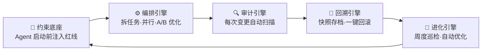
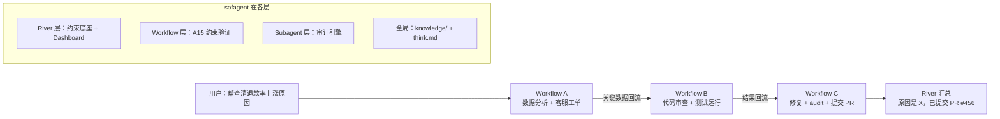
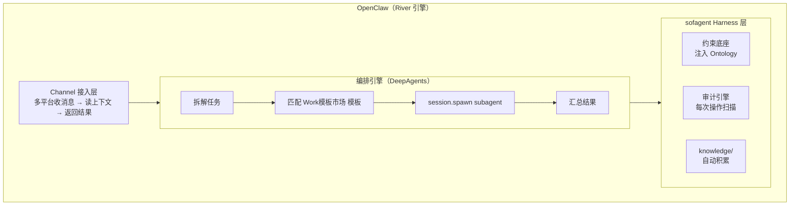
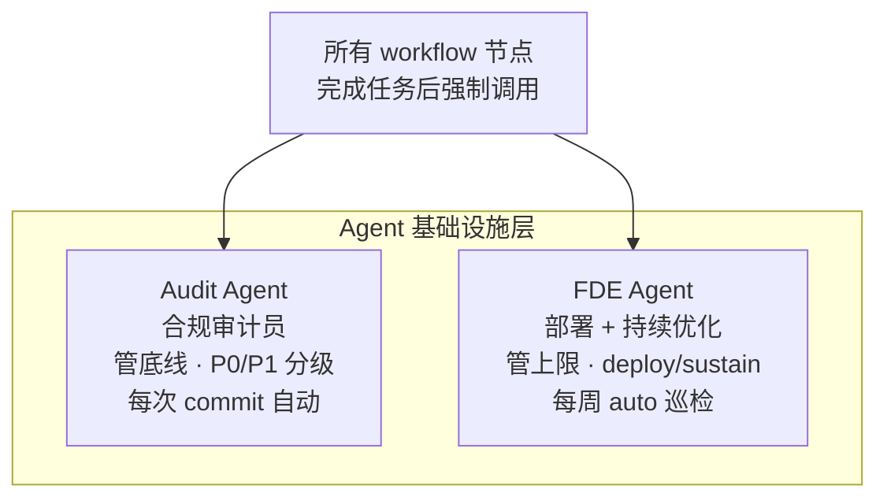

# sofagent Architecture

> sofagent 的设计决策记录——从 Harness 中间件的行为约束到五层架构的取舍。
>
> > v1.0.9 · 2026-07-13（UTC）· 孔放勋


---

## 目录

- [术语对照](#术语对照)
- [一、为什么会有 sofagent](#一为什么会有-sofagent)
  - [五引擎治理架构](#五引擎治理架构v109) · [地基与引擎](#地基与引擎) · [双节点架构](#双节点架构v107) · [River 三层架构](#river--workflow--subagent-三层架构) · [文件系统审计](#文件系统审计v108)
- [二、核心设计决策](#二核心设计决策)
- [三、诚实坦白：已知局限](#三诚实坦白已知局限)
- [四、未来方向](#四未来方向)

---

## 术语对照

| 引擎 | 英文 | 说明 |
|------|------|------|
| 🧭 约束底座 | Constraint Base | 四层加载链——Agent 启动前注入红线 |
| 🔍 审计引擎 | Audit Engine | git diff + 文件变更硬证据审计（v1.1.0 拆独立包） |
| 🔄 回溯引擎 | Restore Engine | 每次审计自动快照，`--revert` 一键回滚 |
| ⚙️ 编排引擎 | Orchestration Engine | 任务拆解 + Sub Agent 并行 + A/B 优化 |
| 🧬 进化引擎 | Evolution Engine | FDE 周度巡检 + 自动优化，v1.0.8+ |
| 加载链 | Load Chain | Agent 启动时注入的约束文件（v1.0.7+ Sub Agent 可自加载） |
| FDE 工具包 | FDE Toolkit | FDE 随身的部署工具包 |
| Gateway | Gateway | 企业级 AI 统一入口（OpenClaw/DeepAgents），sofagent 挂在它里面做行为治理 |

---

## 一、为什么会有 sofagent

提示工程管「说什么」，上下文工程管「知道什么」，约束工程管「跑在哪」。sofagent 管最后一步：跑完谁验收。不是给 AI 写 SOP，是装缰绳——让它在个性化上下文里跑出 85-90 分而不越界。
>
> sofagent 的架构基因来自 Geoffrey Huntley 的 Ralph 循环——「Agent 失忆，文件不失忆」。Agent 的记忆长在文件系统（git diff / task/logs / SKILL.md），不长在 Agent 内部。审计层优先信任 git diff（硬证据），不信任 Agent 日志（软证据）。通用 Agent 平台解决「会不会做」的能力问题，sofagent 解决「能不能每次都按规则稳定做对」的执行控制问题——二者是上下层关系，不替代。

### 理论基础与外部验证

> 完整引证见 [THANKS.md](./THANKS.md)。关键验证：Hugging Face 实验——同一模型不改权重，仅优化外层 Harness，法律 Agent 基准 3.5%→80.1%，追平 Claude Sonnet 成本仅 1/7。Benchmark 测的是「模型 + Harness」的组合能力。Harness 分两种（翁荔）：补模型短板型（价值随模型升级消失）vs 现实世界接入型（模型越强价值越大）——sofagent 属后者。Karpathy AutoResearch 与 sofagent 约束文档 + 审计 + 循环检查一一对应。

### 五引擎治理架构（v1.0.9）

Agent 不是装完就完事了——从部署到持续优化，需要五个引擎各管一摊。sofagent 不是"审计工具"——审计是其中一个引擎。



| 引擎 | 一句话设计原则 |
|------|------|
| 🧭 约束底座 | 不知道红线就不会守——启动时注入四层加载链，永远在线 |
| 🔍 审计引擎 | 不信任 Agent 自我报告，只看 git diff 硬证据（v1.1.0 拆独立包） |
| 🔄 回溯引擎 | 行车记录仪，不是安检——事后快照 + `--revert` 回滚，不依赖任何平台 |
| ⚙️ 编排引擎 | 大任务拆小、多 Agent 并行、A/B 对比找更优方案（DeepAgents + compose CLI） |
| 🧬 进化引擎 | 部署完不是终点——FDE 转为持续优化，daemon cron @weekly 自动巡检 |

Gateway（OpenClaw/DeepAgents）管路由调度，sofagent 管行为治理——**Gateway 是高速公路，sofagent 是交规 + 测速摄像头 + 驾校教练**。

### 为什么审计必须外置（五引擎之一的设计决策）

Anthropic 发现 Claude 内部存在 **J-space**——AI 自己知道控制不住自己。所以 sofagent 不信任 Agent 自我报告，只看 git diff 硬证据。审计必须外置、不可绕过。这是五个引擎中审计引擎的核心设计原则，也是 sofagent 最成熟的模块（v1.1.0 将拆为独立 `@sofagent/audit` 包）。

> **瓶颈转移**：[Anthropic《When AI builds itself》](https://www.anthropic.com/institute/recursive-self-improvement)（2026-06）报告指出——工程师人均代码产出达 2024 年的 8 倍后，代码生成不再是瓶颈，**人工代码审查成了新的堵点**（Amdahl 定律）。sofagent 的审计引擎把审查外置到 git diff 自动化——正是解这个瓶颈的方向。
> <small>注：以上「瓶颈转移」方法论解读为本项目基于 Anthropic 原文的延伸分析，非 Anthropic 原文表述。</small>

### 行业印证：Palantir 同构

Palantir AIP 未自研大模型，靠 **Ontology（本体）** 实现远超行业的 Agent 可靠性——定义实体→编织关联→赋予行动闭环。sofagent 完全对等：fde.md 定义实体，节点文档 frontmatter 编织关联，审计引擎写 think.md 赋予闭环。差别：Palantir 能直接操作 ERP 改库存，sofagent 目前只能影响 Agent 上下文注入——v2.x 方向。

> **根本接触不到 > 被告知不能说**：Palantir 的防幻觉不是"告诉 Agent 守规矩"，而是未配置的 Agent 根本看不到。sofagent 的 A15 约束验证 + 审计外置遵循同一原则。

**Palantir AI FDE 五大操作特征完全对等**：闭环操作、控量上下文、权限约束、分支评审、工具定制——sofagent 的 loop-check/evaluate/exit、task-aware 闸门、A15 约束验证、A/B 对比+promote、Skill 系统一一对应。

### 外部借鉴与生态对齐

- 编排引擎借鉴 LangChain + DeepAgentsJS，Skill 借鉴 Agency Agents + SkillOpt，Ontology 借鉴 Palantir AIP
- OpenFDE 将「审计」列为 FDE 基础层，sofagent 的审计优先设计符合社区最佳实践
- OpenFDE Agent v0.1 的 Judgment Unit 与 sofagent think.md 判断单元结构同构——独立验证了「Agent 需要结构化反思」
- gstack（YC CEO）的七步工作流（Think→Reflect）与 sofagent 审计外置 + 反思闭环对应
- [Multica](https://github.com/multica-ai/multica)（4000+ commits）— 独立验证了 sofagent 的平台无关策略：自己不调 LLM，全推给下游 14 种 Agent CLI 子进程，Harness 中间件的「不绑定任何 Agent 平台」在工程上是可行的

### 地基与引擎

sofagent 分两层——地基永远在线，引擎按需启动。地基承载约束底座（四层加载链），引擎包含审计、回溯、编排、进化四个运行时模块：

| 层 | 是什么 | 何时激活 | 占用 |
|:--:|------|:--:|:--:|
| 地基 | 约束底座——四层加载链（宪法+反思+fde+knowledge）| 每个会话启动，永远在线 | 上下文预算的 2-3% |
| 引擎 | 审计 + 回溯 + 编排 + 进化——四个运行时模块 | 审计/回溯：每次变更自动；编排：任务拆分时；进化：周度 cron / 手动 | ~800 token |

如果加载链只在复杂任务时才激活：think.md 反思区不在上下文 → Agent 重复犯错；fde.md 不在上下文 → 简单任务时用户偏好全部失效。三层加载链必须永远在线。

> v1.1.0 将审计引擎拆为独立 npm 包 `@sofagent/audit`，地基（约束底座）和其余四个引擎不受影响。

### 产品架构展望（五层）

| 层 | 部署在哪 | 干什么 | 当前状态 |
|:--:|------|------|:--:|
| **Harness 层** | Agent 上下文 | 纯 MD 文件，Agent 读即生效 | ✅ 已可用 |
| **执行层** | 用户设备 | daemon 常驻进程——跨 session 经验不丢失 | ✅ v0.81 |
| **审计层** | git 仓库 + 文件系统 | sofagent-audit——提交时审计 git diff（v1.0.7）+ 文件变更时审计 diff（v1.0.8） | ✅ v0.92 / v1.0.8 扩展 |
| **MCP 推送层** | 设备 MCP server | MCP Server 已拆分为独立包 @sofagent/mcp（v0.99.1，当前 v1.0.9），推送待端到端验证 | ✅ v0.99.5 |
| **协同层** | 多设备 + 云端 | 组织级 Agent Harness——Agent 以独立身份进入协作现场，共享上下文 + 组织记忆 + 主动参与 | v2.x 规划 |

每层跑通再加下一层——不推翻已验证的东西。

### 双节点架构（v1.0.7+）

sofagent v1.0.7 起正式区分两种部署节点类型。核心变化：Sub Agent 不再只服务 OpenClaw 节点——**约束自加载**让任何 Agent 平台都能用编排引擎。

| 维度 | 自动运行节点 | 个人增强节点 |
|------|------|------|
| **典型场景** | 企业无人值守设备 | 个人开发者用 WorkBuddy/Codex/Claude Code |
| **OpenClaw** | ✅ 必须（Channel/control/orchestration/Webhook） | ❌ 不需要 |
| **编排引擎调用** | OpenClaw 内部 API（性能优先） | `sofagent-audit compose --task` CLI |
| **约束注入** | OpenClaw Hook 精确注入（运行时动态） | Sub Agent 自加载（`buildConstrainedSystemPrompt`，启动时一次性） |
| **审计引擎** | git commit-msg + post-commit hook | 同左（完全一致） |
| **DeepAgents** | ✅ 正式依赖（v1.0.7 从 optional 提升） | 同左 |

**Sub Agent 约束自加载**（v1.0.7 新增）：launcher.ts 的 `buildConstrainedSystemPrompt()` 在 Sub Agent 启动时读取 `.sofagent/` 下的约束文件（SKILL.md + fde.md + think.md + knowledge/ top-N），拼装为 system prompt。纯文件系统操作，不依赖任何 Agent 平台的 Skill 系统。这让 Sub Agent 换平台时约束不丢——OpenClaw 节点切到 WorkBuddy，约束行为一致。

**CLI 编排入口**（v1.0.7 新增）：`sofagent-audit compose --task <描述>` 让第三方 Agent 通过 Bash tool 调用编排引擎。输出 YAML 编排方案到 stdout，加 `--run` 直接执行。不依赖 OpenClaw 的任何 API。

> **跨系统隔离带（v2.x 边界注记）**：双节点架构解决「节点间」隔离（自动运行节点 vs 个人增强节点）。但客户侧 **CRM→财务→云控制台之间的权限扩散边界**尚未建模——一个系统的权限不应无边界扩散到另一个系统。v2.x「场景驱动权限体系 + 代理网关硬边界」设计时一并考虑（见 ROADMAP 行业信号校准章节）。

### River — Workflow — Subagent 三层架构

sofagent 的编排体系按三层抽象组织。三者不是竞争关系——是**不同抽象层**。**River 是多个 Workflow 的集合**：每个 Workflow 是一条小溪，多条小溪的关联关系组成了大河——用户只看到一个入口，背后是 Workflow 之间的调度和回流。



| 层 | 是什么 | 对用户可见？ | 类比 |
|------|------|:--:|------|
| **River** | 统一 Agent 身份 + 连续上下文 | ✅ 可见 | 大河——只有一个入口 |
| **Workflow** | 任务编排方案（YAML 模板） | ❌ 不可见 | 河道——决定水流走向 |
| **Subagent** | 执行具体能力的 Agent | ❌ 不可见 | 水滴——干完活就消失 |

用户只看到 River。Workflow 和 Subagent 是 River 内部的调度机制。多条小溪（Workflow）并行或串行执行，最终汇入同一条大河（River）——**从头到尾同一个身份、同一段上下文。**

这与 Shopify River 的设计逻辑一致：全公司共用一个 Agent 身份，背后是 Work模板市场 模板 + Sub Agent 编排。sofagent 不做 River 本身（那是企业的统一 Agent），而是提供 River 背后运作所需的 Harness 基础设施——约束底座、审计引擎、Ontology 世界模型、知识库自动积累。

#### River 的实现机制

**River 不是一段代码——是一个架构模式。** 它的实现载体是 OpenClaw + sofagent + Channel 集成，三者合在一起构成企业的统一 Agent 入口。

```
企业员工（多渠道）
    │
    ├─ Slack @River
    ├─ 钉钉 @River
    ├─ 飞书 @River
    └─ 企微 @River
        │
        ▼



### 四层架构：Agent 基础设施层（v1.0.7+）

v1.0.7 起，sofagent 预装两个内置 Agent，v1.0.8 将它们升级为**基础设施 Agent**——所有 workflow 节点必须引用：



**Agent 存储与加载**：
- 定义在 `agents/SKILL/{name}/SKILL.md`，一个文件 = 一个 Agent
- `builtin-agents.ts` 的 `parseSkillMd()` 读 SKILL.md，front matter → 身份标签，body → role prompt 注入 DeepAgents
- `registry.ts` 的 `listAgents()` 自动合并内置 + `~/.sofagent/subagents/` 自定义 Agent
- 第三方调用：Skill（@Agent 名）或 CLI（`sofagent-audit subagent run <name>`）```

**并发设计**：当 200 人同时 @River 时，不靠砸 OpenClaw 解决，靠分层调度：

| 层 | 怎么扛并发 | 当前状态 |
|------|------|:--:|
| **入口层** | IM 平台自带 webhook 队列（钉钉/飞书/Slack 都有），消息天然排队 | ✅ 已有 |
| **OpenClaw** | 小规模（<50 人）单实例够用；中大规模（50-500 人）按任务类型分实例池——轻任务一个实例、重任务（涉及多 Sub Agent）独立实例 | ⚠️ 实例池是 v2.x 的事 |
| **Sub Agent** | `session.spawn` 本身就是并行隔离的——N 个任务 = N 个独立 session，互不干扰 | ✅ v1.0.7 已具备 |
| **审计层** | `sofagent-audit` 是独立 CLI 进程，每次 commit 独立运行，天然无锁、无竞态 | ✅ v1.0.7 已具备 |

**River 与 LOOP 架构的对应**：

- **内层循环** = 单次任务的 River 行为：人下任务 → minimal-change-engineer → audit → review → 人类确认
- **外层循环** = River 的持续进化：FDE 监督 → 分析 think.md 趋势 → 优化 Agent 定义 → 内层循环自动升级

River 不需要"开发一个新东西"——它是 OpenClaw + sofagent + Channel 集成的自然产物。当这三个组件都就绪时，企业自然就有了一个统一 Agent 入口。sofagent 不做 River 本身，而是确保这条大河里的每一滴水（Sub Agent）都有纪律、可追溯、会反思。

### 文件系统审计（v1.0.8+）

v1.0.7 及以前，审计引擎只在 `git commit` 时触发——只有开发者能用。v1.0.8 扩展为**文件系统变更审计**，覆盖非开发者场景（客服、运营、数据分析人员用 AI 改文件）。

| 维度 | git commit 审计（v1.0.7） | 文件系统审计（v1.0.8） |
|------|------|------|
| 触发方式 | 用户主动 `git commit` | daemon 监控文件变更，自动触发 |
| 拦截能力 | ✅ 阻断 commit | ❌ 事后告警（文件已改完） |
| 证据 | git diff（硬证据） | isomorphic-git diff（硬证据） |
| 需要 git | ✅ 系统装 git | ❌ 内嵌 isomorphic-git（~2MB 纯 JS） |
| 适用人群 | 开发者 | 开发者 + 非开发者 |
| 文件类型 | 文本文件 | 文本文件（A1-A15）+ 二进制文件（v1.0.9 加 A16-A17） |

**核心组件**：`isomorphic-git`（内嵌，~2MB）+ daemon fs-watch（`chokidar`，5 秒防抖）+ 快照回溯（`sofagent-audit --revert <sha>`）。

**审计语义**：文件系统审计是**事后告警 + 回溯**，不是事前拦截——这是平台无关性的前提。sofagent 做的是**行车记录仪**，不是安检：实时拦截需要深度集成平台，一旦集成丧失第三方独立性。

| 方案 | 代价 |
|------|------|
| 实时约束（拦截） | 需深度集成平台 → 只能服务单一平台 |
| 事后审计（diff） | 慢半拍，但**平台无关** |
| 回溯恢复（snapshot） | 改错了能回滚 |

v1.0.8 daemon 让事后审计达到准实时：`fs.watch` → 防抖 2 秒 → 立即审计，几秒出结果。演进：v1.0.x 被动等 commit → v1.0.8 准实时 → v2.x Webhook 实时告警。

> 💡 **与 AgentLoop 的区别**：阿里云 AgentLoop 做运行时 Trajectory 观测（Agent 怎么想），sofagent 做文件 diff 审计（Agent 改了什么）。AgentLoop 数据发阿里云，sofagent 数据留本地。对企业来说"改了什么"比"怎么想的"更重要。

#### 告警链路

| 级别 | 用户看到什么 | 自动动作 |
|------|------------|---------|
| ✅ PASS | 静默 | snapshot 存档 `.sofagent/.git-shadow/` |
| ⚠️ WARN | daemon-notice.md + 可选 Webhook | 存档 + 标记 |
| ❌ FAIL | Webhook + 终端标红 | 存档 + 建议回滚 |

回溯：`--history` 查看快照，`--revert <sha>` 回滚。daemon 自动清理 30 天前旧快照。Webhook 配置在 `.sofagent/config.yml`。

### 审计引擎的证据分层：信任产出，不信任过程

审计层核心设计来自三个独立来源的收敛——Ralph Loop「Agent 失忆，文件不失忆」、MiroFish「工具调用与最终答案严格分离」、卡普「99.9% 确定性刚需」二分法。三者指向同一结论：**git diff 是最终答案（硬证据），Agent 日志是工具调用过程（软证据）。**

| 证据源 | 依赖 Agent 配合 | 可绕过 | 判定精确度 |
|------|:--:|:--:|:--:|
| git diff（硬证据）| ❌ 不依赖 | ❌ 不可绕过 | 高 |
| Agent 日志（软证据）| ✅ 需要 Agent 写入 | ✅ 可伪造 | 中 |

**设计后果**：`--silent` 模式只跑纯 git-diff 规则（零依赖 Agent 配合）；完整模式交叉对比两种证据；新规则优先加 git-diff 规则。底线：**审计工具在零 Agent 配合下仍然有判定能力。**

> **执行边界五组件 ↔ sofagent 模块映射**（外部验证：执行边界 = 刹车 / 限速器 / 黑匣子 / 护栏 / 隔离带，且"必须独立于业务系统"）：
>
> | 组件 | 含义 | sofagent 对应 | 状态 |
> |------|------|------|:--:|
> | 刹车 | 拒绝 / 放弃条件 | entry-gate 拒绝 + 放弃条件 5 条 | ✅ |
> | 黑匣子 | 行为记录不可篡改 | 审计引擎（git diff + 文件系统双源）| ✅ |
> | 护栏 | 合规闭环 | 审计闭环 + 放弃条件 | ✅ |
> | 隔离带 | 系统间隔离 | 双节点架构（git worktree / OpenClaw 隔离）| ✅ |
> | 限速器 | 频率 / 规模 / 额度限制 | entry-gate 前置校验（额度 / 频率 / 风险等级）| 🔮 v1.x 探索 |
>
> 五组件中前四项已有能力，唯一缺口是**限速器**——执行"多少 / 多快"的前置限制（详见 🟡 设计项与 ROADMAP v1.x）。

> **四方责任追溯：证据链即问责底座**。§一 已建立 AI / 用户 / 开发者 / 社会 四方对齐框架。审计引擎在此框架上的具体交付是**不可篡改的证据链**——git diff（提交时）+ 文件系统 diff + 快照回溯（v1.0.8），每条变更都有"谁在何时改了什么"的硬记录。这条证据链同时支撑四方问责：开发者→commit 可回溯、用户→操作可追溯、社会→合规约束不可绕过、AI 系统→自身行为留痕。sofagent 不替任何一方做判断，只确保事实可查。

> 🔮 **探索方向（非核心路线）：双闸验证**——执行前预判 + 副作用写回前再扫。需深度集成平台 tool call 拦截，与"平台无关"核心定位有张力。sofagent 立身之本是事后审计 + 回溯恢复，不依赖任何平台。

> 🔮 **v1.x 方向：权限风险分级**。当前 entry-gate.md 是单层权限清单（能做/不能做二分）。Human-in-the-Loop 审批工程的进化方向是按风险分三级：🟢 低风险（文件读写/查询）自动放行 / 🟡 中风险（git 操作/安装包）需确认 / 🔴 高风险（删数据/部署/外部 API）必须人工审批。风险分级不是增加审批摩擦，是让低风险操作更快通过的同时，把人工注意力精准投放到高风险节点。

### 四条设计原则

> 1. **「吃下痛苦，排出产品」**——Agent 的管理痛苦由 sofagent 消化，产出的 Harness 规则企业敢放进流程里
> 2. **「模型输出是提案，不是命令」**——Agent 每次代码改动是提案，git diff 是证据，审计工具验收
> 3. **「先有掌控感，再自动化」**——install → verify.sh 确认约束生效 → 然后才能放心交给编排引擎
> 4. **「状态最贵」**——Harness 层总占用承诺不超过窗口 5%（当前约 2.5%）。用文件外化状态，用 git diff 替代 Agent 记忆

### 设计原则的理论支撑

四条原则不是拍脑袋——每条背后有独立的理论/工程/经济学论证：

**「状态最贵」的 CS 理论基础**。计算机科学只有两个难题——缓存失效和命名——本质上全部指向状态问题。状态带来三个无法回避的工程痛点：会过期（数据一致性）、会冲突（多进程死锁）、难复制（分布式同步）。HTTP 协议是"无状态即无限规模"的最佳案例：每次请求独立自包含，服务器处理完即遗忘，这个看似笨拙的设计支撑了全球互联网 30 年的规模扩张。sofagent 选择 Ralph Loop 无状态范式（Agent 失忆，文件不失忆），不是哲学偏好，是分布式系统的工程最优解。

**「模型输出是提案」的随机过程理论基础**。传统心智模型把大模型当作员工——设定角色、塞满上下文、追求单次调用完成任务。更精确的心智模型是把大模型当作带噪声的随机过程——不试图消除随机性，而是用循环驯化随机性。

类比退火算法的变异机制，将 git diff + 审计规则作为适应度函数。「修 Harness 不修 Model」本质上是在搭建进化环境——约束底座不是约束聪明的下属，是为带噪声的随机函数提供适应性压力。

**反认知投降的制度设计**。当 AI 能力过强时，人类会不自觉进入「认知自动驾驶」——不再有独立观点、不再形成判断、放弃思考主动权。这不是懒惰，是认知卸载的本能陷阱。sofagent 的三道制度护栏确保人类永远是最终决策者：

| 护栏 | 防什么 | 怎么防 |
|------|--------|--------|
| fde.md 规则可随时覆盖 | AI 的判断替代人类意志 | 人类写一条规则，AI 必须遵守 |
| 编排方案可回滚 | AI 的方案先斩后奏 | 人类不确认，编排不执行 |
| 审计引擎独立于 Agent | AI 自己验收自己 | git diff 硬证据，Agent 无法篡改 |
| 反谄媚（反社会奖励劫持） | AI 为获认可而顺人类偏好、回避指出风险 | 审计/反思显式检查点——鼓励指出问题而非附和，禁止为取悦而弱化风险表述 |

**90%/10% 价值分层**。模型能完成 90% 任务，但剩余 10% 不可预测失误 = 只能做助手，不能做自主系统。关键规律：**模型越强，90% 常规任务范围越广，但剩余 10% 高风险场景价值反升**。约束底座（审计 + 验证 + 复盘）占据的正是那 10% 高价值环节——模型越强，约束底座越值钱。

**四方对齐——AI 不是只有你和它**。DeepMind Iason Gabriel（2020）指出 AI 对齐不是"AI-人类"的二元关系，而是四元动态：**AI 系统、直接用户、开发者、全社会（indirect stakeholders）**——每个角都有不同的利益、不同的脆弱性、不同的对齐要求。sofagent 的三道制度护栏恰好覆盖了这四个角：fde.md 让开发者掌控规则（开发者→AI）、entry-gate 能力注册让用户清楚 AI 能做什么不能做什么（用户→AI）、审计引擎独立于 Agent 确保社会层面的合规约束不被绕过（社会→AI）。对齐不是"管好 AI"，是设计一个四方都能信任的制度框架。详见 [Gabriel 2020](https://arxiv.org/abs/2006.16667)。

**理解债务与意图债对称**。意图债是输入端反复交代项目背景的成本（SKILL.md + fde.md 在还这笔债）。理解债务是输出端的对称概念——AI 产出后，人类需要理解 AI 做了什么、为什么这样做、哪里可能出问题的认知成本。Go Mode 下 Agent 一次性交付大量产出，理解债务爆发式增长；Loop 模式下 Agent 逐步展示迭代过程，理解债务被分摊到每一轮。think.md 的任务反思区（每步记录：看到什么/改了什么/验证了什么/还剩什么）是偿还理解债务的工程机制。工程定量参照：Anthropic 数据显示 AI 带来 4 倍代码量但仅 12% 价值增量，差值部分即理解债务的隐性成本。

### 为什么是 Skill + 脚本 + Runtime

| 什么事 | 谁来做 | 为什么 |
|------|------|------|
| 判断（评分、反思、选模板） | Skill（MD prompt 文件） | LLM 的长项——模式识别、定性判断 |
| 机械操作（文件读写、API 调用） | 脚本（bash） | 确定性操作——复制、拼接、计数 |
| 硬安全（加载链、断路器） | OpenClaw 原生配置 | Agent 失控时没法自己管自己 |

LLM 管判断、脚本管执行、Runtime 管刹车——天然的分界。

### OpenClaw 在架构中的角色

#### 审计层不需要 OpenClaw

sofagent-audit 是一个 TypeScript CLI。它的输入是 git diff，输出是 exit code。它不关心代码是谁写的——Cursor 写的、Codex 写的、人写的，都一样。pre-commit hook 在 `git commit` 时自动触发，跟 Agent 无关。

这意味着：即使不装 OpenClaw，审计层照样能工作。企业团队今天就能 `npm install -g @sofagent/audit`，配 pre-commit hook，让所有 Agent（不管什么平台）的提交都经过审计。

#### 编排层当前状态

编排引擎当前依赖 `ao compose`（agency-orchestrator）做任务拆解。`launcher.ts`（v1.0.4）作为 DeepAgents 的接入层已就绪——但当前仅是 optional wrapper（68 行），编排逻辑仍走 ao CLI。

**正在迁移**（[ROADMAP](./ROADMAP.md) v1.0.6-v1.0.7）：
1. v1.0.6：compose 从 ao CLI 迁到 DeepAgents，ao 降为 fallback
2. v1.0.7：ao 依赖移除，deepagents 提升为正式依赖，A/B 自动切换

迁移完成后，编排引擎不再绑定 OpenClaw——任何人用自己的 Agent 都能调用编排引擎。

> ⚠️ 之前的"v1.0.5 起 DeepAgents 原生解决"表述已在审查中修正——文档不跑在代码前面。

#### 两种使用模式

**核心认知：FDE 工具包本身就是 sofagent 产品的一部分。FDE 工作用自己产品，给别人部署完让别人也用自己产品。**

```
FDE = Forward Deployed Engineer
    │
    │  FDE 本身也是一个 workflow（12 步）
    │
    ├── FDE 工作（⚡ 强化节点）
    │   └── 工具 = sofagent 约束底座 + FDE Skill 工具包
    │       └── 用自己的 Agent（WorkBuddy / Codex）走 12 步
    │
    └── 给客户部署
        ├── 找台闲置设备装 sofagent 底座 ← 核心产品落地
        └── 上面跑客户的 AI 节点（客户自己的 workflow）
```

- **模式 A（FDE 自己用）**：FDE 用自己顺手的 Agent（WorkBuddy / Codex / Cursor）对话。当需要跑 FDE workflow 节点时，Agent 后台调用 OpenClaw 节点。OpenClaw 跑完后把结果返回给 FDE 的 Agent——FDE 全程看不到 OpenClaw 的 UI，它是一个后台 AI 节点。

- **模式 B（企业设备上的 FDE 工具包）**：FDE 帮企业部署完后，企业闲置设备上装 OpenClaw + sofagent，搭成一个 harness 层，上面跑 AI 节点。企业自己采购的 Agent（WorkBuddy / Codex 等）也装在这台设备上——**Agent 不跑在 OpenClaw session 里**。sofagent 对企业 Agent 的审计走**文件系统层 + git pre-commit hook**：Agent 各自独立运行，各自用自己的 git 仓库，commit 时 hook 自动触发 sofagent-audit。Agent 完全不感知 OpenClaw。相当于：OpenClaw 是地基，其他 Agent 是住在上面的租户，sofagent 是物业管理。租户爱干嘛干嘛，物业管的是楼的安全。

选 OpenClaw 的技术理由：开源 + Node.js（技术栈一致）、原生编排（AO compose → DAG 执行）、Agency Agent 兼容（233 个岗位模板）。技术选型演进：bash → Node.js/TS——Harness 层（纯 MD 规则，无代码）、审计/验证/编排迁移到 TS（npm 包 8 个 bin），OS 集成层（install/daemon）保持 bash。

### 白盒循环

Claude Code 的 `/goal` 是纯黑盒——目标给出去 Agent 闷头跑，方向歪了交回来的不是想要的。sofagent 把黑盒变成白盒：

| sofagent 扩展的 | /goal 原版 | 为什么 |
|------|------|------|
| 用户确认 | 循环自主跑到底 | 不敢让它黑盒跑——先看一眼提案再执行 |
| 规则/数据分离 | 没明确切分 | SKILL.md 规则层，Agent 碰不了；eval.md + think.md 数据层，Agent 自己进化 |

白盒的关键不是加了确认按钮，是**用户和 Agent 一起把目标定清楚，再启动编排**。

### 模型与 Harness 的博弈

模型会吃掉一部分 Harness——任务拆解、上下文选择、工具调用这些能力模型自己越来越强。但生产级 Harness 从「外部脚手架」升级成「生产级 Agent 运行基础设施」。**Agent 越强，闸门越重要。**

---

## 二、核心设计决策

### 500 字原则

加载链的理想设计是每份文件 ≤500 字（Agent 压缩后可读的最低保证）。当前 SKILL.md ~2,000 字、fde.md ~1,600 字——远超目标，是 v1.x 计划解决的技术债。超过 500 字 Agent 遵守率明显下降——规则在长文本里会被淹没。500 字不只是「让 Agent 好好读」，更是「让 Agent 在被压缩后还能读到」。行业数据：上下文占用达窗口 60% 时模型性能开始衰减（Croco 51 万行代码泄露分析）——500 字原则的本质是在腐烂阈值之下运行。

> **污染理论**：agents.md 的每个字节在每次 Loop 中被反复消耗——一份臃肿的 agents.md 会污染未来每一轮的上下文。500 字原则不仅省 token，更是「降低所有未来 Loop 的持续污染成本」。

### 措辞心理学：长度之外还有强度

500 字原则管「长度」——Rule 的字数。但同等重要的维度是「强度」——Rule 用什么语气写。Superpowers（GitHub 23.9 万星 Skill 项目）通过 2.8 万次对话实测发现：**将铁律措辞从「建议/应该」升级为「必须/绝无例外」后，AI 服从率从 33% 提升到 72%——翻倍。** 规则内容完全相同，仅措辞强度不同。

这不是「写得狠」，是 prompt 工程的底层规律——LLM 对强语气（must / 绝无例外 / 违反即失败）的注意力权重高于弱语气（建议 / 应该 / 尽量）。sofagent 的铁律措辞应遵循同一原则：**在上下文预算允许的前提下，用最高强度可用措辞写关键铁律。**

长度和强度之外，还有第三个维度——**预判**。Addy Osmani 的 [agent-skills](https://github.com/addyosmani/agent-skills) 在每个规则下附「反合理化表」：列出 Agent 跳过步骤时的常见借口，逐一驳回。sofagent fde.md 采用了相同设计——铁律告诉 Agent「该做什么」，反合理化表告诉它「别找借口」。

### 三层加载链：为什么是这个顺序

从契约到执行，三层按「能不能改」分级：

| 层 | 文件 | 权限 |
|:--:|------|:--:|
| 1 | 契约层（`SKILL.md`） | ❌ 千万别碰 |
| 2 | 反思层（`think.md`） | ⚠️ 自动生成，改了没用 |
| 3 | 执行层（`fde.md`） | ✅ 随便改 |

加载顺序受 Lost in the Middle 约束：SKILL.md 放最前面（开头注意力最高），fde.md 放最后面（末尾注意力最高）。

### 数据层：AI 知识库（v1.0.1 实现）

五层架构是**功能引擎层**——每层有输入、处理、输出。AI 知识库是**数据层**——它是五层引擎运转过程中沉淀的知识目录，本身不做处理。硬塞进五层维度不匹配，就像把「数据库」当成微服务架构里的一个「服务」。

#### think.md vs AI 知识库对比

| 维度 | think.md（反思层） | AI 知识库（沉淀层） |
|:--|:--|:--|
| 注入机制 | 加载链被动注入 | 加载链被动注入（top-N 相关页） |
| 内容 | 单次任务的反思教训 | 跨任务的模式、最佳实践、对比 |
| 结构 | 扁平时间线 | AI 知识库页面（双向链接） |
| 生命周期 | 旧了压缩 | 持续积累，越用越值钱 |

AI 知识库不替代 think.md——两者职责不重叠。think.md 是「上次踩了什么坑」，AI 知识库是「这个领域我们积累了什么最佳实践」。详见 [v1.0.1 开发日志](./changelog/v1.0.1.md)。

### 生产者-消费者架构（v1.0.5 文档化）

knowledge/ 的数据流遵循生产者-消费者解耦模式（与 Google OKF 同构）：

| 角色 | 组件 | 职责 |
|------|------|------|
| **生产者** | daemon Ingest（task/logs 变化 → 触发知识提取） | 写入 knowledge/ 页面 |
| **生产者** | knowledge-maintain Skill（session 结束时的结构化总结） | 写入 entities/ concepts/ |
| **消费者** | 加载链第 4 层（knowledge/index.md → top-3 页摘要） | 注入上下文 |
| **消费者** | Agent 决策前查询（读 index.md → 找到相关页面 → 读详情） | 自主检索 |
| **Lint** | loop-evaluate（每周扫描：矛盾/过期/孤立页面） | 质量检查 |

生产者和消费者只通过 knowledge/ 目录交互——生产者不知道谁会读，消费者不知道谁写的。

> 💡 **设计对齐**：knowledge/ 的 entities（实体页）→ relations（frontmatter 关联字段）→ concepts（概念页）→ comparisons（对比页）四层结构，本质是**轻量级 GraphRAG**（Microsoft 2024）。区别在于用 Agent 遍历关联代替图数据库查询，用 .md 文件代替向量索引——零外部依赖，完全可审计，人类可以直接打开看。混合路由：简单事实直接 grep，关联查询走 entities→relations→concepts 遍历。

> **核心原则——不可追溯即不可信任**：企业知识库最怕 AI 说了一句没人知道从哪来的话。只要不可追溯，业务就不信任。`.md` 文件 + git diff 审计确保每条知识都有来源、每次变更都有记录。

> 📋 **Ledger-Views-Policy 三层映射**（生产级 Agent Memory = 状态管理系统，不是向量库）：`task/logs/` = Ledger（只追加不修改）→ `knowledge/` + `think.md` = Views（派生视图）→ `fde.md` 铁律 = Policy（读写忘规则）。

> **多重独立验证**：
> - **Google OKF**：同架构（Markdown + YAML Frontmatter + Git）+ 同数据流（生产者-消费者解耦）
> - **CAG（第 7 代 RAG，WWW '25）**：同方法——按主题整合→去重去冲突→规整 Markdown→全量输入 LLM
> - **Glean（Gary Tan / YC）**：工业数据——1.7 万页 Markdown、前 5 条召回 ~100%、比传统 RAG 提升 30%

> **进化方向——记忆分层金字塔（L0-L3）**：腾讯云 TencentDB Agent Memory（MIT，OpenClaw 原生插件）提供了可直接引用的 4 层记忆架构：L0 原始对话 → L1 原子事实（SQLite+vector 检索）→ L2 场景聚合（Markdown）→ L3 用户画像（persona.md）。sofagent 已有 L0（think.md）→ L1（entities）→ L2（concepts），缺 L3 用户画像 + 自动化 L1→L2 提炼流水线。未来可直接集成作为记忆后端——百万级事实用 DB 检索、千级结构用 MD 文件。

#### TencentDB 集成边界

TencentDB Agent Memory 是 OpenClaw 原生插件，依赖 `api.on` / `api.registerTool` / `api.registerContextEngine` 运行，无法直接安装到 DeepAgents（两套 plugin API 不兼容）。sofagent 以**路径 C（只读 Markdown）**集成：daemon 定期同步 persona.md → 加载链注入，不碰 SQLite、不调 HTTP API。TencentDB 卸了 sofagent 照样跑。详见 [v1.0.8 开发日志](./changelog/v1.0.8.md)。

### 三层时间尺度循环（Andrew Ng 框架）

> 来源：[Andrew Ng — Three Key Loops for Building Great Software](https://www.deeplearning.ai/the-batch/three-key-loops-for-building-great-software)（The Batch, 2026-06-30）。真正的产品进化不只来自内层循环（Agent 跑任务），更来自中层和外层。

| 层 | 时间尺度 | sofagent 当前覆盖 | 对应组件 |
|:--:|:--:|:--:|------|
| **内层** Agent Loop | 秒-分钟 | ✅ 已覆盖 | think.md + loop-check + 审计引擎 |
| **中层** 开发者反馈 | 天-周 | ⚠️ 部分 | loop-evaluate 跑完写 eval.md，但评分→Skill 优化闭环未打通。v1.0.1 AI 知识库 Lint 驱动 Skill 自动迭代 |
| **外层** 用户反馈 | 周-月 | ❌ 未覆盖 | 企业用了一个月后，AI 节点变聪明了还是变笨了？v2.x 组织级共享记忆 + 知识库矛盾检测 |

**当前短板**：sofagent 目前只关注内层循环（Agent 跑任务→审计→反思）。中层的「审计结果怎么反馈给 Skill 优化」和外层的「企业用了一个月后怎么知道效果」是缺失环节。v1.0.1 的 AI 知识库 + Skill 自进化闭环补中层，v2.x 的组织级共享记忆补外层。

> 💡 **核心洞察**：Andrew Ng 在[同一篇文章](https://www.deeplearning.ai/the-batch/three-key-loops-for-building-great-software)中提出「产品品味本质是上下文优势（context advantage, not taste）」——用户画像、业务边界、资源约束、竞品动态目前仍存储在人类认知中，AI 无法自主获取。因此开发者必须留在中层循环为系统补全关键上下文，而非试图跳过中层让 AI 直连用户。

> ⚠️ **诚实声明**：上表列的是终局目标，不是当前能力。sofagent 当前实际只覆盖内层。中层 v1.0.1 开始做，外层 v2.x 才涉及。

### 铁律为什么是 6 则

每一条对应日常使用中反复遇到的 Agent 失控行为——不是理论推演，是痛点积累：

| 问题 | 对应规则 |
|------|:--:|
| 做完了没回复 | #1 对用户有回应 |
| 越界改代码 | 审计 A3 不改越界 |
| 出错继续跑 | 审计 A8 不逃验证 |
| 不看文件就写 | 审计 A7 不存盲改 |
| 编造数据 | 审计 A5 不瞒真相 |

前 4 条源于 Karpathy 的 4 条编码原则，后 2 条是实战翻车经历的工程沉淀。

> **设计限制**：A14（知识库越权访问）是事后审计提醒（WARN 级），不是强制访问控制。它依赖 Agent 自行记录的 task/logs 来检测越权访问——如果 Agent 不写日志，A14 无法检测。企业级场景需要配合文件系统权限（如 OS 级别的目录隔离）实现真正的隔离。

### Loop Agent：三节点顾问模式

Loop 不是只发生在任务结束时——执行过程中同样需要停下来检查方向。三节点（checkpoint / failure / closure）覆盖「阶段切换」「进度过半」「高风险」三种场景。为什么是独立 Agent 而不是代码逻辑：Loop 需要读 think.md + task/logs + orchestrator/ 做综合判断——正是 Agent 的长项。

<a id="session-boundary"></a>
### Session 边界 / Worktree 隔离 / 编排产物

- **Session 边界**：用百分比（缓存≥50%，token≥70%）不用轮次——模型窗口在变大，轮次限制是刻舟求剑。
- **Worktree 隔离**：多子 Agent 并行操作同一仓库时用 git worktree 隔离——零额外依赖，git 原生能力。
- **编排产物**：`ao compose` 生成的 YAML 存到 `.sofagent/orchestrator/workflows/`——用户不用手写，看就行。

### Session 生命周期 / 多设备记忆管理 / 数据主权

企业 workflow 中的固定节点 Agent 反复执行同类任务，session 越滚越长会导致上下文爆炸。解决方案：记忆蒸馏（提炼关键决策+踩过的坑 → JSONL 持久化）→ 关闭旧 session → 新 session 轻装上阵。多设备场景：设备间通过 MCP server 暴露记忆索引，蒸馏记忆聚合到企业自有 NAS/云盘。**数据主权在设备**——所有记忆文件、task/logs、think.md 都只在设备本地。

### 不要写显而易见的事

核心原则：**不写模型已知的常识，只写它在这个任务上会犯的错、会漏的步骤、会搞错的数据格式。** Gotcha 章节比功能介绍有价值得多。

### 为什么选 DeepSeek

默认推荐 DeepSeek，两条底线决定：不碰 SaaS（API 模式数据不经过第三方）、成本可控（Loop 每次额外消耗不到 1 美分）。模型选择是开放的——任何支持 API 的模型都能用。

### Flash 干粗活、Pro 干细活：成本逻辑

Flash 和 Pro 差约 4 倍价，但简单任务 Flash 质量并不明显逊色。实现上是 OpenClaw 的 `sessions_spawn.model` 参数——API 级硬约束。

### 编排收敛条件：Loop 的生命线

编排引擎是 Loop 工程——任务到达后持续循环迭代，直到目标达成才终止。Loop 的核心是**收敛**：如果目标不具备收敛性，循环会无限运行直到耗尽所有资源成本。

收敛目标必须满足两个条件：

| 条件 | 说明 | sofagent 对应 |
|------|------|------|
| **可验证（Verifiable）** | 具备明确的可量化验证标准（测试覆盖率、AC 验收标准），避免模糊描述 | verify-evidence.sh + loop-check.md |
| **模型可自主价值判断** | 目标可通过 LLM 自带规则校验（字数限制、必须包含关键词），逐步聚拢到目标 | think.md 沉淀的规则 |

> 反面案例：设「优化页面美观度」这类模糊目标——Loop 会跑十几小时仍无法收敛判定。编排引擎的两轮澄清机制（第一轮目标确认→第二轮编排方案）正是为了避免不收敛目标进入 Loop。

> **Maker-Checker 分离是收敛的前提**：同一 Agent 自验的验证覆盖率仅 7-33%，但分离为独立审查 Agent 后提升至 73%。这不是 Agent 能力问题——是「裁判和运动员不能是同一个人」。sofagent 的审计引擎与编排引擎分离正是基于同一原则。

> **gstack 七步验证**：YC CEO Garry Tan 的 gstack（28 Skill + 7 Agent 角色）采用 Think→Plan→Build→Reveal→Test→Ship→Reflect 七步工作流，Reveal（独立审查 Agent 脱离原上下文校验）和 Reflect（经验沉淀到永久记忆库）与 sofagent 的审计外置 + think.md 反思完全对应。gstack 内置 `cloud.md` + `isos.md` 两份"宪法级"文件所有 Skill 运行前强制加载——等同于 sofagent 的 fde.md + 三层加载链。

### 编排开销的经济学

Loop 机制每次任务多消耗约 2,000–5,000 token（窗口的 2–4%）。值得花——跑一次多花的 token，后面十次省回来了。token 价格长期往下，每降一个数量级，编排开销占比就缩一个数量级。

### A/B 测试为什么不是一次性评估

编排引擎在 Workflow 梳理时生成第一版编排方案（current）。运行一段时间后，定期触发重新编排生成 candidate，用 `sofagent-orchestrate-compare` 做确定性对比——从 task/logs 中提取运行次数、违规率、步数、通过率四项客观指标，不由 Agent 主观判断。单次对比后标记胜出方，连续两次胜出目前需手动二次运行确认。⚠️ 连续胜出判断为 TODO(v1.0.1)——当前只做单次对比，需手动执行两次后人工决策。v1.0.1 计划实现自动连续胜出计数器，旧方案归档进 history/。

保守是因为 LLM 复盘有偏差——一次高分可能是运气，连续高分才可能是规律。CLI 工具的确定性对比消除了 Agent 自我评估的偏差。

> orchestrator/ 目录结构：current/（生产用）+ candidate/（候选方案）+ comparisons/（对比报告）+ history/（被替换的旧方案）

### 渐进初始化 / 复盘体系 / 反思区 / 权重门禁

- **渐进初始化**：`eval.md` 和 `orchestrator.md` 部署时只有单文件，枝叶由子 Skill 在运行时按需创建——懒创建、动态分类、平台无关。
- **复盘体系**：从六维评分起步，逐步加入「流程合规」和「Loop 有效性」。Loop Agent 作为独立角色做复盘评估。看趋势不看单次。
- **反思区统一**：think.md 是合并后的「错题本」——教训和经历存储在同一个上下文中。覆盖而非追加。
- **权重门禁**：权重 ≥0.5 进反思区（≤2K token）。由新鲜度 + 反思关联 + 引用热度三个信号计算。2K token 硬上限是真正的安全阀。
- **自我纠正三道防线**：只存经验不存指令 → 反思区 2K token 硬上限 → 人工可清除。

### 文件系统而非数据库 / 树形加载 / 不要 Connector

- **文件系统**：`cat task/logs/` 就能拿到记录，不需要 SQL/连接串/权限管理。天然可审计、可传输、支持 Git。
- **树形加载**：orchestrator/、scoring/ 用树形目录 + 按需读取——读 `_index.md` → 定位分支 → 只加载叶子文件，总量不超过 100 行。
- **不要 Connector**：sofagent 的「外部世界」就是文件系统——文件就是接口，Markdown 就是传输格式。

---

## 三、诚实坦白：已知局限

> 18 条已知局限详见 **[LIMITATIONS.md](./LIMITATIONS.md)**。核心局限：Harness 层自身在上下文里、加载链步进脆弱性、复盘评分是 LLM 自评、Skill 自进化处于经验记录阶段、核心效果缺持续数据。

---

## 四、未来方向

> 路线图详见 [ROADMAP.md](../ROADMAP.md)。

- **v0.9x**：安全审查 ✅ → 审计层（sofagent-audit）
- **v1.x**：daemon TypeScript 化
- **v1.0 定位**：Agent Harness 中间件——五个引擎覆盖约束·审计·回溯·编排·进化全生命周期。不管企业用 OpenClaw / DeepAgents / Cloudtag 还是其他 Agent 平台，sofagent 是独立的底线守卫层。当前聚焦单设备
- **v1.1.0 起**：轻量多设备——经验共享（knowledge/ + think.md 跨设备同步）+ 权限作用域化（项目级 override）+ 自迭代周报 + daemon 主动巡检
- **v1.x**：Skill 自进化验证门控（A/B 对比 + 外部评估器）
- **v1.2.x**：完整多设备协同——Agent 独立身份 + 跨设备审计聚合 + 场景驱动权限 + 代理网关硬边界 → Harness 中间件完整形态
  - **多 Agent 共享记忆三模式**（未做决策）：黑板（中央共享，简单但单点瓶颈）/ Gossip（P2P 传播，容错但最终一致）/ 上下文路由（按需注入，精准但需匹配引擎）。实践中可能黑板打底 + 路由补充。详见 ROADMAP v1.2.x

**两个原则性警告**：①「不要让智能体自我验证」——根治需 v1.x 外部评估器；②「Agent 越强，闸门越重要」。

> **范围声明**：sofagent 是 Harness 中间件——覆盖行为约束 + 变更审计 + 经验沉淀。不覆盖 Agent 平台本身（IM 渠道/沙箱/工具调用——这些是 OpenClaw/DeepAgents 的事），也不覆盖运维层（监控/告警/重启/日志轮转）。Cloudtag 类全栈企业 Agent 产品管的是从 Agent 到权限到审计的全部层，sofagent 管的是其中可独立标准化的约束+审计层——不管企业用什么 Agent 平台，sofagent 是第三方独立审计。

---

## 五、外部参照：Hellyeah 同构验证

> 来源：hellyeahai.com 公开架构描述（AIMA / Forge / Mutation / Deja Vu 四层 + compounding loop）。sofagent 开源 MIT + 本地优先；Hellyeah 闭源 AI-Native 增长引擎。以下仅作**独立收敛 / 范式验证**参照，非模仿闭源竞品——同构只在 Loop 结构层。

Hellyeah 的四层架构与 sofagent 高度同构：

| Hellyeah 层 | 职责 | sofagent 对应 | 同构点 |
|------|------|------|------|
| AIMA（Agent 层） | 接受增长目标、编排全链路 | 编排引擎（DeepAgents compose）+ River 统一入口 | 目标驱动编排 |
| Forge（执行层） | 跨渠道自动执行、持续运行 | Sub Agent 执行 + 审计引擎 | 自主执行闭环 |
| Mutation（智能层） | 实时信号归因、检测意图变化 | AI 知识库（think.md / entities / scoring）+ loop-evaluate | 信号→评估→迭代 |
| Deja Vu（实验层） | 持续 A/B 实验、结果回写智能层 | SkillOpt A/B 自动优化 + scoring 闭环 | 实验复利 |

**循环结构同构**：Hellyeah 的 Research → Create → Launch → Learn 复合循环，与 sofagent 的 plan（FDE 梳理）→ build（编排执行）→ deploy（部署节点）→ evaluate（审计 / loop-evaluate）对应。两者独立出发，在「Agent 工作流必须是可验收闭环」这一点上收敛。

> ⚠️ **框架边界**：同构仅验证 "Loop Engineering 是 2026 年 Agent 系统的主流范式"这一外部信号（与 Karpathy AutoResearch、Andrew Ng 三层循环、Addy Osmani agent-skills 相互印证）。sofagent 的差异化仍在：审计引擎外置（git diff 硬证据）、数据主权本地、开源 MIT——这些 Hellyeah 不具备。
