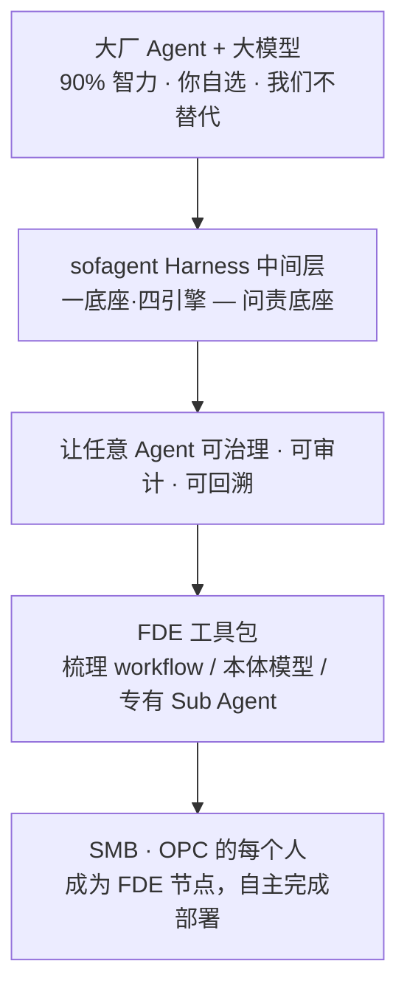
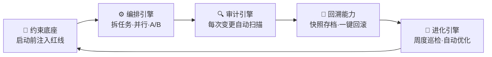
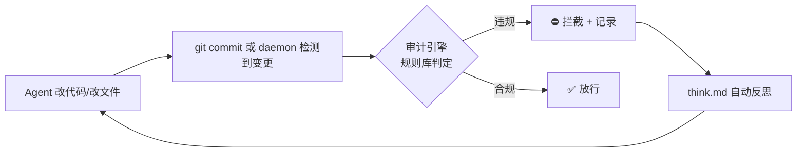
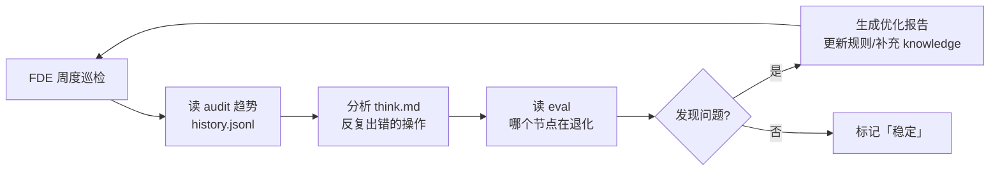

# sofagent Architecture

> 设计决策记录——从为什么存在、一底座·四引擎如何协作，到每个关键决策的工程理由。
> v1.1.6 · 2026-07-19（UTC）· 孔放勋


## 心智模型（先读这个）

> sofagent 是开源（MIT）的 FDE（前线部署工程）工具包。FDE 不是一款软件，而是一种能力——让任意大厂 Agent + 大模型在企业里可治理、可问责地落地。一底座·四引擎（约束底座 + 编排/审计/回溯/进化引擎）做问责底座，帮 SMB 与 OPC 的每个人，用自己选的 Agent 和模型，快速成为自己业务的 FDE。



## 目录

- [术语对照](#术语对照)
- [一、核心理念与架构全景](#一核心理念与架构全景)
- [二、一底座·四引擎设计](#二一底座四引擎设计)
- [三、部署与运行架构](#三部署与运行架构)
- [四、核心设计决策](#四核心设计决策)
- [五、已知局限与未来方向](#五已知局限与未来方向)
- [六、行业框架对齐](./ARCHITECTURE.md#六行业框架对齐研究如何印证-sofagent-架构2026-07-研读)

---

## 术语对照

| 引擎 | 英文 | 一句话 |
|------|------|------|
| 🧭 约束底座 | Constraint Base | 四层加载链，Agent 启动前注入红线 |
| 🔍 审计引擎 | Audit Engine | git diff + 文件变更硬证据审计（v1.1.0 拆独立包） |
| 🔄 回溯能力 | Restore Capability | 每次审计自动快照，`--revert` 一键回滚 |
| ⚙️ 编排引擎 | Orchestration Engine | 任务拆解 + Sub Agent 并行 + A/B 优化 |
| 🧬 进化引擎 | Evolution Engine | FDE 周度巡检 + 自动优化，v1.0.8+ |
| 加载链 | Load Chain | Agent 启动时注入的约束文件 |
| FDE | 一种能力（非岗位 title）——前线部署工程能力模型：掌握完整上下文、打破岗位边界、对结果负责 |
| Harness | Harness 中间层 | 挂在 Agent 之上的行为约束层（约束底座）：约束 + 审计 + 回溯 + 迭代 |
| Gateway | Gateway | 企业级 AI 统一入口（OpenClaw/DeepAgents），sofagent 不替代它 |
| Sub Agent | Sub Agent | 用 LangGraph + DeepAgents 搭的专有执行节点 |
| Ontology | 本体模型 | 企业的业务世界模型，FDE 帮你搭建并持续维护 |
| River | 交接产物（River） | FDE 离场时交接的产物集合：私有化评估 / Ontology 说明书 / 持续巡检配置 |
| SMB | 中小企业（Small & Medium Business） | 没有专职 AI 部署团队、想低成本具备 FDE 能力的企业 |
| OPC | 一人公司（One Person Company） | 个人或小团队，用自己的 Agent + 模型自主完成部署，不愿被单一厂商锁定 |

> 💬 **交互范式**：sofagent 没有图形界面。所有能力通过 MCP 协议暴露，用户通过 Agent 对话（LUI）操作——说一句话，它做完告诉你结果在哪。这是架构的根本设计约束：不存在「仅 CLI 可用」或「需要打开页面」的能力。详见 [设计哲学](./PHILOSOPHY.md)。

---

## 一、核心理念与架构全景

> 📖 **「为什么这么做」**见 [PHILOSOPHY](./PHILOSOPHY.md)。这里只讲架构设计——**怎么做的。**

sofagent 的架构基因来自 Geoffrey Huntley 的 Ralph 循环——「Agent 失忆，文件不失忆」。**不信任 Agent 自我报告，只看 git diff 硬证据。**

| 维度 | 通用 Agent 平台（OpenClaw/DeepAgents） | sofagent |
|------|------|------|
| 管什么 | 「会不会做」——能力问题 | 「能不能每次都做对」——执行控制问题 |
| 关系 | Gateway 高速公路 | 交规 + 测速摄像头 + 驾校教练 |

> **90%/10% 价值分层**：AI 模型提供 90% 的智力输出（写代码、做分析、生成报告），但企业敢不敢让 Agent 自主执行，取决于最后 10%——**可靠性、可追溯性、可问责性**。sofagent 的价值不在那 90% 里（那是模型的事），在那 10% 里（约束底座的事）。模型越强，纪律层越值钱——因为 Agent 能做更多事了，但"做错了怎么办"的代价也更大。

> 理论基础及行业验证见 [THANKS.md](./THANKS.md) 和 [PHILOSOPHY §四 信任模型](./PHILOSOPHY.md#四怎么管信任模型)。

### 治理架构（一底座·四引擎）



| 组件 | 设计原则 | 独立包 |
|------|------|:--:|
| 🧭 约束底座 | 四层加载链永远在线 | @sofagent/harness |
| 🔍 审计引擎 | 只看 git diff 硬证据 | @sofagent/audit |
| 🔄 回溯能力 | 事后快照 + `--revert` | @sofagent/core |
| ⚙️ 编排引擎 | DeepAgents + compose CLI | @sofagent/orchestrator |
| 🧬 进化引擎 | daemon cron @weekly | @sofagent/daemon + @sofagent/skillopt |

> 一底座·四引擎的完整设计哲学见 [PHILOSOPHY §三 架构全景](./PHILOSOPHY.md#三怎么跑架构全景)。

### 输出签名机制（v1.1.3）

Harness 中间件最大的挑战是存在感——引擎在正常工作，但用户看到好结果时不知道是 harness 层在起作用。v1.1.3 引入三层签名：

| 层级 | 机制 | 用户如何感知 |
|------|------|------------|
| 审计输出 | CLI / Webhook / MCP 所有返回值以 `[sofagent]` 开头 | 看到 `✅ sofagent 审计通过` 而非 `✅ PASS` |
| 能力清单 | `list_capabilities` description 标注引擎来源 | Agent 转述能力时附带"谁在做、怎么做的" |
| 审查报告 | LOOP 审查报告顶部签名段 | 报告第一行就是 `🔍 本报告由 sofagent 审计引擎 + 代码审查员 Agent 联合生成` |

签名不修改审计逻辑、不加速度开关——harness 层不允许关掉自己的存在感。

### 跨引擎关注点：持续感知层

签名解决的是"当下这一条结果是谁做的"。但 FDE 离场后，还有一个更长周期的问题：**客户 3-6 个月后是否还记得 FDE 部署了什么。**

这是 sofagent 的**持续感知层**——审计引擎产出证据，进化引擎生成报表，MCP 层负责推送。**FDE 的成功悖论是结构性的**：系统跑得越稳，客户感知越弱（详见 [FDE/FDE.md §13](../FDE/FDE.md)）。持续感知层是产品的必修课，不是营销策略。

> 📖 完整的感知衰减曲线 + 三层持续感知体系（定期价值证明 / 系统自曝复杂度 / 不可替代性标记）+ 配置方法见 [FDE §13 持续存在感机制](../FDE/FDE.md#13-竣工后持续存在感机制)。

### 地基与引擎

| 层 | 是什么 | 成本 |
|:--:|------|:--:|
| 地基 | 四层加载链（纯 MD 文件，Agent 读即生效） | ~3,500 token |
| 引擎 | 编排 + 审计 + 回溯 + 质评 + 进化 + 约束底座（daemon + CLI） | 按需启动 |

> v1.1.0 将审计引擎拆为独立 npm 包 `@sofagent/audit`，地基（约束底座）和其余引擎（编排/审计/进化）与回溯能力不受影响。

### 产品架构展望（五层）

| 层 | 部署在哪 | 干什么 | 状态 |
|:--:|------|------|:--:|
| **Harness 层** | Agent 上下文 | 纯 MD 文件，Agent 读即生效 | ✅ |
| **执行层** | 用户设备 | daemon 常驻进程——跨 session 经验不丢失 | ✅ |
| **审计层** | git 仓库 + 文件系统 | sofagent-audit——提交时审计 + 文件变更审计 | ✅ |
| **MCP 推送层** | 设备 MCP server | @sofagent/mcp 独立包 | ✅ |
| **协同层** | 多设备 + 云端 | Agent 独立身份、共享上下文、组织记忆 | v2.x |

> 📖 MCP resource 完整列表与 push target 配置见 [MCP 使用指南](./guides/mcp-usage.md)。

---

## 二、一底座·四引擎设计

### 🧭 约束底座

四层加载链（SKILL.md → fde.md → think.md → knowledge/）在 Agent 启动时自动注入。每层有不同权限：

| 层 | 文件 | 权限 | 加载时机 |
|:--:|------|:--:|------|
| 1 宪法 | SKILL.md | ❌ 不可修改 | 最先加载（开头注意力最高） |
| 2 规范 | fde.md | ✅ 可改 | 企业专属规则 |
| 3 反思 | think.md | ⚠️ 自动生成 | 上轮踩过的坑 |
| 4 知识 | knowledge/ | ✅ 积累 | 自动关联的 best practice |

OpenClaw 通过 Hook 精确注入，其他平台 Agent 主动 Read，v1.0.7+ Sub Agent 启动时自加载（`buildConstrainedSystemPrompt`）。

### 🔍 审计引擎

核心设计决策：**审计必须外置。** Anthropic 发现 Claude 内部存在 J-space——AI 自己知道控制不住自己。所以不信任 Agent 自我报告，只看 git diff 硬证据。



**证据分层**：git diff = 硬证据（不可绕过），Agent 日志 = 软证据（可伪造）。`--silent` 模式只跑纯 git-diff 规则，零依赖 Agent 配合。

> [Anthropic《When AI builds itself》](https://www.anthropic.com/institute/recursive-self-improvement)（2026-06）：工程师代码产出达 2024 年 8 倍后，人工代码审查成为新堵点。sofagent 的审计引擎把审查外置到 git diff 自动化——正是解这个瓶颈的方向。

**行业印证**：Palantir AIP 靠 Ontology 实现 Agent 可靠性——「根本接触不到 > 被告知不能说」与 sofagent 的 A15 约束验证 + 审计外置遵循同一原则（不依赖 Agent 自我报告，只看 git diff 硬证据）。

**Palantir 操作型本体论 ↔ sofagent 三层映射**：Palantir 的核心命题「语义必须与动力学配对」——本体不能只是知识库，必须是能干预世界的操作系统——与 sofagent 的 Ledger-Views-Policy 高度同构：数据集成 = Ledger 层（think.md append-only + audit history）、逻辑层 = Views 层（knowledge/ entities/concepts/comparisons/summaries）、操作层 = Policy 层（fde.md + SKILL.md）、读写回路 = Dream Cycle（v1.1.7 规划）、OAG 语义锚定 = Harness 约束底座。**核心差异**：Palantir 是集中式 SaaS 闭源操作系统，sofagent 是分布式 MIT 开源 Harness 中间件——让 Agent 自建本体，不由中央统一定义。

**「确定性与概率性分离」原则**——Palantir OAG 五层架构的核心理念，与 sofagent 审计引擎完全同构：刚性安全边界由确定性系统保障，不受 LLM 概率性输出影响。sofagent 的 16/21 条规则为纯 git-diff（不依赖 Agent 配合）正是这一原则的工程实现。

**审计引擎的双重定位**：

| 层级 | 做什么 | 行业对标 |
|------|--------|---------|
| 工程层 | 约束行为 + 变更审计 + 责任归属 | 事后护栏——每次变更都可追溯 |
| 叙事层 | Agent 责任确权底座 | **轻量级 KYA（Know Your Agent）**——Agent 的每一次行动都有加密签名凭证 + 不可伪造的硬证据链 |

在 agent-wrapping-agent 多层嵌套的架构趋势下（a16z 2026 研判），审计引擎不仅是「事后护栏」——它是 Agent 嵌套体系中的**一等架构评估层**：外层 Agent 在运行期评估子 Agent 的方法论质量（评估层定位，非运行时实时拦截；实时拦截治理仅限 v1.3.0 自派 SubAgent 沙箱），层层筛选合成高价值结论。审计引擎是这个评估层的基础设施。

> a16z 研判：智能体经济瓶颈从「智力」转向「身份」——非人类身份:人类 = 96:1，急需 KYA。审计引擎 + 约束底座 = 企业内部轻量版 KYA。v1.2.x 评估引入签名凭证做 Agent 行动的可审计绑定（身份层，**对所有 Agent 适用**）；凭证虚拟 key 中介（host 边界注入真凭证）在 v1.3.0 **仅限自派 SubAgent 沙箱**。

**审计引擎的三重身份**：Code Review 体系化实践中，Review / Verification / Gate 是三个独立环节——sofagent 的审计引擎同时承担三者：

| 环节 | 属性 | sofagent 对应 |
|------|------|--------------|
| Review（静态分析） | 模型读代码判断逻辑合理性，概率性 | A3/A4/A5/A7 等需理解意图的规则 |
| Verification（规则校验） | 固定校验流程，确定性 100% 可复现 | A1/A2/A9/A10 等纯 pattern 匹配规则 |
| Gate（决策管控） | 基于 Review+Verification 结果判断能否合并 | exit code 0/1/2 → 放行/WARN/阻断 commit |

> **设计原则**：Review Agent 默认不配代码执行权限——纯静态分析避免执行逻辑干扰审查客观性。sofagent 审计引擎同样零执行权限，只看 git diff 硬证据。

### 🔄 回溯能力（本质：git snapshot + revert 包装）

行车记录仪，不是安检——事后快照，不依赖任何平台：

| 结果 | 自动动作 | 用户看到什么 |
|------|---------|------------|
| ✅ PASS | 自动快照存档 | 静默 |
| ⚠️ WARN | 存档 + 标记 | daemon-notice.md 告警 |
| ❌ FAIL | 存档 + 建议回滚 | Webhook + 终端标红 |

```bash
sofagent-audit --timeline     # 快照时间线
sofagent-audit --revert SHA   # 回滚到任意快照
```

daemon 自动清理 30 天前旧快照。Webhook 配置在 `.sofagent/config.yml`。

### ⚙️ 编排引擎

大任务拆小、多 Sub Agent 并行、A/B 对比找更优方案。基于 DeepAgents，`sofagent-orchestrator compose --task` CLI 入口——任何 Agent 平台都能用。

**为什么是 Skill + 脚本 + Runtime**：
| 什么事 | 谁来做 | 为什么 |
|------|------|------|
| 判断（评分、反思、选模板） | Skill（MD prompt） | LLM 长项——模式识别 |
| 机械操作（文件读写、API） | 脚本（bash） | 确定性操作 |
| 硬安全（加载链、断路器） | Runtime（OpenClaw） | Agent 失控时没法自己管自己 |

**编排收敛条件**：目标必须可验证（有量化标准）+ 模型可自主判断。Maker-Checker 分离是收敛前提——同一 Agent 自验覆盖仅 7-33%，分离为独立审查后提升至 73%。

**工具集设计约束**：每个 Sub Agent 的工具集应零重叠、无歧义——工具功能描述不能模糊交叉。当工具数上百时，瓶颈不在模型推理而在工具描述歧义。v1.1.0 daemon 工具注册将做静态重叠检测。

**为什么多 Agent 协作 > 单强模型**：来自 Apple Dex RSI 训练团队的一手观察——基于 self-attention 架构的固有局限，单模型处理超长上下文有不可逾越的上限。多 Agent 协作（分治验证 + 多路径冗余 + 记忆机制）效果远超单强模型。核心推论：**工程化能力具备独立于模型基础能力的护城河**，不会被通用模型迭代轻易覆盖。sofagent 的编排引擎（Sub Agent 分治 + Maker-Checker 分离）正是这个理论的产品化落地。

**解题/验证分离**：RSI 研究表明，同一 Agent 自验覆盖率仅 7-33%，分离为独立验证后提升至 73%。这与审计引擎的"不信任 Agent 自我报告"原则同构——解题 Agent 和验证 Agent 必须物理隔离，验证是核心基因，需分领域（代码用单测、数学用形式化证明、非标准领域用多 Agent 协作）。

> 💡 **Agent 粒度判定（X4）**：单请求内被调 >3 次的 Agent 合并到上游；日均调用 <5 次的 Agent 标记僵尸预警——防纳米 Agent 膨胀。
>
> 📖 来源：31 篇行业笔记跨批研读（2026-07-20）

### 🧬 进化引擎

FDE 部署完成后转为**持续优化角色**。daemon cron @weekly 自动巡检审计趋势 + 反思记录，发现退化就优化。



---

## 三、部署与运行架构

<a id="dual-node-architecture"></a>

### 双节点架构

sofagent 支持两种节点类型：

| 维度 | 自动运行节点 | 个人增强节点 |
|------|------|------|
| **场景** | 企业无人值守设备 | 个人开发者（WorkBuddy/Codex 等） |
| **OpenClaw** | ✅ 必须 | ❌ 不需要 |
| **编排调用** | OpenClaw 内部 API | `sofagent-orchestrator compose --task` CLI |
| **约束注入** | OpenClaw Hook 精确注入 | Sub Agent 自加载（`buildConstrainedSystemPrompt`） |

> Sub Agent 约束自加载：启动时读 `.sofagent/` 下的约束文件，拼装为 system prompt。纯文件系统操作，不依赖任何 Agent 平台的 Skill 系统。换平台约束不丢。

### River — Workflow — Subagent 三层架构

**River = 多个 Workflow（管网）的集合**——每段管网（Workflow）把模型能力（水）引到业务侧，汇入同一条大河（River），从头到尾同一个身份、同一段上下文。

Work模板市场 的实现规范见 [work模板市场/SPEC.md](../work模板市场/SPEC.md)（混合架构：外层 `workflow.yml` Graph 骨架锁步骤 + 内层 ReAct 节点）。

```
用户 → River（统一入口）→ Workflow A/B/C（管网分发）→ Subagent（水龙头，执行）
              ↑ 回流                                    ↑ 审计引擎
```

| 层 | 是什么 | 类比 |
|------|------|------|
| **River** | 统一 Agent 入口 | 大河——只有一个入口 |
| **Workflow** | 任务编排方案 | 管网——把水引到业务侧 |
| **Subagent** | 执行具体能力的 Agent | 水龙头 / 用水设备——让水真正作用 |

River 的载体是 OpenClaw + sofagent + Channel 集成。sofagent 不做 River 本身（堤坝，不是河床），而是确保 River 里的每一个 Sub Agent 都有纪律、可追溯、会反思。

> 🏞️ **一条河的比喻**：水 = 模型（不受控的 AI 能力，像水会泛滥）；堤坝 = sofagent 约束层（外在守卫，让河水不侵蚀城市）；管网 = Workflow（把能力引到业务）；水龙头 / 用水设备 = Subagent（让能力真正作用）；城市 / 企业 / 工厂 / 社区 = 业务环节；市政管网规划 = Ontology（规划水怎么被用到业务里）；蓄水池 = AI 知识库（河跑起来后自动积累的记忆）。大厂建江+供水（AI 中台 = 江，模型 = 水），我们做堤坝+管网+水龙头。详见 [FDE §9.6](../FDE/FDE.md#96-river企业统一-agent-入口)。

> **Workflow 的混合架构**：每条 Workflow 采用「外层 Graph 骨架 + 内层 ReAct 节点」——`workflow.yml` 的 `nextNodes` 锁定全链路步骤、保证可追溯（对应行业笔记中的「Graph 实现全局流程骨架」），单个节点的 `prompt` 保留模型自主规划能力（对应「内层 ReAct Agent」）。这一设计兼顾全局稳定性与局部灵活性：低容错业务靠 Graph 锁死流程，复杂节点靠 ReAct 保灵活。详见 [work模板市场/SPEC.md](../work模板市场/SPEC.md)。

### Agent 基础设施层（v1.0.8+）

两个内置 Agent 被所有 workflow 节点引用：

| Agent | 管什么 | 触发时机 |
|------|------|------|
| **合规审计员** `@sofagent-audit` | 管底线——P0/P1 分级 | 每次 commit / FDE 部署 / LOOP 闭环 |
| **FDE 部署工程师** `@sofagent-fde` | 管上限——deploy/sustain | 部署时 / daemon cron @weekly |

Agent 定义在 `agents/SKILL/{name}/SKILL.md`，`parseSkillMd()` 读 front matter 作为身份标签，body 注入 DeepAgents 作为 role prompt。

### OpenClaw 在架构中的角色

**审计层不需要 OpenClaw**——sofagent-audit 是独立 TypeScript CLI，输入 git diff，输出 exit code。即使不装 OpenClaw，`npm install -g @sofagent/audit` 配 commit-msg hook 就能让任何 Agent 平台的提交经过审计。

**编排层当前走 DeepAgents**——`compose --task` CLI 入口，任何 Agent 平台都能用。迁移路径：ao → DeepAgents（v1.0.7 完成，ao 已退役）。

### 文件系统审计

v1.0.8+ daemon 监控文件变更，非开发者也能用审计：

| 维度 | git commit 审计 | 文件系统审计 |
|------|------|------|
| 触发 | 用户主动 commit | daemon 自动检测 |
| 拦截 | ✅ 阻断 commit | ❌ 事后告警（已改完） |
| 需要 git | ✅ | ❌ 内嵌 isomorphic-git |

事后审计是平台无关性的前提——实时拦截需深度集成平台，一旦集成丧失第三方独立性。v1.0.8 daemon 让事后审计达到准实时（fs.watch → 2 秒防抖 → 立即审计）。因此**实时拦截 / 运行时治理仅限 sofagent 自派 SubAgent**（sofagent 起环境又发凭证、天然拥有执行边界）；主 Agent 由第三方平台运行，sofagent 不进其执行环，保持事后审计（详见 ROADMAP「范围铁律」）。

---

## 四、核心设计决策

### 设计原则

sofagent 的四条设计原则，每条背后有独立的理论/工程/经济学论证：

| 原则 | 含义 | 工程体现 |
|------|------|------|
| **状态最贵** | CS 两大难题都指向状态——缓存失效和命名 | Ralph Loop 无状态范式：Agent 失忆，文件不失忆 |
| **模型输出是提案** | 大模型是带噪声的随机过程——不消除随机性，用循环驯化 | git diff + 审计规则 = 适应度函数 |
| **先有掌控感再自动化** | 不信任 Agent 自我验证 | Maker-Checker 分离：审计引擎独立于 Agent |
| **90%/10% 价值分层** | 模型完成 90% 常规任务，剩余 10% 高风险场景价值反升 | 约束底座占据高价值 10%——模型越强，约束越值钱 |

> **历史转折（v0.98）**：sofagent 最初走「事前约束」路线——在 Agent 干活前注入规则，指望它自律。两次 200 次对照实验后放弃：不是约束无效，是实验室测不出来。转向「事后审计」路线——git diff 是客观证据，不依赖实验设计。这次转向定义了 sofagent 的立身之本：**不信任 Agent 自我报告，只看文件 diff 硬证据。**

### 四层加载链：为什么是这个顺序

| 层 | 文件 | 权限 | 位置原因 |
|:--:|------|:--:|------|
| 1 | SKILL.md（宪法） | ❌ 不可改 | 最前面——开头注意力最高 |
| 2 | think.md（反思） | ⚠️ 自动生成 | 中间——提醒上轮踩坑 |
| 3 | fde.md（规范） | ✅ 可改 | 最后——末尾注意力最高 |

三层之外还有 knowledge/（第四层，按需加载 top-N）。加载链总占用不超过上下文窗口的 3%，500 字原则（每份文件 ≤500 字）是 Agent 压缩后可读的最低保证。

### 反认知投降的制度设计

当 AI 能力过强时，人类会不自觉进入「认知自动驾驶」。sofagent 的三道制度护栏：

| 护栏 | 防什么 | 怎么防 |
|------|--------|--------|
| fde.md 规则可随时覆盖 | AI 判断替代人类意志 | 人类写一条规则，AI 必须遵守 |
| 编排方案可回滚 | AI 方案先斩后奏 | 人类不确认，编排不执行 |
| 审计引擎独立于 Agent | AI 自己验收自己 | git diff 硬证据，Agent 无法篡改 |

### 文件系统架构

理由：`cat task/logs/` 就能拿到记录，不需要 SQL/连接串/权限管理。天然可审计、可传输、支持 Git。Ledger-Views-Policy 三层映射：task/logs + think.md = Ledger（原始数据，只追加）→ knowledge/ = Views（派生视图）→ fde.md = Policy（读写规则）。

> 记忆模型的完整契约（追加不变量、多写入方、派生方向单向）以 `docs/PHILOSOPHY.md` §五 为唯一权威文字定义，并以 `@sofagent/core` 的 `memory-contract.ts` 在代码层强制（路径 `getThinkPath()`、只追加写入点 `appendThinkEntry()`）。本文件仅描述架构映射，不重复定义契约。

### 模型选择

默认推荐 DeepSeek：不碰 SaaS（API 模式数据不经过第三方）、成本可控（Loop 额外消耗 <1 美分）。模型选择是开放的——Flash 干粗活、Pro 干细活，按成本 4:1 分配。

### 编排收敛与 A/B 测试

编排是 Loop 工程——任务到达后持续迭代至收敛。收敛条件：目标可验证 + 模型可自主判断。A/B 对比走确定性指标（运行次数、违规率、步数、通过率），不由 Agent 主观判断。连续胜出 2 次自动 promote。

| 收敛反例 | 为什么不行 |
|------|------|
| 「优化页面美观度」 | 不可量化，Loop 会跑十几小时无法收敛 |
| 同一 Agent 自验 | 覆盖率 7-33%，裁判运动员同一人 |
| Maker-Checker 分离后 | 覆盖率提升至 73% |

---

## 五、已知局限与未来方向

**已知局限**：18 条详见 [LIMITATIONS.md](../LIMITATIONS.md)。核心：Harness 层自身在上下文里、加载链步进脆弱性、Skill 自进化处于经验记录阶段。

**未来方向**：
- **v1.1.0**：审计引擎拆独立包 `@sofagent/audit` + 轻量多设备经验共享（[同步指南](./guides/multi-device-sync.md)）+ daemon 主动巡检
- **v1.2.x**：完整多设备协同——Agent 独立身份 + 跨设备审计聚合 + 场景驱动权限 + 代理网关硬边界
- **v2.x**：组织级共享记忆 + 协同层

**daemon 主动巡检清单**（`sofagent/daemon/src/inspectors/`，注册于 `runInspectors()`）：

| Inspector | schedule | 检查内容 |
|-----------|----------|---------|
| audit-history | @daily | 审计历史健康度（exit code 分布 / 高频 WARN 规则） |
| conflict-check | @weekly | knowledge 矛盾（critical）/ 孤儿（warning）/ 死链（warning） |
| doctor-health | @daily | daemon 自身运行状态（plist / fs-watch / 依赖） |
| knowledge-freshness | @weekly | knowledge/ 30 天以上未更新提醒 |
| knowledge-health | @weekly | knowledge 健康：孤立/重复（normalized-key）/断链/index 过旧（>24h）/缺源（warning，fail-closed 只读，报告落 health-report.md） |
| skill-staleness | @weekly（默认禁用） | Skill 陈旧度（需 eval 数据支持） |
| warn-accumulator | @daily | 连续未处理 WARN 累积（阈值 3，含文件级追踪） |

> **范围声明**：sofagent 是 Harness 中间件——覆盖行为约束 + 变更审计 + 经验沉淀 + 持续优化。不覆盖**主 Agent 平台**本身（IM 渠道 / 第三方平台托管的沙箱（如 OpenClaw 沙箱）/ 工具调用——OpenClaw/DeepAgents 的事），也不覆盖运维层（监控/告警/重启/日志轮转）。**例外**：v1.3.0 起 sofagent 托管**自派 SubAgent** 的隔离运行时（文件系统隔离 + 网络出站白名单 + 工具调用中介 + 虚拟 key 边界注入），因 sofagent 既起环境又发凭证、天然拥有执行边界。**运行时治理仅限自派 SubAgent，主 Agent 永远事后审计**（详见 ROADMAP「范围铁律」）。Cloudtag 类全栈产品管从 Agent 到权限的全部层，sofagent 管其中可独立标准化的约束+审计层——不管企业用什么 Agent 平台，sofagent 是第三方独立底线守卫。

---

## 六、行业框架对齐：研究如何印证 sofagent 架构（2026-07 研读）

> 这一节把 31 篇研读里与 sofagent 架构**结构上对齐**的框架（Palantir Ontology / Action Type / AIP / Onyx）逐条印证——不是发明新架构，是验证已有架构选型的行业合理性。

### Ontology = 共同理解层 / 翻译层（A1）

Ontology 的本质是「**翻译而非统一**」——在多个异构 Agent / 系统之上建立共同参照系，让彼此能对话，同时保留各系统内部语境独立；它 ≠ 数据模型 / ≠ ER 图 / ≠ 知识图谱（知识图谱只能查不能操作，Ontology 还能在对象上**触发操作**）。核心关键词是「操作」而非「数据」。保留现有「本体即认知底座」比喻，新增：「本体 = 运行时语义层」——它是在 Agent 跑任务时实时提供「谁依赖谁、谁能看什么、能触发什么」的语义上下文，是介于模型与业务系统之间的**活的中间层**。

> 📖 来源：31 篇行业笔记跨批研读（2026-07-20）

### Action Type 七步管线（A2）

Action Type = 一个**有身份的变更请求**：携带参数 + 校验 + 权限 + 前后置函数。执行走七步管线，每步独立审计、可回滚：

| 步骤 | 做什么 | 审计点 |
|------|------|------|
| 1 权限检查 | 调用方是否有权触发该 Action | 谁、什么角色 |
| 2 参数解析 | 解析入参，类型 / 范围校验 | 参数合法性 |
| 3 业务校验 | 业务规则前置校验（如余额充足） | 规则命中 |
| 4 前置函数 | 执行前钩子（锁资源 / 记日志） | 副作用前置 |
| 5 核心执行 | 真正改业务状态 | 变更内容 |
| 6 后置函数 | 执行后钩子（通知 / 触发下游） | 副作用后置 |
| 7 物化回写 | 落库 + 广播结果 | 落库证据 |

这正是 sofagent「堤坝 = 约束层」的工程实例化——约束不是一段 prompt，而是嵌在变更请求管线里的七道闸。

> 📖 来源：31 篇行业笔记跨批研读（2026-07-20）

### 权威归属三原则（A3）

| 原则 | 含义 | sofagent 落点 |
|------|------|------|
| **Backend as Source of Truth** | 语义层不拥有数据，只映射视图 | Ontology（objects/actions/constraints）是业务系统的只读映射，不替代后端 |
| **谁创建谁拥有** | 资源的写权限归创建方，Permission 受控开放 | knowledge/ 由对应节点 owner 维护，跨域访问走 knowledge-domain 白名单 |
| **行级权限** | 权限精确到单条数据行 | Object Security Policy，约束层对单条实体的读 / 写 / 触发做精细控制 |

这三条注入 sofagent 的 Policy 层，避免「语义层想管一切」导致的权限失控。

> 📖 来源：31 篇行业笔记跨批研读（2026-07-20）

### Notification 事件驱动协作（A6）

多 Agent 经**事件总线 / Notification 接力**协作，而非直接点对点互相调用。这与「一条河事件总线」天然契合——River 是统一入口，节点之间通过 Workflow 拓扑的数据回流（事件）传递，不直接硬连调用路径。好处：调用路径不动态化，治理不失控（谁触发了谁、谁该被审计，始终在总线上可见）。

> 📖 来源：31 篇行业笔记跨批研读（2026-07-20）

### Onyx 四阶段闭环（L1）

可见性（Visibility）→ 仿真（Simulation）→ 执行（Execution）→ 学习（Learning），是外层 Loop 的现成叙事模板：先让企业看见 AI 能干什么（沙箱仿真）→ 人工审核确认 → 写回业务（执行）→ 沉淀经验（学习）。sofagent 的「先跑通后沉淀 Skill」「定期价值证明」正对应这一闭环。

> 📖 来源：31 篇行业笔记跨批研读（2026-07-20）

### 人类审批双模式（L2）

| 模式 | 触发 | 运行时策略 |
|------|------|------|
| 高风险人工确认 | 钱 / 权益 / 合规 / 人事 / 医疗 / 法律 | 每次触发走 human-in-the-loop，确认后才执行 |
| 常规受信自动执行 | 低风险的只读 / 强化类动作 | 受信自动执行，事后审计留证 |

这具象化了 Loop 内层 human 节点的运行时策略——不是「所有动作都等人」，而是按风险分级。

> 📖 来源：31 篇行业笔记跨批研读（2026-07-20）

> 💡 **协议 Adapter 封装（X7）**：中间件应在底层封装 MCP / A2A / ACP 协议差异，上层语义层（Ontology / Action Type）不感知底层协议——对齐 sofagent「合的框架」定位：企业换 Agent 平台，约束与审计不动。
>
> 📖 来源：31 篇行业笔记跨批研读（2026-07-20）

> 💡 **实现参考（X8 / X9）**：指令层用 Jinja2 变量槽渲染 `prompts/`（把企业规则注入为可填充模板）；校验层用 JSON Schema 三步校验（格式 → 完整性 → 约束）；经验法则——首次因 AI 格式问题排查超 1 小时，就该上校验层（把概率性输出收口到确定性 schema）。
>
> 📖 来源：31 篇行业笔记跨批研读（2026-07-20）

### 行业五层骨架 → sofagent 三层架构映射（A5）

对外主叙事用 sofagent 自有**三层架构**；行业「五层骨架」（配置 / 知识 / 指令 / 校验 / 编排）作为映射并存，吸收其「确定性迁移」哲学，但**不对齐为强制模板**（研读批3 明确「选入口而非复制后删减」，避免空目录技术债务）。

sofagent 自有三层：

| 层 | 是什么 | 行业五层中对应 |
|----|--------|----------------|
| **约束底座（Harness / Constraint Base）** | 四层加载链（SKILL.md→fde.md→think.md→knowledge/）+ 审计 / 回溯引擎 | 配置 + 指令 + 校验 |
| **知识层（Knowledge / Ontology）** | knowledge/ + 本体模型（FDE 在客户侧交付的业务资产，见 FDE/FDE.md 知识层归属） | 知识 |
| **编排层（Orchestration / Loop）** | 编排引擎 + 进化引擎 + 外层 LOOP | 编排 |

逐层映射：

| 行业五层 | 数据流口诀 | 落到 sofagent 哪一层 / 哪部分 |
|----------|------------|-------------------------------|
| 配置 Config（决定用什么） | 配置决定用什么 | 约束底座 · `.sofagent/config.yml` + SKILL.md / fde.md 的配置约束 |
| 知识 Knowledge（知道什么） | 知识知道什么 | 知识层 · knowledge/ + 本体模型（FDE 交付，Harness 只挂载 / 校验） |
| 指令 Instruction（怎么说） | 指令怎么说 | 约束底座 · 四层加载链即「指令」载体（prompt 注入 Agent 上下文） |
| 校验 Validation（对不对） | 校验对不对 | 约束底座 · 审计引擎 + 约束规则（硬约束，AI 绕不过） |
| 编排 Orchestration（先干什么后干什么） | 编排先干什么后干什么 | 编排层 · 编排引擎 + 进化引擎 + LOOP |

**同构点**：五层里**仅指令层直接调 AI**，其余四层为 AI 铺路；sofagent 亦然——只有「知识 / 指令」承载概率性 AI，约束 / 校验 / 编排全部落在确定性引擎。这正是「约束层 = Harness 中间件」的骨架级印证：对外讲我们自己的三层，行业五层做映射而不喧宾夺主。

> 📖 来源：31 篇行业笔记跨批研读（2026-07-20）
