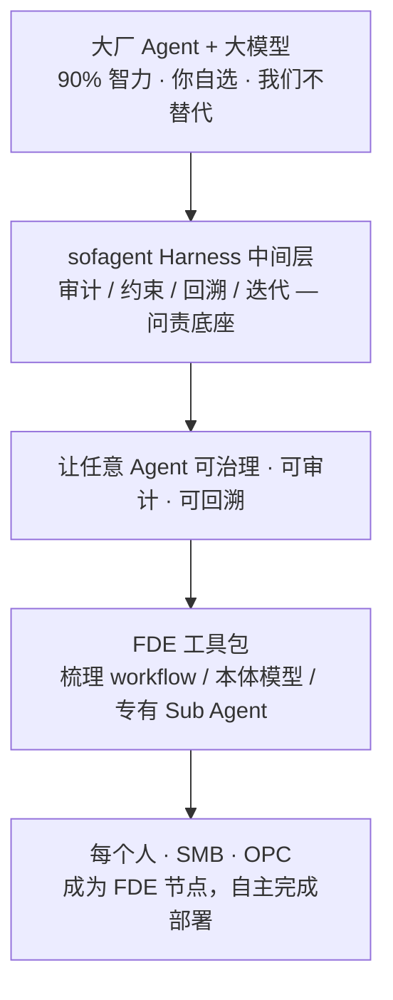

# sofagent · 新手上路（ONBOARDING）

> 开源（MIT）FDE 工具包 · 一句话：让每个人、SMB 与 OPC 都能成为 FDE，用自己的大厂 Agent + 模型自主完成部署。
> v1.1.4 · 2026-07-19 · 孔放勋

如果你是第一次接触 sofagent，或是来评估方案 / 来贡献代码的，先花 5 分钟读这篇，能省掉后面所有误解。

## 我们是什么

sofagent 是一套**开源（MIT）的 FDE（Frontline Deployed Engineer，前线部署工程）工具包 + Harness 中间层**。

- **不造 Agent**：你用哪家大厂的 Agent 和模型都行（OpenClaw / WorkBuddy / Codex / Claude Code…），sofagent 挂在上面做问责底座。
- **四个引擎是工具包的核心能力**：审计 / 约束 / 回溯 / 迭代——单独拿任何一个出来都没有意义，合起来才构成 FDE 的杠杆。
- **目标是赋能，不是卖软件**：让每个人、每个 SMB（中小企业）与 OPC（私有组织 / 客户）都能快速成为 FDE，用这套工具包**自主完成自己的部署工作**，成为被项目赋能的 FDE 节点。

## 心智模型

## 三个最常见误解

| ❌ 误以为 | ✅ 实际是 |
|------|------|
| 这是个 Git 审计安全工具 | 审计引擎只是 FDE 工具包的四个引擎之一 |
| 这是要跟大厂 Agent 竞争 | 我们**不造 Agent**，骑在大厂 Agent + 模型之上做问责底座 |
| 这是卖软件的 | 这是**开源（MIT）工具包**——目标是让每个人、SMB 与 OPC 都能成为 FDE |

## 你属于哪类人

- **个体 / 一人团队**：想让自己的 Agent 跑得可控、可审计、可回溯 → 装工具包，照 FDE 流程给自己部署。
- **SMB（中小企业）**：没有专职 AI 部署团队，想低成本具备 FDE 能力 → 用工具包梳理 workflow、搭本体、部署 Sub Agent。
- **OPC（私有组织 / 客户）**：有内部部署需求但不想被单一厂商锁定 → 选厂商中立的 Harness 底座。

## 怎么开始（成为 FDE 节点）

1. 读 [FDE/FDE.md](./FDE/FDE.md) 的四阶段流程（进场 → 挖掘 → 交付 → 离场）。
2. 读 [docs/ARCHITECTURE.md](./docs/ARCHITECTURE.md) 理解五个引擎怎么协作。
3. 读 [docs/PHILOSOPHY.md](./docs/PHILOSOPHY.md) 理解「为什么这么做」。
4. 动手部署：参考 [FDE/fde-install.sh](./FDE/fde-install.sh) 与 [LOOP/loop-install.sh](./LOOP/loop-install.sh)。

> 具体安装与命令以对应脚本和文档为准，本文只讲定位与路径。

## 术语速查

| 词 | 含义 |
|----|------|
| FDE | 前线部署工程 / 能力模型——掌握完整上下文、打破岗位边界、对结果负责 |
| Harness | 挂在 Agent 之上的中间层，做行为治理（约束 + 审计 + 回溯 + 迭代） |
| Gateway | 企业级 AI 统一入口（OpenClaw / DeepAgents），sofagent 不替代它 |
| Sub Agent | 用 LangGraph + DeepAgents 搭的专有执行节点 |
| Ontology | 企业的本体模型 / 业务世界模型，FDE 帮你搭建 |
| River | FDE 离场时交接的产物集合（私有化评估 / Ontology 说明书 / 持续巡检配置） |
| SMB | 中小企业（Small & Medium Business） |
| OPC | 私有组织 / 客户（Other Private Client / Org）——有内部部署需求、不愿被单厂商锁定的主体 |

## 相关文档

- [README.md](../README.md) — 项目总入口
- [FDE/FDE.md](./FDE/FDE.md) — FDE 能力模型与四阶段流程
- [docs/ARCHITECTURE.md](./docs/ARCHITECTURE.md) — 架构与设计决策
- [docs/PHILOSOPHY.md](./docs/PHILOSOPHY.md) — 设计哲学
- [ROADMAP.md](../ROADMAP.md) — 路线图
- [docs/COMMUNITY.md](./docs/COMMUNITY.md) — 社区与贡献
