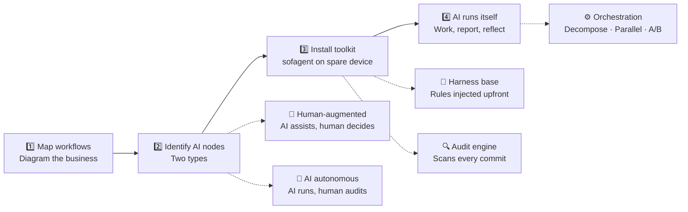
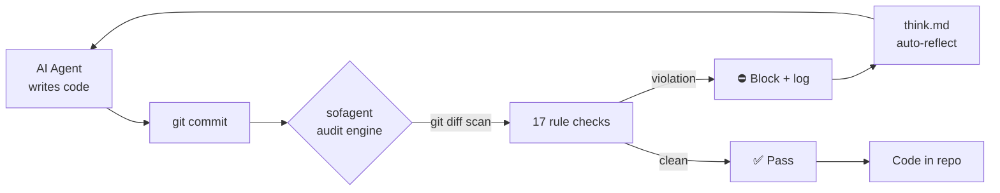

# sofagent

[中文](./README.md) | English

> This is an abridged version. See [中文版](./README.md) for full documentation.

<p align="center">
  
</p>

<p align="center">
  <strong>sofa + agent = sofagent / 沙发特工</strong><br/>
  <em>We don't just "connect AI" — we help businesses "use AI right."</em>
</p>

<p align="center" style="color:#64748B;font-size:14px;">
  FDE toolkit for SMBs and OPCs<br/>
  Harness base manages behavior, audit engine watches results, orchestration engine gets work done
</p>

<p align="center">
  <a href="https://github.com/KongFangXun/sofagent/actions/workflows/verify.yml"></a>
  <a href="../LICENSE"></a>
  <a href="../CHANGELOG.md"></a>
</p>

---

## Why sofagent?

95%+ of SMBs hit the same three walls:

| 🚫 Expectations too high | 🔧 Tech-led, not biz-led | 👻 Deploy and forget |
|:--|:--|:--|
| Bought a pile of AI tools, expected magic. AI is capable — but no one mapped the workflows first | Engineers can't see business nodes. AI adoption isn't an IT project — it's business transformation | No one knows if AI is doing a good job. Behavior unconstrained, results unaudited — accountability evaporates |

**What sofagent does**: FDE is like a foreman leading AI workers — onboard, map workflows, identify AI nodes, install the toolkit, and let AI run. No consultants, no dedicated AI team.

---

## Install

```bash
npm install -g @sofagent/audit && sofagent-audit --init
```

Edit a file, commit, and watch the audit hook fire:

```bash
echo "API_KEY=sk-123456" > .env && git add .env && git commit -m "test"
# → ⛔ A1 sensitive files: .env contains key pattern, commit blocked
```

> Requires Node.js ≥ 18 + bash + git. Full macOS/Linux support, Windows experimental. [Full install guide](./HANDBOOK.md)

---

## How FDE works

FDE (Forward Deployed Engineer) follows four steps:



Step 2 is the key — not every step should be fully automated:

| Node type | How it runs | Human's role | sofagent's role |
|------|------|------|------|
| 👤 **Human-augmented** | AI drafts, human approves | Decide, judge, sign off | Harness keeps AI in bounds, audit logs every suggestion |
| 🤖 **AI autonomous** | AI runs end-to-end independently | Review audit reports, spot-check | All three engines: constrain → execute → audit → reflect |

No consultants. No AI team. FDE onboards, deploys, leaves — the AI nodes keep running.

### How the audit engine watches



The audit engine doesn't trust the agent — it trusts git diff.

### Three engines

| | 🧭 Harness | 🔍 Audit | ⚙️ Orchestration |
|------|------|------|------|
| **Does** | Injects rules into agent context | git diff → 17 rules → exit code | Decompose → template → parallel → A/B |
| **Runs on** | Constitution + reflection + norms layers | git pre-commit hook, every commit | FDE generates workflow; periodic re-optimization |
| **Platform** | Any platform | Any platform | OpenClaw only |
| **TL;DR** | Know red lines before starting | Can't deny what was changed | Self-improving pipeline |

> 🆕 **v1.0.5**: Ontology Layer · Work模板市场 · Agent Dashboard · Atomic writes · Fail-closed · A9 scored safety

---

## vs. existing tools

| | sofagent | detect-secrets | pre-commit hooks |
|------|:--:|:--:|:--:|
| Secret detection | ✅ | ✅ | ❌ |
| Agent boundary violations | ✅ | ❌ | ❌ |
| Injection attack detection | ✅ | ❌ | ❌ |
| Process compliance | ✅ | ❌ | ❌ |
| Knowledge-base cross-domain | ✅ | ❌ | ❌ |
| Config deletion detection | ✅ | ❌ | ❌ |
| Setup | One command | One command | Manual rules |

---

## Does it work?

> 🔬 Hugging Face legal-agent benchmark: same model, harness-only optimization — score jumped from 3.5% to 80.1% (76-point gain, matching Claude Sonnet at 1/7 the cost). [Details](./ARCHITECTURE.md)

- Core logic: **470+ tests all green** (diff-parser / config-loader / rules A1-A15 / reporter)
- 15 audit rules (11 default + 4 extended + 2 experimental)
- MIT license — use code, docs, and templates freely

> ⚠️ Orchestration engine requires OpenClaw. [Known limitations](./LIMITATIONS.md)

---

## Which do you need?

| Your scenario | Use |
|---------|------|
| Just block secret leaks | `npm install -g @sofagent/audit` is enough |
| Full agent behavior management | Audit engine + harness base (install.sh) |
| Automatic task orchestration | + orchestration engine (needs OpenClaw) |

---

## Further reading

| You want | Read |
|---------|------|
| Install, use, FAQ | [HANDBOOK](./HANDBOOK.md) |
| Design rationale | [ARCHITECTURE](./ARCHITECTURE.md) |
| Security | [SECURITY](../SECURITY.md) |
| Known limitations | [LIMITATIONS](./LIMITATIONS.md) |
| Roadmap | [ROADMAP](../ROADMAP.md) |
| Contributing | [CONTRIBUTING](../CONTRIBUTING.md) |
| Enterprise deploy (FDE + Work模板市场) | [FDE/](../FDE/) \| [Work模板市场](../work模板市场/) |

---

## Contributing

Issues and PRs welcome — especially the critical kind. [CONTRIBUTING.md](../CONTRIBUTING.md) · [Credits](./THANKS.md)

> My name is KongFangXun, a product manager who knows just enough frontend to be dangerous. sofagent's code is written by AI models; I make product decisions and do the final review. Every release is reviewed by an independent model.
