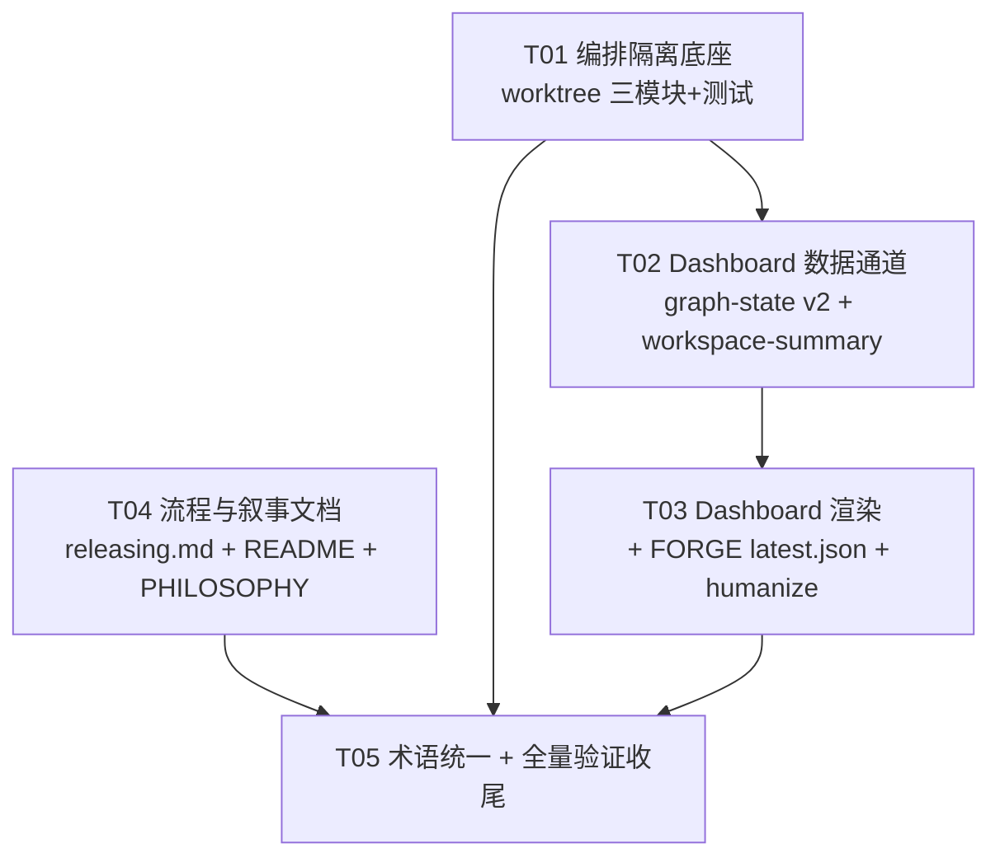

# sofagent v1.2.3 系统设计评审与任务分解

> 架构师：Bob（高见远）· 2026-07-30
> 输入：v1.2.3 dev prompt（8 交付项）+ `docs/changelog/v1.2/v1.2.3.md` 规划稿（494 行）
> 方法：通读 `engine/orchestrator/src/loop/`（plan-node / graph / nodes / state）、`tools/sofagent-dashboard.sh`（690 行）、`engine/daemon/src/`、`FORGE/src/`（driver / visibility / progress-middleware）、`docs/changelog/releasing.md`，并对关键疑点做了磁盘级实证。

---

## Part A · 系统设计评审

### 1. 现状核实（12 条关键事实）

以下每条都在源码/磁盘上验证过，是后续设计决策的事实基础：

| # | 事实 | 证据 |
|---|------|------|
| F1 | `writeGraphState()` 现为 3 字段（activeNode / workGraphTasks / updatedAt），写到 `{dataDir}/dashboard/graph-state.json` | `plan-node.ts:49-80` |
| F2 | **路径 bug 实锤**：`loadEnvConfig().dataDir` 在仓库内解析为 `cwd/.sofagent`（fallback 规则），实测 `graph-state.json` 落在 `仓库/.sofagent/dashboard/`；而 dashboard.sh 读 `$SOFAGENT_HOME/data/dashboard/`（`~/.sofagent/data/dashboard/` 下只有 daemon-health.json）。两端差一层，Dashboard 永远读不到 | `config-loader.ts:546-578` + 磁盘实测 |
| F3 | **LOOP 拓扑是串行 5 节点链**（plan→engineer→audit→reviewer→human_confirm），无任何并行调度点；engineer 串行消费 subtasks（每轮取第一个 pending） | `graph.ts:159-192`、`nodes.ts:747-785` |
| F4 | **命名撞车**：`ab-scheduler.ts` 的依赖注入里也有一个 `writeGraphState`（签名 `(loopId: string) => string`，写 A/B 历史图），与 plan-node 的 dashboard 落盘函数同名不同物 | `ab-scheduler.test.ts:121,140` |
| F5 | FORGE 已有完整可见性：L1 `status.json`（visibility.mjs，phase/round/counts 快照）+ L2 `sub-progress-<role>.jsonl`（progress-middleware.mjs，工具调用/心跳）。嵌套路径为 `data/forge-runs/fresh-eyes-loop/<日期>/<run-id>/round-XX/` | `visibility.mjs`、`progress-middleware.mjs:91` + 磁盘实测 |
| F6 | dashboard.sh 的 `render_graph_engine()`（L558）是**三栏之外的全宽底部区块**——新面板应沿用此模式，绝不塞进三栏 paste 拼接区（ANSI 对齐噩梦） | `sofagent-dashboard.sh:657-659` |
| F7 | **依赖方向约束**：daemon 依赖 orchestrator，orchestrator 不依赖 daemon。orchestrator 若 import daemon 的模块 = 循环依赖 | 两包 `package.json` |
| F8 | `graph-engine.test.ts` 用例 9 等多处断言现有 3 字段格式；repo 有 `check-test-count.sh` 闸门（测试数只增不减） | `graph-engine.test.ts:434-461` |
| F9 | `.sofagent/` 已在 .gitignore 第 2 行——worktree 落在 `.sofagent/worktrees/` 不污染主树 `git status` | `.gitignore` |
| F10 | `orchestrator-compare.ts:425-478` 有 worktree 原型（TMPDIR + 进程退出钩子清理），可借鉴但其清理依赖 exit/SIGINT/SIGTERM 钩子，**SIGKILL 后残留**，不可靠 | `orchestrator-compare.ts` |
| F11 | `releasing.md` 阶段三**已含** fresh-eyes-loop（v1.2.2 已前移），阶段一目前是 fresh-eyes-review.md 人工 12 视角审查。交付四只改阶段一，阶段三/十二不动 | `releasing.md:106-116` |
| F12 | `tools/` 下没有任何 `*.test.sh`——dashboard 测试无先例，但 CI 有 shellcheck 闸门（阶段四步骤 14），新测试脚本必须过 shellcheck | `tools/` 目录实测 |

### 2. 逐项技术可行性评审

#### 交付一 · 编排隔离底座（P1）— 可行，但有两个设计缺口

**缺口 A：并行消费体不存在（范围问题，非技术问题）**
规划稿写「`graph.ts` 修改——调度并行 SubAgent 时调 worktree-isolation」，但 F3 证实 loop 是串行链，**这个挂载点在 v1.2.3 不存在**。规划稿自己也承认「v1.3.0 要做控制图波次并行，但并行前提是文件隔离」——即交付一本质是为 v1.3.0 预备的原语层。

> **架构决策 AD-4（范围裁剪）**：v1.2.3 只交付 ① 三个原语模块 + ② 单测（单测内用两个 `WorktreeHandle` 并发模拟「两个 SubAgent 写不同文件互不干扰」的验收场景）+ ③ `LoopGraphDeps` 增加可选 `worktreeFactory` 注点（默认 undefined，loop 不激活）。**不在 graph.ts 接并行调度**——接了就是死代码。v1.3.0 波次并行落地时激活注点。

**缺口 B：清理可靠性（技术问题，必须设计进去）**
F10 的原型模式靠进程退出钩子清理，SIGKILL 后残留 worktree + 分支。v1.2.3 必须做到：
- worktree 落在 `{repo}/.sofagent/worktrees/wt-{uuid}`（F9 已 gitignore），分支名 `sofagent/wt-{uuid}`
- 每张 handle 创建时追加写注册表 `data/audit/worktrees.jsonl`（create/cleanup 事件）
- 模块加载时提供 `sweepStaleWorktrees(repoDir)`：`git worktree prune` + 扫注册表找「有 create 无 cleanup」的残留句柄 → 强制 `git worktree remove --force` + `git branch -D`
- `create()` / `cleanup()` 幂等（规划稿已要求）：create 前查 `git worktree list`，cleanup 吞「不存在」错误

**可行部分**：merge gate 复用 `@sofagent/audit` 现有审计（对 worktree 的 `git diff <base>...<branch>` 硬证据跑 21 条规则），PASS → `git merge --no-ff`，FAIL → 丢弃 worktree 但把 diff + 审计报告落 `data/audit/` 留证。冲突记录写 `data/audit/worktree-conflicts.jsonl`。这些都有现成积木。

#### 交付二 · Dashboard 波次拓扑可视化（P0）— 可行，路径修复方案需精确

**路径修复（AD-2）**：不改 `loadEnvConfig()`（dataDir 同时服务 checkpoint/HITL，动了影响面太大）。方案：
- `LoopGraphDeps` 新增可选 `dashboardDir`，`defaultDeps()` 注入 `resolveDashboardDir()`：`$SOFAGENT_HOME/data`（env 未设则 `~/.sofagent/data`）
- `writeGraphState(dir, ...)` 函数本身不变（仍写 `{dir}/dashboard/`），变的是**调用点传入的 dir**：`deps.dashboardDir ?? deps.dataDir`
- 测试无感：graph-engine.test 注入 tmp dataDir 且不设 dashboardDir → 落 `{tmp}/dashboard/`，F8 旧断言全保留

**schema 升级（AD-1）**：**保留旧 3 字段为顶层字段**（activeNode / workGraphTasks / updatedAt），新增 version/nodes/edges/wave/degradationLevel/subtasks。这样：
- 旧读侧（当前 dashboard.sh）读新文件不崩（jq 提取 3 字段照样命中）
- 新读侧读旧文件不崩（`jq '.nodes // empty'` 兜底 → 降级为旧版单行渲染）
- F8 的旧测试断言（3 字段存在）继续通过，新字段只加新断言 → 满足测试数只增不减

**wave 语义**（待明确事项 Q2 的推荐解）：`wave = retryCount + 1`（每轮 audit FAIL 重试视为新波次）。当前串行拓扑下 wave 恒等于重试轮次；v1.3.0 真并行后 wave 升级为「并行批号」，字段语义向前兼容。

**bash 渲染（AD-3）**：固定 5 节点链 + engineer 下挂 subtask 列表 + 降级标注。**不做动态图布局**——拓扑写死在 bash 里，jq 一次性提取成「每行一个预格式化片段」，bash 只负责上色和 emit。渲染区块维持 F6 的全宽底部模式。

#### 交付三 · Fresh-Eyes Dashboard 集成（P1）— 可行，driver 改动比规划稿预期小

F5 证实 L1/L2 可见性**已存在**且在写盘。「写入 sub-progress jsonl」大部分已完成。真正缺的是 **dashboard 的发现机制**：嵌套路径 `fresh-eyes-loop/<日期>/<run-id>/` 用 mtime 扫描脆弱（并发 run、跨天 run 都是坑）。

> **架构决策 AD-5**：driver 侧只加一处改动——每次 emit 时原子维护指针文件 `data/forge-runs/fresh-eyes-loop/latest.json`（`{ runDir, phase, updatedAt }`，tmp+rename）。dashboard 新增 `render_forge_progress()`：读 latest.json → status.json（轮次/phase/counts）+ 最新 round 目录的 `sub-progress-*.jsonl`（A/B 心跳与当前文件）。全宽底部区块。无指针文件 → 显示「无正在运行的 FORGE 审查」。

#### 交付四 · Fresh-Eyes-Loop 移至阶段一（P1）— 可行，纯文档

F11 证实阶段三已有 fresh-eyes-loop，交付四是把**阶段一**从「人工 12 视角审查」升级为「driver 自动循环」。注意点：① 文档顶部「十二阶段」链描述要同步；② 阶段一内对「旧人工审查」的处置（规划稿给了「保留为补充 or 合并」二选一，见 Q6）；③ 文中对阶段一的所有交叉引用（如阶段八引用「阶段一 BugFix 批次」）保持有效。改完跑 `check-docs.sh`。

#### 交付五 · Workspace 变更摘要（P2）— 可行，但触发点受 F7 循环依赖约束

规划稿说「daemon 在每次编排引擎运行结束后记录」，但 orchestrator 不能 import daemon（F7）。

> **架构决策 AD-6**：`engine/daemon/src/workspace-summary.ts` 按规划稿路径新建（纯函数：`captureWorkspaceStatus(projectDir)` 跑 `git status --porcelain` → 分类 created/modified/deleted；`appendWorkspaceSummary(dataRoot, record)` 写 `data/dashboard/workspace-changes.jsonl` 并截断保留 100 条）。**触发点改为 daemon 巡检流程**：挂入 `runInspectors` 链，并加「checkpoint 联动」——巡检时发现 `.sofagent/checkpoint/` 有上次巡检后的新 checkpoint（编排引擎跑过的硬证据）才记一条，runId 取最新 checkpointId。这样不动依赖方向、不改 orchestrator，又逼近「每次运行结束后」语义。Dashboard 加全宽「最近变更」区块读 jsonl 尾部 N 条。

（备选：若负责人坚持 orchestrator 运行结束即刻落盘，则把纯函数挪到 `@sofagent/core`——路径偏离规划稿但依赖干净。**建议按 AD-6 走**，见待明确事项 Q3。）

#### 交付六 · Dashboard 用户可读性（P2）— 可行，低风险

`humanize_status()` 纯映射函数 + `--technical` flag。边界建议：只翻译**状态词**（running/completed/awaiting_human/degradationLevel/audit 判定），不碰规则名 A1-A21（交付八明确保留）与企业名/文件名。所有新面板（交付二/三/五）的渲染函数从第一天就内部调用 humanize，避免二次改造。

#### 交付七 · 叙事收敛（P1）/ 交付八 · 术语统一（P2）— 可行，文档类

交付七：README 实测 4 处「7×24 自己跑」（L12/L45/L71/L143 与规划稿一致），收敛为「控制层持续运行」定位；PHILOSOPHY 产品哲学三段式第②段补「模型无法内化的控制层」≤10 行。总改动 ≤15 行硬约束合理。
交付八：术语映射表（按需加载 Skill→Skill / 编排引擎→Graph / ToolGate→Human Gate）清晰，「自然提及处、不新建对照表」的约束可防止过度工程。

### 3. 设计评审结论

**8 项交付全部技术可行，无阻塞性设计错误。** 三处需要按本稿决策修正：
1. 交付一的 graph.ts 并行集成点不存在 → 裁剪为原语+注点（AD-4）
2. 交付二的路径修复不能动 loadEnvConfig → deps 层注入 dashboardDir（AD-2）
3. 交付五受 daemon→orchestrator 依赖方向约束 → 触发点改 daemon 巡检+checkpoint 联动（AD-6）

另有一个规划稿未覆盖的必做项：**F4 命名撞车**——plan-node 的 `writeGraphState` 升级时建议在文件内注释消歧（或借机改名 `writeDashboardGraphState`，ophold 兼容导出），避免工程师接错 ab-scheduler 那个同名函数。

### 4. 数据结构与接口（classDiagram）

见 `docs/class-diagram.mermaid`。核心契约：

```typescript
// ── 交付一：worktree 原语 ──
interface WorktreeHandle {
  readonly path: string;      // {repo}/.sofagent/worktrees/wt-{uuid}
  readonly branch: string;    // sofagent/wt-{uuid}
  readonly agentId: string;
  create(): Promise<void>;    // 幂等
  cleanup(): Promise<void>;   // 幂等，含 branch -D
  diff(): Promise<string>;    // git diff <base>...<branch>
}
type MergeDecision =
  | { action: 'merge'; diff: string }
  | { action: 'discard'; report: string; evidencePath: string };
type ConflictStrategy = 'scope-priority' | 'first-come' | 'hitl';

// ── 交付二：graph-state.json v2（旧 3 字段保留为顶层） ──
interface GraphNodeState {
  name: 'plan'|'engineer'|'audit'|'reviewer'|'human_confirm';
  status: 'pending'|'running'|'completed'|'failed'|'skipped';
  worktree?: { path: string; branch: string } | null;  // v1.2.3 恒 null（AD-4 注点预留）
}
interface GraphStateFileV2 {
  version: 2;
  activeNode: string; workGraphTasks: number; updatedAt: string;  // ← 旧字段，向后兼容
  wave: number;                    // = retryCount + 1
  degradationLevel: number;        // 0/1/2
  nodes: GraphNodeState[];
  edges: Array<{ from: string; to: string }>;  // 固定 5 链 + audit→engineer 回边
  subtasks: Array<{ id: string; status: string }>;
}

// ── 交付五：workspace 变更 ──
interface WorkspaceChangeRecord {
  timestamp: string; runId: string;   // runId = 最新 checkpointId（AD-6 联动）
  created: string[]; modified: string[]; deleted: string[];
}
```

### 5. 程序调用流（sequenceDiagram）

见 `docs/sequence-diagram.mermaid`。覆盖三条主链：① LOOP 运行 + graph-state v2 落盘；② worktree 全生命周期（create→diff→merge gate→cleanup + 残留 sweep）；③ Dashboard 整帧渲染读取全部新数据源。

---

## Part B · 任务分解

### 6. Required Packages

无新增第三方包（规划稿硬约束：Dashboard 延续 bash+jq 零依赖路线；worktree 用 `child_process.execFile` 调 git CLI）。全部复用现有：zod（校验）、@sofagent/audit（合并卡关）、@sofagent/core（env 解析）、vitest（TS 单测）、jq+bash（dashboard）。

### 7. 文件清单（新建 6 + 修改 13）

**新建（6）**
| 文件 | 交付 | 说明 |
|------|------|------|
| `engine/orchestrator/src/worktree-isolation.ts` | 一 | WorktreeHandle + sweepStaleWorktrees + filesValue 边界 JSDoc |
| `engine/orchestrator/src/worktree-merge-gate.ts` | 一 | 审计合并卡关（复用 @sofagent/audit） |
| `engine/orchestrator/src/conflict-resolver.ts` | 一 | 冲突仲裁（scope 优先/先到先得/HITL）→ worktree-conflicts.jsonl |
| `engine/orchestrator/src/__tests__/worktree-isolation.test.ts` | 一 | 隔离/幂等/合并/冲突/残留 sweep 单测 |
| `engine/daemon/src/workspace-summary.ts` | 五 | git status 捕获 + jsonl 截断写（保留 100） |
| `tools/sofagent-dashboard.test.sh` | 二/三/五/六 | fixture 驱动的 bash 渲染断言（SOFAGENT_HOME 指 fixture + NO_COLOR=1） |

**修改（13）**
| 文件 | 交付 | 说明 |
|------|------|------|
| `engine/orchestrator/src/loop/plan-node.ts` | 二 | writeGraphState 升 v2 schema（保旧字段）+ 消歧注释 |
| `engine/orchestrator/src/loop/nodes.ts` | 二/一 | writeGraphState 调用点传完整 state；LoopGraphDeps 加 dashboardDir + worktreeFactory 注点 |
| `engine/orchestrator/src/loop/graph.ts` | 二 | buildDeps 注入 resolveDashboardDir() |
| `engine/orchestrator/src/index.ts` | 一 | 导出 worktree 三模块 |
| `engine/orchestrator/src/__tests__/graph-engine.test.ts` | 二 | 追加 v2 字段断言（旧断言不动） |
| `engine/daemon/src/inspectors/index.ts`（或 cli.ts） | 五 | 巡检链挂 workspace-summary（checkpoint 联动触发） |
| `engine/daemon/src/index.ts` | 五 | 导出 workspace-summary |
| `FORGE/src/fresh-eyes-driver.mjs` | 三 | emit 时原子维护 latest.json 指针 |
| `tools/sofagent-dashboard.sh` | 二/三/五/六 | render_graph_engine 升级 + render_forge_progress + 最近变更 + humanize_status + --technical |
| `docs/changelog/releasing.md` | 四 | 阶段一改 fresh-eyes-loop 驱动 + 顶部十二阶段链同步 |
| `README.md` | 七 | 4 处 overclaim 收敛 |
| `docs/PHILOSOPHY.md` | 七 | 补「模型无法内化的控制层」段（≤10 行） |
| `docs/WIKI.md` + `docs/ARCHITECTURE.md` | 八 | 自然提及处术语对齐 |

### 8. 任务列表（5 个任务，按依赖排序）

> 分组原则：按层分组（TS 原语层 → TS 数据层 → bash 渲染层 → 文档层 → 收尾）。
> **关键调整**：规划稿把交付二/三/五/六串成链，原因是它们都改 `sofagent-dashboard.sh`——T03 把这四处 bash 改动**合并为一个任务**，从根上消除单文件串行编辑的合并冲突，且 T02（数据生产端）与 T03（数据消费端）形成干净的「先产后渲」依赖。

| Task ID | 任务名 | 源文件 | 依赖 | 优先级 |
|---------|--------|--------|------|--------|
| **T01** | 编排隔离底座（交付一） | worktree-isolation.ts + worktree-merge-gate.ts + conflict-resolver.ts + worktree-isolation.test.ts + orchestrator/index.ts + nodes.ts（仅 worktreeFactory 注点） | 无 | P1 |
| **T02** | Dashboard 数据通道升级（交付二 TS 侧 + 交付五） | plan-node.ts + nodes.ts + graph.ts + graph-engine.test.ts + daemon/workspace-summary.ts + daemon/inspectors/index.ts + daemon/index.ts | T01（nodes.ts 同一文件；schema 预留 worktree 字段） | P0 |
| **T03** | Dashboard 渲染与 FORGE 集成（交付二 bash 侧 + 三 + 五 bash 侧 + 六） | sofagent-dashboard.sh + fresh-eyes-driver.mjs + sofagent-dashboard.test.sh | T02（消费 v2 schema / workspace jsonl / latest.json 的数据结构必须先定稿） | P0 |
| **T04** | 流程与叙事文档（交付四 + 七） | releasing.md + README.md + PHILOSOPHY.md | 无（与 T01-T03 完全并行） | P1 |
| **T05** | 术语统一 + 全量验证收尾（交付八 + 质量闸门） | WIKI.md + ARCHITECTURE.md + v1.2.3.md 定稿 + 全量验证（npm test / build / shellcheck / pre-push-check） | T01+T02+T03+T04 | P2 |

**执行顺序**：`T01 → T02 → T03`（串行主线）；`T04` 从第一天并行；`T05` 最后。
若人力充裕，T01 与 T04 可同时开；T02 必须与 T01 同人或错开 nodes.ts 的编辑窗口。

### 9. 任务依赖图



### 10. 共享约定（跨任务契约）

- **路径 SSOT**：Dashboard 可读数据一律落 `$SOFAGENT_HOME/data/dashboard/`（graph-state.json / workspace-changes.jsonl / daemon-health.json）；FORGE 数据在 `$SOFAGENT_HOME/data/forge-runs/`。`{cwd}/.sofagent/` 只服务 checkpoint/HITL，**禁止**再往里写 Dashboard 数据源
- **观测落盘铁律**（沿用现有）：写失败静默不 throw；jsonl 即调即写不攒批；tmp+rename 原子写状态快照
- **测试闸门**：测试数只增不减（check-test-count.sh）；新 TS 模块必须配 vitest；新 bash 必须过 shellcheck
- **graph-state v2 契约**：旧 3 字段永留顶层；读侧一律 `jq '.x // empty'` 兜底
- **worktree 契约**：create/cleanup 幂等；命名 `wt-{uuid}` / `sofagent/wt-{uuid}`；任何 FAIL 路径都要留证据到 `data/audit/`
- **humanize 边界**：只翻状态词，不碰 A1-A21 规则名与专有名词

### 11. 风险识别（按严重度排序）

| 级别 | 风险 | 缓解 |
|------|------|------|
| 🔴 高 | **worktree 清理可靠性**：SIGKILL/断电后残留 worktree+分支，下次 create 撞名 | 注册表 jsonl + `sweepStaleWorktrees()` 启动清扫 + 幂等设计 + uuid 命名（T01 验收必测「杀掉进程后 sweep 回收」场景） |
| 🔴 高 | **bash 渲染复杂度爆炸**：nodes/edges/subtasks 嵌套结构在 bash 里拼字符串，极易写出不可维护代码 | AD-3：拓扑写死、jq 预格式化、全宽区块、NO_COLOR 断言。若实现中超 150 行 bash，降级为「节点链 + 状态图标」简版，子任务列表砍到 v1.2.4 |
| 🟡 中 | **graph-state schema 向后兼容**：磁盘上存在旧 3 字段文件；旧读侧/新读侧交叉 | AD-1 保旧字段 + dashboard 双侧兼容测试进 sofagent-dashboard.test.sh fixture（一份旧格式一份新格式） |
| 🟡 中 | **F4 命名撞车**：工程师误改 ab-scheduler 的 writeGraphState | T02 开工第一刀先在 plan-node.ts 加消歧注释；PR review 检查点 |
| 🟡 中 | **deliveries 集中改 dashboard.sh**（4 个交付一个文件） | T03 单任务承载全部 bash 改动，消灭并行编辑；bash 测试 fixture 一次建好四处复用 |
| 🟢 低 | **forge latest.json 并发写**：两个 driver 同时跑互相覆盖指针 | tmp+rename 原子写；v1.2.3 接受 last-writer-wins，文档标注已知限制 |
| 🟢 低 | **交付四文档交叉引用漂移** | 改完跑 check-docs.sh + 人工 grep「阶段一」全引用点 |

### 12. 待明确事项（需负责人裁决）

| # | 问题 | 推荐解 |
|---|------|--------|
| Q1 | 交付一验收「两个 SubAgent 写不同文件互不干扰」：loop 无并行调度点，验收用**单测内两个 WorktreeHandle 并发模拟**是否接受？（AD-4） | 接受。真并行激活留 v1.3.0 |
| Q2 | graph-state 的 `wave` 语义：当前串行拓扑下无「波次」概念 | `wave = retryCount + 1`，v1.3.0 升级语义为并行批号（字段向前兼容） |
| Q3 | 交付五触发点：规划稿「编排引擎运行结束后」与 daemon 包路径存在依赖方向冲突（F7） | AD-6：daemon 巡检 + checkpoint 联动。若要精确触发则挪 core，请裁决 |
| Q4 | 交付三数据路径嵌套（`<日期>/<run-id>/round-XX/`）：dashboard 跨层发现机制 | AD-5：driver 维护 latest.json 原子指针 |
| Q5 | humanize_status 覆盖面：是否翻译栏 1/2（数据主权/规则审计）的技术词？ | 只翻状态词；A1-A21 规则名保留（与交付八一致） |
| Q6 | 交付四：旧阶段一的人工 12 视角审查（fresh-eyes-review.md）删除还是保留？ | 保留为「可选人工补充」小节，driver 自动循环为主 |
| Q7 | `sofagent-dashboard.test.sh` 的 CI 挂载点：进 npm test 链还是 pre-push-check.sh？ | 挂 root package.json `test` script 尾部（`bash tools/sofagent-dashboard.test.sh`），保证 CI 必跑 |

---

*本稿与 `docs/class-diagram.mermaid`、`docs/sequence-diagram.mermaid` 配套。评审结论：8 项交付可行，3 处按 AD-2/AD-4/AD-6 修正，7 项待裁决。*
