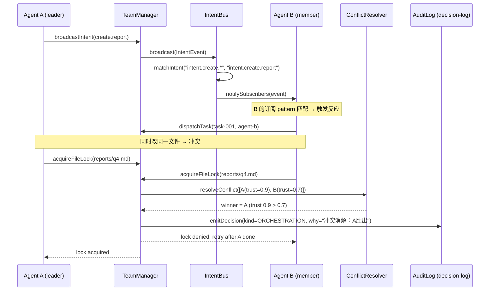
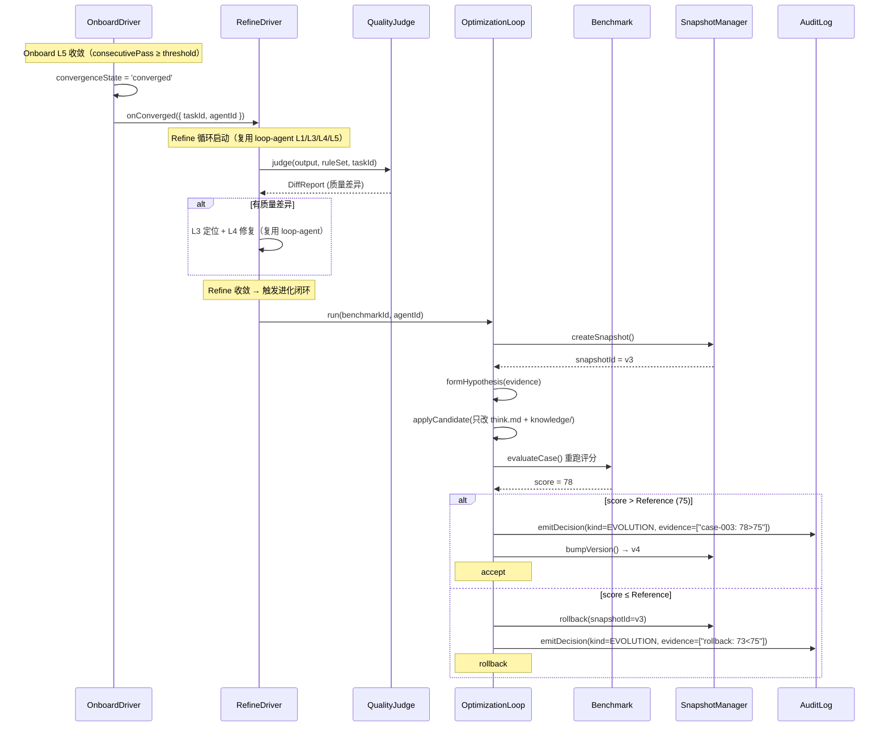
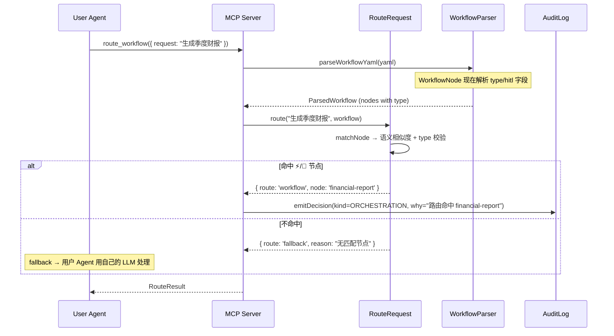
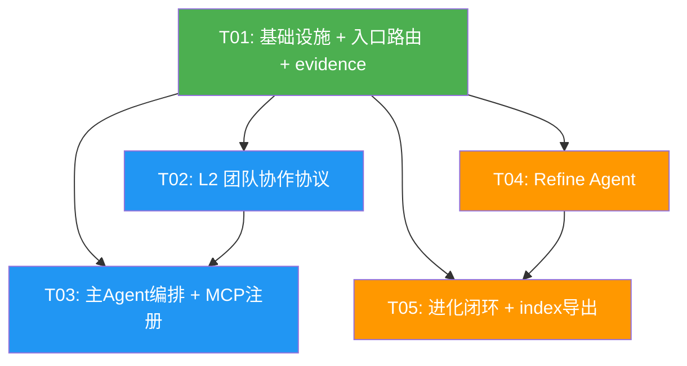

# v1.3.3 系统设计 + 任务分解

> **版本**：v1.3.3 · **架构师**：Bob · **状态**：设计稿
> **协议设计文档**：`docs/guides/team-collaboration-protocol.md`（已产出，review 通过后进入实现）
> **工作目录**：sofagent 仓库根目录 · **分支**：main

---

## Part A: 系统设计

### 1. 实现方案

#### 1.1 核心技术挑战

| 挑战 | 方案 |
|------|------|
| 多 Agent 共享态并发写冲突 | 复用 automerge@1.0.1-preview.7 CRDT（与 core/federation.ts 同套 API） |
| 意图广播的订阅匹配 + 收敛窗口 | 独立 IntentBus 类（glob 匹配 + 5s 收敛检测） |
| orchestrator 不能 import daemon（层级倒挂） | 接口抽象 `TeamSyncChannel` + 依赖注入（orchestrator 定义接口，daemon 实现，mcp 胶水） |
| Refine 复用 loop-agent 引擎只换 L2 判据 | `refine-driver.ts` 注入 `l2Judge = qualityJudge`，L1/L3/L4/L5 直接 import loop-agent |
| Onboard 收敛后自动触发 Refine | driver.ts L383 收敛出口加 `onConverged` 回调注入点 |
| 进化闭环只动经验层 | optimization-loop 修改范围白名单（只 think.md + knowledge/），L1 SKILL.md / 审计 / 回溯不可碰 |
| DecisionLogEntry 加 evidence + 团队/进化 kind | 扩展 DecisionKind 联合类型 + evidence 字段（可选 string[]） |
| workflow-parser 的 type 字段被丢弃 | WorkflowNode interface 加 `type` + `hitl` 字段解析 |

#### 1.2 框架与库选择

| 依赖 | 版本 | 用途 | 约束 |
|------|------|------|------|
| automerge | **1.0.1-preview.7**（写死精确版本） | team-state CRDT 同步 | **严禁 ^**，禁止升 2.x（API 不兼容） |
| js-yaml | ^5.2.0 | team.yml + workflow YAML 解析 | orchestrator 既有依赖 |
| @sofagent/core | 1.3.3 | atomic-write / federation / memory-contract | workspace 内部 |
| @sofagent/audit | 1.3.3 | decision-log / emitDecision | workspace 内部 |

**零新第三方依赖**——除 automerge（core 已锁版）外，全部复用既有 workspace 包。

#### 1.3 架构模式

- **接口抽象 + 依赖注入**：TeamSyncChannel（orchestrator 定义 / daemon 实现）、quality-judge（复用 loop-agent 注入模式）
- **CRDT 乐观并发**：共享态用 automerge 自动合并，文件级冲突走显式裁决
- **复用优先**：Refine 复用 loop-agent 的 5 个文件（import 不重写）；team-channel 复用 v1.1.8 加密链路

---

### 2. 文件列表

#### 新建文件（20 个）

| # | 文件路径 | 所属交付 | 说明 |
|---|---------|---------|------|
| 1 | `engine/orchestrator/src/team/protocol.ts` | 交付1 | 协作协议核心（共享态/广播/触发/消解/放大） |
| 2 | `engine/orchestrator/src/team/team-manager.ts` | 交付1+2 | 团队生命周期 + 主 Agent 编排（建队/加入/退出/入队/分发/收集） |
| 3 | `engine/orchestrator/src/team/team-state.ts` | 交付1 | 共享态 CRDT 合并 + TeamSyncChannel 接口 + LocalTeamSyncChannel |
| 4 | `engine/orchestrator/src/team/intent-bus.ts` | 交付1 | 意图广播事件总线（glob 匹配 + 收敛窗口） |
| 5 | `engine/daemon/src/federation/team-channel.ts` | 交付1 | 团队联邦通道（FederatedTeamSyncChannel，复用 v1.1.8 加密链路） |
| 6 | `engine/mcp/src/tools/team-broadcast.ts` | 交付1 | MCP `team_broadcast` tool |
| 7 | `engine/mcp/src/tools/team-create.ts` | 交付1 | MCP `team_create` tool（建队/解散 + team.yml） |
| 8 | `engine/orchestrator/src/__tests__/team-protocol.test.ts` | 交付1 | 单测（五大机制各一） |
| 9 | `engine/orchestrator/src/route/route-request.ts` | 交付3 | 请求 → 节点匹配（语义 + type 校验） |
| 10 | `engine/mcp/src/tools/route-workflow.ts` | 交付3 | MCP `route_workflow` tool |
| 11 | `engine/orchestrator/src/__tests__/route-request.test.ts` | 交付3 | 单测（命中 ⚡ → workflow / 不命中 → fallback） |
| 12 | `engine/orchestrator/src/refine-agent/refine-driver.ts` | 交付4 | Refine 循环驱动（复用 loop-agent/driver.ts 骨架） |
| 13 | `engine/orchestrator/src/refine-agent/quality-rule-set.ts` | 交付4 | 质量规则集加载 + 匹配（三来源） |
| 14 | `engine/orchestrator/src/refine-agent/quality-judge.ts` | 交付4 | L2 质量判定器（接口对齐 DiffReport） |
| 15 | `engine/mcp/src/tools/refine.ts` | 交付4 | MCP `refine` tool（触发质量循环 + 查结果） |
| 16 | `engine/orchestrator/src/__tests__/refine-agent.test.ts` | 交付4 | 单测（五层各一 + 串行验证） |
| 17 | `engine/orchestrator/src/refine-agent/optimization-loop.ts` | 交付5 | evidence→hypothesis→Candidate→eval→accept/rollback |
| 18 | `engine/orchestrator/src/refine-agent/snapshot-manager.ts` | 交付5 | Agent 级快照 + 版本号管理 |
| 19 | `engine/orchestrator/src/refine-agent/contamination-guard.ts` | 交付5 | 污染检测（rubric/Gold 不得进入优化器上下文） |
| 20 | `engine/orchestrator/src/__tests__/optimization-loop.test.ts` | 交付5 | 单测（严格提升 + 回滚 + 污染检测 + 版本号） |

#### 修改文件（10 个）

| # | 文件路径 | 所属交付 | 修改内容 |
|---|---------|---------|---------|
| 1 | `engine/orchestrator/package.json` | 交付1 | 新增 `"automerge": "1.0.1-preview.7"`（写死精确版本，禁止 ^） |
| 2 | `engine/orchestrator/src/index.ts` | 交付1+3+4 | 导出 team/ route/ refine-agent/ 模块公开 API |
| 3 | `engine/orchestrator/src/workflow-parser.ts` | 交付2+3 | ① WorkflowNode 加 `type` + `hitl` 字段解析；② L156 deriveAgentFromRequirement 后接入 team-manager 入队钩子 |
| 4 | `engine/orchestrator/src/loop-agent/driver.ts` | 交付4 | L383-386 收敛出口加 `onConverged` 回调（Onboard→Refine 自动触发挂点） |
| 5 | `engine/audit/src/decision-schema.ts` | 交付6 | ① DecisionLogEntry 加 `evidence?: string[]`；② DecisionKind 加 `EVOLUTION` + `TEAM` |
| 6 | `engine/audit/src/decision-log.ts` | 交付6 | emitDecision 写入时校验 evidence 格式 + VALID_KINDS 加 EVOLUTION/TEAM |
| 7 | `engine/mcp/package.json` | 交付6 | 新增 `"@sofagent/orchestrator": "1.3.3"` 依赖 |
| 8 | `engine/mcp/src/tool-registry.ts` | 全部 | TOOLS 数组加 4 个新 tool 定义 |
| 9 | `engine/mcp/src/mcp-server.ts` | 全部 | switch case 加 4 个新 tool 分发 + import |
| 10 | `engine/audit/src/__tests__/decision-log.test.ts` | 交付6 | 补 evidence 字段用例 |

---

### 3. 数据结构和接口（Class 图）

> 完整 Mermaid 源码见 `docs/class-diagram.mermaid`

```mermaid
classDiagram
    direction TB

    %% ── 交付 1：团队协作协议 ──
    class TeamManager {
        -teamState: TeamStateDoc
        -intentBus: IntentBus
        -syncChannel: TeamSyncChannel
        -dataDir: string
        +createTeam(config: TeamConfig): string
        +dissolveTeam(teamId: string): void
        +joinTeam(teamId: string, agentId: string, role: string, trust: number): void
        +leaveTeam(teamId: string, agentId: string): void
        +enqueueSubAgent(definition: SubAgentDefinition): void
        +broadcastIntent(event: IntentEvent): void
        +dispatchTask(taskId: string, assignee: string): void
        +collectResult(taskId: string): TaskResult
        +saveState(): void
        +loadState(teamId: string): void
    }

    class IntentBus {
        -subscriptions: Subscription[]
        -events: IntentEvent[]
        -windowMs: number
        -timer: NodeJS.Timer
        -onConverged: Function
        +subscribe(sub: Subscription): void
        +broadcast(event: IntentEvent): void
        -notifySubscribers(event: IntentEvent): void
        -resetConvergenceTimer(): void
        +matchIntent(pattern: string, intent: string): boolean
    }

    class TeamStateCRDT {
        +initTeamState(meta: TeamMeta): TeamStateDoc
        +updateMember(doc: TeamStateDoc, member: MemberState): TeamStateDoc
        +updateTask(doc: TeamStateDoc, task: TaskState): TeamStateDoc
        +acquireFileLock(doc: TeamStateDoc, entry: FileLockEntry): TeamStateDoc
        +addFeedback(doc: TeamStateDoc, entry: FeedbackEntry): TeamStateDoc
        +mergeDocs(local: TeamStateDoc, remote: TeamStateDoc): TeamStateDoc
        +save(doc: TeamStateDoc): Uint8Array
        +load(binary: Uint8Array): TeamStateDoc
    }

    class TeamSyncChannel {
        <<interface>>
        +syncTeamState(binary: Uint8Array): Promise~void~
        +onRemoteUpdate(cb: Function): void
    }

    class LocalTeamSyncChannel {
        +syncTeamState(binary: Uint8Array): Promise~void~
        +onRemoteUpdate(cb: Function): void
    }

    class FederatedTeamSyncChannel {
        -channel: FederationChannel
        -peers: PairedPeer[]
        +syncTeamState(binary: Uint8Array): Promise~void~
        +onRemoteUpdate(cb: Function): void
    }

    class ConflictResolver {
        +resolveConflict(parties: ConflictParty[]): ConflictParty
        -compareTrust(a: ConflictParty, b: ConflictParty): number
        -compareTimestamp(a: ConflictParty, b: ConflictParty): number
        -compareRole(a: ConflictParty, b: ConflictParty): number
    }

    class FeedbackAmplifier {
        -teamManager: TeamManager
        +amplify(correction: Correction): void
        +isTeamReusable(correction: Correction): boolean
        +broadcastQualityRule(rule: QualityRule): void
        +appendToMemberThink(agentId: string, entry: string): void
    }

    TeamManager --> IntentBus : owns
    TeamManager --> TeamSyncChannel : injects
    TeamManager --> TeamStateCRDT : uses
    TeamManager --> ConflictResolver : uses
    TeamManager --> FeedbackAmplifier : owns
    TeamSyncChannel <|.. LocalTeamSyncChannel
    TeamSyncChannel <|.. FederatedTeamSyncChannel

    %% ── 交付 3：入口路由 ──
    class RouteRequest {
        +route(request: string, workflow: ParsedWorkflow): RouteResult
        -matchNode(request: string, node: WorkflowNode): number
        -checkType(node: WorkflowNode): boolean
        -semanticSimilarity(a: string, b: string): number
    }

    class WorkflowNode {
        +id: string
        +agent: string
        +task: string
        +depends_on: string[]
        +type: NodeType
        +hitl: boolean
    }

    RouteRequest ..> WorkflowNode : reads

    %% ── 交付 4：Refine Agent ──
    class RefineDriver {
        -ruleSet: QualityRuleSet
        -qualityJudge: QualityJudge
        +runRefineLoop(task: string, options: RefineOptions): Promise~RefineLoopResult~
    }

    class QualityRuleSet {
        -builtinRules: QualityRule[]
        -customerRules: QualityRule[]
        -teamRules: QualityRule[]
        +loadBuiltin(): QualityRule[]
        +loadCustomer(deliveryReport: string): QualityRule[]
        +loadTeam(feedback: FeedbackEntry[]): QualityRule[]
        +all(): QualityRule[]
        +match(output: string): QualityRule[]
    }

    class QualityJudge {
        +judge(output: string, ruleSet: QualityRuleSet, taskId: string): Promise~DiffReport~
        -checkRule(output: string, rule: QualityRule): DiffMismatch[]
    }

    RefineDriver --> QualityRuleSet : uses
    RefineDriver --> QualityJudge : uses
    QualityJudge ..> DiffReport : outputs

    %% ── 交付 5：进化闭环 ──
    class OptimizationLoop {
        -snapshotManager: SnapshotManager
        -contaminationGuard: ContaminationGuard
        +run(benchmarkId: string, agentId: string): Promise~OptimizationResult~
        -formHypothesis(evidence: Evidence): Hypothesis
        -applyCandidate(hypothesis: Hypothesis): Candidate
        -evaluate(candidate: Candidate): EvaluationScore
        -acceptOrRollback(candidate: Candidate, score: EvaluationScore): boolean
    }

    class SnapshotManager {
        -agentDir: string
        +createSnapshot(): string
        +rollback(snapshotId: string): void
        +bumpVersion(): number
        +currentVersion(): number
    }

    class ContaminationGuard {
        +check(context: string): boolean
        +scanForRubric(text: string): boolean
        +scanForGold(text: string): boolean
        +recover(): void
    }

    OptimizationLoop --> SnapshotManager : uses
    OptimizationLoop --> ContaminationGuard : uses

    %% ── 交付 6：Evidence ──
    class DecisionLogEntry {
        +ts: string
        +agentId: string
        +sessionId: string
        +kind: DecisionKind
        +moment: LoopPhase
        +why: DecisionWhy
        +evidence: string[]
        +specRef: string
        +artifactRef: string
    }
```



---

### 4. 程序调用流程（时序图）

> 完整 Mermaid 源码见 `docs/sequence-diagram.mermaid`

#### 4.1 团队协作：意图广播 → 触发反应 → 冲突消解



#### 4.2 Onboard → Refine 自动触发 + 进化闭环



#### 4.3 入口路由：用户 Agent 请求 → workflow 匹配



---

### 5. 待明确事项

| # | 问题 | 当前倾向 | 影响范围 |
|---|------|---------|---------|
| 1 | 共享态并发写：乐观锁 vs 悲观锁？ | **乐观锁**（CRDT 自动合并 + trust 裁决） | team-state.ts |
| 2 | 意图广播收敛窗口时长？ | **默认 5 秒**（可配置） | intent-bus.ts |
| 3 | 主 Agent 编排逻辑放哪？ | **并入 team-manager.ts** | team-manager.ts |
| 4 | 团队审计存哪？ | **复用 decision-log**（kind 加 TEAM/EVOLUTION） | decision-schema.ts |

---

## Part B: 任务分解

### 6. 必需包

```
# 新增第三方依赖（写死精确版本，禁止 ^）
- automerge@1.0.1-preview.7: CRDT 共享态同步（core 已锁版，orchestrator 新增声明）

# 新增 workspace 内部依赖
- @sofagent/orchestrator@1.3.3: mcp 包新增（team/route/refine 模块 import 源）

# 既有依赖（复用，不新增）
- js-yaml@^5.2.0: YAML 解析（orchestrator 既有）
- @sofagent/core@1.3.3: atomic-write / federation / memory-contract
- @sofagent/audit@1.3.3: decision-log / emitDecision / runRules
```

---

### 7. 任务列表（按实现顺序，最多 5 个）

#### T01: 项目基础设施 + 入口路由 + evidence 字段（独立模块先行）

**源文件**（10 个）：
- `engine/orchestrator/package.json`（修改：加 automerge 锁版）
- `engine/mcp/package.json`（修改：加 @sofagent/orchestrator 依赖）
- `engine/audit/src/decision-schema.ts`（修改：DecisionLogEntry 加 evidence + DecisionKind 加 EVOLUTION/TEAM）
- `engine/audit/src/decision-log.ts`（修改：VALID_KINDS 加 EVOLUTION/TEAM + evidence 校验）
- `engine/audit/src/__tests__/decision-log.test.ts`（修改：补 evidence 用例）
- `engine/orchestrator/src/workflow-parser.ts`（修改：WorkflowNode 加 type/hitl 字段解析）
- `engine/orchestrator/src/route/route-request.ts`（新建）
- `engine/orchestrator/src/__tests__/route-request.test.ts`（新建）
- `engine/mcp/src/tools/route-workflow.ts`（新建）
- `engine/orchestrator/src/index.ts`（修改：导出 route 模块）

**依赖**：无（最独立，先跑通基础设施）

**优先级**：P0

**说明**：把所有「基础设施 + 独立模块」放一个任务——package.json 依赖声明、schema 扩展、workflow-parser 字段扩展、入口路由（最独立的交付块）。这些是后续所有任务的前置。

---

#### T02: L2 团队协作协议（五大机制 + 建队）

**源文件**（8 个）：
- `engine/orchestrator/src/team/protocol.ts`（新建）
- `engine/orchestrator/src/team/team-manager.ts`（新建）
- `engine/orchestrator/src/team/team-state.ts`（新建：TeamStateCRDT + TeamSyncChannel 接口 + LocalTeamSyncChannel）
- `engine/orchestrator/src/team/intent-bus.ts`（新建）
- `engine/daemon/src/federation/team-channel.ts`（新建：FederatedTeamSyncChannel）
- `engine/mcp/src/tools/team-broadcast.ts`（新建）
- `engine/mcp/src/tools/team-create.ts`（新建）
- `engine/orchestrator/src/__tests__/team-protocol.test.ts`（新建）

**依赖**：T01（需要 package.json 的 automerge 依赖 + index.ts 导出能力）

**优先级**：P0

**说明**：五大机制（共享态/意图广播/触发反应/冲突消解/反馈放大）+ 建队机制（team.yml + MCP tool）。team-manager.ts 含主 Agent 编排逻辑（待明确 #3 倾向并入）。三包依赖方向通过 TeamSyncChannel 接口抽象解决（orchestrator 定义，daemon 实现）。

---

#### T03: 主 Agent 编排 + MCP 工具注册（集成层）

**源文件**（4 个）：
- `engine/orchestrator/src/team/team-manager.ts`（修改：加 enqueueSubAgent 入队钩子 + dispatchTask/collectResult 编排逻辑）
- `engine/orchestrator/src/workflow-parser.ts`（修改：L156 deriveAgentFromRequirement 后接入 team-manager 入队）
- `engine/mcp/src/tool-registry.ts`（修改：TOOLS 数组加 team_broadcast / team_create / route_workflow / refine 四个 tool 定义）
- `engine/mcp/src/mcp-server.ts`（修改：switch case 加四个 tool 分发 + import）

**依赖**：T01 + T02

**优先级**：P0

**说明**：主 Agent 编排（交付 2 复用交付 1 的 L2 机制）+ 全部 4 个新 MCP tool 的注册三步（tool-registry + mcp-server + import）。workflow-parser 的自动入队钩子在此接入。MCP tool 注册三步必查铁律在此落地。

---

#### T04: Refine Agent 完整版（复用 loop-agent 引擎）

**源文件**（6 个）：
- `engine/orchestrator/src/refine-agent/refine-driver.ts`（新建）
- `engine/orchestrator/src/refine-agent/quality-rule-set.ts`（新建）
- `engine/orchestrator/src/refine-agent/quality-judge.ts`（新建）
- `engine/orchestrator/src/loop-agent/driver.ts`（修改：L383 收敛出口加 onConverged 回调）
- `engine/mcp/src/tools/refine.ts`（新建）
- `engine/orchestrator/src/__tests__/refine-agent.test.ts`（新建）

**依赖**：T01（需要 index.ts 导出 + package.json）

**优先级**：P0

**说明**：Refine 复用 loop-agent 的 judge.ts / error-localizer.ts / fix-applier.ts / diff-report.ts / output-extractor.ts（import 不重写），只新建 refine-driver（注入 qualityJudge 替代 ontology-comparator）+ quality-rule-set（三来源加载）+ quality-judge（接口对齐 DiffReport）。driver.ts L383 加 onConverged 回调是 Onboard→Refine 自动触发的唯一挂点。

---

#### T05: 进化闭环升级 + index 导出 + 最终集成

**源文件**（6 个）：
- `engine/orchestrator/src/refine-agent/optimization-loop.ts`（新建）
- `engine/orchestrator/src/refine-agent/snapshot-manager.ts`（新建）
- `engine/orchestrator/src/refine-agent/contamination-guard.ts`（新建）
- `engine/orchestrator/src/__tests__/optimization-loop.test.ts`（新建）
- `engine/orchestrator/src/index.ts`（修改：导出 team/ refine-agent 全部公开 API）
- `engine/orchestrator/src/refine-agent/optimization-loop.ts`（修改：每次进化动作 emitDecision 带 evidence）

**依赖**：T01（evidence 字段）+ T04（Refine 触发进化）

**优先级**：P0

**说明**：进化闭环（Benchmark 驱动 Dream Cycle）—— evidence→hypothesis→Candidate→eval→accept/rollback。优化范围白名单（只 think.md + knowledge/，L1 SKILL.md / 审计 / 回溯不可碰）。contamination-guard 检测 rubric/Gold 污染。index.ts 最终导出全部模块（team/ route/ refine-agent/）。optimization-loop 的 emitDecision 带 evidence（复用 T01 扩展的 DecisionLogEntry）。

---

### 8. 共享知识（跨文件约定）

```
# 三包依赖方向（铁律）
- orchestrator 是协议核心，禁止反向 import daemon
- daemon 实现 orchestrator 定义的 TeamSyncChannel 接口（依赖注入）
- mcp 是工具层，import orchestrator 的 team/route/refine 模块
- team-channel.ts（daemon）经 FederationChannel 参数注入，不硬编码 OpenClaw SDK import

# automerge 锁版（铁律）
- automerge@1.0.1-preview.7 写死精确版本（禁止 ^）
- bump-version.sh 只对齐 @sofagent/* 依赖，不动第三方——写 ^ 等于让 npm 裁决锁版
- 严禁升级 2.x（API 不兼容 CRDT 同步用法），升级前必须跑通 multi-device-sync 全部测试

# trust 语义边界（铁律）
- trust 只是冲突消解排序权重（0.0–1.0），不是权限判定 / 准入控制
- trust 只出现在 resolveConflict() 的排序比较里，不出现在任何 if 条件分支里
- 成员能不能做什么归 v1.3.7 场景权限体系

# Refine 复用 loop-agent（铁律）
- L1/L3/L4/L5 直接 import loop-agent（judge.ts / error-localizer.ts / fix-applier.ts / diff-report.ts）
- 只替换 L2 判据：ontology-comparator → quality-judge（接口对齐 DiffReport）
- driver.ts 骨架复用，注入 l2Judge = qualityJudge

# 进化闭环范围（铁律）
- Candidate 只修改 think.md + knowledge/（经验层）
- L1 SKILL.md / 审计规则 A1-A24 / 回溯机制 git snapshot 永远不可碰
- 写 think.md/knowledge 必走 atomicAppendSync / atomicWriteSync（core/src/shared/atomic-write.ts）

# type 修饰符（铁律）
- `const { fn, type Typename } = obj` 是 TypeScript 语法错误
- 正确：顶层 `import type { Typename } from '...'` + 运行时只解构值

# MCP tool 注册三步（铁律）
- 新增 tool 必须同步：① tool-registry.ts TOOLS 数组 ② mcp-server.ts switch case ③ import
- 缺任何一步 tool 不可用（v1.3.2 教训）

# DecisionKind 扩展
- v1.3.3 新增 EVOLUTION（进化动作）+ TEAM（团队协作动作）
- evidence?: string[] 是可选字段，进化动作必附触发证据
- 团队审计复用 decision-log（kind=TEAM），不独立 team-audit-log

# 所有日期 ISO 8601 UTC
# 所有 think.md 写入走 atomicAppendSync（append-only Ledger 契约）
```

---

### 9. 任务依赖图



**关键路径**：T01 → T02 → T03（团队协作主线）+ T01 → T04 → T05（Refine+进化主线）。两条主线在 T01 汇合，可并行推进。

---

### 任务总结

| Task | 名称 | 文件数 | 依赖 | 优先级 |
|------|------|--------|------|--------|
| T01 | 基础设施 + 入口路由 + evidence | 10 | 无 | P0 |
| T02 | L2 团队协作协议 | 8 | T01 | P0 |
| T03 | 主Agent编排 + MCP注册 | 4 | T01+T02 | P0 |
| T04 | Refine Agent | 6 | T01 | P0 |
| T05 | 进化闭环 + index导出 | 6 | T01+T04 | P0 |
| **合计** | | **20 新建 + 10 修改** | | |
