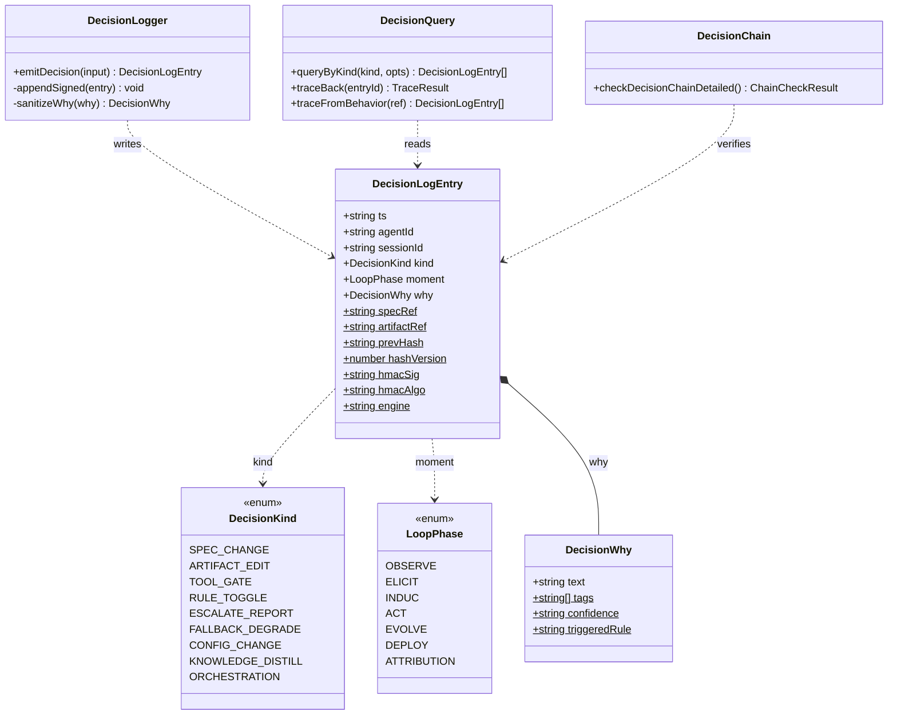
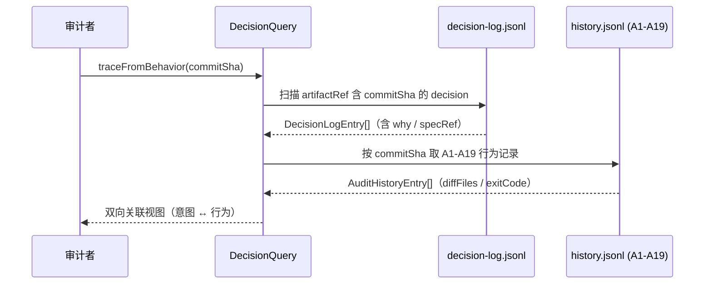
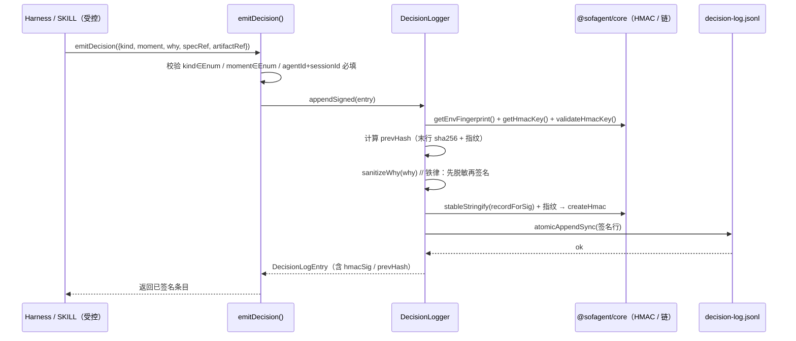

# v1.3.0 开发日志 — 运行时审计最小闭环（LangGraph middleware 启发）

> ⚠️ **规划中，尚未实现。** 以下内容为版本目标规划，不代表当前可用能力。

> 状态：规划中 · 孔放勋 · 2026-07-27
> 前置依赖：FORGE fresh-eyes-loop 已跑 createReactAgent（v1.1.8+）；v1.3.1 本体底座（可选，运行时审计不依赖本体）
> 灵感来源：LangChain 1.0 middleware 系统（wrapToolCall / wrapModelCall）+ Databricks Omnigent meta-harness 印证

## 定位

**v1.3.0 是运行时审计的「最小闭环」第一刀**——不替换现有 harness，只在 FORGE 已在用的 `createReactAgent` 外面包一层 `wrapToolCall` middleware，把 engine/rules 里已有的 3 条 tool-gate 规则从「编排层静态 gate」升级为「运行时动态拦截 + 审计日志」。这一步让 sofagent 从「提交时审计」迈向「运行时拦截」，是回答用户三问（harness→meta-harness / 运行时审计时机 / create_react_agent 能否审计）的最小可行落点。

## 技术结论（三问作答）

- **Q① harness 层能否升级 meta-harness？** 能，分两阶段。阶段一 = 运行时审计（本版本）；阶段二 = meta-harness 多 harness 编排（前移至 **v1.5.0**，承接 v1.4.0 沙箱底座）。
- **Q② 何时能做运行时审计？** 本版本（v1.3.0）即可——复用 FORGE 已跑的 createReactAgent，仅加 middleware 层，可行性高。
- **Q③ 用 create_react_agent 能否做到运行时审计？** create_react_agent 本身不做审计，但提供 middleware 接入点；`wrapToolCall`（绕每次工具调用）是精确接入点。最小闭环 = 包一层 wrapToolCall middleware。

## P0：wrapToolCall middleware 拦截层

**痛点**：当前 engine/rules 的 3 条 tool-gate 规则（工具调用前置 allow/deny 雏形）只在「编排层静态 gate」生效——工具真正被调用时并没有运行时拦截 + 留证。提交时审计（git diff）管不了 Agent 运行时的工具调用。

**方案**：
- 在 `FORGE/src/fresh-eyes-driver.mjs` 调 `createReactAgent` 处，外包一层 middleware（`langchain` 1.0 `create_agent` 的 middleware 系统，或 TS `@langchain/langgraph` 的 wrap 式 hook）。
- `wrapToolCall(tool, ...args)`：工具调用前 → 跑 engine/rules 的 3 条 tool-gate 规则 → 命中 deny 则拦截并记录审计日志；命中「需人工批准」类则挂起等 HITL；通过则放行并写审计日志（调用方 / 工具名 / 参数摘要 / 结果 / 时间戳）。
- 审计日志落到 `data/audit/runtime/` 下的 append-only 文件（复用提交时审计的留证格式，跨会话可聚合）。

**实现位置**：`FORGE/` middleware 层 + `engine/rules/` tool-gate 规则升级。

## P1：engine/rules 3 条 tool-gate 规则运行时化

**现状**：engine/rules 已有 3 条 tool-gate 原型规则（编排层静态 gate）。

**升级**：
- 从「编排层调用前判断」改为「可被 wrapToolCall 在运行时逐次调用」的纯函数（`shouldAllow(toolName, args) → { allow, reason, requireApproval }`）。
- 规则内容：① 文件系统写操作落工作树内（防越界写）② 网络出站白名单（防数据外泄，与 v1.4.0 虚拟 key 边界呼应）③ 凭证类工具仅接受虚拟 key（防明文密钥进 Agent 进程，呼应 Omnigent egress proxy 模式）。
- 规则文件独立只读挂载（参考 v1.3.x「规则文件独立只读焊死门」探索项），Agent 不可篡改。

## P2：危险操作人工批准钩子 + 回归

- 危险操作（如 git push / 删除 / 外发）前挂 HITL 钩子，复用 v1.1.8 的 commit gate（A1 不碰敏感）+ git hook 同源逻辑。
- 加 middleware 层不破坏 FORGE fresh-eyes-loop 既有行为：回归测试确认 5 步循环（a-check/b-check 双盲 → a-consolidate → b-fix → a-verify）不受影响，且新增「运行时审计日志」产出。

## P3：list_rules MCP tool（tool-gate 规则透明化）

MCP 覆盖度审计缺口补全（P2）——配合本版 wrapToolCall 上线，把运行时拦截规则**透明化**给接入方：

| tool | 所属包 | 一句话 |
|------|--------|--------|
| `list_rules` | rules | 列出运行时 tool-gate 拦截规则（名称/等级/启停），配合本版 wrapToolCall 上线做透明化 |

> **安全边界（用户已背书）**：rules/harness 内部实现不暴露——rules 在 wrapToolCall 后自动运行时生效（只读列出规则清单），harness 是纯内部装配层，永不 MCP 化。

## P4：边契约「权限流 + 失败流」自然落地（从 v1.2.5 P6 拆入）

> 来源：v1.2.5 规划 P6「五类边契约形式化」。v1.2.5 瘦身时判定当前控制流+数据流两类边已满足审计需求，五类边的完整形式化降级——其中「权限流」和「失败流」随本版 wrapToolCall 自然落地（工具调用前权限检查 = 权限流；deny/挂起/降级路径 = 失败流），无需独立配置对象。

本版 wrapToolCall middleware 让 P6 的两类边从"设计概念"变为"运行时可审计行为"：
- **权限流**：`shouldAllow(toolName, args) → { allow, reason, requireApproval }` 每次工具调用前判定，留运行时审计日志
- **失败流**：deny → 拦截并记审计 FAIL；requireApproval → 挂起等 HITL；allow → 放行写日志——三条降解路径均为可审计状态

> 剩余两类边（证据流完整形式化 + 数据流显式契约）随 v1.4.0 沙箱层补全（虚拟文件系统审计合并 = 证据流；虚拟 key scope = 数据流契约）。

## 边界与依赖

- **不依赖 v1.4.0 沙箱**：本版本只加 middleware 拦截层，不引入虚拟文件系统 / 虚拟 key / AsyncSubAgent。完整运行时审计（策略强制 + 沙箱 + 状态化拦截）仍留 v1.4.0（范围限定 SubAgent）。
- **meta-harness 前移至 v1.5.0**：多 harness 统一编排依赖 v1.4.0 沙箱底座，故 v1.5.0 承接更连贯（v1.4.0 给单 SubAgent 沙箱 → v1.5.0 升级为多 harness 统一编排 + 跨会话协作），v2.x 留给 Dashboard 产品化 + 分层模型。
- **开源借力**：LangChain middleware（接入点，已用 createReactAgent）、EnkryptAI Secure MCP Gateway（v1.4.x 现成护栏 audit_only 参考）、bubblewrap/seatbelt（v1.4.0 沙箱原语）、LiteLLM（控制平面成本/路由，v1.4.x）。详见 ROADMAP「Omnigent 参考清单」+「运行时审计演进路线」。

---

## 决策审计 / Judgment Unit 专项（OpenFDE #1 最高优先借鉴）

> 状态：规划中（架构设计成文）· 高见远（架构师）· 2026-07-27
> 来源：OpenFDE/ChatDemo `decisions.jsonl`（见 ROADMAP §十 #3，最高优先）+ OpenFDE 主仓 INDUC / Judgment Unit（见 ROADMAP §十）
> 定位：与 v1.3.0 运行时审计（wrapToolCall middleware）**互补的「意图层审计」**；同属 v1.3.x 决策审计专项，**排在 Graph Engine（决策=图节点）之前**——先有决策日志，Graph 才有输入
> 版本判定：v1.3.0 装「决策日志 + 受控 emitDecision + kind-wise back + 链校验」；v1.3.1 装「Judgment Unit 蒸馏落地」（见 v1.3.1 溢出专项）

### 0. 一句话定位

把 A1-A19 的「**行为问责**（扫 git diff）」升级为「**意图问责**（运行时记决策理由链）」。决策日志以 `kind`（决策类型）为**第一分类维度**，并新增 **kind-wise back** = 按 kind 向后追溯能力：给定某类 kind → 该 kind 全部决策 → 每条 `why`（理由）→ `specRef`（对应 spec 工件）→ `artifactRef`（产出工件）→ 与 A1-A19 行为审计**双向交叉引用**（artifactRef ↔ decision）。这是「行为问责」升级为「意图问责」的桥。

来源可追溯：ChatDemo `decisions.jsonl` schema `{kind, moment, why, spec_ref}` 现场即时记、会后喂 FDE Loop→INDUC→Judgment Unit（见 ROADMAP §十）；主仓 INDUC 把「经验→判断」显式成阶段、Judgment Unit = 专家判断资产化、可开关、可版本化（见 ROADMAP §十）。

### 1. 实现方案（Implementation Approach）

**技术难点**
- 不另起炉灶：决策日志必须与 `history.jsonl` 共用同一条防篡改 HMAC 哈希链（同密钥、同签名算法、同环境指纹），否则 `--doctor` 会出现两条不一致的链、且稀释强校验。
- 自由文本 `why` 的脱敏铁律：与 `audit-history.ts` 的 A2/A9 同理，`why` 可能含密钥泄漏 / prompt injection 命中；**必须先脱敏再签名**，否则含敏感词的条目 HMAC 与读侧不匹配 → 被 `--doctor` 误报篡改（run-09 血泪教训同源）。
- 受控写：Agent 不能自由写决策日志（schema 校验 + HMAC 一致必须强制），故只暴露受控 `emitDecision()` API。
- 双向关联：A1-A19 行为记录（history.jsonl）只有 `commitSha` + diff 文件数，决策日志有 `artifactRef`；关联键 = `commitSha`，需 query-time join。

**框架选型**：零新依赖。复用现有 `@sofagent/core` + `engine/audit` 工具链，仅 Node.js 内置模块（fs/crypto/path/os）。决策日志 = JSONL append-only（与 history.jsonl 同构）。

**架构模式**：受控写 + 审计读分离（CQRS 轻量版）——写侧 `emitDecision()` 强制 schema + HMAC；读侧 `DecisionQuery` 按需扫描 JSONL 做 kind-wise back 追溯。

### 2. 文件列表（File List，供 寇豆码 实现；本轮不新建文件，仅落盘设计）

| 相对路径 | 作用 | 状态 |
|------|------|------|
| `engine/audit/src/decision-schema.ts` | `DecisionLogEntry` schema + `DecisionKind`/`LoopPhase` 枚举 + 校验 + `sanitizeWhy()` | 新建（实现轮） |
| `engine/audit/src/decision-log.ts` | `emitDecision()` + `appendSigned()` + HMAC 链复用 | 新建（实现轮） |
| `engine/audit/src/decision-chain.ts` | `checkDecisionChainDetailed()`（mirror core 范式） | 新建（实现轮） |
| `engine/audit/src/decision-query.ts` | `queryByKind` / `traceBack` / `traceFromBehavior`（kind-wise back） | 新建（实现轮） |
| `engine/audit/src/decision-distill.ts` | Judgment Unit 蒸馏（v1.3.1 溢出） | 新建（实现轮，v1.3.1） |
| `engine/audit/src/public-api.ts` | 受控暴露 `emitDecision` | 编辑（加导出） |
| `engine/audit/src/index.ts` | 包导出 | 编辑（加导出） |
| `engine/core/src/data-paths.ts` | 加 `AUDIT_DECISION_LOG` 常量 | 编辑（实现轮） |
| `engine/core/src/audit-history.ts` | 加 `getDecisionLogPath()`（mirror `getHistoryFilePath`） | 编辑（实现轮） |
| `FORGE/src/fresh-eyes-driver.mjs` | wrapToolCall 处调用 `emitDecision`（运行时决策） | 编辑（实现轮） |

> 存储路径设计决策：团队草图写 `.sofagent/audit/decision-log.jsonl`，但 v1.2.1 已做安装路径分离，审计记录 SSOT 为 `data/audit/`（`AUDIT_HISTORY = data/audit/history.jsonl`，已存在 2.1MB）。**本设计采用 `data/audit/decision-log.jsonl`（history.jsonl 同级兄弟文件）**，通过 `getDecisionLogPath()` 解析，遵循 v1.2.1 SSOT，不在 `.sofagent/` 下另开目录。详见第 12 节待明确事项。

### 3. 数据结构与接口（schema + 类图）

**单条决策记录 schema**

```
{
  ts:          string,            // ISO 8601 UTC（默认 now，标准化 UTC）
  agentId:     string,            // 产出决策的硅基员工 / agent 标识（必填）
  sessionId:   string,            // 会话标识（FDE 会话 / orchestrator run）（必填）
  kind:        DecisionKind,      // 决策类型枚举（★第一分类维度）
  moment:      LoopPhase,         // 决策发生的循环阶段（对齐 FDE Loop）
  why:         DecisionWhy,       // 决策理由（自由文本 + 可选结构化标注）
  specRef?:    string,            // 指向 workflow artifact / spec 的引用
  artifactRef?:string,            // 指向产出工件的引用（与 A1-A19 git diff 交叉引用）
  // —— 以下为防篡改链字段，复用 audit-history.ts 同套 ——
  prevHash?:   string,            // 上一行 hash（'genesis' 为链首）
  hashVersion?:number,            // 2 = 含环境指纹
  hmacSig?:    string,            // HMAC-SHA256 签名（无密钥时缺省，降级 SHA-256）
  hmacAlgo?:   'stable',          // 写入侧用 stableStringify 签名标记
  engine?:     string             // 审计引擎标识，追溯来源
}
```

**`kind` 分类法枚举（DecisionKind）** — 决策类型第一维度，至少覆盖团队要求的 5 类并扩展对齐 sofagent 现实：

| code | 枚举值 | 含义 | 对应来源 |
|------|--------|------|----------|
| SPEC | `SPEC_CHANGE` | spec / workflow artifact 变更（呼应 ChatDemo spec-first 铁律 + ROADMAP #2） | ChatDemo #2 |
| EDIT | `ARTIFACT_EDIT` | 产出工件编辑（代码 / 文档 / 配置写入） | 通用 |
| GATE | `TOOL_GATE` | 工具调用前置 allow/deny/requireApproval（呼应 v1.3.0 wrapToolCall） | v1.3.0 |
| RULE | `RULE_TOGGLE` | 规则开 / 关（A1-A19 或 Judgment Unit） | 通用 |
| ESC | `ESCALATE_REPORT` | 升级上报人类（越权 / 不确定） | 通用 |
| DEG | `FALLBACK_DEGRADE` | 降级兜底（模型不可用→规则兜底、工具断→占位，呼应 ChatDemo #6 分级降级） | ChatDemo #6 |
| CFG | `CONFIG_CHANGE` | 配置变更（config.yml / sensitivity frontmatter） | 通用 |
| DIST | `KNOWLEDGE_DISTILL` | 知识蒸馏决策（why 沉淀为规则） | 主仓 INDUC |
| ORCH | `ORCHESTRATION` | 编排决策（节点增删 / 依赖重排，呼应 Graph 演进） | Graph Engine |

**`moment` 阶段枚举（LoopPhase）** — 决策发生的循环阶段，对齐 FDE Loop 五阶段（见 ROADMAP §十（`OBSERVE→ELICIT→INDUC→ACT→EVOLVE + DEPLOY/ATTRIBUTION`）），并映射 FDE 四阶段十二步：

| 枚举值 | 含义 | FDE 四阶段映射 |
|--------|------|--------------|
| `OBSERVE` | 观察 / 感知 | 进场 §1-3 信息收集 |
| `ELICIT` | 萃取 / 挖掘 | 挖掘 §4-6 工作流 / AI 节点判定 |
| `INDUC` | 归纳（知识沉淀→Judgment Unit） | 挖掘 §6 价值量化同源 |
| `ACT` | 执行（**含运行时 wrapToolCall 即时决策**） | 交付 §7-9 出方案 / 装 / 部署 |
| `EVOLVE` | 进化（编排图改写 / 策略调优） | 检查离场 §10-12 同源 |
| `DEPLOY` | 部署落地 | 检查离场 §10-12 |
| `ATTRIBUTION` | 归因 / 问责（审计追溯时刻） | 审计回溯 |

> `moment` 取 FDE Loop 五阶段 + DEPLOY/ATTRIBUTION 作为权威枚举；运行时 wrapToolCall 触发的即时决策逻辑归属 `ACT`（执行实时切片），不另增 `RUNTIME` 值，保持枚举收敛。

**`why` 结构（DecisionWhy）**

```
why: string                                   // 最简形态：纯自由文本
   | { text: string,                          // 理由文本
       tags?: string[],                       // 可选结构化标注，如 ['cost','safety','spec-driven']
       confidence?: 'high'|'med'|'low',       // 决策置信度
       triggeredRule?: string }               // 若由某条 A1-A19 / 规则触发，记其编号
```

**`specRef` / `artifactRef` 引用约定**

- `specRef`：`workflow:onboard.md#§5` / `spec:DEMO_SPEC.md` / `artifact:knowledge/foo.md` —— 指向 workflow artifact / spec。
- `artifactRef`：`git:<commitSha>:<path>` / `file:<path>` —— 与 A1-A19 的 git diff 工件交叉引用（history.jsonl 的 `commitSha` + diff 文件为 join 键）。

**类图（mermaid）**



### 4. HMAC 链复用方案（与 audit-history.ts 同套，不另起炉灶）

**复用 `@sofagent/core` 函数**（与 `engine/audit/src/audit-history.ts` 完全一致）：
- `getEnvFingerprint(dataDir?)` — 环境指纹（hostname+username+gitDir）
- `getHmacKey()` — HMAC 密钥（来自 `~/.sofagent-key`，chmod 600）
- `stableStringify(value)` — 递归按 key 字典序稳定序列化（消除 key 顺序敏感）
- `validateHmacKey()` — 弱密钥告警（FLAG-4）
- `atomicAppendSync(filePath, line)` — 原子追加（防并发行交错）
- （校验侧）`checkHistoryChainDetailed` 范式 → 新增 `checkDecisionChainDetailed`（mirror）

**签名顺序（逐字对齐 `appendHistory`）**
1. `prevHash`：读末行 → `{...lastEntry, prevHash:undefined, hashVersion:undefined}` → `sha256(JSON + '|' + fingerprint).slice(0,16)`；空文件为 `'genesis'`。
2. `baseSanitized = { ...entry, prevHash, hashVersion:2, hmacAlgo: key?'stable':undefined, why: sanitizeWhy(entry.why) }`。
3. **铁律：先脱敏再签名**。`sanitizeWhy()` 对标 `sanitizeRuleResult()`：扫描 `why.text` 中的密钥模式 / injection 模式，命中则替换为脱敏占位（`检测到密钥泄漏（已脱敏）` / `检测到 prompt injection 模式（已脱敏）`）。**HMAC 基于脱敏后的 `why` 计算**，否则含敏感词的条目 HMAC 永远与 `--doctor` 读侧不匹配 → 误报篡改（run-09 同款）。
4. `recordForSig = { ...baseSanitized, prevHash:undefined, hashVersion:undefined, hmacSig:undefined, hmacAlgo:undefined }`（排除链/签名元字段）。
5. `hmacSig = key ? createHmac('sha256', key).update(stableStringify(recordForSig) + '|' + fingerprint).digest('hex').slice(0,32) : undefined`。
6. `atomicAppendSync(filePath, JSON.stringify({ ...baseSanitized, hmacSig }))`；首次创建文件 `chmodSync(0o600)`，目录 `0o700`。

**读写两侧一致性**：`checkDecisionChainDetailed` 用与写侧完全相同的 `recordForSig` 构造 + `stableStringify + '|' + fingerprint` 验签；`hmacAlgo==='stable'` 条目 HMAC 不匹配判 `tampered`（红），旧条目归 `unverifiable`（黄）——与 core 范式一致。

### 5. emitDecision() 受控 API 设计

```ts
interface EmitDecisionInput {
  kind: DecisionKind;            // 必填，须 ∈ DecisionKind
  moment: LoopPhase;             // 必填，须 ∈ LoopPhase
  why: DecisionWhy;              // 必填（string 或对象）
  agentId?: string;              // 缺省取 process.env.SOFAGENT_AGENT_ID
  sessionId?: string;            // 缺省取当前 orchestrator / FDE 会话
  specRef?: string;
  artifactRef?: string;
}

function emitDecision(input: EmitDecisionInput, dataDir?: string): DecisionLogEntry
// 返回已签名 + 已追加的完整条目（含 prevHash / hmacSig）
// 失败抛 DecisionSchemaError（校验不通过，不落盘）| DecisionWriteError（追加失败，向上传播，绝不静默丢弃）
```

**校验逻辑（写前，保证落盘条目 schema 一致）**
1. `kind` ∈ `DecisionKind` 枚举，否则抛 `DecisionSchemaError`（未知 kind 拒绝落盘）。
2. `moment` ∈ `LoopPhase` 枚举，否则抛 `DecisionSchemaError`。
3. `agentId` / `sessionId` 必填（缺省解析失败也抛错，不静默用空串）。
4. `why` 归一化为 `DecisionWhy`（纯 string → `{text}`）；`tags/confidence/triggeredRule` 可选校验。
5. `validateHmacKey()`：弱密钥时 `console.warn` 告警（FLAG-4，照常签名）。

**失败处理**
- 校验失败 → 抛 `DecisionSchemaError`，**不写文件**（防脏数据入链）。
- `atomicAppendSync` 抛错 → 抛 `DecisionWriteError`，向上传播；**决策绝不静默丢弃**（与审计不可丢失语义一致）。
- 受控性：仅 `emitDecision` 能写 decision-log.jsonl；不暴露任何原始 fs 写函数。经 `engine/audit/src/public-api.ts` 受控导出；Harness（SKILL）通过薄 tool wrapper 调用，禁止 Agent 直接 fs 写。

### 6. kind-wise back 追溯机制（查询接口）

`engine/audit/src/decision-query.ts`（读侧，query-time 扫描 JSONL，不预建索引以免另起炉灶）：

- `queryByKind(kind, { since?, until?, limit? })` → `DecisionLogEntry[]`：按 kind 检索该类全部决策。
- `getKindSummary(kind)` → 统计该 kind 决策数、`why.tags` 分布、关联 `specRef`/`artifactRef` 聚合。
- `traceBack(entryId)`：给定某条 decision → 解析 `specRef`（→ spec 文件）→ 解析 `artifactRef`（→ git commit/diff）→ 按 `artifactRef` 中的 `commitSha` **反向 join** `history.jsonl` 取 A1-A19 行为记录（diffFiles / exitCode）。
- `traceFromBehavior(ref: commitSha | artifactRef)`：**反向**——给定一条 A1-A19 行为记录（`commitSha` + 文件）→ 扫描 decision-log 中 `artifactRef` 含该 `commitSha` 的 decision → 跳到对应 `why`。
- **双向关联**：`artifactRef ↔ decision` 以 `commitSha` 为 join 键，A1-A19 行为记录（history.jsonl）与决策理由（decision-log.jsonl）互跳。



### 7. Judgment Unit 蒸馏路径（v1.3.1 溢出专项，设计成文于本版本）

对应 OpenFDE 主仓 INDUC（知识归纳阶段）+ Judgment Unit（专家判断资产化、可开关、可版本化）。把高复用的 `why` 沉淀为**可开关规则**：

1. **收集**：sustain / INDUC 等价物周期性扫描 decision-log，找出高频 / 同 tags 跨 kind 的 `why`（如大量 `FALLBACK_DEGRADE` + tag `model-unavailable`）。
2. **提议**：生成 Judgment Unit 候选 `{ id, name, trigger:{kind,tags}, action: allow|deny|warn|escalate, enabled:false, version, sourceDecisionRefs:[] }`。
3. **审批**：人类批准 → `enabled:true`，成为 `RULE_TOGGLE` 可开关资产，版本化（v1 / v2…）。
4. **回流**：启用后，该 kind+tags 的新决策可由对应 Judgment Unit 自动给出默认 action，减少重复人工判断。

> 实现落在 **v1.3.1**（见 v1.3.1 开发日志溢出专项）：蒸馏需 v1.3.0 先积累决策语料；且 v1.3.1 本体即「可运行推理底座」，Judgment Unit 资产化与之同构。

### 8. 程序调用流程（sequence：emitDecision 落盘）



### 9. 任务列表（Task Decomposition，供 寇豆码，按实现顺序 + 依赖）

| Task | 名称 | 源文件（≥3） | 依赖 | 优先级 | 落点 |
|------|------|-------------|------|--------|------|
| **T01** | 数据层基础设施（路径 + schema + 脱敏） | `engine/core/src/data-paths.ts`（加 AUDIT_DECISION_LOG）、`engine/core/src/audit-history.ts`（加 getDecisionLogPath）、`engine/audit/src/decision-schema.ts`（枚举 + 校验 + sanitizeWhy） | 无 | P0 | v1.3.0 |
| **T02** | 受控写入 + 链校验 | `engine/audit/src/decision-log.ts`（emitDecision + appendSigned + HMAC 复用）、`engine/audit/src/decision-chain.ts`（checkDecisionChainDetailed）、`engine/audit/src/decision-log.test.ts` | T01 | P0 | v1.3.0 |
| **T03** | 受控 API 暴露 + 运行时接入 | `engine/audit/src/public-api.ts`（emitDecision 导出）、`FORGE/src/fresh-eyes-driver.mjs`（wrapToolCall 调 emitDecision）、`engine/audit/src/index.ts`（包导出） | T02 | P1 | v1.3.0 |
| **T04** | 查询层 kind-wise back | `engine/audit/src/decision-query.ts`（queryByKind / traceBack / traceFromBehavior）、`engine/audit/src/decision-query.test.ts`、`engine/audit/src/decision-schema.ts`（复用枚举） | T01, T02 | P1 | v1.3.0 |
| **T05** | Judgment Unit 蒸馏（溢出） | `engine/audit/src/decision-distill.ts`（sustain 蒸馏）、`engine/audit/src/judgment-unit.ts`（可开关规则资产）、`engine/audit/src/decision-distill.test.ts` | T01-T04 | P2 | **v1.3.1** |

> 任务依赖图：T01 → T02 → T03 / T04 → T05。T01-T04 构成 v1.3.0「意图层审计 MVP」；T05 溢出 v1.3.1。

### 10. 依赖包（Required Packages）

零新第三方依赖。仅 Node.js 内置：`fs` / `crypto` / `path` / `os` / `child_process`。复用 `@sofagent/core`（`getEnvFingerprint` / `getHmacKey` / `stableStringify` / `validateHmacKey` / `atomicAppendSync`）+ `engine/audit`（校验范式）。测试用既有 `vitest` / `node:test`（仓库已有）。

### 11. 共享知识（Shared Knowledge，给 寇豆码）

- 所有决策日志时间戳统一 **ISO 8601 UTC**；`ts` 默认 `new Date().toISOString()`。
- HMAC 密钥来自 `~/.sofagent-key`（chmod 600）；无密钥时降级 SHA-256（不写 `hmacSig`，向后兼容），但写侧仍走完整 `recordForSig` 构造。
- **铁律：先脱敏（sanitizeWhy）再签名**——与 `audit-history.ts` A2/A9 同源，漏此步必被 `--doctor` 误报篡改。
- 决策日志与 history.jsonl **共用同一条 HMAC 密钥 + 同套签名算法**，不得各自实现签名。
- 双向关联 join 键 = `commitSha`（`artifactRef` 形如 `git:<commitSha>:<path>`）。
- 受控性：Agent 只能经 `emitDecision` 落盘，禁止任何原始 fs 写决策日志。

### 12. 待明确事项（Anything Unclear）

1. **存储路径**：团队草图写 `.sofagent/audit/decision-log.jsonl`；本设计改为 `data/audit/decision-log.jsonl`（v1.2.1 路径分离 SSOT，history.jsonl 同级）。若坚持 `.sofagent/audit/`，需回退 data-paths 约定——建议采用本设计（一致、不另开目录）。**待主理人/工程师确认**。
2. **`--doctor` 扩展点**：`checkDecisionChainDetailed` 应挂到现有 `make doctor` / `--doctor` 链路（具体入口文件实现轮定位，预计 `bin/doctor.ts` 或等价）。
3. **sidecar 索引**：v1.3.0 用 query-time 扫描（语料量小，够用）；若 decision-log 膨胀，v1.3.1 可加 `decision-index.json` sidecar（仍复用同 HMAC 链）。
4. **`agentId` / `sessionId` 解析**：缺省值取自 `process.env.SOFAGENT_AGENT_ID` 与当前 orchestrator / FDE 会话上下文，具体取值约定实现轮敲定。
5. **Judgment Unit 与现有 A1-A19 规则的关系**：蒸馏产物是「可开关规则资产」新类（`KNOWLEDGE_DISTILL` kind + `ORCHESTRATION` 编排），不替换 A1-A19 静态规则，二者并存（详见 v1.3.1 溢出专项）。

---

## 🔗 激活链 Phase 4 收尾（SUSTAIN）

> 激活链设计文档：[docs/guides/fde-activation-chain.md](../../guides/fde-activation-chain.md)
> 前置：v1.2.5 Phase 1（注册）→ v1.2.6 Phase 2 前半（映射）→ v1.2.7 Phase 2 后半（StateGraph）→ v1.2.8 Phase 3 前半（dag-runner）→ v1.2.9 Phase 3 后半（HITL+审计）

### 定位

v1.3.0 是激活链的终点——全闭环验证 + 与本版本的 wrapToolCall 运行时审计联动。

### 交付

1. **全链路验证**：`activate && run-enterprise` 全流程跑通（注册 → 编排 → 执行 → HITL → 审计 → sustain）
2. **wrapToolCall 联动**：v1.3.0 的运行时审计 middleware 自动应用于企业 Agent 的工具调用
3. **FDE SKILL.md 更新**：§8 新增 activate 引导——交付后不是结束，activate 才是
4. **企业工作流审计日志**：按企业/项目隔离（复用 v1.3.0 原有的「审计日志按 git 仓库隔离」规划）

### 激活链完整闭环

```
FDE 诊断（交付物就绪）
  → activate（v1.2.5：注册企业 Agent）
  → composeEnterpriseWorkflow（v1.2.6-v1.2.7：构建 StateGraph）
  → run-enterprise（v1.2.8：执行）
  → HITL + 审计（v1.2.9：暂停确认 + 每节点审计）
  → sustain 自运转（v1.3.0：think.md 回溯 → skillopt 优化 → 下次 activate 自动加载）
```

> 详细开发 Prompt：`~/Desktop/sofagent-dev-prompts/fde-activation-phase3-4-v1.2.8-v1.2.9-v1.3.0-prompt.md`