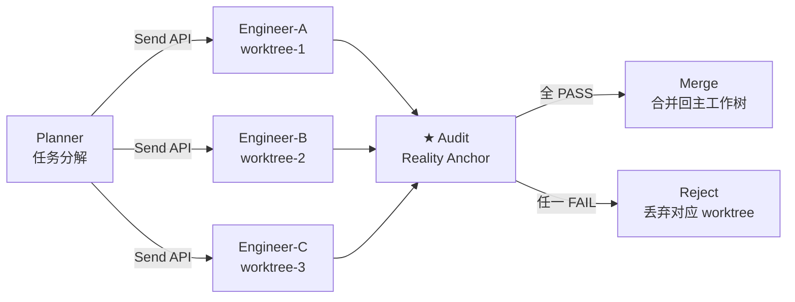

# v1.3.1 开发日志 — Ontology 本体结构 + 并行编排 + Agent 身份码 + 🚀 Onboard Agent L1

> 📋 **已排期。** 前置依赖：v1.3.0（运行时审计最小闭环 + 激活链 Phase 4 收尾）
> ⚠️ **尚未实现。** 以下内容为版本目标，不代表当前可用能力（开发排期见 ROADMAP）。
> 状态：已排期 · 2026-08-02 · 2026-08-04 增补身份码+审计聚合+Onboard L1（原 v1.3.2 拆入）
> 激活链设计文档：[docs/guides/fde-activation-chain.md](../../guides/fde-activation-chain.md)

## 背景

v1.3.0 完成运行时审计最小闭环（wrapToolCall middleware 包 createReactAgent）后，v1.3.1 是激活链 EXECUTE 阶段的**能力深化版本**——七条线并行推进：

1. **Ontology 本体结构**：将 Ontology 从「描述事实如何被理解」升级为「可运行推理底座」
2. **国标对齐**：GB/T 48000.3-2026 作为审计/Ontology 层合规参考基线
3. **并行编排**：LangGraph 原生 DAG 并行能力 + 审计节点卡关
4. **Durable Execution L1+L2**：长任务 checkpoint 续跑 + 工具幂等性保证
5. **Ontology CRUD 补全**：`update_entity` / `delete_entity` / `delete_concept` 三个 MCP tool
6. **Agent 独立身份码 + 跨设备审计聚合**（原 v1.3.2 拆入）
7. **🚀 Onboard Agent L1**（FORGE 产品化第一刀 · 工程判定层）

---

## 一、Ontology 本体结构（操作型本体论落地）

### 痛点

v1.2.0 开始的 Ontology 是「实体关联」层——`knowledge/entities/` 的 frontmatter 定义实体 + 属性 + 关系，但 LLM 在执行时**不强制经过 Ontology 层**。Agent 可以绕过 Ontology 直接写文件、调工具，Ontology 变成「写了但没人看」的文档。

### 交付

将 Ontology 从「描述性元数据」升级为「可运行推理底座」——LLM 调用必须经过 Ontology 层定义的 Action 执行，无法绕过。

| 层 | 当前 | v1.3.1 目标 |
|----|------|-------------|
| Ontology 角色 | 描述性元数据（entity frontmatter） | 可运行推理底座（Action 必经） |
| LLM 与 Ontology | Agent 可绕过 | Agent 调用必经 Ontology 定义 |
| 审计与 Ontology | 独立（审计看 diff） | 审计对齐 Ontology Action 定义 |

### 实现路径

**① 统一元模型**：对齐 Harness 规则（A1-A11、A14-A19 + E1-E4，共 21 条 + A20-A23 共 24 条，E3 并入 A11）+ 记忆 Ledger-Views-Policy。Ontology 的 Action Type 与审计引擎七步管线对齐（OLAF-I 五块骨架印证，见 [VALIDATION §三](../../VALIDATION.md)）。

**② 企业通用 Ontology 规范**：命名规范 / 版本管理 / 验证规则。

**③ 与 Agent 平台打通**：Ontology Action → wrapToolCall middleware（v1.3.0 交付）→ 工具执行。

**④ 内核契约设计参考**（Palantir 实施方法论 §3.5 启发）：内核契约是各行业共用的对象、动作、权限、状态机中不可省的部分——规定"必须有什么"不规定"叫什么"，行业包实现时可合并但不能缺。契约分四类，是 Ontology 落地时的最小建模骨架：

| 契约类型 | 条数 | 规定什么 | 行业包怎么用 |
|---------|------|---------|------------|
| 对象契约（CORE-OBJ） | 5 条 | 一等对象必须有的属性——被动作直接读写或权限授予落点的对象，不能靠计算临时得出 | 行业包用自己的对象类型去实现，可合并不能缺 |
| 动作契约（CORE-ACT） | 4 条 | 状态推进、责任转移、例外升级、价值确认——一条都不可省 | 每个行业动作必须映射到这四类之一 |
| 链接契约（CORE-LNK） | 规定关系的方向 + 基数 | 递归链接须防环（如 BOM 自引用） | 行业链接须声明方向和基数 |
| 状态机契约（CORE-STM） | 规定状态迁移约束 + 可撤销性 | 可撤销性直接决定 Agent 能碰哪些动作 | 不可逆动作须强制人复核 |

这条设计原则与 sofagent 的分布式路线一致——不建中央本体操作系统，让每个 Agent 自建本体（Ledger-Views-Policy），联邦查询跨设备共享，git diff + audit history 做硬证据链。

> 📖 来源：Palantir 实施方法论报告（2026-08，§3.5 内核契约 + 配套 ontology-primitives-v1.md §1）

### 与 Palantir 的差异化

| Palantir 做法 | sofagent 做法 | 差异化 |
|------|------|------|
| Action Types 内嵌本体，LLM 调用必经 | A15 约束验证（事后）+ fde.md Policy（事前声明）+ v1.3.0 middleware（运行时拦截） | 事后审计 → v1.3.0 运行时 → v1.3.1 Ontology 统一 |
| 集中式 Ontology OS，重度物化索引 | 分布式 knowledge/，联邦查询按需获取 | MIT 开源、零锁定、数据主权本地 |

### 涉及文件（预估）

| 文件 | 改动 | 说明 |
|------|------|------|
| `engine/orchestrator/src/ontology/` | 新建目录 | Ontology 运行时层核心 |
| `engine/orchestrator/src/ontology/action-registry.ts` | 新建 | Action 注册表——Ontology Action → 工具映射 |
| `engine/orchestrator/src/ontology/validator.ts` | 新建 | 执行前 Ontology 约束验证 |
| `engine/orchestrator/src/middleware/wrap-tool-call.ts` | 修改 | 集成 Ontology validator（v1.3.0 交付的 middleware 上扩展） |

---

## 二、国标对齐：GB/T 48000.3-2026

### 交付

将 GB/T 48000.3-2026《标准数字化 第 3 部分:本体建模要求》作为审计层 / Ontology 层的合规参考基线。不是「通过认证」，而是「对齐条款、可作为审计依据」。

### 工作内容

- 映射国标条款 → sofagent Ontology 元模型字段
- 审计报告新增「国标对齐」维度（opt-in，不影响默认行为）
- 文档标注：哪些条款已对齐、哪些部分对齐、哪些不适用

---

## 三、并行编排（LangGraph 原生 DAG 波次并行）

### 痛点

v1.1.8 编排引擎是**串行版**（DAG 并行规划留 v1.3.1）。当前 engineer 节点一次只跑一个 SubAgent，遇到多文件任务只能排队。并行编排的需求在 v1.2.3 已通过 git worktree 隔离底座做好准备——隔离原语、审计合并卡关、冲突消解、filesValue 边界均已交付。v1.3.1 补上**编排层并行能力**。

### 交付

使用 LangGraph 原生 DAG 并行能力（StateGraph + Send API）：



### 设计决策

- **审计节点 = guard edge**：每波次并行 SubAgent 完成后，统一经 audit 节点跑 `git diff` 硬证据卡关。全 PASS → 合并；任一 FAIL → 丢弃对应 worktree。
- **文件隔离由 git worktree 提供**：v1.2.3 已交付，v1.3.1 不重建隔离底座，直接复用。
- **幂等性保证**：任务 ID 查重，避免 SubAgent 恢复后重复执行外部动作（如重复创建 PR）。此机制与 Durable Execution L2 共用（见 §四）。

### 涉及文件（预估）

| 文件 | 改动 | 说明 |
|------|------|------|
| `engine/orchestrator/src/loop/graph.ts` | 修改 | StateGraph 支持 Send API 并行波次 |
| `engine/orchestrator/src/loop/parallel-scheduler.ts` | 新建 | 并行 SubAgent 调度器 |
| `engine/orchestrator/src/loop/merge-gate.ts` | 新建 | 审计卡关 + 合并/丢弃决策 |

---

## 四、Durable Execution L1+L2（Pydantic AI 启发）

### 痛点

sofagent 回溯引擎是**向后看**——出问题后回滚到某个 git snapshot。但长任务（多步骤编排、并行 SubAgent）中途 API 故障或应用崩溃时，当前只能**整批回滚重来**。

Pydantic AI（Python Agent 框架 V2, 2026-06）引入 Durable Execution——checkpoint 续跑，**向前看**。与 sofagent 回溯引擎互补：

| 维度 | 回溯引擎（已有） | Durable Execution（v1.3.1 新增） |
|------|------|------|
| 方向 | 向后回滚 | 向后续跑 |
| 触发 | 审计 FAIL / 人工回滚 | API 故障 / 应用重启 / 超时 |
| 数据 | git snapshot | graph checkpoint + 副作用登记 |
| 恢复 | 回到历史某个点 | 从中断点继续 |

### 已有基础设施（降低难度）

| 已有能力 | 位置 | 价值 |
|------|------|------|
| LangGraph `FileCheckpointer` | `.sofagent/checkpoint/` | graph 状态已落盘 |
| git snapshot 回溯引擎 | 回溯引擎 | checkpoint 的物理基础 |
| daemon 7×24 重启 | daemon | 重启后「读未完成任务→续跑」的触发点 |
| v1.3.0 wrapToolCall middleware | middleware | checkpoint 写入的天然拦截点 |

### L1：graph 状态恢复

daemon 重启后，编排引擎当前是**重新发起新 graph 调用**。L1 改为：扫描 `.sofagent/checkpoint/` → 有未完成 graph → 从中断节点恢复 StateGraph。

| 文件 | 改动 | 说明 |
|------|------|------|
| `engine/orchestrator/src/durable/resume.ts` | 新建 | checkpoint 扫描 + graph 恢复逻辑 |
| `engine/orchestrator/src/durable/checkpoint-manager.ts` | 新建 | checkpoint 写入/读取/清理 |
| `engine/daemon/src/index.ts` | 修改 | 启动时调用 resume 检查 |

**难度**：⭐⭐（中等）。核心逻辑 ~400 行。测试覆盖（模拟各种崩溃点）是重点。

### L2：工具幂等性保证

**最危险的部分**。如果任务在第 3 步崩溃，第 3 步已创建 PR、发了通知、写了文件——续跑时重放第 3 步会创建第二个 PR、发第二条通知。

**解法**：任务 ID 查重 + 副作用登记簿。

```
每个工具调用前：
  1. 在 side-effects.jsonl 登记 {taskId, action, target, timestamp}
  2. 执行工具

续跑前：
  1. 扫描 side-effects.jsonl
  2. 已执行的动作 → 跳过（幂等）
  3. 未执行的动作 → 正常执行
```

| 文件 | 改动 | 说明 |
|------|------|------|
| `engine/orchestrator/src/durable/side-effect-ledger.ts` | 新建 | 副作用登记簿（JSONL append-only） |
| `engine/orchestrator/src/durable/idempotency-check.ts` | 新建 | 续跑前查重逻辑 |
| `engine/orchestrator/src/middleware/wrap-tool-call.ts` | 修改 | 工具调用前写登记簿（复用 v1.3.0 middleware） |

**难度**：⭐⭐⭐（中等，有坑）。~500 行。

**坑位预警**：
- git 操作天然幂等（`git checkout` 跑两次结果一样）——安全
- 外部副作用（PR、webhook、飞书消息）**不幂等**——必须查重
- LLM 调用不幂等（每次结果不同）——续跑时**不能重放 LLM 节点**，用缓存结果或跳过

### L1+L2 与并行编排的协同

§三 并行编排的「幂等性保证（任务 ID 查重）」与 §四 L2 的「副作用登记簿查重」是**同一个机制服务两个场景**——并行编排恢复 + 崩溃恢复。不增加额外复杂度。

---

## 五、Ontology CRUD 补全（MCP 覆盖度审计缺口 · P1）

### 背景

v1.2.4 交付了 `create_entity` / `create_concept`（含 D1-D5 数据审计），但本体只有「建」没有「改/删」——过期/错误的 entity 只能手工清理。MCP 覆盖度审计将本体 CRUD 补全列为 P1 缺口，用户拍板归入本版。

### 交付（3 个 P1 tool）

| tool | 所属包 | 一句话 |
|------|--------|--------|
| `update_entity` | ontology | 字段级更新/改 domain/改名（区别于 `create_entity` 全量覆盖） |
| `delete_entity` | ontology | 删除过期/错误 entity，带 D1-D5 审计留痕，**MCP 可触发但强制人审确认** |
| `delete_concept` | ontology | 同上 concept 版，同样强制人审确认 |

> **安全边界（用户已背书）**：`delete_entity` / `delete_concept` 属破坏性操作——MCP 可触发，但强制 human-confirm 语义（无人审确认不执行），全程 D1-D5 审计留痕。

---

## 六、Agent 独立身份码 + KYA 完整版（原 v1.3.2 拆入）

### 定位

v1.2.5 是轻量版身份码（企业 SubAgent 注册即带身份），本版本升级为完整版——身份可跨设备验证、可审计撤销。这是后续 L2 团队协作协议（v1.3.3）和组织能力市场（v1.3.4）的**地基**：没有身份就没有"谁在协作"。

### 交付

- **身份码签发**：每个 Agent 启动时签发加密签名身份（Ed25519 keypair），绑定委托人 / 约束版本 / 责任声明
- **身份与审计绑定**：每次审计记录带签发者身份，`[sofagent]` 签名升级为"身份 + 引擎"双签名

| 文件 | 改动 | 说明 |
|------|------|------|
| `engine/core/src/identity.ts` | 新建 | 身份码签发/验证（Ed25519） |
| `engine/core/src/identity-store.ts` | 新建 | 身份注册表（本地 data/ 存储） |
| `engine/audit/src/audit-record.ts` | 修改 | 审计记录增加 agentId 字段 |
| `engine/mcp/src/tools/agent-identity.ts` | 新建 | MCP `agent_identity` tool（查自己/查他人身份） |

---

## 七、跨设备审计轨迹聚合（原 v1.3.2 拆入）

### 交付

- **审计轨迹带身份跨设备合并**：设备 A 的审计记录 + 设备 B 的审计记录，按 agentId 合并为一条完整轨迹
- **复用安全联邦通道**：加密配对 + 联邦查询（v1.1.8 已有），审计轨迹走联邦合并而非新造通道
- **冲突裁决**：同一 Agent 在两台设备的审计记录，以 HMAC 验签 + trust 优先级裁决

| 文件 | 改动 | 说明 |
|------|------|------|
| `engine/daemon/src/federation/audit-merge.ts` | 新建 | 跨设备审计轨迹聚合 |
| `engine/daemon/src/inspectors/audit-trail.ts` | 新建 | 审计轨迹聚合巡检（@daily） |
| `engine/mcp/src/tools/audit-trail.ts` | 新建 | MCP `audit_trail` tool（按 agentId 查完整轨迹） |

---

## 八、🚀 Onboard Agent L1（FORGE 产品化第一刀 · 工程判定层）

> **设计来源**：FORGE 的 `release-gate-driver.mjs`（1796 行）+ `fresh-eyes-driver.mjs`（2370 行）已在 sofagent 自身开发中验证了"元循环"可行性。本任务把这套能力**产品化**：从"给 sofagent 自己开发用"变成"给企业 AI 节点调试用"。

### 什么是 L1

Onboard Agent 完整形态有 5 层（L1 工程判定 → L2 语义判定 → L3 自动定位 → L4 自动修复 → L5 循环收敛）。**v1.3.1 只做 L1**——半自动，工程级判定：

```
企业 AI 节点（activate 生成）
  → Onboard Agent 跑一轮（复用 dag-runner）
  → 判定器检查：crash？error？超时？（不判"对不对"，只判"跑没跑起来"）
  → 跑崩了 → 报错给人工修（附审计日志 + 出错位置）
  → 修完 → 再跑 → 直到不崩
```

**边界**：L1 **不判语义对错**（那是 L2-L5 的事，v1.3.2 交付）。它只做工程级判定——能不能跑起来、跑的时候崩没崩、工具调用有没有报错。这已能解决 FDE 交付后"节点注册了但跑不通"的痛点。

**L2-L5 在 v1.3.2**：v1.3.1 交付的 Ontology 是 L2 语义判定的判据来源，v1.3.2 基于 L1 积累的数据 + Ontology 判据做 L2-L5 全闭环。

### 与身份码的协同

Onboard Agent 的调试记录（"谁调的、调了什么、结果如何"）天然需要身份溯源——正好用本版本 §六 的身份码。每次调试循环的审计记录带 agentId，可在 §七 审计轨迹聚合中追溯。

### 涉及文件

| 文件 | 改动 | 说明 |
|------|------|------|
| `engine/orchestrator/src/loop-agent/driver.ts` | 新建 | 循环驱动：activate→run→judge→fix→re-run（复用 dag-runner 跑节点） |
| `engine/orchestrator/src/loop-agent/judge.ts` | 新建 | L1 判定器：crash/error/超时检测（不判语义对错） |
| `engine/mcp/src/tools/loop-debug.ts` | 新建 | MCP `loop_debug` tool（触发调试循环 + 查结果） |

---

## 九、待明确事项

| # | 问题 | 当前倾向 | 待确认 |
|---|------|---------|--------|
| 1 | Ontology Action 与审计规则（A1-A23）的映射是 1:1 还是 N:M？ | N:M——一条审计规则可对应多个 Ontology Action，反之亦然 | 架构评审 |
| 2 | GB/T 48000.3-2026 哪些条款已对齐需先 gap analysis | 需获取标准全文后做条款映射 | 标准文本获取 |
| 3 | Durable Execution checkpoint 的清理策略（保留多久？） | 默认保留 7 天，可配置 | 实现时定 |
| 4 | LLM 节点崩溃后用缓存结果续跑——缓存有效期？ | 与 checkpoint 同生命周期（7 天） | 实现时定 |

---

## 十、依赖

- **v1.3.0**（前置）：wrapToolCall middleware 是 Durable Execution checkpoint 写入的拦截点
- **v1.2.3**（已交付）：git worktree 隔离底座——并行编排的文件隔离前提
- **v1.1.8**（已交付）：安全联邦（加密配对 + 联邦查询）——跨设备审计聚合复用
- **v1.2.5**（已交付）：Agent 身份码轻量版（企业 SubAgent 注册即带身份）——本版本升级为完整版
- **v1.2.5**（已交付）：激活链 ACTIVATE——Onboard Agent L1 依赖 activate 后有东西可调试
- **LangGraph**：StateGraph + Send API + FileCheckpointer（已在依赖中）

---

## 十一、与后续版本的依赖

| 后续版本 | 依赖 v1.3.1 的什么 |
|---------|-------------------|
| v1.3.2 Onboard Agent L2-L5 | **Ontology（L2 判据）+ 身份码（调试溯源）+ Onboard L1（基础）** |
| v1.3.3 L2 团队协作协议 | 身份码（协作主体要有身份） |
| v1.3.4 L3 组织能力市场 | 身份码 + L2 协议（市场里交易的是有身份的 Agent 能力） |
| v1.4.0 权限体系 + 代理网关 | 身份码 + 审计轨迹（权限判定依据） |

---

---

## 十二、Benchmark 评测体系（Onboard Agent L1 前置能力）

> 📖 **设计来源**：PenguinHarness (github.com/Prism-Shadow/penguin-harness, Apache-2.0) 的 `benchmark-design` + `agent-evaluation` 方法论。完整设计文档见 `~/Desktop/penguin-harness-ref/design-doc.md`。

### 定位

Onboard Agent L1 检测 crash/error，但「不 crash」≠「能用」。Benchmark 评测体系提供量化判据——节点建完后先跑 Benchmark 确认能力水平，再做 Onboard 修复。**先知道"差多少"，再决定"怎么修"。**

### 核心机制

| 机制 | 说明 | PenguinHarness 来源 |
|------|------|-------------------|
| **Statement / Rubric 物理分离** | statement 公开给被测 Agent（只描述任务），rubric 私有（评分标准 + Gold 答案）。statement 中绝不放 Gold | benchmark-design §Build the Benchmark |
| **0..100 固定分值** | 每 Case 100 分，partial credit，分数集中在"能区分强弱 Agent"的决策点 | benchmark-design §Build the Benchmark |
| **Pilot 校准** | 初稿是假设 → 跑一轮看 Agent 怎么解题 → 调难度 → 冻结 | benchmark-design §Refine the Benchmark |
| **Freeze + Formal Baseline** | 校准满意后冻结 Benchmark revision + 记录 Baseline（后续优化的参照系） | benchmark-design §Freeze and record |
| **隔离执行** | 独立 workspace + 只暴露 statement + 协议化 YAML 输出 | agent-evaluation §Prepare + §Return |
| **四种失败码** | invalid_request / benchmark_invalid / version_changed / evaluation_failed | agent-evaluation §Return |

### 能力契约（Capability Contract）

出题前先定义"测什么"：

- 公开证据有哪些
- 需要什么可观测的决策/中间产物/检查
- 弱 Agent 会走什么捷径
- 好 Agent 应该怎么做（可复用的能力提升方向）

### 文件布局

```text
data/<project>/benchmarks/<benchmark_id>/
├── benchmark_config.toml          # title + description + runs=1
├── evaluation-log.jsonl           # sofagent 审计链格式（替代 scoreboard.yaml）
└── CASE-<nnn>-<name>/
    ├── statement/                 # 公开给被测 Agent
    │   └── README.md
    └── rubric/                    # 私有评分标准
        └── README.md
```

### sofagent 适配

| PenguinHarness | sofagent | 说明 |
|----------------|----------|------|
| `scoreboard.yaml` | `evaluation-log.jsonl` | 审计链格式，HMAC 防篡改 |
| `run_subagent` | `createReactAgent` 隔离实例 | langgraph 复用 |
| Penguin CLI 启动 Test Agent | sofagent MCP `evaluate` tool | 原生工具链 |
| `--approve allow-all` | `wrapToolCall` read-only 模式（v1.3.0） | 评测时只允许读取 + 产出 |

### 涉及文件

| 文件 | 改动 | 说明 |
|------|------|------|
| `engine/orchestrator/src/benchmark/benchmark-designer.ts` | 新建 | 题库设计 + Pilot 校准 + Freeze |
| `engine/orchestrator/src/benchmark/case-evaluator.ts` | 新建 | 隔离执行 + 协议化评分 |
| `engine/orchestrator/src/benchmark/evaluation-log.ts` | 新建 | evaluation-log.jsonl 读写 + HMAC |
| `engine/mcp/src/tools/evaluate.ts` | 新建 | MCP `evaluate` tool（触发评测 + 查结果） |
| `engine/orchestrator/src/__tests__/benchmark-eval.test.ts` | 新建 | 单测（Pilot 校准 + Freeze + 隔离执行 + 失败码） |

### 验收标准

- [ ] statement/rubric 物理分离：被测 Agent 无法访问 rubric 目录
- [ ] Pilot 校准：初稿跑一轮 → 分析 → 调难度 → 第二轮
- [ ] Freeze：Benchmark revision + Agent 版本号一起冻结
- [ ] Formal Baseline：记录到 evaluation-log.jsonl（HMAC 链）
- [ ] 隔离执行：每次评测独立 workspace，只暴露 statement
- [ ] 四种失败码：invalid_request / benchmark_invalid / version_changed / evaluation_failed

> 🧠 **与 Onboard Agent L1 的关系**：Benchmark 评测是 L1 的前置——L1 检测 crash，Benchmark 量化能力。先跑 Benchmark 确认能力水平 → L1 修复 crash → 再跑 Benchmark 看是否提升。形成闭环。

---

## 十三、工具审批模式（wrapToolCall 运行时拦截增强）

> 📖 **设计来源**：PenguinHarness CLI `--approve` 四模式（allow-all / deny-all / read-only / always-ask）。完整设计文档见 `~/Desktop/penguin-harness-ref/design-doc.md` §6.1。

### 定位

v1.3.0 交付了 `wrapToolCall` 运行时拦截层（tool wrapper 包 createReactAgent）。但当前拦截只有三态（PASS/WARN/FAIL），缺少**审批模式**——不能按场景控制 Agent 的权限范围。

Benchmark 评测场景是典型需求：Test Agent 只需读取 statement + 产出 artifact，不需要写文件/执行命令。但当前 wrapToolCall 没法说「评测时自动放行只读、拦截写入」。

本版本给 wrapToolCall 增加审批模式，Benchmark 评测时用 `read-only` 模式自动隔离，日常运行用 `allow-with-audit`（审计放行）。

### 四种审批模式

| 模式 | 行为 | 适用场景 |
|------|------|---------|
| `allow-with-audit` | 全部放行，但写审计日志（默认模式） | 日常运行——Agent 干活不受限，审计兜底 |
| `deny-all` | 全部拦截 | 调试/安全演练——确认拦截链路 |
| `read-only` | 只读工具（`permission: "r"`）自动放行，读写工具需人工确认 | **Benchmark 评测**——Test Agent 只能读不能写 |
| `always-ask` | 每次工具调用都问人 | 危险操作密集场景 |

### 核心设计

**保守默认拒绝**（来自 PenguinHarness 安全模型）：
- SDK 未传入审批回调时 → 默认拒绝一切（不是放行）
- 审批模式可在运行时切换（Web/Server 每次决策时重新读取模式）
- 子 Agent 继承父 Agent 的审批模式（审批继承）

**工具权限标记**：每个 tool 在注册时声明 `permission: "r" | "rw"`

| 当前 sofagent 工具 | permission | 说明 |
|-------------------|:---------:|------|
| `read_file` | r | 只读 |
| `edit_file` / `write_file` | rw | 读写 |
| `exec_command` | rw | 读写（shell 能干一切） |
| `git_snapshot` | rw | 读写（git 操作） |
| `audit_check` | r | 只读（扫 diff） |
| `ontology_query` | r | 只读 |
| `create_entity` / `update_entity` / `delete_entity` | rw | 读写 |
| Benchmark 评测 `evaluate` tool 内部启动的 Test Agent | **read-only 强制** | 只暴露 statement + 产出 artifact |

### 拒绝处理

拒绝产生一条合成中止消息返回给 Agent：`"工具调用被拒绝（模式：{mode}）"`——Agent 可以反应（换方案或放弃），而不是直接崩溃。

每次审批决定记录为 `approval_decision` 事件，写入运行时审计日志（复用 v1.3.0 的 `data/audit/runtime/` 通道）。

### 涉及文件

| 文件 | 改动 | 说明 |
|------|------|------|
| `engine/rules/src/types.ts` | 修改 | `InterceptVerdict` 新增 `permission?: 'r' \| 'rw'` 字段 |
| `FORGE/src/audit-middleware.mjs`（v1.3.0 交付 1 新建） | 修改 | `createAuditMiddleware` 新增 `approvalMode` 参数 + read-only/deny-all/always-ask 分支 |
| `engine/rules/src/approval-mode.ts` | 新建 | 审批模式定义 + `shouldApprove(mode, permission)` 函数 |
| `engine/orchestrator/src/benchmark/case-evaluator.ts`（§十二新建） | 修改 | 评测时强制 `approvalMode: 'read-only'` |
| `engine/rules/src/__tests__/approval-mode.test.ts` | 新建 | 单测（四模式 × r/rw 组合） |

### 验收标准

- [ ] 四种模式正确工作：allow-with-audit 全放行 / deny-all 全拦截 / read-only 只放行 r / always-ask 每次问
- [ ] 保守默认：SDK 未传审批回调时默认拒绝一切
- [ ] 审批继承：子 Agent 继承父 Agent 审批模式
- [ ] Benchmark 评测时 Test Agent 强制 read-only（无法写文件/执行命令）
- [ ] 每次审批决定记录为 `approval_decision` 事件（运行时审计日志）
- [ ] 拒绝产生合成中止消息返回给 Agent（不崩溃）

> 🧠 **与 Benchmark 评测的关系**：read-only 模式是 Benchmark 评测的安全底座——§十二的隔离 workspace + statement 物理分离 + 本版本的 read-only 审批 = 三重保障，确保 Test Agent 在评测中无法逃逸。这比 PenguinHarness 的 `--approve read-only` 更强——sofagent 还叠了审计日志和约束层。

> 🧠 **与 v1.4.0 沙箱的关系**：read-only 审批模式是 v1.4.0 完整沙箱的前置能力——先有审批模式控制权限范围，v1.4.0 再加虚拟文件系统 + 网络出站白名单做硬隔离。审批模式是「软隔离」（逻辑层），沙箱是「硬隔离」（OS 层），两者互补。

---

## 十四、LLM 调用级 Trace（全量追踪）

> 📖 **设计来源**：PenguinHarness OmniMessage 协议 + Sessions & Traces 的「Trace 是唯一恢复源」设计。完整设计文档见 `~/Desktop/penguin-harness-ref/design-doc.md`。

### 定位

sofagent 审计是「变更记录」（git diff 硬证据）+ v1.3.0 runtime 审计是「工具拦截记录」。但**没有 LLM 调用级记录**——每次模型请求花了多少 token、耗时多少、为什么失败，无法逐条回放。

这是 Onboard Agent L1（§八）调试节点的关键底座：节点跑崩了，审计只能看到「改了文件」，看不到「模型那次调用出了什么问题」。

### 交付

每次 LLM 请求写一条调用记录到 `data/audit/runtime/llm-calls.jsonl`（append-only，复用 HMAC 链）：

```json
{
  "ts": "2026-08-09T03:00:00.000Z",
  "agentId": "agent-01",
  "taskId": "task-42",
  "provider": "deepseek",
  "model": "deepseek-v4-pro",
  "tokenInput": 1234,
  "tokenOutput": 567,
  "durationMs": 3210,
  "stopReason": "completed",
  "error": null
}
```

### 核心设计

- **写入点**：`engine/core/src/model-client.ts`（LLM 调用统一入口，157 行已有）——调用前后打点，不新造入口
- **stopReason 复用 §十五**：六值分类（completed/failed/aborted/timeout/malformed/auth），与错误处理同一套语义
- **成本归因**：tokenInput/tokenOutput 对接 `engine/core/src/cost-baseline.ts`（成本基线已有）——调用级 Trace 是成本面板的数据源
- **失败回放**：Benchmark 评测（§十二）失败时，按 taskId 查 llm-calls.jsonl 看模型调用链，定位是「模型调用失败」还是「工具执行失败」

### 涉及文件

| 文件 | 改动 | 说明 |
|------|------|------|
| `engine/core/src/model-client.ts` | 修改 | LLM 调用前后打点，写 llm-calls.jsonl |
| `engine/core/src/llm-call-trace.ts` | 新建 | 调用记录写入 + HMAC + 查询 |
| `engine/orchestrator/src/loop-agent/driver.ts`（§八新建） | 修改 | 调试循环读调用 Trace 定位失败 |
| `engine/core/src/__tests__/llm-call-trace.test.ts` | 新建 | 单测（写入/回读/HMAC 链） |

### 验收标准

- [ ] 每次 LLM 请求写一条调用记录（token/耗时/stopReason/error）
- [ ] 记录进 HMAC 链（防篡改）
- [ ] Benchmark 评测失败可按 taskId 回放模型调用链
- [ ] cost-baseline 可消费调用级 token 数据
- [ ] `npm test` 全绿

> 🧠 **与审计的关系**：审计 = 变更证据（git diff），调用 Trace = 运行时证据（LLM 调用链）。两者互补——审计回答「改了什么」，调用 Trace 回答「为什么这么改」。

---

## 十五、错误处理升级（stop_reason 分类 + 指数退避 + 错误收敛为消息）

> 📖 **设计来源**：PenguinHarness Agent Loop 的六值 stop_reason + 自动重连（≤5 次指数退避，auth 永不重试）。完整设计文档见 `~/Desktop/penguin-harness-ref/design-doc.md`。

### 定位

`engine/core/src/model-client.ts`（157 行）现有雏形：`maxRetries=1` + `isRetryableError()` 字符串匹配（timeout/abort/429/502/503 等）。**三个差距**：

1. **无状态分类**——字符串匹配脆弱：`auth` 错误（401/403）会被当成普通错误重试，浪费且可能触发限流
2. **无指数退避**——固定重试 1 次，服务重启风暴时重试即失败
3. **工具错误抛异常中断**——无「收敛为消息」机制，任务因一次失败终止

### 交付

**① stop_reason 六值分类**（错误分类，不是重写 LLMInterface）：

| stop_reason | 含义 | 引擎反应 |
|-------------|------|---------|
| `completed` | 正常完成 | 继续 |
| `aborted` | 用户中断 | 停止，交还用户 |
| `timeout` | LLM 超时/传输断开 | **自动重连**（退避阶梯） |
| `malformed` | 解析失败/流截断 | **自动重连**（退避阶梯） |
| `failed` | 非瞬态错误（参数等） | **自动重连**（同退避阶梯，状态仍报 failed） |
| `auth` | 凭证被拒 | **永不重试**——重试不会让错误凭证变有效 |

**② 指数退避重连**：2s → 4s → 8s → 16s → 30s（封顶 30s，总耐心窗口 ~60s，最多 5 次）——替换现有 `maxRetries=1` 固定重试。

**③ 错误收敛为消息**：工具执行失败不再抛异常中断——返回结构化错误消息给 Agent，由模型决定重试/换方案/放弃：

```ts
// 工具失败 → 结构化消息（不 throw）
{ status: "tool_error", tool: "write_file", error: "EACCES: permission denied", suggestion: "检查文件权限或换路径" }
```

### 涉及文件

| 文件 | 改动 | 说明 |
|------|------|------|
| `engine/core/src/model-client.ts` | 修改 | isRetryableError → stop_reason 分类 + 指数退避（auth 不重试） |
| `engine/core/src/stop-reason.ts` | 新建 | stop_reason 类型 + 分类函数（HTTP 状态/错误消息 → stop_reason） |
| `engine/orchestrator/src/loop-agent/driver.ts`（§八新建） | 修改 | 工具失败收敛为消息（不中断循环） |
| `engine/core/src/__tests__/stop-reason.test.ts` | 新建 | 单测（六值分类 + auth 不重试 + 退避序列） |

### 验收标准

- [ ] auth 错误（401/403）永不重试
- [ ] timeout/malformed/failed 按退避阶梯重连（2s→4s→8s→16s→30s，≤5 次）
- [ ] 工具失败收敛为结构化消息给模型（不抛异常中断）
- [ ] stop_reason 写入调用 Trace（§十四）
- [ ] `npm test` 全绿

> 🧠 **与 Onboard L1 的关系**：错误处理升级是循环引擎的鲁棒性底座——Onboard 跑长循环时，单次 API 故障不整批中断，自动重连后继续；auth 错误立即报人（换 key），不空转重试。

---

## 十六、并行编排 MergeQueue 并发合并（Message Flow 参考）

> 📖 **设计来源**：PenguinHarness Message Flow & Ordering 的 MergeQueue——多生产者并发产出 → 单消费者按到达序 yield；**流序 = 到达序，上下文序 = 原始调用序**（两套顺序服务两个消费者）。

### 定位

§三 并行编排（v1.3.1 交付 3）多个 SubAgent 并发跑，产出按完成序到达。但 sofagent 当前没有合并队列——如果直接按到达序进模型上下文，会打乱原始调用顺序，导致上下文错乱。

MergeQueue 是并行编排的**并发一致性底座**：多 SubAgent 产出合并不丢不乱。

### 核心设计

```
多个并行 SubAgent（worktree-1/2/3）
  → 各产出推入 MergeQueue
  → 单消费者按到达序 yield（审计节点可见实时进度）
  → 进模型上下文前重排回原始调用序（按 taskId 原始顺序）
```

| 设计点 | PenguinHarness | sofagent 适配 |
|--------|---------------|--------------|
| 合并机制 | MergeQueue（多生产者→单消费者） | `parallel-scheduler.ts`（§三新建）内置 MergeQueue |
| 流序 | 到达序（给 Human 渲染） | 审计节点看实时进度（到达序） |
| 上下文序 | 原始调用序（给模型） | 重排回原始 taskId 顺序再进审计节点 |
| 配对保证 | 每个 tool_call 恰一个 tool_call_output | 每个 SubAgent 任务恰一个结果（taskId 配对） |
| 提交判据 | `request_end.status === "completed"` | 审计节点全 PASS（★Reality Anchor） |

### 涉及文件

| 文件 | 改动 | 说明 |
|------|------|------|
| `engine/orchestrator/src/loop/merge-queue.ts` | 新建 | MergeQueue——多生产者并发产出合并（到达序 yield + 原始序重排） |
| `engine/orchestrator/src/loop/parallel-scheduler.ts`（§三新建） | 修改 | 接入 MergeQueue（替换直接收集） |
| `engine/orchestrator/src/loop/merge-gate.ts`（§三新建） | 修改 | 审计节点消费 MergeQueue（到达序看进度，重排后判卡关） |
| `engine/orchestrator/src/__tests__/merge-queue.test.ts` | 新建 | 单测（并发合并 + 顺序重排 + 配对保证） |

### 验收标准

- [ ] 多 SubAgent 并发产出经 MergeQueue 有序 yield（不丢不乱）
- [ ] 进模型上下文前重排回原始 taskId 顺序
- [ ] 每个 SubAgent 任务恰一个结果（taskId 配对）
- [ ] 审计节点全 PASS 才合并（与 §三 卡关一致）
- [ ] `npm test` 全绿

> 🧠 **与 §三 的关系**：§三 定义并行编排的「拓扑」（Send API 分发 + 审计卡关）；本版本补「并发一致性」（MergeQueue 合并）。拓扑管「怎么分发」，MergeQueue 管「怎么合并不乱」。

---

## 十七、L4 经验层渐进加载增强（索引注入 + 按需读取）

> 📖 **设计来源**：PenguinHarness Skills 渐进加载——系统提示只注入 name+description 索引，正文靠 read_file 按需读取。

### 现状（已查证）

`engine/harness/src/index.ts` `buildConstrainedSystemPrompt()`（L115-200）已有**部分渐进**：knowledge/ 按 mtime 取 top-N（shared 3 + federation 3 + local 5 = 最多 11 篇），每篇截取前 2000 字符，总注入 ~4000 token。

### 三个差距

1. **只有截断，没有索引**——Agent 无法获取被截断的尾部或未入选的知识
2. **mtime 排序 ≠ 相关性排序**——最新知识不一定最相关于当前任务
3. **截断 2000 字符可能砍掉关键信息**——经验的后半段丢失

### 交付

注入格式改为「索引 + 热点全文」混合：

```
# 知识库（L4 经验层）
## 当前任务热点（全文注入，top-2 by mtime）
[知识条目全文…]

## 知识索引（按需读取）
- 文件名 + frontmatter 摘要 + 首行（每个条目 ≤150 字符）
- 需要完整内容时用 read_file 读取
```

- **热点 2 篇**：全文注入（mtime 最新，保持现有行为不变）
- **索引 9 条**（shared 3 + federation 3 + local 3）：只注入文件名 + 摘要 + 首行，Agent 需要时用平台自带 read_file 拉全文
- **总注入量下降**：从 ~4000 token 降到 ~1500 token（索引远小于全文截断）

### 涉及文件

| 文件 | 改动 | 说明 |
|------|------|------|
| `engine/harness/src/index.ts` | 修改 | `buildConstrainedSystemPrompt()` 注入格式改为「热点全文 + 索引」 |
| `engine/harness/src/knowledge-index.ts` | 新建 | 知识索引构建（文件名 + frontmatter 摘要 + 首行） |
| `engine/harness/src/__tests__/knowledge-index.test.ts` | 新建 | 单测（索引构建 + 注入量下降验证） |

### 验收标准

- [ ] 热点 2 篇全文注入（保持现有行为）
- [ ] 索引 9 条只注入摘要（≤150 字符/条）
- [ ] 总注入量从 ~4000 token 降到 ~1500 token
- [ ] Agent 可按索引用 read_file 读取全文
- [ ] 既有测试全绿（不破坏现有注入语义）

> 🧠 **与约束层的关系**：L4 是经验层（可学习），索引化只改「注入格式」不改「约束语义」——L1 SKILL.md 硬约束不受影响。Agent 按需读取的是 L4 经验，不是 L1 宪法。

---

> 📖 行业对标：Palantir 操作型本体论（Ontology Action Types）见 [ROADMAP v1.3.1 节](../../ROADMAP.md)；OLAF-I 五块骨架印证见 [VALIDATION §三](../../VALIDATION.md)；Durable Execution 概念来源 Pydantic AI V2（2026-06）；Onboard Agent 设计来源 FORGE `release-gate-driver.mjs` + `fresh-eyes-driver.mjs`；Benchmark 评测方法论来源 PenguinHarness `benchmark-design` + `agent-evaluation`（方案 D：Skill 层借鉴）；工具审批模式来源 PenguinHarness CLI `--approve` 四模式；LLM 调用级 Trace / 错误处理升级 / MergeQueue / L4 渐进加载来源 PenguinHarness OmniMessage + Sessions & Traces + Message Flow + Skills 文档。
