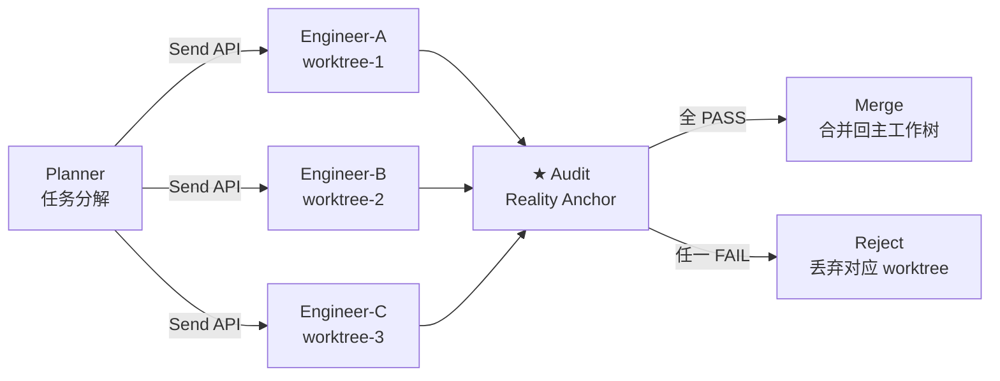

# v1.3.1 开发日志 — Ontology 本体结构 + 并行编排 + Agent 身份码 + 🚀 Onboard Agent L1

> 📋 **规划中。** 前置依赖：v1.3.0（运行时审计最小闭环 + 激活链 Phase 4 收尾）
> 状态：规划中 · 孔放勋 · 2026-08-02 · 2026-08-04 增补身份码+审计聚合+Onboard L1（原 v1.3.2 拆入）
> 激活链设计文档：[docs/guides/fde-activation-chain.md](../../../guides/fde-activation-chain.md)

## 背景

v1.3.0 完成运行时审计最小闭环（wrapToolCall middleware 包 createReactAgent）后，v1.3.1 是激活链 EXECUTE 阶段的**能力深化版本**——七条线并行推进：

1. **Ontology 本体结构**：将 Ontology 从「描述事实如何被理解」升级为「可运行推理底座」
2. **国标对齐**：GB/T 48000.3-2026 作为审计/Ontology 层合规参考基线
3. **并行编排**：LangGraph 原生 DAG 并行能力 + 审计节点卡关
4. **Durable Execution L1+L2**：长任务 checkpoint 续跑 + 工具幂等性保证
5. **Ontology CRUD 补全**：`update_entity` / `delete_entity` / `delete_concept` 三个 MCP tool
6. **Agent 独立身份码 + 跨设备审计聚合**（原 v1.3.2 拆入）
7. **🚀 Onboard Agent L1**（FORGE 产品化第一刀 · 工程判定层）

---

## 一、Ontology 本体结构（操作型本体论落地）

### 痛点

v1.2.0 开始的 Ontology 是「实体关联」层——`knowledge/entities/` 的 frontmatter 定义实体 + 属性 + 关系，但 LLM 在执行时**不强制经过 Ontology 层**。Agent 可以绕过 Ontology 直接写文件、调工具，Ontology 变成「写了但没人看」的文档。

### 交付

将 Ontology 从「描述性元数据」升级为「可运行推理底座」——LLM 调用必须经过 Ontology 层定义的 Action 执行，无法绕过。

| 层 | 当前 | v1.3.1 目标 |
|----|------|-------------|
| Ontology 角色 | 描述性元数据（entity frontmatter） | 可运行推理底座（Action 必经） |
| LLM 与 Ontology | Agent 可绕过 | Agent 调用必经 Ontology 定义 |
| 审计与 Ontology | 独立（审计看 diff） | 审计对齐 Ontology Action 定义 |

### 实现路径

**① 统一元模型**：对齐 Harness 规则（A1-A11、A14-A19 + E1-E4，共 21 条 + A20-A23 共 24 条，E3 并入 A11）+ 记忆 Ledger-Views-Policy。Ontology 的 Action Type 与审计引擎七步管线对齐（OLAF-I 五块骨架印证，见 [VALIDATION §三](../../../VALIDATION.md)）。

**② 企业通用 Ontology 规范**：命名规范 / 版本管理 / 验证规则。

**③ 与 Agent 平台打通**：Ontology Action → wrapToolCall middleware（v1.3.0 交付）→ 工具执行。

### 与 Palantir 的差异化

| Palantir 做法 | sofagent 做法 | 差异化 |
|------|------|------|
| Action Types 内嵌本体，LLM 调用必经 | A15 约束验证（事后）+ fde.md Policy（事前声明）+ v1.3.0 middleware（运行时拦截） | 事后审计 → v1.3.0 运行时 → v1.3.1 Ontology 统一 |
| 集中式 Ontology OS，重度物化索引 | 分布式 knowledge/，联邦查询按需获取 | MIT 开源、零锁定、数据主权本地 |

### 涉及文件（预估）

| 文件 | 改动 | 说明 |
|------|------|------|
| `engine/orchestrator/src/ontology/` | 新建目录 | Ontology 运行时层核心 |
| `engine/orchestrator/src/ontology/action-registry.ts` | 新建 | Action 注册表——Ontology Action → 工具映射 |
| `engine/orchestrator/src/ontology/validator.ts` | 新建 | 执行前 Ontology 约束验证 |
| `engine/orchestrator/src/middleware/wrap-tool-call.ts` | 修改 | 集成 Ontology validator（v1.3.0 交付的 middleware 上扩展） |

---

## 二、国标对齐：GB/T 48000.3-2026

### 交付

将 GB/T 48000.3-2026《标准数字化 第 3 部分:本体建模要求》作为审计层 / Ontology 层的合规参考基线。不是「通过认证」，而是「对齐条款、可作为审计依据」。

### 工作内容

- 映射国标条款 → sofagent Ontology 元模型字段
- 审计报告新增「国标对齐」维度（opt-in，不影响默认行为）
- 文档标注：哪些条款已对齐、哪些部分对齐、哪些不适用

---

## 三、并行编排（LangGraph 原生 DAG 波次并行）

### 痛点

v1.1.8 编排引擎是**串行版**（DAG 并行规划留 v1.3.1）。当前 engineer 节点一次只跑一个 SubAgent，遇到多文件任务只能排队。并行编排的需求在 v1.2.3 已通过 git worktree 隔离底座做好准备——隔离原语、审计合并卡关、冲突消解、filesValue 边界均已交付。v1.3.1 补上**编排层并行能力**。

### 交付

使用 LangGraph 原生 DAG 并行能力（StateGraph + Send API）：



### 设计决策

- **审计节点 = guard edge**：每波次并行 SubAgent 完成后，统一经 audit 节点跑 `git diff` 硬证据卡关。全 PASS → 合并；任一 FAIL → 丢弃对应 worktree。
- **文件隔离由 git worktree 提供**：v1.2.3 已交付，v1.3.1 不重建隔离底座，直接复用。
- **幂等性保证**：任务 ID 查重，避免 SubAgent 恢复后重复执行外部动作（如重复创建 PR）。此机制与 Durable Execution L2 共用（见 §四）。

### 涉及文件（预估）

| 文件 | 改动 | 说明 |
|------|------|------|
| `engine/orchestrator/src/loop/graph.ts` | 修改 | StateGraph 支持 Send API 并行波次 |
| `engine/orchestrator/src/loop/parallel-scheduler.ts` | 新建 | 并行 SubAgent 调度器 |
| `engine/orchestrator/src/loop/merge-gate.ts` | 新建 | 审计卡关 + 合并/丢弃决策 |

---

## 四、Durable Execution L1+L2（Pydantic AI 启发）

### 痛点

sofagent 回溯引擎是**向后看**——出问题后回滚到某个 git snapshot。但长任务（多步骤编排、并行 SubAgent）中途 API 故障或应用崩溃时，当前只能**整批回滚重来**。

Pydantic AI（Python Agent 框架 V2, 2026-06）引入 Durable Execution——checkpoint 续跑，**向前看**。与 sofagent 回溯引擎互补：

| 维度 | 回溯引擎（已有） | Durable Execution（v1.3.1 新增） |
|------|------|------|
| 方向 | 向后回滚 | 向后续跑 |
| 触发 | 审计 FAIL / 人工回滚 | API 故障 / 应用重启 / 超时 |
| 数据 | git snapshot | graph checkpoint + 副作用登记 |
| 恢复 | 回到历史某个点 | 从中断点继续 |

### 已有基础设施（降低难度）

| 已有能力 | 位置 | 价值 |
|------|------|------|
| LangGraph `FileCheckpointer` | `.sofagent/checkpoint/` | graph 状态已落盘 |
| git snapshot 回溯引擎 | 回溯引擎 | checkpoint 的物理基础 |
| daemon 7×24 重启 | daemon | 重启后「读未完成任务→续跑」的触发点 |
| v1.3.0 wrapToolCall middleware | middleware | checkpoint 写入的天然拦截点 |

### L1：graph 状态恢复

daemon 重启后，编排引擎当前是**重新发起新 graph 调用**。L1 改为：扫描 `.sofagent/checkpoint/` → 有未完成 graph → 从中断节点恢复 StateGraph。

| 文件 | 改动 | 说明 |
|------|------|------|
| `engine/orchestrator/src/durable/resume.ts` | 新建 | checkpoint 扫描 + graph 恢复逻辑 |
| `engine/orchestrator/src/durable/checkpoint-manager.ts` | 新建 | checkpoint 写入/读取/清理 |
| `engine/daemon/src/index.ts` | 修改 | 启动时调用 resume 检查 |

**难度**：⭐⭐（中等）。核心逻辑 ~400 行。测试覆盖（模拟各种崩溃点）是重点。

### L2：工具幂等性保证

**最危险的部分**。如果任务在第 3 步崩溃，第 3 步已创建 PR、发了通知、写了文件——续跑时重放第 3 步会创建第二个 PR、发第二条通知。

**解法**：任务 ID 查重 + 副作用登记簿。

```
每个工具调用前：
  1. 在 side-effects.jsonl 登记 {taskId, action, target, timestamp}
  2. 执行工具

续跑前：
  1. 扫描 side-effects.jsonl
  2. 已执行的动作 → 跳过（幂等）
  3. 未执行的动作 → 正常执行
```

| 文件 | 改动 | 说明 |
|------|------|------|
| `engine/orchestrator/src/durable/side-effect-ledger.ts` | 新建 | 副作用登记簿（JSONL append-only） |
| `engine/orchestrator/src/durable/idempotency-check.ts` | 新建 | 续跑前查重逻辑 |
| `engine/orchestrator/src/middleware/wrap-tool-call.ts` | 修改 | 工具调用前写登记簿（复用 v1.3.0 middleware） |

**难度**：⭐⭐⭐（中等，有坑）。~500 行。

**坑位预警**：
- git 操作天然幂等（`git checkout` 跑两次结果一样）——安全
- 外部副作用（PR、webhook、飞书消息）**不幂等**——必须查重
- LLM 调用不幂等（每次结果不同）——续跑时**不能重放 LLM 节点**，用缓存结果或跳过

### L1+L2 与并行编排的协同

§三 并行编排的「幂等性保证（任务 ID 查重）」与 §四 L2 的「副作用登记簿查重」是**同一个机制服务两个场景**——并行编排恢复 + 崩溃恢复。不增加额外复杂度。

---

## 五、Ontology CRUD 补全（MCP 覆盖度审计缺口 · P1）

### 背景

v1.2.4 交付了 `create_entity` / `create_concept`（含 D1-D5 数据审计），但本体只有「建」没有「改/删」——过期/错误的 entity 只能手工清理。MCP 覆盖度审计将本体 CRUD 补全列为 P1 缺口，用户拍板归入本版。

### 交付（3 个 P1 tool）

| tool | 所属包 | 一句话 |
|------|--------|--------|
| `update_entity` | ontology | 字段级更新/改 domain/改名（区别于 `create_entity` 全量覆盖） |
| `delete_entity` | ontology | 删除过期/错误 entity，带 D1-D5 审计留痕，**MCP 可触发但强制人审确认** |
| `delete_concept` | ontology | 同上 concept 版，同样强制人审确认 |

> **安全边界（用户已背书）**：`delete_entity` / `delete_concept` 属破坏性操作——MCP 可触发，但强制 human-confirm 语义（无人审确认不执行），全程 D1-D5 审计留痕。

---

## 六、Agent 独立身份码 + KYA 完整版（原 v1.3.2 拆入）

### 定位

v1.2.5 是轻量版身份码（企业 SubAgent 注册即带身份），本版本升级为完整版——身份可跨设备验证、可审计撤销。这是后续 L2 团队协作协议（v1.3.3）和组织能力市场（v1.3.4）的**地基**：没有身份就没有"谁在协作"。

### 交付

- **身份码签发**：每个 Agent 启动时签发加密签名身份（Ed25519 keypair），绑定委托人 / 约束版本 / 责任声明
- **身份与审计绑定**：每次审计记录带签发者身份，`[sofagent]` 签名升级为"身份 + 引擎"双签名

| 文件 | 改动 | 说明 |
|------|------|------|
| `engine/core/src/identity.ts` | 新建 | 身份码签发/验证（Ed25519） |
| `engine/core/src/identity-store.ts` | 新建 | 身份注册表（本地 data/ 存储） |
| `engine/audit/src/audit-record.ts` | 修改 | 审计记录增加 agentId 字段 |
| `engine/mcp/src/tools/agent-identity.ts` | 新建 | MCP `agent_identity` tool（查自己/查他人身份） |

---

## 七、跨设备审计轨迹聚合（原 v1.3.2 拆入）

### 交付

- **审计轨迹带身份跨设备合并**：设备 A 的审计记录 + 设备 B 的审计记录，按 agentId 合并为一条完整轨迹
- **复用安全联邦通道**：加密配对 + 联邦查询（v1.1.8 已有），审计轨迹走联邦合并而非新造通道
- **冲突裁决**：同一 Agent 在两台设备的审计记录，以 HMAC 验签 + trust 优先级裁决

| 文件 | 改动 | 说明 |
|------|------|------|
| `engine/daemon/src/federation/audit-merge.ts` | 新建 | 跨设备审计轨迹聚合 |
| `engine/daemon/src/inspectors/audit-trail.ts` | 新建 | 审计轨迹聚合巡检（@daily） |
| `engine/mcp/src/tools/audit-trail.ts` | 新建 | MCP `audit_trail` tool（按 agentId 查完整轨迹） |

---

## 八、🚀 Onboard Agent L1（FORGE 产品化第一刀 · 工程判定层）

> **设计来源**：FORGE 的 `release-gate-driver.mjs`（1796 行）+ `fresh-eyes-driver.mjs`（2370 行）已在 sofagent 自身开发中验证了"元循环"可行性。本任务把这套能力**产品化**：从"给 sofagent 自己开发用"变成"给企业 AI 节点调试用"。

### 什么是 L1

Onboard Agent 完整形态有 5 层（L1 工程判定 → L2 语义判定 → L3 自动定位 → L4 自动修复 → L5 循环收敛）。**v1.3.1 只做 L1**——半自动，工程级判定：

```
企业 AI 节点（activate 生成）
  → Onboard Agent 跑一轮（复用 dag-runner）
  → 判定器检查：crash？error？超时？（不判"对不对"，只判"跑没跑起来"）
  → 跑崩了 → 报错给人工修（附审计日志 + 出错位置）
  → 修完 → 再跑 → 直到不崩
```

**边界**：L1 **不判语义对错**（那是 L2-L5 的事，v1.3.2 交付）。它只做工程级判定——能不能跑起来、跑的时候崩没崩、工具调用有没有报错。这已能解决 FDE 交付后"节点注册了但跑不通"的痛点。

**L2-L5 在 v1.3.2**：v1.3.1 交付的 Ontology 是 L2 语义判定的判据来源，v1.3.2 基于 L1 积累的数据 + Ontology 判据做 L2-L5 全闭环。

### 与身份码的协同

Onboard Agent 的调试记录（"谁调的、调了什么、结果如何"）天然需要身份溯源——正好用本版本 §六 的身份码。每次调试循环的审计记录带 agentId，可在 §七 审计轨迹聚合中追溯。

### 涉及文件

| 文件 | 改动 | 说明 |
|------|------|------|
| `engine/orchestrator/src/loop-agent/driver.ts` | 新建 | 循环驱动：activate→run→judge→fix→re-run（复用 dag-runner 跑节点） |
| `engine/orchestrator/src/loop-agent/judge.ts` | 新建 | L1 判定器：crash/error/超时检测（不判语义对错） |
| `engine/mcp/src/tools/loop-debug.ts` | 新建 | MCP `loop_debug` tool（触发调试循环 + 查结果） |

---

## 九、待明确事项

| # | 问题 | 当前倾向 | 待确认 |
|---|------|---------|--------|
| 1 | Ontology Action 与审计规则（A1-A23）的映射是 1:1 还是 N:M？ | N:M——一条审计规则可对应多个 Ontology Action，反之亦然 | 架构评审 |
| 2 | GB/T 48000.3-2026 哪些条款已对齐需先 gap analysis | 需获取标准全文后做条款映射 | 标准文本获取 |
| 3 | Durable Execution checkpoint 的清理策略（保留多久？） | 默认保留 7 天，可配置 | 实现时定 |
| 4 | LLM 节点崩溃后用缓存结果续跑——缓存有效期？ | 与 checkpoint 同生命周期（7 天） | 实现时定 |

---

## 十、依赖

- **v1.3.0**（前置）：wrapToolCall middleware 是 Durable Execution checkpoint 写入的拦截点
- **v1.2.3**（已交付）：git worktree 隔离底座——并行编排的文件隔离前提
- **v1.1.8**（已交付）：安全联邦（加密配对 + 联邦查询）——跨设备审计聚合复用
- **v1.2.5**（已交付）：Agent 身份码轻量版（企业 SubAgent 注册即带身份）——本版本升级为完整版
- **v1.2.5**（已交付）：激活链 ACTIVATE——Onboard Agent L1 依赖 activate 后有东西可调试
- **LangGraph**：StateGraph + Send API + FileCheckpointer（已在依赖中）

---

## 十一、与后续版本的依赖

| 后续版本 | 依赖 v1.3.1 的什么 |
|---------|-------------------|
| v1.3.2 Onboard Agent L2-L5 | **Ontology（L2 判据）+ 身份码（调试溯源）+ Onboard L1（基础）** |
| v1.3.3 L2 团队协作协议 | 身份码（协作主体要有身份） |
| v1.3.4 L3 组织能力市场 | 身份码 + L2 协议（市场里交易的是有身份的 Agent 能力） |
| v1.4.0 权限体系 + 代理网关 | 身份码 + 审计轨迹（权限判定依据） |

---

> 📖 行业对标：Palantir 操作型本体论（Ontology Action Types）见 [ROADMAP v1.3.1 节](../../../ROADMAP.md)；OLAF-I 五块骨架印证见 [VALIDATION §三](../../../VALIDATION.md)；Durable Execution 概念来源 Pydantic AI V2（2026-06）；Onboard Agent 设计来源 FORGE `release-gate-driver.mjs` + `fresh-eyes-driver.mjs`。
