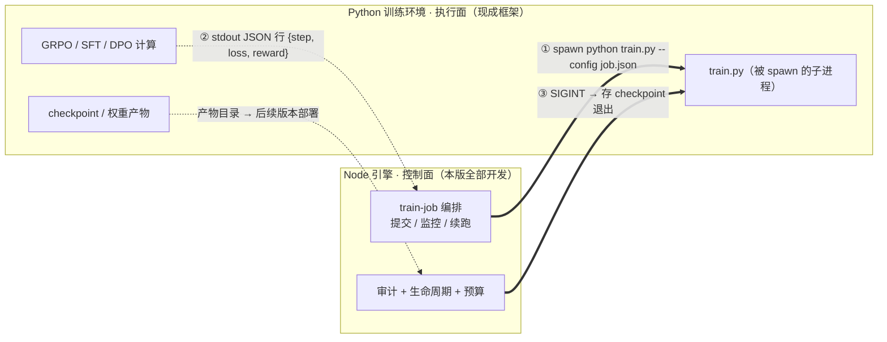

# v1.4.1 开发日志 — 训练引擎 · 地基（协议 + 编排 + 审计 + 预算）

> 📋 **已排期。** 前置依赖：v1.3.1（LLM Trace / Benchmark 评测 / 审批模式）+ v1.3.2（Trace 任务级轨迹 / client_type 插槽）
> ⚠️ **尚未实现。** 以下内容为版本目标，不代表当前可用能力（开发排期见 ROADMAP）。
> 状态：已排期 · 2026-08-10（v1.4.1-1.4.4 拆分第一版）

## 定位

> 🚀 **训练引擎 = 把「后训练」从脚本变成可交付、可审计、可打包的产品能力**——让「提供训练管线 / 联合训练」两种 C13 交付模式成立（`AIR.md` §3.4）。本版是**地基**：先把双栈契约、训练任务编排、训练审计、预算控制四条定下来——**没有它们，后面的数据管道 / eval / 沙箱都无处安放**。

**归属边界（2026-08-10 拍板，详见 `AIR.md` §3.6）**：训练引擎的**工程骨架放开源约束层**（通用工程能力 = 编排/审计/沙箱，开源是信任杠杆），**训练资产放模型层 AIR**（配方/权重/数据基准 = 壁垒）。

**版本拆分（2026-08-10 拍板）**：训练引擎拆四版——**v1.4.1 地基**（本版：协议+编排+审计+预算）→ **v1.4.2 数据与评估**（数据管道/训练集版本/eval 闭环/环境管理/训练报告）→ **v1.4.3 运行与需求**（监控+GPU 队列/失败诊断/沙箱+设备打包/需求推导+模板库）→ **v1.4.4 信号与部署闭环**（语料导出三件套/C13 权重部署/产物注册衔接/多基座对比）。

---

## 一、双栈架构决策（Node 控制面 + Python 执行面）

### 背景：Node/TS 后训练生态调研（2026-08-10 实测）

主流生产后训练框架（verl / TRL / NeMo RL / Oumi / open-instruct）在 2026 年**全部是 Python**（PyTorch + CUDA 生态决定，Node 无法绕过）。唯一纯 Node 方案：

| 方案 | 生态 | 硬约束 | 用途 |
|------|:---:|------|------|
| **@mlx-node/trl**（npm） | ✅ Node 18+ | **仅 Apple Silicon（M1+）Metal GPU**，SFT/GRPO/DPO + 内置 reward + checkpoint | **个人 Mac 阶段 0 验证**（reward 规则 → 收敛），不用于客户交付 |
| verl / TRL / NeMo RL / Oumi | ❌ Python | CUDA GPU（x86 + 4090 等） | **生产 + 客户交付（C13）**，不可替代 |

### 决策

**双栈不可避免，但用「Node 控制面 + Python 执行面」控制**——业界标准做法（NeMo RL 自己也是 Ray 控制面 + Megatron 训练后端）：

- **编排 / 审计 / 生命周期 / 预算全在 Node**（像 dag-runner 管 Agent 一样管 train job）
- **Python 只当被 spawn 的训练子进程**——接口 = 进程参数 + JSON 事件 + 日志流，双栈解耦
- **个人 Mac 阶段 0 用 @mlx-node/trl 纯 Node 跑通验证路径**（reward 规则 → 收敛），验证通过后再无缝换 Python 框架做生产——**阶段 0 不用碰 Python**，省掉学习成本

### 训练协议：三个约定（接口即解耦 · 双栈的契约）

> 🔗 **2026-08-10 补充**：双栈解耦的关键是**协议先定**——Node 与 Python 之间只有三个约定，遵守它们就能任意换执行框架（Oumi ↔ verl ↔ TinyZero 只改 spawn 命令与 config 格式，引擎代码不动）。**协议即版本边界**：v1.4.1 定稿后不可随意增删字段，新增字段走版本号（config schema version）。

| # | 约定 | 方向 | 规范 | 备注 |
|---|------|:--:|------|------|
| **① 启动** | Node → Python | spawn | `python train.py --config <job.json>`——**参数收敛为一个 JSON 文件**（数据路径 + 基座 + 算法 + 超参 + checkpoint 路径 + 产物目录 + 预算），Node 不传散参数 | job.json 即训练任务的完整快照，审计可读 |
| **② 回报** | Python → Node | stdout 事件流 | Python **只往 stdout 打 JSON 行**：`{type:'progress', step, loss, reward}` / `{type:'checkpoint', path, step}` / `{type:'done'\|'failed', reason}`——Node 逐行解析更新状态 | 禁止 print 非 JSON 文本（污染事件流） |
| **③ 控制** | Node → Python | 信号 | Node 发 **SIGINT** → Python 捕获后**存 checkpoint 优雅退出**（退出码 0）→ Node 记录断点 → 续跑时从断点恢复 | 硬杀（SIGKILL）仅限沙箱超时兜底 |

**协议错误处理**：
- ② 流中一行 JSON 解析失败 → 记 `train_protocol_error` 审计事件 + 尝试续解析，不整体崩溃（容忍库的 warn 输出）
- ③ SIGINT 后超时（默认 30s）未退出 → 升级 SIGKILL + 记审计（进程卡死兜底）
- job.json 校验失败（zod schema）→ 拒绝 spawn，返回结构化错误（对齐 v1.3.6 workflow_submit 模式）

### 涉及文件（预估）

| 文件 | 改动 | 说明 |
|------|------|------|
| `engine/orchestrator/src/train/train-protocol.ts` | 新建 | 协议三约定的类型定义（job.json schema / stdout 事件类型 / 信号处理） |
| `engine/orchestrator/src/__tests__/train-protocol.test.ts` | 新建 | 单测（JSON 行解析 + 错误容忍 + 信号超时） |

### 验收标准

- [ ] job.json schema 定义（zod），校验失败拒绝 spawn
- [ ] stdout JSON 流解析（progress/checkpoint/done/failed），坏行不崩溃
- [ ] SIGINT → 优雅退出（存 checkpoint，退出码 0）；30s 超时升级 SIGKILL
- [ ] `npm test` 全绿

---

## 二、训练任务编排层（train-job 生命周期 · 引擎骨架）

### 痛点

没有编排层，Oumi 只是「客户自己会的工具」不是「我们交付的能力」——「提供训练管线」交付模式直接缺地基。与 dag-runner 管 Agent 同构：训练任务也是一种长任务。

### 交付

| 组件 | 能力 |
|------|------|
| **train submit** | 提交训练任务（数据路径 + 基座 + 算法 SFT/DPO/GRPO + 超参 + 预算）→ 生成 train job 实例（trainJobId） |
| **train 监控** | 训练进度（step/epoch/loss/reward 曲线）实时可查——事件流从 Python 子进程回流 |
| **train 取消 / 重跑** | 任务可取消、可带 checkpoint 续跑（复用 v1.3.1 Durable Execution checkpoint 语义） |
| **train 生命周期** | queued → running → checkpointing → completed / failed / cancelled，状态机 + 幂等 |
| **checkpoint 管理** | 训练产物（checkpoint / LoRA adapter / 量化权重）目录规范 + 版本清单（衔接 v1.4.4 C13 本地权重部署） |

### 涉及文件（预估）

| 文件 | 改动 | 说明 |
|------|------|------|
| `engine/orchestrator/src/train/train-job.ts` | 新建 | train job 数据模型 + 状态机 |
| `engine/orchestrator/src/train/train-scheduler.ts` | 新建 | 任务编排（提交/监控/取消/续跑）——spawn Python 子进程 + 事件回流 |
| `engine/mcp/src/tools/train-submit.ts` | 新建 | MCP `train_submit` tool |
| `engine/orchestrator/src/__tests__/train-job.test.ts` | 新建 | 单测（状态机 + 幂等 + checkpoint 续跑） |

### 验收标准

- [ ] `train_submit` 提交 → train job 状态机流转（queued → running → completed）
- [ ] 训练进度事件流回流（step/loss/reward 可查）
- [ ] 取消 / checkpoint 续跑可用（幂等，不重复消费）
- [ ] 训练产物目录规范落地（衔接 v1.4.4 权重部署）
- [ ] `npm test` 全绿

---

## 三、训练任务审计（train_job · 训练本身可审计）

### 定位

对齐 sofagent 铁律「所有断言必须可实测」——训练任务本身要可审计、可回滚：谁提交的 / 用了什么数据 / 什么超参 / 产出什么权重。

### 交付

| 组件 | 能力 |
|------|------|
| **train_job 审计事件** | 提交 / 开始 / checkpoint / 完成 / 失败 / 取消——每次记 `train_job` 事件（trainJobId + 数据源 hash + 超参 + 产出） |
| **数据溯源** | 训练集来源 hash（数据管线输入指纹）——训练可追溯 |
| **失败回滚** | 训练失败 → 回滚到上一 checkpoint / 干净状态（git snapshot 兜底） |

### 涉及文件（预估）

| 文件 | 改动 | 说明 |
|------|------|------|
| `engine/audit/src/writer.ts` | 修改 | 增加 `train_job` 事件类型（对齐 decision-log 模式） |
| `engine/orchestrator/src/train/train-audit.ts` | 新建 | train job 审计写入（复用 atomicAppendSync + HMAC） |

### 验收标准

- [ ] 每次 train job 状态迁移记 `train_job` 审计事件
- [ ] 数据源 hash 入库（训练集可溯源）
- [ ] 失败回滚可用（上一 checkpoint 恢复）
- [ ] `npm test` 全绿

---

## 四、训练预算控制（train budget · 成本透明）

### 定位

> 📋 **2026-08-10 补充（训练引擎完善）**：训练是**算力密集型长任务**——客户/C13 交付要能设预算上限（时间 / 估算算力成本），超预算自动暂停 + 人审。对齐「成本透明」产品原则 + 模型网关的预算控制模式。

### 交付

| 组件 | 能力 |
|------|------|
| **预算字段** | train submit 带预算（`budget: {maxMinutes, maxSteps, maxCost}`）——写入 job.json |
| **超预算暂停** | 超预算 → 自动 SIGINT 存 checkpoint 暂停 + 记 `train_budget_exceeded` 审计 → 人工决定「续跑 / 终止」 |
| **预算报告** | 训练完成/暂停时报告实际消耗（耗时 / 步数 / 估算成本）——写 evaluation-log 关联 |

### 涉及文件（预估）

| 文件 | 改动 | 说明 |
|------|------|------|
| `engine/orchestrator/src/train/train-budget.ts` | 新建 | 预算监控（超限暂停 + 人审） |
| `engine/mcp/src/tools/train-budget.ts` | 新建 | MCP `train_budget` tool（查预算 / 人审续跑） |

### 验收标准

- [ ] job.json 带预算字段，超预算自动暂停（SIGINT 存 checkpoint）
- [ ] 超预算记 `train_budget_exceeded` 审计 + 人工可续跑/终止
- [ ] 完成时报告实际消耗（耗时/步数/成本）
- [ ] `npm test` 全绿

---

## 与后续版本的依赖

| 后续版本 | 依赖 v1.4.1 的什么 |
|---------|-------------------|
| **v1.4.2 数据与评估** | 数据管道产出的训练集喂给 train-job（协议① job.json）；eval 闭环消费 train-job 完成事件 |
| **v1.4.3 运行与需求** | GPU 队列接入 train-scheduler；失败诊断消费 train_job 审计事件 |
| **v1.4.4 信号与部署** | checkpoint 管理衔接 C13 权重部署；产物注册衔接 train done 事件 |
| **AIR 模型层** | ① 双栈协议 = 「提供训练管线」交付模式的地基 ② train_job 审计 = 训练本身可审计可回滚 ③ 预算控制 = 成本透明（AIR 定价前提）④ @mlx-node/trl = 个人 Mac 阶段 0 纯 Node 验证路径（reward → 收敛） |

> 📖 行业对标：训练编排的「Node 控制面 + Python 执行面」对齐 NeMo RL 的 Ray 控制面 + Megatron 训练后端；@mlx-node/trl（npm）为 Apple Silicon 纯 Node 后训练库（2026 实测）。
