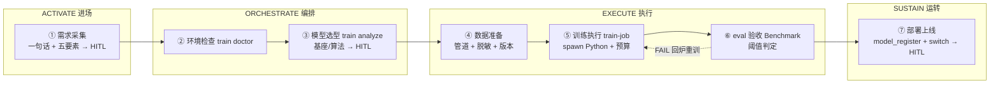

# v1.4.3 开发日志 — 训练引擎 · 运行与需求（监控 + 诊断 + 沙箱 + 推导 + 模板 + DSH 执行深化收口 + 审计聚合指标 + 训练反作弊基线 + 存量清扫与升级审查）

> 📋 **已排期。** 前置依赖：v1.4.1（train-job 编排 + train_job 审计）+ v1.4.2（数据管道 / eval 闭环 / 训练环境）+ v1.3.7（沙箱）+ v1.3.2（FDE 梳理辅助）
> ⚠️ **尚未实现。** 以下内容为版本目标，不代表当前可用能力（开发排期见 ROADMAP）。
> 状态：已排期 · 2026-08-10（v1.4.1-1.4.4 拆分第三版）· 2026-08-26 模板库补 RL 配方模板 + MoE 基座注意（第四章）+ 失败诊断补重复坍塌/精度异常分类（第二章）——River/ScaleRL/slime 调研收编，用户拍板落盘 · **2026-08-28 承接 v1.4.2 拍板移交的 FORGE DSH 执行深化步一~三（第六章），用户拍板落盘** · **2026-08-28 收编「审计聚合指标 · 安全边界触发率」（第七章，用户拍板——约束层价值量化闭环）·「训练环境反作弊基线」（第八章，用户拍板——reward hacking 四形态双防线默认化，一手清单见 DEVELOPMENT A8 节）** · **2026-08-29 收编「存量清扫」（第十一章，用户拍板——退场不清扫债务一次收编，SSOT 引用 v1.5.0 第六章）·「存量升级审查」（第十二章，用户拍板——老功能翻新八项登记，各版本消化）**

> 🔗 **训练 Agent 化（2026-08-23 拍板，详见 v1.4.1）**：本版失败诊断是训练 Agent 的决策面（LLM 诊断 + 修复建议），GPU 队列/沙箱走资源面（确定性代码）；训练模板库 = 训练 Agent 的可复用决策模板。

## 定位

> 🚀 **训练引擎 · 运行与需求**——让训练**跑得动、找得到问题、出得了交付**：长任务监控 + GPU 队列（运行可用性）、失败诊断（故障运维）、训练沙箱 + 设备打包（数据主权 + 交付形态）、需求推导 + 模板库（训练引擎区别于训练工具的分水岭）；**外加 FORGE DSH 执行深化步一~三收口（自 v1.4.2 拍板移交）+ 审计聚合指标（安全边界触发率——约束层价值从逐次事件变成可汇报的治理 KPI）+ 训练环境反作弊基线（reward hacking 四形态双防线写进默认配置——防线是设计期输入不是事后补）**。

---

## 一、训练监控与 GPU 队列（train_status · 长任务可用性）

> 📋 **2026-08-10 补充（架构审查新发现）**：训练是**小时级长任务**——`train_submit` 有了，但**查询侧缺失**（MCP 客户端没法查进度）；且**多训练并发时 GPU 显存怎么分**没定义（一张 4090 同时跑两个任务会 OOM）。

### 交付

| 组件 | 能力 |
|------|------|
| **train_status MCP tool** | 查训练进度：status / step / loss / reward 曲线 / 日志尾部——MCP 客户端（WorkBuddy/商业平台）可查 |
| **train list MCP tool** | 历史任务列表：按时间 / 状态 / 模型 / 企业过滤——FDE 交付复盘、多任务管理（2026-08-10 补充） |
| **train queue** | GPU 资源队列：按显存预算排队（串行 or 按预算并发），对齐 v1.3.7 AsyncSubAgent 模式——避免并发 OOM |
| **进度推送** | 训练完成/失败 → 事件推送（复用 v1.2.1 webhook 三态推送） |

### 涉及文件（预估）

| 文件 | 改动 | 说明 |
|------|------|------|
| `engine/mcp/src/tools/train-status.ts` | 新建 | MCP `train_status` tool |
| `engine/mcp/src/tools/train-list.ts` | 新建 | MCP `train_list` tool（历史任务列表 + 过滤） |
| `engine/orchestrator/src/train/gpu-queue.ts` | 新建 | GPU 资源队列（显存预算 + 排队） |
| `engine/orchestrator/src/train/train-scheduler.ts` | 修改 | 接入 GPU 队列 |
| `engine/orchestrator/src/train/dashboard-sink.ts` | 新建 | 训练状态落盘 `data/dashboard/train-status.json`（供 Dashboard 读取，对齐 worklog.json 模式） |
| `tools/dashboard/dashboard.html` | 修改 | 新增「训练任务」区块（当前在跑/最近完成/失败任务一览，读 train-status.json） |

### 验收标准

- [ ] `train_status` 可查进度（status/step/loss/reward/日志尾部）
- [ ] **`train_list` 可查历史任务（时间/状态/模型/企业过滤）**
- [ ] GPU 队列：并发任务按显存预算排队，不 OOM
- [ ] 训练完成/失败事件推送可用（webhook 三态）
- [ ] **训练状态落盘 `data/dashboard/train-status.json`，Dashboard「训练任务」区块可读**（当前在跑/最近完成/失败一览）
- [ ] **训练引擎健康度指标落盘 `data/dashboard/train-health.json`**（成功率 / 平均耗时 / 失败 top 原因 / GPU 利用率——供 Dashboard 聚合 + 外部监控系统消费）
- [ ] `npm test` 全绿

---

## 二、训练失败诊断（train diagnose · 故障运维）

> 📋 **2026-08-10 补充（训练引擎完善）**：训练失败是**高概率事件**（OOM / 数据格式错 / 超参发散 / 框架版本不匹配）——失败后要能**自动诊断**，而不是把原始日志丢给用户。对齐 sofagent 错误处理升级（v1.3.1 stop_reason 分类 + 指数退避）的思路。

### 交付

| 组件 | 能力 |
|------|------|
| **失败分类** | `train diagnose <trainJobId>` → 按失败特征分类：OOM / 数据格式错 / 超参发散（loss 不收敛）/ 框架错误 / 环境不匹配 / **重复坍塌与精度异常（2026-08-26 补）** |
| **诊断上下文** | 自动收集：失败日志尾部 + 环境版本（v1.4.2 train-env.json）+ 最近 checkpoint + 超参——打包成诊断报告 |
| **修复建议** | 每类失败给建议：OOM → 减 batch/开 gradient checkpointing；数据格式错 → 数据管道重跑；超参发散 → 调 learning rate/加 KL 系数；**重复坍塌 → 重复早停检测 + 长度窗口分阶段扩张（MiniMax-M1 稳定性配方）；精度异常（bf16 混合精度下 loss 尖刺）→ LM head/优化器状态升 FP32（MiniMax-M1 + ScaleRL 同款处方）** |

### 涉及文件（预估）

| 文件 | 改动 | 说明 |
|------|------|------|
| `engine/orchestrator/src/train/train-diagnose.ts` | 新建 | 失败分类 + 诊断报告 |
| `engine/mcp/src/tools/train-diagnose.ts` | 新建 | MCP `train_diagnose` tool |

### 验收标准

- [ ] `train diagnose` 输出失败分类（OOM/数据/发散/框架/环境/重复坍塌/精度异常）
- [ ] 诊断报告含上下文（日志尾部 + 环境 + checkpoint + 超参）
- [ ] 每类失败有修复建议（含重复坍塌与精度异常两类新处方）
- [ ] `npm test` 全绿

---

## 三、训练沙箱 + 设备打包

### 定位

联合训练模式「数据不出企业边界」→ 训练进程隔离；「提供训练管线」→ 轻量到能打包进设备。本版在 v1.3.7 沙箱底座上扩展训练场景。

### 交付

| 组件 | 能力 |
|------|------|
| **训练进程隔离** | 训练子进程在沙箱内运行（无外网 / 只读数据源 / 只写训练产物目录）——扩展 v1.3.7 沙箱 |
| **训练离线能力** | 训练任务不依赖云端（客户机房离线可训） |
| **设备打包** | 训练管线（train-submit + 数据管道 + QLoRA 配置）可打包进交付设备（U 盘/电脑）——设备封装前置 |

### 涉及文件（预估）

| 文件 | 改动 | 说明 |
|------|------|------|
| `engine/orchestrator/src/train/train-sandbox.ts` | 新建 | 训练沙箱（扩展 v1.3.7，进程级隔离） |
| `tools/package-train-runtime.sh` | 新建 | 训练运行时打包脚本（设备交付） |

### 验收标准

- [ ] 训练子进程沙箱隔离（无外网 / 只读数据源 / 只写产物目录）
- [ ] 客户机房离线训练可用（不依赖云端）
- [ ] 打包脚本可产出训练运行时（U 盘/电脑交付形态）
- [ ] `npm test` 全绿

---

## 四、训练需求推导 + 模板库（workflow 节点 → 训练配置）

### 定位

帮企业训练「不是泛泛训个模型，而是**根据 workflow 中每个节点需要的能力，精确定义这个节点需要什么样的专属模型**」。本版把这条推导做成引导式工具 + 场景模板库——训练引擎区别于训练工具的分水岭。

### 交付

```
workflow 节点（如「产线校准」）
  → 训练目标（预测校准参数？分类缺陷？）
  → 数据需求（需要什么数据、多少量）
  → 评估标准（用什么指标验收）
  → 训练配置（LoRA? QLoRA? 什么基座）——从模板库选
  → train_submit（衔接 v1.4.1 训练任务编排）
```

| 组件 | 能力 |
|------|------|
| **训练需求推导** | CLI `sofagent train analyze <node>`——逐节点引导推导训练目标/数据需求/评估标准/训练配置 |
| **训练模板库** | 场景化配置模板（文本提取 / 分类 / 生成 / 多轮对话）——QLoRA/SFT/DPO 参数模板，`train templates list` 可查，FDE 交付时实例化 |
| **RL 配方模板** | 模板库补 **RL 算法维度**（2026-08-26 补）：`grpo / dapo / cispo` 三组配方模板 + ScaleRL 四技巧注释（batch 级 advantage 归一化 / CISPO clip ε / 零方差组跳过 / LR warmup，arxiv 2510.13786 论文配方可复现）。参考形态：slime `--advantage-estimator` choices（GRPO/CISPO 上游原生）+ verl `algorithm.adv_estimator`。**理由：阶段 2 主路线是 RL（v1.4.6 已提 GRPO 大采样组），模板库缺 RL 模板 = 主路线裸奔** |
| **MoE 基座模板注意** | 模板实例化时若基座为 MoE：LoRA 配置必须显式覆盖 expert 矩阵（target_modules）——配置模板带 `base_type: dense/moe` 标注 + moe 模板内置 expert 覆盖校验（2026-08-26 补，对齐商业侧后训练内部规范 §5.2）。阶段 2 当前为 dense 基座（Qwen3/R1-Distill），此条是切换 MoE 基座时的前置防护 |
| **配置生成** | 推导结果 + 模板 → 训练配置（Oumi 格式）→ 直接 `train_submit` |
| **与 FDE 梳理辅助衔接** | 复用 v1.3.2 五要素产出（节点描述 + 耗时 + 最卡的地方）作为推导输入 |

### 涉及文件（预估）

| 文件 | 改动 | 说明 |
|------|------|------|
| `engine/orchestrator/src/train/train-analyze.ts` | 新建 | 训练需求推导（引导式） |
| `engine/orchestrator/src/train/train-templates.ts` | 新建 | 场景模板库（QLoRA/SFT/DPO 模板 + RL 配方模板） |
| `engine/orchestrator/src/train/qlora-template.ts` | 新建 | QLoRA 配置模板（Oumi 格式） |
| `engine/orchestrator/src/train/rl-templates.ts` | 新建 | RL 配方模板（grpo/dapo/cispo + ScaleRL 四技巧参数，2026-08-26 补） |
| `engine/orchestrator/src/__tests__/train-analyze.test.ts` | 新建 | 单测（节点 → 配置推导 + 模板实例化 + RL 模板实例化） |

### 验收标准

- [ ] `train analyze` 可从 workflow 节点推导训练目标/数据需求/评估标准
- [ ] `train templates list` 可查场景模板；推导结果 + 模板 → 配置 → `train_submit` 全链路通
- [ ] 复用 v1.3.2 FDE 梳理产出（不重复采集）
- [ ] **RL 配方模板（grpo/dapo/cispo）可实例化**——参数含 ScaleRL 四技巧（advantage 归一化 / CISPO clip / 零方差跳过 / LR warmup），实例化产出可被 `train_submit` 消费
- [ ] **MoE 模板防护生效**——`base_type: moe` 模板实例化时校验 expert 矩阵覆盖（target_modules 缺失 → 拒绝并给修复提示）
- [ ] `npm test` 全绿

---

## 五、后训练 workflow（FDE 载体 · 模板落盘）

> 📋 **2026-08-10 补充（产品定位确认）**：训练引擎**不能是纯粹引擎**——它必须作为 **FDE Harness 的一个核心功能点**存在：企业一句话发起后训练 → 自动选型 → 训练 → 部署，全程 FDE 载体 + 审计卡关 + HITL 确认。本版把这条链路落成 **workflow 模板**（`FDE/templates/post-training/post-training.yml`）。

### 定位：训练引擎是能力，FDE workflow 是载体

```
训练引擎（v1.4.1-1.4.4）= 发动机（能力层）
FDE 后训练 workflow = 传动系统（载体层，本版）
  → 激活链四阶段做骨架
  → 训练引擎四版做节点能力
  → 审计卡关 + 三个 HITL 确认点做安全气囊
```

**为什么用 LangGraph StateGraph 不用 createReactAgent**：训练是**高成本、长任务、强顺序**流程——环境→选型→数据→训练→eval→部署一步不能跳。StateGraph 把流程焊死成确定性骨架（`①→②→③→④→⑤→⑥→⑦`），节点内部 LLM 辅助，节点之间不自由跳转。

### 七节点 + 激活链四阶段映射



| 激活链阶段 | workflow 节点 | 用训练引擎的什么 | 谁在做 |
|---|---|---|---|
| **ACTIVATE 进场** | ① 需求采集 | 一句话 + 五要素引导 | LLM 辅助 + HITL 确认 |
| **ORCHESTRATE 编排** | ② 环境检查 → ③ 模型选型 | train doctor / train analyze + 模板库 | 规则驱动 + HITL 确认选型 |
| **EXECUTE 执行** | ④ 数据准备 → ⑤ 训练执行 → ⑥ eval 验收 | 数据管道 / train-job / eval 闭环 | 自动执行 + 审计卡关 |
| **SUSTAIN 运转** | ⑦ 部署上线 + 持续后训练 | model_register / 持续后训练 | 强制人审晋升 |

### 三个 HITL 确认点（人必须在场的地方）

| 确认点 | 节点 | 为什么人必须确认 |
|---|---|---|
| ① 需求确认 | pt-need-collect | 企业一句话可能有歧义，模型不能自己脑补 |
| ③ 模型选型确认 | pt-model-select | 选哪个基座/算法影响成本，必须企业点头 |
| ⑦ 部署晋升 | pt-deploy | 权重上线是生产变更，强制人审（对齐 v1.3.5 promote_ab） |

**训练中（⑤）不需要人**——预算控制（v1.4.1 ④）在超预算时自动暂停等人审，其余全自动。

### 模板落盘

| 文件 | 说明 |
|------|------|
| `FDE/templates/post-training/post-training.yml` | 后训练 workflow 模板（workflow-parser 合法实例，可被 dag-runner 加载）——七节点 + hitl 配置 + capability_ref 标注依赖版本 |

### 涉及文件（预估）

| 文件 | 改动 | 说明 |
|------|------|------|
| `FDE/templates/post-training/post-training.yml` | 新建 | 后训练 workflow 模板（2026-08-10 已落盘） |
| `FDE/templates/README.md` | 修改 | 文件清单加 post-training 模板行 |
| `engine/orchestrator/src/workflow-parser.ts` | 复用 | 模板格式校验（无环/无悬空） |
| `engine/orchestrator/src/__tests__/post-training-workflow.test.ts` | 新建 | 单测（模板可解析 + DAG 校验通过 + hitl 配置正确） |

### 验收标准

- [ ] `post-training.yml` 可被 workflow-parser 解析（DAG 无环校验通过）
- [ ] 七节点依赖序正确（需求→环境→选型→数据→训练→eval→部署）
- [ ] 三个 HITL 确认点配置正确（interrupt_before: true）
- [ ] 各节点 capability_ref 指向正确版本（v1.4.1-1.4.4）
- [ ] FDE/templates/README.md 已登记模板
- [ ] **SKILL.md 登记本版 MCP tools（`train_status` / `train_list` / `train_diagnose`）—— check-version.sh 工具数校验通过（终态 76→79：本版三件均属训练监控/诊断侧；第七章审计聚合指标是 CLI 能力不占 tool 位，工具数基线口径不变）**
- [ ] `npm test` 全绿

---

## 六、FORGE DSH 执行深化步一~三（自 v1.4.2 拍板移交 · 2026-08-28）

> 📋 **2026-08-28 用户拍板**：v1.4.2 章⑨「DSH 执行深化」按分步交付计划，步零（数据流地基三债 + 重复率熔断 + A 侧收敛指令）已实交付，**步一~三正式移交本版**。前置（v1.4.1，commit 2fb524c7 工具注入）与双轴目标（性能 + 稳定一次走完）、红线（编排层永远不切 LangGraph / 每步带降级验证 / 并发内存先实测）见 [v1.4.2 开发日志章⑨](./v1.4.2.md#九dsh-执行深化forge-loop-全量切-dsh--2026-08-26-排期)。

### 交付（三步承接，验收标准随步携带）

| 步 | 内容 | 验收 |
|---|------|------|
| 一、流式面重建 | 消费 `session.events`（tool/call、tool/result、assistant/message）重建 LangGraph streamHandler 三职责：报告捕获（gotReport 即收工）/ 软硬熔断判定 / 逐步 usage 记账；`dsh-events.mjs` 事件订阅从骨架转正（notify_session 联调，消除 120s 轮询盲区） | fresh-eyes 审查 worker 在 DSH 后端下产出与 langgraph 后端等深的报告（工具预算消耗、熔断行为对齐） |
| 二、审查类 step 分级切 | 按流式依赖从弱到强：a-verify（有限任务）→ a-consolidate（长输出）→ check worker（流式依赖最重）；check 切换前必须双后端镜像验证（同 prompt 两后端跑，findings 一致性比对——v1.3.9 backend-ab 方法论复用） | `resolveFreshEyesBackend` 全 step 走 dsh，langgraph 降级链保留且产物不丢 |
| 三、治理面收口 | usage 自动计量（DSH 运行时级 token 数据接 usage.jsonl——「driver 逐步手记」升级为运行时自动记；run-01 实测全部调用 usage 缺失，成本盲拍）；rc→正式版守卫解除演练（DSH 正式版发布后守卫自动放行零代码变更） | usage.jsonl 记账零手记；release-gate-driver 同步受益 |

### 涉及文件（预估）

| 文件 | 改动 | 说明 |
|------|------|------|
| `FORGE/src/dsh-events.mjs` | 修改 | 事件订阅从骨架转正（notify_session 联调） |
| `FORGE/src/fresh-eyes-driver.mjs` | 修改 | streamHandler 三职责重建 + step 分级切 + usage 记账接线 |
| `FORGE/src/release-gate-driver.mjs` | 修改 | 治理面收口同步受益（usage 自动计量） |

### 验收标准

- [ ] 步一：DSH 后端下审查报告与 langgraph 后端等深（工具预算消耗、熔断行为对齐）
- [ ] 步二：`resolveFreshEyesBackend` 全 step 走 dsh；langgraph 降级链保留且产物不丢；check 切换前双后端镜像验证通过
- [ ] 步三：usage.jsonl 运行时自动记账（零手记）；rc→正式版守卫解除演练通过
- [ ] 全程降级验证：DSH 路径异常 fallback LangGraph 且产物不丢（红线不动）
- [ ] `node FORGE/src/fresh-eyes-driver.test.mjs` 直跑全绿（注意：自执行断言脚本，`node` 直跑而非 `node --test`）

---

## 七、审计聚合指标 · 安全边界触发率（约束层价值量化 · 2026-08-28 收编）

> 📋 **2026-08-28 用户拍板**：约束层的价值目前是**逐次事件**（这次拦了什么），缺**聚合度量**——「近 30 天 N 次变更中，多少次触发审计边界、拦下多少次注入」这一行数字对企业客户比任何文档都有说服力，把「约束生效」从定性声明变成可汇报的治理 KPI。数据地基已就绪：`~/.sofagent/data/audit/history.jsonl` 已有全量原始记录（timestamp / exitCode / ruleResults×17 / actionGovernance / HMAC 链），**纯聚合零新采集**。指标体系对齐 Agent 产品四评估指标方法论（任务完成率 / 人工干预率 / 用户接受率 / 安全边界触发率），本版先落**触发率**主轴。

### 交付

| 组件 | 能力 |
|------|------|
| **`sofagent-audit --stats` CLI** | 聚合命令：读 history.jsonl（只读不写，HMAC 链零破坏）→ 输出近 30 天（`--days N` 可调）治理报告：变更总数 / PASS·WARN·FAIL 分布 / **安全边界触发率**（(WARN+FAIL)/总数）/ 高危规则触发 Top 5（A2 密钥 / A9 注入 / A3 越界…）/ 阻断率 |
| **`--json` 纯净输出** | 机器可读聚合报告（零人类可读混入——JSON 纯净是 CLI 纪律）供企业 SIEM / 监控平台消费 |
| **治理健康度落盘** | 聚合结果写 `data/dashboard/audit-stats.json`（对齐 train-status.json / worklog.json 落盘模式） |
| **Dashboard 治理健康区块** | 读 audit-stats.json：变更总数 + 触发率 + FAIL 拦截数 + 高危规则 Top 5——企业客户一眼看到「约束在干活」 |

### 设计决策

1. **纯聚合不加 MCP tool**——CLI `--stats` 足够，企业消费走 `--json`；本版工具数基线 76 不动（聚合是审计包自身能力，不是新工具面）
2. **指标口径写进 HANDBOOK**——触发率 = (WARN+FAIL)/总数、阻断率 = FAIL/总数、FAIL 判定以 exitCode=2 为准（17 条默认规则逐条 ruleResults 可下钻），口径单源防漂移
3. **只读铁律**——聚合层永不写 history.jsonl（HMAC 链完整性是审计信任根基）

### 涉及文件（预估）

| 文件 | 改动 | 说明 |
|------|------|------|
| `engine/audit/src/stats.ts` | 新建 | 聚合计算（解析 history.jsonl → 指标），只读 |
| `engine/audit/src/cli-quick.ts` | 修改 | 接 `--stats` / `--days N` / `--json` 参数 |
| `engine/audit/src/__tests__/stats.test.ts` | 新建 | 单测（指标计算 + 空历史降级 + JSON 纯净） |
| `tools/dashboard/dashboard.html` | 修改 | 「治理健康」区块（读 audit-stats.json） |
| `docs/HANDBOOK.md` | 修改 | 指标口径节（触发率/阻断率定义 + 下钻说明） |

### 验收标准

- [ ] `sofagent-audit --stats` 输出聚合报告（默认 30 天，`--days N` 可调，空历史降级不崩）
- [ ] `--json` 输出纯净机器可读（零人类可读混行）
- [ ] 指标口径与 HANDBOOK 一致（触发率/阻断率定义逐条对账）
- [ ] Dashboard「治理健康」区块可读 audit-stats.json（变更总数 / 触发率 / FAIL 拦截 / Top 5 规则）
- [ ] 只读验证：聚合前后 history.jsonl 字节级一致（HMAC 链零破坏）
- [ ] `npm test` 全绿

---

## 八、训练环境反作弊基线（reward hacking 四形态 · 双防线默认化 · 2026-08-28 收编）

> 📋 **2026-08-28 用户拍板**：reward hacking 四形态清单（Agent Lightning v1.0 §4.3.2，arXiv 2608.17528）已落 [DEVELOPMENT A8 失败清单节](../../DEVELOPMENT.md)——Agent 在评估/训练环境中会「绕过解题直接拿参考源码」：① Git 历史定位 gold commit 拿答案 ② wget/curl 拉 GitHub 上游参考实现 ③ pip 下载含答案的包源码 ④ urllib 网络库抓源码。**v1.4.2 训练环境（train env init）已交付，本版把两道防线写进默认配置**——防线是设计期输入，不等事后补。

### 交付

| 组件 | 能力 |
|------|------|
| **断历史回溯（防线一）** | train job 运行环境默认**禁用 Git 命令 + 隐藏 `.git` 目录**：数据集挂载时剥离 `.git`，训练沙箱内 `git` 不可用——gold commit 无法被定位检出 |
| **断外联通道（防线二）** | 训练沙箱**网络白名单 + 默认拦截出网**：仅放行模型下载端点（基座模型 / pip 训练依赖镜像），其余出网默认拒——wget/curl/pip/urllib 抓源码通道被掐断 |
| **反作弊基线体检** | `train doctor` 新增反作弊基线检查项：git 禁用状态 / `.git` 可见性 / 网络白名单生效——体检报告明示防线是否到位（对齐 doctor 既有模式） |
| **防线可配置** | 白名单清单外部化（`train-env.json` 增 `networkAllowlist` 字段），默认拦截 + 按需放行——机制开源、阈值外部化（对齐 eval 闭环同原则） |

### 涉及文件（预估）

| 文件 | 改动 | 说明 |
|------|------|------|
| `engine/orchestrator/src/train/env-manager.ts` | 修改 | 环境初始化注入反作弊基线（剥离 `.git` + 禁用 git + 网络白名单生成） |
| `engine/orchestrator/src/train/gpu-queue.ts` / 沙箱层 | 修改 | 训练沙箱出网默认拦截 + 白名单放行（复用 v1.3.7 沙箱网络策略面） |
| `engine/mcp/src/tools/train-doctor.ts` | 修改 | 新增反作弊基线三项体检 |
| `tools/train-env-init.sh` | 修改 | 一键安装时落默认白名单配置 |
| `engine/orchestrator/src/__tests__/env-anticheat.test.ts` | 新建 | 单测（`.git` 剥离 + git 禁用 + 白名单拦截/放行分支） |

### 验收标准

- [ ] 训练数据集挂载后 `.git` 不可见、`git` 命令沙箱内不可用
- [ ] 沙箱出网默认拦截，白名单内端点（模型下载）可通、白名单外拒
- [ ] `train doctor` 输出反作弊基线三项状态（防线未到位明示告警）
- [ ] 白名单外部化：改 `train-env.json.networkAllowlist` 生效，默认值拦截
- [ ] `npm test` 全绿

---

## 九、新功能入口导览 + onboarding 断层走查（三条新产品线落地后的入口预检 · 2026-08-28 收编）

> 📋 **2026-08-28 用户拍板**：v1.4.2 一次上了三条新产品线（训练引擎 · 数据与评估 / FDE 六引擎 / IM 桥），但新用户入口还是同一个 install.sh——**功能堆得越快、入口越糊**。历史评审已有教训（README 主推路径与实际体验不一致、断头路指引、dashboard 空数据直接退出）。本版在发版周期内做一次「陌生人视角」入口走查，并把新功能入口导览固化进文档，避免 onboarding 断层。

### 交付

| 组件 | 能力 |
|------|------|
| **新功能入口导览节** | HANDBOOK「近期版本新功能速览」扩展为导览表：每条新产品线一行——**是什么 / 从哪进（命令或文档锚点）/ 前置要求（如训练引擎需 GPU 环境，走 `train env init`）**，新人 10 分钟内知道每条线怎么开始 |
| **install.sh 完成提示分层** | 安装完成后的提示按场景分流：核心约束层（装完即用）/ 训练引擎（可选，需 `train env init` 准备环境）/ IM 桥（可选，按 [im-bridge 指南](../guides/im-bridge.md)）——不提示不存在的命令，不断头路 |
| **onboarding 断层走查清单** | 发版检查项：以陌生人视角走「装 → 找到三条线入口 → 各自 10 分钟内进入第一步」，逐项记录断点（命令不存在 / 文档无指引 / 依赖未声明），断点即修 |
| **空状态友好化** | Dashboard 空数据不再直接退出——给「尚无数据，先做 X」的引导文案（历史评审遗留：新用户照 README 指引只看到「数据尚未生成」） |

### 涉及文件（预估）

| 文件 | 改动 | 说明 |
|------|------|------|
| `docs/HANDBOOK.md` | 修改 | 「近期版本新功能速览」→ 导览表（三线 × 是什么/从哪进/前置要求） |
| `install.sh` | 修改 | 完成提示按场景分层（核心 / 训练可选 / IM 桥可选），与真实命令一一对账 |
| `tools/dashboard/sofagent-dashboard.sh` | 修改 | 空数据引导文案替代直接退出 |
| `docs/changelog/releasing.md` | 修改 | 发版 SOP 补「onboarding 走查」检查项（多条新产品线同版落地时必走） |

### 验收标准

- [ ] HANDBOOK 导览表覆盖三条新产品线（入口命令 + 前置要求逐条可跑通）
- [ ] install.sh 完成提示的每个命令真实存在（逐条对账，无断头路）
- [ ] 走查清单执行记录随发版检查清单落盘（断点即修，修复有 commit）
- [ ] Dashboard 空数据给引导文案不直接退出
- [ ] `npm test` 全绿（涉及文件含脚本改动时）

---

## 十、fresh-eyes 四轮审查 bugfix 批实测注记（2026-08-29 · 场景矩阵 F-10 定谳）

> 第四轮报告称「双 commit 场景第二个 PASS 静默（输出 0 行）」、第五轮复验实测单 commit PASS 5 行回声不静默——两者场景可能不同。本批按任务十四要求跑满六格矩阵定谳（实测环境：临时 git 仓库 + 全局 sofagent-audit v1.4.2 + 本仓 tools/hooks/sofagent-precommit.sh + engine/audit/dist/cli-quick.js）。

| 场景 | 通道 | 实测输出行数 | 静默？ | 关键行 |
|------|------|:---:|:---:|--------|
| 单 commit PASS | quick | 8 | ❌ | `✓ [sofagent] 17 条规则全通过（commit sha）` |
| range 2-commit 全 PASS | quick | 8 | ❌ | `✓ [sofagent] 17 条规则全通过（range HEAD~2..HEAD）` |
| range 第二个 commit PASS | quick | 8 | ❌ | 同上——quick range 输出为整体单出口（generateQuickOutput），无逐 commit 分行路径 |
| 单 commit PASS | hook（commit-msg 模式） | 5 | ❌ | `✅ ━━━ sofagent 审计 · 17 规则 · PASS ━━━` + `✅ [sofagent] 审计通过` |
| 连续第 2 个 commit PASS | hook（commit-msg 模式） | 4 | ❌ | 同上（含 .gitignore 自动补建提示的首 commit 为 6 行） |
| range × hook | hook | N/A | — | hook 恒审 --cached（暂存区），无 range 参数路径（--diff 属 FULL_ONLY 转完整引擎） |

**定谳**：六格无任何静默格，F-10 关闭（不改代码）。第四轮报告的「0 行静默」疑因测的是**裸 pre-commit 模式**（无参 + 无 stdin JSON）——该形态下脚本 §1 判非 commit 命令提前 exit 0，审计整体未触发（输出 0 行但非「PASS 静默」而是「未审计」）。此为独立已知边界：产品 --init 安装的三层 hook 体系里审计职责在 commit-msg hook（pre-commit 只做 .sofagent/ 移出防线），裸 pre-commit 调用不属于受支持形态，记录不修。

---

## 十一、存量清扫（退场不清扫债务一次收编 · 2026-08-29 收编）

> 📋 **2026-08-29 用户拍板**：「不能只是一味地增加新的东西，有些老的东西该被淘汰就要被淘汰掉。」存量功能考察（对照 GitHub 同类项目 + 仓库取证）产出四件退役残留 + 一件重叠工具 + 一件自扫动作，全部收编进本版。详细设计（涉及文件/验收标准/迁移提示文案）见 [v1.5.0 第六章](../v1.5/v1.5.0.md#六存量清扫退场不清扫债务一次收编)——**本版执行，v1.5.0 章节为 SSOT 引用源**。

### 清扫清单（执行项）

| # | 对象 | 判据 | 证据位置 | 动作 |
|---|------|------|---------|------|
| 一 | ao 工具链探测 | 过时 | `engine/core/src/run-envs.ts:111` 探测 `['ao','0.7.5']`——ao 已于 v1.0.7 退役 | 删除探测行 + 测试断言 |
| 二 | `composeWithDeepAgents` 函数名 | 名不副实 | `engine/orchestrator/src/composer.ts:109`——注释称「ao 完全退役」，实现全走 createReactAgent | 更名 `composeWithReactAgent`，旧名 @deprecated 别名一版 |
| 三 | fde_compose 的 ontology action | 功能重叠 | 与 v1.4.2 六引擎 `fde_derive` 完全重叠（五要素→ontology 草稿） | 收窄 workflow-only，ontology 返回迁移提示 |
| 四 | `checkHistoryChain` 旧 API | API 迭代残留 | `engine/core/src/audit-history.ts:396` 已标 @deprecated，后继 `checkHistoryChainDetailed` 已交付多版 | 本版移除（minor 版内 breaking，CHANGELOG 索引公告） |
| 五 | commons_retire scan 自扫 | 吃自己狗粮 | 仓库自带 low_invoke/low_rating 退役扫描，从未自跑 | 发版前对 commons 全量 tool 跑一次，报告落盘 |

### 验收标准（并入本版总验收）

- [ ] run-envs 输出无 ao 条目
- [ ] `composeWithReactAgent` 可用，旧名 @deprecated 别名转发
- [ ] fde_compose 仅响应 action=workflow
- [ ] checkHistoryChain 移除，全仓 grep 无调用残留
- [ ] commons_retire scan 自扫报告落盘
- [ ] `npm test` 全绿

---

## 十二、存量升级审查（老功能翻新 · 2026-08-29 登记）

> 📋 **2026-08-29 用户拍板**：「老的功能开发好了不能一直放着，看看有什么可以更新或优化的。」与第十一章清扫（删除型）相对，本章是**升级型**——功能不删，但按同类项目演进与自身规划兑现。GitHub 对标：AutoHarness shadow mode / AGT ACS YAML / harness-kit doom loop。

### 升级清单（登记项 · 各版本消化 · 2026-08-29 二次深挖补第八项）

| # | 对象 | 现状证据 | 升级方向 | 去向 |
|---|------|---------|---------|------|
| 一 | **eval 三套体系统一** | `engine/eval`（评分引擎，v1.2.0 独立包）+ `engine/orchestrator/src/benchmark/`（评测设计/执行/MLflow 导出）+ `engine/ab-test`（A/B 对照）——三套各建一套 runner/scorer | 统一判定核心（单 scorer 多入口），eval 包为 SSOT、benchmark 与 ab-test 复用其 scoring 层 | **v1.4.4 语料导出前置**（训练 eval 闭环要求三源同口径）+ v1.5.1 持续采样受益 |
| 二 | **加载链预算落地** | ROADMAP「加载链预算目标跟踪」自认「v1.3.8 未全量落地（当前为全文注入，仅 persona 500 字符与 knowledge 2000 字符截断）」——harness/src/index.ts:147 仍是字符截断非 token 预算 | token 级预算 + 超载拒载/降级机制（v1.4.8 ④ 自动上下文压缩是入口，本项是其数据底座） | **v1.4.8 ④**（自动上下文压缩触发条件依赖 token 计量） |
| 三 | **webhook 推送现代化** | v1.1.6/v1.2.1 交付的三态推送（飞书/钉钉/企微）目前仅审计结果场景 | 扩展事件源：训练完成（v1.4.3 已排）/ 治理 KPI 周报（v1.5.0）/ 死信告警（v1.5.2）——统一 webhook 事件总线 | **v1.5.2 事件总线**（webhook 入站+出站统一） |
| 四 | **daemon 巡检 28 项冗余审查** | `engine/daemon/src/inspectors/` 已 28 个巡检文件——`fde-companion-daily`（陪跑）/`fde-registry-daily`/`commons-health`/`commons-catalog-daily` 等粒度参差 | 按 @daily/@weekly/@monthly 归组审计一遍：同频次可合并的合并（commons-health 与 commons-catalog-daily 候选）、指标类统一走 trend-aggregator | **v1.5.0 治理 KPI 面板**（数据源来自巡检，先归组再面板化避免面板读 28 个源） |
| 五 | **IM 桥从可选到一等公民** | install.sh 默认不装（`--with-im-bridge` 可选分支，@xmanrui/dsh-im 社区插件） | FDE Harness 层执行通道叙事下，远程指挥不应是可选项——评估转默认安装或官方维护 | **v1.5.0 FDE 陪跑期补全联动评估**（陪跑期日报经 IM 推送是自然场景） |
| 六 | **76 MCP tools 瘦描述覆盖度** | v1.4.0 交付「瘦描述」时 66 tools，现 76——新增 10 个（fde 六件/train 三件/train_budget 已有）覆盖度未复核 | 复核新增 tools 描述长度与去版本号纪律（v1.4.3 第九章 onboarding 走查联动） | **v1.4.3 第九章**（入口导览走查时一并复核） |
| 七 | **证据强度分级落地** | 探索方向「证据强度分级标注」：VALIDATION/THANKS 有来源纪律但无强度分级 | 对外案例按「公开可查/用户自报/自测自报」三级标注，只维护最强少数案例 | **v1.5.1 措辞收紧联动**（样本补上后同步标注） |
| 八 | **本体混合检索（向量召回 + 图谱扩权）** | 本体数据当前查询能力以实体/关系遍历为主，无向量召回通道——Semantica 实测同任务上下文 token 38k→12k（省 60%）、准确率 82.1%→89.2% | 评估「向量初筛候选 + 本体图谱遍历精化」混合检索：知识库检索走向量召回，业务决策走图谱遍历，两路合一 | **v1.5.0 ②双时态联动评估**（本体查询层升级时一并评估，属同一 schema 层变更） |

### 验收标准

- [ ] 升级清单八项全部有明确去向版本（上表右列），无「待评估」悬空项
- [ ] eval 统一与加载链预算两项在去向版本交付时回引本章
- [ ] `npm test` 全绿（登记无代码改动）


---

## 与后续版本的依赖

| 后续版本 | 依赖 v1.4.3 的什么 |
|---------|-------------------|
| **v1.4.4 信号与部署** | 沙箱承接训练进程；需求推导产出的配置喂给语料导出（训练目标标注）；后训练 workflow 的 pt-deploy 节点衔接企业专属模型权重部署；**审计聚合指标 = 企业侧「治理效果可汇报」的对接点（信号与部署阶段对外交付物之一）** |
| **v1.4.3 步三 → FORGE 后续观察项** | usage 自动计量上线后，模型分层（check worker 切低成本档）与增量审查（round-02+ 只扫 diff）可按真实 token 账拍板——v1.4.2 章⑨「后续版本观察项」的数据前置就绪 |
| **模型层（商业侧）** | ① 训练沙箱 = 联合训练「数据不出边界」的实现底座 ② 需求推导 + 模板库 = 「基于 workflow 定义训练需求」的开源规则驱动版（模型驱动版在其上）③ 设备打包 = 设备封装前置 ④ **后训练 workflow = 训练引擎作为 FDE Harness 核心功能点的载体（企业一句话发起后训练的完整链路）** |

> 📖 行业对标：GPU 队列对齐 v1.3.7 AsyncSubAgent 并发模式；失败诊断对齐 v1.3.1 stop_reason 六值分类思路；**审计聚合指标对齐 Agent 产品四评估指标方法论（安全边界触发率为第四指标，对齐 approval modes + maxTurns 的产品化表达）**。
