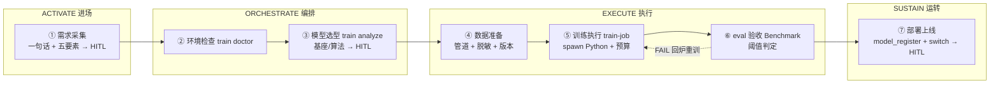

# v1.4.3 开发日志 — 训练引擎 · 运行与需求（监控 + 诊断 + 沙箱 + 推导 + 模板）

> 📋 **已排期。** 前置依赖：v1.4.1（train-job 编排 + train_job 审计）+ v1.4.2（数据管道 / eval 闭环）+ v1.3.7（沙箱）+ v1.3.2（FDE 梳理辅助）
> ⚠️ **尚未实现。** 以下内容为版本目标，不代表当前可用能力（开发排期见 ROADMAP）。
> 状态：已排期 · 2026-08-10（v1.4.1-1.4.4 拆分第三版）

## 定位

> 🚀 **训练引擎 · 运行与需求**——让训练**跑得动、找得到问题、出得了交付**：长任务监控 + GPU 队列（运行可用性）、失败诊断（故障运维）、训练沙箱 + 设备打包（数据主权 + 交付形态）、需求推导 + 模板库（训练引擎区别于训练工具的分水岭）。

---

## 一、训练监控与 GPU 队列（train_status · 长任务可用性）

> 📋 **2026-08-10 补充（架构审查新发现）**：训练是**小时级长任务**——`train_submit` 有了，但**查询侧缺失**（MCP 客户端没法查进度）；且**多训练并发时 GPU 显存怎么分**没定义（一张 4090 同时跑两个任务会 OOM）。

### 交付

| 组件 | 能力 |
|------|------|
| **train_status MCP tool** | 查训练进度：status / step / loss / reward 曲线 / 日志尾部——MCP 客户端（WorkBuddy/模板市场）可查 |
| **train list MCP tool** | 历史任务列表：按时间 / 状态 / 模型 / 企业过滤——FDE 交付复盘、多任务管理（2026-08-10 补充） |
| **train queue** | GPU 资源队列：按显存预算排队（串行 or 按预算并发），对齐 v1.3.7 AsyncSubAgent 模式——避免并发 OOM |
| **进度推送** | 训练完成/失败 → 事件推送（复用 v1.2.1 webhook 三态推送） |

### 涉及文件（预估）

| 文件 | 改动 | 说明 |
|------|------|------|
| `engine/mcp/src/tools/train-status.ts` | 新建 | MCP `train_status` tool |
| `engine/mcp/src/tools/train-list.ts` | 新建 | MCP `train_list` tool（历史任务列表 + 过滤） |
| `engine/orchestrator/src/train/gpu-queue.ts` | 新建 | GPU 资源队列（显存预算 + 排队） |
| `engine/orchestrator/src/train/train-scheduler.ts` | 修改 | 接入 GPU 队列 |
| `engine/orchestrator/src/train/dashboard-sink.ts` | 新建 | 训练状态落盘 `data/dashboard/train-status.json`（供 Dashboard 读取，对齐 worklog.json 模式） |
| `dashboard.html` | 修改 | 新增「训练任务」区块（当前在跑/最近完成/失败任务一览，读 train-status.json） |

### 验收标准

- [ ] `train_status` 可查进度（status/step/loss/reward/日志尾部）
- [ ] **`train_list` 可查历史任务（时间/状态/模型/企业过滤）**
- [ ] GPU 队列：并发任务按显存预算排队，不 OOM
- [ ] 训练完成/失败事件推送可用（webhook 三态）
- [ ] **训练状态落盘 `data/dashboard/train-status.json`，Dashboard「训练任务」区块可读**（当前在跑/最近完成/失败一览）
- [ ] **训练引擎健康度指标落盘 `data/dashboard/train-health.json`**（成功率 / 平均耗时 / 失败 top 原因 / GPU 利用率——供 Dashboard 聚合 + 外部监控系统消费）
- [ ] `npm test` 全绿

---

## 二、训练失败诊断（train diagnose · 故障运维）

> 📋 **2026-08-10 补充（训练引擎完善）**：训练失败是**高概率事件**（OOM / 数据格式错 / 超参发散 / 框架版本不匹配）——失败后要能**自动诊断**，而不是把原始日志丢给用户。对齐 sofagent 错误处理升级（v1.3.1 stop_reason 分类 + 指数退避）的思路。

### 交付

| 组件 | 能力 |
|------|------|
| **失败分类** | `train diagnose <trainJobId>` → 按失败特征分类：OOM / 数据格式错 / 超参发散（loss 不收敛）/ 框架错误 / 环境不匹配 |
| **诊断上下文** | 自动收集：失败日志尾部 + 环境版本（v1.4.2 train-env.json）+ 最近 checkpoint + 超参——打包成诊断报告 |
| **修复建议** | 每类失败给建议：OOM → 减 batch/开 gradient checkpointing；数据格式错 → 数据管道重跑；超参发散 → 调 learning rate/加 KL 系数 |

### 涉及文件（预估）

| 文件 | 改动 | 说明 |
|------|------|------|
| `engine/orchestrator/src/train/train-diagnose.ts` | 新建 | 失败分类 + 诊断报告 |
| `engine/mcp/src/tools/train-diagnose.ts` | 新建 | MCP `train_diagnose` tool |

### 验收标准

- [ ] `train diagnose` 输出失败分类（OOM/数据/发散/框架/环境）
- [ ] 诊断报告含上下文（日志尾部 + 环境 + checkpoint + 超参）
- [ ] 每类失败有修复建议
- [ ] `npm test` 全绿

---

## 三、训练沙箱 + 设备打包

### 定位

联合训练模式「数据不出企业边界」→ 训练进程隔离；「提供训练管线」→ 轻量到能打包进设备。本版在 v1.3.7 沙箱底座上扩展训练场景。

### 交付

| 组件 | 能力 |
|------|------|
| **训练进程隔离** | 训练子进程在沙箱内运行（无外网 / 只读数据源 / 只写训练产物目录）——扩展 v1.3.7 沙箱 |
| **训练离线能力** | 训练任务不依赖云端（客户机房离线可训） |
| **设备打包** | 训练管线（train-submit + 数据管道 + QLoRA 配置）可打包进交付设备（U 盘/电脑）——设备封装前置 |

### 涉及文件（预估）

| 文件 | 改动 | 说明 |
|------|------|------|
| `engine/orchestrator/src/train/train-sandbox.ts` | 新建 | 训练沙箱（扩展 v1.3.7，进程级隔离） |
| `tools/package-train-runtime.sh` | 新建 | 训练运行时打包脚本（设备交付） |

### 验收标准

- [ ] 训练子进程沙箱隔离（无外网 / 只读数据源 / 只写产物目录）
- [ ] 客户机房离线训练可用（不依赖云端）
- [ ] 打包脚本可产出训练运行时（U 盘/电脑交付形态）
- [ ] `npm test` 全绿

---

## 四、训练需求推导 + 模板库（workflow 节点 → 训练配置）

### 定位

帮企业训练「不是泛泛训个模型，而是**根据 workflow 中每个节点需要的能力，精确定义这个节点需要什么样的专属模型**」。本版把这条推导做成引导式工具 + 场景模板库——训练引擎区别于训练工具的分水岭。

### 交付

```
workflow 节点（如「产线校准」）
  → 训练目标（预测校准参数？分类缺陷？）
  → 数据需求（需要什么数据、多少量）
  → 评估标准（用什么指标验收）
  → 训练配置（LoRA? QLoRA? 什么基座）——从模板库选
  → train_submit（衔接 v1.4.1 训练任务编排）
```

| 组件 | 能力 |
|------|------|
| **训练需求推导** | CLI `sofagent train analyze <node>`——逐节点引导推导训练目标/数据需求/评估标准/训练配置 |
| **训练模板库** | 场景化配置模板（文本提取 / 分类 / 生成 / 多轮对话）——QLoRA/SFT/DPO 参数模板，`train templates list` 可查，FDE 交付时实例化 |
| **配置生成** | 推导结果 + 模板 → 训练配置（Oumi 格式）→ 直接 `train_submit` |
| **与 FDE 梳理辅助衔接** | 复用 v1.3.2 五要素产出（节点描述 + 耗时 + 最卡的地方）作为推导输入 |

### 涉及文件（预估）

| 文件 | 改动 | 说明 |
|------|------|------|
| `engine/orchestrator/src/train/train-analyze.ts` | 新建 | 训练需求推导（引导式） |
| `engine/orchestrator/src/train/train-templates.ts` | 新建 | 场景模板库（QLoRA/SFT/DPO 模板） |
| `engine/orchestrator/src/train/qlora-template.ts` | 新建 | QLoRA 配置模板（Oumi 格式） |
| `engine/orchestrator/src/__tests__/train-analyze.test.ts` | 新建 | 单测（节点 → 配置推导 + 模板实例化） |

### 验收标准

- [ ] `train analyze` 可从 workflow 节点推导训练目标/数据需求/评估标准
- [ ] `train templates list` 可查场景模板；推导结果 + 模板 → 配置 → `train_submit` 全链路通
- [ ] 复用 v1.3.2 FDE 梳理产出（不重复采集）
- [ ] `npm test` 全绿

---

## 五、后训练 workflow（FDE 载体 · 模板落盘）

> 📋 **2026-08-10 补充（产品定位确认）**：训练引擎**不能是纯粹引擎**——它必须作为 **FDE Agent 的一个核心功能点**存在：企业一句话发起后训练 → 自动选型 → 训练 → 部署，全程 FDE 载体 + 审计卡关 + HITL 确认。本版把这条链路落成 **workflow 模板**（`FDE/templates/post-training/post-training.yml`）。

### 定位：训练引擎是能力，FDE workflow 是载体

```
训练引擎（v1.4.1-1.4.4）= 发动机（能力层）
FDE 后训练 workflow = 传动系统（载体层，本版）
  → 激活链四阶段做骨架
  → 训练引擎四版做节点能力
  → 审计卡关 + 三个 HITL 确认点做安全气囊
```

**为什么用 LangGraph StateGraph 不用 createReactAgent**：训练是**高成本、长任务、强顺序**流程——环境→选型→数据→训练→eval→部署一步不能跳。StateGraph 把流程焊死成确定性骨架（`①→②→③→④→⑤→⑥→⑦`），节点内部 LLM 辅助，节点之间不自由跳转。

### 七节点 + 激活链四阶段映射



| 激活链阶段 | workflow 节点 | 用训练引擎的什么 | 谁在做 |
|---|---|---|---|
| **ACTIVATE 进场** | ① 需求采集 | 一句话 + 五要素引导 | LLM 辅助 + HITL 确认 |
| **ORCHESTRATE 编排** | ② 环境检查 → ③ 模型选型 | train doctor / train analyze + 模板库 | 规则驱动 + HITL 确认选型 |
| **EXECUTE 执行** | ④ 数据准备 → ⑤ 训练执行 → ⑥ eval 验收 | 数据管道 / train-job / eval 闭环 | 自动执行 + 审计卡关 |
| **SUSTAIN 运转** | ⑦ 部署上线 + 持续后训练 | model_register / 持续后训练 | 强制人审晋升 |

### 三个 HITL 确认点（人必须在场的地方）

| 确认点 | 节点 | 为什么人必须确认 |
|---|---|---|
| ① 需求确认 | pt-need-collect | 企业一句话可能有歧义，模型不能自己脑补 |
| ③ 模型选型确认 | pt-model-select | 选哪个基座/算法影响成本，必须企业点头 |
| ⑦ 部署晋升 | pt-deploy | 权重上线是生产变更，强制人审（对齐 v1.3.5 promote_ab） |

**训练中（⑤）不需要人**——预算控制（v1.4.1 ④）在超预算时自动暂停等人审，其余全自动。

### 模板落盘

| 文件 | 说明 |
|------|------|
| `FDE/templates/post-training/post-training.yml` | 后训练 workflow 模板（workflow-parser 合法实例，可被 dag-runner 加载）——七节点 + hitl 配置 + capability_ref 标注依赖版本 |

### 涉及文件（预估）

| 文件 | 改动 | 说明 |
|------|------|------|
| `FDE/templates/post-training/post-training.yml` | 新建 | 后训练 workflow 模板（2026-08-10 已落盘） |
| `FDE/templates/README.md` | 修改 | 文件清单加 post-training 模板行 |
| `engine/orchestrator/src/workflow-parser.ts` | 复用 | 模板格式校验（无环/无悬空） |
| `engine/orchestrator/src/__tests__/post-training-workflow.test.ts` | 新建 | 单测（模板可解析 + DAG 校验通过 + hitl 配置正确） |

### 验收标准

- [ ] `post-training.yml` 可被 workflow-parser 解析（DAG 无环校验通过）
- [ ] 七节点依赖序正确（需求→环境→选型→数据→训练→eval→部署）
- [ ] 三个 HITL 确认点配置正确（interrupt_before: true）
- [ ] 各节点 capability_ref 指向正确版本（v1.4.1-1.4.4）
- [ ] FDE/templates/README.md 已登记模板
- [ ] **SKILL.md 登记本版 MCP tools（`train_status` / `train_list` / `train_diagnose`）—— check-version.sh 工具数校验通过**
- [ ] `npm test` 全绿

---

## 与后续版本的依赖

| 后续版本 | 依赖 v1.4.3 的什么 |
|---------|-------------------|
| **v1.4.4 信号与部署** | 沙箱承接训练进程；需求推导产出的配置喂给语料导出（训练目标标注）；后训练 workflow 的 pt-deploy 节点衔接企业专属模型权重部署 |
| **模型层（商业侧）** | ① 训练沙箱 = 联合训练「数据不出边界」的实现底座 ② 需求推导 + 模板库 = 「基于 workflow 定义训练需求」的开源规则驱动版（模型驱动版在其上）③ 设备打包 = 设备封装前置 ④ **后训练 workflow = 训练引擎作为 FDE Agent 核心功能点的载体（企业一句话发起后训练的完整链路）** |

> 📖 行业对标：GPU 队列对齐 v1.3.7 AsyncSubAgent 并发模式；失败诊断对齐 v1.3.1 stop_reason 六值分类思路。
