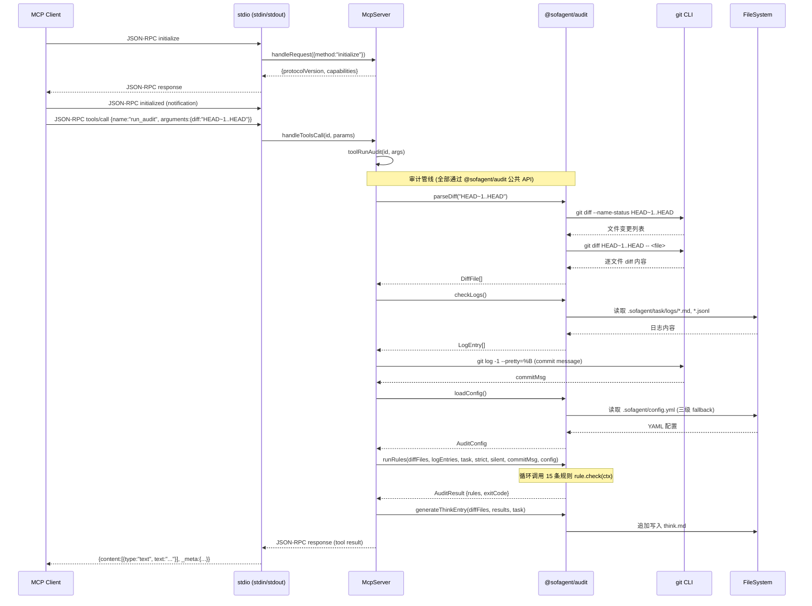
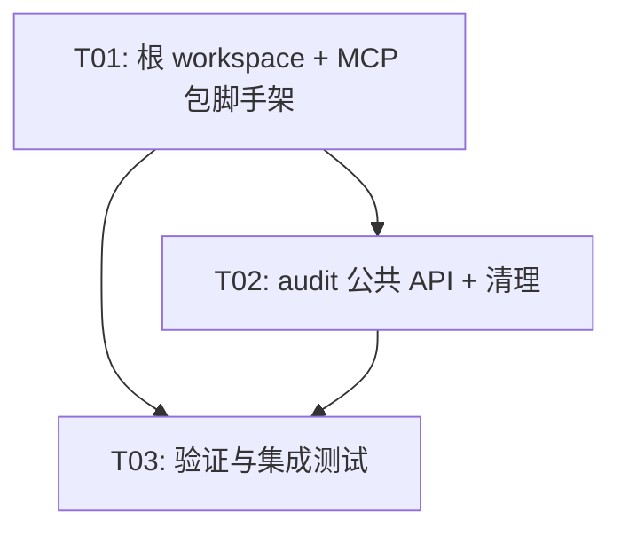

# 系统设计文档：MCP Server 从 @sofagent/audit 拆分为独立包 @sofagent/mcp

> **设计师**: Bob (Architect)  
> **日期**: 2026-07-01  
> **版本**: v0.99.1-mcp-split

---

## 0. 关键发现：依赖面分析

在阅读 `mcp-server.ts` 及其完整传递依赖链后，核心发现如下：

```
mcp-server.ts 直接导入：
├── ./diff-parser      → parseDiff()           [运行时调用]
├── ./log-checker       → checkLogs()           [运行时调用]
│   └── ./log-reader                            [传递依赖]
├── ./reporter          → runRules()            [运行时调用]
│   └── ./rules/index   → 全部 15 条规则        [传递依赖]
│       └── ./rules/types → AuditContext 等类型 [类型依赖]
├── ./config-loader     → loadConfig()          [运行时调用]
├── ./think-generator   → generateThinkEntry()  [运行时调用]
└── ./audit-history     → loadHistory()         [运行时调用，动态 require]
```

**结论：MCP Server 传递依赖了整个审计引擎。** 这不是一个「薄包装层」——它复用了完整的 `parseDiff → checkLogs → runRules` 审计管线。因此，拆分策略必须基于「MCP 作为 audit 的消费者」这一现实。

---

## Part A: 系统设计

### 1. Implementation Approach

#### 1.1 核心挑战

| 挑战 | 分析 |
|------|------|
| **传递依赖完整审计引擎** | mcp-server 不是薄包装——它调用 parseDiff/checkLogs/runRules 全链路，传递依赖 20+ 个源文件 |
| **类型共享** | `AuditContext`、`DiffFile`、`LogEntry`、`RuleCheck` 等类型在 `rules/types.ts` 中定义，被 reporter 和所有规则文件 import |
| **向后兼容** | 当前 `package.json` 中 `"sofagent-mcp": "dist/mcp-server.js"` bin 需平滑迁移 |
| **主 CLI 的 --mcp 标志** | `index.ts` 中 `require('./mcp-server')` 需要适配 |
| **零运行时依赖** | 两个包都不能引入第三方 npm 运行时依赖（Node.js 内置模块 + 彼此除外） |

#### 1.2 方案选择

**选定方案：npm workspaces 单体仓库 + MCP 依赖 Audit**

```
sofagent/                        ← 仓库根目录（新增 root package.json）
├── package.json                 ← workspaces: ["sofagent/audit", "sofagent/mcp"]
├── sofagent/
│   ├── audit/                   ← @sofagent/audit（现有包，增强导出）
│   │   └── package.json         ←   dependencies: {}（零外部依赖不变）
│   └── mcp/                     ← @sofagent/mcp（新包）
│       └── package.json         ←   dependencies: { "@sofagent/audit": "workspace:*" }
```

**为什么不用复制/共享包？**

- ❌ **复制代码**：mcp-server 传递依赖 20+ 文件，复制导致维护灾难（规则同步、bug 修复双份）
- ❌ **共享类型包 `@sofagent/types`**：过度抽象——类型定义与实现紧密耦合（`AuditContext.diffFiles` 类型来自 `diff-parser.ts`），提取共享包导致三个包的版本协调
- ❌ **独立 package.json 无 workspace**：需要 `npm link` 手动维护本地开发，CI 复杂

**✅ npm workspaces 优势**：
- 单一 `npm install` 安装所有依赖
- `workspace:*` 协议在 publish 时自动替换为实际版本号
- 零代码重复
- audit 增强公共 API 导出即可，不改变其内部结构

#### 1.3 audit 包是否继续引用 mcp 包？

**否。** 拆分后的依赖方向是单向的：

```
@sofagent/mcp  ──依赖──→  @sofagent/audit
```

处理 `index.ts` 中 `--mcp` 标志的两种策略：

- **策略 A（推荐）**：删除 `--mcp` 标志，用户直接运行 `sofagent-mcp`（语义更清晰，符合「一个命令一件事」的 UNIX 哲学）
- **策略 B（兼容）**：保留 `--mcp` 标志，改为 `try { require('@sofagent/mcp') } catch { ... }` 动态加载，`@sofagent/mcp` 作为 `optionalDependencies`

选择**策略 A**——`--mcp` 标志变为打印引导信息：「请直接运行 `sofagent-mcp` 启动 MCP Server」。这是最小的 breaking change，且引导更清晰。

### 2. File List

#### 2.1 新增文件

```
/Users/kongfangxun/Workbuddy/sofagent/
├── package.json                          # [NEW] 根 workspace 配置
└── sofagent/
    └── mcp/                              # [NEW] @sofagent/mcp 包
        ├── package.json                  # [NEW] 包配置
        ├── tsconfig.json                 # [NEW] TypeScript 配置
        └── src/
            └── mcp-server.ts             # [NEW] 从 audit/src/mcp-server.ts 移入
```

#### 2.2 修改文件

```
/Users/kongfangxun/Workbuddy/sofagent/sofagent/audit/
├── package.json                          # [MODIFY] 删除 sofagent-mcp bin，新增 public-api 导出
├── tsconfig.json                         # [MODIFY] exclude 中移除 mcp-server.ts 相关（或无需修改）
├── src/
│   ├── index.ts                          # [MODIFY] 删除 --mcp 标志处理，或改为引导信息
│   ├── mcp-server.ts                     # [DELETE] 移动到 mcp 包
│   └── public-api.ts                     # [NEW] 公共 API 导出文件（re-export 所有外部可用的函数和类型）
└── README.md                             # [MODIFY] 更新命令列表，移除 sofagent-mcp
```

#### 2.3 不变文件

```
audit/src/ 下的所有其他文件保持不变：
  diff-parser.ts, log-checker.ts, log-reader.ts, reporter.ts,
  config-loader.ts, think-generator.ts, audit-history.ts,
  rules/*.ts（所有规则文件 + types.ts）,
  benchmark.ts (已删除), verify.ts, verify-evidence.ts,
  skill-safety-check.ts, task-orchestrate.ts (已合并为 orchestrate-compare.ts) 等
```

### 3. Data Structures and Interfaces

```mermaid
classDiagram
    class AuditPublicAPI {
        <<barrel export>>
        +parseDiff(range: string): DiffFile[]
        +isInGitRepo(): boolean
        +getAddedLines(diffFile: DiffFile): string[]
        +getRemovedLines(diffFile: DiffFile): string[]
        +checkLogs(logDir?: string): LogEntry[]
        +getReadAccessMap(entries: LogEntry[]): Set~string~
        +hasTestOrBuildExecution(entries: LogEntry[]): boolean
        +runRules(diffFiles, logEntries, task?, strict?, silent?, commitMsg?, config?): AuditResult
        +loadConfig(cwd?: string): AuditConfig
        +generateThinkEntry(diffFiles, results, task?, opts?): void
        +loadHistory(limit?, dataDir?): AuditHistoryEntry[]
        +appendHistory(entry, dataDir?): void
        +pickLogReader(filePath: string): LogReader
    }

    class McpServer {
        -initialized: boolean
        +start(): void
        -handleRequest(request: JsonRpcRequest): Promise~void~
        -checkInitialized(id): boolean
        -handleInitialize(id, params): void
        -handleToolsList(id): void
        -handleToolsCall(id, params): Promise~void~
        -toolRunAudit(id, args): Promise~void~
        -toolGetThink(id, args): void
        -toolWriteThink(id, args): void
        -handleResourcesList(id): void
        -handleResourcesRead(id, params): void
        -resourceReadThinkLatest(id): void
        -resourceReadLogsToday(id): void
        -resourceReadAuditHistory(id): void
        -sendResult(id, result): void
        -sendError(id, code, message, data?): void
        -sendToolResult(id, payload): void
        -writeLine(line): void
    }

    class JsonRpcRequest {
        +jsonrpc: "2.0"
        +id: number | string | null
        +method: string
        +params?: Record~string, unknown~
    }

    class JsonRpcResponse {
        +jsonrpc: "2.0"
        +id: number | string | null
        +result?: unknown
        +error?: { code, message, data? }
    }

    class DiffFile {
        +path: string
        +status: "added" | "modified" | "deleted" | "renamed"
        +oldPath?: string
        +lines: string[]
    }

    class AuditResult {
        +rules: RuleCheck[]
        +exitCode: number
    }

    class AuditContext {
        +diffFiles: DiffFile[]
        +logEntries: LogEntry[]
        +task?: string
        +strict?: boolean
        +silent?: boolean
        +commitMsg?: string
        +config?: AuditConfig
    }

    AuditPublicAPI ..> DiffFile : 导出类型
    AuditPublicAPI ..> AuditResult : 导出类型
    AuditPublicAPI ..> AuditContext : 导出类型
    McpServer --> AuditPublicAPI : import from "@sofagent/audit"
    McpServer --> JsonRpcRequest : 使用
    McpServer --> JsonRpcResponse : 使用
    McpServer ..> DiffFile : 类型使用
    McpServer ..> AuditResult : 类型使用
    AuditContext --> DiffFile : 包含
```

### 4. Program Call Flow

以下是 MCP Client 调用 `run_audit` Tool 的完整调用序列：



### 5. Anything UNCLEAR

| 问题 | 假设 / 决策 |
|------|------------|
| **`--mcp` 标志如何处理** | 改为打印引导信息，告知用户直接使用 `sofagent-mcp` 命令。这是最小的 breaking change |
| **`@sofagent/audit` 是否需要 `optionalDependencies` 指向 `@sofagent/mcp`** | 不需要。依赖方向是单向的：mcp → audit |
| **测试文件是否移动** | mcp-server 当前没有独立的测试文件（`integration.test.ts` 和 `mcp-push-poc.ts` 留在 audit 包中）。MCP 包的测试可在后续添加 |
| **版本号策略** | `@sofagent/mcp` 初始版本与 `@sofagent/audit` 对齐为 `0.99.1`，后续独立演进 |
| **npm registry 发布顺序** | 先发布 `@sofagent/audit`（因为 mcp 依赖它），再发布 `@sofagent/mcp` |
| **workspace 协议转换** | 使用 `workspace:*`，`npm publish` 时自动替换为实际版本号（需 npm 7+ / workspace 支持） |

---

## Part B: Task Decomposition

### 6. Required Packages

```
@sofagent/audit@^0.99.0           # MCP 包的唯一运行时依赖（workspace:* 本地开发）
typescript@^5.4.0                 # devDependency，编译 TypeScript
@types/node@^20.0.0               # devDependency，Node.js 类型定义
```

注意：`@sofagent/mcp` 不引入任何第三方运行时依赖。唯一的运行时依赖是同项目的 `@sofagent/audit`，而 audit 本身也零外部依赖。

### 7. Task List (ordered by dependency)

#### T01: 项目基础设施 — 根 workspace + MCP 包骨架

**Task ID**: T01  
**Task Name**: 根 workspace 配置 + MCP 包脚手架  
**Source Files**:
- `/Users/kongfangxun/Workbuddy/sofagent/package.json`（新建）
- `/Users/kongfangxun/Workbuddy/sofagent/sofagent/mcp/package.json`（新建）
- `/Users/kongfangxun/Workbuddy/sofagent/sofagent/mcp/tsconfig.json`（新建）
- `/Users/kongfangxun/Workbuddy/sofagent/sofagent/mcp/src/mcp-server.ts`（从 audit 移入 + 修改 import 路径）

**Dependencies**: 无（第一任务）  
**Priority**: P0  

**详细内容**:
1. 创建根 `package.json`：
   ```json
   {
     "private": true,
     "workspaces": ["sofagent/audit", "sofagent/mcp"]
   }
   ```
2. 创建 `sofagent/mcp/package.json`：
   ```json
   {
     "name": "@sofagent/mcp",
     "version": "0.99.1",
     "description": "sofagent MCP Server — JSON-RPC 2.0 over stdio，暴露审计能力给 MCP Client",
     "main": "dist/mcp-server.js",
     "bin": { "sofagent-mcp": "dist/mcp-server.js" },
     "scripts": {
       "build": "tsc",
       "prepublishOnly": "npm run build && chmod +x dist/mcp-server.js",
       "start": "node dist/mcp-server.js",
       "check": "tsc --noEmit"
     },
     "dependencies": { "@sofagent/audit": "workspace:*" },
     "devDependencies": { "@types/node": "^20.0.0", "typescript": "^5.4.0" },
     "engines": { "node": ">=18" },
     "files": ["dist/", "README.md"]
   }
   ```
3. 创建 `sofagent/mcp/tsconfig.json`：
   ```json
   {
     "compilerOptions": {
       "target": "ES2022",
       "module": "commonjs",
       "lib": ["ES2022"],
       "outDir": "./dist",
       "rootDir": "./src",
       "strict": true,
       "esModuleInterop": true,
       "skipLibCheck": true,
       "forceConsistentCasingInFileNames": true,
       "declaration": true,
       "sourceMap": true,
       "moduleResolution": "node"
     },
     "include": ["src/**/*.ts"],
     "exclude": ["node_modules", "dist"]
   }
   ```
4. 从 `audit/src/mcp-server.ts` 复制代码到 `mcp/src/mcp-server.ts`，修改 import 路径：
   ```typescript
   // 旧：相对路径导入
   import { parseDiff } from './diff-parser';
   import { checkLogs } from './log-checker';
   import { runRules, type AuditResult } from './reporter';
   import { loadConfig } from './config-loader';
   import { generateThinkEntry } from './think-generator';
   // 动态 require
   const { loadHistory } = require('./audit-history');

   // 新：从 @sofagent/audit 公共 API 导入
   import {
     parseDiff,
     checkLogs,
     runRules,
     loadConfig,
     generateThinkEntry,
     loadHistory,
   } from '@sofagent/audit';
   import type { AuditResult } from '@sofagent/audit';
   ```
5. 移除 `getSofagentDataDir()` 本地定义（`@sofagent/audit` 的 `think-generator.ts` 已有相同实现，MCP 可通过 context 获取或保留独立副本）——实际上 MCP 自己有 `getSofagentDataDir()`，且用于 think/logs/audit-history 资源读取，该函数保留在 mcp-server.ts 中不变。

#### T02: @sofagent/audit 公共 API 导出 + 清理

**Task ID**: T02  
**Task Name**: audit 包增强公共 API 导出，移除 mcp-server，适配 bin  
**Source Files**:
- `/Users/kongfangxun/Workbuddy/sofagent/sofagent/audit/src/public-api.ts`（新建）
- `/Users/kongfangxun/Workbuddy/sofagent/sofagent/audit/package.json`（修改）
- `/Users/kongfangxun/Workbuddy/sofagent/sofagent/audit/src/index.ts`（修改 — `--mcp` 标志处理）
- `/Users/kongfangxun/Workbuddy/sofagent/sofagent/audit/README.md`（修改 — 更新命令列表）

**Dependencies**: T01（需要 workspace 已配置，以便本地验证 mcp 包的导入）  
**Priority**: P0  

**详细内容**:
1. 创建 `audit/src/public-api.ts`（re-export 所有 MCP 需要的外部 API）：
   ```typescript
   // diff-parser
   export { parseDiff, isInGitRepo, getAddedLines, getRemovedLines } from './diff-parser';
   export type { DiffFile, NumstatEntry } from './diff-parser';
   // log-checker
   export { checkLogs, getReadAccessMap, hasTestOrBuildExecution } from './log-checker';
   export type { LogEntry } from './log-checker';
   // reporter
   export { runRules } from './reporter';
   export type { AuditResult } from './reporter';
   // config-loader
   export { loadConfig, loadEnvConfig, DEFAULT_CONFIG, ENV_DEFAULTS } from './config-loader';
   export type { AuditConfig, SofaEnvConfig } from './config-loader';
   // think-generator
   export { generateThinkEntry } from './think-generator';
   export type { ThinkEntryOptions } from './think-generator';
   // audit-history
   export { loadHistory, appendHistory, clearHistory, getHistoryFilePath } from './audit-history';
   export type { AuditHistoryEntry } from './audit-history';
   // rules/types
   export type { AuditContext, RuleCheck, Rule, EvidenceMode, RuleClass } from './rules/types';
   // log-reader
   export { pickLogReader } from './log-reader';
   export type { LogReader } from './log-reader';
   ```
2. 修改 `audit/package.json`：
   - 删除 `"sofagent-mcp": "dist/mcp-server.js"` 从 `bin` 字段
   - 在 `exports` 字段中添加公共 API 入口（或通过 `main` 保持向后兼容，同时在 package.json 中添加 `"types"` 指向声明文件）
   - 实际上最简单的方案：`main` 保持为 `dist/index.js`（CLI 入口不变），`@sofagent/mcp` 通过 `@sofagent/audit/dist/public-api` 导入。但为了规范，使用 `exports` 字段：
   ```json
   "exports": {
     ".": {
       "types": "./dist/public-api.d.ts",
       "default": "./dist/public-api.js"
     },
     "./package.json": "./package.json"
   },
   "types": "./dist/public-api.d.ts"
   ```
   - 同时保留 `"main": "dist/index.js"` 以兼容直接 `node dist/index.js` 使用。
3. 修改 `audit/src/index.ts`：`--mcp` 标志改为打印引导信息：
   ```typescript
   // 旧：
   if (args.mcp) {
     require('./mcp-server');
     return;
   }
   // 新：
   if (args.mcp) {
     console.log('[sofagent] MCP Server 已拆分为独立包。请直接运行：');
     console.log('  npx @sofagent/mcp');
     console.log('  或安装后运行：sofagent-mcp');
     process.exit(0);
   }
   ```
4. 从 `audit/tsconfig.json` 的 `exclude` 中移除 `mcp-server.ts` 相关配置（当前未 exclude mcp-server.ts，无需修改，但需删除源文件）
5. 删除 `audit/src/mcp-server.ts`

#### T03: 验证与集成测试

**Task ID**: T03  
**Task Name**: 构建验证、集成测试、向后兼容确认  
**Source Files**:
- `/Users/kongfangxun/Workbuddy/sofagent/sofagent/audit/tests/`（运行全部 406 个现有测试）
- `/Users/kongfangxun/Workbuddy/sofagent/sofagent/mcp/`（验证 mcp 包构建）

**Dependencies**: T01, T02  
**Priority**: P1  

**详细内容**:
1. 在根目录运行 `npm install`（workspace 安装）
2. 构建 audit 包：`cd sofagent/audit && npm run build`
3. 构建 mcp 包：`cd sofagent/mcp && npm run build`
4. 运行 audit 全部测试：`cd sofagent/audit && npm test`（确认 406 个测试全绿）
5. 手动验证 MCP Server 启动：`node sofagent/mcp/dist/mcp-server.js` → 发送 `{"jsonrpc":"2.0","id":1,"method":"initialize"}` → 验证响应
6. 验证 audit CLI 仍然正常工作：`node sofagent/audit/dist/index.js --diff HEAD~1..HEAD`
7. 验证 `--mcp` 标志打印引导信息：`node sofagent/audit/dist/index.js --mcp`
8. 确认旧 bin `sofagent-audit` 仍通过 audit 包正确链接

### 8. Shared Knowledge

```
- 两个包的 tsconfig 都使用 target: ES2022, module: commonjs（保持一致）
- 两个包都遵循零外部运行时依赖原则（@sofagent/mcp 的唯一依赖是同项目的 @sofagent/audit）
- 所有类型通过 @sofagent/audit 的 public-api.ts 统一导出
- 本地开发使用 npm workspaces + workspace:* 协议
- npm publish 时 workspace:* 自动替换为实际版本号
- 发布顺序：先 @sofagent/audit，后 @sofagent/mcp
- MCP Server 的所有日志输出到 stderr（不污染 stdout JSON-RPC 流）
- SOFAGENT_DATA 环境变量在两个包中语义一致
- 文件权限：prepublishOnly 中 chmod +x 确保 bin 可执行
```

### 9. Task Dependency Graph



---

## 附录 A：依赖面完整映射

```
mcp-server.ts 导入链（拆分后）：

@sofagent/mcp/src/mcp-server.ts
  └─import from "@sofagent/audit"
      ├── parseDiff()        ← diff-parser.ts
      ├── checkLogs()        ← log-checker.ts → log-reader.ts
      ├── runRules()         ← reporter.ts → rules/index.ts → 15 rule files → rules/types.ts
      ├── loadConfig()       ← config-loader.ts
      ├── generateThinkEntry() ← think-generator.ts
      └── loadHistory()      ← audit-history.ts → config-loader.ts

所有运行时依赖通过 @sofagent/audit 包满足，MCP 包自身零代码重复。
```

## 附录 B：关键决策记录

| 决策 | 方案 | 理由 |
|------|------|------|
| 共享代码 | npm workspace + 依赖 | 避免代码重复，类型安全，20+ 传递依赖文件不宜复制 |
| `--mcp` 标志 | 改为打印引导信息 | 最小 breaking change，语义更清晰 |
| 公共 API 入口 | `public-api.ts` barrel export | 集中管理外部可见 API，不污染 index.ts（CLI 入口） |
| workspace 协议 | `workspace:*` | npm publish 自动替换版本号，本地开发零配置 |

## 附录 C：类关系图

```mermaid
classDiagram
    class AuditPublicAPI {
        &lt;&lt;barrel export&gt;&gt;
        +parseDiff(range: string): DiffFile[]
        +isInGitRepo(): boolean
        +getAddedLines(diffFile: DiffFile): string[]
        +getRemovedLines(diffFile: DiffFile): string[]
        +checkLogs(logDir?: string): LogEntry[]
        +getReadAccessMap(entries: LogEntry[]): Set~string~
        +hasTestOrBuildExecution(entries: LogEntry[]): boolean
        +runRules(diffFiles, logEntries, task?, strict?, silent?, commitMsg?, config?): AuditResult
        +loadConfig(cwd?: string): AuditConfig
        +generateThinkEntry(diffFiles, results, task?, opts?): void
        +loadHistory(limit?, dataDir?): AuditHistoryEntry[]
        +appendHistory(entry, dataDir?): void
        +pickLogReader(filePath: string): LogReader
    }
    class McpServer {
        -initialized: boolean
        +start(): void
        -handleRequest(request: JsonRpcRequest): Promise~void~
        -checkInitialized(id): boolean
        -handleInitialize(id, params): void
        -handleToolsList(id): void
        -handleToolsCall(id, params): Promise~void~
        -toolRunAudit(id, args): Promise~void~
        -toolGetThink(id, args): void
        -toolWriteThink(id, args): void
        -handleResourcesList(id): void
        -handleResourcesRead(id, params): void
        -resourceReadThinkLatest(id): void
        -resourceReadLogsToday(id): void
        -resourceReadAuditHistory(id): void
        -sendResult(id, result): void
        -sendError(id, code, message, data?): void
        -sendToolResult(id, payload): void
        -writeLine(line): void
    }
    class JsonRpcRequest {
        +jsonrpc: "2.0"
        +id: number | string | null
        +method: string
        +params?: Record~string, unknown~
    }
    class JsonRpcResponse {
        +jsonrpc: "2.0"
        +id: number | string | null
        +result?: unknown
        +error?: { code, message, data? }
    }
    class DiffFile {
        +path: string
        +status: "added" | "modified" | "deleted" | "renamed"
        +oldPath?: string
        +lines: string[]
    }
    class LogEntry {
        +timestamp: Date
        +operation: string
        +file?: string
        +raw: string
    }
    class AuditResult {
        +rules: RuleCheck[]
        +exitCode: number
    }
    class AuditContext {
        +diffFiles: DiffFile[]
        +logEntries: LogEntry[]
        +task?: string
        +strict?: boolean
        +silent?: boolean
        +commitMsg?: string
        +config?: AuditConfig
    }
    class AuditConfig {
        +lowRiskPatterns: string[]
        +testPatterns: string[]
        +carefulModifyThreshold: number
        +extendedRulesEnabled: boolean
    }
    class RuleCheck {
        +name: string
        +number: number
        +status: "PASS" | "WARN" | "FAIL"
        +details: string[]
        +evidenceMode?: EvidenceMode
        +ruleClass?: RuleClass
    }
    class LogReader {
        &lt;&lt;interface&gt;&gt;
        +extractOperation(content: string): string
        +extractFileReferences(content: string): string[]
    }
    AuditPublicAPI ..> DiffFile
    AuditPublicAPI ..> LogEntry
    AuditPublicAPI ..> AuditResult
    AuditPublicAPI ..> AuditContext
    AuditPublicAPI ..> AuditConfig
    AuditPublicAPI ..> RuleCheck
    AuditPublicAPI ..> LogReader
    McpServer --> AuditPublicAPI
    McpServer --> JsonRpcRequest
    McpServer --> JsonRpcResponse
    AuditContext --> DiffFile
    AuditContext --> LogEntry
    AuditContext --> AuditConfig
    AuditResult --> RuleCheck
```

## 附录 D：MCP 调用时序图

```mermaid
sequenceDiagram
    participant Client as MCP Client
    participant Stdio as stdio (stdin/stdout)
    participant McpSrv as McpServer<br/>(@sofagent/mcp)
    participant Audit as @sofagent/audit<br/>公共 API
    participant Git as git CLI
    participant FS as FileSystem

    Note over Client,FS: === 握手阶段 ===
    Client->>Stdio: JSON-RPC initialize
    Stdio->>McpSrv: handleRequest({method:"initialize"})
    McpSrv-->>Stdio: {protocolVersion:"2024-11-05", capabilities:{tools, resources}}
    Stdio-->>Client: JSON-RPC response
    Client->>Stdio: JSON-RPC initialized (notification)

    Note over Client,FS: === Tool 调用: run_audit ===
    Client->>Stdio: JSON-RPC tools/call
    Stdio->>McpSrv: handleToolsCall(id, params)
    McpSrv->>McpSrv: toolRunAudit(id, args)
    Note over McpSrv,Audit: 审计管线（全部通过 @sofagent/audit 公共 API）
    McpSrv->>Audit: parseDiff("HEAD~1..HEAD")
    Audit->>Git: git diff --name-status
    Git-->>Audit: 文件变更列表
    Audit->>Git: git diff -- &lt;file&gt;
    Git-->>Audit: 逐文件 diff 内容
    Audit-->>McpSrv: DiffFile[]
    McpSrv->>Audit: checkLogs()
    Audit->>FS: 读取 .sofagent/task/logs/
    FS-->>Audit: 日志内容
    Audit->>Audit: pickLogReader → 解析
    Audit-->>McpSrv: LogEntry[]
    McpSrv->>Git: git log -1 --pretty=%B
    Git-->>McpSrv: commitMsg
    McpSrv->>Audit: loadConfig()
    Audit->>FS: 读取 config.yml (三级 fallback)
    FS-->>Audit: YAML 配置
    Audit-->>McpSrv: AuditConfig
    McpSrv->>Audit: runRules(diffFiles, logEntries, ...)
    Note over Audit: 构建 AuditContext<br/>循环调用 15 条规则 rule.check(ctx)
    Audit-->>McpSrv: AuditResult {rules, exitCode}
    McpSrv->>Audit: generateThinkEntry(diffFiles, results, task)
    Audit->>FS: 追加写入 .sofagent/think.md
    McpSrv-->>Stdio: JSON-RPC response (tool result)
    Stdio-->>Client: {content:[{...}], _meta:{...}}

    Note over Client,FS: === Resource 调用 ===
    Client->>Stdio: JSON-RPC resources/read
    Stdio->>McpSrv: handleResourcesRead(id, params)
    McpSrv->>FS: 读取 .sofagent/think.md
    FS-->>McpSrv: think.md 内容
    McpSrv->>McpSrv: 解析最后一条 ## 条目
    McpSrv-->>Stdio: JSON-RPC response (resource content)
    Stdio-->>Client: {contents:[{uri:"think://latest", ...}]}

    Note over Client,FS: === 关闭阶段 ===
    Client->>Stdio: JSON-RPC shutdown
    Stdio->>McpSrv: handleRequest({method:"shutdown"})
    McpSrv-->>Stdio: {result:null}
    Client->>Stdio: JSON-RPC exit
    Stdio->>McpSrv: handleRequest({method:"exit"})
    McpSrv->>McpSrv: process.exit(0)
```
